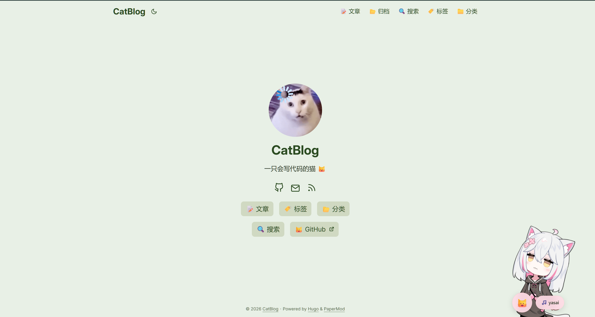
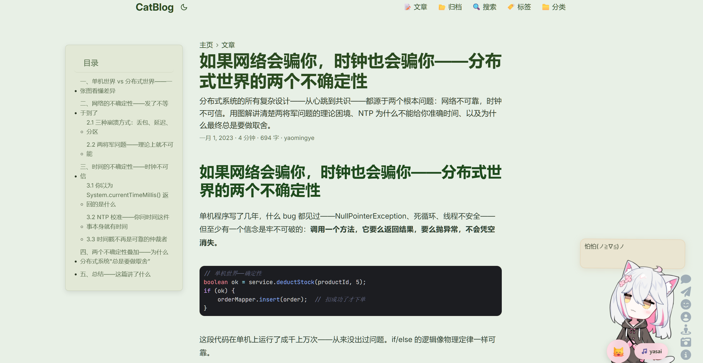
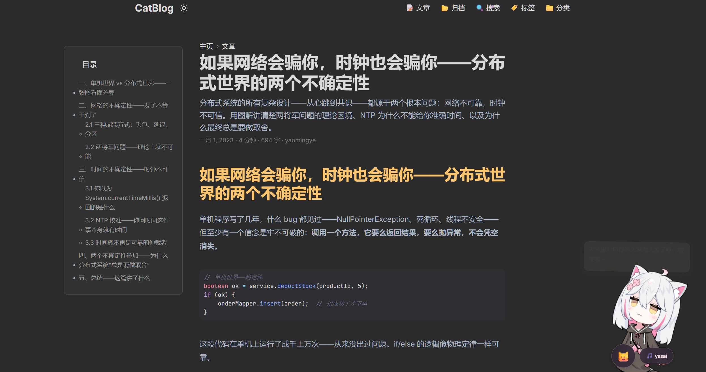

# CatBlog — 基于 Hugo + PaperMod 的深度定制博客

> 一只会写代码的猫的博客 🐱

**在线地址：** [https://yaocat55.github.io/](https://yaocat55.github.io/)

---


### 首页（Profile Mode）



### 阅读页（浅色模式）




### 阅读页（深色模式）



---

## 基础信息

| 项目 | 说明 |
|------|------|
| **框架** | [Hugo](https://gohugo.io/) |
| **主题** | [PaperMod](https://github.com/adityatelange/hugo-PaperMod)（Git Submodule） |
| **部署** | GitHub Pages（`yaocat55.github.io`） |
| **语言** | 中文（zh） |
| **内容** | 技术博客，涵盖后端、数据库、系统设计 |

---

## 修改总览

在 PaperMod 默认主题基础上，从 **布局、样式、功能、交互** 四个维度做了以下定制：

| 维度 | 修改项 | 涉及文件 |
|------|--------|----------|
| 布局 | 文章页 Mermaid 支持 | `layouts/_default/single.html` |
| 布局 | B 站视频短代码 | `layouts/shortcodes/bilibili.html` |
| 布局 | Mermaid 代码块渲染钩子 | `layouts/_default/_markup/render-codeblock-mermaid.html` |
| 样式 | 完整主题配色 + 智能代码高亮 | `assets/css/extended/custom.css` |
| 功能 | Mermaid / KaTeX / 图片缩放 / Pjax | `layouts/partials/extend_head.html` |
| 功能 | Live2D 看板娘 / 猫爪特效 / Cat Radio | `layouts/partials/extend_footer.html` |

---

## 一、布局层修改

### 1.1 文章单页模板 (`layouts/_default/single.html`)

覆盖 PaperMod 默认 `single.html`，新增 Mermaid 图表支持：

- 检测页面是否包含 Mermaid 图表（通过 `.Page.Store.Get "hasMermaid"`）
- 若包含则自动加载 Mermaid ESM 模块，并跟随 PaperMod 主题自动切换亮/暗配色
- 保留 PaperMod 原有的面包屑、元信息、封面、目录、标签、分享等全部功能

### 1.2 B 站视频短代码 (`layouts/shortcodes/bilibili.html`)

自定义 Hugo Shortcode，在文章中嵌入 B 站视频：

```markdown

```

- 支持 `bvid` 和 `page`（分 P）参数
- 响应式 16:9 容器，自适应宽度

### 1.3 Mermaid 渲染钩子 (`layouts/_default/_markup/render-codeblock-mermaid.html`)

将 ` ```mermaid ` 代码块渲染为 `<pre class="mermaid">`，并通过 `.Page.Store` 标记页面，触发 single.html 中的 Mermaid 初始化脚本。

---

## 二、样式层修改 (`assets/css/extended/custom.css`)

共约 **1400 行**，覆盖 PaperMod 默认样式，分为 20 个模块：

### 2.1 字体系统

- **正文字体：** Inter → PingFang SC → Microsoft YaHei（中西文混排优化）
- **代码字体：** JetBrains Mono → Cascadia Code → Fira Code → Consolas
- 启用 `font-synthesis: none` 避免字体合成伪粗/伪斜
- 通过 Google Fonts 加载 Inter + JetBrains Mono（见 `extend_head.html`）

### 2.2 浅色主题 — 「晨雾竹林」配色

| 角色 | 色值 | 说明 |
|------|------|------|
| 背景 | `#dadfce` / `#e8f0e6` | 柔和晨雾绿 |
| 卡片 | `#f2efdf` | 米白带绿 |
| 标题 | `#2a4a20` | 深墨绿 |
| 正文 | `#2c3825` | 深灰绿，保证阅读舒适 |
| 链接 | `#3d6b35` | 清新醒目绿 |
| 代码块背景 | `#e2e8d6` | 浅绿底 |

### 2.3 深色主题 — IDEA Darcula 配色

| 角色 | 色值 | 说明 |
|------|------|------|
| 背景 | `#2b2b2b` | IDE 经典暗色 |
| 卡片 | `#323232` | 稍亮分层 |
| 标题 | `#ffc66d` | 金黄色强调 |
| 正文 | `#a9b7c6` | 柔和高可读 |
| 链接 | `#ffc66d` | 金色链接 |

### 2.4 智能代码高亮（按语言分 IDE 配色）

| 语言 | 浅色模式 | 深色模式 |
|------|----------|----------|
| Java / Kotlin / Go / Maven / XML | IDEA Light 配色 | IDEA Darcula 配色 |
| TypeScript / JavaScript / JSX / TSX | VS Code Light 配色 | VS Code Dark+ 配色 |
| Bash / Shell / Zsh | Catppuccin Mocha 配色（暗底） | Catppuccin Mocha 配色（暗底） |

每种语言覆盖了 Chroma 高亮的所有 token 类型（注释、关键字、字符串、数字、函数名、类名、操作符等）。

### 2.5 其他样式模块

| 模块 | 主要修改 |
|------|----------|
| 文章卡片 | 圆角 16px、阴影、hover 上浮 4px |
| 标题系统 | h1-h4 独立配色、h2 底部边框、h3 hover 平移 |
| 代码块 | 圆角 12px、自定义滚动条、hover 阴影 |
| 行内代码 | 浅色绿底/深色半透明白底、hover 加深 |
| 表格 | 斑马纹、hover 高亮行、移动端横向滚动 |
| 引用块 | 左边框强调、hover 平移、嵌套支持 |
| 图片 | 居中圆角阴影、hover 放大 1.02x |
| 目录 (TOC) | 三断点响应式（大屏固定侧边栏 / 中屏 / 移动端折叠） |
| 标签云 | 胶囊形状、hover 上浮变色 |
| 搜索框 | 主题适配背景 |
| 代码复制按钮 | hover 显示、主题适配 |
| 个人头像 | 圆形 150px、hover 放大 |
| 脚注 | 顶部分隔线、代码字体编号 |
| 打印样式 | 隐藏装饰、黑白输出 |
| 无障碍 | `prefers-reduced-motion` 支持 |

---

## 三、功能增强 (`layouts/partials/extend_head.html`)

### 3.1 Mermaid 图表

- CDN 加载 `mermaid.min.js`
- 从 PaperMod CSS 变量继承主题色
- 支持 Pjax 后重新初始化

### 3.2 图片 & Mermaid 缩放

- 点击文章内图片/Mermaid 图表展开至 92vw 全屏遮罩
- 按 `Esc` 或点击遮罩外区域关闭
- 自动排除头像（`.profile` 内）和导航/页脚中的图片
- 展开时显示水平滚动条（超宽 SVG 自动适配）
- 展开面板自动居中，内容较少时居中、较多时左对齐滚动

### 3.3 KaTeX 数学公式

- CDN 加载 KaTeX 0.16.11 + auto-render
- 支持 `$...$`（行内）和 `$$...$$`（块级）
- 自动跳过 `<pre>`、`<code>`、代码高亮块等——避免与代码块中的 `$` 冲突
- 支持 Pjax 后重新渲染

### 3.4 InstantClick Pjax

- CDN 加载 InstantClick 3.1
- `mousedown` 预加载，实现无刷新页面切换
- Pjax 完成后自动重新初始化所有动态组件（Mermaid、KaTeX、图片缩放）
- 触发自定义 `pjax:complete` 事件供其他脚本（如 Cat Radio）监听

### 3.5 字体加载

- Google Fonts 预连接 + 异步加载 Inter 和 JetBrains Mono

---

## 四、交互增强 (`layouts/partials/extend_footer.html`)

### 4.1 Live2D 看板娘

- 使用 [live2d-widget-v3](https://github.com/letere-gzj/live2d-widget-v3) 库
- 自定义模型资源（CDN 托管）
- 仅在桌面端（≥768px）加载，移动端自动跳过
- 强制固定在右下角
- 支持拖拽、切换模型、切换皮肤、截图等工具
- 提示框主题适配

### 4.2 猫爪点击特效 🐾

- 点击页面任意位置生成猫爪 emoji 动画
- 浅色模式：绿色爪印 `#2f7d32`
- 深色模式：荧光绿爪印带发光效果 `#9cffb5`
- 随机旋转角度，向上飘散后消失（1.8s）

### 4.3 Cat Radio 音乐播放器

- 固定在右下角（看板娘左侧）的悬浮音乐播放器
- 内置 5 首背景音乐（`/music/` 目录下 mp3 文件）
- 左键点击：播放/暂停
- 右键点击：随机切歌
- 自动播放下一首
- 3 秒定时保存播放进度，支持页面切换后恢复
- 深色/浅色模式适配
- 移动端自动隐藏歌名标签
- 通过看板娘气泡或自定义 tip 显示当前播放信息

---

## 五、配置文件关键设置 (`hugo.toml`)

| 设置 | 值 | 说明 |
|------|-----|------|
| `theme` | `PaperMod` | 通过 Git Submodule 引入 |
| `pygmentsUseClasses` | `true` | 配合自定义 CSS 按语言配色 |
| `markup.goldmark.renderer.unsafe` | `true` | 允许 Markdown 中使用原始 HTML |
| `markup.tableOfContents.startLevel` | `2` | 目录从 h2 开始 |
| `markup.tableOfContents.endLevel` | `3` | 目录到 h3 结束 |
| `params.profileMode.enabled` | `true` | 首页使用个人档模式 |
| `params.defaultTheme` | `auto` | 跟随系统自动切换亮暗 |
| `outputs.home` | `["HTML","RSS","JSON"]` | 支持搜索 JSON 索引 |

### Profile Mode 配置

首页展示猫猫 GIF、标题、副标题 + 5 个导航按钮（文章、标签、分类、搜索、GitHub）。

### 社交图标

GitHub → 邮件 → RSS 三个社交图标。

---

## 目录结构（自定义部分）

```
quickstart/
├── assets/
│   └── css/
│       └── extended/
│           └── custom.css          # 核心：1400 行深度定制样式
├── layouts/
│   ├── _default/
│   │   ├── single.html             # 文章页 + Mermaid 支持
│   │   └── _markup/
│   │       └── render-codeblock-mermaid.html  # Mermaid 渲染钩子
│   ├── partials/
│   │   ├── extend_head.html        # 头部注入（Mermaid/KaTeX/Pjax/字体/图片缩放）
│   │   └── extend_footer.html      # 页脚注入（Live2D/猫爪特效/Cat Radio）
│   └── shortcodes/
│       └── bilibili.html           # B 站视频短代码
├── static/
│   ├── images/                     # 博客图片 & SVG 图表
│   └── music/                      # Cat Radio 音乐文件（5 首 mp3）
├── hugo.toml                       # 站点配置
└── themes/
    └── PaperMod/                   # 上游主题（Git Submodule，未修改）
```

---

## 与上游 PaperMod 的差异原则

- **不直接修改 `themes/PaperMod/` 内的任何文件**，所有定制通过 Hugo 的模板覆盖机制实现
- `layouts/` 下的文件会覆盖主题同名模板
- `assets/css/extended/custom.css` 通过 PaperMod 的扩展 CSS 机制自动加载
- `layouts/partials/extend_head.html` 和 `extend_footer.html` 是 PaperMod 预留的注入点
