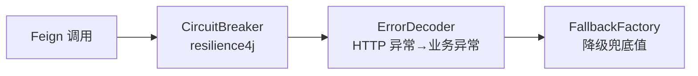

## 今日工作

### 1. Admin 控制器合并重构

mall-admin 的 controller 层从 15 个砍到了 7 个。

删了 8 个——4 个 internal 控制器（`UserInternalController`、`RoleInternalController`、`DeptInternalController`、`JobInternalController`），4 个关联表控制器（`UserRoleController`、`RoleMenuController`、`RoleDeptController`、`UserAvatarController`）。

理由很简单：internal 控制器的方法本来就是对同一张表查数据，合并到 `UserController`、`RoleController`、`JobController` 就够了。关联表控制器纯 CRUD，也没人调，留它过年。

`UserFeignClient` 的请求路径也顺手从 `/v1/internal/user/*` 改到了 `/v1/auth/user/*`，因为 internal 路径已经不存在了。

### 2. Swagger 描述统一

之前 `@Operation(summary = "通过id查询")`、`@Operation(description = "删除")` 这种写了等于没写。

这次给 6 个 Controller 的每个接口都加了三段式描述——**认证要求 + 参数说明 + 业务说明**：

```
需 Bearer Token + admin 角色 | 查询参数：id（用户ID）
无需认证（公开接口）| 无参，返回全部角色列表
需 Bearer Token | 请求体：RoleConditionEntity（分页条件）
```

顺便把白名单逻辑的现状写进了 Security 注释，哪些接口免登录一目了然。

### 3. Feign 熔断降级体系

这是今天的大头。项目之前 Feign 调用异常处理几乎裸奔——`FeignResultDecoder` 的核心逻辑被人注释掉了，没有 `ErrorDecoder`、没有 `FallbackFactory`、没有断路器。

三层补齐：



**ErrorDecoder（common-web）：**
4xx → `BusinessException`（不重试），5xx → `RetryableException`（触发 resilience4j 重试）。全局生效，所有服务都能吃到。

**FallbackFactory（各 client 模块）：**
给 8 个关键 FeignClient 配了降级实现——`UserFeignClient`、`OrderFeignClient`、`ProductFeignClient`、`DictFeignClient`、`SmsFeignClient` 等。降级时返回 null/空列表/0，避免级联故障。

**Nacos 配置（文档已产出，待写入）：**
写了 `docs/31-Resilience4j-Nacos配置指南.md`，分 C 端高流量（product / order / pay / mobile-bff）和 B 端管理（admin / basic / message 等）两套方案：

- C 端：快速熔断（窗口 10 / 阈值 50%），可加限流
- B 端：保守熔断（窗口 20 / 阈值 70%），超时更宽松

### 4. 测试脚本 & 接口验证

`script/admin-api-test.sh` 更新后跑了一遍——20 个接口全绿通过 ✅。也确认了旧 internal 路径确实返回 404（新代码正确部署）。

## 明日计划

- 把 resilience4j 的 Nacos 配置写入各服务
- 继续观望有没有其他需要 ErrorDecoder 兜底的 Feign 调用链路
- 确认 PayFeignClient 是否需要 FallbackFactory（支付链路对降级更敏感）
