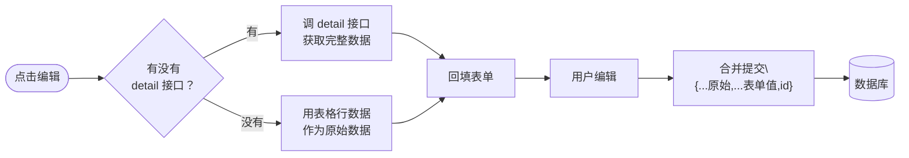

# 字段对不上、表格不刷新、缓存怎么配——管理后台前端开发的一线笔记

## 先讲个悲催的开场

某开发者接到一个任务：给现有的微服务架构配一个管理后台前端。技术栈很明确——Vite + React + TypeScript + MUI。服务端是 BFF 模式，后端已经写好了接口，Swagger 文档也挂好了。看起来一切都很美好，对吧？

结果一上手就发现：**接口返回的字段跟预期对不上。**

后端 DTO 里的 `validStatus` 被写成了 `status` ， `saleCount` 被记成了 `sales` ， `pageNo` 跟 `pageNum` 来回横跳。每个接口调一次，就踩一个坑。

> ⚠️ 新手提示：如果你也在做前后端对接，**直接看 Swagger JSON 是最可靠的**。Swagger UI 页面可能会有渲染延迟，但 `/v3/api-docs` 给出的 JSON 是后端代码直接生成的，字段名一个都不会错。

## 问题一：怎么对齐接口字段？

### 血的教训：不要靠"我记得"

最开始某开发者的做法是：看一眼后端 Controller 代码里的参数名，然后回前端照着写。

```java
// 后端 Controller
@PostMapping("/update")
public ApiResult<Void> update(@RequestBody ProductDTO entity) {
    // ...
}
```

ProductDTO 长什么样？点进去看。

```java
public class ProductDTO {
    private Long id;
    private String name;
    private Integer saleCount;  // 记住了，是 saleCount
    // ... 还有 21 个字段
}
```

好，记住了。去前端写类型定义：

```typescript
// 前端类型
interface ProductDTO {
  id?: number
  name?: string
  sales?: number  // 完了，脑子里记成了 sales
}
```

结果就是：列表页渲染的时候数值永远对不上，后端返回的 `saleCount` 前端读的是 `sales` ，永远 undefined。

### 正确的做法：直接拿 Swagger JSON 解析

```bash
curl http://localhost:8090/v3/api-docs | python3 -c "
import json, sys
data = json.load(sys.stdin)
schemas = data['components']['schemas']
for name in ['ProductDTO', 'UserDTO', 'OrderDTO']:
    s = schemas.get(name)
    if s:
        print(f'{name}:')
        for k, v in s['properties'].items():
            print(f'  {k}: {v.get(\"type\", \"?\")}')
"
```

用代码生成代码，或者至少用脚本列出字段名。**人脑不适合做这种精确映射的工作。**

### 枚举值也别放过

Swagger 的 `@Schema(allowableValues)` 标注了每个整数字段的枚举含义。比如这个：

```json
// 从 Swagger JSON 提取
"type": {
  "type": "integer",
  "description": "类型 1：现金券 2：阶梯满减 3：每满减 4：通用折扣 5：满N件折扣 6：满Y元折扣"
}
```

前端直接拿这个描述写枚举映射表，比看需求文档靠谱一百倍。

```typescript
const COUPON_TYPE_MAP = {
  1: '现金券',
  2: '阶梯满减',
  3: '每满减',
  4: '通用折扣',
  5: '满N件折扣',
  6: '满Y元折扣',
}
```

## 问题二：update 接口传什么字段？

这是今天踩得最深的坑。

### 直觉做法

点击编辑 → 打开弹窗 → 用户修改了几个字段 → 提交时只传这几个字段。

```typescript
// 想得很美好：只传修改的字段
await api.update({ name: '新名字', id: 123 })
```

### 现实

后端接收的是完整 DTO。Jackson 反序列化时，没传的字段统统设成 null：

```json
// 前端传的
{ "name": "新名字", "id": 123 }
// 后端收到的
ProductDTO { name = "新名字", id = 123, brandId = null, unitId = null, stock = null, ... }
```

然后 `updateById` 把一堆字段刷成了 null。500 报错还算好的，更可怕的是数据静默丢失。

### 解决方案：全量合并

```typescript
// 编辑时：从表格行拿到原始数据，跟表单值合并
const handleSubmit = async (values) => {
  if (editingId) {
    // editingRow 来自列表页返回的完整 DTO
    await api.update({ ...editingRow, ...values, id: editingId })
  }
}
```

这里有个假设：**列表页返回的每一行数据就是完整的 DTO。** 如果后端在分页接口里只返回了部分字段，那就得另调 detail 接口获取全量数据。

选择策略很简单：

| 条件 | 做法 |
|------|------|
| 有 detail/getEditData 接口 | 编辑时调 detail → 拿全量 → 回填表单 → 合并提交 |
| 没有 detail 接口，但列表页返回了完整 DTO | 直接用表格行数据合并 |
| 两个都没有 | 向后端要 detail 接口，或者让表单覆盖所有 DTO 字段 |



## 问题三：增删改后列表不刷新

这是 React Query 用户的经典困惑。

### 问题表现

新增一条数据 → 弹窗关闭 → 列表还是旧的 → 用户手动点刷新 → 数据才出来。

### 原因

页面列表用 `useQuery` 做了缓存。增删改操作走的是 `useMutation` ，mutation 成功后缓存没有自动失效。

### 解决方案

有两种方案：

**方案 A：每个页面手动 invalidate**

```typescript
const queryClient = useQueryClient()
const mutation = useMutation({
  mutationFn: api.update,
  onSuccess: () => {
    queryClient.invalidateQueries({ queryKey: ['product-list'] })
  },
})
```

**方案 B：封装一个 useCrud hook**

```typescript
function useCrud(queryKey, api) {
  const queryClient = useQueryClient()
  const invalidate = () => queryClient.invalidateQueries({ queryKey: [queryKey] })

  const insert = useMutation({
    mutationFn: api.insert,
    onSuccess: invalidate,
  })
  const update = useMutation({
    mutationFn: api.update,
    onSuccess: invalidate,
  })
  // ...

  return { insert: insert.mutateAsync, update: update.mutateAsync }
}
```

后者显然更干净——每个页面只需要一行 `useCrud('products', api)`，后续所有 mutation 都自动触发缓存刷新。

> 📌 前置知识：React Query 的 `useQuery` 会把请求结果缓存下来， `staleTime` 控制多久后认为缓存过期。默认是 0，意味着切回页面就重新请求。管理后台通常设 30 秒。

## 问题四：页面 API 的请求格式不统一

这是今天最有意思的一个发现。

### 表象

后端所有分页 DTO 都继承了这个基类：

```java
public class RequestPageEntity {
    private Integer pageNo;
    private Integer pageSize;
    // ...
}
```

所以按常理，前端发请求应该用扁平格式：

```json
{ "pageNo": 1, "pageSize": 10, "name": "华为" }
```

但测试脚本里却写着：

```json
{ "entity": {}, "page": { "pageNum": 1, "pageSize": 10 } }
```

两种格式同时存在于同一个项目里。

### 真相

`RequestPageEntity` 是后端分页请求的基类，字段 `pageNo` 和 `pageSize` 直接挂在 DTO 根上。扁平格式才是对的。那个 `{ entity, page }` 的包装格式是历史遗留，某个老版本 API 的约定。

**怎么判断用哪种？** 看后端 Controller 的 `@RequestBody` 参数类型：

```java
// 情况一：接收具体 DTO → 扁平格式
@PostMapping("/brand/page")
public ApiResult<?> page(@RequestBody BrandConditionDTO c) {
    // BrandConditionDTO extends RequestConditionEntity extends RequestPageEntity
    // 字段有：pageNo, pageSize, name, ...
}
// 前端传：{ pageNo: 1, pageSize: 10, name: "华为" }

// 情况二：接收 Map → 跟着测试文件走
@PostMapping("/page")
public ApiResult<?> page(@RequestBody Map<String, Object> condition) {
    // 什么格式都吃，按测试文件来
}
```

## 总结

几个值得记住的点：

1. **Swagger JSON 是真理** —— 不要靠读代码记字段名，脚本提取最可靠
2. **update 接口必须全量提交** —— 缺字段就等着被 null 覆盖吧
3. **mutation 成功后一定要 invalidate 缓存** —— 这是 React Query 用得好的标志
4. **CRUD 组件的抽象要适度** —— CrudTable + FormDialog 覆盖了 80% 的场景，剩下的 20% 单独实现就好
5. **always check the test file** —— 后端给的接口测试脚本包含了所有端点最准确的请求示例

> ⚠️ 新手提示：如果你也在做类似的管理后台，强烈建议先让后端把接口测试脚本写好，直接照着上面的请求示例写前端，比对着 Swagger UI 一个一个点要快得多。
