## 今日工作

### 1. Nacos 配置 namespace 发现与修复

项目里 12 个微服务全部使用 Nacos 作为配置中心和注册中心，namespace 是 `7af60364-xxx-xxx-xxx ` 的自定义空间，但之前某次推送配置时没指定 namespace，全部落到了 `public ` 下。等于写了半天的配置全白干。

**问题：** 服务启动时就报数据库连接超时、Redis 连不上——因为在 `public ` 命名空间下根本找不到 `mall-admin-api-dev.yaml ` 这类配置。

**修复：** 确认各服务本地 `application.yml ` 中的 `spring.cloud.nacos.config.namespace ` 已正确指向目标命名空间。由用户在 Nacos 控制台手动导回配置。

同时发现 3 个服务（gateway、admin、customer）在本地 `application.yml ` 中通过 `shared-configs ` 引用了 `common.yaml ` ，但该文件早已名存实亡、内容冲突（同一个 key 在 YAML 里出现两次，如 `spring: ` 和 `management: ` 各两遍）。直接移除 shared-configs 引用。

### 2. MyBatis mapper XML 加载失败

admin 服务调用 `POST /v1/internal/user/testLogin ` 返回 `{"code":1,"message":"用户名或密码错误"} ` ，但密码哈希确认没问题，数据库也查得到用户。查日志发现原因并非密码不匹配，而是 **MyBatis mapper XML 文件根本未被加载**。

```java
// UserMapper 接口
package cn.net.mall.admin.mapper.auth;  // 接口在 auth 包

// UserMapper.xml（XML 文件）
// 实际路径: .../mapper/admin/UserMapper.xml  // 文件在 admin 目录
```

接口包名是 `auth ` ，XML 文件路径是 `admin ` ——MyBatis 默认的 `mapper-locations ` 是 `classpath*:mapper/**/*.xml ` ，根本扫不到 `cn/net/mall/... ` 路径下的文件。所有 mapper 方法调用都静默抛异常，被 `testLogin ` 的 catch 块兜底包装为"用户名或密码错误"，极具迷惑性。

**修复：** 在 Nacos 的 `mall-admin-api-dev.yaml ` 中添加：

```yaml
mybatis:
  mapper-locations: classpath:cn/net/mall/admin/mapper/**/*.xml
  configLocation: classpath:/mybatis-config.xml
```

### 3. SpringUtil 未注册 → 全服务 500 连锁反应

这是今天最深、影响面最大的问题。某开发者想看一下微服务间 Feign 调用的 CRUD 是否正常，结果除了 admin 的 testLogin 之外，几乎每个服务都返回 500 或 "当前登录状态过期"。


**根因：** `SpringUtil ` 这个工具类上标注了 `@Component ` 并实现了 `ApplicationContextAware ` ，理论上应该在 Spring 启动时被扫描并注入 `ApplicationContext ` 。但项目中每个服务的 `@SpringBootApplication ` 都指定了 `scanBasePackages = {"cn.net.mall.xxx"} ` （只扫描自己模块的包），没有任何一个服务扫描 `cn.net.mall.util ` 。

所以 `SpringUtil.getApplicationContext() ` 永远为空，谁调用谁 NPE。

**波及范围：** 两次。第一次在 `JwtTokenFilter ` （admin 有专属的 JWT 过滤器），第二次在 `AuthApiInterceptor ` （所有服务共享的 HandlerInterceptor）。两个类都通过 `SpringUtil.getBean("tokenHelper") ` 获取 `TokenHelper ` 实例来完成 JWT 解析。

#### 修复—JwtTokenFilter

admin 的 `JwtTokenFilter ` 直接注入 `@Value("${mall.mgt.tokenSecret}") String tokenSecret ` + `RedisUtil redisUtil ` ，通过 `TokenUtil.parseClaimsFromToken(token, tokenSecret) ` 解析 JWT，不再绕 SpringUtil。

```java
// 修复前
TokenHelper tokenHelper = SpringUtil.getBean("tokenHelper", TokenHelper.class);
Claims claims = tokenHelper.getClaimsFromToken(token);

// 修复后
Claims claims = TokenUtil.parseClaimsFromToken(token, tokenSecret);
```

#### 修复—AuthApiInterceptor

`AuthApiInterceptor ` 是所有服务共用的 HandlerInterceptor，起初设计为：如果 Gateway 透传了 `X-User-Id ` 等 header，直接用；否则回退到 JWT 解析。回退分支的代码依赖 `SpringUtil.getBean("tokenHelper") ` 。

这里的修复不是打补丁而是**重构**——去掉对 `TokenHelper ` bean 的全部依赖，直接使用 `TokenUtil.parseClaimsFromToken() ` 做纯 JWT 解析。 `tokenSecret ` 通过构造器注入（ `@Value ` 可以直接注入到 `@Bean ` 方法的参数中）。

```java
// AuthApiAutoConfiguration.java
@Bean
public AuthApiInterceptor authApiInterceptor(
        @Value("${mall.mgt.tokenSecret:}") String tokenSecret) {
    return new AuthApiInterceptor(tokenSecret);
}
```

> ⚠️ 新手提示： `@Bean ` 方法的参数可以直接用 `@Value ` 注入配置值，不需要在类上声明字段再注入。这对工具类风格的组件特别适用，避免构造器里塞一堆 `@Autowired ` 字段。

这样 `AuthApiInterceptor ` 不再依赖 `TokenHelper ` bean（需要 Redis），也不依赖 `SpringUtil ` ，任何服务都能用。

### 4. Gateway 白名单形同虚设

Gateway 的 `AuthFilter ` 有一段白名单逻辑——在 `noAuth ` 列表中配置的路径前缀直接放行，不做 JWT 校验。问题是配的是 `/api/admin/v1/auth/ ` ，而 `/api/admin/v1/auth/userDetail ` 、 `/api/admin/v1/auth/userInfo ` 这些**保护接口也在这个前缀下**。

```java
// 修复前：前缀匹配，一放全放
if (requestUri.startsWith(url)) {
    return true;  // /api/admin/v1/auth/ → 所有子路径全部放行
}

// 修复后：末尾带 / 是前缀匹配，不带 / 是精确路径匹配
if (url.endsWith("/")) {
    if (path.startsWith(url)) return true;  // 前缀匹配
} else {
    if (path.equals(url)) return true;      // 精确匹配
}
```

Nacos 上的白名单配置相应改为只放行具体公开接口：

```yaml
gateway:
  filter:
    noAuth: >
      /api/admin/v1/auth/login,
      /api/admin/v1/auth/loginByPhone,
      /api/admin/v1/auth/getCode,
      /api/admin/v1/auth/testLogin,
      /api/mobile/v1/auth/login,
      /api/mobile/v1/auth/loginByPhone,
      /api/mobile/v1/auth/getCode,
      /api/customer/v1/mobile/user/,
      /api/basic/v1/commonSmsRecord/,
      ...
```

改完后：无 token → 401 ✅，无效 token → 401 ✅，有效 token → 200 ✅。

### 5. 其他顺手修的小问题

| # | 问题 | 修复 |
|---|------|------|
| 1 | `ArithmeticCaptcha ` 依赖 JDK Nashorn 引擎，JDK 17 已移除 → getCode 打不开 | 添加 `nashorn-core:15.4 ` 依赖 |
| 2 | `UserFeignClient.findByIds ` 返回裸 `List ` ，Feign 反序列化成 `LinkedHashMap ` 无法转 `UserDTO ` | 改为 `List<UserDTO> ` |
| 3 | `FeignClient#getCode() ` 路径是 `/v1/web/user/code ` ，实际控制器是 `/v1/web/user/getCode ` | 路径补上 `get ` 前缀 |
| 4 | BFF `StripPrefix ` 从 2 改成 1 | 之前去掉 `/api ` + `/admin ` 后只剩 `/v1/auth/ ` ，控制器路径是 `/admin/v1/auth/ ` 匹配不上 |

### 6. 短信验证码频率限制

发短信接口没有任何防护，同一手机号可以无限次调用。在 `SmsService.sendSmsCode() ` 开头加了一段 Redis 限流：

```java
String limitKey = "sms:limit:" + phone;
String exists = redisUtil.get(limitKey);
AssertUtil.isNull(exists, "发送过于频繁，请稍后再试");
redisUtil.set(limitKey, "1", SMS_LIMIT_SECONDS);  // 60 秒
```

没什么花哨的——查 Redis，有 key 就拒绝，没有就写 key 设 60s TTL。

### 7. Feign 返回类型反序列化问题

`UserFeignClient ` 里有一个方法：

```java
List findByIds(@RequestBody List ids);  // 裸 List，泛型丢失
```

Java 泛型在编译期擦除， `List ` 没有告诉 Feign 目标类型是什么，Jackson 反序列化时只能兜底成 `List<LinkedHashMap> ` 。营销服务调用这个方法后试图强转 `UserDTO ` ，直接 `ClassCastException ` 。

修复就是补上泛型：

```java
List<UserDTO> findByIds(@RequestBody List<Long> ids);
```

### 8. 全链路验证结果

```mermaid
flowchart LR
    subgraph GATEWAY["Gateway (8080)"]
        direction TB
        W["白名单匹配\n精确路径 / 前缀"]
        JWT["JWT 验签\nTokenUtil.parseClaimsFromToken"]
        H["透传身份\nX-User-Id / X-User-Name"]
    end

    subgraph BFF["BFF (8090)"]
        direction TB
        FC["Feign 转发\nFeignAuthInterceptor\n透传 Authorization"]
    end

    subgraph ADMIN["Admin (8030)"]
        direction TB
        JT["JwtTokenFilter\nTokenUtil 验签"]
        SC["设 SecurityContext"]
        SRV["UserService\ngetUserDetail / info"]
    end

    CLIENT(["客户端"]) -->|"/api/admin/v1/auth/testLogin"| GATEWAY
    GATEWAY -->|"lb://mall-admin-bff"| BFF
    BFF -->|"/v1/internal/user/testLogin"| ADMIN
    ADMIN -->|"返回 JWT"| CLIENT

    CLIENT2(["客户端"]) -->|"/api/admin/v1/auth/userDetail\nAuthorization: Bearer xxx"| GATEWAY2["Gateway"]
    GATEWAY2 -->|"lb://"| BFF2["BFF"]
    BFF2 -->|"Feign 透传 token"| ADMIN2["Admin"]
    ADMIN2 -->|"JWT 验签 + SecurityContext"| RESULT(["返回用户数据"])

    classDef client fill:#0f172a,stroke:#3b82f6,stroke-width:2.5px,color:#bfdbfe;
    classDef gateway fill:#2d1a05,stroke:#f59e0b,stroke-width:2px,color:#fde68a;
    classDef bff fill:#1e1b4b,stroke:#4f46e5,stroke-width:2px,color:#e0e7ff;
    classDef admin fill:#1e293b,stroke:#0284c7,stroke-width:2px,color:#f8fafc;
    classDef result fill:#052e16,stroke:#16a34a,stroke-width:2px,color:#bbf7d0;
    class CLIENT,CLIENT2 client;
    class GATEWAY,GATEWAY2,W,JWT,H gateway;
    class BFF,BFF2,FC bff;
    class ADMIN,ADMIN2,JT,SC,SRV admin;
    class RESULT result;
```



| 场景 | Gateway | 结果 |
|------|---------|------|
| 登录（testLogin） | ✅ 白名单放行 | token |
| 登录（验证码） | ✅ 白名单放行 | token |
| 保护接口 + 有效 token | ✅ JWT 验签 → 透传 | 用户数据 |
| 保护接口 + 无 token | 🚫 401 拦截 | - |
| 保护接口 + 过期 token | 🚫 401 拦截 | - |
| getCode 验证码 | ✅ 白名单放行 | base64 图片 |

### 9. 其他业务服务 CRUD 验证

| 服务 | 接口 | 数据量 |
|------|------|--------|
| admin | 菜单分页 | 44 条 |
| admin | 岗位分页 | 6 条 |
| admin | 角色列表 | 多条 |
| admin | 部门树 | 正常结构 |
| product | 单位分页 | 46 条 |
| marketing | 优惠券领取记录 | 3 条 |
| marketing | 秒杀商品 | 5 条 |
| order | 交易列表 | 3 条 |
| mobile-bff | 首页轮播 | 正常返回 |

## 总结

今天这轮修复本质上是一个**连锁故障的排查与修复**。表象是各服务 CRUD 随机 500，深层原因却是一个小小的 `@ComponentScan ` 遗漏。再往下追，是 JWT 鉴权链路上三个组件（Gateway AuthFilter、AuthApiInterceptor、JwtTokenFilter）各自用不同的方式获取 `tokenSecret ` 和 `TokenHelper ` ，当一个环节出问题时波及面极广。

修复后的链路简洁了许多：

```
客户端 → Gateway（精确白名单 + JWT 验签）
  → BFF（Feign 透传 Authorization）
  → 业务服务（AuthApiInterceptor → TokenUtil.parseClaimsFromToken 纯 JWT 解析）
  → Controller / Service（SecurityContext 直接取用户身份）
```

各个环节不再依赖 Redis，不依赖 SpringUtil，不依赖任何外部 bean。TokenHelper 只在确实需要 Redis 的 admin 场景下使用（踢人下线功能），其他服务全域贯通。

---

> **待替换占位：** 无
