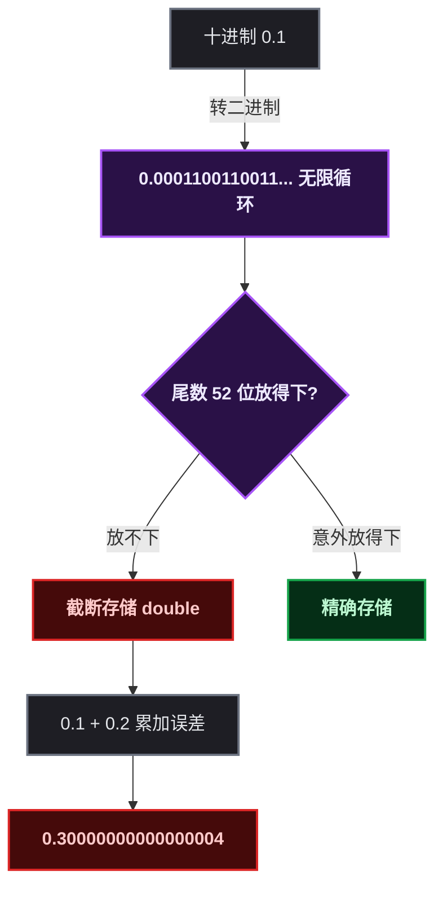
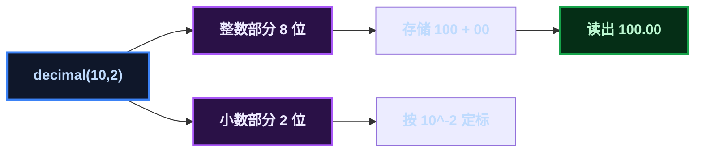
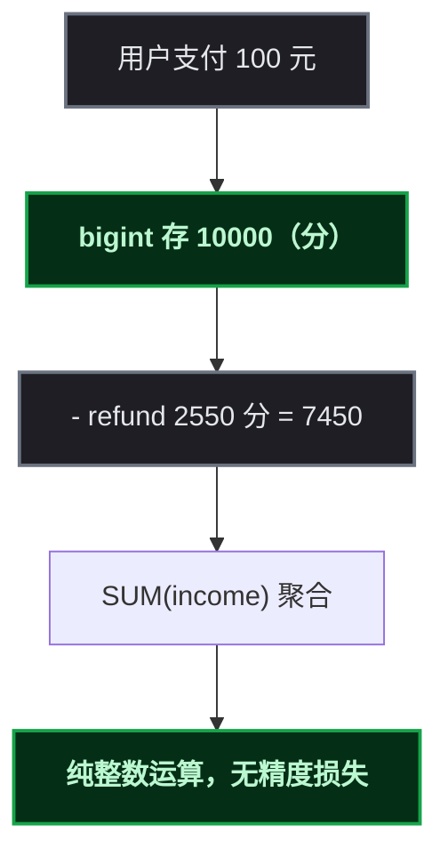
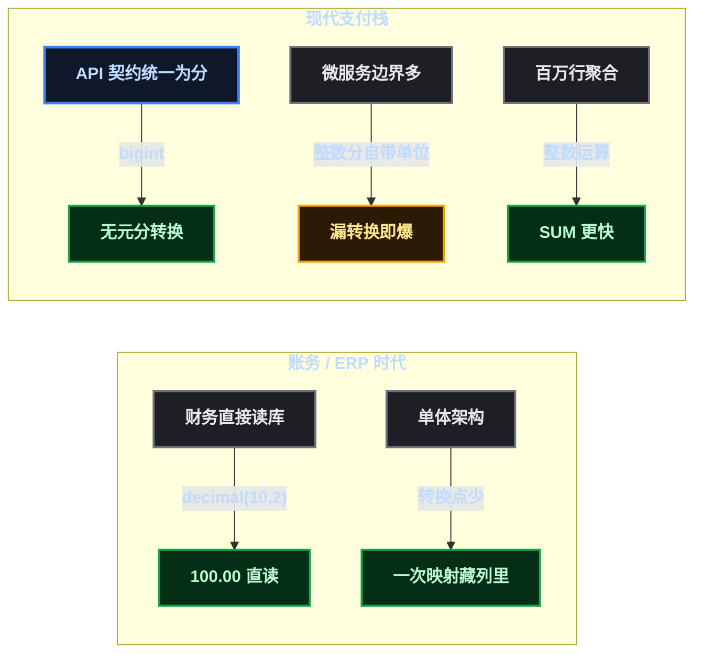

# 钱的字段到底该用 decimal 还是 bigint

> 某开发者最近在设计一套统一支付服务，走到金额字段这一步，跟数据库里的老订单表吵了一架：新表想用 `bigint` 存"分"，老表是 `decimal(10,2)`。写代码前先把这个历史遗留问题捋清楚，发现这背后是一整段软件史。

数据库里的金额字段，可能是除了主键之外被争论最多的一种类型。打开任何一本数据库教材，都会看到一句名言——"钱的字段千万别用 float"。但这句话的下半句往往没人讲：**不用 float，那到底用 decimal 还是 bigint？**

教科书里写的是 decimal。现代支付 API 的契约里写的是"整数最小单位"——也就是 bigint 存分。两边都合理，为什么结论会分叉？

## 从一次选型冲突说起

设计支付服务时，金额字段出现了两个候选人：

- ** ` decimal(10,2) ` ** —— 存的就是 ` 100.00 ` ，肉眼可读
- ** ` bigint ` ** —— 存 ` 10000 ` ，单位是分，代码里到处都是 ÷100

老 ERP 系统的订单表选了前者，支付服务想选后者。这不是口味问题，是两个时代的设计碰撞。要理解它，得先从 float 为什么被禁说起——因为 float 才是那个真正不配碰钱的类型。

> 📌 前置知识：浮点数、定点数、IEEE 754 这三个概念是本文的地基，建议先有个印象再往下看。

## float 的罪与罚：二进制算不清十进制

先复现那个经典翻车现场：

```sql
SELECT 0.1 + 0.2;
```

结果是 ` 0.30000000000000004 ` 。 ` float ` / ` double ` 用**二进制科学计数法**存储： ` M × 2^E ` ，M 是尾数，E 是指数。但十进制小数 ` 0.1 ` 转成二进制是**无限循环小数**：

```
0.1 = 0.0001100110011001100110011001100110011...（二进制，循环）
```

尾数只有 23 位（float）/ 52 位（double），放不下无限循环，只能**截断**。截断就有误差，误差在多次累加后放大。



更隐蔽的坑在边界。JavaScript 的 ` Number ` 就是 IEEE 754 double，能精确表示的最大整数是 ` 2^53 ≈ 9.007e15 ` 。雪花算法生成的 ` Long ` ID 动不动就是 ` 19 位 ` ，**超过 2^53 直接静默丢精度**——这正是 ` LongIdPrecisionLoss ` 那篇文章的根因。金额如果也走 double，分分钟出这种无声 bug。

所以教材说的没错：**钱的字段禁止 float**。但请注意，这条教训的本意是反对 float，并没有顺带支持 decimal 反对 bigint——在 DB 层，decimal 和 bigint 都是精确的。真正的分叉在别处。

## decimal 的原理：定点数是用"定标"换来的精确

decimal 是**定点数**（fixed-point），核心思想是"定标"：固定小数点位置，整数部分和小数部分各管各的。



MySQL 的 decimal 内部用**二进制存储，但每个字节承载两位十进制数字**（ ` int1 ` 每字节存 0-99）。可以认为它更接近"十进制的打包"，所以十进制运算天然精确。

MySQL 源码里 `decimal2bin` 是核心转换函数，把十进制数字逐字节打包进二进制：

```c
// strings/decimal.c
int decimal2bin(decimal_t *from, uchar *to, int precision, int frac) {
    ...
    // 整数部分从高位向低位，每字节塞两个十进制数字
    for (; intg > 0; intg -= 2) {
        int d = 0;
        if (buf < end) {
            if (intg >= 2) {
                d = ...;              // 取两个数字
                *buf++ = (uchar)d;    // 塞进一个字节
            } else {
                ...
            }
        }
    }
    // 小数部分同理，每个字节两位十进制数字
    for (; frac > 0; frac -= 2) {
        ...
    }
}
```

每个字节存 0-99，**十进制运算全程无舍入**——这就是 decimal 精确的根本保证。代价是：存储不是"一位一字节"也不是纯二进制紧凑，而是每字节两位数字的折中；运算走的是定制的十进制算术，比原生整数运算重。

## bigint 存分：精度来自"整数化"，来自和渠道契约对齐

bigint 存分的思路更简单粗暴：**既然钱的最小单位是分，那就直接以分为整数单位存储。** 整个数字域里根本没有小数，自然没有小数误差。



这不是什么新发明。银行 COBOL 核心系统的 ` PIC 9(9)V99 ` （打包十进制）本质就是"整数 + 隐含两位小数"——和 bigint 存分是同一个思路，只是由 DB 类型系统代为实现。所以 bigint 存分不是进化，是**从"人读"回归到"机器算"**。

真正让 bigint 在现代支付栈胜出的，是**契约对齐**：Stripe、Adyen、支付宝、微信，所有支付 API 的金额字段一律是整数最小单位。库里用 decimal，每个服务边界就要做一次"元↔分"转换，转换点一多就是 bug 工厂；用 bigint，类型本身就自带单位约定，漏转换的人会在最显眼的地方炸出来。

## 性能：对账场景下的实打实差距

decimal 和 bigint 在"精确"上打平，但在"计算效率"上分出高下。MySQL 对 DECIMAL 的 ` SUM ` / ` AVG ` 走的是内部十进制算术（ ` my_decimal ` 结构体 + ` decimal_* ` 函数族），而 bigint 走的是原生 CPU 整数指令。

对账系统恰好是那个压力测试：百万行临时表做 `SUM(income)`、大批量 `LEFT JOIN` 对比。整数运算 vs 十进制算术，在百万行聚合下差距明显。

```sql
-- 对账核心：渠道侧净额
SELECT SUM(income) FROM recon_temp WHERE batch_no = ?;

-- 平台侧净额
SELECT SUM(pay_amount) - SUM(refund_amount) FROM pay_order
 WHERE channel_code = ? AND success_time >= ? AND success_time < ?;
```

这两个 `SUM` 如果跑在 decimal 列上，MySQL 要逐行走 `decimal_add` 的定制算术；跑在 bigint 上就是朴素的整数加法。

## 为什么历史项目几乎全是 decimal：一场"人读"时代的选择

bigint 从 MySQL 3.23（90 年代末）就有，所以"当年没有 bigint"这个理由不成立。decimal 成为金额标准的真实原因，是**读库的人**。

账务/ERP 时代，钱的最终消费者是财务，不是 API。财务核对、审计、对账常常直接对着数据库看—— ` 100.00 ` 一眼就能对上纸质凭证， ` 10000 ` 还得心里除以 100。对财务来说，**可读性就是生产力**。



再加两条时代背景：

- **SAP、金蝶、用友**这些系统几十年都是 decimal，会计行业惯例根深蒂固，ORM 只是继承
- **单体架构转换点少**，把"元↔分映射"藏在列定义里，比在代码里到处 ×100 更不容易错

所以历史项目用 decimal 是理性的——在那个读库者是财务、经手钱的代码路径很少的时代，它确实更安全。

## 转折点：读库的人变了，算钱的方式变了

前后端分离把"读钱的人"从财务换成了 API。于是天平倾斜：

| 维度 | decimal(10,2) | bigint（分） |
|------|---------------|-------------|
| 存储 | 每字节两位十进制数字 | 原生 8 字节整数 |
| 精度 | 精确，十进制定点 | 精确，整数化 |
| 计算 | 定制十进制算术 | CPU 原生整数指令 |
| 读库体验 | 100.00 直读 | 10000 需心算 |
| 与支付 API 契约 | 元，每边界需转换 | 分，天然对齐 |
| 聚合性能 | 重 | 快 |
| 溢出风险 | 定 scale 后受范围约束 | 上限 9.2e18，几乎不会 |

> ⚠️ 新手提示：decimal 和 bigint 在 DB 层**都精确**，唯一会翻车的是把 Java 的 ` BigDecimal ` 误 map 成 ` double ` ——那是程序员的锅，不是类型本身的锅。

## 实践建议：让"单位"在整个系统里保持一致

回到支付服务的选型，给三条可落地的建议：

1. **支付链路必须 bigint（分）**——所有支付 API 的契约就是分，跟渠道对齐，零边界转换
2. **老订单表如果是 decimal，能迁就迁**——全链路统一用分，前端展示时 ÷100 格式化
3. **如果暂时不迁，就把"元↔分"转换收敛到一个地方**——集中转换，别散落各服务边界

关于最后一点有个经典类比：Java 的 `BigDecimal` 内部就是"一个 `BigInteger` 无标度值 + 一个 scale"，本质和 bigint 存分是同一套思路。代码库里的转换点越集中，这套"整数 + 定标"的模型就越不容易被破坏。

## 总结：这不是类型之争，是时代之争

一句话收尾：

> **decimal 是"人读钱"的设计，bigint 是"代码算钱"的设计。**

教科书说"别用 float"是对的，但它把问题留在了"decimal vs bigint"这一步。答案不取决于哪个更"正确"，而取决于**这个系统里钱最终给谁读**：

- 财务直读、单体账务 → decimal 合理，甚至更安全
- 微服务支付、API 契约、百万行对账 → bigint（分）是正确选择

某开发者的支付服务最终选了 bigint。不是因为 bigint 更新，而是因为**读钱的人变了**。

---

**参考资源：**
- MySQL 源码 ` strings/decimal.c ` （ ` decimal2bin ` 十进制打包实现）
- IEEE 754 双精度浮点标准（ ` 2^53 ` 精度边界）
- 各支付平台 API 文档（金额字段均以最小货币单位定义）
