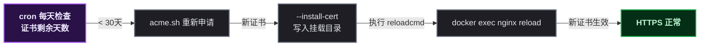

# 博客裸奔 HTTP 大半年，我给它上了个免费锁

## 第 1 步：目标——让博客地址栏出现小锁

事情是这样的。某开发者的博客在阿里云 1核2G 的小 ECS 上跑了大半年，一直用 `http://yaocat.cloud` 裸奔。也不是没想过上 HTTPS，但总觉得"麻烦"、"要花钱"、"反正没人看"。

直到有天朋友发来一个链接，浏览器地址栏赫然一个大红叉：**"不安全"**。虽然博客确实没什么人看，但顶着这个红叉自己心里也膈应。

查了一圈发现：**HTTPS 现在完全免费**，Let's Encrypt 发的证书不要钱，还能自动续期。那还等什么，搞它。

目标拆一下：

| 事项 | 说明 |
|------|------|
| ① 申请免费证书 | Let's Encrypt，用 acme.sh 工具 |
| ② nginx 配置挂载 | 配置从容器里挪出来，重建不丢 |
| ③ HTTPS 配置 | 443 端口 + HTTP 自动跳转 |
| ④ 顺带优化 | gzip 压缩 + 静态缓存 |

## 第 2 步：前置条件——这台机器长什么样

先交代一下环境：

| 项 | 值 |
|----|-----|
| 服务器 | 阿里云 ECS，1核2G，Debian 11 (bullseye) |
| 网站 | Docker 容器跑 nginx:alpine，挂载 `/var/www/blog` |
| 域名 | yaocat.cloud，已解析到服务器公网 IP |
| 端口 | 80 已开（HTTP 正常访问） |

动手前先确认两件事能不能通：

```bash
# 1. 域名是否解析到本机（访问返回 200 就说明通了）
curl -s -o /dev/null -w '%{http_code}' http://yaocat.cloud/

# 2. 80 端口外网可达
# 如果这步都不通，HTTP-01 验证会失败
```

> ⚠️ 新手提示：Let's Encrypt 的 HTTP-01 验证方式是"让服务器访问你的域名下某个临时文件"。**前提是域名能解析到这台机器、80 端口外网能访问**。缺一个都签不下来。

## 第 3 步：环境搭建——装 acme.sh

证书申请工具选的是 **acme.sh**，纯 shell 脚本，轻量，国内服务器友好，官方源直接装：

```bash
curl -sL https://get.acme.sh | sh -s email=你的真实邮箱
```

安装完它会：
- 装到 `~/.acme.sh/`
- 写进 `.bashrc`
- **自动装一个 cron 续期任务**（这个后面有大用）

> 📌 前置知识：acme.sh 是 ACME 协议的客户端实现，和 Let's Encrypt 服务器对话完成证书申请。certbot 是另一个官方客户端，但 acme.sh 更轻、脚本式、国内用得多。

## 第 4 步：申请证书——踩了第一个坑

申请命令其实很简单，用 webroot 方式（在网站目录放验证文件）：

```bash
~/.acme.sh/acme.sh --issue -d yaocat.cloud --webroot /var/www/blog
```

结果报错了，而且报得莫名其妙：

```json
{
  "type": "urn:ietf:params:acme:error:invalidContact",
  "detail": "Error validating contact(s) :: contact email has forbidden domain \"example.com\"",
  "status": 400
}
```

**坑 1：注册邮箱用了 example.com 被拒**

一开始图省事，安装时邮箱随便填了 `xxx@example.com` 。Let's Encrypt 明确禁止用 example.com 这种保留域名当注册邮箱，直接 400 拒绝。

改成真实邮箱重新申请，**结果还是报 example.com 的错**。这就诡异了——参数明明传了新邮箱。

**坑 2：acme.sh 缓存了第一次的邮箱**

查了一下才发现，acme.sh 把账户邮箱写进了 `~/.acme.sh/account.conf` ，后面 `--accountemail` 参数根本不覆盖它：

```bash
# account.conf 里躺着第一次的邮箱
grep ACCOUNT_EMAIL ~/.acme.sh/account.conf
# ACCOUNT_EMAIL='xxx@example.com'   ← 就是它

# 手动改掉
sed -i "s|ACCOUNT_EMAIL='xxx@example.com'|ACCOUNT_EMAIL='你的真实邮箱'|" ~/.acme.sh/account.conf
```

改完还要清掉已注册的账户目录（不然还走旧账户）：

```bash
rm -rf ~/.acme.sh/ca/acme-v02.api.letsencrypt.org
```

再跑一次申请，这次成了：

```bash
Your cert is in: /root/.acme.sh/yaocat.cloud_ecc/yaocat.cloud.cer
Your cert key is in: /root/.acme.sh/yaocat.cloud_ecc/yaocat.cloud.key
And the full-chain cert is in: /root/.acme.sh/yaocat.cloud_ecc/fullchain.cer
```

注意到 `_ecc` 后缀——acme.sh 默认给签了 **ECC 证书**（椭圆曲线算法），比传统 RSA 更安全、握手更快。

## 第 5 步：nginx 配置挂载——把配置从容器里"捞"出来

证书到手了，但还有个隐患：**这台机器的 nginx 配置一直在容器内部**。

```bash
docker inspect blog-nginx --format '{{range .Mounts}}{{.Source}} -> {{.Destination}}{{println}}{{end}}'
# 只有网站目录挂载了
# /var/www/blog -> /usr/share/nginx/html
```

也就是说 `/etc/nginx/conf.d/default.conf` 存在容器里，**哪天容器重建，配置就回到出厂状态**。之前配的东西全白干。这是很多 Docker 新手会踩的坑——配置应该挂载出来，和镜像解耦。

在宿主机建好目录，把配置和证书都挪出来：

```bash
# 建目录
mkdir -p /var/www/nginx/conf.d /var/www/nginx/certs

# 拷贝证书（从 acme.sh 目录 → 挂载目录）
cp ~/.acme.sh/yaocat.cloud_ecc/fullchain.cer /var/www/nginx/certs/yaocat.cloud.crt
cp ~/.acme.sh/yaocat.cloud_ecc/yaocat.cloud.key /var/www/nginx/certs/yaocat.cloud.key
chmod 644 /var/www/nginx/certs/yaocat.cloud.crt
chmod 600 /var/www/nginx/certs/yaocat.cloud.key   # 私钥权限要紧

# 把现有配置从容器里拷贝出来当模板
docker cp blog-nginx:/etc/nginx/conf.d/default.conf /var/www/nginx/conf.d/default.conf
```

> ⚠️ 新手提示：私钥文件权限一定要 600（只有 root 能读）。权限太松 nginx 会直接拒绝启动，太松也危险。

## 第 6 步：写 HTTPS 配置 + 重建容器

配置文件是灵魂。新建的 `default.conf` 包含三件事：**HTTP 跳转 HTTPS**、**443 SSL 配置**、**gzip 和缓存优化**：

```nginx
# HTTP 自动跳转 HTTPS
server {
    listen 80;
    server_name yaocat.cloud;
    location / {
        return 301 https://$host$request_uri;
    }
    # Let's Encrypt 验证目录（续期用，不能跟着跳转）
    location ^~ /.well-known/acme-challenge/ {
        root /usr/share/nginx/html;
    }
}

# HTTPS 主配置
server {
    listen 443 ssl;
    http2 on;
    server_name yaocat.cloud;

    ssl_certificate     /etc/nginx/certs/yaocat.cloud.crt;
    ssl_certificate_key /etc/nginx/certs/yaocat.cloud.key;
    ssl_protocols       TLSv1.2 TLSv1.3;

    root /usr/share/nginx/html;
    index index.html;

    # gzip 压缩
    gzip on;
    gzip_types text/plain text/css application/javascript application/json image/svg+xml;
    gzip_min_length 1024;

    location / {
        try_files $uri $uri/ =404;
    }

    # 静态资源缓存 7 天
    location ~* \.(css|js|png|jpg|jpeg|gif|svg|ico|woff2?)$ {
        expires 7d;
        add_header Cache-Control "public, max-age=604800";
    }
}
```

> 📌 这里有个容易忽略的点：**`.well-known/acme-challenge/` 目录必须排除在跳转之外**。不然续期验证时，Let's Encrypt 访问 `http://域名/.well-known/...` 被 301 跳走了，验证直接失败。这个坑续期的时候才会炸，提前排掉。

重建容器，把所有挂载点接上：

```bash
docker stop blog-nginx && docker rm blog-nginx

docker run -d --name blog-nginx \
  -p 80:80 -p 443:443 \
  -v /var/www/blog:/usr/share/nginx/html:ro \
  -v /var/www/nginx/conf.d:/etc/nginx/conf.d:ro \
  -v /var/www/nginx/certs:/etc/nginx/certs:ro \
  --restart unless-stopped \
  nginx:alpine
```

> ⚠️ 顺手把 `--restart unless-stopped` 加上了——之前这台容器的重启策略是 `no` ，服务器一重启网站就没了，得手动拉起。生产环境容器务必设置自动重启。

## 第 7 步：部署验证——一条条对着看

```bash
# 1. HTTPS 访问
curl -s -o /dev/null -w '%{http_code}' https://yaocat.cloud/
# 200 ✅

# 2. HTTP 是否跳转
curl -s -o /dev/null -w '%{redirect_url}' http://yaocat.cloud/
# https://yaocat.cloud/ ✅

# 3. 证书信息
echo | openssl s_client -connect yaocat.cloud:443 -servername yaocat.cloud 2>/dev/null \
  | openssl x509 -noout -subject -issuer -dates
# subject=CN = yaocat.cloud ✅
# issuer=O = Let's Encrypt ✅
# notAfter=Nov 18 ...（90天有效）✅

# 4. gzip 是否生效
curl -s -I -H 'Accept-Encoding: gzip' https://yaocat.cloud/ | grep -i content-encoding
# content-encoding: gzip ✅
```

gzip 的效果很直观，同一个页面：

```
不压缩: 58,249 bytes
压缩后: 15,486 bytes   → 省了 73%！
```

对 1核2G 的小机器，这点带宽和流量节省挺实在的。

## 原理简述——证书续期到底怎么"自动"的

### 一环：acme.sh 的 cron 任务

acme.sh 安装时自动注册了一个 cron 任务，每天检查一次证书。Let's Encrypt 证书有效期 **90 天**，cron 会在到期前约 30 天自动重新申请。

### 二环：--install-cert 把续期和部署串起来

光续期还不够——新证书得**替换到 nginx 用的目录**并**重载 nginx**。用 `--install-cert` 一次性配好：

```bash
~/.acme.sh/acme.sh --install-cert -d yaocat.cloud --ecc \
  --key-file /var/www/nginx/certs/yaocat.cloud.key \
  --fullchain-file /var/www/nginx/certs/yaocat.cloud.crt \
  --reloadcmd 'docker exec blog-nginx nginx -s reload'
```

这样每次续期后自动执行三步：**写新证书 → 替换挂载目录 → 重载 nginx**。全程不用管。



## 总结与下一步

这次折腾下来，最值的不是 HTTPS 本身，而是把几个隐患一起排了：

| 改造 | 之前 | 之后 |
|------|------|------|
| 协议 | HTTP 裸奔 | HTTPS + HTTP/2 |
| 证书 | 无 | Let's Encrypt 90天自动续期 |
| nginx 配置 | 在容器里（重建丢失） | 挂载到宿主机 |
| 容器重启 | no（重启就挂） | unless-stopped |
| gzip | 关 | 开（省73%流量） |
| 静态缓存 | 无 | 7天 |

踩的坑也记下来了：**acme.sh 邮箱缓存**、**example.com 被拒**、**续期验证目录要排除跳转**。这几个坑网上都有零星记录，但拼在一起踩一遍才记得牢。

下一步想做的：给这台 ECS 装 node_exporter + Prometheus，把主机监控和告警搞起来。毕竟 HTTPS 都上了，监控也不能一直裸奔。到时候再写一篇。

如果这篇对你有帮助，或者你也踩过类似的坑，欢迎留言交流。某开发者也是边学边写，说得不对的地方，评论区指正。
