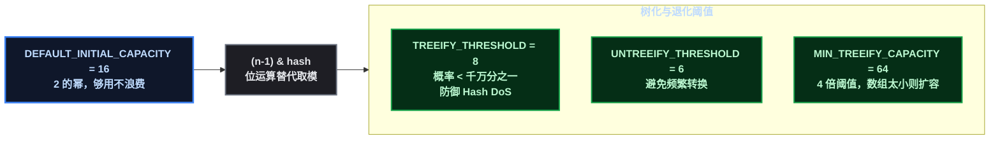
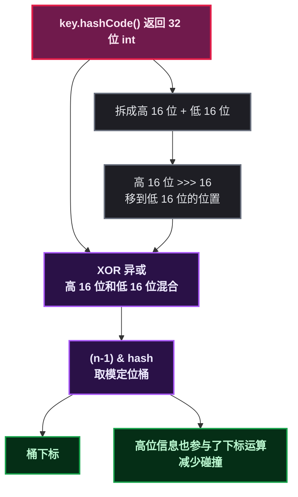
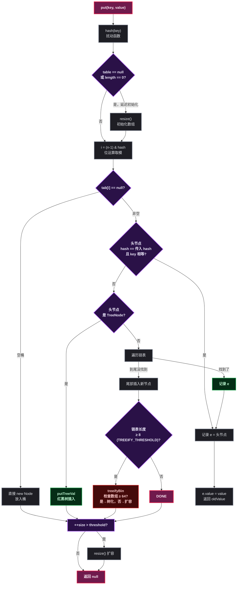

<!--
图解 → 源码 → 格式化 → 占位：按以下顺序执行。
-->

# 打开 HashMap.java，从第 1 行读到第 2587 行

某开发者背了三天八股，面试官问「HashMap 怎么定位桶的」——「计算 hashCode，扰动，然后 ` (n-1) & hash ` 」。面试官点头又问：「那为什么要扰动，直接 ` (n-1) & hashCode ` 不行吗？」——卡住了。

其实 HashMap.java 的开头注释里写得很明白：**Because the table uses power-of-two masking, sets of hashes that vary only in bits above the current mask will always collide.** 因为用的是 2 的幂掩码，高位不同的 key 会撞。这才是设计动机，不是「某大牛说 XOR 一下好」。

本文换个路子，打开 JDK 21 的 ` java.util.HashMap ` （2587 行），**从上到下、按源码书写顺序**走一遍。每遇到一个常量、一个方法、一个分支，不只说它是什么，说它**为什么是它**。

## 第一站：类声明和那篇著名的注释

``` java
// HashMap.java:139
public class HashMap<K,V> extends AbstractMap<K,V>
    implements Map<K,V>, Cloneable, Serializable {
``` 

类签名平平无奇，真正的宝藏从第 145 行开始——一段大几百字的 **Implementation notes**。这大概是 Java 标准库里含金量最高的注释之一，建议每个读源码的人在这停个十分钟。

它告诉你四件事：

**1. 「桶太大就变红黑树」的想法在哪里**

``` text
// line 148-157
// This map usually acts as a binned (bucketed) hash table, but
// when bins get too large, they are transformed into bins of
// TreeNodes, each structured similarly to those in TreeMap.
// ...
// Tree bins are ordered primarily by hashCode, but in the case
// of ties, if two elements are of the same "class C implements
// Comparable<C>", type then their compareTo method is used.
``` 

JDK 8 引入树化的初衷是**防止 Hash DoS 攻击**——攻击者构造大量 hashCode 相同的字符串，把 HashMap 退化成链表，复杂度 O(n) 意味着一次请求就能让 CPU 飚满。树化后最差 O(log n)，系统不会挂。防御性设计，写在注释的第一段。

**2. 树化是有代价的，所以阈值选得保守**

``` text
// line 177-179
// Because TreeNodes are about twice the size of regular nodes, we
// use them only when bins contain enough nodes to warrant use
// (see TREEIFY_THRESHOLD).
``` 

TreeNode 比普通 Node 多四个字段（parent, left, right, prev, red），内存占用是普通节点的两倍。这也是为什么链表够短时不需要树化——空间换时间，但空间换得太狠就不划算了。

**3. 泊松分布给阈值提供了数学依据**

``` text
// line 183-200
// Ideally, under random hashCodes, the frequency of nodes in bins
// follows a Poisson distribution with a parameter of about 0.5
// on average for the default resizing threshold of 0.75.
// ...
// 8:    0.00000006
// more: less than 1 in ten million
``` 

这段注释就是面试官嘴里「为什么是 8」的标准答案来源。不是谁拍脑袋定的，是用概率算的：在随机 hash、负载因子 0.75 的条件下，一个桶里出现 8 个以上节点的概率不到千万分之一。能碰到说明要么 hashCode 质量极差，要么有人在搞你——这时候树化兜底。

**4. 树化和链表可以共存于同一个桶**

``` text
// line 214-221
// When bin lists are treeified, split, or untreeified, we keep
// them in the same relative access/traversal order to better
// preserve locality, and to slightly simplify handling of splits
// and traversals that invoke iterator.remove.
``` 

关键信息：TreeNode 除了保留红黑树指针之外，**还保留了 ` next ` 链表指针**。所以一个桶即使在树化状态下，仍然可以按链表顺序遍历。这对扩容拆分和 ` Iterator.remove ` 一致性很重要。

## 第二站：常量们——每个数字都不是随便选的

``` java
// line 238
static final int DEFAULT_INITIAL_CAPACITY = 1 << 4; // aka 16
// line 245
static final int MAXIMUM_CAPACITY = 1 << 30;
// line 250
static final float DEFAULT_LOAD_FACTOR = 0.75f;
// line 260
static final int TREEIFY_THRESHOLD = 8;
// line 267
static final int UNTREEIFY_THRESHOLD = 6;
// line 275
static final int MIN_TREEIFY_CAPACITY = 64;
``` 

**为什么默认容量是 16 而不是 10 或 20？** 因为容量必须是 2 的幂，16 是最小且「既够用又不浪费」的 2 的幂。太小（8）会频繁扩容，太大（32）空桶太多。

**为什么最大是 ` 1 << 30 ` ？** ` int ` 是 32 位有符号， ` 1 << 31 ` 是负数。 ` 1 << 30 = 2^30 ≈ 10.7 亿 ` ，基本够用了。

**为什么负载因子是 0.75？** 注释说这是时间和空间的折中。具体来说：负载因子越大（逼近 1），空间利用率越高但碰撞越多、查找越慢；负载因子越小（比如 0.5），碰撞少但浪费空间、频繁扩容。0.75 是长期经验值 + 泊松分布验证的结果——0.75 下桶内节点数服从 λ ≈ 0.5 的泊松分布，链表很难长起来。

**TREEIFY_THRESHOLD = 8 与 UNTREEIFY_THRESHOLD = 6，中间为什么差 2？** 避免频繁转换。如果树化阈值和退化阈值都是 7，一个桶在 7 和 8 之间反复横跳，每次都要树化→退化→树化，浪费 CPU。差 2 是个缓冲区间。

**MIN_TREEIFY_CAPACITY = 64**：数组太小时不要树化，扩容一次就能把长链表拆散。64 = 4 × 8 = 4 × TREEIFY_THRESHOLD，保证树化前数组至少有一定规模。



## 第三站：Node —— 链表的原子

``` java
// HashMap.java:281
static class Node<K,V> implements Map.Entry<K,V> {
    final int hash;      // 一锤定音：put 时算好的 hash，存起来不再重算
    final K key;         // key 也是 final，不可变
    V value;
    Node<K,V> next;      // 拉链法：指向链表下一个节点
}
``` 

**为什么 hash 和 key 是 final 的？** ` hash ` 在构造时就固定了，后面 get/remove 都依赖这个值的稳定性。如果 hash 可变，放进去之后 hash 变了，遍历链表时拿着新 hash 对不上，永远找不到。 ` key ` 的 final 虽然没有强制不可变（ ` K ` 不一定是 immutable 的），但设计意图是建议 key 不可变（下一节说为什么）。

` next ` 的存在实现了**拉链法**——多个节点 hash 冲突时，用单链表串起来。

## 第四站：hash() 扰动函数——为什么要有这 3 行

``` java
// HashMap.java:336
static final int hash(Object key) {
    int h;
    return (key == null) ? 0 : (h = key.hashCode()) ^ (h >>> 16);
}
``` 

源码注释原文：

``` text
// Because the table uses power-of-two masking, sets of hashes that
// vary only in bits above the current mask will always collide.
``` 

这就是设计动机：表大小是 2 的幂，下标计算 ` (n-1) & hash ` 等价于 ` hash % n ` ，但只有低 ` log2(n) ` 位参与运算。假设 n=16， ` n-1 = 0b1111 ` ，那么 hash 的高 28 位被彻底忽略——两个 key 的高位不同、低位相同就会撞。

` h >>> 16 ` 把高 16 位右移 16 位，然后 ` ^ ` （异或）到低 16 位。这样一来，高位信息「扰动」进了低位，碰撞率下降。

**为什么不直接取 ` hashCode() ` ？** 因为 ` hashCode() ` 的质量不可控。比如 ` Float ` 作为 key，连续整数的 Float 的 hashCode 高位差别很大但低位很接近，不扰动的话全撞一起。

**为什么用 XOR 而不是 ` & ` 或 ` | ` ？** XOR 不偏向 0 或 1。 ` & ` 偏向 0（两个 1 才出 1）， ` | ` 偏向 1（一个 1 就是 1），XOR 各 50%。



## 第五站：tableSizeFor——把任意数字转成 2 的幂

``` java
// HashMap.java:377
static final int tableSizeFor(int cap) {
    int n = -1 >>> Integer.numberOfLeadingZeros(cap - 1);
    return (n < 0) ? 1 : (n >= MAXIMUM_CAPACITY) ? MAXIMUM_CAPACITY : n + 1;
}
``` 

**为什么需要这个？** 用户构造 HashMap 时可以传 ` initialCapacity ` ，但底层数组长度必须是 2 的幂。这个方法把传进来的值「向上取整」到最近的 2 的幂。比如传入 10 → 返回 16，传入 100 → 返回 128。

**原理**： ` numberOfLeadingZeros(cap - 1) ` 找到最前面的 0 的个数， ` -1 >>> ` 这个数得到一个全 1 的二进制数，再加 1 就进位到了 2 的幂。减 1 是为了防止本身就是 2 的幂的情况（比如输入 16，不减 1 会变成 32）。

> 这是纯位运算技巧，没有循环，时间复杂度 O(1)。

## 第六站：构造方法和延迟初始化

``` java
// HashMap.java:477
public HashMap() {
    this.loadFactor = DEFAULT_LOAD_FACTOR; // all other fields defaulted
}
``` 

``` java
// HashMap.java:445
public HashMap(int initialCapacity, float loadFactor) {
    // ... 参数校验 ...
    this.loadFactor = loadFactor;
    this.threshold = tableSizeFor(initialCapacity); // 注意：threshold 暂存容量
}
``` 

**一个关键设计： ` table ` 数组是 null，第一次 ` put ` 才分配。** 注释里叫「lazily initialized」。这么做的好处很直接：new 一个空 HashMap 只花 40 字节（对象头 + 几个 int/float 字段）。如果创建时就分配 16 个 Node 引用数组，那就是 56 字节（数组头）+ 16 × 4 字节（引用，压缩 OOPS），空转就多 120 字节。大量空 HashMap 的场景（比如用 Map 作为方法返回值）能省不少。

初始容量存在 ` threshold ` 字段里（第 421 行），等 ` resize() ` 时真正分配数组。这里复用字段是为了省一个成员变量。

## 第七站：getNode——查找链

``` java
// HashMap.java:573
final Node<K,V> getNode(Object key) {
    Node<K,V>[] tab; Node<K,V> first, e; int n, hash; K k;
    // ① 表不为空且桶不为空
    if ((tab = table) != null && (n = tab.length) > 0 &&
        (first = tab[(n - 1) & (hash = hash(key))]) != null) {
        // ② 先检查头节点——大部分情况下命中
        if (first.hash == hash &&
            ((k = first.key) == key || (key != null && key.equals(k))))
            return first;
        // ③ 有后续节点
        if ((e = first.next) != null) {
            if (first instanceof TreeNode)
                return ((TreeNode<K,V>)first).getTreeNode(hash, key);
            // ④ 链表遍历
            do {
                if (e.hash == hash &&
                    ((k = e.key) == key || (key != null && key.equals(k))))
                    return e;
            } while ((e = e.next) != null);
        }
    }
    return null;
}
``` 

**设计要点回顾：**

- **先比较 ` hash ` 再比较 ` key ` **：int 比较比 ` equals ` 快得多，用 hash 做快速过滤。hash 不等，一定不是同一个 key；hash 相等，key 不一定相等（哈希碰撞）。
- **先比引用 ` == ` 再比 ` equals ` **：如果是同一个对象， ` == ` 直接通过，不必走 ` equals ` 的开销。
- **头节点优先**：统计上，同一个桶里大概率只有一个节点，头节点命中率远高于链表中的节点。

## 第八站：putVal——写入链的完整拆解

这是 HashMap 最核心的方法，逻辑紧凑，但每一行都有明确的动机。

``` java
// HashMap.java:631-672
final V putVal(int hash, K key, V value, boolean onlyIfAbsent,
               boolean evict) {
    Node<K,V>[] tab; Node<K,V> p; int n, i;
    // ① 延迟初始化
    if ((tab = table) == null || (n = tab.length) == 0)
        n = (tab = resize()).length;
    // ② 桶空：直接放
    if ((p = tab[i = (n - 1) & hash]) == null)
        tab[i] = newNode(hash, key, value, null);
    else {
        // ③ 桶不空 → 三种情况
        Node<K,V> e; K k;
        // ③-a 头节点就是目标 key → 记录 e
        if (p.hash == hash &&
            ((k = p.key) == key || (key != null && key.equals(k))))
            e = p;
        // ③-b 红黑树插入
        else if (p instanceof TreeNode)
            e = ((TreeNode<K,V>)p).putTreeVal(this, tab, hash, key, value);
        // ③-c 链表遍历 + 尾部插入
        else {
            for (int binCount = 0; ; ++binCount) {
                if ((e = p.next) == null) {
                    p.next = newNode(hash, key, value, null);
                    if (binCount >= TREEIFY_THRESHOLD - 1) // 到 8 了？
                        treeifyBin(tab, hash);  // 尝试树化
                    break;
                }
                if (e.hash == hash &&
                    ((k = e.key) == key || (key != null && key.equals(k))))
                    break;
                p = e;
            }
        }
        // ④ key 已存在 → 覆盖 value
        if (e != null) {
            V oldValue = e.value;
            if (!onlyIfAbsent || oldValue == null)
                e.value = value;
            afterNodeAccess(e);  // LinkedHashMap 钩子
            return oldValue;
        }
    }
    ++modCount;     // 结构性修改计数
    // ⑤ 超过阈值 → 扩容
    if (++size > threshold)
        resize();
    afterNodeInsertion(evict);  // LinkedHashMap 钩子
    return null;
}
``` 

说几个容易被忽略的设计选择：

**为什么链表是尾部插入而不是头部？** JDK 7 是头插法——每次插入都把新节点放到链表头，理由是「最近插入的数据更可能被访问」。但头插法在并发扩容时产生环形链表（见下文八股一），JDK 8 改为尾插法。虽然解决了环的问题，但本意不是为了线程安全，而是为扩容时的顺序保持做铺垫——尾插法配合 ` resize ` 中的 ` loHead/loTail ` 、 ` hiHead/hiTail ` 双端指针，扩容后链表顺序不变。

** ` treeifyBin ` 只是个入口，** 真正的逻辑是：如果数组长度 < 64，就扩容；否则才把链表转为 TreeNode 双向链表，再调 ` hd.treeify(tab) ` 构建红黑树。这段注释安在 ` treeifyBin ` 上：

``` java
// HashMap.java:761
final void treeifyBin(Node<K,V>[] tab, int hash) {
    int n, index; Node<K,V> e;
    if (tab == null || (n = tab.length) < MIN_TREEIFY_CAPACITY)
        resize();  // 先扩容
    else if ((e = tab[index = (n - 1) & hash]) != null) {
        // 把单链表转成 TreeNode 双向链表
        TreeNode<K,V> hd = null, tl = null;
        do {
            TreeNode<K,V> p = replacementTreeNode(e, null);
            if (tl == null) hd = p;
            else { p.prev = tl; tl.next = p; }
            tl = p;
        } while ((e = e.next) != null);
        // 再调红黑树构建
        if ((tab[index] = hd) != null)
            hd.treeify(tab);
    }
}
``` 

** ` modCount ` ++ 放在 ` resize ` 外面。** ` modCount ` 记录结构性修改次数（增删键值对，不包括覆盖值）。扩容本身也是结构性修改，但 ` modCount ` 不是在 ` resize() ` 里加的，而是在上层 ` putVal ` 末尾统一 ` ++modCount ` 。因为 ` resize ` 可能被 ` putVal ` 调用，也可能在 ` treeifyBin ` 中调用，统一在 ` putVal ` 中加一次更清晰。



## 第九站：resize——为什么翻倍？为什么用位运算拆链表？

` resize ` 是 HashMap 最复杂的方法，但核心思路只有一句话：**每次扩容翻倍，数组索引用位运算重算，无需重新 hash。**

**为什么翻倍？** 因为容量必须是 2 的幂。翻倍的数学性质是： ` newCap = oldCap << 1 ` ， ` newCap - 1 ` 比 ` oldCap - 1 ` 多了一个 1 位。一个节点的新索引要么是原位置 ` j ` ，要么是 ` j + oldCap ` 。

``` java
// HashMap.java:683-755
final Node<K,V>[] resize() {
    Node<K,V>[] oldTab = table;
    int oldCap = (oldTab == null) ? 0 : oldTab.length;
    int oldThr = threshold;
    int newCap, newThr = 0;

    // 计算新容量和阈值
    if (oldCap > 0) {
        if (oldCap >= MAXIMUM_CAPACITY) {  // 到上限了
            threshold = Integer.MAX_VALUE;
            return oldTab;
        }
        else if ((newCap = oldCap << 1) < MAXIMUM_CAPACITY &&
                 oldCap >= DEFAULT_INITIAL_CAPACITY)
            newThr = oldThr << 1;
    }
    else if (oldThr > 0)    // 构造时传了 initialCapacity，暂存在 threshold 里
        newCap = oldThr;
    else {                   // 默认构造
        newCap = DEFAULT_INITIAL_CAPACITY;
        newThr = (int)(DEFAULT_LOAD_FACTOR * DEFAULT_INITIAL_CAPACITY);
    }
    if (newThr == 0) {
        float ft = (float)newCap * loadFactor;
        newThr = (newCap < MAXIMUM_CAPACITY && ft < (float)MAXIMUM_CAPACITY ?
                  (int)ft : Integer.MAX_VALUE);
    }
    threshold = newThr;

    Node<K,V>[] newTab = (Node<K,V>[])new Node[newCap];
    table = newTab;

    // 迁移旧数据
    if (oldTab != null) {
        for (int j = 0; j < oldCap; ++j) {
            Node<K,V> e;
            if ((e = oldTab[j]) != null) {
                oldTab[j] = null; // 帮助 GC
                if (e.next == null)
                    // 单个节点 → 直接算新下标
                    newTab[e.hash & (newCap - 1)] = e;
                else if (e instanceof TreeNode)
                    // 红黑树 → split 拆分
                    ((TreeNode<K,V>)e).split(this, newTab, j, oldCap);
                else {
                    // 链表 → 分 lo（原位置）和 hi（原位置+oldCap）两条
                    Node<K,V> loHead = null, loTail = null;
                    Node<K,V> hiHead = null, hiTail = null;
                    Node<K,V> next;
                    do {
                        next = e.next;
                        if ((e.hash & oldCap) == 0) { // 关键判断
                            if (loTail == null) loHead = e;
                            else loTail.next = e;
                            loTail = e;
                        } else {
                            if (hiTail == null) hiHead = e;
                            else hiTail.next = e;
                            hiTail = e;
                        }
                    } while ((e = next) != null);
                    if (loTail != null) { loTail.next = null; newTab[j] = loHead; }
                    if (hiTail != null) { hiTail.next = null; newTab[j + oldCap] = hiHead; }
                }
            }
        }
    }
    return newTab;
}
``` 

**为什么 ` (e.hash & oldCap) == 0 ` 就能判断去留？** 举例：oldCap = 16（ ` 0001 0000 ` ），newCap = 32（ ` 0010 0000 ` ）。一个节点原来在 j=5 的位置：

- 要判断它在 32 下的新位置是 5 还是 5+16=21
- 关键看新增加的那一位（bit 4）是 0 还是 1
- ` oldCap = 16 = 0001 0000 ` ，它只有 bit 4 是 1
- ` hash & 0001 0000 ` 就是提取 hash 的 bit 4
- 等于 0 → 新下标不变（j）；等于 1 → 新下标 j + oldCap

**不需要重新算 ` (n-1) & hash ` ，** 只需要看这一位。这就是 2 的幂扩容最大的性能优势。

``` mermaid
%% 半暗底色 + 高亮描边 %%
flowchart TD
    subgraph OLD["扩容前 oldCap = 16"]
        OLDIDX["桶 j\n13 | 21 | 5 | 29 | 37"]
    end

    subgraph JUDGE["迁移判断"]
        BIT["取 hash 的第 4 位\nhash & oldCap"]
        BIT -->|"== 0"| LO["留在低位链表 lo\n新下标 = j"]
        BIT -->|"== 1"| HI["走向高位链表 hi\n新下标 = j + oldCap"]
    end

    subgraph NEW["扩容后 newCap = 32"]
        NEWLO["桶 j\n13 | 5 | 37"]
        NEWHI["桶 j + oldCap\n21 | 29"]
    end

    OLDIDGE --> JUDGE
    LO --> NEWLO
    HI --> NEWHI

    classDef root fill:#0f172a,stroke:#3b82f6,stroke-width:2.5px,color:#bfdbfe,font-weight:bold;
    classDef process fill:#1e1e24,stroke:#6b7280,stroke-width:2px,color:#e5e7eb;
    classDef data fill:#052e16,stroke:#16a34a,stroke-width:2px,color:#bbf7d0,font-weight:bold;
    classDef condition fill:#2a1147,stroke:#a855f7,stroke-width:2px,color:#ede9fe,font-weight:bold;
    class OLDIDGE OLDIDX process;
    class BIT condition;
    class LO,HI process;
    class NEWLO,NEWHI data;
    class JUDGE root;
``` 

## 第十站：TreeNode——红黑树的构造和查找

TreeNode 定义在第 1966 行，继承自 ` LinkedHashMap.Entry ` （它又继承自 ` Node ` ，多了 ` before ` 和 ` after ` 支持有序遍历）。

``` java
// HashMap.java:1966
static final class TreeNode<K,V> extends LinkedHashMap.Entry<K,V> {
    TreeNode<K,V> parent;
    TreeNode<K,V> left;
    TreeNode<K,V> right;
    TreeNode<K,V> prev;    // 在链表中指向前驱（删除时用）
    boolean red;
}
``` 

** ` prev ` 是做什么用的？** 它维持了 TreeNode 在原始链表中的前驱。核心用途在 ` removeTreeNode ` ：红黑树删除节点可能需要 O(log n) 重新平衡，但有了 ` prev ` / ` next ` 链表指针，可以 O(1) 从链表中移除节点，不需要走树操作。

** ` find ` 方法——红黑树的二分查找：**

``` java
// HashMap.java:2017
final TreeNode<K,V> find(int h, Object k, Class<?> kc) {
    TreeNode<K,V> p = this;
    do {
        int ph, dir; K pk;
        TreeNode<K,V> pl = p.left, pr = p.right, q;
        if ((ph = p.hash) > h)         p = pl;   // hash 大 → 左子树
        else if (ph < h)               p = pr;   // hash 小 → 右子树
        else if ((pk = p.key) == k || (k != null && k.equals(pk)))
            return p;                              // hash 相等且 key 相等 → 找到
        // hash 相等但 key 不等 → hash 碰撞 → 需要按 key 的比较来引导
        else if (pl == null)           p = pr;
        else if (pr == null)           p = pl;
        else if ((kc != null ||
                  (kc = comparableClassFor(k)) != null) &&
                 (dir = compareComparables(kc, k, pk)) != 0)
            p = (dir < 0) ? pl : pr;  // Comparable 决定方向
        else if ((q = pr.find(h, k, kc)) != null)
            return q;                  // 右子树递归查找
        else
            p = pl;                    // 左子树继续
    } while (p != null);
    return null;                       // 真的没有
}
``` 

这里有一个容易被忽略的设计点：**红黑树不是按 key 的 ` compareTo ` 来排序的，而是先按 hash 大小排。** 只有当两个 key 的 hash 相同时，才 fallback 到 ` Comparable.compareTo ` 或 ` tieBreakOrder ` （比较类名，如果还相同就用 ` identityHashCode ` ）。

**为什么？** 因为 HashMap 的底层是按 hash 索引的，红黑树是为了解决"hash 相同的 key 太多"的问题。hash 已经是第一维度的索引，红黑树只是在相同 hash 内部做第二维度的快速查找。

** ` treeify ` ——从链表构建红黑树：**

``` java
// HashMap.java:2071
final void treeify(Node<K,V>[] tab) {
    TreeNode<K,V> root = null;
    for (TreeNode<K,V> x = this, next; x != null; x = next) {
        next = (TreeNode<K,V>)x.next;
        x.left = x.right = null;
        if (root == null) {
            x.parent = null; x.red = false; // 根节点是黑色
            root = x;
        } else {
            K k = x.key; int h = x.hash; Class<?> kc = null;
            for (TreeNode<K,V> p = root;;) {
                int dir, ph; K pk = p.key;
                if ((ph = p.hash) > h) dir = -1;
                else if (ph < h)       dir = 1;
                else if ((kc == null &&
                          (kc = comparableClassFor(k)) == null) ||
                         (dir = compareComparables(kc, k, pk)) == 0)
                    dir = tieBreakOrder(k, pk);
                // 插入 BST 后调 balanceInsertion 维持红黑树性质
                TreeNode<K,V> xp = p;
                if ((p = (dir <= 0) ? p.left : p.right) == null) {
                    x.parent = xp;
                    if (dir <= 0) xp.left = x;
                    else          xp.right = x;
                    root = balanceInsertion(root, x); // 红黑树平衡
                    break;
                }
            }
        }
    }
    moveRootToFront(tab, root); // 确保根节点是桶的第一个节点
}
``` 

每次插入一个 TreeNode 到 BST 后立刻调用 ` balanceInsertion ` 进行红黑树平衡（变色 + 旋转）。最后 ` moveRootToFront ` 把根节点挪到桶数组的位置——因为红黑树根可能因旋转而改变，但桶索引必须指向根，否则查找会漏。

## 第十一站：removeNode——删除的一致性

``` java
// HashMap.java:819
final Node<K,V> removeNode(int hash, Object key, Object value,
                           boolean matchValue, boolean movable) {
    // ... 定位节点（同 getNode 逻辑）...
    if (node != null && (!matchValue || (v = node.value) == value ||
                         (value != null && value.equals(v)))) {
        if (node instanceof TreeNode)
            ((TreeNode<K,V>)node).removeTreeNode(this, tab, movable);
        else if (node == p)
            tab[index] = node.next;  // 头节点删除
        else
            p.next = node.next;       // 中间节点删除
        ++modCount;
        --size;
        afterNodeRemoval(node);
        return node;
    }
}
``` 

` removeTreeNode ` 在删除后会自动检查节点数：如果红黑树节点太少（≤ UNTREEIFY_THRESHOLD = 6），就退化为链表。退化逻辑在 ` split ` 方法中（扩容时也会触发退化），而不是每删一个节点就检查。

删除时 ` modCount ` 和 ` size ` 的变化和 ` putVal ` 对应，保证迭代器的 fail-fast 机制一致——迭代过程中如果别人调了 ` remove ` ， ` modCount ` 变了，迭代器抛 ` ConcurrentModificationException ` 。

## 第十二站：多线程问题——源码级别的证据

重点来了，哪些八股题可以在源码里找到直接证据。

### 1. JDK 7 死循环在 JDK 8 怎么解的？

在 ` resize ` 中，JDK 8 的链表拆分代码（第 721-749 行）明确注释了 ` // preserve order ` 。它用 ` loHead/loTail ` 和 ` hiHead/hiTail ` 四个指针维护两条链表，尾插法逐节点搬运，顺序不变。

JDK 7 的 ` transfer ` 方法是这样的（不在 JDK 8+ 里了，但可以从历史版本看到）：

``` java
// JDK 7: 头插法
void transfer(Entry[] newTable) {
    Entry[] src = table;
    for (int j = 0; j < src.length; j++) {
        Entry e = src[j];
        if (e != null) {
            src[j] = null;
            do {
                Entry next = e.next;
                e.next = newTable[j]; // 头插：新节点指向当前头
                newTable[j] = e;       // 新节点变成新头
                e = next;
            } while (e != null);
        }
    }
}
``` 

两个线程同时执行，线程 A 搬运了 a→b，线程 B 拿到的 ` e.next ` 可能已经是倒过来的，形成环形引用 a.next = b, b.next = a。JDK 8 尾插法 + ` loTail.next = e ` 这种尾部追加方式，不会反转链表，环无法形成。

### 2. ` tableSizeFor ` 和 ` initialCapacity ` 的关系

面试常问：new HashMap(1000) 和 new HashMap(10000) 分别实际分配多大容量？

答案： ` tableSizeFor(1000) = 1024 ` ， ` tableSizeFor(10000) = 16384 ` 。因为 ` 1000 - 1 = 999 ` ，二进制 ` 1111100111 ` ， ` numberOfLeadingZeros = 22 ` ， ` -1 >>> 22 = 0x3FF = 1023 ` ， ` +1 = 1024 ` 。同理 10000 → 16384。

实际生效是在第一次 put 时：如果用容量构造且用的默认负载因子， ` threshold = 1024 ` 在 ` resize ` 中被当成初始容量。 ` threshold ` 和 ` loadFactor ` 计算出的 ` newThr = (int)(1024 * 0.75) = 768 ` 。所以存到 769 个元素时会扩容。

**面试官问：new HashMap(1000) 存 1000 个元素会扩容吗？** 答：会，因为实际容量 1024，阈值 768，存到第 769 个就扩了。已知元素数量时应该用 ` HashMap.newHashMap(1000) ` （JDK 19+）或 ` new HashMap((int)(1000 / 0.75) + 1) ` 。

### 3. 为什么 Iterators 是 fail-fast 的？

` modCount ` 字段（第 410 行）每次结构性修改都增加。HashMap 的内部迭代器（ ` HashIterator ` ）在创建时记下 ` expectedModCount = modCount ` ，每次 ` next() ` 检查：

``` java
// HashMap.java:1664 附近（HashIterator）
final Node<K,V> nextNode() {
    Node<K,V>[] t;
    Node<K,V> e = next;
    if (modCount != expectedModCount)
        throw new ConcurrentModificationException();
    // ...
}
``` 

**为什么叫 fail-fast？** 就是尽早失败而不是冒险继续。如果一边遍历一边有人在其他线程修改 Map，迭代器立刻抛异常退出，而不是用错误的内部状态继续运行（那可能导致死循环或数据错乱）。注释第 104 行也说了：这个机制只能用来检测 bug，不能依赖它保证正确性。

## 生产注意点（源码层面的依据）

几个生产环境常见问题，都可以从源码中找到征兆：

### 大容量未预分配 → 多次扩容

翻开 ` resize ` 的容量计算分支（第 688-696 行）： ` oldCap << 1 ` ，每次翻倍。从 16 翻到能装 100 万的 2^20 = 1,048,576，要翻 16 次。每次 ` resize ` 都要遍历旧表所有元素，重算下标，重新 ` new Node[newCap] ` 。16 次就是 16 次 O(n) 操作。

JDK 19 引入了 ` HashMap.newHashMap(int numMappings) ` ，内部做了 ` tableSizeFor((int) Math.ceil(numMappings / loadFactor)) ` ，一步到位。

### 可变 key → 键丢失

` final int hash ` （第 283 行）决定了节点的桶位置在构造时已经固定。如果 key 的 ` hashCode() ` 返回值变化，对不上面第 575 行 ` (n - 1) & hash ` 计算出来的新下标， ` getNode ` 第一步就找不到桶，返回 null。这就是可变 key 作为 HashMap 键会丢数据的根本原因——hash 字段是 final 的，变不了；但 ` hashCode() ` 变了，下次 put/get 重新算的 hash 和构造时的不一样。

## 阅读路径图

全篇零散提到的地方比较多，一张图串起来：

``` mermaid
%% 半暗底色 + 高亮描边 %%
flowchart TD
    A["HashMap.java\n2587 行"] --> B["L139 类声明"]
    A --> C["L145-233\nImplementation Notes"]
    A --> D["L238-275 常量"]
    A --> E["L281 Node 类"]
    A --> F["L336 hash()"]
    A --> G["L377 tableSizeFor()"]
    A --> H["L445-493 构造方法"]
    A --> I["L573 getNode()"]
    A --> J["L631 putVal()"]
    A --> K["L683 resize()"]
    A --> L["L761 treeifyBin()"]
    A --> M["L1966-2227\nTreeNode"]
    A --> N["L819 removeNode()"]
    A --> O["L1664 HashIterator"]

    C --> C1["设计动机：防御 Hash DoS\n泊松分布解释阈值\nTreeNode 两倍内存"]
    D --> D1["为什么 16/0.75/8/6/64？"]
    F --> F1["为什么扰动？\n高位参与下标运算"]
    I --> I1["先 hash 后 key\n先 == 后 equals"]
    J --> J1["延迟初始化\n尾插法\n先扩容再树化"]
    K --> K1["翻倍拆分\nhash & oldCap 判断\npreserve order"]
    M --> M1["先按 hash 排序\nComparable 兜底\nbalanceInsertion 平衡"]
    N --> N1["删除后自动退化\nmodCount 一致性"]

    classDef root fill:#0f172a,stroke:#3b82f6,stroke-width:2.5px,color:#bfdbfe,font-weight:bold;
    classDef process fill:#1e1e24,stroke:#6b7280,stroke-width:2px,color:#e5e7eb;
    classDef data fill:#052e16,stroke:#16a34a,stroke-width:2px,color:#bbf7d0,font-weight:bold;
    classDef highlight fill:#2a1147,stroke:#a855f7,stroke-width:2px,color:#ede9fe,font-weight:bold;
    class A root;
    class B,C,D,E,F,G,H,I,J,K,L,M,N,O process;
    class C1,D1,F1,I1,J1,K1,M1,N1 highlight;
``` 



## 总结

按 HashMap.java 阅读顺序走下来，你会发现大部分面试八股都对应着源码里的具体行号和设计决策：

| 八股问题 | 源码位置 | 设计动机 |
|---------|---------|---------|
| 为什么容量是 2 的幂 | L386 ` tableSizeFor ` , L442 ` (n-1)&hash ` | 位运算代替取模，扩容只需看一位 |
| 为什么扰动 hash | L336-339 | 掩码运算只依赖低位，高位会丢失 |
| 为什么链表转树 | L260 ` TREEIFY_THRESHOLD=8 ` , L184 泊松分布 | 防御 Hash DoS，概率千万分之一 |
| 为什么退化阈值少 2 | L267 ` UNTREEIFY_THRESHOLD=6 ` | 留缓冲，避免频繁树化/退化 |
| 为什么扩容翻倍 | L693 ` oldCap << 1 ` , L727 ` e.hash & oldCap ` | 链表拆成 lo/hi 两条，不需重算 hash |
| 为什么尾插法 | L648 ` p.next = newNode ` | 避免 JDK 7 头插法的环形链表问题 |
| 为什么 fail-fast | L410 ` modCount ` | 尽早失败，防止不确定行为 |
| 为什么 key 不可变 | L283 ` final int hash ` | hash 在构造时固定，key 变则找不到了 |

下次面试官问你任何一个 HashMap 问题，先想想源码里对应的是哪一行，然后从设计动机开始答——面试官会知道你确实读过源码，不只是背了答案。


**占位列表：**
- [ ] B 站视频 BV1j5411x7Kq —— HashMap 源码讲解（放一篇对 JDK 8/21 版本 HashMap 源码的 walkthrough 讲解视频）
- [ ] ` images/hashmap-flow.png ` —— 核心流程总览图，建议用 draw.io 根据文中 Mermaid 思维图重绘一张更详细的 png
