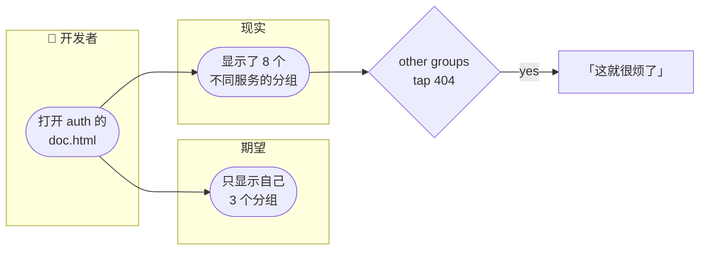
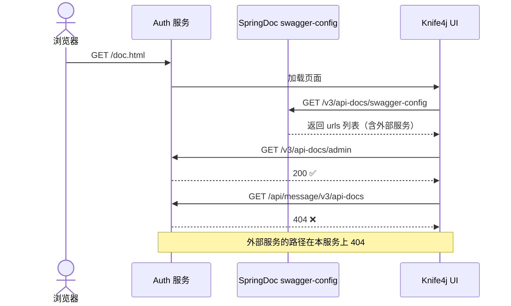
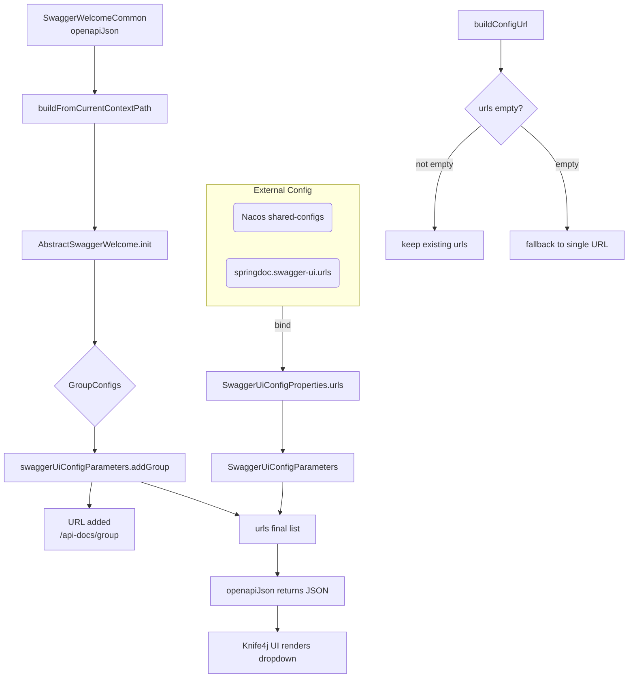
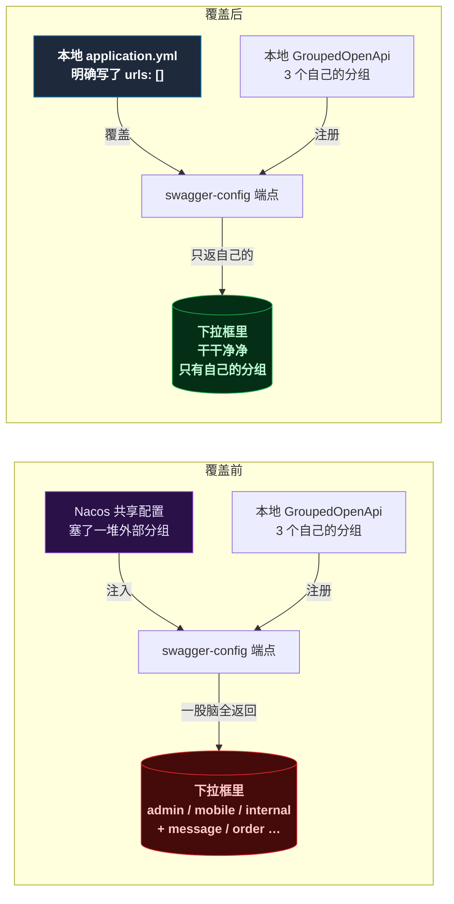

# 隔壁服务的 API，怎么跑我这儿来了？

某天启动 auth 服务，打开 `http://localhost:8021/doc.html` ，想看一眼自己刚调好的三个 API 分组——等等，下拉框里怎么还有 message、order 的分组？点过去全是 404，auth 服务上根本就没有这些接口。



代码是同一套代码，springdoc 和 knife4j 版本都是统一管理的，为什么 auth 的文档页面里会出现其他服务的痕迹？某开发者决定，今天不修好不下班。

## 第一反应：去 knife4j 找配置

这种"在一个服务里看到另一个服务的 API"，第一感觉就是 **knife4j 的网关聚合功能** 在作祟。毕竟 knife4j 有个专门的 `knife4j-aggregation-spring-boot-starter` ，专门用来在 gateway 上聚合所有微服务的文档。

二话不说，给每个服务的 `application.yml` 加上：

```yaml
knife4j:
  enableAggregation: false
```

重启，刷新——**没变化**，其他分组稳如泰山地挂在下拉框里。

又试了 `knife4j.cloud.enable: false` ——依然纹丝不动。

这时候某开发者已经意识到，方向可能错了。

### 追到 jar 包里看源码

与其盲猜配置项，不如直接看 knife4j 到底有没有这个开关。

从本地 Maven 仓库里扒出 `knife4j-openapi3-jakarta-spring-boot-starter-4.5.0.jar` ，翻它的自动配置类：

```bash
# 看看自动配置注册了什么
jar tf knife4j-*.jar | grep -i "AutoConfiguration"
```

输出只有两个：

```
Knife4jAutoConfiguration
Knife4jInsightAutoConfiguration
```

反编译 `Knife4jAutoConfiguration` ，发现它只注册了 OpenApi 自定义器、CORS 过滤器和 BasicAuth 过滤器——**没有任何跨服务聚合逻辑**。

`Knife4jInsightAutoConfiguration` 呢？它是个 `CommandLineRunner` ，启动时把本服务的 OpenAPI 信息上报给一个中心化的 Insight 服务器——这只在 `knife4j.insight.enable=true` 时才会激活，默认是关闭的。

结论：**knife4j 基础 starter 本身没有跨服务聚合功能**，问题不在 knife4j 身上。

## 日志露出的狐狸尾巴

既然 knife4j 不是元凶，那看看实际请求了什么。某开发者打开浏览器开发者工具，刷新 doc.html，网络请求一览无余：

```
/v3/api-docs/swagger-config    → 200 （获取文档配置）
/v3/api-docs/admin             → 200 （auth 自己的分组）
/v3/api-docs/mobile            → 200 （auth 自己的分组）
/api/message/v3/api-docs       → error
/api/order/v3/api-docs         → error
```

`/api/message/v3/api-docs` 和 `/api/order/v3/api-docs` —— 这两个路径的格式非常扎眼：`/api/{service-name}/v3/api-docs` 。这既不是 auth 服务能处理的路径，也不是 knife4j 的请求格式，而是 **SpringDoc 的 swagger-config 端点返回了这些 URL**。



所以关键问题是：**SpringDoc 的 swagger-config 端点，从哪拿到这些外部服务的 URL 的？**

## SpringDoc 的 swagger-config 是怎么组装 URL 的

某开发者找到了 SpringDoc 2.6.0 的源码，追踪 swagger-config 的响应生成链路。

请求 `/v3/api-docs/swagger-config` 时，实际处理的是 `SwaggerWelcomeCommon.openapiJson()` 方法：

```java
// SwaggerWelcomeCommon.java
protected Map<String, Object> openapiJson(HttpServletRequest request) {
    buildFromCurrentContextPath(request);
    return swaggerUiConfigParameters.getConfigParameters();
}
```

`buildFromCurrentContextPath` 中调用了父类 `AbstractSwaggerWelcome.init()` ，这个 `init()` 方法是关键：

```java
// AbstractSwaggerWelcome.java
protected void init() {
    springDocConfigProperties.getGroupConfigs()
        .forEach(groupConfig -> 
            swaggerUiConfigParameters.addGroup(
                groupConfig.getGroup(), 
                groupConfig.getDisplayName()
            )
        );
    calculateUiRootPath();
}
```

它遍历 `springDocConfigProperties.getGroupConfigs()` ，对每个 `GroupConfig` 调用 `swaggerUiConfigParameters.addGroup()` 。每次 `addGroup()` 调用，都会在结果集的 `urls` 列表里增加一个条目。

但是—— `GroupedOpenApi` 定义的三个分组（mobile、admin、internal）是通过 `SpringDocAutoConfiguration` 注册的，走的是另一套机制，跟这里的 `GroupConfig` 无关。

那 `/api/message/v3/api-docs` 这种非标准格式的 URL 是谁加的？



分析到这里，某开发者有了一个猜测：**这些外部 URL 是从 Nacos 共享配置（common.yaml）中通过 `springdoc.swagger-ui.urls` 属性注入的**。

在微服务架构中，所有服务共享一个 Nacos 的 `common.yaml` 配置。如果这个配置里定义了：

```yaml
springdoc:
  swagger-ui:
    urls:
      - name: auth
        url: /api/auth/v3/api-docs
      - name: message
        url: /api/message/v3/api-docs
      - name: order
        url: /api/order/v3/api-docs
```

那么所有服务启动时都会加载这些 URL，在自己的 swagger-config 端点上返回它们。

由于不能登录 Nacos 确认（权限原因），某开发者决定从另一个角度验证——**用本地配置覆盖掉任何来自 Nacos 的外部 URL**。

## 绕了三个弯的解决方案

### 第一次尝试：swagger-ui.urls 覆盖

```yaml
springdoc:
  swagger-ui:
    urls: []
```

想法很直接：把 `urls` 设为空列表，覆盖 Nacos 注入的值。Spring Boot 的配置优先级是 `application.yml > Nacos config` ，这应该生效。

结果：**部分生效**。本服务的三个分组仍然在，但外部 URL 有所减少，没有完全清除。

### 第二次尝试：关掉 discovery 自动发现

```yaml
springdoc:
  api-docs:
    discovery:
      enabled: false
```

SpringDoc 有一个 `springdoc.api-docs.discovery.enabled` 属性，默认就是 `false` ，但某开发者怀疑 Nacos 配置里可能把它改成了 `true` 。显式设回 `false` ，强制覆盖。

### 第三次尝试：限制包扫描范围

```yaml
springdoc:
  packages-to-scan: cn.net.mall.auth
```

告诉 SpringDoc：别到处扫描，我 auth 服务只看自己的包。

### 最终的完整配置

三重覆盖合在一起，才是最终有效的方案：

```yaml
springdoc:
  api-docs:
    enabled: true
    path: /v3/api-docs
    groups:
      enabled: true
    discovery:
      enabled: false
  swagger-ui:
    enabled: true
    path: /swagger-ui.html
    urls: []
    disable-swagger-default-url: true
  packages-to-scan: cn.net.mall.auth
  show-actuator: false
  cache:
    disabled: true
```

每个服务的 `packages-to-scan` 改成自己的根包：
- auth → `cn.net.mall.auth`
- product → `cn.net.mall.product`
- basic → `cn.net.mall.basic`
- 依此类推



## 总结与反思

回头看这个问题，某开发者花了不少时间在错误的方向上——一开始总认为是 knife4j 的锅，翻了一圈它的源码才发现人家根本没有这个功能。真正的问题躲在 SpringDoc 的配置链路里，由 Nacos 共享配置静默注入。

| 尝试 | 结果 | 原因 |
|------|:----:|:-----|
| `knife4j.enableAggregation: false` | ❌ | 这是 gateway 模块的属性，基础 starter 不认识 |
| `knife4j.cloud.enable: false` | ❌ | Knife4jProperties 里根本没有这个字段 |
| `springdoc.swagger-ui.urls: []` | 🟡 部分有效 | 本地配置优先级需要配合其他属性 |
| 完整 springdoc 本地覆盖 | ✅ | 三层属性联动生效 |

> ⚠️ 新手提示：排查这种"灵异现象"时，先打开浏览器开发者工具看实际请求了什么 URL。请求路径的格式能直接告诉你谁在作祟——`/api/{service}/v3/api-docs` 这种格式 = SpringDoc 配置注入，跟 knife4j 没关系。

某开发者也学到了一个教训：**不要对着配置手册盲猜属性名**。反编译 jar 包看 `Knife4jProperties.class` 的字段列表，五分钟就能确认某个属性是否存在，比写十行 yml 猜来猜去都有效率。

最后，所有サービスの `application.yml` 加上完整的 springdoc 本地配置，从此 doc.html 清清爽爽，只显示自己的分组。下班。

