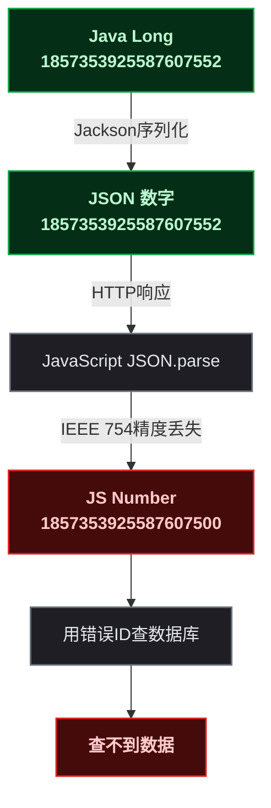
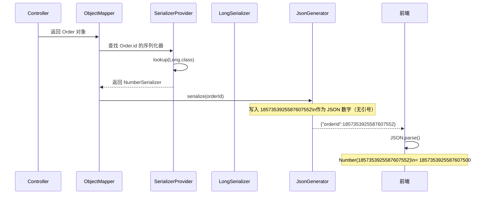
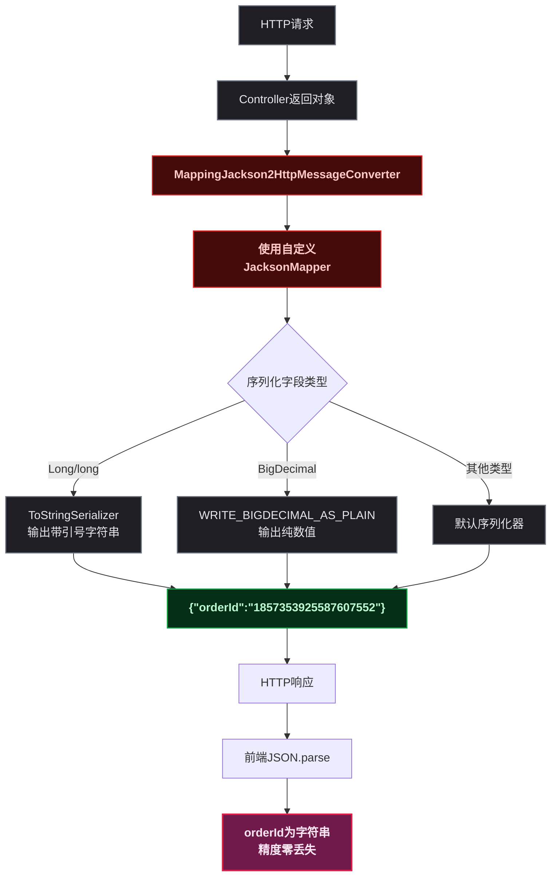

# Long类型ID前端精度丢失：从IEEE 754根因到Jackson全局序列化方案

## 🤔 一、问题切入：一个"找不着"的订单

某天业务反馈：用户在订单详情页点进去一片空白，后台日志里看到查的是 ID `1857353925587607500`，但数据库里根本没有这条记录。翻看上游接口的原始响应体，后端明明返回的是 `1857353925587607552`。

差了多少？不多，就差了 52：`...552` 变成了 `...500`。但这 52 的差距足以让一条订单从数据库里彻底"消失"。

写个最简单的演示：

```java
// 后端：Java Long 值
long orderId = 1857353925587607552L;
System.out.println(orderId);  // 输出: 1857353925587607552 ✓
```

后端没问题。再看前端：

```javascript
// 前端：直接解析后端返回的 JSON
const json = '{"orderId": 1857353925587607552}';
const obj = JSON.parse(json);
console.log(obj.orderId);  // 输出: 1857353925587607500 ✗
```

同一个数字，跨了一道 HTTP 就被"阉割"了最后两位精度。这不是哪家框架的 bug，也不是谁写错了代码——根因在 <strong>JavaScript Number 的底层存储格式</strong>。



这个问题的触发条件很具体：<strong>后端 Long 值超过 9007199254740991（即 2^53 ~ 1，约 16 位十进制数）时</strong>，前端 `JSON.parse()` 解析出的数字就会丢失精度。雪花算法生成的 ID 通常 17 ~ 19 位，正好踩在坑里。

> ⚠️ 新手提示：这不是"偶尔丢一点"的随机 bug。同一个 Long 值每次丢的精度是<strong>确定性的</strong>——IEEE 754 的舍入规则是数学运算，不是概率事件。所以你的测试可能次次踩在同一个坑里。

## 🏗️ 二、根因：IEEE 754 双精度浮点为什么存不下 17 位整数

JavaScript 只有一种数字类型——`Number`。`Number` 的底层是 IEEE 754 双精度浮点数（64 位），它把一块 64 位的内存拆成三部分：

<div style="max-width:700px;font-family:monospace;font-size:13px;line-height:1.8;">
  <div style="display:flex;margin-bottom:2px;">
    <div style="width:24px;text-align:center;background:#FFCCBC;border:1px solid #E64A19;color:#BF360C;margin-right:1px;font-weight:bold;">S</div>
    <div style="width:264px;text-align:center;background:#E1BEE7;border:1px solid #7B1FA2;color:#4A148C;font-weight:bold;">指数（Exponent）11 位</div>
    <div style="width:1256px;text-align:center;background:#C8E6C9;border:1px solid #388E3C;color:#1B5E20;font-weight:bold;">尾数（Mantissa / Fraction）52 位</div>
  </div>
  <div style="display:flex;margin-bottom:4px;">
    <div style="width:24px;text-align:center;background:#FFF3E0;border:1px solid #FFB74D;color:#E65100;">1</div>
    <div style="width:264px;text-align:center;background:#F3E5F5;border:1px solid #CE93D8;color:#7B1FA2;">11 位</div>
    <div style="width:1256px;text-align:center;background:#E8F5E9;border:1px solid #A5D6A7;color:#33691E;">52 位</div>
  </div>
  <div style="font-size:11px;text-align:center;color:#757575;">共 64 位 = 1 + 11 + 52</div>
</div>

<strong>Sign（1 位）</strong> ：符号位，0 正 1 负。

<strong>Exponent（11 位）</strong> ：指数，采用偏移值 1023。实际指数 = 指数字段值 - 1023。

<strong>Mantissa（52 位）</strong> ：尾数，存储有效数字的小数部分。对于规约化数，隐含前导的 1（即实际有效数字为 `1.mantissa`）。

IEEE 754 双精度能精确表示的<strong>连续整数范围</strong>是 `-(2^53 ~ 1) ~ (2^53 ~ 1)`，即 `-9007199254740991 ~ 9007199254740991`。超出这个范围，相邻两个精确整数的间隔会变成 2、4、8……直到非常大。

| 整数范围 | 相邻精确整数的间隔 | 说明 |
|------|:---:|------|
| `-2^53 ~ 1` 到 `2^53 ~ 1` | 1 | 所有整数精确表示 |
| `2^53` 到 `2^54` | 2 | 只能表示偶数 |
| `2^54` 到 `2^55` | 4 | 只能表示 4 的倍数 |
| `2^55` 到 `2^56` | 8 | 只能表示 8 的倍数 |
| … | 递增 ×2 | 指数越大间隔越大 |

雪花算法的标准 ID 是 64 位（1 位符号 + 41 位时间戳 + 10 位机器 ID + 12 位序列号），值域约 `2^59 ~ 2^60`。在这个范围，相邻精确整数的间隔是 `2^7 = 128` 或更大——也就是说，后端传 `...552` 和 `...500`，在 JS Number 看来是"同一个值"。


> 📌 前置知识：理解本节需要知道 IEEE 754 浮点数的基本组成（符号位+指数+尾数）以及二进制科学计数法的概念（任何浮点数表示为 `±1.m × 2^e`）。

## 🔧 三、流程深入：Jackson 序列化链路中 Long 是如何变成 JSON 数字的

在动手改代码之前，先把 Jackson 的序列化链路搞清楚——否则改完不知道改了哪个环节。

当一个 Spring Boot 控制器返回一个包含 `Long` 字段的对象时，Jackson 执行以下序列化流程：



关键点在 <strong>SerializerProvider 的查找逻辑</strong>。Jackson 内部维护了一张从 Java 类型到 `JsonSerializer` 的映射表。当没有自定义配置时：

- `Long.class` → `NumberSerializer`（序列化为 JSON 数字）
- `long.class` → `NumberSerializer`（同上）

这个 `NumberSerializer` 调用 `JsonGenerator.writeNumber(long)`，输出的是<strong>不带引号的数字字面量</strong>。问题就在这一步。

前端收到的 JSON 里，`orderId` 是一个裸数字。`JSON.parse()` 按规范使用 `Number` 类型存储——IEEE 754 双精度——精度丢失发生在这里。

解决方案很明确：<strong>让 Jackson 在序列化 `Long` 时输出字符串，即在数字两侧加引号</strong>。

## 📝 四、源码佐证：JacksonMapper 全局配置

### 4.1 核心配置类

```java
public class JacksonMapper extends ObjectMapper {
    public JacksonMapper() {
        super();
        // ① 忽略未知的 JSON 属性
        this.configure(JsonGenerator.Feature.IGNORE_UNKNOWN, true);
        // ② BigDecimal 按纯数值输出，避免科学计数法
        this.configure(JsonGenerator.Feature.WRITE_BIGDECIMAL_AS_PLAIN, true);
        // ③ 未知 JSON 属性不抛异常
        this.configure(DeserializationFeature.FAIL_ON_UNKNOWN_PROPERTIES, false);

        SimpleModule simpleModule = new SimpleModule();
        // ④ Long 对象类型 → 字符串
        simpleModule.addSerializer(Long.class, ToStringSerializer.instance);
        // ⑤ long 基本类型（包装） → 字符串
        simpleModule.addSerializer(Long.TYPE, ToStringSerializer.instance);
        // ⑥ long 基本类型 → 字符串（显式覆盖，确保万无一失）
        simpleModule.addSerializer(long.class, ToStringSerializer.instance);
        registerModule(simpleModule);
    }
}
```

<strong>逐行解释</strong>：

| 行号 | 配置项 | 作用 |
|:---:|------|------|
| ① | `IGNORE_UNKNOWN` | 前端多传了字段后端不报错（向前兼容） |
| ② | `WRITE_BIGDECIMAL_AS_PLAIN` | BigDecimal 如 `128.50` 输出 `128.50`，而非 `1.2850E+2`。金额字段千万别用科学计数法 |
| ③ | `FAIL_ON_UNKNOWN_PROPERTIES` | 同上方向相反——后端收到未知字段不炸 |
| ④ ~ ⑥ | `ToStringSerializer` | <strong>核心</strong>：让 Jackson 遇到 Long/long 类型时调用 `Long.toString()` 输出带引号的字符串，而非裸数字 |

> ⚠️ 新手提示：④、⑤、⑥ 三行缺一不可。`Long.TYPE` 就是 `long.class`——但有些 Jackson 版本下 `Long.class` 和 `long.class` 在序列化器查找时走不同的路径，写全三行是最稳妥的做法。写过的都懂，少注册一个类型然后线上崩了才是真疼。

### 4.2 MVC 消息转换器注册

```java
@Configuration
public class WebConfig implements WebMvcConfigurer {
    @Bean
    public MappingJackson2HttpMessageConverter getMappingJackson2HttpMessageConverter() {
        return new MappingJackson2HttpMessageConverter(new JacksonMapper());
    }
}
```

Spring Boot 自动配置中有一个 `JacksonAutoConfiguration`，它默认创建 `MappingJackson2HttpMessageConverter` 并注入默认的 `ObjectMapper`。这里通过显式声明同名 Bean，Spring 的 `@ConditionalOnMissingBean` 检测到已有自定义 Bean 后不再自动创建，<strong>全局替换</strong>所有 HTTP 消息转换中的 ObjectMapper。



### 4.3 效果验证

```java
class Demo {
    public static void main(String[] args) throws Exception {
        record Order(Long id, String code) {}
        var mapper = new JacksonMapper();
        var json = mapper.writeValueAsString(
            new Order(100000000000000001L, "T20260205"));
        System.out.println(json);
        // 输出: {"id":"100000000000000001","code":"T20260205"}
        //             ↑ 注意 id 值两侧的引号——这就是关键
    }
}
```

典型响应体示例：

```json
{
  "code": 200,
  "message": null,
  "data": {
    "orderId": "100000000000000001",
    "code": "T20260205",
    "payAmount": 128.50
  }
}
```

`orderId` 被双引号包裹作为字符串传输，前端 `JSON.parse()` 后它是一个 `string` 类型，不再走 `Number` 的 IEEE 754 转换。

## 🔗 五、前后端协同

方案不能只改后端——两边得对好口径，不然 A 团队改了序列化、B 团队前端代码里还拿 `parseInt()` 转回去，前面的活就白干了。

### 后端约定

| 规则 | 说明 |
|------|------|
| Long/long 统一输出字符串 | 全局 JacksonMapper 配置，一劳永逸 |
| BigDecimal 纯数值输出 | `WRITE_BIGDECIMAL_AS_PLAIN`，金额老老实实显示小数 |
| DTO 字段标注语义 | `@ApiModelProperty("字符串化的整型ID，前端勿转为Number")` |
| 接口文档示例对齐 | Swagger/Knife4j 示例中 ID 字段带引号 |

### 前端约定

```typescript
// ✅ 正确：ID 字段声明为 string
interface Order {
  orderId: string;         // Long ID，后端序列化为字符串
  code: string;
  payAmount: number;       // BigDecimal 按纯数值输出，JS Number 安全
}

// ❌ 错误：ID 声明为 number
interface OrderBad {
  orderId: number;         // 大 ID 精度丢失！
  code: string;
  payAmount: number;
}
```

```typescript
// ✅ 如需数值计算，使用 BigInt（ES2020+）
const id = BigInt("1857353925587607552");
const nextId = id + 1n;

// ❌ 不要自行 Number() 转换
const id = Number("1857353925587607552");  // 又丢了！
```

> ⚠️ 新手提示：`BigInt` 是 ES2020 引入的类型，需要浏览器或 Node.js 环境支持。如果项目还在跑 IE11 或老版本 Node，需要 polyfill 或改用字符串拼接的方式处理。大部分现代浏览器（Chrome 67+、Edge 79+）已支持。

### 可选增强：单字段级别控制

如果不想全局替换（比如某些遗留模块依赖 Long 作为数字的默认行为），可以用注解做单字段控制：

```java
public class OrderDTO {
    @JsonSerialize(using = ToStringSerializer.class)
    private Long orderId;     // 仅此字段序列化为字符串

    private Long userId;      // 其他 Long 字段保持默认（数字）
}
```

但这个方案的问题是：每新增一个 Long ID 字段就得加一次注解，容易漏。建议在项目初期就上全局方案，长痛不如短痛。

## 🧪 六、验证与排查

配置完不等于完事了，得把验证链条走通。

### 单元测试

```java
@Test
void longFieldShouldBeSerializedAsString() throws Exception {
    record Order(Long id, String code) {}
    var mapper = new JacksonMapper();
    var json = mapper.writeValueAsString(
        new Order(1857353925587607552L, "T001"));

    // 断言：JSON 中 ID 值带引号
    assertThat(json).contains("\"id\":\"1857353925587607552\"");
}
```

这个测试跑通了，说明 JacksonMapper 配置已生效。

### 接口联调

```bash
# 用 curl 直接抓接口响应，检查 Long 字段是否带引号
curl -s http://localhost:8080/api/order/1857353925587607552 | jq '.data.orderId'
# 期望输出: "1857353925587607552"（带引号，字符串）
```

### 浏览器抓包

打开 DevTools → Network 标签，找到调用后端接口的请求，查看 Response 标签中的原始 JSON。确认 `orderId` 字段的值被双引号包裹。

## 🎯 七、总结

| 维度 | 要点 |
|------|------|
| 根因 | JavaScript Number 是 IEEE 754 双精度浮点，精确整数上限 `2^53 ~ 1`（约 16 位）。雪花 ID 17 ~ 19 位，超出范围后低位被舍入 |
| 后端方案 | Jackson 全局 `ToStringSerializer` 注册 Long/long → 字符串；`WRITE_BIGDECIMAL_AS_PLAIN` 保证金额输出纯数值 |
| 前端方案 | TypeScript ID 字段声明 `string`；数值计算用 `BigInt`；不要对后端 ID 做 `parseInt()` |
| 验证 | 单元测试断言输出 JSON 中 ID 带引号；curl 抓接口确认；DevTools 检查响应体 |
| 协同 | DTO 标注语义、接口文档示例与实现一致、前后端统一把 ID 当字符串处理 |

这个问题在微服务、分库分表、雪花 ID 普及的当下几乎每个项目都会遇到。后端把序列化配好，前端把类型声明对齐，前后端协同到位之后这坑就再也不会踩了。别等到线上订单"找不到"了才想起来改——从项目第一天就把 JacksonMapper 配好，少一件排查的冤案。




