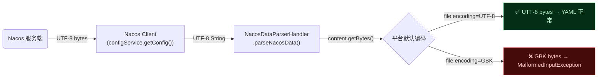
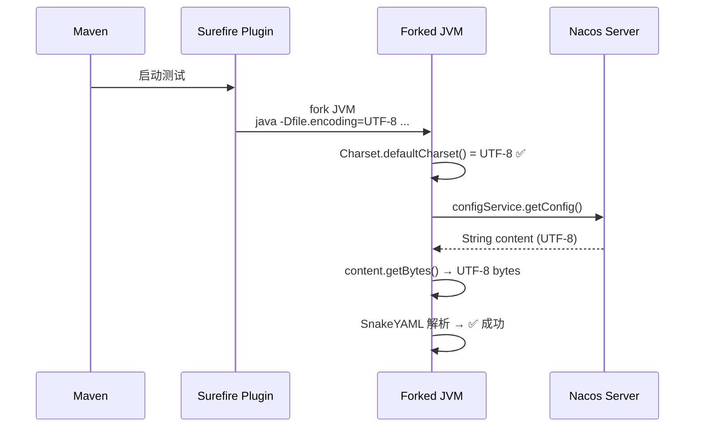

# 又见编码问题：mvn test 报 MalformedInputException，IDE 却好好的

某开发者最近在项目中遇到一个奇怪的现象：`mvn test` 跑 Spring Boot 集成测试时，应用上下文启动失败，控制台抛出一串 `MalformedInputException: Input length = 1`。但同样的代码，在 IDE 里直接点"运行"按钮，启动得丝般顺滑。

这看起来像是 Nacos 配置中心的问题——因为错误信息里提到了 `nacos:mall-auth-api-dev.yaml` 配置文件找不到。但用 curl 请求 Nacos API，配置明明存在，内容也是合法的 YAML。

到底是哪里出了问题？

## 问题复现

执行命令：

```bash
mvn test -pl mall-auth
```

控制台输出类似：

```
***************************
APPLICATION FAILED TO START
***************************

Description:

Config data resource 'NacosConfigDataResource{...}' 
via location 'nacos:mall-auth-api-dev.yaml' does not exist
```

但此刻如果打开浏览器访问 Nacos 控制台，或者用 curl 直接拉取：

```bash
curl "http://localhost:8848/nacos/v1/cs/configs?dataId=..."
```

配置内容完整返回，HTTP 状态码 200。所以配置是存在的，但 Nacos 客户端在 Spring Boot 中读取失败了。

翻到堆栈深处，真正的异常是：

```
Caused by: org.yaml.snakeyaml.error.YAMLException: 
  java.nio.charset.MalformedInputException: Input length = 1
  at com.alibaba.cloud.nacos.parser.NacosDataParserHandler.parseNacosData(...)
  at com.alibaba.cloud.nacos.configdata.NacosConfigDataLoader.pullConfig(...)
Caused by: java.nio.charset.MalformedInputException: Input length = 1
  at java.base/java.nio.charset.CoderResult.throwException(...)
  at java.base/sun.nio.cs.StreamDecoder.implRead(...)
```

这就清楚了——不是配置"不存在"，而是配置内容解析时遇到了字符编码问题。SnakeYAML 在读取 YAML 时，接收到了一个无法解码的字节序列。

> ⚠️ 新手提示：`MalformedInputException` 通常意味着你用一个编码去读另一个编码的数据。比如用 GBK 解码器读 UTF-8 内容，碰到 UTF-8 特有但 GBK 不认识的字节序列就会抛这个异常。

## 排查路线：堆栈追踪

错误堆栈的调用链路很清晰，逐层往下看：

```text
ConfigDataResourceNotFoundException
  └─ YAMLException: MalformedInputException: Input length = 1
       └─ NacosDataParserHandler.parseNacosData(...)
            └─ NacosConfigDataLoader.pullConfig(...)
                 └─ ConfigDataImporter.load(...)
```

关键节点是 `NacosDataParserHandler.parseNacosData`。这个类是 Spring Cloud Alibaba 提供的 Nacos 配置解析器。它从 Nacos 服务端获取配置的文本内容，然后交给 Spring Boot 的 `PropertySourceLoader` 解析成属性源。

`MalformedInputException` 出现在 YAML 解析阶段，说明传入 `PropertySourceLoader` 的字节数据有问题。但同一个配置内容用 curl 拉下来后 Python `yaml.safe_load()` 能正常解析——排除配置内容本身的问题。

问题一定出在中间传输或字符转换环节。

## 源码验证：javap 反编译

既然怀疑是 `NacosDataParserHandler` 的问题，那就看看它的字节码。从 Maven 本地仓库找到 jar 包：

```bash
# 定位 jar 包
find ~/.m2 -name "spring-cloud-starter-alibaba-nacos-config-*.jar"

# 反编译 NacosDataParserHandler
javap -c -p -classpath "$CLASSPATH" \
  com.alibaba.cloud.nacos.parser.NacosDataParserHandler
```

反编译 `parseNacosData` 方法的核心逻辑（以 YAML 格式为例）：

```java
// 经过简化的字节码对应源码
public List<PropertySource<?>> parseNacosData(String dataId, String content, String extension) {
    // 1. 检查参数
    if (!StringUtils.hasLength(content)) return Collections.emptyList();
    
    // 2. 遍历 PropertySourceLoader，找到能处理该后缀的
    for (PropertySourceLoader loader : propertySourceLoaders) {
        if (!canLoadFileExtension(loader, extension)) continue;
        
        // 3. 关键！将 String 转成 ByteArrayResource
        //    注意这里用的是 content.getBytes() —— 无参版本！
        NacosByteArrayResource resource = new NacosByteArrayResource(
            content.getBytes(),    // ← 踩坑点
            dataId
        );
        resource.setFilename(getFileName(dataId, extension));
        
        // 4. 交给 Spring Boot 的 Loader 解析
        List<PropertySource<?>> sources = loader.load(name, resource);
        // ...
    }
}
```

关注第 3 步的 `content.getBytes()`。在 Java 中：

| 方法 | 编码 | 是否可控 |
|------|------|----------|
| `String.getBytes()` | 平台默认编码（`file.encoding`） | ❌ JVM 启动时固定 |
| `String.getBytes(StandardCharsets.UTF_8)` | UTF-8 | ✅ 显式指定 |
| `String.getBytes(Charset.forName("GBK"))` | GBK | ✅ 显式指定 |

`String.getBytes()` 的无参版本是一个**臭名昭著的平台编码陷阱**（许多 Java 编码问题都起源于它）。它会使用 `Charset.defaultCharset()`，而这个值由 `file.encoding` 系统属性决定，**在 JVM 启动时固定**，运行时 `System.setProperty("file.encoding", "UTF-8")` 对它毫无影响。

完整的数据流如下：



## 为什么 IDE 启动没问题？

核心原因：**IDE 默认设置了 `-Dfile.encoding=UTF-8`**。

用 IntelliJ IDEA 启动应用时，它会在 JVM 参数中自动追加 `-Dfile.encoding=UTF-8`。所以即使操作系统是中文 Windows（默认编码 GBK），IDE 启动的子进程也使用的是 UTF-8。

而 `mvn test` 通过 Maven Surefire 插件分叉出一个子 JVM 来执行测试时，这个子 JVM 的 `file.encoding` 继承了 Maven 进程本身的值。Maven 进程在终端中启动，终端通常不设置 `file.encoding`，JVM 就会使用操作系统的区域设置——中文 Windows 下就是 GBK。

这种"IDE 能跑，命令行挂了"的场景在编码类问题上非常典型。背后是两套 JVM 启动参数的差异。


> 📌 前置知识：`file.encoding` 是 HotSpot JVM 的内部属性，启动时从操作系统区域设置读取，放入系统属性中。它不是标准 Java 规范的一部分，但被大量框架和 JDK 内部类依赖。设置方式只有一种：在 JVM 启动命令行上加 `-Dfile.encoding=<编码名>`。运行时用 `System.setProperty` 修改它无法改变已经初始化的 `Charset.defaultCharset()`。

## Spring Cloud Alibaba 的定位

既然问题出在 `NacosDataParserHandler` 的 `content.getBytes()`，这是不是 Spring Cloud Alibaba 的 bug？

严格来说，**这是一个兼容性问题**。Spring Cloud Alibaba 的 `NacosDataParserHandler` 在将 Nacos 返回的 String 转成字节数组时，没有显式指定编码。在绝大多数情况下（服务端部署在 Linux/macOS，开发者在 Mac/IDE 上工作），默认编码就是 UTF-8，所以问题不暴露。

但在 Windows 中文系统 + 命令行构建这个特定组合下，平台默认编码切换到 GBK，问题就浮出水面了。

Spring Framework 自身的 `PropertiesLoaderSupport` 和 `YamlPropertySourceLoader` 在读取资源时通常会用 `StandardCharsets.UTF_8` 或内置 BOM 检测，所以没有类似问题。Nacos 的 `NacosConfigService` 在返回内容时使用 String，没有携带原始编码信息，传递过程中丢失了字节层面的编码标记。

## 解决方案：一行配置

既然问题出在文件编码不一致，最直接的修复就是让 Maven Surefire 分叉的 JVM 使用 UTF-8 编码。

在 `pom.xml` 的 `maven-surefire-plugin` 配置中加入：

```xml
<plugin>
    <groupId>org.apache.maven.plugins</groupId>
    <artifactId>maven-surefire-plugin</artifactId>
    <configuration>
        <argLine>-Dfile.encoding=UTF-8</argLine>
    </configuration>
</plugin>
```

这一行配置的效果是：Surefire 在分叉子 JVM 执行测试时，会追加 `-Dfile.encoding=UTF-8` 到启动参数中，让子 JVM 明确知道用 UTF-8 编码处理所有文件操作。



如果你不想修改 `pom.xml`（或者排查期间临时测试），也可以设置环境变量：

```bash
# bash / zsh
JAVA_TOOL_OPTIONS="-Dfile.encoding=UTF-8" mvn test

# Windows cmd
set JAVA_TOOL_OPTIONS=-Dfile.encoding=UTF-8
mvn test
```

`JAVA_TOOL_OPTIONS` 环境变量会被所有 HotSpot JVM 启动时自动读取并追加到命令行参数中。但注意这只适合临时排查——生产 CI/CD 上还是建议把 `argLine` 写进 `pom.xml`，因为某些工具可能会忽略 `JAVA_TOOL_OPTIONS`。

## 最佳实践

这次排查暴露了几个可以在日常开发中注意的点：

### 1. 编码声明不要省略

所有代码里的编码转换，**永远不要用无参版本**。

| ❌ 不推荐 | ✅ 推荐 |
|-----------|--------|
| `str.getBytes()` | `str.getBytes(StandardCharsets.UTF_8)` |
| `new String(bytes)` | `new String(bytes, StandardCharsets.UTF_8)` |
| `new InputStreamReader(is)` | `new InputStreamReader(is, StandardCharsets.UTF_8)` |
| `new OutputStreamWriter(os)` | `new OutputStreamWriter(os, StandardCharsets.UTF_8)` |
| `new FileReader(file)` | `new InputStreamReader(new FileInputStream(file), StandardCharsets.UTF_8)` |

> 为什么 `FileReader` / `FileWriter` 也被列为不推荐？因为它们内部依赖 `Charset.defaultCharset()`。在一个 GBK 系统上读 UTF-8 文件，`FileReader` 就是一颗定时炸弹。Apache Commons IO / Guava 的 `FileUtils` 相关的 API 也需要注意这一点。

### 2. Maven 构建编码标准化

在 `pom.xml` 的 `<properties>` 中声明：

```xml
<project.build.sourceEncoding>UTF-8</project.build.sourceEncoding>
<project.reporting.outputEncoding>UTF-8</project.reporting.outputEncoding>
```

同时确认 `maven-compiler-plugin` 和 `maven-surefire-plugin` 的编码参数与之一致。前者影响源码编译，后者影响测试运行。

### 3. CI/CD 构建环境模拟

如果你的 CI/CD 跑在 Linux Docker 容器上，那编码问题不会在 CI 上暴露，只会在 Windows 开发者本地出现。反之亦然。建议：

- 本地开发用 IDE 启动，但**定期用命令行构建**验证环境差异
- CI/CD 构建参数尽量与开发者本地一致（编码、JDK 发行版、OS 语言设置）

## 总结

| 环节 | 内容 |
|------|------|
| **现象** | `mvn test` 抛出 `MalformedInputException: Input length = 1`，IDE 启动正常 |
| **定位** | 堆栈追溯到 Spring Cloud Alibaba `NacosDataParserHandler.parseNacosData()` |
| **根因** | `content.getBytes()` 使用平台默认编码（Windows 中文 → GBK），生成的字节流被 SnakeYAML 当作 UTF-8 解析时导致异常 |
| **修复** | `maven-surefire-plugin` 加 `<argLine>-Dfile.encoding=UTF-8</argLine>` |
| **深层原理** | `file.encoding` 在 JVM 启动时固定；`String.getBytes()` 无参版本是平台编码陷阱 |

这次排查看起来是一个配置问题，追到源码层面发现是底层字符集处理的一个老生常谈的陷阱。**任何从 String 到 byte[] 的转换，如果不显式指定编码，在跨平台场景下都是一颗雷。** 不是说"我的代码在 X 平台没问题"就够了——Java 的跨平台优势恰好让这类问题具有隐蔽性：它在你的环境不浮现，在同事的环境不浮现，等到生产环境或者某个边缘环境才爆发。

如果你也有类似"IDE 能跑，命令行挂了"的诡异问题，不妨先查查 `file.encoding`——也许问题根源比你想象的更底层。
