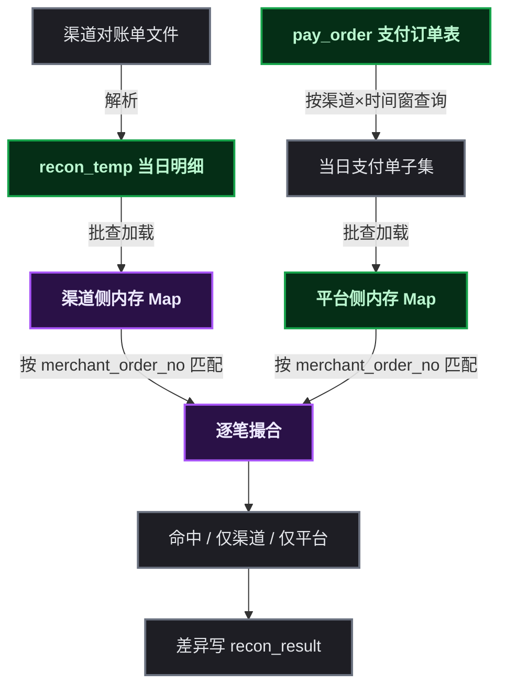
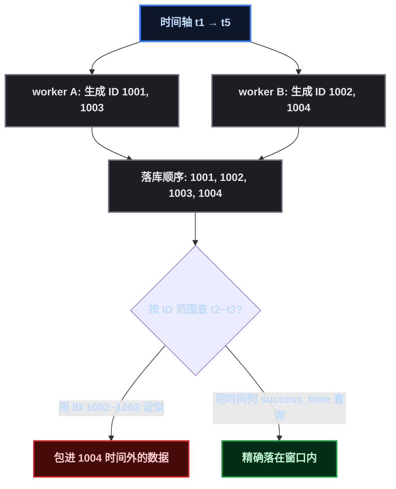
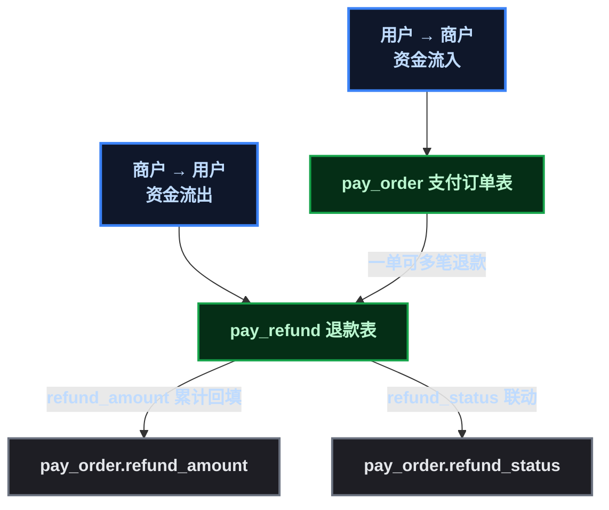
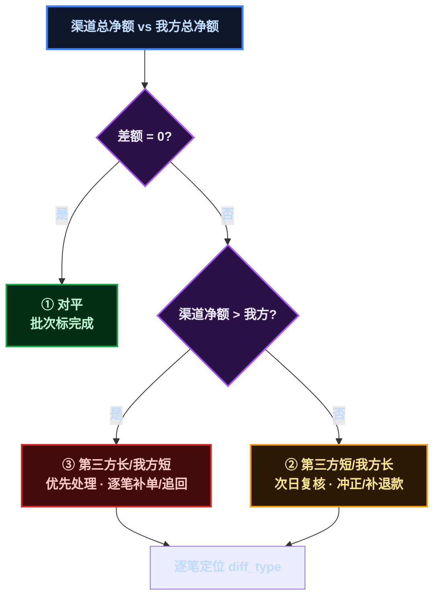

# 一份支付设计方案，是怎么被审出五个洞的

某开发者在设计一套统一支付服务。初版方案自认为考虑周全：支付订单表、退款表、渠道配置、对账批次，表格一张比一张漂亮。然后跟组里人过了一遍设计，被一个问题接一个问题地问到改稿——**每一问都补出一个之前没想透的缺陷**。

这篇就把这次增量讨论里补上的五个点记下来。它们不是"支付系统特有的冷知识"，而是**任何一个会分库分表、会对账、要复用的系统都可能踩的坑**。

## 场景：一个要复用的统一支付服务

先交代背景。这套支付服务的目标是：

- 从"模拟支付"改造成**真实支付**——聚合支付宝、微信支付、微信小程序支付，未来还可能接更多国内渠道
- 拥有**自己的数据库**（此前完全没有，支付数据存在别处）
- 带一套**每日对账系统**——拉取渠道对账单、解析、批量入库、逐笔对比、算差异
- **日后作为独立支付服务接入其他项目**（商城只是第一个业务方）

正是"要复用"和"要对账"这两点，引出了下面五个洞。

## 洞一：对账的逐笔对比写了 JOIN

初版对账设计里，逐笔对比是这么写的：

```sql
-- 渠道账单临时表 LEFT JOIN 本地支付订单表
SELECT t.trade_no, t.amount, o.pay_amount, ...
  FROM recon_temp t
  LEFT JOIN pay_order o ON t.trade_no = o.merchant_order_no;
```

乍看没毛病——两张表同库、有公共键。但评审的人问了一句："**pay_order 分库分表之后，这个 JOIN 还能跑吗？**"

不能。跨表 JOIN 需要分片键能路由到同一分片，而 `recon_temp` 和 `pay_order` 的分片键不同（一个按批次、一个按用户），JOIN 会退化成**全分片广播扫描**——每一个分片都扫一遍再合并，数据量一大就是灾难，更别说分片规则一变直接报错。

> 📌 前置知识：分库分表后，跨表 JOIN 要保证两张表的行落在**同一个分片**（同分片键）才能路由；分片键不一致时只能广播到所有分片再内存合并。

改法：**双批查询 + 内存撮合**。



两个单表查询各自按自己的分片键路由（ ` recon_temp ` 按 ` batch_no ` 、 ` pay_order ` 按 ` user_id ` ），各自只取撮合需要的列，在内存里建 HashMap 按 ` merchant_order_no ` 精确匹配。**全程无跨表 JOIN**——这就是"无联表"原则，也是后续分库分表的**前提条件**。

伪代码比 SQL 更直白：

```java
for (billRow : channelSide) {
    hit = platformMap.get(billRow.tradeNo);   // 命中 or 仅渠道
}
for (payOrder : platformSide) {
    hit = channelMap.get(payOrder.merchantOrderNo);  // 命中 or 仅平台
}
```

> ⚠️ 新手提示：不是"JOIN 一定坏"，而是"**要分库分表的库**不能依赖跨表 JOIN"。单体单库时代 JOIN 是合法的，设计时先想清楚这张表会不会分片。

## 洞二：以为雪花 ID 能当对账的时间边界

评审的第二问更隐蔽："对账按渠道账单的最早/最晚时间从订单表检索，**你怎么保证雪花 ID 绝对顺序插入、趋势递增、时间能对上？**"

初版方案里有种模糊的想法：雪花 ID 内嵌时间戳，ID 大小顺序 ≈ 时间先后，也许能用 ID 范围近似时间窗口，直接走聚簇主键扫描。评审把这层纸捅破了：

**雪花 ID 是趋势递增，不是时间有序。** 同一个 worker 同一毫秒内靠 sequence 递增，但**不同 worker 之间是交错的**——worker A 的 ID 可能比 worker B 晚生成的还大；时钟回拨还会让某个 worker 吐出更小的 ID。ID 大小顺序和真实时间先后，**不保证一致**。



结论：

- **时间锚点必须落在时间列上**—— ` pay_order.success_time ` （支付成功落库时刻），对账窗口查询一律以它为边界
- **不用主键 ID 近似时间**——ID 范围会包进窗口外的数据
- 为这两个字段补联合索引 `(channel_code, success_time)`，先等值走渠道、再范围走时间
- 雪花趋势递增的唯一好处是**写性能**（InnoDB 插入近顺序，少页分裂），与对账正确性无关

顺带补了一个更实际的坑：**渠道时间和我方时间是两个时钟**。渠道账单记录的交易完成时间，与我们的 ` success_time ` 差几秒到几分钟（回调延迟、网络抖动）。严格按渠道账单时间查，窗口边界上的交易会被误判成"渠道有单、平台无"。所以平台侧要按 **trade_date 整日 + 跨日缓冲** 查询（ ` success_time ` 落在 ` [00:00:00, 次日 06:00:00) ` ），吸收延迟回调。时间窗只决定"加载哪些记录"，**逐笔匹配仍按 ` merchant_order_no ` 精确相等**，时间不参与单笔比较。

## 洞三：退款和支付的关系，一开始是错的

初版把支付状态设计成"待支付/已支付/已退款/失败"四个状态——一个字段想表达一切。评审指出这**表达不了"已支付 + 部分退款"**：用户付了 100，退了一半，到底是已支付还是已退款？字段只能二选一，账就乱了。

改法是把"收钱"和"退钱"**拆成两个领域**：



- ` pay_order ` ：**用户 → 商户**的资金流入， ` pay_amount ` 记实付
- ` pay_refund ` ：**商户 → 用户**的资金流出，一笔支付单可对应**多笔退款单**（部分退、多次退）
- 支付状态机只管"收钱"：待支付 → 支付中 → 已支付；退款走独立的 `refund_status` 维度，**不回退 pay_status**
- 对账时两表构成对冲：`我方净额 = Σ(pay_amount) − Σ(refund_amount)`

这个模型还有个意外收获：因为支付宝账单**只返回交易成功的记录**，而"交易成功"里支付和退款同时存在（同一笔订单先支付、后部分退），对账单上支付行和退款行是**同时出现**的。退款单独立建模后，对账的退款行能精确对上 ` pay_refund ` ，而不是模模糊糊归到"已支付单少了点钱"。

## 洞四：退款表缺了用户维度

建模对了，但检查字段时又发现一个洞：** ` pay_refund ` 表没有 ` user_id ` 和 ` biz_type ` **。

财务最终统计时，同一用户对同一商品订单发生支付 + 退款，需要在两张表里都能按**用户 ID + 商品订单**对齐。退款单只有 ` pay_order_id ` ，想按用户查退款就得先 JOIN 回支付单——又回到洞一的联表问题。

补法：**冗余字段镜像**。

| 对齐键 | `pay_order` | `pay_refund` |
|--------|:---:|:---:|
| ` user_id ` （用户ID） | ✅ | ✅ 冗余 |
| ` biz_type ` （业务类型） | ✅ | ✅ 冗余 |
| ` biz_order_no ` （商品订单号） | ✅ | ✅ 冗余 |
| `pay_order_id` / `pay_order_no` | — | ✅ 直连支付单 |

退款单的 ` user_id ` 、 ` biz_type ` 、 ` biz_order_no ` 从支付单**复制一份**（非外键），财务按 ` WHERE user_id=? AND biz_order_no=? ` 在两表各自查询即可对上，全程无联表。这是"无联表原则"下的标准做法：**用冗余换掉 JOIN，用唯一索引换掉外键**。

> ⚠️ 新手提示：冗余字段的代价是"同一信息存两份、要同步维护"，所以只冗余**稳定且高频对齐**的键（用户、业务单号），不要无脑全字段复制。

## 洞五：对账结果只有"平/不平"两种太粗糙

初版对账把结果简单分成"对上了/有差异"，评审问："有差异到底谁多谁少？往哪个方向处置？"

梳理之后发现，**因为渠道账单只含交易成功的订单**，对账收敛成三种情形，且处置优先级完全不同：

| 结果 | 判定 | 含义 | 后果 |
|------|------|------|------|
| **① 相同** | 渠道笔数 = 我方成功笔数，净额相等 | 账实一致 | ✅ 对平，流程结束 |
| **② 第三方短 / 我方长** | 渠道净额 < 我方净额 | 我方**多记了收款**（虚记/渠道漏单）或少记退款 | ⚠️ 短款：账面资金虚高，账实不符 |
| **③ 第三方长 / 我方短** | 渠道净额 > 我方净额 | 我方**少记了收款**（回调丢失）或多记退款 | 🔴 长款：渠道收了用户的钱我方未入账，**资金风险最高** |



- **③ 长款必须当日清零**——涉及"渠道收了用户的钱，我方未入账"，要么是回调丢失要补单，要么是重复退款要追回，每一笔都是钱
- **② 短款是内部账实不符**——我方多记了，冲正或补退款，可次日复核
- 处置策略：**总额先行分治**——差额为零直接判对平（省掉逐笔）；非零才进逐笔定位，按 ②/③ 方向走不同处置链路

## 贯穿始终的原则：业务字段通用性

这套系统还要复用到其他项目，所以支付库**只存所有业务都具备的"基本面"字段**：

- 必须字段只有 6 个： ` biz_order_no ` 、 ` biz_type ` 、 ` user_id ` 、 ` total_amount ` 、 ` channel_code ` 、 ` subject `
- 商品明细、收货地址、优惠明细这些业务专属信息**留在业务方库里**，支付库不复制
- 接入新业务方 = 分配新 ` biz_type ` ，**零表结构改动**

```json
{
  "bizOrderNo": "TC202408010001",
  "bizType": "MALL_ORDER",
  "channelCode": "WECHAT_MINI",
  "userId": 10086,
  "subject": "商城订单 TC202408010001（2 件商品）",
  "totalAmount": 39900
}
```

这个字段清单和"无联表""资金流向模型"是一体的：**支付库的每一张表都要能独立追溯、独立分片、独立复用**，这是整场讨论反复出现的底层逻辑。

## 总结：好的系统设计是审出来的

回看这五个洞，没有一个是"冷知识"——全是**追问出来的**：

1. "分表后还能 JOIN 吗？" → 无联表重构
2. "雪花 ID 能当时间边界吗？" → 时间锚点落时间列
3. "已支付 + 部分退款怎么表达？" → 支付/退款拆两个领域
4. "退款按用户怎么查？" → 冗余字段镜像
5. "有差异到底谁多谁少？" → 三种结果 + 处置优先级

> **系统设计的功夫，一半在写方案，一半在被人追问。**

某开发者把这五个点全补进设计方案后，最大的感受是：**方案文档不是一次写成的，是"设计 → 被审 → 补洞"迭代出来的**。下一次再设计要复用的支付系统，开场就先问自己三句话：会不会分库分表？要不要对账？要不要接别的业务方？——答案都会指向同一个方向：**每一张表都能独立追溯、独立分片、独立复用**。
