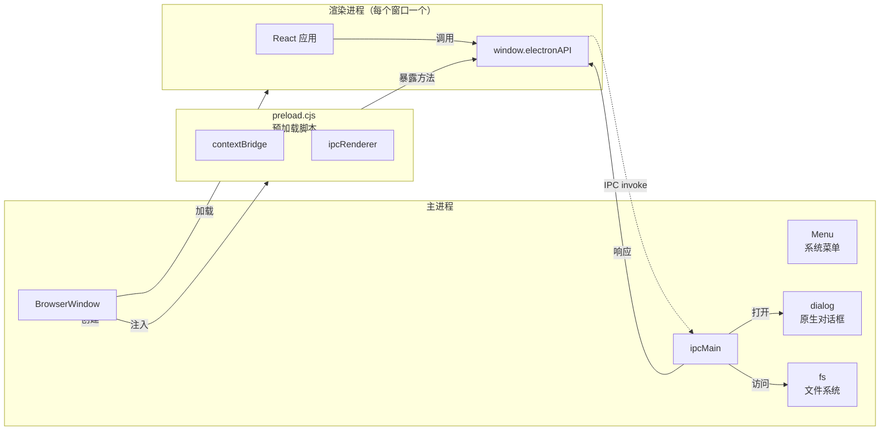
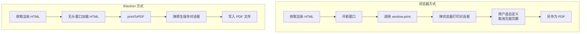

# 把 React 项目搬到 Electron，顺便让 PDF 导出不再闹心

某开发者手头有个 Vite + React + TypeScript 的简历编辑器项目，浏览器里跑得好好的，但每次要导出 PDF 都得先开新窗口、再唤出浏览器打印对话框、再手动取消「页眉和页脚」——这套操作重复多了真的会烦躁。于是决定把它改成 Electron 桌面应用。

这篇文章记录了改造全过程，顺便解决了国内下载 Electron 二进制的问题，以及几个常用的调试命令。

## 第 1 步：先确认你从什么起点出发

这次改造的对象是一个标准的 Vite + React + TypeScript 前端项目，没有用任何奇怪的自定义配置。如果你也是类似的项目结构，可以直接照着操作。

**改造前后的技术栈对比：**

| 改造前 | 改造后 |
|--------|--------|
| Vite 8 开发服务器 | Vite 8 + Electron 43 |
| React 18 + TypeScript | 不变 |
| MUI v9 组件库 | 不变 |
| `window.print()` 导出 PDF | `webContents.printToPDF()` 原生导出 |
| 浏览器 localStorage 持久化 | 不变 + 原生「另存为」对话框 |

**验证入口：** 项目根目录应该有一个 `package.json`，内含 `"scripts": { "dev": "vite" }`，项目本身能通过 `npm run dev` 正常启动。

## 第 2 步：安装依赖并搞定国内下载

安装 Electron 本身只需要一行命令：

```bash
npm install --save-dev electron electron-builder concurrently wait-on
```

但是——在国内跑这行命令，大概率会卡在 `Downloading Electron binary...` 这一步，半天不动。

**原因：** Electron 的 npm 包安装后会去 GitHub Releases 下载一个约 150MB 的二进制文件。对，每次 `npm install` 都会下载。GitHub 的 Releases CDN 在国内访问速度非常不稳定。

### 解决方式一：.npmrc 配置镜像（推荐）

在项目根目录创建 `.npmrc` 文件：

```ini
electron_mirror=https://npmmirror.com/mirrors/electron/
```

> ⚠️ 新手提示：`.npmrc` 中的 `electron_mirror` 并不是 npm 官方配置项，它是由 electron 包的 `postinstall` 脚本读取的，只对 electron 包有效。不是所有包都支持这种写法。

如果不想写文件，也可以用环境变量的方式：

```bash
# Windows PowerShell
$env:ELECTRON_MIRROR="https://npmmirror.com/mirrors/electron/"
npx electron --version

# Windows CMD
set ELECTRON_MIRROR=https://npmmirror.com/mirrors/electron/ && npx electron --version
```

配置好镜像后，再次运行 `npm install`，Electron 二进制会从国内的 npmmirror 下载，速度可以跑到几 MB/s。

### 解决方式二：手动下载指定版本

如果镜像也不行（比如公司内网限制），可以手动下载 Electron 二进制放到缓存目录：

1. 去 GitHub Releases 找到对应版本（`npx electron --version` 可以看需要什么版本）
2. 下载 `electron-v43.0.0-win32-x64.zip`（以 Windows 为例）
3. 放到 `%LOCALAPPDATA%\electron\Cache\` 目录下
4. 重新安装

安装完成后验证一下二进制是否就绪：

```bash
npx electron --version
# 应该输出：v43.0.0
```

## 第 3 步：创建 Electron 入口文件

Electron 需要一个主进程文件来创建窗口、处理系统事件。在项目根目录新建 `electron/` 目录，这里面放所有 Electron 相关的代码。

### 主进程文件：electron/main.cjs

> 📌 前置知识：Electron 的架构分为主进程（Main Process）和渲染进程（Renderer Process）。主进程负责创建窗口、调用系统 API；渲染进程负责页面 UI。两者通过 IPC（Inter-Process Communication）通信。

创建 `electron/main.cjs`，包含三块核心内容：窗口创建、菜单栏、IPC 处理。

```javascript
const { app, BrowserWindow, Menu, ipcMain, dialog } = require('electron')
const path = require('path')
const fs = require('fs')

const isDev = !app.isPackaged  // 开发模式判断

let mainWindow = null

function createWindow() {
  mainWindow = new BrowserWindow({
    width: 1400,
    height: 900,
    minWidth: 960,
    minHeight: 640,
    webPreferences: {
      preload: path.join(__dirname, 'preload.cjs'),
      nodeIntegration: false,      // 安全：禁止渲染进程直接访问 Node
      contextIsolation: true,     // 安全：隔离渲染进程上下文
    },
  })

  if (isDev) {
    mainWindow.loadURL('http://localhost:5173')  // 开发：加载 Vite  dev server
    mainWindow.webContents.openDevTools({ mode: 'detach' })
  } else {
    mainWindow.loadFile(path.join(__dirname, '../dist/index.html'))  // 生产：加载构建产物
  }
}

app.whenReady().then(createWindow)
```

这里有个关键点：`webPreferences` 的三个配置。`nodeIntegration: false` 防止网页端的 JavaScript 直接调用 Node API；`contextIsolation: true` 把渲染进程和预加载脚本隔离，减少安全攻击面。这两项在 Electron 12+ 默认开启，但显式写上更保险。

### 预加载脚本：electron/preload.cjs

预加载脚本是连接主进程和渲染进程的桥梁。它运行在隔离的上下文中，可以把主进程的功能安全地暴露给网页代码：

```javascript
const { contextBridge, ipcRenderer } = require('electron')

contextBridge.exposeInMainWorld('electronAPI', {
  exportPDF: (html) => ipcRenderer.invoke('export-pdf', html),
  onMenuExportPDF: (callback) => {
    ipcRenderer.on('menu-export-pdf', () => callback())
  },
})
```

为什么不能直接在渲染进程里 `require('electron')`？因为 `nodeIntegration: false` 禁用了这个能力。预加载脚本是唯一能使用 Node API 又可以安全暴露给网页的地方——它通过 `contextBridge.exposeInMainWorld` 把指定方法挂到 `window.electronAPI` 上，网页端通过 `window.electronAPI.exportPDF(html)` 调用，底层走的是 IPC。

### 为什么文件扩展名必须是 .cjs

这是另一个容易踩的坑。如果项目 `package.json` 里有 `"type": "module"`（Vite + React 项目默认有），Node 会把所有 `.js` 文件当成 ES Module 来解析。Electron 的主进程文件用 `require()` 加载模块，这是 CommonJS 语法，在 ES Module 模式下直接报错：

```
ReferenceError: require is not defined in ES module scope
```

两种改法：

1. 把文件后缀改成 `.cjs`，强制 Node 以 CommonJS 模式解析（推荐）
2. 把 `require` 全部改成 `import`，同时把文件改成 ESM 语法（可以但没必要）

同时别忘了更新 `package.json` 里的 `main` 字段：

```json
{
  "main": "electron/main.cjs"
}
```

还有 `electron-builder` 的打包配置也要记得加上 `.cjs` 文件：

```json
{
  "build": {
    "files": ["dist/**/*", "electron/**/*.cjs", "package.json"]
  }
}
```

> 📌 如果不打包成安装包，只在开发环境使用 Electron，`build` 配置可以跳过。

## 第 4 步：分步改造流程

### 4.1 更新 package.json 脚本

新增开发命令和构建命令：

```json
{
  "scripts": {
    "dev": "vite",
    "build": "vite build",
    "dev:electron": "concurrently -k \"npx vite --port 5173\" \"wait-on http://localhost:5173 && npx electron .\"",
    "build:electron": "vite build && electron-builder --win"
  }
}
```

说明一下这几个工具的职责：

- **concurrently**：同时跑多个命令，一个终端窗口管理 Vite 和 Electron 两条进程
- **wait-on**：等 Vite dev server 就绪后再启动 Electron，否则 Electron 加载页面会白屏
- **electron-builder**：把项目打包成 `.exe` 安装包

### 4.2 打通渲染进程到主进程的通信

在 React 代码里，先声明 `electronAPI` 的类型（TypeScript 项目需要）：

```typescript
declare global {
  interface Window {
    electronAPI?: {
      exportPDF: (html: string) => Promise<boolean>
      onMenuExportPDF: (cb: () => void) => void
    }
  }
}
```

然后改造原来的 PDF 导出函数——优先走 Electron 原生 API，否则降级到浏览器 `window.print()`：

```typescript
const handleExportPDF = () => {
  const rendered = getRenderedHTML()  // 获取渲染后的 HTML

  if (window.electronAPI) {
    // Electron：直接生成 PDF 并弹出保存对话框
    window.electronAPI.exportPDF(rendered)
    return
  }

  // 浏览器降级：开新窗口打印
  const win = window.open('', '_blank')
  if (win) {
    win.document.write(rendered)
    win.document.close()
    setTimeout(() => win.print(), 500)
  }
}
```

### 4.3 改造目录结构

改完之后，项目目录大概是这样的：

```
resume-editor/
├── electron/
│   ├── main.cjs        # 主进程
│   └── preload.cjs      # 预加载脚本
├── src/                 # 原有的 React 源码
│   ├── components/
│   ├── templates/
│   └── main.tsx
├── dist/                # vite build 产物
├── package.json
├── .npmrc               # Electron 镜像配置
└── vite.config.ts
```

大部分源码不用动——Electron 加载的是同一个 `dist/` 目录，React 代码完全不感知自己跑在什么环境里。

### 4.4 菜单栏与快捷键

Electron 的菜单栏需要通过 `Menu.buildFromTemplate` 创建：

```javascript
const menu = Menu.buildFromTemplate([
  {
    label: '文件',
    submenu: [
      {
        label: '导出 PDF',
        accelerator: 'CmdOrCtrl+Shift+P',
        click: () => mainWindow?.webContents.send('menu-export-pdf'),
      },
      { type: 'separator' },
      { role: 'quit', label: '退出' },
    ],
  },
  { label: '编辑', submenu: [{ role: 'undo' }, { role: 'redo' }, { role: 'cut' }, { role: 'copy' }, { role: 'paste' }] },
  { label: '视图', submenu: [{ role: 'reload' }, { role: 'toggleDevTools' }, { role: 'zoomIn' }, { role: 'zoomOut' }, { role: 'resetZoom' }] },
])
Menu.setApplicationMenu(menu)
```

注意菜单项的 `click` 回调通过 `webContents.send` 向渲染进程发送消息（而不是直接调用渲染进程的函数），这是 Electron 推荐的跨进程通信方式。

在渲染进程端，通过预加载脚本暴露的 `onMenuExportPDF` 来监听：

```javascript
useEffect(() => {
  if (window.electronAPI?.onMenuExportPDF) {
    window.electronAPI.onMenuExportPDF(() => handleExportPDF())
  }
}, [])
```

## 第 5 步：部署验证

### 开发模式启动

```bash
npm run dev:electron
```

预期行为：控制台输出 Vite 启动在 `5173` 端口，然后 Electron 窗口自动弹出，加载简历编辑器的页面。DevTools 会随窗口一同打开。

### 常见启动问题

| 现象 | 原因 | 解决 |
|------|------|------|
| Electron 窗口白屏 | Vite 还没就绪，Electron 先加载了 | 确保 `wait-on` 在 concurrent 命令里起作用 |
| 窗口闪烁后消失 | `app.whenReady()` 前有异常 | 在 `electron.cmd` 中加 `try/catch` 或在终端中直接运行排查 |
| 无法加载 `file://` 协议 | Vite 构建产物路径不对 | 检查 `dist/index.html` 是否存在，确认 `loadFile` 路径 |
| 控制台不显示任何日志 | 启动时没加 `openDevTools` | 开发模式下调用 `mainWindow.webContents.openDevTools()` |

### 构建安装包（可选）

```bash
npm run build:electron
```

会在 `release/` 目录下生成 `简历编辑器 Setup.exe`，可以直接发给同事安装使用。

## 第 6 步：原理简述

### Electron 的进程模型



Electron 的每个窗口都运行一个独立的渲染进程，通 `contextBridge` + `ipcRenderer` 与主进程通信。主进程负责调用系统 API（文件对话框、文件写入、菜单栏），渲染进程只管 UI。这种架构的好处是：即使某个页面崩溃，也不会影响其他窗口和主进程。

### printToPDF 比 window.print 好在哪里



浏览器方式需要五步操作，其中"取消页眉页脚"这一步几乎每次都会忘——忘了就得重来。Electron 的 `printToPDF` 直接生成 PDF Buffer，不需要任何用户干预，页眉页脚天然不存在。

代码量也很说明问题：

```javascript
// 浏览器方式：约 15 行 JS + 用户手动 3 步操作
const win = window.open('', '_blank')
win.document.write(rendered)
win.document.close()
setTimeout(() => win.print(), 500)

// Electron 方式：约 5 行，全程自动化
const pdf = await win.webContents.printToPDF({
  printBackground: true,
  pageSize: 'A4',
  margins: { top: 0, bottom: 0, left: 0, right: 0 },
})
dialog.showSaveDialog(mainWindow, { title: '导出 PDF' })
fs.writeFileSync(filePath, pdf)
```

## 第 7 步：总结与下一步

把 React + Vite 项目改造成 Electron 没有想象中那么复杂——核心就三点：

1. **两个文件**：`main.cjs` 创建窗口，`preload.cjs` 桥接主进程和渲染进程
2. **一条镜像配置**：`electron_mirror=https://npmmirror.com/mirrors/electron/` 解决国内下载问题
3. **一个通信模式**：渲染进程调 `window.electronAPI` → IPC invoke → 主进程处理 → 返回结果

**还可以继续做：**

- **自动更新**：接入 `electron-updater`，每次启动检查新版本
- **文件关联**：让 `.resume` 后缀的文件双击后自动用本应用打开
- **托盘图标**：最小化时缩小到系统托盘，后台常驻
- **原生菜单栏**：根据当前在编辑的简历内容动态更新菜单状态

这套改造方案在自己的简历编辑器上跑了一段时间，PDF 导出的体验确实比浏览器版好很多——点一次按钮，选个保存位置，就完事了。
