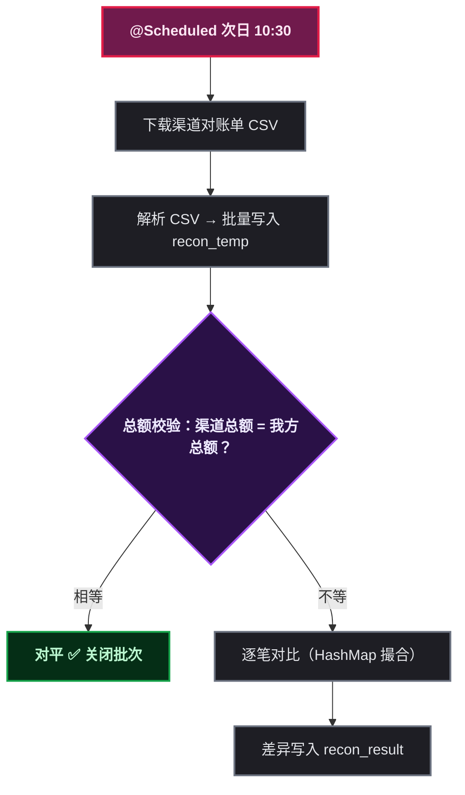
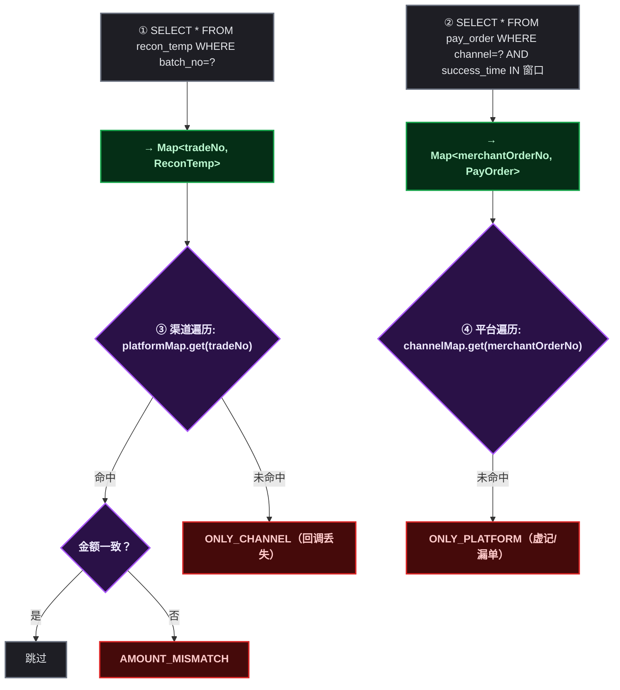
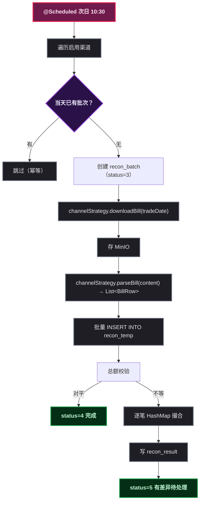

# 对账系统的三张表、两轮比对和七种差异

对账系统是支付服务的最后一道防线——回调可能丢、消息可能漏、金额可能错，这些不会自己暴露。每天拿渠道的官方记录和自己数据库里的记录对一遍，丢钱多钱才能发现。

本文从零梳理一个日终对账系统的设计：数据表怎么建、两渠道 CSV 字段怎么映射、算法怎么做才能既快又不依赖 JOIN。

---

## 一、对账系统的心智模型

对账就一句话：**渠道说每天收了多少钱，我们说每天收了多少钱，两边对一下，不一致就逐笔查**。



选择次日 10:30 触发是因为两家渠道的对账单都在次日 10 点前生成完毕——去早了拿不到文件。

---

## 二、三张表：批次、临时、结果

对账侧三张表各司其职：

| 表 | 用途 | 物理删除？ |
|------|------|:---:|
| `recon_batch` | 一次渠道 × 一天 = 一个批次，记录对账流程状态 | 否（is_del） |
| `recon_temp` | 渠道对账单解析后批量灌入，按批次号隔离 | **是**（临时表，保留 N 天后清） |
| `recon_result` | 逐笔差异记录，每条差异一个处理工单 | 否（is_del） |

### recon_batch 的关键字段

```sql
batch_no          -- 批次号：RECON{yyyyMMdd}{渠道}{序号}
channel_code       -- ALIPAY / WECHAT_PAY
trade_date         -- 对账日（哪天交易的）
channel_count      -- 渠道侧交易总笔数
channel_total_amount -- 渠道侧交易总额（分）
platform_count     -- 本地匹配交易笔数
platform_total_amount -- 本地匹配交易总额（分）
diff_count         -- 差异笔数
diff_total_amount  -- 差异总金额（分）
status             -- 1已下载 2已解析 3对账中 4对平 5有差异 6已处理 7失败
```

`uk_channel_trade_date` 唯一索引保证同一渠道同一天只对一次。

### recon_temp 的字段设计思路

渠道 CSV 每行是一个完整的原子记录（支付或退款），不区分表。`recon_temp` 用「通用字段 + ext_json 扩展列」吸收两渠道的字段差异：

```sql
batch_no          -- 对账批次号
line_no           -- 文件行号（排查用）
trade_no          -- = merchant_order_no（对账匹配键）
channel_trade_no  -- 渠道侧交易流水号
refund_no         -- 退款行才有
trade_time        -- 交易时间
trade_type        -- PAY / REFUND
amount            -- 交易金额（分，正数）
fee               -- 手续费（分）
income            -- 净入账（分，amount - fee，可正可负）
trade_status      -- 渠道侧状态
payer_account     -- 付款方
ext_json          -- 渠道特有字段原样保留
```

> `income` 是总额校验的**唯一字段**——所有金额差异最终都体现为 `SUM(income)` 不等。

### recon_result

每笔差异一条记录，七个 `diff_type`：

| diff_type | 含义 | 处理 |
|------|------|------|
| `LONG_PAYMENT` | 长款（渠道多了、我方少记） 🔴 | 补单/追回 |
| `SHORT_PAYMENT` | 短款（渠道少了、我方多记） ⚠️ | 冲正/退款 |
| `AMOUNT_MISMATCH` | 同单两侧金额不一致 | 人工核对 |
| `ONLY_PLATFORM` | 平台有单、渠道无 | 虚记检查 |
| `ONLY_CHANNEL` | 渠道有单、平台无 | 回调丢失补单 |
| `FEE_MISMATCH` | 手续费不一致 | 费率核对 |
| `STATUS_MISMATCH` | 状态不一致 | 人工核对 |

---

## 三、CSV 字段对照：支付宝 23 列 vs 微信 29 列

对账系统的第一个关键工作就是把两种渠道的对账单字段映射到统一的 `recon_temp`。

### 支付宝业务账单（23 列）→ recon_temp

| CSV 列 | recon_temp 字段 | 处理 |
|------|------|------|
| 支付宝交易号 | `channel_trade_no` | 直接映射 |
| 商户订单号 | `trade_no` | **对账匹配键** |
| 业务类型 | `trade_type` | "交易支付"→PAY，"退款"→REFUND |
| 商品名称 | — | 不入库 |
| 完成时间 | `trade_time` | 直接映射 |
| 订单金额（元） | `amount` | **×100 转分** |
| 商家实收（元） | `income` | **×100 转分** |
| 服务费（元） | `fee` | **×100 转分** |
| 退款批次号/请求号 | `refund_no` | 退款行有 |
| 对方账户 | `payer_account` | 直接映射 |
| 其余字段 | `ext_json` | JSON 保留 |

文件编码：**GBK**，格式 `.csv.zip`，需解压后解析。下载链接 30 秒有效。

### 微信交易账单（29 列）→ recon_temp

| CSV 列 | recon_temp 字段 | 处理 |
|------|------|------|
| 微信订单号 | `channel_trade_no` | 直接映射 |
| 商户订单号 | `trade_no` | **对账匹配键** |
| 交易状态 | `trade_status` | SUCCESS/REFUND |
| 交易时间 | `trade_time` | 直接映射 |
| 应结订单金额（元） | `amount` | **×100 转分**（退款行 0） |
| 退款金额（元） | — | 参考，入 ext_json |
| 手续费（元） | `fee` | **×100 转分**（退款行负数） |
| **净入账** | `income` | **无直接字段**，须 `amount - fee` 计算 |
| 微信退款单号 | `refund_no` | 退款行有 |
| 用户标识 | `payer_account` | 直接映射 |
| 其余字段 | `ext_json` | JSON 保留 |

文件编码：UTF-8，纯 `.csv`。下载链接 5 分钟有效。

### ⚠️ 两渠道 CSV 的四个关键差异


| 差异 | 支付宝 | 微信 |
|------|------|------|
| 编码 | GBK | UTF-8 |
| `income` | 直接有「商家实收」 | **自己算** `amount - fee` |
| 压缩 | `.csv.zip`（需解压） | 纯 `.csv` |
| 链接时效 | 30 秒 | 5 分钟 |
| 退款行 `fee` | 0 | **负数**（退回手续费） |
| 汇总行 | 有 | 有（`\`` 开头） |
| 区分支付/退款 | 「业务类型」列 | 「交易状态」列 |

微信退款行的手续费是**负数**——退款成功时平台会退回对应比例的手续费。用 `income = amount - fee` 计算时，退款行 `amount=0`、`fee=-x`，结果 `income=+x` 刚好是对的。

两渠道 CSV 字段都以反引号（\`）开头（防 Excel 科学记数），解析时要去掉。

---

## 四、对账算法：两级校验

### 第一级：总额校验（O(1)，绝大多数情况就够了）

```sql
-- 渠道侧：当天所有交易的净额汇总
SELECT COUNT(*), SUM(income)
FROM recon_temp WHERE batch_no = ?

-- 平台侧：当天所有支付单的净额
SELECT COUNT(*), SUM(pay_amount) - SUM(refund_amount)
FROM pay_order
WHERE channel_code = ? AND success_time >= ? AND success_time < ?
  AND pay_status = 20 AND is_del = 0
```

| 结果 | 含义 | 风险判定 |
|------|------|:---:|
| 相等 | 对平 | ✅ 关闭批次 |
| 渠道多 / 平台少 | 长款（少记收款） | 🔴 进入逐笔 |
| 渠道少 / 平台多 | 短款（多记收款） | ⚠️ 进入逐笔 |

> 绝大多数情况下总额是对平的——渠道回调+主动查单双重保证，丢单概率极低。总额校验就是快速判定「没问题，收工」。

### 第二级：逐笔对比（HashMap 撮合，不用 JOIN）

仅在总额不等时进入。



不 JOIN 的原因：HashMap 撮合在应用层做，日对账量千级完全够用；未来分库分表时联表不可行。

### 时间对齐

渠道对账单的"交易时间"和我方 `success_time` 是两个时钟，差几秒到几分钟正常。处理方式：

- 平台侧查单用 `success_time` + 缓冲窗口 `[trade_date 00:00, trade_date+1 06:00)`
- 逐笔匹配只看 `merchant_order_no` 相等，不对比时间

---

## 五、代码结构

```
mall-pay/
├── channel/
│   ├── alipay/AlipayChannelStrategy  → downloadBill() / parseBill()
│   └── wechat/WechatPayStrategy      → downloadBill() / parseBill()
├── support/
│   └── BillCsvParser                 → 统一 CSV 解析（GBK/UTF-8，去反引号）
├── service/
│   └── ReconService                  → 对账核心（总额 + 逐笔）
└── job/
    └── ReconJob                      → @Scheduled 定时调度
```

渠道策略只负责「下载 + 解析」，返回渠道无关的 `BillRow` 列表。`ReconService` 不管渠道差异，只认 `BillRow`。

`BillRow` 是中间结构：
```java
tradeNo, channelTradeNo, refundNo, tradeTime, tradeType,
amount, fee, income, tradeStatus, payerAccount, extJson
```

所有金额字段在解析阶段就从元转为分，后续对账全程用分。

---

## 六、对账流水线全流程



每一步都状态化记录在 `recon_batch.status` 里——出问题的时候知道卡在哪一步，从哪里重试。

---

## 七、边界和坑

1. **周日账单**：周一 10:30 的对账没有前一天的账单（周日财务关闭），跳过
2. **微信手续费为负**：退款行 `fee` 是负数，`income = amount - fee` 要正确处理符号
3. **大文件**：日均超过万笔的商户，`loadToTemp` 改为批量 `INSERT` (500 条/批) 或直接用 `LOAD DATA INFILE`
4. **重新对账**：先查 `uk_channel_trade_date`，已完成则跳过；如需重新对账，先删旧批次再触发
5. **跨天交易**： success_time  用 06:00 缓冲窗口捕获凌晨到次日回调的边界单

> 一句话总结：**对账不是让系统没 bug，而是保证有 bug 时从不超过一天就能发现。**
