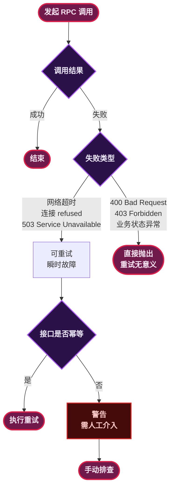
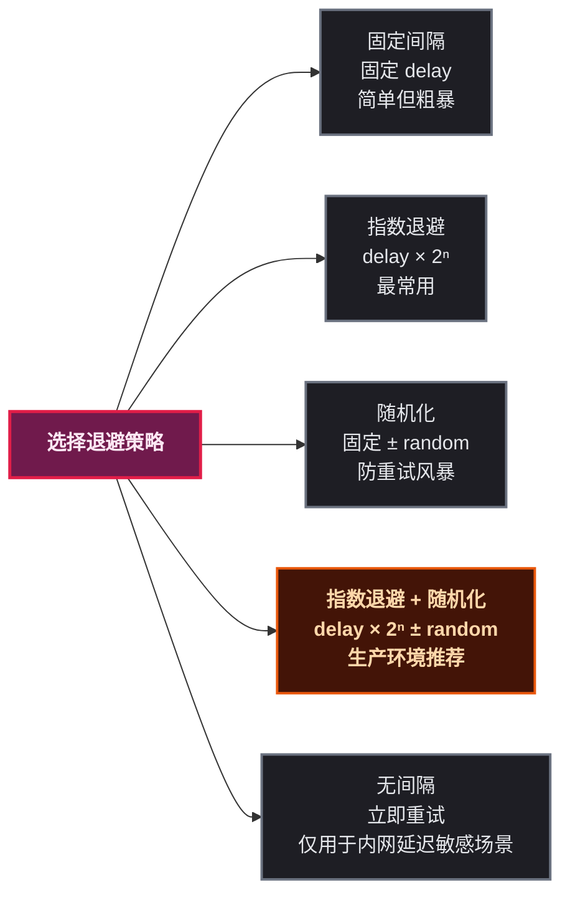

# 接口调失败了？重试之前先看看这四种姿势

## 为什么需要重试

分布式系统里，接口调用失败是常态，不是意外。网络抖动、服务重启、连接池满、Full GC 停摆——这些故障每天都在发生。

但并不是每次失败都值得重试。有些失败重试一下就好了（瞬时故障），有些失败重试一万次也没用（业务异常、参数错误）。区分这两类失败，是设计重试策略的前提：



> ⚠️ 新手提示：重试只适用于瞬时故障（transient failure）。如果下游返回 400/403/ 业务校验失败，查日志修代码，别重试。

## 方案一：手动重试——最简单但也最危险

最直接的方式就是用循环自己搞：

```java
int maxRetries = 3;
int retryCount = 0;
long waitMillis = 1000;

while (retryCount < maxRetries) {
    try {
        Result result = remoteService.call(request);
        return result;
    } catch (RemoteException e) {
        retryCount++;
        if (retryCount >= maxRetries) {
            throw e;
        }
        Thread.sleep(waitMillis);
    }
}
```


- **缺点一**：代码侵入性强，每个需要重试的方法都得写一遍这段模板代码
- **缺点二**：`Thread.sleep()` 是阻塞的，在高并发下会占着线程不释放
- **缺点三**：没有退避策略，每次重试间隔固定，容易让下游雪上加霜

适合快速验证的场景，生产环境不建议这么搞。

## 方案二：Spring Retry——注解驱动的优雅方案

Spring Retry 通过 `@Retryable` 注解把重试逻辑从业务代码中抽离出来，底层基于 AOP 实现：

```java
@Service
public class OrderService {

    @Retryable(
        retryFor = { RemoteException.class, TimeoutException.class },
        maxAttempts = 4,
        backoff = @Backoff(delay = 500, multiplier = 2)
    )
    public Order createOrder(OrderRequest request) {
        return orderRpcClient.create(request);
    }

    @Recover
    public Order fallback(RemoteException e, OrderRequest request) {
        log.error("创建订单失败，进入降级: {}", request.getOrderId(), e);
        return Order.failed(request.getOrderId(), "服务暂时不可用");
    }
}
```

关键参数：

| 参数 | 作用 | 推荐值 |
|------|------|--------|
| `retryFor` | 哪些异常触发重试 | `RemoteException`、`TimeoutException` |
| `noRetryFor` | 哪些异常不重试 | `IllegalArgumentException`、业务异常 |
| `maxAttempts` | 最大尝试次数（含首次） | 3 ~ 5 次 |
| `backoff.delay` | 首次重试间隔 | 500ms |
| `backoff.multiplier` | 退避倍数 | 2（每次翻倍：500ms → 1s → 2s） |
| `backoff.random` | 是否随机化间隔 | `true`（防重试风暴） |

开启方式也很简单，加一个 `@EnableRetry`：

```java
@Configuration
@EnableRetry
public class RetryConfig {
}
```

**工作原理**：Spring AOP 为目标类生成代理，方法调用时由 `RetryOperationsInterceptor` 拦截。失败后根据 `@Backoff` 策略计算等待时间，然后重试。达到上限后如果定义了 `@Recover` 方法，就走降级逻辑。

## 方案三：Resilience4j——功能全面的现代重试库

Resilience4j 不只是一个重试库，它是一个完整的容错框架——重试、熔断、限流、隔离、超时全都有。重试只是它的一环：

```java
// 配置重试规则
RetryConfig config = RetryConfig.custom()
    .maxAttempts(4)
    .waitDuration(Duration.ofMillis(500))
    .intervalFunction(IntervalFunction.ofExponentialBackoff(500, 2.0))
    .retryExceptions(RemoteException.class, TimeoutException.class)
    .ignoreExceptions(BusinessException.class)
    .failAfterMaxRetries(true)
    .build();

Retry retry = Retry.of("orderService", config);

// 装饰业务逻辑
Supplier<Order> retryableSupplier = Retry.decorateSupplier(retry, () ->
    orderRpcClient.create(request)
);

// 执行（可以继续链式组合其他容错策略）
Try<Order> result = Try.ofSupplier(retryableSupplier);
```

配合 CircuitBreaker 一起用才是常见姿势：

```java
CircuitBreaker circuitBreaker = CircuitBreaker.ofDefaults("orderService");
Retry retry = Retry.ofDefaults("orderService");

Supplier<Order> decorated = Decorators.ofSupplier(() -> orderRpcClient.create(request))
    .withCircuitBreaker(circuitBreaker)
    .withRetry(retry)
    .decorate();

Try<Order> result = Try.ofSupplier(decorated);
```

Resilience4j 和 Spring Retry 的核心区别：

| 维度 | Spring Retry | Resilience4j |
|------|:---:|:---:|
| 依赖 | Spring AOP | 无侵入，纯 Java 8 |
| 重试策略 | 固定/指数退避 | 指数退避 + 随机化 + 自定义 `IntervalFunction` |
| 熔断 | 不支持 | 内置 CircuitBreaker |
| 限流/隔离 | 不支持 | 内置 RateLimiter / Bulkhead |
| 注解 | `@Retryable` | `@Retry(name = "xxx")` |
| 指标监控 | 不支持 | 内置 `EventPublisher` + Micrometer |

## 方案四：OpenFeign 内置重试——RPC 框架的默认行为

如果你的服务间调用用的是 OpenFeign，它本身就带重试机制。只不过在 Spring Cloud 环境下，默认重试是 **关闭的**。

开启方式：

```yaml
spring:
  cloud:
    loadbalancer:
      retry:
        enabled: true

# Feign 客户端超时配置
feign:
  client:
    config:
      default:
        connectTimeout: 1000
        readTimeout: 2000
```

Java 配置自定义重试：

```java
@Configuration
public class FeignRetryConfig {

    @Bean
    public Retryer feignRetryer() {
        // period=100ms, maxPeriod=1000ms, maxAttempts=4
        return new Retryer.Default(100, 1000, 4);
    }
}
```

`Retryer.Default` 内部已经实现了指数退避：每次重试间隔 = `period × (1.5 ^ retryCount)`，上限 `maxPeriod`。

```java
@FeignClient(name = "order-service", configuration = FeignRetryConfig.class)
public interface OrderFeignClient {

    @GetMapping("/order/{id}")
    Order getOrder(@PathVariable Long id);
}
```

**OpenFeign 重试的注意点：**

- 默认只对 `GET` 请求重试，`POST`/`PUT`/`DELETE` **不重试**（因为 Feign 默认认为写操作不幂等）
- 如果需要写操作也重试，得自己实现 `Retryer` 接口判断 HTTP 状态码
- OpenFeign 的重试是在客户端层面，不关心业务异常——它只对 IO 异常和超时重试

## 五种退避策略对比

选重试方案就是选退避策略，它决定了你在"快点重试"和"别把下游打崩"之间的取舍：



生产环境推荐 **指数退避 + 随机化**。纯指数退避有个问题：同一时刻大量请求失败，经过相同的退避时间后，又会同时对下游发起重试——形成重试风暴。加一个随机抖动（jitter）可以打散重试时间点。

## 避坑指南：重试不是银弹

### 1. 幂等性是重试的前提

下游收到请求但响应超时，你重试了——下游把同一件事做了两遍。如果在支付场景，那就是生产事故。

解决方案：
- 每次请求携带全局唯一 `requestId`，下游做幂等表去重
- 数据库操作用乐观锁，`update set version = version + 1 where version = ?`

### 2. 重试风暴是真实存在的

当上游几百个服务实例同时检测到一个下游故障，大家一起重试——下游瞬间被打爆，从"有点卡"变成"完全挂了"。

防御措施：
- 退避间隔加随机因子
- 限制最大重试次数（**不要超过 5 次**）
- 配合 CircuitBreaker，熔断开启后不再重试

### 3. 超时时间要合理

重试次数 × 每次超时时间 = 最大等待时间。假如 `connectTimeout=2s`，`maxAttempts=4`，那每次调用最长等 2s，最多等 8s。在用户看来就是接口卡死了。

建议 `readTimeout` 和重试次数别太大，**总超时控制在 5 ~ 10 秒以内**。

### 4. 不要对所有异常重试

常见的错误是 `catch (Exception e)` 然后重试。`NullPointerException` 重试一千次也是 null，`IllegalArgumentException` 重试一万次也是参数错误。

把重试范围收窄到明确的瞬时异常：`SocketTimeoutException`、`ConnectException`、`503 Service Unavailable`。

## 总结

| 方案 | 适用场景 | 复杂度 | 推荐度 |
|------|---------|:---:|:---:|
| 手动 try-catch | 快速验证、一次性脚本 | ⭐ | 不推荐生产 |
| Spring Retry | Spring Boot 项目，简单重试需求 | ⭐⭐ | 推荐 |
| Resilience4j | 需要重试 + 熔断 + 限流组合 | ⭐⭐⭐ | 强烈推荐 |
| OpenFeign Retry | 微服务间 HTTP 调用 | ⭐ | 推荐配合使用 |

重试的核心理念就一句话：**只做能做的事，不做不该做的事**。只对瞬时故障重试，确保接口幂等，控制退避和次数——做到这三点，重试就是稳定性的利器；做不到，就是生产事故的导火索。
