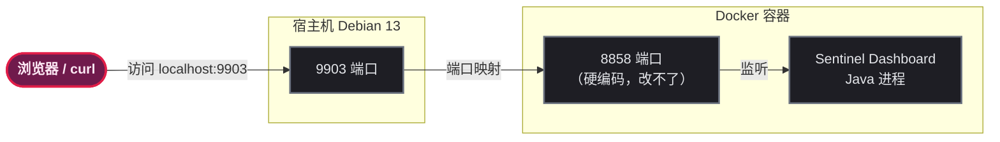
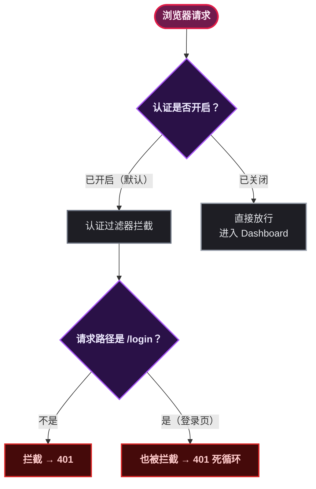
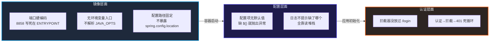

# 被一个社区镜像折磨的 24 小时

## 目标说明

这篇博客的目标很朴素：让读者用 10 分钟把 Sentinel Dashboard 跑起来，而不是花一整天跟一个社区镜像死磕。

某开发者在搭建微服务治理平台时，需要部署 Sentinel Dashboard 作为流量治理控制台。本以为 `docker run` 一把梭，结果被 `bladex/sentinel-dashboard:1.8.6` 这个社区镜像折腾了整整一天——端口改不掉、环境变量传了等于没传、配置文件挂载不生效、启动就崩溃、浏览器打开 401……踩了个遍。

本文将完整记录这 7 个坑的根因、排查过程和最终解决方案。所有配置已在 **Debian 13 + Docker 26+** 下验证通过。

> 📌 **前置知识**：需要了解基本 Docker 操作和 Spring Boot 配置文件概念。

## 前置条件

| 项目 | 要求 |
|------|------|
| 操作系统 | Linux（本文基于 Debian 13 WSL2） |
| Docker | 26+ |
| Docker Compose | v2+ |
| 目标端口 | 9903（按需调整） |

验证命令：

```bash
docker --version
# Docker version 26.x.x
docker compose version
# Docker Compose version v2.x.x
```

## 环境搭建

创建一个部署目录，后续所有文件都在此目录下操作：

```bash
mkdir -p ~/dev-env/sentinel && cd ~/dev-env/sentinel
```

先简单拉个镜像试试水：

```bash
docker run -d --name sentinel -p 9903:9903 bladex/sentinel-dashboard:1.8.6
docker logs sentinel | grep "Tomcat started"
```

然后你会看到本文第一个坑的现场。

## 分步实践

### 第1步：定位端口陷阱

**现象：** 无论怎么传 `-Dserver.port=9903` 、环境变量 `SERVER_PORT=9903` 、 `JAVA_OPTS` ，日志永远输出：

```bash
Tomcat started on port(s): 8858 (http)  # ← 永远是 8858
```

**原因：** 这个镜像的 Dockerfile 里，启动脚本是这么写的：

```dockerfile
ENTRYPOINT ["java", "-Dserver.port=8858", "-jar", "/bladex/sentinel/app.jar"]
```

端口号直接硬编码在 `ENTRYPOINT` 的 Java 参数里，没有读取任何环境变量。给它传 `--env SERVER_PORT=9903` ，就跟对着墙喊话一样——启动脚本压根没写解析环境变量的逻辑。

**解决方案：** 不要试图让一个写死端口的镜像改端口——改宿主机的映射比改它简单一万倍。容器内部老老实实监听 8858，宿主机端口映射过去：

```yaml
# docker-compose.yml
sentinel:
  image: bladex/sentinel-dashboard:1.8.6
  ports:
    - "9903:8858"   # 宿主机 9903 → 容器 8858
```

> ⚠️ **新手提示**：Docker 端口映射语法是 `宿主机端口:容器端口` 。 `docker logs` 输出的是容器**内部**监听的端口，不是宿主机的。

这里有一个极简的端口映射示意：



### 第2步：绕过环境变量失效

**现象：** 在 `docker-compose.yml` 里写了：

```yaml
environment:
  - SERVER_PORT=9903
  - JAVA_OPTS=-Dserver.port=9903
```

容器起来一看，端口还是 8858，完全无视环境变量。

**原因：** 标准的 Spring Boot 镜像（比如官方 `openjdk` + Spring Boot 打包的镜像）通常会在启动脚本里做类似 `eval $JAVA_OPTS` 的处理。但这个社区镜像的启动脚本直接一行 `java -jar app.jar` 结束，根本没有解析 `JAVA_OPTS` 或 `SERVER_PORT` 。它不是标准的 Spring Boot 镜像封装。

> 📌 什么是标准 Spring Boot 镜像？一般会用 `docker-maven-plugin` 或 `spring-boot-maven-plugin` 构建，生成的镜像支持 `JAVA_OPTS` 环境变量，启动脚本里会有类似 `exec java $JAVA_OPTS -jar app.jar` 的逻辑。

**解决方案：** 用 `command` 直接覆盖容器的默认启动命令：

```yaml
sentinel:
  image: bladex/sentinel-dashboard:1.8.6
  ports:
    - "9903:8858"
  command: java -Dserver.port=8858 -jar /bladex/sentinel/app.jar
```

Docker Compose 的 `command` 会覆盖镜像里的 `ENTRYPOINT` / `CMD` ，直接把控制权抢过来。

### 第3步：让配置文件真正生效

**现象：** 挂载了自定义配置文件：

```yaml
volumes:
  - ./application.properties:/bladex/sentinel/application.properties
```

但 Spring Boot 启动时完全没有加载，配置不生效。

**原因：** Spring Boot 默认会加载 Jar 包同目录下的 `application.properties` ，但**前提是这个路径没有被 `--spring.config.location` 覆盖**。这个镜像的启动脚本要么指定了别的配置路径，要么启动时工作目录不对，导致同目录的配置文件被忽略。

**解决方案：** 在 `command` 里用 `--spring.config.location` 强制指定配置位置：

```yaml
sentinel:
  image: bladex/sentinel-dashboard:1.8.6
  command: >
    java -Dserver.port=8858
    -jar /bladex/sentinel/app.jar
    --spring.config.location=/bladex/sentinel/application.properties
```

> ⚠️ **新手提示**：挂载文件进容器之前，先确认 Spring Boot 到底从哪里读配置。可以用 `docker exec` 进容器看一眼 `cat /proc/1/cmdline` ，或者直接翻 Dockerfile 看 `ENTRYPOINT` 怎么写。不要假设挂上就能用。

### 第4步：补全配置缺项

**现象：** 容器启动到一半直接崩溃，Tomcat 都还没起来就挂了：

```bash
Caused by: java.lang.IllegalArgumentException:
Could not resolve placeholder 'auth.filter.exclude-url-suffixes'
in value "#{'${auth.filter.exclude-url-suffixes}'.split(',')}"
```

**原因：** Sentinel Dashboard 的源码里用 `@Value("${auth.filter.exclude-url-suffixes}")` 引用了一个配置项，但在 `application.properties` 中没有设置默认值，也没有把这个配置内置到 jar 包的默认配置里。Spring Boot 启动时发现 placeholder 找不到，二话不说直接抛出 `IllegalArgumentException` ，进程终止。

**解决方案：** 在 `application.properties` 中补全所有必需的配置项：

```properties
server.port=8858
spring.application.name=sentinel-dashboard

# 关闭认证
sentinel.dashboard.auth.enabled=false
auth.filter.exclude-urls=/**
auth.filter.exclude-url-suffixes=
auth.filter.http-methods=GET,POST,PUT,DELETE,OPTIONS
```

`auth.filter.exclude-url-suffixes` 配置了一个空值，Spring Boot 就能正常解析了。

> ⚠️ **新手提示**：社区镜像不会帮你做配置兜底。缺一个就死一个。如果日志里出现 `Could not resolve placeholder` ，那就是某个 `${...}` 引用没找到对应的配置项。去源码里找到这个配置的定义，然后在自己的配置文件中补上。

### 第5步：破解认证死循环

**现象：** 浏览器访问 `http://localhost:9903` 直接显示 **HTTP ERROR 401**，连登录页面都看不到。用 curl 也是一样：

```bash
curl http://localhost:9903/login
# HTTP 401  Unauthorized
```

**原因：** Sentinel Dashboard 的认证拦截器配置有问题——它把 `/login` 路径本身也拦截了。这就形成了一个逻辑死循环："要登录才能访问登录页面"。认证过滤器拦截了所有路径，包括认证入口本身。

**解决方案：** 开发调试阶段直接关闭认证：

```properties
sentinel.dashboard.auth.enabled=false
```

关闭后访问 `http://localhost:9903` 直接进入 Dashboard 主页，无需登录。

这里展示一下认证拦截的对比：



### 第6步：规避换行符与权限陷阱

**现象：** 在 Windows 下用记事本编辑了 `application.properties` ，放到 Debian 13 WSL 里启动容器，日志报错乱码，容器无法启动。

**原因：** 经典的 Windows 换行符问题。Windows 用 `\r\n` （CRLF）表示换行，Linux 用 `\n` （LF）。多余的 `\r` 字符会被 Spring Boot 的配置解析器当成值的一部分，导致配置异常。

**另一个经典陷阱：权限问题。**

```bash
echo "server.port=8858" > ./data/sentinel/config/application.properties
# -bash: ./data/sentinel/config/application.properties: Permission denied
```

这是因为 `sudo echo "xxx" > file` 中， `sudo` 只对 `echo` 生效，但重定向操作 `>` 是以当前 shell 进程的用户权限执行的，没有 root 权限就无法写入受保护的目录。

**解决方案（二合一）：** 直接 `sudo bash -c` 配合 `printf` 创建文件：

```bash
sudo bash -c 'printf "server.port=8858\nspring.application.name=sentinel-dashboard\nsentinel.dashboard.auth.enabled=false\nauth.filter.exclude-urls=/**\nauth.filter.exclude-url-suffixes=\nauth.filter.http-methods=GET,POST,PUT,DELETE,OPTIONS\n" > ./data/sentinel/config/application.properties'
```

或者用 `tee` 方案：

```bash
echo "server.port=8858" | sudo tee -a ./data/sentinel/config/application.properties
```

> ⚠️ **新手提示**：在 WSL 环境里，永远不要用 Windows 编辑器直接编辑 Linux 下的配置文件。用 `printf` 、 `cat` 或 `vim` 在 Linux 内创建文件，天然就是 LF 换行符。 `sudo + 重定向` 是个十人九踩的经典陷阱——记住： `sudo` 只管前面的命令，不管后面的 `>` 。

### 第7步：最终部署验证

最终的 `docker-compose.yml` ：

```yaml
sentinel:
  image: bladex/sentinel-dashboard:1.8.6
  container_name: sentinel
  restart: "no"
  ports:
    - "9903:8858"
  volumes:
    - ./data/sentinel:/root/logs/csp
    - ./data/sentinel/config/application.properties:/bladex/sentinel/application.properties
  command: >
    java -Dserver.port=8858
    -jar /bladex/sentinel/app.jar
    --spring.config.location=/bladex/sentinel/application.properties
```

最终的 `./data/sentinel/config/application.properties` ：

```properties
server.port=8858
spring.application.name=sentinel-dashboard
sentinel.dashboard.auth.enabled=false
auth.filter.exclude-urls=/**
auth.filter.exclude-url-suffixes=
auth.filter.http-methods=GET,POST,PUT,DELETE,OPTIONS
```

一键部署命令（在 WSL/Debian 中执行）：

```bash
# 1. 创建目录结构
sudo mkdir -p ./data/sentinel/config

# 2. 写入配置文件（避免 CRLF 换行符问题）
sudo bash -c 'printf "server.port=8858\nspring.application.name=sentinel-dashboard\nsentinel.dashboard.auth.enabled=false\nauth.filter.exclude-urls=/**\nauth.filter.exclude-url-suffixes=\nauth.filter.http-methods=GET,POST,PUT,DELETE,OPTIONS\n" > ./data/sentinel/config/application.properties'

# 3. 验证配置文件
cat ./data/sentinel/config/application.properties

# 4. 启动容器
docker compose up -d sentinel

# 5. 确认启动成功
docker logs sentinel | grep "Tomcat started"
# 期望输出：Tomcat started on port(s): 8858 (http)

# 6. 访问验证（返回 200 即成功）
curl -s -o /dev/null -w "%{http_code}" http://localhost:9903
# 200
```

访问地址：**http://localhost:9903**

因为已关闭认证，直接进入 Dashboard 页面，无需登录。

## 为什么要踩这么多坑

这个镜像的问题可以归纳为三个层面：

**社区镜像缺乏规范。** `bladex/sentinel-dashboard` 是社区打包版，不是官方镜像。它的 Dockerfile 把端口硬编码在 `ENTRYPOINT` 里，没有引入 `JAVA_OPTS` 环境变量解析，也没有遵循 Spring Boot 官方镜像的打包规范。这些做法在 Docker Hub 的社区镜像里很常见——维护者能跑就行，不会考虑通用性。

**Spring Boot 配置机制了解不深。** Sentinel Dashboard 本质是一个 Spring Boot 应用，配置加载遵循 Spring Boot 规范。但它的启动脚本直接 `java -jar` 不加任何配置路径参数，社区又没在 Dockerfile 层面处理好 `--spring.config.location` ，导致自定义配置文件挂载后被忽略。

**认证拦截器设计缺陷。** Dashboard 的 `AuthFilter` （认证过滤器）拦截了所有路径，包括 `/login` 。这在 Spring Security 的最佳实践中是个基本教训——登录页面本身必须被排除在认证拦截之外，否则就形成了无法登录的死循环。



## 总结与下一步

### 核心经验

| 经验 | 说明 |
|------|------|
| 先确认容器内端口 | `docker logs` 看实际监听端口，不要假设 `-p` 的左边就是容器端口 |
| 社区镜像不靠谱 | 不要假设它支持标准环境变量， `command` 强制覆盖最稳妥 |
| 补全所有配置项 | 社区镜像的配置没有默认值，缺一个就启动失败 |
| 调试优先关认证 | `sentinel.dashboard.auth.enabled=false` 省去一堆麻烦 |
| Linux 换行符 | 在 WSL/Debian 里用 `printf` 或 `cat` 创建配置文件 |
| sudo + 重定向 | `sudo bash -c 'cmd > file'` 或 `cmd \| sudo tee file` |

### 后续改进

**生产环境开启认证：** 关闭认证只是开发阶段的权宜之计。生产环境建议重新开启并修改默认密码：

```properties
sentinel.dashboard.auth.enabled=true
sentinel.dashboard.auth.username=admin
sentinel.dashboard.auth.password=你的强密码
```

**规则持久化：** 配合 Nacos 存储流控规则，避免重启后规则丢失：

```yaml
spring.cloud.sentinel.datasource.flow.nacos:
  server-addr: localhost:8848
  dataId: ${spring.application.name}-flow-rules
  groupId: DEFAULT_GROUP
  rule-type: flow
```

**换镜像：** 如果这个镜像继续折磨你，可以考虑：
1. 去 GitHub 下载官方 Jar 包，自己写 Dockerfile 打镜像
2. 换其他社区镜像，如 `leifengyang/sentinel-dashboard`

### 三步救命口诀

下次遇到类似的社区镜像部署问题，按这个顺序排查：

1. **看日志**确认实际端口和行为——别靠猜
2. 用 `command` 覆盖容器默认启动命令——接管控制权
3. **补全所有配置项**——缺一个都不行

开源社区镜像的"坑"，根源在于缺乏统一规范和长期维护。一个镜像的默认端口写死在启动脚本里、环境变量入口不统一、配置项没有兜底默认值——这些看似低级的问题在社区镜像里是常态而不是例外。吃一堑长一智，希望这篇踩坑记录能帮下一位兄弟省掉一整天。🙏
