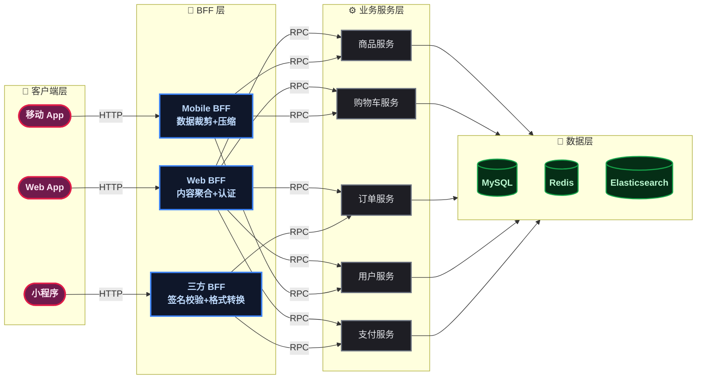
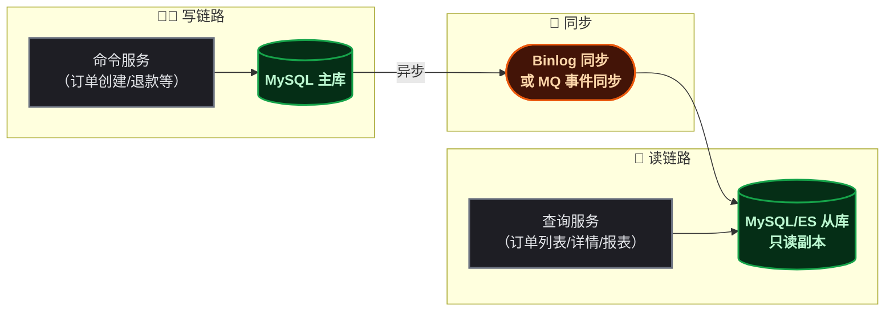
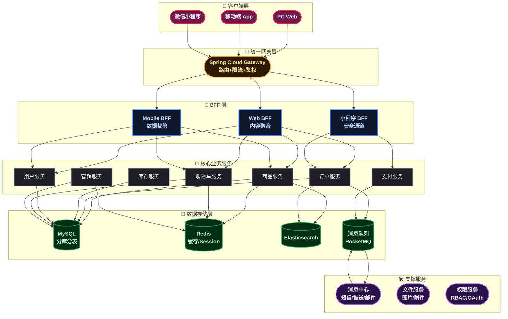
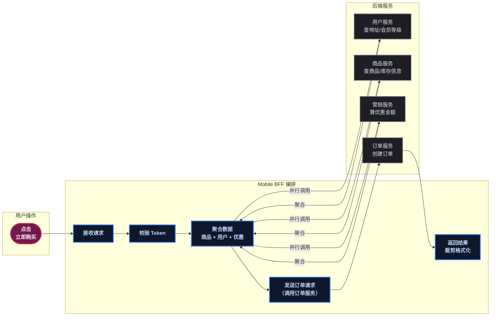

# 拆分微服务，先搞懂这七条法则

## BFF 不是新概念，但翻车率极高

当你决定从单体拆微服务，问得最多的问题往往是：**"前端到底该调哪个服务？"**

见过太多次这种场景——前端对着十几个 API 接口陷入选择困难症：一个商品详情页要调 5 个服务才能拼完整，首页要调 8 个。于是前端自己写了个"聚合层"，但没有服务端治理能力，比单体时代还乱。

**BFF（Backend For Frontend，为前端服务的后端）** 就是来解决这个的。它不是简单在前面加个代理，而是有明确的拆分法则。

## BFF 拆分三法则

### 按客户端维度切分

不同端消费场景天然不同：

- **移动端 BFF**：接口瘦、响应快、流量敏感，需要数据压缩和裁剪
- **Web 端 BFF**：数据全、可交互多，可能需要 SSE 之类推送能力
- **小程序/第三方 BFF**：安全校验严密，接口格式受平台约束

> 某团队早期把移动和 Web 共用一个 BFF，结果移动端要的"轻量接口"和 Web 端要的"完整数据"打架，BFF 越写越臃肿，成了一个"新型大单体"。

**核心法则：一个端一个 BFF 实例。** 代码可以复用，但部署实例要独立，避免互相影响。

### BFF 只做编排，不做业务

BFF 层最容易踩的坑是"顺手把业务逻辑也写了"。

它的职责边界非常清晰：

- **该做的**：接口聚合、数据裁剪、字段格式化、请求路由、Token 校验
- **不该做的**：优惠计算、库存扣减、订单校验、风控规则

BFF 是服务员，不是厨师。厨师在后厨（业务服务），服务员只负责拼盘上菜。

### 关注点分离——BFF 不做跨服务事务

BFF 同时调了订单服务和库存服务，发现库存扣减成功但订单创建失败——这时候 BFF 能回滚吗？不能。BFF 层没有分布式事务能力。

碰到需要事务强一致的场景，BFF 必须把这个"烫手山芋"扔给下游的编排服务（比如用 Saga 模式），别自己在 BFF 层 try-catch 补偿。

## 业务能力拆分——最直觉的切法

最简单的拆分方式：**按业务功能划分**。电商天然就能分成商品、订单、用户、支付、库存这些模块。每个服务对应一个业务域，内部有独立数据库，对外暴露接口。

优点是新同学一看就懂。缺点是容易变成"按数据库表拆分"——有人把一个 CRUD 对着表切一个微服务，那就走火入魔了（见过拆出 50 多个服务的，每个就一张表一个接口，运维成本炸裂）。

> 📌 **前置知识**：业务能力拆分 ≠ 按数据库表拆分。一个"商品服务"通常包含 SPU、SKU、类目、品牌等多张表——它们属于同一个业务域，一起管理才合理。

## 子域拆分——DDD 的划分方式

如果说业务能力拆分是"凭感觉"，子域拆分就是"有方法论"。

**DDD（Domain-Driven Design，领域驱动设计）** 把业务拆成三类：

- **核心域**：公司的核心竞争力。电商的交易系统、推荐算法。
- **支撑域**：核心域需要但不是核心的。电商的商品管理。
- **通用域**：用现成的就行。短信通知、支付网关。

> ⚠️ 新手提示：不要一上来就把所有子域都微服务化。**核心域优先拆分**，支撑域逐步跟进，通用域直接采购或复用。步子大了容易扯着蛋。

## 事务边界拆分——数据一致性说了算

如果一个操作需要跨多表做强一致更新，这些表最好在同一个服务里。下单涉及"扣库存 + 扣余额 + 创建订单"，三者必须同库事务——拆成三个服务就得上分布式事务，代价大很多。

**经验法则**：如果两个操作之间是"要么一起成功要么一起失败"的关系，优先放同一个服务里。

## 流量维度拆分——CQRS 模式

**读和写天然不对称。** 订单写的频率固定，但查询流量（用户端翻页、客服端多条件筛选）可能是写的几十倍。

**CQRS（Command Query Responsibility Segregation，命令查询职责分离）** 就是读写分流：

## 变更频率拆分——不让不稳定的影响稳定的

打开 git log 看看每个模块的提交频率：

- 商品详情页展示：几乎每周都改（促销、标签、推荐位）
- 支付核心流程：一个月可能才改一次
- 订单状态机：基本稳定，改一次要拉全组评审

**把高频变更和低频变更的服务分开。** 促销上线时不会反复重启支付服务，风险面也隔离了——活动崩了不至于用户付不了款。

## 技术异构拆分——各用各的趁手兵器

不是所有服务都得用 Java。推荐算法用 Python 更合适，图片处理用 Go 更香，实时计算用 Rust 流处理更好。微服务的优势之一就是**允许每个服务选择最适合的的技术栈**。

> 注意：技术异构有成本——多语言意味着多套运维工具链、多套监控体系。一般只在核心域和通用域之间做异构，不建议同一个业务域混用两门语言。

## 电商案例：从单体到拆分的完整落地

来看一个典型电商系统，这些原则怎么串起来用。

### 整体拆分架构

### 下单流程——BFF 怎么编排

### 拆分决策流程

把上面的原则串成一个决策树，面对新模块时从第一问开始走一遍：

```mermaid
flowchart TD
    START(["新业务模块"])
    Q1{"业务是否需要\n多端差异化输出？"}
    Q2{"涉及强一致\n跨表事务？"}
    Q3{"存在读写流量\n差异 >10 倍？"}
    Q4{"变更频率明显\n高于/低于周边？"}
    Q5{"有最佳技术栈\n代替当前方案？"}
    Q6{"属于核心域\n还是支撑/通用域？"}

    A1["增加独立 BFF 层\n或 BFF 路由规则"]
    A2["保持同服务\n或引入 Saga/TCC"]
    A3["拆分读写服务\nCQRS 模式"]
    A4["拆分独立服务\n隔离变更风险"]
    A5["用新语言/框架\n单独部署"]
    A6["核心域 → 优先独立\n支撑域 → 逐步拆分\n通用域 → 采购/复用"]

    DONE(["确定拆分方案"])

    START --> Q1
    Q1 -->|是| A1
    Q1 -->|否| Q2
    A1 --> Q2
    Q2 -->|是| A2
    Q2 -->|否| Q3
    A2 --> Q3
    Q3 -->|是| A3
    Q3 -->|否| Q4
    A3 --> Q4
    Q4 -->|是| A4
    Q4 -->|否| Q5
    A4 --> Q5
    Q5 -->|是| A5
    Q5 -->|否| Q6
    A5 --> Q6
    Q6 --> A6
    A6 --> DONE

    classDef startEnd fill:#701a4c,stroke:#e11d48,stroke-width:2.5px,color:#fce7f3,font-weight:bold;
    classDef condition fill:#2a1147,stroke:#a855f7,stroke-width:2px,color:#ede9fe,font-weight:bold;
    classDef process fill:#1e1e24,stroke:#6b7280,stroke-width:2px,color:#e5e7eb;
    classDef leaf fill:#1e1e24,stroke:#9ca3af,stroke-width:2px,color:#e5e7eb;
    classDef highlight fill:#431407,stroke:#ea580c,stroke-width:2px,color:#fed7aa,font-weight:bold;

    class START,DONE startEnd;
    class Q1,Q2,Q3,Q4,Q5,Q6 condition;
    class A1,A2,A3,A4,A5,A6 highlight;
```

## 总结

| 原则 | 一句话口诀 | 电商案例对应 |
|------|-----------|-------------|
| BFF 法则 | 一端一层，只编排不业务 | Web / Mobile / 小程序各一个 BFF |
| 业务能力 | 按功能模块切 | 商品、订单、支付独立服务 |
| 子域拆分 | 核心优先、通用复用 | 交易系统先拆，消息通知复用 |
| 事务边界 | 同库的别拆散 | 下单 + 扣库存 + 扣余额同服务 |
| 流量维度 | 读写分离、各自扩展 | 订单写入 MySQL，查询走 ES |
| 变更频率 | 快慢分离、互不影响 | 营销活动独立，不影响支付 |
| 技术异构 | 各用各的趁手兵器 | 推荐用 Python，图片用 Go |

微服务拆分没有银弹。上面这套原则不是要你一次性全满足——多数系统的第一步拆分就是 **"业务能力 + BFF"**，跑通后再逐步按其他原则优化。**先做对，再做好。**
