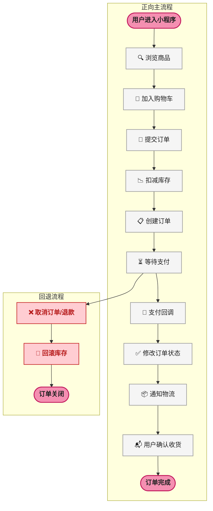
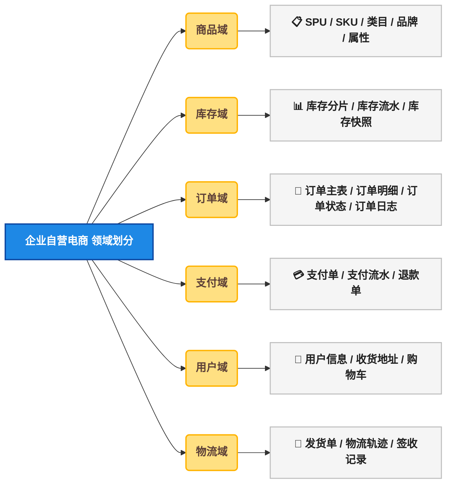
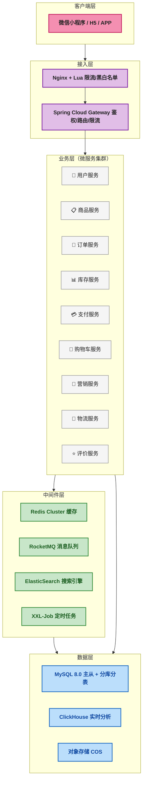
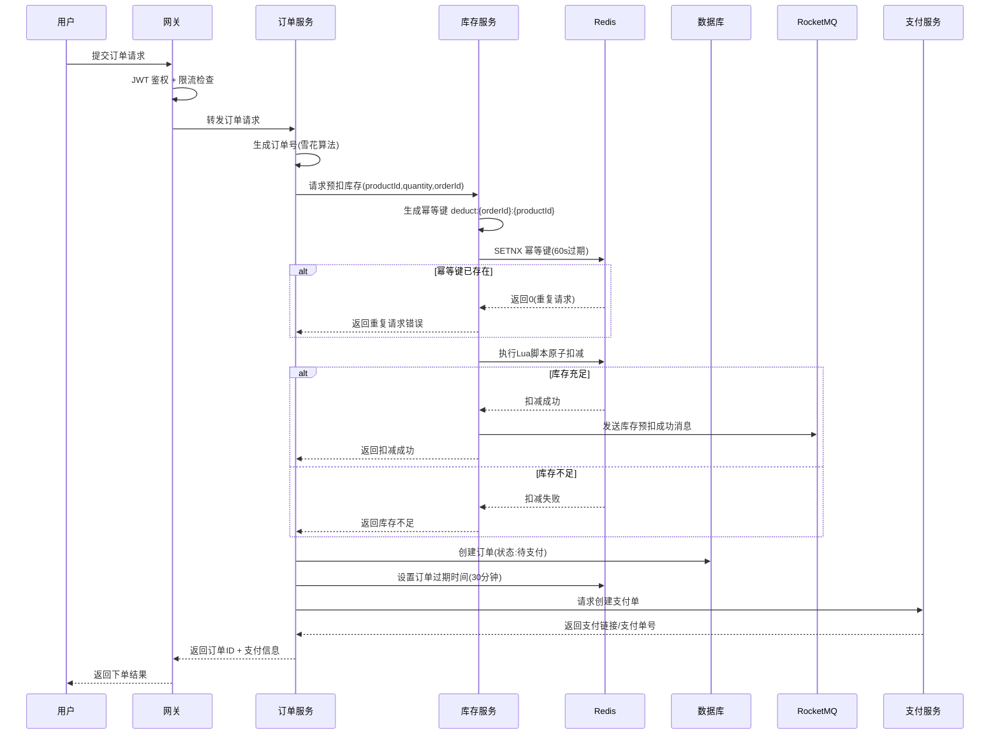
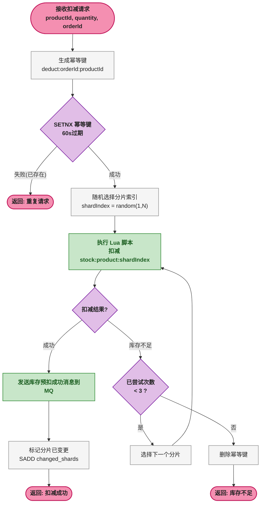
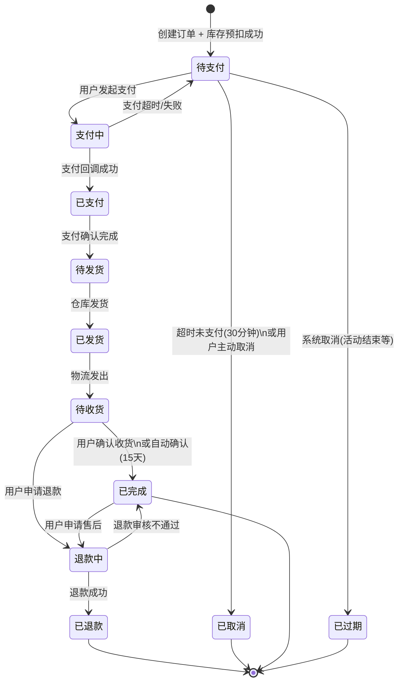
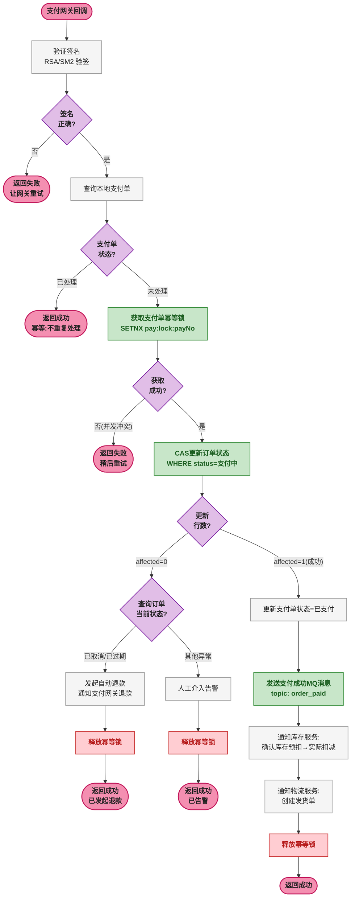
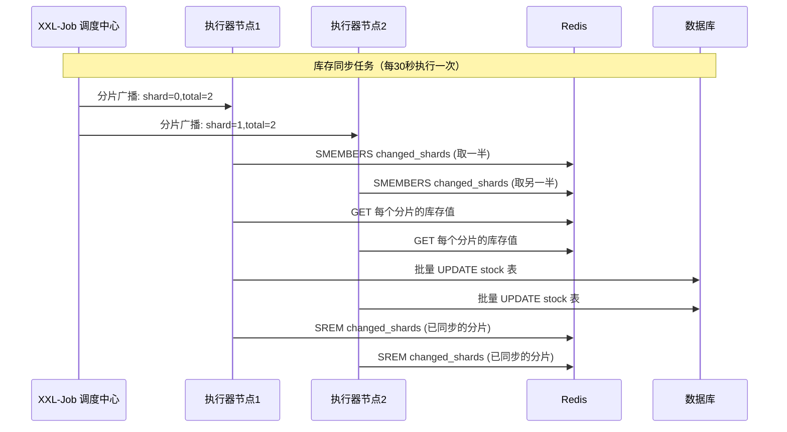
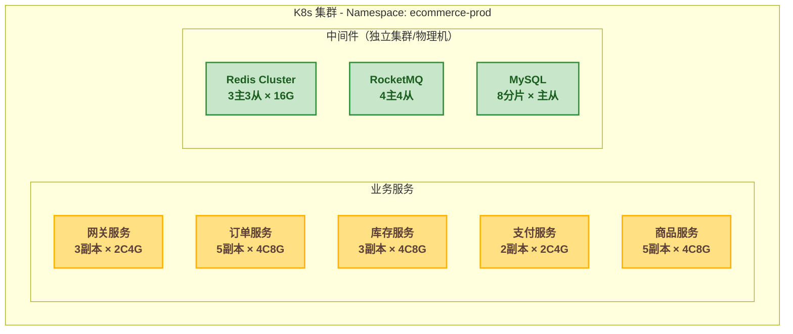

# 🏗️ 高并发企业自营电商小程序系统架构设计：从需求分析到部署监控的全链路方案

## 从一个真实的架构评审说起

某团队接到一个需求：为公司开发一款自营电商小程序，C 端消费者可以在小程序上购买公司产品。预估用户量 5 万 ~ 10 万，产品部门希望赶在活动上线前交付。

架构师在评审会上画出了第一版方案：Spring Boot 单体应用 + MySQL + Redis 缓存。评审进行到一半，有人提出了一个问题："如果 1 万个用户同时抢一个秒杀商品，这套架构能撑住吗？"

这个问题让团队陷入了沉默。单体应用的库存扣减在数据库层面是一条 `UPDATE ... SET stock = stock - 1 WHERE stock > 0`，在高并发下这条 SQL 会成为瓶颈——数据库行锁（InnoDB 行级锁，对某一行数据的排他锁定）会让所有请求串行化，QPS（Queries Per Second，每秒请求数）直接降到数据库单行更新的极限：约 500 ~ 1000。

> ⚠️ 新手提示：数据库行锁串行化的意思是，当 1000 个请求同时更新同一行数据（比如同一商品的库存），InnoDB 会让它们排队执行，每个请求必须等前一个提交后才能继续。这不是"慢"，而是"一个一个来"——1000 个请求就是 1000 次串行操作。

这就是本文要解决的核心问题： **如何设计一套能支撑 2 万 QPS 的企业自营电商系统，同时保证库存不超卖、订单不丢失、支付不重复。**

> 📌 前置知识：阅读本文需要了解 Spring Boot 基础、Redis 基本操作、MySQL 基本用法、消息队列（RocketMQ/Kafka）的基本概念。如果对微服务架构不熟悉，建议先了解服务注册与发现（Nacos）的基本概念。

---

## 🏗️ 一、需求分析与业务建模

### 🎯 1.1 业务范围界定

在设计任何系统之前，第一步是明确边界——知道什么要做什么不做。

| 维度 | 内容 |
|------|------|
| **业务形态** | 企业自营 B2C 电商小程序，企业是唯一商家，面向 C 端消费者 |
| **用户规模** | 预估 1 万 ~ 10 万注册用户 |
| **峰值 QPS** | 预估 1000 ~ 5000（设计目标：支撑 2 万 QPS） |
| **核心功能** | 商品浏览、下单、支付、退款、物流查询 |

这里有一个关键决策： **设计目标（2 万 QPS）远大于预估峰值（5000 QPS）** 。这不是过度设计，而是为以下场景预留缓冲：

- 秒杀类营销活动带来的瞬时流量尖刺
- 企业规模增长带来的用户量膨胀
- 缓存失效时的"惊群效应"（大量请求同时穿透缓存直达数据库）

### 🎯 1.2 核心业务流程

整个系统的核心链路可以抽象为一条主流程 + 一条回退流程：



> ⚠️ 新手提示：这张图展示的是"业务视角"的流程，每个节点在系统内部可能会拆成多个子步骤。比如"扣减库存"在实际系统中包含：生成幂等键 → Redis Lua 脚本原子扣减 → 记录库存流水 → 发送 MQ 消息异步同步到数据库。后面会逐一展开。

### 🔢 1.3 领域模型设计

领域驱动设计（DDD，Domain-Driven Design，通过将业务划分为独立的"领域"来组织代码和数据的架构方法）的核心是划定边界。本系统划分为六大领域：



| 领域 | 核心聚合根 | 职责边界 |
|------|-----------|---------|
| 商品域 | SPU（Standard Product Unit，标准产品单元） | 商品信息管理、类目组织、属性定义 |
| 库存域 | 库存分片 | 库存的预扣、回滚、同步，所有库存变更必须经过此域 |
| 订单域 | 订单 | 订单生命周期管理，从创建到完成的所有状态流转 |
| 支付域 | 支付单 | 支付请求、回调处理、退款申请 |
| 用户域 | 用户 | 账号信息、收货地址维护 |
| 物流域 | 发货单 | 发货、物流轨迹追踪、签收确认 |

> ⚠️ 新手提示：SPU 和 SKU 是电商中最基础的两个概念。SPU 是"标准化产品单元"，比如 iPhone 15 是一个 SPU；SKU 是"库存量单位"，比如"iPhone 15 / 黑色 / 256G"是一个 SKU。一个 SPU 下可以有多个 SKU。库存扣减发生在 SKU 级别。

---

## 🏗️ 二、系统架构设计

### 🏗️ 2.1 整体架构分层

系统采用经典的微服务四层架构：客户端层 → 接入层 → 业务层 → 数据层，中间件层横向贯穿业务层与数据层。



每层的职责划分：

| 层次 | 职责 | 关键组件 |
|------|------|---------|
| 客户端层 | 用户交互界面，发起 HTTP 请求 | 微信小程序 SDK |
| 接入层 | 限流、黑白名单、鉴权、路由转发 | Nginx + Lua、Spring Cloud Gateway |
| 业务层 | 核心业务逻辑处理，服务间通过 RPC 调用 | 9 个独立微服务 |
| 中间件层 | 缓存加速、异步解耦、全文搜索、定时调度 | Redis、RocketMQ、ES、XXL-Job |
| 数据层 | 持久化存储、分析查询、文件存储 | MySQL、ClickHouse、COS |

### 🔢 2.2 技术选型清单

| 层次 | 技术栈 | 用途 | 选型理由 |
|------|--------|------|---------|
| 开发框架 | Spring Boot 2.7+ / Spring Cloud 2021.x | 微服务基础框架 | 生态成熟，团队熟悉 |
| RPC 框架 | OpenFeign + Dubbo（可选） | 服务间远程调用 | Feign 声明式调用简洁；Dubbo 在高并发场景性能更优 |
| 注册中心 | Nacos | 服务发现、配置管理 | 同时支持 AP 和 CP 模式，自带配置中心 |
| 网关 | Spring Cloud Gateway | 路由、鉴权、限流 | 基于 WebFlux，异步非阻塞，性能优于 Zuul |
| 缓存 | Redis Cluster / Caffeine | 分布式缓存 + 本地缓存 | Redis 集群保证高可用，Caffeine 减少网络开销 |
| 消息队列 | RocketMQ | 异步削峰、最终一致性 | 支持事务消息、延迟消息，阿里系电商验证 |
| 数据库 | MySQL 8.0 + ShardingSphere-JDBC | 分库分表 | 兼容 JDBC 标准，分片策略灵活 |
| 搜索引擎 | ElasticSearch | 商品搜索、订单搜索 | 倒排索引，全文检索性能优秀 |
| 定时任务 | XXL-Job | 分布式任务调度 | 可视化管控，支持分片广播 |
| 链路追踪 | SkyWalking | 调用链监控 | 无代码侵入，Java Agent 自动探针 |
| 日志 | ELK | 日志收集分析 | ElasticSearch + Logstash + Kibana 黄金组合 |
| 监控 | Prometheus + Grafana | 指标监控告警 | 云原生标准，生态丰富 |

---

## 🏗️ 三、核心业务流程详解

### 🔢 3.1 下单核心流程（时序图）

下单是整个系统中调用链最长、涉及服务最多的流程。下面是完整的时序交互：



**关键步骤详解**：

**步骤 1：生成订单号**。使用雪花算法（Snowflake，Twitter 开源的分布式 ID 生成算法，基于时间戳 + 机器 ID + 序列号组成 64 位唯一 ID），保证全局唯一且趋势递增。订单号的格式通常为：时间戳（41bit）+ 机器 ID（10bit）+ 序列号（12bit）。

**步骤 2：幂等键设计**。幂等键的格式为 `deduct:{orderId}:{productId}`，使用 Redis 的 `SETNX`（SET if Not eXists，仅当 key 不存在时才设置）命令，保证同一个订单的同一个商品只会被扣减一次。60 秒过期是为了防止极端情况下 key 残留。

> ⚠️ 新手提示：幂等（Idempotent）是指同一个操作执行一次和执行多次的结果完全一样。比如"扣减库存"这个操作，如果因为网络超时用户重试了 3 次，但库存只应该被扣 1 次——这就是幂等的价值。

**步骤 3：Redis Lua 脚本原子扣减**。Lua 脚本在 Redis 中执行时是原子的（Atomic，不可分割的，要么全部执行要么全部不执行），不会有其他命令插入。这保证了"判断库存是否充足 + 执行扣减"两个操作之间不会出现竞态条件（Race Condition，多个线程/进程的执行顺序不确定导致的错误）。

**步骤 4：订单过期时间**。订单创建后设置 30 分钟过期时间（Redis key 的 TTL），如果 30 分钟内未支付，订单自动取消并回滚库存。

### 🔢 3.2 库存扣减详细设计

库存扣减是整个系统中最容易出问题的环节。核心矛盾是： **高并发下如何保证不超卖，同时不让性能成为瓶颈。**

#### 🔢 3.2.1 Redis 库存分片

如果所有请求都去更新同一个 Redis key（如 `stock:product:12345`），这个 key 会成为热点。Redis 虽然是单线程模型（6.0 之后引入了 IO 多线程，但命令执行仍然是单线程），但热点 key 会导致单分片压力过大。

解决方案是 **库存分片** ：将同一个 SKU 的总库存拆成 N 个分片，请求随机或轮询选择一个分片扣减。



#### 🔢 3.2.2 核心代码实现

**Lua 脚本（Redis 原子扣减）**：

```lua
-- KEYS[1]: 库存分片的 key，如 stock:product:12345:3
-- ARGV[1]: 扣减数量
-- ARGV[2]: 变更分片集合的 key，如 changed_shards
-- 返回值: 1=扣减成功, 0=库存不足

local stock = redis.call('GET', KEYS[1])
if not stock then
    return 0
end

stock = tonumber(stock)
local quantity = tonumber(ARGV[1])

if stock >= quantity then
    redis.call('DECRBY', KEYS[1], quantity)
    redis.call('SADD', ARGV[2], KEYS[1])
    return 1
else
    return 0
end
```

**Java 端库存扣减服务**：

```java
@Service
public class StockService {

    @Autowired
    private StringRedisTemplate redisTemplate;

    // Lua 脚本的 SHA1 摘要，避免每次传输完整脚本
    private String luaSha;

    @PostConstruct
    public void init() {
        // 脚本加载到 Redis，获取 SHA1 摘要
        String script = "local stock = redis.call('GET', KEYS[1])\n" +
            "if not stock then return 0 end\n" +
            "stock = tonumber(stock)\n" +
            "local quantity = tonumber(ARGV[1])\n" +
            "if stock >= quantity then\n" +
            "    redis.call('DECRBY', KEYS[1], quantity)\n" +
            "    redis.call('SADD', ARGV[2], KEYS[1])\n" +
            "    return 1\n" +
            "else\n" +
            "    return 0\n" +
            "end";
        luaSha = redisTemplate.getRequiredConnectionFactory()
            .getConnection().scriptLoad(script.getBytes());
    }

    public boolean deductStock(Long productId, int quantity, String orderId) {
        // 1. 幂等检查
        String idempotentKey = "deduct:" + orderId + ":" + productId;
        Boolean locked = redisTemplate.opsForValue()
            .setIfAbsent(idempotentKey, "1", Duration.ofSeconds(60));
        if (Boolean.FALSE.equals(locked)) {
            throw new BizException("重复的扣减请求");
        }

        // 2. 随机选择分片，最多重试 3 次
        int shardCount = 10; // 每个 SKU 分 10 片
        int maxRetry = 3;
        for (int i = 0; i < maxRetry; i++) {
            int shardIdx = ThreadLocalRandom.current().nextInt(shardCount);
            String stockKey = "stock:product:" + productId + ":" + shardIdx;

            Long result = redisTemplate.execute(
                new DefaultRedisScript<>(luaSha, Long.class),
                Collections.singletonList(stockKey),
                String.valueOf(quantity),
                "changed_shards"
            );

            if (result != null && result == 1) {
                // 3. 发送 MQ 消息，异步同步到数据库
                sendStockDeductedMsg(productId, quantity, orderId, shardIdx);
                return true;
            }
        }

        // 扣减失败，清理幂等键
        redisTemplate.delete(idempotentKey);
        return false;
    }
}
```

**设计要点**：

1. **分片数如何确定**：分片数 N 建议等于 Redis Cluster 的主节点数，这样每个节点均匀承载一个分片。如果预计热点严重，可以将分片数设为节点数的 2 ~ 3 倍。
2. **分片间的库存分配**：初始化时，将 SKU 总库存尽可能均匀分配到各分片。如果某个分片库存用完，请求会尝试下一个分片（最多 3 次）。
3. **Lua 脚本的 SHA 优化**：使用 `SCRIPT LOAD` 提前将脚本加载到 Redis，后续使用 SHA1 摘要调用 `EVALSHA`，避免每次传输完整脚本内容。

> ⚠️ 新手提示：为什么是"最多尝试 3 次"而不是把所有分片都试一遍？因为如果大部分分片库存都已耗尽，继续遍历只是在浪费 Redis 的 CPU 时间。3 次是工程上的经验值——既能处理分片库存不均的问题，又不会引入过多延迟。

### 🔢 3.3 订单状态机设计

订单是系统的核心实体，其状态变迁必须用状态机来严格约束。每次状态变更都通过 CAS（Compare And Swap，比较并交换，先比较当前值是否符合预期，符合才更新）保证并发安全。



**订单状态表**：

| 状态码 | 状态名 | 说明 | 可流转到的状态 |
|:---:|--------|------|--------------|
| 0 | 待支付 | 订单创建成功，等待用户支付 | 已取消、支付中、已过期 |
| 1 | 支付中 | 用户已发起支付，等待回调 | 已支付、待支付 |
| 2 | 已支付 | 支付确认成功 | 待发货 |
| 3 | 待发货 | 支付完成，等待仓库发货 | 已发货、退款中 |
| 4 | 已发货 | 仓库已出库 | 待收货、退款中 |
| 5 | 待收货 | 物流运输中 | 已完成、退款中 |
| 6 | 已完成 | 用户确认收货 | 退款中 |
| 7 | 已取消 | 超时或用户主动取消 | 终态 |
| 8 | 已过期 | 系统取消（活动结束等） | 终态 |
| 9 | 退款中 | 退款流程进行中 | 已退款、已完成 |
| 10 | 已退款 | 退款完成 | 终态 |

**CAS 状态更新示例**：

```java
// 支付回调时更新订单状态：只有当前状态为"支付中"才能更新为"已支付"
String updateSql = "UPDATE t_order SET status = ?, pay_status = ?, pay_time = NOW() "
    + "WHERE order_no = ? AND status = ?";

int affected = jdbcTemplate.update(updateSql,
    OrderStatus.PAID.getCode(),       // 新状态：已支付
    PayStatus.PAID.getCode(),         // 新支付状态：已支付
    orderNo,
    OrderStatus.PAYING.getCode()      // 期望的当前状态：支付中
);

if (affected == 0) {
    // 更新失败：说明订单状态已被其他操作改变
    // 可能的情况：订单已过期取消、并发退款已触发
    // 需要查询当前状态，决定下一步动作
}
```

CAS 更新的关键在于 `WHERE status = ?`，这个条件保证了只有当前状态符合预期时才会执行更新。如果 `affected = 0`，说明在读取和写入之间，状态已经被其他操作改变了，需要走异常处理分支。

---

## 🏗️ 四、支付回调处理详解

### 🔢 4.1 支付回调的五大挑战

支付回调是系统中最复杂的环节之一，因为它涉及外部系统（微信支付/支付宝）的交互，且直接与资金相关。设计时必须同时考虑以下五个问题：

| 挑战 | 触发场景 | 核心矛盾 |
|------|---------|---------|
| 重复回调 | 支付网关因网络超时重发回调 | 同一笔支付可能收到多次通知 |
| 订单过期支付 | 用户在订单过期前最后一秒完成支付 | 订单已取消但支付已成功 |
| 并发冲突 | 支付回调与退款同时到达 | 两个操作都想修改同一个订单状态 |
| 回调失败重试 | 系统内部处理失败 | 必须保证最终一致性 |
| 后续流程编排 | 支付成功后要触发库存确认、物流通知等 | 多个下游服务需要协调 |

### 🔢 4.2 支付回调完整流程



**五个挑战的解决思路**：

**（1）防止重复支付**：三层防护——① 支付网关侧的去重（基于支付单号）；② 本地支付单状态判断（`CHECK_PAY`）；③ Redis 幂等锁（`SETNX pay:lock:payNo`），保证同一个支付单的回调在同一时刻只有一个线程在处理。

**（2）订单过期支付（用户卡点支付）**：CAS 更新 `WHERE status = 支付中` 。如果订单已超时取消（状态变为"已取消"），`affected = 0` ，触发自动退款。这一步的逻辑是： **钱已经收到了，但订单已经不存在了，所以必须把钱退回去** 。

**（3）并发下支付和退款冲突**：利用数据库行锁 + CAS 更新。无论是支付回调还是退款请求，都通过 `WHERE status = ?` 进行乐观锁竞争，谁先更新成功谁就获得了处理权。

**（4）回调失败重试**：支付网关侧通常有指数退避重试策略（如 1min → 5min → 30min → 1h）。本地侧通过 `返回失败 → 网关重试` 的机制实现最终一致性。

**（5）支付成功后后续流程**：通过 MQ 消息异步触发，保证支付回调接口快速返回（避免超时导致网关重试），同时解耦支付服务与库存、物流等下游服务。

> ⚠️ 新手提示：为什么支付回调要通过 MQ 来触发后续流程，而不是在回调处理中直接调用库存服务和物流服务？原因有二：① 如果直接同步调用，库存服务或物流服务响应慢会导致支付回调超时，支付网关会认为通知失败并重试，造成重复处理；② MQ 天然具备重试能力，如果消费失败可以自动重试，不需要在支付回调处理逻辑中自己写重试代码。

---

## 🏗️ 五、极端情况处理与数据一致性

### 🎯 5.1 异常场景全景

高并发分布式系统中，异常是常态而非意外。下面清单覆盖了从基础设施故障到业务边界的全部异常场景：

| 异常场景 | 触发条件 | 影响范围 | 解决方案 |
|---------|---------|---------|---------|
| 网络超时 | Redis 扣减成功但 TCP 响应丢失 | 库存已扣但订单未创建 | 幂等键防重复 + 定时对账补偿 |
| Redis 宕机 | 缓存集群主节点故障 | 库存扣减不可用 | 降级到数据库扣减 + 本地缓存缓冲 |
| 订单过期支付 | 用户在过期前最后一秒完成支付 | 订单已取消但钱已付 | CAS 状态检查 + 自动发起退款 |
| 重复支付 | 用户多次点击支付按钮 | 同一笔订单多次扣款 | 支付单幂等 + 支付网关侧去重 |
| 发货后退款 | 物流已发出后用户申请退款 | 商品在路上但已退款 | 拦截物流 + 退款流程与退货流程分离 |
| MQ 消息丢失 | Broker 宕机或网络分区 | 库存同步中断 | 生产者确认机制 + 消费者手动 ACK + 定时对账兜底 |
| 数据库死锁 | 高并发下多个事务互相等待 | 订单创建失败 | 重试机制（Spring Retry）+ 乐观锁替代悲观锁 |
| 服务雪崩 | 下游服务响应变慢 → 上游级联超时 | 整个系统不可用 | Sentinel 熔断降级 + 限流 + 线程池隔离 |

### 🗄️ 5.2 数据一致性保障方案

在分布式系统中，强一致性（所有节点在同一时刻看到的数据完全相同）代价极高。本系统采用 **最终一致性** （允许短暂不一致，但最终会达到一致状态）策略，通过三个典型场景说明：

```mermaid
flowchart TD
    %% ==========================================
    %% 样式定义
    %% ==========================================
    classDef startEnd fill:#F48FB1,stroke:#C2185B,stroke-width:2px,color:#212121,font-weight:bold;
    classDef condition fill:#E1BEE7,stroke:#7B1FA2,stroke-width:1.5px,color:#212121,font-weight:bold;
    classDef process fill:#F5F5F5,stroke:#9E9E9E,stroke-width:1.5px,color:#212121;
    classDef reject fill:#FFCDD2,stroke:#C62828,stroke-width:1.5px,color:#B71C1C,font-weight:bold;
    classDef data fill:#C8E6C9,stroke:#388E3C,stroke-width:1.5px,color:#1B5E20,font-weight:bold;

    %% ==========================================
    %% 场景一
    %% ==========================================
    subgraph S1 ["场景一: Redis扣减成功 但订单创建失败"]
        S1A[Redis Lua 扣减成功] --> S1B[发送库存回滚延迟消息<br/>delay: 10秒]
        S1B --> S1C{10秒内订单<br/>创建成功?}
        S1C -- 是 --> S1D[取消回滚消息<br/>不做任何操作]
        S1C -- 否 --> S1E[执行库存回滚<br/>Redis INCRBY 恢复库存]
    end

    %% ==========================================
    %% 场景二
    %% ==========================================
    subgraph S2 ["场景二: 支付成功 但订单状态更新失败"]
        S2A[支付回调到达] --> S2B[CAS 更新订单状态]
        S2B --> S2C{affected > 0?}
        S2C -- 否 --> S2D[支付回调重试<br/>指数退避: 1min/5min/30min]
        S2D --> S2B
        S2C -- 多次重试仍失败 --> S2E[人工对账介入<br/>查询支付网关确认款项]
    end

    %% ==========================================
    %% 场景三
    %% ==========================================
    subgraph S3 ["场景三: 库存同步到DB失败"]
        S3A[定时任务扫描<br/>changed_shards集合] --> S3B[批量读取Redis分片库存]
        S3B --> S3C[UPDATE stock SET quantity=Redis值]
        S3C --> S3D{更新成功?}
        S3D -- 否 --> S3E[记录失败队列]
        S3E --> S3F[重试最多3次]
        S3F --> S3G{仍失败?}
        S3G -- 是 --> S3H[告警 + 人工处理]
        S3G -- 否 --> S3I[从changed_shards移除]
        S3D -- 是 --> S3I
    end

    class S1D,S3I startEnd;
    class S1C,S2C,S3D,S3G condition;
    class S1A,S1E,S2B,S2D,S3B,S3C,S3E,S3F process;
    class S2E,S3H reject;
    class S1B,S2A,S3A data;
```



**场景一（库存补偿）的核心代码思路**：

```java
// 下单服务：先扣Redis库存，再创建订单
public Order createOrder(CreateOrderRequest req) {
    // 1. Redis 扣减库存
    boolean deducted = stockService.deductStock(
        req.getProductId(), req.getQuantity(), req.getOrderNo());

    if (!deducted) {
        throw new BizException("库存不足");
    }

    try {
        // 2. 创建订单
        Order order = orderMapper.insert(buildOrder(req));

        // 3. 订单创建成功，发送"确认扣减"消息，取消之前的回滚延迟消息
        // （这里不做任何事即可，因为回滚消息收到后会检查订单是否存在）
        return order;

    } catch (Exception e) {
        // 4. 订单创建失败，发送延迟回滚消息（10秒后执行）
        StockRollbackMsg msg = new StockRollbackMsg();
        msg.setProductId(req.getProductId());
        msg.setQuantity(req.getQuantity());
        msg.setOrderNo(req.getOrderNo());

        rocketMQTemplate.syncSend(
            "stock-rollback-topic",
            MessageBuilder.withPayload(msg).build(),
            3000,  // 超时
            4      // 延迟级别: 10秒后
        );
        throw new BizException("订单创建失败，库存将在10秒后回滚");
    }
}

// 回滚消息消费者
@RocketMQMessageListener(topic = "stock-rollback-topic", consumerGroup = "stock-rollback")
public class StockRollbackConsumer implements RocketMQListener<StockRollbackMsg> {
    @Override
    public void onMessage(StockRollbackMsg msg) {
        // 先检查订单是否已创建（因为有可能订单创建比回滚消息晚）
        Order order = orderMapper.selectByOrderNo(msg.getOrderNo());
        if (order != null) {
            // 订单已存在，不需要回滚
            return;
        }
        // 订单不存在，执行库存回滚
        stockService.rollbackStock(msg.getProductId(), msg.getQuantity());
    }
}
```

> ⚠️ 新手提示：为什么延迟消息是 10 秒而不是立即回滚？因为订单创建可能在 Redis 扣减之后才成功（比如数据库连接池正在等待连接），给 10 秒的缓冲时间让订单有机会创建完成。这是一种"补偿"而非"回滚"的设计思路：先乐观地假设订单能创建成功，失败了再补偿。

### 🛡️ 5.3 降级策略

当 Redis 不可用时，系统必须有能力降级运行：

```
Redis 可用 → Redis Lua 脚本扣减（正常路径，QPS 最高）
    ↓ 不可用
Caffeine 本地缓存 → 本地缓存热点库存（降级一级，QPS 受限）
    ↓ 不可用/缓存未命中
MySQL 数据库 → 直接数据库扣减（降级二级，QPS 大幅降低）
    ↓ 数据库压力过大
Sentinel 限流 → 拒绝部分请求，保护系统（降级三级，部分用户不可用）
```

降级通过 Sentinel（流量防卫兵）自动触发。当 Redis 异常比例超过阈值时，自动切换降级逻辑：

```java
@SentinelResource(
    value = "deductStock",
    fallback = "deductStockFallback",    // 降级后的兜底方法
    blockHandler = "deductStockBlockHandler"  // 限流后的处理方法
)
public boolean deductStock(Long productId, int quantity, String orderNo) {
    // 正常路径：Redis Lua 脚本扣减
    return redisStockDeduct(productId, quantity, orderNo);
}

// 降级方法：Redis 不可用时走数据库
public boolean deductStockFallback(Long productId, int quantity,
                                    String orderNo, Throwable t) {
    log.warn("Redis库存扣减降级，切换到数据库扣减. orderNo={}", orderNo, t);
    return dbStockDeduct(productId, quantity);
}

// 限流方法：系统过载时拒绝请求
public boolean deductStockBlockHandler(Long productId, int quantity,
                                        String orderNo, BlockException e) {
    throw new BizException("系统繁忙，请稍后重试");
}
```

---

## 🏗️ 六、定时任务设计

定时任务是保证最终一致性的关键机制。这些任务运行在 XXL-Job 分布式调度平台上，通过分片广播确保不会重复执行。



**四个核心定时任务**：

| 任务名称 | 执行频率 | 功能描述 | 关键逻辑 |
|---------|---------|---------|---------|
| 库存同步任务 | 每 30 秒 | 扫描 `changed_shards` 集合，批量更新数据库库存 | 分片广播避免重复处理 |
| 订单超时取消 | 每 1 分钟 | 扫描待支付超时订单，取消 + 回滚库存 | 游标分页避免深分页问题 |
| 对账任务 | 每天凌晨 2 点 | 核对 Redis 库存与数据库库存差异 | 汇总各分片 Redis 值，与 DB SUM 对比 |
| 支付结果查询 | 每 10 分钟 | 查询 pending 状态支付单，主动向支付网关对账 | 只查询超过一定时间（如 5 分钟）仍为 pending 的单 |

**订单超时取消任务示例**：

```java
@Component
@JobHandler("orderTimeoutCancelJob")
public class OrderTimeoutCancelJob extends IJobHandler {

    private static final int BATCH_SIZE = 200;
    private static final int ORDER_TIMEOUT_MINUTES = 30;

    @Override
    public ReturnT<String> execute(String param) {
        // 使用游标分页，避免 offset 深分页性能问题
        Long lastOrderId = 0L;
        while (true) {
            List<Order> timeoutOrders = orderMapper.selectTimeoutOrders(
                OrderStatus.PENDING_PAY.getCode(),
                LocalDateTime.now().minusMinutes(ORDER_TIMEOUT_MINUTES),
                lastOrderId,
                BATCH_SIZE
            );

            if (CollectionUtils.isEmpty(timeoutOrders)) {
                break;
            }

            for (Order order : timeoutOrders) {
                // CAS 更新状态
                int affected = orderMapper.updateStatus(
                    order.getOrderNo(),
                    OrderStatus.CANCELLED.getCode(),
                    OrderStatus.PENDING_PAY.getCode() // 只有待支付才能取消
                );

                if (affected > 0) {
                    // 回滚库存
                    stockService.rollbackStock(
                        order.getProductId(), order.getQuantity());
                }
                lastOrderId = order.getId();
            }
        }
        return ReturnT.SUCCESS;
    }
}
```

> ⚠️ 新手提示：为什么定时任务要用游标分页而不是 `LIMIT offset, size`？因为当扫描到数据量很大时（比如有几百万条超时订单），`LIMIT 100000, 200` 需要数据库扫描并跳过前 10 万行，性能极差。游标分页（`WHERE id > lastId ORDER BY id LIMIT 200`）可以利用主键索引直接定位，无论数据量多大，每次扫描都是常量时间。

---

## 🏗️ 七、数据库设计

### 📐 7.1 核心表结构

**订单主表**（分片键：`user_id`）：

```sql
CREATE TABLE `t_order` (
  `id` bigint NOT NULL COMMENT '订单ID（雪花算法生成）',
  `order_no` varchar(32) NOT NULL COMMENT '订单号（展示用）',
  `user_id` bigint NOT NULL COMMENT '用户ID（分片键）',
  `total_amount` decimal(10,2) NOT NULL COMMENT '商品总金额',
  `discount_amount` decimal(10,2) NOT NULL DEFAULT 0.00 COMMENT '优惠金额',
  `pay_amount` decimal(10,2) NOT NULL COMMENT '实付金额',
  `status` tinyint NOT NULL COMMENT '订单状态: 0-待支付 1-支付中 2-已支付 3-待发货 4-已发货 5-待收货 6-已完成 7-已取消 8-已过期 9-退款中 10-已退款',
  `pay_status` tinyint NOT NULL COMMENT '支付状态: 0-未支付 1-支付中 2-已支付 3-已退款',
  `delivery_status` tinyint NOT NULL COMMENT '物流状态: 0-未发货 1-已发货 2-已签收 3-已退回',
  `delivery_address_id` bigint DEFAULT NULL COMMENT '收货地址ID',
  `remark` varchar(255) DEFAULT NULL COMMENT '用户备注',
  `created_at` datetime NOT NULL,
  `updated_at` datetime NOT NULL DEFAULT CURRENT_TIMESTAMP ON UPDATE CURRENT_TIMESTAMP,
  `pay_time` datetime DEFAULT NULL COMMENT '支付完成时间',
  `delivery_time` datetime DEFAULT NULL COMMENT '发货时间',
  `finish_time` datetime DEFAULT NULL COMMENT '完成时间',
  PRIMARY KEY (`id`, `user_id`),
  KEY `idx_user_id` (`user_id`),
  KEY `idx_order_no` (`order_no`),
  KEY `idx_status_created` (`status`, `created_at`)
) ENGINE=InnoDB DEFAULT CHARSET=utf8mb4;
```

**库存流水表**（分片键：`product_id`）：

```sql
CREATE TABLE `t_stock_flow` (
  `id` bigint NOT NULL COMMENT '雪花算法ID',
  `product_id` bigint NOT NULL COMMENT '商品ID（分片键）',
  `sku_id` bigint NOT NULL COMMENT 'SKU ID',
  `change_type` tinyint NOT NULL COMMENT '变更类型: 1-预扣 2-确认扣减 3-回滚 4-初始化 5-调整',
  `quantity` int NOT NULL COMMENT '变更数量（正数为增，负数为减）',
  `before_stock` int NOT NULL COMMENT '变更前库存',
  `after_stock` int NOT NULL COMMENT '变更后库存',
  `order_no` varchar(32) DEFAULT NULL COMMENT '关联订单号',
  `source` varchar(32) NOT NULL COMMENT '变更来源: ORDER/DEDUCT/ROLLBACK/SYNC',
  `operator` varchar(64) DEFAULT NULL COMMENT '操作人',
  `remark` varchar(255) DEFAULT NULL COMMENT '备注',
  `created_at` datetime NOT NULL,
  PRIMARY KEY (`id`, `product_id`),
  KEY `idx_product_id` (`product_id`),
  KEY `idx_order_no` (`order_no`),
  KEY `idx_created_at` (`created_at`)
) ENGINE=InnoDB DEFAULT CHARSET=utf8mb4;
```

> ⚠️ 新手提示：`t_stock_flow` 是一张"流水表"，不直接存储当前库存值，而是记录每一次库存变更。当前库存 = Redis 中的实时值，数据库中的库存表（`t_stock`）由定时任务从 Redis 同步。流水表的作用是审计和对账：如果 Redis 和数据库出现了不一致，可以通过流水表追溯每一笔变更。

### 🔢 7.2 分库分表策略

| 表名 | 分片键 | 分片策略 | 分片数 | 选键理由 |
|------|--------|---------|:---:|---------|
| `t_order` | `user_id` | 哈希取模 | 8 库 × 16 表 | 用户维度查询最多（我的订单列表），按 user_id 分片让订单查询只访问一个分片 |
| `t_order_item` | `order_id` | 哈希取模 | 8 库 × 16 表 | 订单明细总是伴随订单查询，与 `t_order` 同分片策略保证关联查询在同一个库 |
| `t_stock_flow` | `product_id` | 哈希取模 | 4 库 × 8 表 | 商品维度的库存查询最频繁，按 product_id 分片减少跨分片扫描 |

关键设计决策： **`t_order` 的 PRIMARY KEY 是 `(id, user_id)` 而非 `(id)` 或 `(user_id, id)`** 。这是因为 ShardingSphere 需要在主键中包含分片键，这样才能在不知道 id 属于哪个分片的情况下，通过 user_id 定位到正确的分片。

---

## 🏗️ 八、部署与监控

### 🏗️ 8.1 部署架构

生产环境采用 Kubernetes（容器编排平台）部署，所有服务以 Deployment 方式运行，通过 Service 暴露，Ingress 对外提供访问入口。



**各服务资源配置说明**：

| 服务 | 副本数 | 资源 | 理由 |
|------|:---:|------|------|
| 网关 | 3 | 2C4G | 纯 IO 转发，CPU 需求低 |
| 订单服务 | 5 | 4C8G | 核心业务，高并发下需要充足 CPU 处理业务逻辑 |
| 库存服务 | 3 | 4C8G | IO 密集型（Redis + MQ），但非核心路径，3 副本足够 |
| 支付服务 | 2 | 2C4G | 低频调用，但必须保证高可用 |
| 商品服务 | 5 | 4C8G | 查询量最大（首页、列表、详情），多副本应对读流量 |

### 📊 8.2 监控指标体系

| 指标类型 | 具体指标 | 告警阈值 | 告警级别 | 处理动作 |
|---------|---------|---------|:---:|---------|
| 业务 | 下单成功率 | < 95% | P1 | 检查库存服务、订单服务日志 |
| 业务 | 支付成功率 | < 98% | P1 | 检查支付网关连通性 |
| 业务 | 平均响应时间 | > 200ms | P2 | 检查慢查询、GC 日志 |
| 系统 | CPU 使用率 | > 80% | P2 | 扩容或限流 |
| 系统 | JVM 堆内存 | > 85% | P2 | 检查内存泄漏、调大堆 |
| 系统 | GC 停顿时间 | > 500ms | P3 | 检查 GC 日志 |
| 中间件 | Redis 命中率 | < 90% | P2 | 检查缓存策略 |
| 中间件 | MQ 消息堆积量 | > 10 万 | P1 | 检查消费者健康状态 |
| 中间件 | DB 连接池使用率 | > 80% | P2 | 检查慢查询、连接泄漏 |

---

## 🏗️ 九、架构设计精髓总结

| 设计点 | 核心思路 | 解决的问题 |
|--------|---------|-----------|
| 库存分片 | Redis 分片 + 随机选择分散热点请求 | 单 key 热点导致单 Redis 节点过载 |
| 异步同步 | 定时任务批量将 Redis 变更同步到 DB | 减少 DB 实时写压力，将 TPS 从"请求级"降到"定时批处理级" |
| 状态机 + CAS | 订单状态流转全部通过 CAS 更新 | 并发场景下状态变更的原子性保证 |
| 延迟消息补偿 | 关键操作失败后发送延迟回滚消息 | 跨服务的数据最终一致性 |
| 多级降级 | Redis → Caffeine → MySQL → 限流 | 逐级保护，避免单点故障导致全链路崩溃 |
| 过期支付退款 | CAS 检查订单状态，已取消则自动退款 | 处理"卡点支付"的边界场景 |

---

## 🏗️ 十、总结

本文从需求分析到部署监控，完整覆盖了企业自营 B2C 电商小程序的架构设计全链路。核心脉络可以用一句话概括： **以 Redis 分片库存扣减为性能引擎，以订单状态机 + CAS 为一致性保障，以 MQ 延迟消息为补偿手段，以多级降级为容错防线。**

对于实际项目落地，建议按照以下优先级推进：

1. **先跑通核心链路**：下单 → 支付 → 发货，这个链路跑通了系统就有价值
2. **再补异常处理**：超时取消、退款、对账，这些是保证资金安全的底线
3. **最后做性能优化**：库存分片、多级缓存、读写分离，这些是锦上添花

架构设计没有银弹，这里给出的方案是基于特定约束（企业自营 B2C 电商、5 万 ~ 10 万用户、2 万 QPS 设计目标）下的最优解。如果约束条件变化（如用户量达到百万级、业务从自营扩展到多商家平台），架构也需要相应演进。

---

> 📌 如果读者对文中涉及的具体技术点想深入了解，建议按以下顺序阅读本博客系列的相关文章：Redis 缓存策略 → RocketMQ 消息可靠性 → ShardingSphere 分库分表实战 → Spring Cloud Gateway 限流熔断配置。
