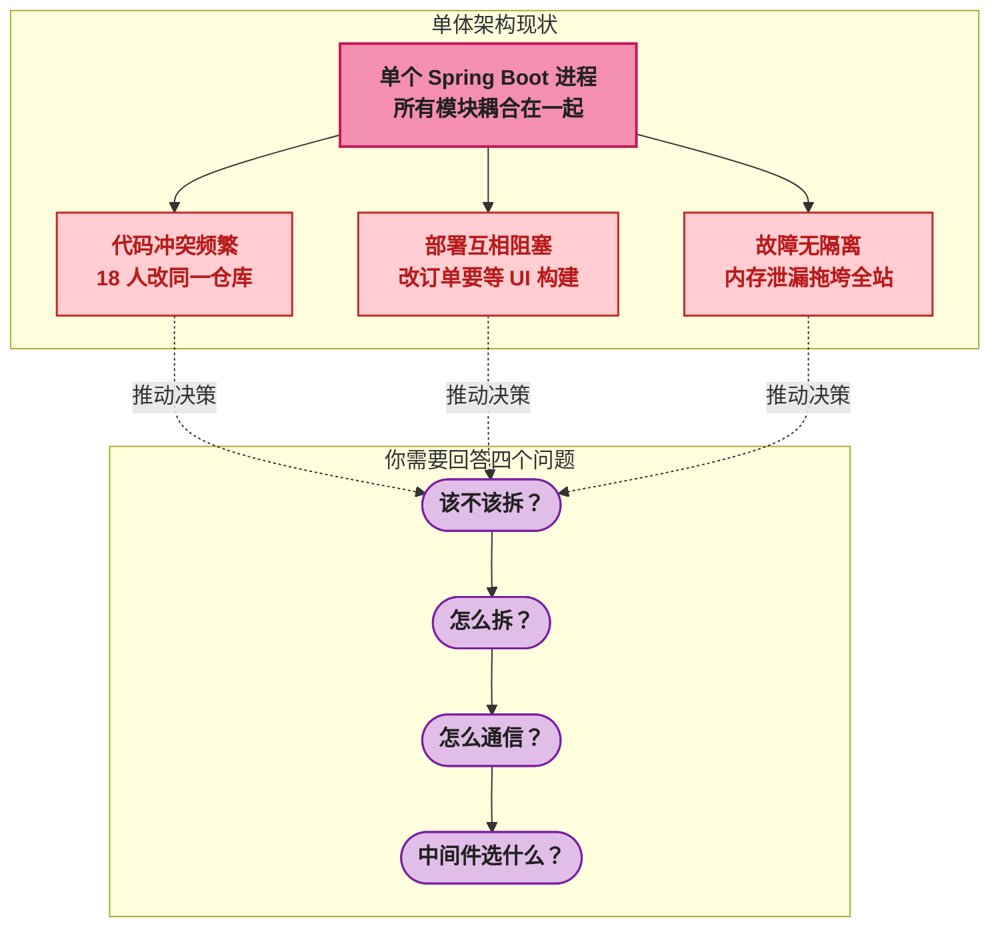
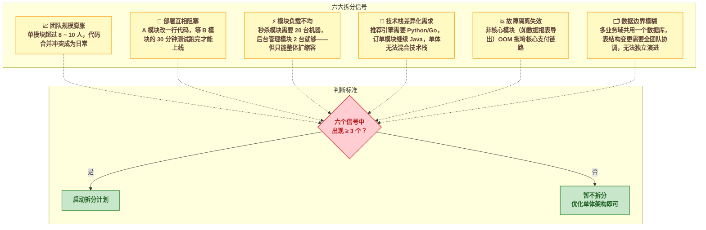
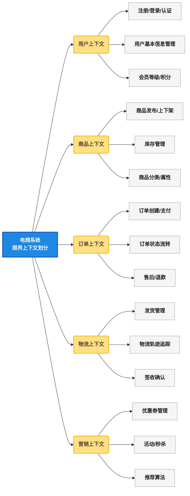
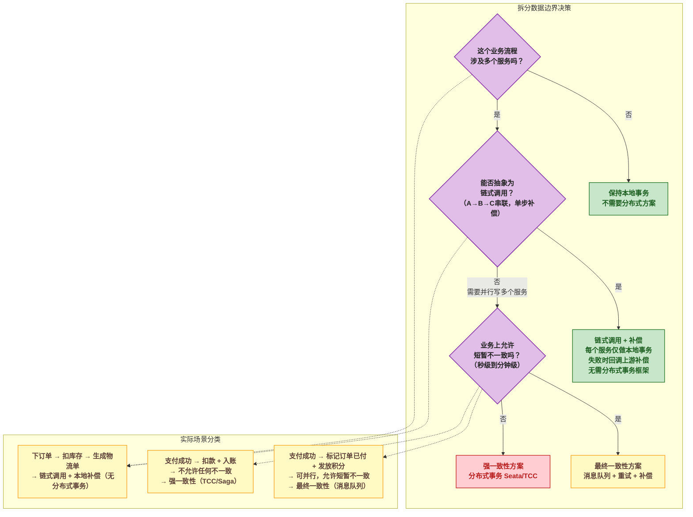
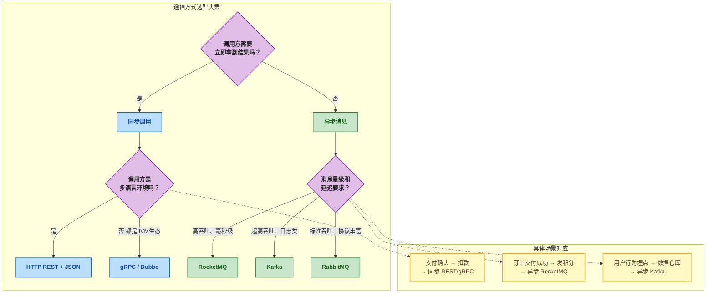
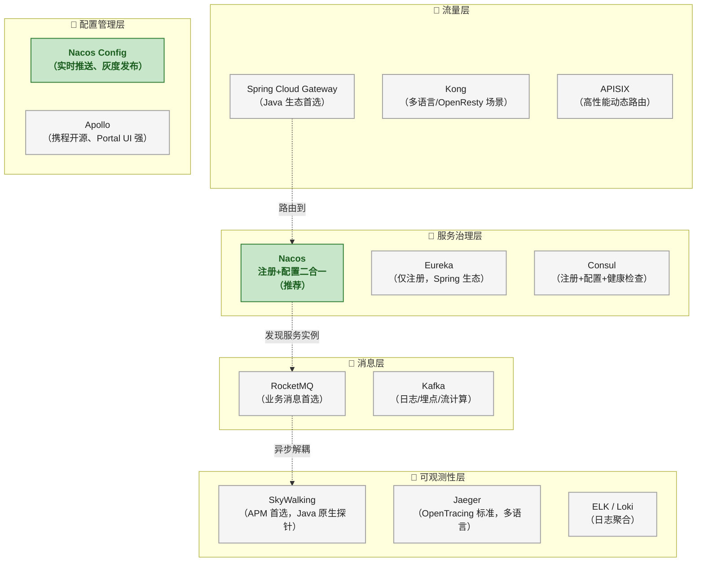
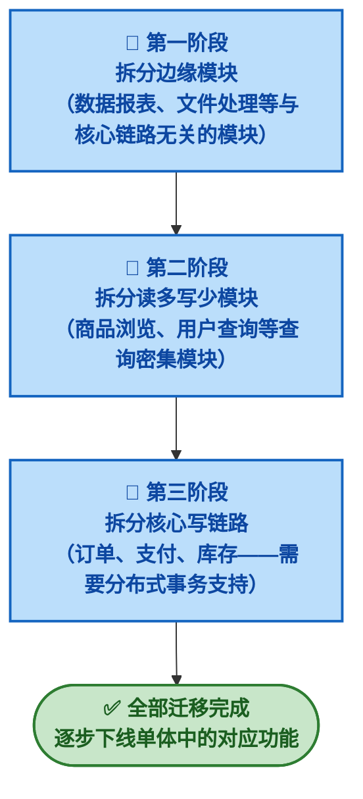
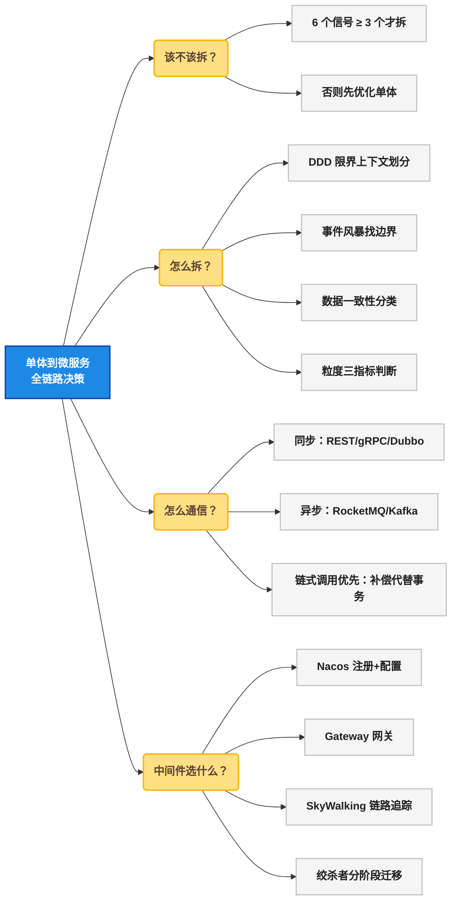

# 🏗️ 从单体到微服务：拆分决策、业务边界分析与中间件选型全指南

## 🏗️ 一、问题切入：一个电商系统的"临界点"

假设你接手了一个运行了两年的电商单体应用。它使用 Spring Boot + MyBatis + MySQL 开发，所有模块——用户、商品、订单、库存、支付、物流——都在一个 Git 仓库、一个进程、一个数据库里运行。

刚开始 3 个开发，CI/CD 流水线 3 分钟跑完。现在团队扩到了 18 人，一个订单功能的改动要等 UI 模块的测试先跑完才能部署。上周，运营活动模块的内存泄漏导致支付服务也一起挂了——整个系统 40 分钟不可用。

这种场景不是假设，它是大多数高速增长的业务最终都会撞上的临界点。接下来的问题是： **你该不该拆？如果拆，怎么拆？拆完各服务怎么通信？中间件怎么选？** 这篇文章回答这四个问题。



## 🏗️ 二、什么时候该拆：六个关键信号

拆分的收益永远伴随着代价——分布式事务、网络延迟、运维复杂度。在讨论"怎么拆"之前，必须先确认"该不该拆"。以下六个信号同时出现 3 个以上时，才值得启动拆分。



### 🔢 2.1 团队规模膨胀

康威定律（Conway's Law）说的是：系统架构会镜像组织沟通结构。当团队超过 8 ~ 10 人同时在一个模块上开发时，Git 合并冲突的修复成本开始指数增长。拆分的首要驱动力不是技术瓶颈，而是 **团队协作效率** 。

**判断标准** ：当两个功能小组连续 3 个迭代都在修改同一批文件时，这些文件对应的功能域就应该拆分为独立服务。

### 🚀 2.2 部署阻塞

一个 18 人团队共用一个 CI/CD 流水线时，一天可能有 15 次提交。如果每次合入 main 分支需要跑全量集成测试（30 分钟），部署队列会堵塞到下午 4 点——任何在 16:00 之后合入的代码都无法当天上线。

**判断标准** ：当你开始给 CI 构建"排号"时，说明部署已经变成了瓶颈。

### 📐 2.3 模块负载不均

以电商为例：秒杀/大促期间，下单和库存模块需要承受 10000 QPS，但后台管理模块（如商品上架、报表导出）连 100 QPS 都不到。单体架构只能 **全量扩缩** ——为秒杀扩 20 台机器时，那些只有 100 QPS 的模块也被迫占用了 20 台机器的内存和 CPU，资源浪费严重。

| 场景 | 下单/库存模块 | 后台管理模块 | 单体架构后果 |
|------|:---:|:---:|------|
| 日常流量 | 200 QPS | 50 QPS | 3 台机器即可，资源利用率正常 |
| 大促峰值 | 10000 QPS | 80 QPS | 必须扩到 20 台——后台模块浪费 17 台机器的资源 |
| 独立部署后 | 20 台节点独立扩缩 | 2 台节点保持不变 | 资源成本节省约 60% |

### 🔢 2.4 技术栈差异化

订单、支付模块（强一致性要求）适合 Java + Spring Boot 体系。但推荐引擎（模型训练、向量检索）用 Python/Go 更高效。单体架构强制所有模块使用同一技术栈，团队无法为不同业务场景选择最合适的工具。

### 🛡️ 2.5 故障隔离失效

单体进程中，一个 OOM 就能让所有功能下线。即使上了限流和熔断，同一个 JVM 内的模块之间仍然共享堆内存。数据报表模块因一次大查询导致 Full GC，直接影响到正在处理支付请求的线程——这种"涟漪故障"在单体里无法根除。

### 🗄️ 2.6 数据边界模糊

40 张表在一个数据库里，订单表、用户表、商品表之间通过外键深度耦合。当订单团队要给 `order` 表加一个字段时，必须和用户团队、商品团队沟通确认不影响他们的业务。这种"跨团队数据库协商"的成本，往往比代码合并冲突更隐蔽但更沉重。

## 🏗️ 三、怎么拆：业务边界分析

确认该拆之后，下一个问题就是 **从哪里切下第一刀** 。拆分的核心不在技术选型，而在业务边界划分——技术错了可以重构，但 **服务边界划错了，数据耦合会让你进退两难** 。

### 🔢 3.1 DDD 限界上下文（Bounded Context）

领域驱动设计（Domain-Driven Design，简称 DDD）提供了最核心的工具： **限界上下文** （Bounded Context，即一个领域模型有明确边界的语义空间）。在这个上下文中，一个业务概念有唯一确定的含义。

同一个词汇在不同上下文中的含义可能完全不同：

| 业务概念 | 订单上下文 | 商品上下文 | 用户上下文 |
|---------|-----------|-----------|-----------|
| `用户` | 下单人（需要地址、支付方式） | 浏览者（需要偏好、历史） | 注册实体（需要手机号、密码） |
| `订单` | 核心聚合根 | 被购买商品的统计维度 | 用户历史行为数据源 |
| `商品` | 被购买的 SKU 快照 | 核心聚合根 | 浏览/收藏/加购的标的 |

这意味着你不能建一个统一的 `User` 实体让三个模块共用。订单模块的 `User` 只需要 `userId` + `address` + `paymentMethod` ，商品模块的 `User` 只需要 `userId` + `preferences` 。 **每个模块在自己的限界上下文里维护自己的领域模型，这是拆分的第一步。**



### 📡 3.2 事件风暴（Event Storming）

事件风暴是一种由 DDD 社区推广的业务分析工作坊方法：召集产品、开发、运维等角色，在白板上贴出系统中发生的 **所有业务事件** ，按时间顺序排列，然后识别出这些事件的触发源和依赖关系。

事件风暴的核心产物有两个：

1. **事件序列** ：从用户注册开始，到下单、支付、发货、签收、售后——用橙色便利贴按时间线贴出完整的事件链条。
2. **热点区域** ：被多方同时依赖的事件或聚合（如"订单支付成功"事件同时被物流、积分、发票、数据分析四个模块消费），这些区域就是系统的 **核心边界点** ——优先拆这些地方风险最高。

事件风暴的产出直接映射到服务边界：一个时间轴上紧密关联的事件群，通常就是一个限界上下文。

### 🗄️ 3.3 数据一致性边界

拆分服务意味着拆分数据库。当你把订单和库存从同一个 MySQL 拆成两个独立数据库时，以前 `@Transactional` 一行搞定的事务操作现在跨越了两个服务。

但这里有一个常见的误区： **拆服务 ≠ 必上分布式事务。** 如果跨服务调用能抽象成链式调用（A → B → C），每个环节只做自己的本地事务，失败时通过补偿回滚，分布式事务完全可以避免。

拆分时的核心原则： **先识别是否能用链式调用消除分布式事务，再对无法消除的场景区分强一致性和最终一致性。**

**链式调用模式** ：将跨服务流程设计为线性调用链，每个环节只做自己的本地事务。

```
订单服务（本地事务） → 库存服务（本地事务） → 物流服务（本地事务）
         ↑                      ↑
    如果库存扣减失败           如果发货失败
    → 订单服务补偿取消订单     → 库存服务补偿恢复库存
                              → 订单服务补偿取消订单
```

链式调用的三个特征：
1. **每次只有一个服务在做写操作** ：不会出现两个服务同时写各自数据库然后互相等对方的场景
2. **补偿逻辑由上游实现** ：订单服务暴露 `cancelOrder()` ，库存服务暴露 `restoreInventory()` ——这些是业务层的补偿接口，不是分布式事务框架的 Try/Confirm/Cancel
3. **不需要全局协调器** ：链上某个节点失败，它只通知自己的直接上游，上游决定是重试还是补偿

大多数电商下单流程天然适配链式调用：下单→扣库存→生成物流单，串联执行，每个步骤独立补偿。

**何时链式调用不适用** ：当一步操作需要同时写两个服务（如"支付成功"同时要"标记订单已付"和"发放积分"），且这两个写操作不能有先后（业务要求同时成功或同时失败），才需要分布式事务。



**核心判断标准** ：

| 一致性策略 | 典型场景 | 技术方案 | 是否需要分布式事务框架 |
|-----------|---------|---------|:---:|
| **链式调用 + 补偿** | 下单 → 扣库存 → 生成物流单（串联、单步可逆） | 同步 RPC + 补偿接口（纯业务代码） | **否** |
| **最终一致性** | 发积分、发优惠券、更新搜索索引（并行、可短暂延迟） | 消息队列 + 本地消息表 | **否** |
| **弱一致性** | 日志上报、埋点数据、数据分析 | 异步批量写入 | **否** |
| **强一致性** | 支付扣款 + 入账（并行、必须同时成功） | Seata TCC/Saga | **是** |

大部分业务场景都可以通过链式调用或最终一致性避免分布式事务，真正的强一致性需求集中在 **资金和核心资产变更** 场景。

### 🔧 3.4 服务粒度决策

拆太粗——成了"分布式单体"，拆太细——"服务雪崩"和调试噩梦。粒度是一个需要平衡的工程决策。

| 粒度 | 特征 | 典型陷阱 |
|------|------|---------|
| **过粗** | 一个服务包含了 2 个以上限界上下文，数据库还是共享的 | 分布式单体——网络延迟增加了，但耦合度没降 |
| **合适** | 一个服务 = 一个限界上下文，有自己的数据库，通过 API/消息对外暴露能力 | 独立开发、独立部署、独立扩缩容 |
| **过细** | 一个服务只做一件事（如单纯的发短信、发邮件），被 20 个上游调用 | 调试一场业务调用需要跨 8 个服务，链路追踪成本爆炸 |

**粒度判断的核心指标** ：

- **数据独立性** ：这个模块能拥有自己独立的数据库吗？如果不能，它可能只是一个子模块，不是独立服务。
- **业务完整性** ：删除这个服务后，是否有一个完整的业务场景无法执行？如果没有，它可能是过度拆分的产物。
- **变更频率** ：这个模块的变更频率和其他模块差异是否超过 3 倍？如果是，拆分后能显著减少协调成本。

## 🏗️ 四、服务间通信设计

服务拆开后，通信框架的选择决定了系统的整体可靠性。通信方式分两类： **同步调用** （请求-响应）和 **异步消息** （发布-订阅）。



### 🔢 4.1 同步通信方案对比

| 方案 | 协议 | 序列化 | 性能 | 跨语言 | 服务治理 | 适用场景 |
|------|------|:---:|:---:|:---:|:---:|------|
| **Spring Cloud OpenFeign** | HTTP/1.1 | JSON | 中 | 是 | 需要配合 Gateway/Sentinel | 内部 API 直连，快速开发 |
| **gRPC** | HTTP/2 | Protobuf | 高 | 是 | 需要配合 Service Mesh | 高并发、多语言、强类型场景 |
| **Dubbo** | TCP（自定义） | Hessian2 / Protobuf | 非常高 | 否（Java 生态） | 内置服务注册、负载均衡、限流 | 纯 Java 生态、高性能要求 |

**选型建议** ：

- 纯 Java 团队 + 高性能需求 → **Dubbo + Nacos** ，性能最高，服务治理开箱即用
- 多语言团队 + 需要浏览器可访问 → **Spring Cloud OpenFeign + gRPC 混用** （对外 REST，对内 gRPC）
- 移动端/Web 端直接调用的 API → **REST（HTTP + JSON）** ，通用性最强

### 📬 4.2 异步通信方案对比

| 方案 | 吞吐量 | 延迟 | 消息可靠性 | 协议支持 | 适用场景 |
|------|:---:|:---:|:---:|------|------|
| **RocketMQ** | 高（十万级 TPS） | 毫秒级 | 非常高（同步刷盘+主从） | 自定义（Java 原生） | 订单、支付等业务消息 |
| **Kafka** | 非常高（百万级 TPS） | 毫秒级 | 高（分区多副本） | 自定义（多语言 SDK） | 日志、埋点、流计算 |
| **RabbitMQ** | 中（万级 TPS） | 微秒 ~ 毫秒 | 高（镜像队列） | AMQP 0-9-1 / MQTT / STOMP | 协议多、路由灵活的场景 |

**选型建议** ：

- 业务消息（订单、支付、库存变更） → **RocketMQ** ，事务消息能力是刚需
- 日志/埋点/流式数据处理 → **Kafka** ，吞吐量无敌
- 需要 AMQP 标准协议或复杂路由 → **RabbitMQ** ，路由灵活性最强

### 🌐 4.3 避免分布式事务：链式调用优先

这是微服务拆分中最容易被过度设计的一环。拆分前一个 `@Transactional` 搞定的操作，拆分后跨了多个服务——但 **大多数情况下你根本不需要分布式事务框架。**

**链式调用模式** 是避免分布式事务的核心手段：将跨服务流程设计为 A → B → C 的线性链，每个服务只操作自己的本地数据库，节点失败时沿着链反向补偿。

以电商下单为例：

```java
// 订单服务：创建订单（本地事务）
@Transactional
public void createOrder(OrderDTO dto) {
    orderMapper.insert(order);          // 本地写
    inventoryService.deduct(order);     // 同步调用库存服务（RPC）
    logisticsService.create(order);     // 同步调用物流服务（RPC）
}
```

如果 `logisticsService.create()` 调用失败，库存服务需要回滚已经扣减的库存。但这不需要分布式事务框架—— **补偿接口** 就够了：

```java
// 订单服务：失败补偿逻辑
@Transactional
public void createOrder(OrderDTO dto) {
    orderMapper.insert(order);
    try {
        inventoryService.deduct(order);
        try {
            logisticsService.create(order);
        } catch (Exception e) {
            inventoryService.restore(order);  // 补偿：恢复库存
            orderMapper.cancel(order.getId()); // 补偿：取消订单
            throw e;
        }
    } catch (Exception e) {
        orderMapper.cancel(order.getId());    // 补偿：取消订单
        throw e;
    }
}
```

这段代码没有任何分布式事务框架参与——每个 `@Transactional` 都只是自己的本地数据库事务。 **补偿逻辑就是普通的业务方法。**

### 🌐 4.4 何时才需要分布式事务

只有当一步操作需要 **并行写入多个服务且要求原子性** 时，分布式事务才不可避免。典型场景：支付回调同时标记订单已付和发放积分，且业务要求这两个操作必须同时成功。

| 场景特征 | 解决方案 | 是否需要分布式事务框架 |
|---------|---------|:---:|
| A → B → C 串联，单步可补偿 | 链式调用 + 本地补偿（纯业务逻辑） | **否** |
| A → B + C 并行，允许 B 成功 C 短暂延迟 | 消息队列 + 最终一致性 | **否** （本地消息表即可） |
| A → B + C 并行，B 和 C 必须同时成功 | Seata TCC / Saga | **是** |

| 方案 | 原理 | 优点 | 缺点 | 适用场景 |
|------|------|------|------|------|
| **链式调用 + 补偿** | 线性 A→B→C，失败反向补偿 | 无框架依赖，纯业务代码 | 只适合串联流程 | 适合 80% 的跨服务写场景 |
| **本地消息表** | 本地事务 + 消息表 + 定时任务重试 | 最轻量，依赖最少 | 需要自己实现幂等和重试 | 并行写、最终一致性场景 |
| **Seata TCC** | 业务方手动实现 Try / Confirm / Cancel | 性能高，无全局锁 | 代码侵入大，每个接口需提供三个方法 | 资金类业务（支付、转账） |
| **Seata AT** | 自动生成回滚 SQL，二阶段提交 | 对业务代码零侵入 | 依赖数据库，性能损耗高（全局锁） | 对侵入性要求极高、性能不敏感的场景 |
| **Saga** | 编排或编排+协同，正向+补偿 | 长事务友好，无全局锁 | 需要业务方实现补偿逻辑 | 长流程（如订单→物流→开票跨多天） |

## 🏗️ 五、中间件选型全景

当单体拆成 5 ~ 15 个服务后，一系列新的基础设施需求浮现：服务发现、配置管理、流量网关、链路追踪、日志聚合。



### 🚪 5.1 网关选型

| 维度 | Spring Cloud Gateway | Kong | APISIX |
|------|:---:|:---:|:---:|
| **运行时** | Java（Reactor-Netty） | OpenResty（Nginx+Lua） | OpenResty（Nginx+Lua） |
| **性能** | 中高 | 高（C 内核+Lua） | 高（动态路由性能最优） |
| **扩展方式** | Java Filter | Lua 插件 | Lua 插件（热更新） |
| **学习成本** | 低（Java 生态团队零门槛） | 中（需要 Lua 基础） | 中 |
| **适用场景** | 纯 Java 团队，快速开发 | 多语言团队，需要丰富的内置插件 | 对路由性能有极致要求的场景 |

**建议** ：纯 Java 团队直接选择 **Spring Cloud Gateway** ——nacos 集成开箱即用，不需要额外学习 Lua 或维护 OpenResty 环境。

### ⚙️ 5.2 注册中心 & 配置中心

| 维度 | Nacos | Eureka | Consul | Apollo |
|------|:---:|:---:|:---:|:---:|
| **核心能力** | 注册+配置二合一 | 仅注册 | 注册+配置+健康检查 | 仅配置 |
| **CAP 模型** | AP（也可 CP） | AP | CP | N/A（配置中心） |
| **一致性协议** | 自研（Raft 可选） | 最终一致性（Peer to Peer） | Raft | 最终一致性 |
| **配置推送** | 实时（长轮询/长连接） | 不支持配置管理 | 支持但不够灵活 | 实时推送 + 灰度发布 |
| **运维复杂度** | 低（单机即可启动） | 低 | 中（需要 Agent） | 中（Portal + Admin + Config Service） |
| **推荐场景** | **首选：注册+配置一个服务全搞定** | Spring Cloud 经典项目 | 非 Java 生态 | 对配置管理 UI 和流程有强需求的场景 |

**建议** ： **Nacos** 注册+配置二合一，运维成本最低。如果团队对配置管理有强流程需求（审批、灰度发布、版本回滚），可以选择 Nacos 做注册 + Apollo 做配置。

### 📊 5.3 链路追踪

| 维度 | SkyWalking | Jaeger | Zipkin |
|------|:---:|:---:|:---:|
| **探针方式** | Java Agent（字节码增强） | SDK 埋点（OpenTracing） | SDK 埋点（Brave） |
| **代码侵入** | **零侵入** | 有侵入 | 有侵入 |
| **协议标准** | 自研（兼容 OpenTracing 输出） | OpenTracing / OpenTelemetry | 自研（Brave） |
| **存储后端** | ES / H2 / MySQL | ES / Cassandra | ES / MySQL |
| **性能开销** | 低（Agent 级采样） | 中 | 中 |
| **推荐场景** | Java 生态首选，零配置接入 | 多语言、标准化优先 | Spring Cloud Sleuth 兼容 |

**建议** ：Java 生态直接选择 **SkyWalking** ——Java Agent 零代码侵入，自动拦截 Spring MVC、Dubbo、RocketMQ 等常见框架的调用链。

### 🔢 5.4 迁移策略：逐步抽离而非大爆炸

不要试图一次性拆完所有模块。推荐的迁移路径是 **绞杀者模式** （Strangler Fig Pattern）：每次只拆出一个服务，验证稳定后再拆下一个。



**各阶段关键动作** ：

| 阶段 | 拆分模块 | 新增中间件 | 风险 | 验证标准 |
|------|------|------|------|------|
| **第一阶段** | 数据报表、文件导出、消息推送 | 注册中心（Nacos）、网关 | 低（非核心链路，挂了不影响主营） | 模块独立运行 1 周无异常 |
| **第二阶段** | 商品浏览、用户查询 | 配置中心（Nacos Config） | 中（读多写少，影响用户体验但不可及资金） | QPS 与单体时期持平或更优 |
| **第三阶段** | 订单、支付、库存 | 消息队列（RocketMQ）、分布式事务（Seata/本地消息表）、链路追踪（SkyWalking） | 高（核心交易链路，出问题直接影响收入） | 全链路压测通过，订单成功率 ≥ 99.9% |

## 🏗️ 六、总结

从单体到微服务的迁移不是一次性的技术升级，而是一个 **持续数月的渐进式架构演进过程** 。核心决策点可以浓缩为以下全览：



**五个核心原则** ：

1. **不到临界点不拆** ：拆分带来的分布式复杂性增长是指数级的，而单体优化的收益仍然可观
2. **先边界后技术** ：服务边界划对了，技术选型可以后期调整；边界划错了，数据耦合会让你推倒重来
3. **链式调用优先，分布式事务是最后手段** ：80% 的跨服务写场景可抽象为 A → B → C 链式调用 + 本地补偿，剩下 15% 用最终一致性消息，真正需要分布式事务框架的不到 5%
4. **Nacos 是起点** ：注册中心+配置中心是微服务基础设施的最小集合，先上这两个再谈其他中间件
5. **绞杀者模式迁移** ：不要大爆炸式拆分，每次只拆一个模块，验证稳定后再拆下一个
