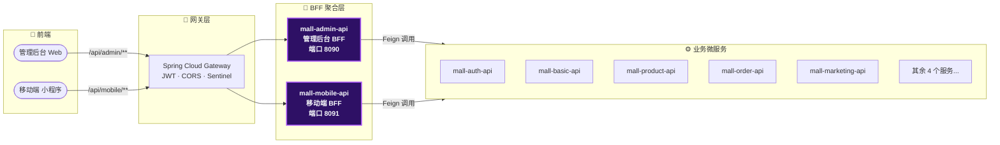
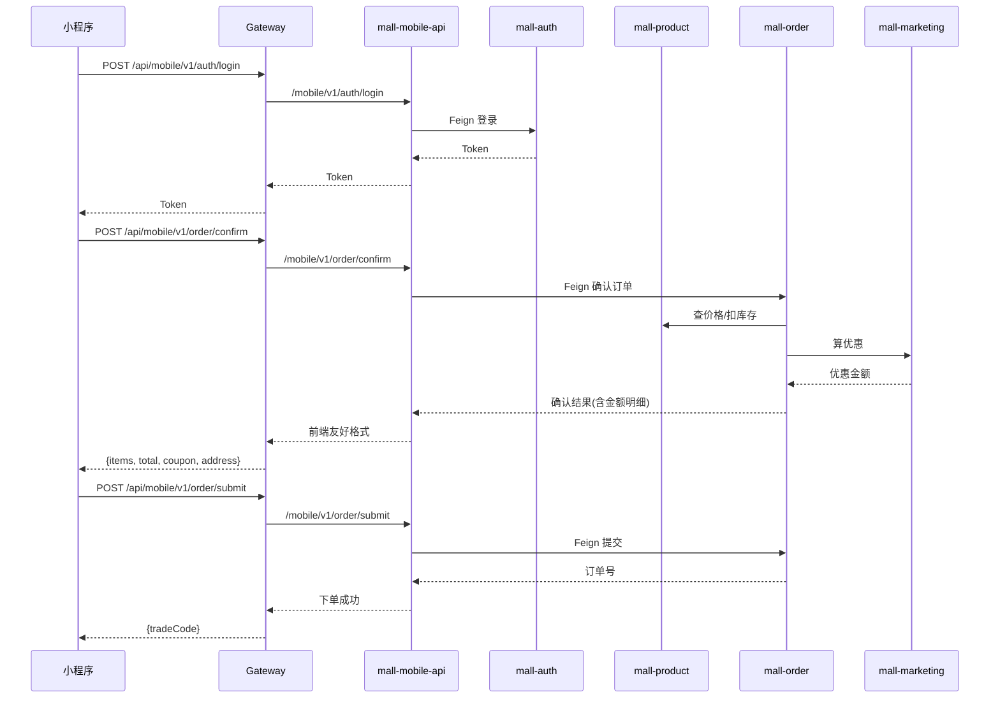

# 当你的单体项目被拆成微服务，前端第一个崩溃

某天接手了一个从老单体拆出来的微服务电商项目。技术栈倒是很"大厂"——Spring Cloud Alibaba、Nacos、Sentinel、RocketMQ、ShardingSphere，你能想到的全塞上了。

但前端同事过来敲门的时候，事情就不太对劲了。

> "咱这项目一共几个文档地址？"
> "9 个。"（每个后端服务一个 Knife4j 页面）
> "那我要调一个登录接口，该看哪个服务的文档？"
> "……好问题。"

这就是典型的**微服务拆了，但没完全拆**——后端确实拆成了 9 个独立服务，可前端仍然需要知道每个服务的地址、每个接口的路径、每个返回的字段含义。而且很多接口其实需要前端自己拼数据：登录完了再查一遍用户信息、再查一遍菜单权限、再查一遍角色列表。

前端不是在写业务，是在做 API 聚合。

## BFF：不是新概念，但能解决真问题

BFF（Backend For Frontend）的核心思路很简单：**每个前端都有一个专属的后端入口**，这个入口干三件事：

1. **聚合** — 把多个后端服务的数据合并成前端需要的一站式响应
2. **裁剪** — 只返回前端真正需要的字段，不裸奔整个数据库实体
3. **隔离** — 后端再怎么拆、再怎么重构，前端代码不用动

架构上看起来就是中间多了一层：



### 为什么要加这一层？直接转发不行吗？

接手时项目就已经有两个"BFF 模块"了—— ` mall-mobile-api` 和 `mall-admin-api `。但打开一看，里面就一个 `ForwardController `，用 `RestTemplate` + `LoadBalancerClient` 把所有请求原封不动转发到后端服务：

```java
@RequestMapping("/**")
public Object forward(HttpServletRequest request) {
    // ... 取路径 -> 找服务 -> 转发 -> 返回
}
```

这叫**透明代理**，不叫 BFF。它的唯一价值就是"少暴露几个端口"，前端该拼的数据还是得自己拼。真正的 BFF 应该主动理解前端需要什么数据，然后去后端拿回来组装好再返回。

> ⚠️ 新手提示：如果你的 BFF 层只做请求转发，那它和 Nginx 反向代理的区别就只是一个负载均衡注解。BFF 的核心价值在"聚合"不在"转发"。

## 第一步：摸清前端到底调了哪些接口

做 BFF 之前第一件事：**看前端代码**。别猜，别靠文档，直接去翻前端项目里的 API 调用。

我们有两个前端：

| 前端 | 技术栈 | 位置 |
|------|--------|------|
| 管理后台 | Vue 2 + axios | `web端/susan_mall_cloud_web/` |
| 移动端小程序 | uni-app | `小程序/susan_mall_cloud_uni/` |

前端 API 文件是结构化的，每个业务域一个 JS 文件。拿管理后台举例，看一眼 `src/api/product/product.js` 就知道商品模块要调什么：

```javascript
export function getPage(params) { return request.post('/api/product/v1/product/searchByPage', params) }
export function add(params)     { return request.post('/api/product/v1/product/insert', params) }
export function del(params)     { return request.post('/api/product/v1/product/deleteByIds', params) }
export function edit(params)    { return request.post('/api/product/v1/product/update', params) }
```

跑一遍全量扫描，结果：

| 前端 | 直接调用的接口数 | 涉及的服务数 |
|------|:---:|:---:|
| 管理后台 | ~60 | auth / basic / product / marketing / order / pay |
| 移动端小程序 | ~45 | auth / basic / product / marketing / order / pay / recommend |

剩下那 150+ 个接口都是**服务之间的 Feign 互调**，前端根本不关心。知道了边界在哪，BFF 的工作量就清晰了。

## 第二步：拆解 BFF 控制器的设计模式

BFF 控制器分两种：**聚合型**和**透传型**。

### 聚合型：首页三合一

移动端首页需要展示轮播图 + 公告列表 + 推荐商品。没 BFF 之前，前端要调 3 个接口：

```
GET /api/product/v1/mobile/index/getIndexCarouselImageList
GET /api/product/v1/mobile/index/getIndexNoticeList
GET /api/product/v1/mobile/index/getIndexProductList?type=0
```

有了 BFF 之后，前端只调一个：

```java
@RestController
@RequestMapping("/mobile/v1/home")
@RequiredArgsConstructor
public class MobileHomeController {

    private final IndexFeignClient indexFeignClient;

    @Operation(summary = "获取首页聚合数据")
    @GetMapping("/index")
    public Map<String, Object> getIndexData() {
        Map<String, Object> result = new LinkedHashMap<>();
        // 每个调用独立 try-catch，一个挂了不影响其他
        try { result.put("carouselList", indexFeignClient.getIndexCarouselImageList());
        } catch (Exception e) { log.warn("获取轮播图失败", e);
            result.put("carouselList", Collections.emptyList()); }

        try { result.put("noticeList", indexFeignClient.getIndexNoticeList());
        } catch (Exception e) { log.warn("获取公告失败", e);
            result.put("noticeList", Collections.emptyList()); }

        try { result.put("productList", indexFeignClient.getIndexProductList(0));
        } catch (Exception e) { log.warn("获取推荐商品失败", e);
            result.put("productList", Collections.emptyList()); }
        return result;
    }
}
```

这里有个细节：**每个下游调用独立 try-catch**。如果推荐商品服务挂了，轮播图和公告不能跟着一起挂。BFF 要做降级兜底，而不是把故障面放大。

### 透传型：文件上传 + 用户头像更新

这个场景涉及两个服务：先调 `mall-basic` 的文件上传接口拿到 URL，再调 `mall-auth` 的用户更新接口设置头像地址。两个操作有先后依赖关系：

```java
@PostMapping(value = "/avatar", consumes = MediaType.MULTIPART_FORM_DATA_VALUE)
public void updateAvatar(@RequestParam("file") MultipartFile file) throws Exception {
    // 第一步：上传文件到 basic 服务
    FileDTO fileDTO = uploadFeignClient.imageUpload(file);
    // 第二步：用返回的 URL 更新用户头像
    UserAvatarDTO avatarDTO = new UserAvatarDTO();
    avatarDTO.setFileName(file.getOriginalFilename());
    avatarDTO.setFileUrl(fileDTO.getDownloadUrl());
    userFeignClient.updateAvatar(avatarDTO);
}
```

对前端来说这就是一个接口 `POST /mobile/v1/user/avatar `，背后做了两步聚合。如果未来换成 OSS 上传，前端代码零改动。

## 第三步：Gateway 路由怎么配

BFF 是独立服务，前端流量通过 Gateway 转发过来。路由配置在 Nacos 的 `mall-gateway-dev.yaml` 里：

```yaml
spring:
  cloud:
    gateway:
      routes:
        - id: mall-admin-api
          uri: lb://mall-admin-api
          order: 8005
          predicates:
            - Path=/api/admin/**
          filters:
            - StripPrefix=2
        - id: mall-mobile-api
          uri: lb://mall-mobile-api
          order: 8006
          predicates:
            - Path=/api/mobile/**
          filters:
            - StripPrefix=2
```

`StripPrefix=2` 的意思是把 URL 的前两段去掉再转发。所以客户端请求 `GET /api/mobile/v1/home/index` 到了 BFF 实际变成 `GET /mobile/v1/home/index `。

后端服务的直连路由（`/api/auth/**`、`/api/product/**` 等）保留着，因为 BFF 内部的 ForwardController 兜底时也需要走 Gateway 转发。但前端只需要知道两个 BFF 入口就够了。

## 第四步：别忘了 JWT 白名单

认证相关的接口（登录、获取验证码、注册）不需要 Token，要在 Gateway 层放行。直接把 BFF 的公共路径加到 `gateway.filter.noAuth `：

```
/api/admin/v1/auth/login,/api/admin/v1/auth/getCode,
/api/mobile/v1/auth/login,/api/mobile/v1/auth/register,
/api/mobile/v1/home/index,/api/mobile/v1/product/search,
...
```

## 架构全景

改造完成后，一次完整的下单流程在 BFF 层是这样的：



注意看第二步：`/order/confirm` 在 BFF 这里只是一个透传调用，但后端 `mall-order` 内部一次性查了商品价格、库存和优惠券金额。前端收到的已经是组装好的完整数据。

## BFF 模块的完整文件结构

最终落地了两个 BFF 模块，共 **10 个控制器 + 2 个通用转发器**：

```
mall-admin-api/                          # 管理后台 BFF（端口 8090）
└── controller/admin/
    ├── AdminAuthController.java         # 登录/用户信息/重置密码
    ├── AdminUserController.java         # 用户管理 + 收货地址
    ├── AdminDashboardController.java    # 仪表盘数据聚合
    └── proxy/ForwardController.java     # 通用透传兜底

mall-mobile-api/                         # 移动端 BFF（端口 8091）
└── controller/mobile/
    ├── MobileAuthController.java        # 登录/注册/短信验证码
    ├── MobileHomeController.java        # 首页三合一聚合
    ├── MobileProductController.java     # 商品搜索/详情/评论
    ├── MobileCartController.java        # 购物车 CRUD
    ├── MobileOrderController.java       # 订单全生命周期
    ├── MobileCouponController.java      # 优惠券列表/领取
    ├── MobileUserController.java        # 用户资料/头像/地址
    └── proxy/ForwardController.java     # 通用透传兜底
```

每个控制器都通过 Feign Client 调用后端服务，聚合逻辑写在 Controller 方法里，不增加中间层。

## BFF 层的常见坑

### 1. Feign 扫描范围

BFF 模块引入了所有 client 依赖，但 `@EnableFeignClients` 必须显式指定包名，不能用全量扫描：

```java
@EnableFeignClients(basePackages = {
    "cn.net.mall.auth.client",
    "cn.net.mall.product.client",
    // ...
})
```

### 2. 通用转发与具体控制器不能冲突

BFF 的 `ForwardController` 映射 `/**`，具体的 BFF 控制器映射 `/mobile/v1/auth/**`。Spring MVC 会优先匹配具体路径，`/**` 只接管没被其他 @RequestMapping 覆盖的请求。这个优先级是框架自带的，不用额外配置。

### 3. 聚合接口必须做故障隔离

单个下游超时不拖垮整个 BFF。HomeController 里每个 Feign 调用都包了 try-catch， ` log.warn` 记录异常后返回空列表。前端拿到空列表可能少展示一个模块，但页面能正常渲染。

### 4. 保持 Nacos 服务名一致

BFF 的 `spring.application.name` 必须和 Gateway 路由的 `lb://xxx` 完全一致。如果 BFF 注册为 `mall-mobile-api `，Gateway 就要写 `lb://mall-mobile-api `。这里拼错一个字符就是 503。

## 总结

前后端分离得越彻底，BFF 的价值就越明显。以前端不用知道后端有几个服务、每个服务的接口是什么——它只知道一个 BFF 入口，调就行了。

这次改造的实际收益：

| 指标 | 改造前 | 改造后 |
|------|:---:|:---:|
| 前端需要看的文档数 | 9 个 | **1 个** |
| 首页加载需发起的请求数 | 3 个 | **1 个**（聚合） |
| 头像上传前端代码量 | 2 步（上传 + 更新） | **1 步** |
| 新增后端服务对前端影响 | 改前端代码 | **零影响** |

BFF 不是什么高深的新概念，但在微服务架构里属于"加了就舒服、不加天天难受"的那层。特别是当你有多个前端（Web + 小程序 + 可能还有 App）的时候，每个前端一个 BFF，各自独立演进，谁也不用迁就谁。
