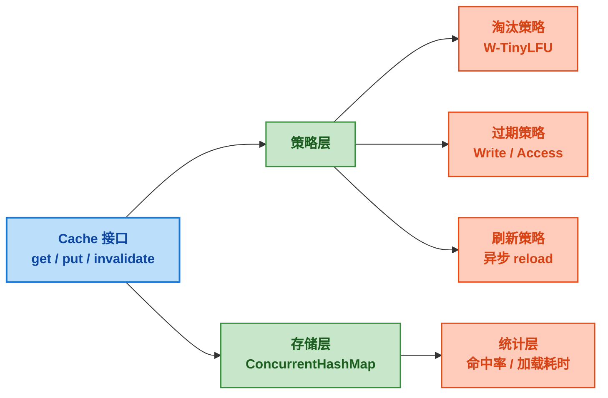

# Caffeine 核心与 SpringBoot 集成

> 📖 <strong>前置阅读</strong>：本文假设读者已了解 Redis 基本操作和 Spring Cache 注解（`@Cacheable`/`@CachePut`/`@CacheEvict`）。如果还不熟悉 Redis 系列，建议先阅读 [<strong>SpringBoot Redis 全操作指南</strong>]()。

## 一、⚡ 问题切入：Redis 再快也是远程调用

回顾一下，一个典型的 Redis 缓存查询是：

```java
// Redis 缓存读
User user = (User) redisTemplate.opsForValue().get("user:1001");
if (user != null) return user;

// 缓存未命中，查 MySQL
user = userMapper.selectById(1001L);
redisTemplate.opsForValue().set("user:1001", user, 30, TimeUnit.MINUTES);
return user;
```

Redis 延迟一般在 0.5ms ~ 2ms——相比 MySQL 的 3ms ~ 10ms 已经快很多了。但这个延迟不是免费的：<strong>每次 Redis 查询都是一次网络往返（RTT）</strong>。同机房内 RTT 大约 0.1ms，跨机房可能到 2ms 甚至更久。

在高 QPS 下，这 0.5ms × 10 万次查询 = 50 秒的累计时间，还不算序列化/反序列化的 CPU 开销。而且 Redis 不是永远不会挂——网络抖动、内存满了、主从切换，任何一个都可能让 Redis 临时不可用。

<strong>把最热的数据放到应用进程的堆内存里，连网络开销都省掉</strong>——这就是本地缓存的价值。

```java
// 本地缓存：纯内存访问，0 网络开销
Cache<String, User> cache = Caffeine.newBuilder()
    .maximumSize(10_000)
    .expireAfterWrite(5, TimeUnit.MINUTES)
    .build();

User user = cache.get("user:1001", key -> userMapper.selectById(1001L));
// 命中时：0.001ms（纳秒级），无网络开销，无序列化开销
// 未命中时：自动调用回调函数查 DB 并回填缓存
```

对比一下这三层的数据访问延迟：

| 存储层 | 典型延迟 | 说明 |
|--------|:---:|------|
| 本地缓存（Caffeine） | 0.001ms | JVM 堆内存直接访问，零网络开销 |
| 远程缓存（Redis） | 0.5ms ~ 2ms | 网络 RTT + 序列化/反序列化 |
| 数据库（MySQL） | 3ms ~ 10ms | 磁盘 I/O + 索引遍历 |

本地缓存比 Redis 快 500 倍以上，比 MySQL 快 3000 倍以上。这就是 Caffeine 存在的核心价值。

## 二、🧬 Caffeine 核心概念

### 2.1 什么是 Caffeine

Caffeine 是 Java 生态中<strong>性能最高的本地缓存库</strong>，它替代了旧时代的 Guava Cache。官方的 benchmark 显示 Caffeine 在读写吞吐量上是 Guava Cache 的 2-6 倍。

相比于 Java 自带的 `ConcurrentHashMap` 做缓存，Caffeine 提供了三个关键能力：

| 能力 | ConcurrentHashMap | Caffeine |
|------|:---:|:---:|
| **自动过期** | 需要自己写定时任务清理 | 内置 expireAfterWrite / expireAfterAccess |
| **淘汰策略** | 没有（只会 OOM） | W-TinyLFU 自动淘汰低频数据 |
| **自动刷新** | 需要自己写刷新线程 | 内置 refreshAfterWrite 异步刷新 |
| **统计信息** | 没有 | 命中率、淘汰量、加载耗时 |
| **容量控制** | 无上限（直到 OOM） | maximumSize / maximumWeight |



### 2.2 W-TinyLFU —— 为什么 Caffeine 比 Guava 快

Guava Cache 使用 <strong>LRU（Least Recently Used）</strong>——淘汰最久没被访问的数据。LRU 的致命缺陷：<strong>一次偶然的全量查询会把所有热点数据冲掉</strong>。比如定时任务扫描了一遍全表，LRU 把这批只访问了一次的数据标记为"最近使用过"，真正的热点数据反而被淘汰了。

Caffeine 使用 <strong>W-TinyLFU（Window Tiny Least Frequency Used）</strong>——结合了 LFU 和 LRU 的优势：

```
W-TinyLFU = Window Cache（LRU 窗口）+ Main Cache（LFU 频率统计）

Window：新进来的数据先在 Window 区（占 1% 空间），用 LRU 逻辑
Main：Window 中的数据被访问到一定频率后"晋升"到 Main 区（占 99% 空间），用 LFU 逻辑
淘汰：Main 区中访问频率最低的数据被淘汰
```

<strong>TinyLFU 的频率统计</strong>用了一个巧妙的数据结构——<strong>Count-Min Sketch</strong>：一个二维计数器数组 + 多个哈希函数。用极小的内存（几 KB）近似统计每个 Key 的访问频率。精度不是 100%，但足以区分"被访问了 1 次"和"被访问了 100 次"。

<strong>核心思想</strong>：LRU 只看"最近有没有被访问"（但会被一次性扫描污染），LFU 只看"历史被访问了多少次"（但无法淘汰历史高频但现在已经不用的数据）。W-TinyLFU 用 Window 层给新数据一个机会，用 Main 层的频率统计守住真正的热点数据。

不展开细节——你不需要理解 Count-Min Sketch 的数学原理。只需要知道：<strong>大量 benchmark 显示 W-TinyLFU 在实际业务负载下的命中率比 LRU 高 5%~15%</strong>。代码写法完全一样。

### 2.3 基础 API

```java
import com.github.benmanes.caffeine.cache.Cache;
import com.github.benmanes.caffeine.cache.Caffeine;

Cache<String, User> cache = Caffeine.newBuilder()
    .maximumSize(10_000)                              // 最多 10000 条
    .expireAfterWrite(5, TimeUnit.MINUTES)           // 写入后 5 分钟过期
    .build();

// 查——有就返回，没有就调 callback 加载并缓存
User user = cache.get("user:1001", key -> {
    return userMapper.selectById(Long.parseLong(key.replace("user:", "")));
});

// 手动放入
cache.put("user:1001", user);

// 删除单条
cache.invalidate("user:1001");

// 删全部
cache.invalidateAll();

// 如果存在就返回，不存在返回 null（不自动加载）
User cached = cache.getIfPresent("user:1001");
```

`get(key, callback)` 是 Caffeine 最常用的方法——<strong>原子操作</strong>。同一个 key 同时被多个线程访问时，只有一个线程执行 callback 加载数据，其他线程等待并共享结果。不需要自己加锁。

## 三、🔧 三种过期策略

Caffeine 的过期策略比 Redis 更丰富——Redis 只有基于时间的过期，Caffeine 额外支持基于访问的过期。

### 3.1 expireAfterWrite —— 写入后多久过期

最常见——写入缓存后开始计时，到了时间就过期。适合<strong>数据有时效性</strong>的场景：

```java
Cache<String, User> cache = Caffeine.newBuilder()
    .expireAfterWrite(5, TimeUnit.MINUTES)   // 写入 5 分钟后过期
    .build();

cache.put("user:1001", user);
// 5 分钟后 cache.getIfPresent("user:1001") → null
```

<strong>注意</strong>：`expireAfterWrite` 是从<strong>写入（或更新）时间</strong>开始计时，不是从最后一次读取算。跟 Redis 的 `EXPIRE` 行为一致。

### 3.2 expireAfterAccess —— 多久没被访问就过期

数据在指定时间内<strong>没有被读或写</strong>，就自动过期。适合<strong>"只要有人用就不删，没人用了就删"</strong>的场景：

```java
Cache<String, User> cache = Caffeine.newBuilder()
    .expireAfterAccess(10, TimeUnit.MINUTES)  // 10 分钟没人访问就过期
    .build();

// 第 0 分钟：cache.put("user:1001", user)
// 第 4 分钟：cache.getIfPresent("user:1001") → 返回 user，过期时间重置为 10 分钟
// 第 15 分钟：cache.getIfPresent("user:1001") → null（距离上次访问已经 11 分钟）
```

<strong>expireAfterWrite vs expireAfterAccess</strong>：

| 策略 | 计时方式 | 适用场景 |
|------|---------|---------|
| `expireAfterWrite` | 写入后固定时间过期 | 有时效性的数据（验证码、token、热点榜单） |
| `expireAfterAccess` | 每次访问重置计时器 | 内存敏感的缓存（用户 Session、配置项） |

两者可以<strong>同时使用</strong>，先触发哪个就按哪个过期：

```java
Cache<String, User> cache = Caffeine.newBuilder()
    .expireAfterWrite(30, TimeUnit.MINUTES)    // 最长 30 分钟
    .expireAfterAccess(5, TimeUnit.MINUTES)     // 5 分钟没人访问也过期
    .build();
```

### 3.3 refreshAfterWrite —— 异步刷新（不是过期）

这是 Caffeine 最独特的策略。<strong>缓存不会过期，但在数据变"旧"后，访问时异步刷新</strong>——用户本次请求先返回旧值，后台异步加载新值。

```java
Cache<String, User> cache = Caffeine.newBuilder()
    .refreshAfterWrite(5, TimeUnit.MINUTES)    // 5 分钟后异步刷新
    .build();

User user = cache.get("user:1001", key -> {
    // 前 5 分钟：每次访问都直接返回缓存
    // 5 分钟后：返回旧值 + 后台异步执行这里加载新值
    // 加载完成后自动替换为新值
    return userMapper.selectById(parseId(key));
});
```

<strong>`refreshAfterWrite` 不等于 `expireAfterWrite`</strong>：

| | expireAfterWrite | refreshAfterWrite |
|------|:---:|:---:|
| 缓存过期时 | 删除数据，下次访问同步加载 | 返回旧数据，异步加载新数据 |
| 加载期间 | 调用方阻塞等待 | 调用方直接拿到旧值（无等待） |
| 适用场景 | 数据不允许过期后还有旧值 | 允许短暂用旧值，追求低延迟 |

实际项目中推荐 <strong>refresh + expire 组合</strong>：

```java
Cache<String, User> cache = Caffeine.newBuilder()
    .expireAfterWrite(30, TimeUnit.MINUTES)    // 硬过期：30 分钟后必须重新加载
    .refreshAfterWrite(5, TimeUnit.MINUTES)    // 软刷新：5 分钟后触发异步刷新
    .build();
```

5 分钟后触发异步刷新——成功就替换为新值，失败继续用旧值。30 分钟硬上限——到了时间不管刷新成功与否都过期。

## 四、💨 SpringBoot 集成

### 4.1 依赖与基础配置

```xml
<dependency>
    <groupId>com.github.ben-manes.caffeine</groupId>
    <artifactId>caffeine</artifactId>
</dependency>
<dependency>
    <groupId>org.springframework.boot</groupId>
    <artifactId>spring-boot-starter-cache</artifactId>
</dependency>
```

<strong>真实项目中的配置</strong>——一个商城项目的字典数据缓存（数据字典是什么？下拉框里的"订单状态""商品分类"这些选项）：

```yaml
# application.yml
spring:
  cache:
    cache-names: dict_data              # 缓存区域名——对应 @Cacheable 的 value
    type: caffeine                      # 用 Caffeine 作为缓存实现
    caffeine:
      spec: initialCapacity=50,maximumSize=500,expireAfterWrite=60s
```

```java
// ApiApplication.java —— 在启动类上开启 Spring Cache
@EnableCaching
@SpringBootApplication(scanBasePackages = {"com.mall"})
public class ApiApplication {
    public static void main(String[] args) {
        SpringApplication.run(ApiApplication.class, args);
    }
}
```

<strong>三个值得注意的配置细节</strong>：

1. <strong>只需要一个 spec 字符串</strong>——`initialCapacity=50,maximumSize=500,expireAfterWrite=60s`。不需要像教程里那样写一个 `CacheManager` Bean。Spring Boot 的 Caffeine 自动配置会解析这个 spec 字符串，自动创建 `CaffeineCacheManager`。

2. <strong>cache-names 是必须的</strong>——没有 `cache-names` 配置，`@Cacheable(value = "dict_data")` 会找不到缓存区域，注解的缓存不会生效。

3. <strong>真实项目的参数很保守</strong>：500 条上限、60 秒 TTL。数据字典总条数不超过 500，所以不担心内存溢出；60 秒 TTL 保证即使字典被修改了，最慢 60 秒后所有实例都拿到新数据。

### 4.2 自定义 Key 生成器

Spring Cache 默认的 key 生成器只考虑方法参数——参数值变了 key 就不同。但有些场景需要一个更可控的 key 格式：

```java
// DictCacheKeyGenerator.java —— 真实项目中的自定义 Key 生成器
public class DictCacheKeyGenerator implements KeyGenerator {
    @Override
    public Object generate(Object target, Method method, Object... params) {
        // 生成 key 格式：DictService_order_status
        return target.getClass().getSimpleName() + "_"
                + StringUtils.arrayToDelimitedString(params, "_");
    }
}
```

注册为 Bean：

```java
// ApplicationConfig.java
@Configuration
public class ApplicationConfig {
    @Bean
    public DictCacheKeyGenerator dictCacheKeyGenerator() {
        return new DictCacheKeyGenerator();
    }
}
```

当调用 `queryDictDetailEntity("order_status")` 时，生成的缓存 key 就是 `DictService_order_status`——可读、可排查、不会冲突。

### 4.3 注解式缓存——真实用法

```java
// DictService.java —— 真实项目的数据字典服务
@Service
public class DictService {

    // @Cacheable：先从 Caffeine 取，取不到执行方法并自动缓存返回值
    @Cacheable(value = "dict_data", keyGenerator = "dictCacheKeyGenerator")
    public List<DictDetailEntity> queryDictDetailEntity(String dictName) {
        // 这个方法只在 Caffeine 未命中时才执行
        // 方法体从 Redis Hash 读取数据（不是直接查 MySQL）
        List<DictDetailEntity> dataList = getDictDataFromRedis(dictName);
        if (CollectionUtils.isEmpty(dataList)) {
            return Collections.emptyList();
        }
        return dataList.stream()
                .sorted(Comparator.comparing(DictDetailEntity::getSort))
                .collect(Collectors.toList());
    }
}
```

<strong>和普通 Redis @Cacheable 的关键区别</strong>：

| | Redis @Cacheable | Caffeine @Cacheable（真实用法） |
|------|:---:|:---:|
| 注解写法 | `@Cacheable(value = "user", key = "#id")` | `@Cacheable(value = "dict_data", keyGenerator = "...")` |
| 缓存层 | Redis（远程） | Caffeine（JVM 本地堆内存） |
| 数据源 | 方法体直接查 MySQL | 方法体查 Redis Hash（第二层缓存） |
| Key 策略 | SpEL `#id` 简单拼接 | 自定义 KeyGenerator 统一生成 |

> ⚠️ 新手提示：`@Cacheable` 只看注解——不看内容。底层是 Redis 还是 Caffeine，由 `application.yml` 的 `spring.cache.type` 决定。这意味着<strong>写代码时不需要关心底层是什么缓存实现</strong>，改配置文件就能切换。从 Redis 切到 Caffeine 只需要改一行配置。

### 4.4 编程式缓存 —— 更精细的控制

注解适合"查了缓存再查 DB"的标准模式。复杂场景（条件过期、需要统计命中率、批量操作）用编程式：

```java
@Component
public class UserCacheManager {

    private final Cache<Long, User> cache;

    public UserCacheManager() {
        this.cache = Caffeine.newBuilder()
            .maximumSize(10_000)
            .expireAfterWrite(30, TimeUnit.MINUTES)
            .refreshAfterWrite(5, TimeUnit.MINUTES)
            .recordStats()                    // 开启统计
            .build();
    }

    public User get(Long id) {
        return cache.get(id, key -> userMapper.selectById(key));
    }

    public void put(User user) {
        cache.put(user.getId(), user);
    }

    public void evict(Long id) {
        cache.invalidate(id);
    }

    public void evictAll() {
        cache.invalidateAll();
    }

    // 批量预热
    public void warmUp(List<User> users) {
        users.forEach(u -> cache.put(u.getId(), u));
    }

    // 查看缓存统计
    public CacheStats stats() {
        return cache.stats();
        // 输出：hitCount=8523, missCount=147, hitRate=0.983,
    }
}
```

### 4.5 统计监控

Caffeine 内置了详细的统计信息，不需要额外埋点：

```java
Cache<String, User> cache = Caffeine.newBuilder()
    .recordStats()
    .build();

CacheStats stats = cache.stats();

System.out.println("命中次数: " + stats.hitCount());           // 8523
System.out.println("未命中次数: " + stats.missCount());         // 147
System.out.println("命中率: " + stats.hitRate());               // 0.983
System.out.println("淘汰次数: " + stats.evictionCount());       // 320
System.out.println("平均加载耗时: " + stats.averageLoadPenalty() + "ns");
```

生产环境建议把这些指标暴露给 Prometheus / Micrometer：

```java
@Bean
public Cache<String, User> userCache(MeterRegistry registry) {
    Cache<String, User> cache = Caffeine.newBuilder()
        .maximumSize(10_000)
        .recordStats()
        .build();

    // 绑定到 Micrometer
    CaffeineCacheMetrics.monitor(registry, cache, "user-cache");
    return cache;
}
```

## 五、🎯 总结

本文从真实项目的数据字典缓存出发，拆解了 Caffeine 本地缓存的核心能力：

1. <strong>真实集成方式</strong>：`@EnableCaching` + `spring.cache.type: caffeine` + spec 字符串 + `@Cacheable(value, keyGenerator)`。不需要自己 new `CacheManager` Bean——Spring Boot 自动配置就够了。

2. <strong>自定义 KeyGenerator</strong>：`DictCacheKeyGenerator` 生成 `ClassName_param1_param2` 格式的缓存 key——可读、可排查、不会冲突。

3. <strong>@Cacheable 不看底层</strong>：代码里写 `@Cacheable` 注解时不需要关心底层是 Redis 还是 Caffeine——由 `spring.cache.type` 配置决定。改一行 yml 就能切换。

4. <strong>W-TinyLFU</strong>：比 LRU 命中率高 5%~15%，用 Count-Min Sketch 近似统计访问频率，不受偶发性全量查询的污染。

5. <strong>三种过期策略</strong>：`expireAfterWrite`（写入后固定过期）、`expireAfterAccess`（不访问就过期）、`refreshAfterWrite`（异步刷新不阻塞）。推荐 refresh + expire 组合。

6. <strong>统计监控</strong>：`recordStats()` 一行开启，命中率、加载耗时、淘汰量全部可监控。

> 📖 <strong>下一步阅读</strong>：本地缓存用好了，下一步是把它和 Redis 结合起来——构建双层缓存架构。当 Redis 宕机时自动降级到 Caffeine 本地缓存，服务不中断、用户无感知。继续阅读 [<strong>Redis + Caffeine 双层缓存：降级与容错</strong>]()，掌握缓存架构的终极方案。
