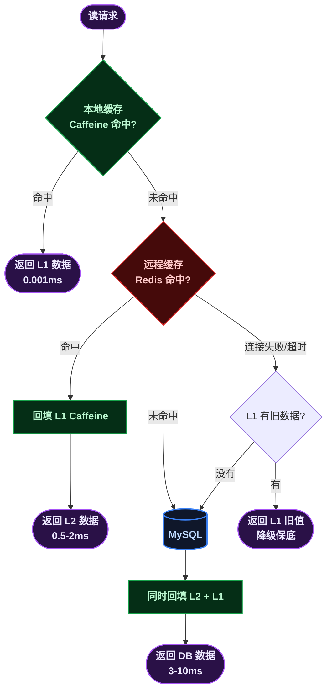
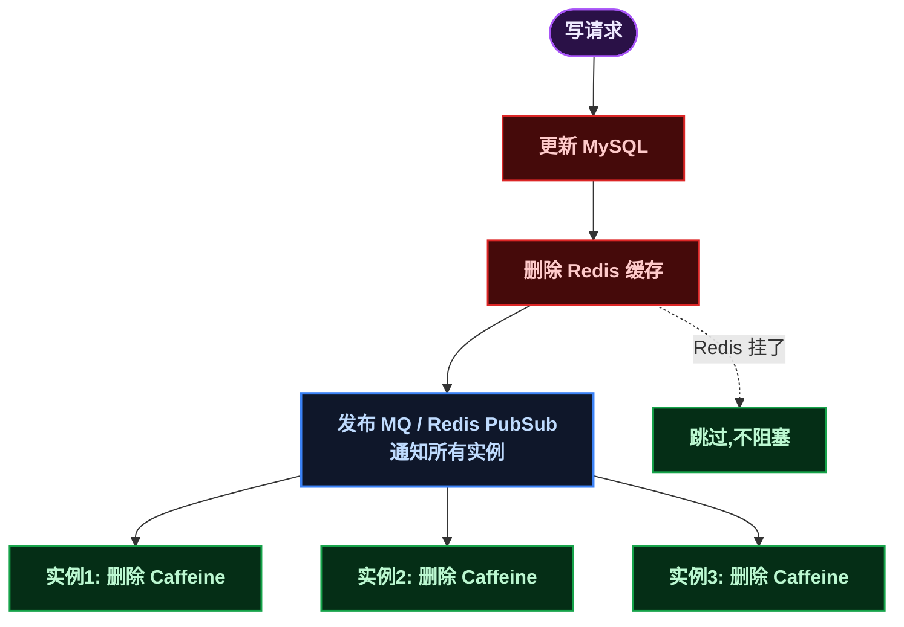

# Redis + Caffeine 双层缓存

> 📖 <strong>前置阅读</strong>：本文是缓存架构的进阶级文章，假设读者已经掌握了 Redis 的基础操作和 Caffeine 本地缓存的 API。如果还不熟悉，建议先阅读：
> - [<strong>SpringBoot Redis 全操作指南</strong>]() —— Redis 实战篇
> - [<strong>Caffeine 核心与 SpringBoot 集成</strong>]() —— Caffeine 入门篇

## 一、⚡ 问题切入：凌晨三点，Redis 挂了

凌晨三点，Redis 内存用满——大量的 TTL 同时到期 + 新一波定时任务写入，导致内存 OOM，Redis 进程被系统 kill。你的服务<strong>所有缓存请求全部报错</strong>，瞬间全部穿透到 MySQL，数据库连接池耗尽，整个系统不可用。

值班群炸了。你翻日志发现——服务启动时所有 `@Cacheable` 都配置了 Redis，Redis 一挂连个兜底的都没有。

Redis 是高可用的——有哨兵（Sentinel）、有集群（Cluster），官方说可用性能到 99.99%。但 99.99% 意味着一年有将近 1 小时的不可用时间。这 1 小时如果发生在双十一，后果就不是"维护了一次"，而是"事故"。

<strong>本地缓存的价值不只是"快"，更是 Redis 挂了时的最后一道防线</strong>。就算 Redis 是全宇宙最高可用的服务，网络也可能抖——交换机故障、机房间专线断掉、Kubernetes 网络策略变更——这些事情的发生概率比 Redis 自身故障高得多。

本篇要解决的问题：<strong>构建 Redis（远程）+ Caffeine（本地）双层缓存架构，把 Redis 的不可用当成"迟早会发生的事"来设计，而不是寄望于它不会发生</strong>。

## 📌 真实场景：数据字典——最简单的双层缓存

在进入复杂架构之前，先看一个真实项目里怎么用 Spring Cache + Caffeine + Redis 做双层缓存。<strong>不是所有场景都需要 200 行的 `TieredCacheManager`</strong>——有时候 3 行配置 + 1 个注解就够了。

### 业务是什么

后台管理系统中，每个页面都有大量的下拉选项——性别、订单状态、商品分类、部门列表、角色列表。这些选项存储在 <strong>数据字典</strong> 表里（`sys_dict` + `sys_dict_detail`），前端每次渲染表单都要查。

典型的数据字典数据：

```
dictName: "order_status" → [
    {label: "待付款", value: 1},
    {label: "已支付", value: 2},
    {label: "已取消", value: 3},
    ...
]
dictName: "product_category" → [
    {label: "电子产品", value: 1},
    ...
]
```

### 为什么要用双层缓存

<strong>字典数据有几个特点让它特别适合缓存</strong>：

| 特点 | 说明 |
|------|------|
| 读极高频 | 每次页面加载都要查——一个后台页面可能有 10+ 个下拉框，每个下拉框一次字典查询 |
| 写极低频 | 字典只在管理员手动修改时才会变——可能几周不改一次 |
| 数据量小 | 整个系统的字典数据加起来不到 500 条，完全放内存里 |
| 一致性要求低 | 字典改了以后晚 1 分钟生效完全没问题 |

用文字描述就是：<strong>查得巨频繁、几乎不改、量还小——不缓存简直对不起服务器</strong>。而且因为每个请求都会用到，用 Caffeine 本地缓存省掉了每次 Redis 的网络往返，性能提升很明显。

### 真实的实现

<strong>第一步：启用 Spring Cache + Caffeine</strong>

```java
// ApiApplication.java
@EnableCaching  // 开启 Spring Cache 注解
@SpringBootApplication(scanBasePackages = {"com.mall"})
public class ApiApplication {
    public static void main(String[] args) {
        SpringApplication.run(ApiApplication.class, args);
    }
}
```

```yaml
# application.yml
spring:
  cache:
    cache-names: dict_data              # 缓存区域名称
    type: caffeine                      # 使用 Caffeine 作为缓存实现
    caffeine:
      spec: initialCapacity=50,maximumSize=500,expireAfterWrite=60s
      #   ↑ 初始 50 条，最多 500 条，写入后 60 秒自动过期
```

注意这个配置非常保守——`maximumSize=500`、`expireAfterWrite=60s`。字典数据总条数不超过 500，所以完全放得下；60 秒 TTL 保证即使忘记手动刷新，缓存也不会长时间不一致。

<strong>第二步：自定义 Key 生成器</strong>

Spring Cache 默认的 key 生成器用方法参数拼 key，但字典查询的场景需要一个更可控的方式：

```java
// DictCacheKeyGenerator.java
public class DictCacheKeyGenerator implements KeyGenerator {
    @Override
    public Object generate(Object target, Method method, Object... params) {
        // 生成 key 格式：DictService_dictName
        return target.getClass().getSimpleName() + "_"
                + StringUtils.arrayToDelimitedString(params, "_");
    }
}
```

当调用 `queryDictDetailEntity("order_status")` 时，生成的缓存 key 就是 `DictService_order_status`。

<strong>第三步：@Cacheable 注解 + Redis 作为数据源</strong>

```java
// DictService.java
@Service
public class DictService {

    private static final String DICT_DATA_KEY = "dictData"; // Redis Hash key

    @Autowired
    private RedisUtil redisUtil;
    @Autowired
    private DictDetailMapper dictDetailMapper;

    /**
     * 从缓存中获取数据字典
     * L1: Caffeine（@Cacheable 自动管理）
     * L2: Redis Hash（dictData）
     */
    @Cacheable(value = "dict_data", keyGenerator = "dictCacheKeyGenerator")
    public List<DictDetailEntity> queryDictDetailEntity(String dictName) {
        // 这个方法只在 Caffeine 未命中时才执行
        List<DictDetailEntity> dataList = getDictDataFromRedis(dictName);
        if (CollectionUtils.isEmpty(dataList)) {
            return Collections.emptyList();
        }
        return dataList.stream()
                .sorted(Comparator.comparing(DictDetailEntity::getSort))
                .collect(Collectors.toList());
    }

    private List<DictDetailEntity> getDictDataFromRedis(String hashKey) {
        String json = (String) redisUtil.getHashValue(DICT_DATA_KEY, hashKey);
        if (!StringUtils.hasLength(json)) {
            return Collections.emptyList();
        }
        return JSONUtil.toList(json, DictDetailEntity.class);
    }

    /**
     * 从 MySQL 全量加载字典数据到 Redis Hash
     * 由管理后台的"刷新字典缓存"按钮触发
     */
    public void refreshDict() {
        // 1. 查所有字典定义
        List<DictEntity> dictEntities = dictMapper.searchAll();
        // 2. 查所有字典明细
        List<DictDetailEntity> details = dictDetailMapper.searchByDictIds(
                dictEntities.stream().map(DictEntity::getId).toList());
        // 3. 按 dictName 分组 → 序列化为 JSON
        Map<Long, List<DictDetailEntity>> detailMap = details.stream()
                .collect(Collectors.groupingBy(DictDetailEntity::getDictId));
        Map<Object, Object> dictMap = new HashMap<>();
        for (DictEntity dict : dictEntities) {
            dictMap.put(dict.getDictName(),
                    JSONUtil.toJsonStr(detailMap.getOrDefault(dict.getId(), List.of())));
        }
        // 4. 批量写入 Redis Hash
        redisUtil.putHashMap(DICT_DATA_KEY, dictMap);
    }
}
```

Controller 层的调用：

```java
// DictDetailController.java
@PostMapping("/searchDictDetail")
public List<DictDetailEntity> searchDictDetail(@RequestBody DictDetailQuery query) {
    // 通过 Service → @Cacheable(Caffeine) →(miss)→ Redis Hash
    return dictDetailService.searchDictDetailFromCache(query.getDictName());
}
```

### 这个"双层缓存"的读路径

```mermaid
flowchart TD
classDef caffeine fill:#052e16,stroke:#16a34a,stroke-width:1.5px,color:#bbf7d0,font-weight:bold;;
classDef redis fill:#450a0a,stroke:#dc2626,stroke-width:1.5px,color:#fecaca,font-weight:bold;;
classDef mysql fill:#0f172a,stroke:#3b82f6,stroke-width:2px,color:#bfdbfe,font-weight:bold;;
classDef decision fill:#2a1147,stroke:#a855f7,stroke-width:1.5px,color:#ede9fe,font-weight:bold;;

    R[Controller.searchDictDetail] --> L1{Caffeine\ndict_data::DictService_order_status\n命中?}
    L1 -- 命中 --> RET1([返回\n0.001ms])
    L1 -- 未命中 --> BEAN[执行 @Cacheable 方法体]
    BEAN --> L2{Redis Hash\ndictData[order_status]\n有数据?}
    L2 -- 有 --> SORT[排序]
    SORT --> FILL_L1[回填 L1 Caffeine\nSpring 自动处理]
    FILL_L1 --> RET2([返回\n0.5-2ms])
    L2 -- 没有 --> RET3([返回空列表])

    class L1,FILL_L1 caffeine;
    class L2 redis;
    class BEAN,SORT,RET1,RET2,RET3 decision;
```

写路径更简单——管理员在后台修改字典后点"刷新字典缓存"按钮 → 调用 `refreshDict()` → 重新从 MySQL 加载 → 覆盖 Redis Hash → <strong>Caffeine 自然过期（60 秒后）自动从 Redis 重新加载</strong>。

### 为什么不用完整的 TieredCacheManager

对比本篇后面将要展示的完整双层缓存方案（`TieredCacheManager`：自动降级、PubSub 广播、异步写回、空值标记……），这个字典缓存方案非常"简陋"。但它是<strong>有意为之的简化</strong>：

| 维度 | 字典缓存的方案 | 完整的 TieredCacheManager |
|------|------|------|
| Redis 挂了 | Caffeine 未命中 → 返回空列表（下拉框为空，页面依然可用） | 自动降级 → 跳过 Redis → 直查 DB |
| 缓存一致性 | Caffeine 60s TTL 自然过期，不接受主动失效 | PubSub/MQ 广播 → 实时删除所有实例的本地缓存 |
| 防穿透 | 不需要（字典数据没有"不存在的 key"的概念） | 缓存空值 + 布隆过滤器 |
| 防击穿 | `@Cacheable` 底层 Caffeine 的 `get(key, callback)` 天然防止 | 互斥锁 |
| 代码量 | 3 行 YAML + 1 注解 + 20 行 refreshDict | 200+ 行 TieredCacheManager |

<strong>核心洞察</strong>：字典数据"Redis 挂了返回空列表"这个行为是<strong>可接受的</strong>——下拉框暂时没数据，用户刷新一下就好，比因为 Redis 故障导致整个页面 500 强得多。不需要降级逻辑不是因为"Redis 不会挂"，而是<strong>"挂了的影响在可接受范围内"</strong>。

> ⚠️ 新手提示：做架构选型时的关键问题不是"这个方案是不是最完善的"，而是"这个方案挂了以后，后果是不是可接受的"。字典缓存 Redis 挂了 → 下拉框为空 → 用户刷一下就好——这完全可接受。换成秒杀库存，Redis 挂了可不是"刷一下就好"的问题——那就值得花 200 行代码做降级。

## 二、🧬 双层缓存架构设计

### 2.1 读写路径



核心路径：
- <strong>正常流程</strong>：Caffeine(L1) → Redis(L2) → MySQL
- <strong>Redis 未命中</strong>：查 MySQL → 同时回填 Redis 和 Caffeine
- <strong>Redis 故障</strong>：跳过 Redis → 查 Caffeine → Caffeine 有旧数据就返回旧数据 → Caffeine 没有才查 MySQL
- <strong>Redis 恢复</strong>：重新连接成功 → 恢复正常读写路径

<strong>写路径</strong>：



关键设计点：
- <strong>更新 DB 后删除 Redis 缓存</strong>（不是更新缓存）
- <strong>通过 MQ 或 Redis PubSub 通知所有实例删除本地 Caffeine 缓存</strong>
- <strong>Redis 删除失败不阻塞写请求</strong>——兜底靠 Caffeine 的 TTL 自动过期

### 2.2 核心实现：自动降级的缓存读取器

```java
@Component
@Slf4j
public class MultiLevelCacheManager {

    @Autowired
    private StringRedisTemplate redisTemplate;

    // L1：本地缓存（Caffeine）
    // 每个实例独立存储自己的热点数据
    private final Cache<String, Object> localCache = Caffeine.newBuilder()
        .maximumSize(10_000)
        .expireAfterWrite(5, TimeUnit.MINUTES)       // 本地缓存 5 分钟强制过期
        .refreshAfterWrite(30, TimeUnit.SECONDS)      // 30 秒异步刷新
        .recordStats()
        .build();

    // Redis 可用性标记
    private volatile boolean redisAvailable = true;
    // 上次检查 Redis 的时间
    private volatile long lastRedisCheckTime = 0;
    // Redis 健康检查间隔
    private static final long REDIS_CHECK_INTERVAL_MS = 5000;

    /**
     * 双层缓存读取 —— 核心方法
     *
     * @param key        缓存 key
     * @param clazz      返回类型
     * @param dbLoader   数据库加载回调
     * @param redisTtl   Redis 过期时间（秒）
     * @return 数据
     */
    @SuppressWarnings("unchecked")
    public <T> T get(String key, Class<T> clazz,
                     Supplier<T> dbLoader, long redisTtl) {

        // ═══════════════════════
        // 第 1 层：本地缓存 Caffeine
        // ═══════════════════════
        T localValue = (T) localCache.getIfPresent(key);
        if (localValue != null) {
            log.debug("L1 命中: {}", key);
            return localValue;
        }

        // ═══════════════════════
        // 第 2 层：远程缓存 Redis
        // ═══════════════════════
        if (redisAvailable) {
            try {
                String redisValue = redisTemplate.opsForValue().get(key);
                if (redisValue != null) {
                    T value = deserialize(redisValue, clazz);
                    // 回填 L1（Redis 有但 Caffeine 没有 → Caffeine 缓存满了被淘汰了）
                    localCache.put(key, value);
                    log.debug("L2 命中 → 回填 L1: {}", key);
                    return value;
                }
            } catch (Exception e) {
                // Redis 挂了——标记不可用，走降级逻辑
                log.warn("Redis 访问异常，触发降级: key={}, error={}", key, e.getMessage());
                redisAvailable = false;

                // 尝试用 L1 的旧数据（即使过期了也不管——降级模式优先保可用性）
                // 注意：Caffeine 的 getIfPresent 只返回未过期的数据
                // 如果需要"过期了也继续用"，需要用另外的 API
            }
        } else {
            // Redis 标记为不可用，定时检查是否恢复
            checkRedisRecovery();
        }

        // ═══════════════════════
        // 第 3 层：数据库 MySQL
        // ═══════════════════════
        T dbValue = dbLoader.get();
        if (dbValue != null) {
            // 回填 L1
            localCache.put(key, dbValue);

            // 尝试回填 L2（Redis 挂了就跳过，不让回填阻塞主流程）
            if (redisAvailable) {
                try {
                    redisTemplate.opsForValue().set(key, serialize(dbValue),
                        redisTtl, TimeUnit.SECONDS);
                } catch (Exception e) {
                    log.warn("L2 回填失败: key={}", key);
                    redisAvailable = false;
                }
            }
        }
        return dbValue;
    }

    // 检查 Redis 是否恢复
    private void checkRedisRecovery() {
        long now = System.currentTimeMillis();
        if (now - lastRedisCheckTime < REDIS_CHECK_INTERVAL_MS) {
            return;   // 5 秒内不重复检查
        }
        lastRedisCheckTime = now;

        try {
            String pong = redisTemplate.getConnectionFactory()
                .getConnection().ping();
            if ("PONG".equals(pong)) {
                redisAvailable = true;
                log.info("Redis 已恢复，恢复正常读写路径");
            }
        } catch (Exception ignored) {
            // 还没恢复，继续降级
        }
    }
}
```

<strong>核心设计决策</strong>：

<strong>1. Redis 故障不抛异常</strong>——catch 后标记 `redisAvailable = false`，主流程继续走。没有 Redis 只是慢一点（多查一次 MySQL），不是不能用。

<strong>2. 降级期间允许暂时不一致</strong>——Redis 挂了以后所有请求直接走 Caffeine → MySQL，不同实例的 Caffeine 缓存可能不一致（一个更新了另一个没通知到）。这是<strong>有意的取舍</strong>——发生概率极低（Redis 真的挂了），且 Caffeine 的 TTL 不超过 5 分钟，不一致窗口不超过 5 分钟。

<strong>3. 健康检查是异步的</strong>——每次请求检查一次 `ping` 是否恢复，两次检查之间至少间隔 5 秒。这样不至于用大量 ping 请求把刚恢复的 Redis 再次打挂。

## 三、🔒 缓存一致性：怎么让所有实例的本地缓存同步失效

双层缓存最大的挑战不是性能，是<strong>一致性</strong>——一个实例更新了数据，其他实例的 Caffeine 缓存还是旧的。

### 3.1 方案一：Redis PubSub 广播失效

更新数据后，通过 Redis 的发布订阅通知所有实例删除本地缓存：

```java
// === 发布方：更新用户信息 ===
@Service
public class UserService {

    @Autowired
    private StringRedisTemplate redisTemplate;

    public void updateUser(User user) {
        // 1. 更新 DB
        userMapper.updateById(user);

        // 2. 删除 Redis 缓存
        redisTemplate.delete("user:" + user.getId());

        // 3. 删除本地缓存
        localCache.invalidate("user:" + user.getId());

        // 4. 广播通知其他实例也删本地缓存
        redisTemplate.convertAndSend("cache:invalidate:user", user.getId().toString());
    }
}

// === 订阅方：接收删除通知 ===
@Component
public class CacheInvalidateListener implements MessageListener {

    @Override
    public void onMessage(Message message, byte[] pattern) {
        String key = new String(message.getBody());
        localCache.invalidate("user:" + key);
        log.debug("收到缓存失效通知: user:{}", key);
    }
}
```

```java
// 配置订阅
@Configuration
public class PubSubConfig {

    @Bean
    public RedisMessageListenerContainer container(
            RedisConnectionFactory factory,
            CacheInvalidateListener listener) {
        RedisMessageListenerContainer container = new RedisMessageListenerContainer();
        container.setConnectionFactory(factory);
        container.addMessageListener(listener,
            new ChannelTopic("cache:invalidate:user"));
        return container;
    }
}
```

<strong>优点</strong>：实时性好，开销低。Redis PubSub 就是干这个用的。
<strong>缺点</strong>：Redis 挂了以后 PubSub 也断了——此时回到"靠 Caffeine TTL 兜底"的模式。

### 3.2 方案二：MQ 广播失效（更可靠）

如果项目里已经有 RocketMQ / Kafka，用 MQ 比 Redis PubSub 更可靠：

```java
// 发布方
public void updateUser(User user) {
    userMapper.updateById(user);
    redisTemplate.delete("user:" + user.getId());
    localCache.invalidate("user:" + user.getId());

    // 发送到 MQ（持久化，可靠性比 PubSub 高）
    rocketMQTemplate.send("cache-invalidate-topic",
        MessageBuilder.withPayload(new CacheInvalidateMsg("user", user.getId())));
}

// 消费方（每个实例都是消费者）
@RocketMQMessageListener(topic = "cache-invalidate-topic", consumerGroup = "${spring.application.name}")
public class CacheInvalidateConsumer implements RocketMQListener<CacheInvalidateMsg> {
    @Override
    public void onMessage(CacheInvalidateMsg msg) {
        localCache.invalidate(msg.getType() + ":" + msg.getId());
    }
}
```

MQ 方案的优势是：<strong>消息持久化不丢；消费失败可重试；即使某个实例临时挂了，重启后还能消费积压的消息</strong>。

### 3.3 方案三：纯 TTL 兜底（最简单）

如果项目不复杂，不想引入 PubSub 或 MQ，最简单的方式是<strong>把 Caffeine 的 TTL 设短一点（比如 30 秒）</strong>——不做主动失效广播，靠过期自动刷新。

```
更新 MySQL + 删 Redis → 其他实例的 Caffeine 最慢 30 秒后自动过期刷新
```

这个方案的缺点是不一致窗口 30 秒——对于用户信息、配置项这些"改了不着急"的数据完全可以接受。对于库存这类"必须实时一致"的数据，库存本身就不该用缓存——直接查 DB 或走 Redis 原子扣减。

<strong>选型建议</strong>：

| 数据特征 | 推荐方案 | 不一致窗口 |
|---------|---------|:---:|
| 用户信息、文章、商品详情 | TTL 30s ~ 2min | 30 秒 ~ 2 分钟 |
| 配置项、白名单 | TTL 1min ~ 5min + PubSub | 0 ~ 5 分钟 |
| 验证码、Token | 不需要本地缓存，直接 Redis | — |
| 实时库存 | 不要用缓存，直接 DB / Redis 原子扣减 | — |

## 四、🛡️ 缓存三大问题的解决方案

Redis 系列第三篇提过缓存穿透、击穿、雪崩这三个经典问题。在双层缓存架构下，这些问题的解决方案可以更彻底。

### 4.1 缓存穿透：查不存在的数据 → 打穿到 DB

<strong>场景</strong>：攻击者大量查询 `user:-1`、`user:-2` 这种不存在的 key，缓存查不到，全打到 DB。

<strong>解决方案</strong>：

```java
public <T> T get(String key, Class<T> clazz, Supplier<T> dbLoader, long ttl) {
    T value = /* ... L1 / L2 查询 ... */;

    if (value != null) return value;

    // 查 DB
    T dbValue = dbLoader.get();

    if (dbValue == null) {
        // 缓存空值——防止穿透。TTL 短一点（1-2 分钟），避免占用太多空间
        String nullMarker = "NULL_MARKER";
        localCache.put(key, nullMarker);
        if (redisAvailable) {
            try {
                redisTemplate.opsForValue().set(key, nullMarker, 120, TimeUnit.SECONDS);
            } catch (Exception ignored) { }
        }
        return null;
    }

    // 正常回填...
    return dbValue;
}

// 读取时检查空值标记
private boolean isNullMarker(Object value) {
    return "NULL_MARKER".equals(value);
}
```

加上<strong>布隆过滤器</strong>可以进一步优化——在查缓存之前先判断 key 是否可能存在：

```java
// 启动时把数据库里存在的 ID 都加载到布隆过滤器
BloomFilter<String> bloomFilter = BloomFilter.create(
    Funnels.stringFunnel(StandardCharsets.UTF_8),
    1_000_000,     // 预期元素数量
    0.01           // 误判率 1%
);
// 所有存在的 user ID 加载进去
users.forEach(u -> bloomFilter.put("user:" + u.getId()));
```

但布隆过滤器的维护成本不低（新增数据要同步加进去），如果数据量不是特别大（< 百万级），<strong>缓存空值就够了</strong>。

### 4.2 缓存击穿：热点 key 过期 → 瞬间大量请求打 DB

<strong>场景</strong>：`user:1001` 是热门用户的缓存，TTL 30 分钟。过期的那一瞬间，100 个请求同时查到这个 key，全部穿透到 DB。

<strong>解决方案</strong>：Caffeine 的 `get(key, callback)` <strong>天然防止击穿</strong>——同一个 key 只有一个线程执行 callback 加载，其他线程等待同一个结果。如果用的是手动 get/put 方式，需要自己加锁：

```java
// Caffeine 的 get 自动防击穿（源码级保证）
User user = cache.get("user:1001", key -> userMapper.selectById(1001L));
// 100 个线程同时调这行，只有 1 个执行 selectById，另外 99 个等着用同一份结果

// 如果是自己 put/get，需要手动互斥
public User getUserWithMutex(Long id) {
    String key = "user:" + id;
    User user = localCache.getIfPresent(key);
    if (user != null) return user;

    // 互斥锁——防止击穿
    String lockKey = "lock:" + key;
    boolean locked = false;
    try {
        locked = redisTemplate.opsForValue()
            .setIfAbsent(lockKey, "1", 10, TimeUnit.SECONDS);
        if (locked) {
            // 拿到锁的线程：双重检查后查 DB
            user = localCache.getIfPresent(key);
            if (user != null) return user;

            user = userMapper.selectById(id);
            if (user != null) {
                localCache.put(key, user);
                redisTemplate.opsForValue().set(key, serialize(user), 1800, TimeUnit.SECONDS);
            }
            return user;
        } else {
            // 没拿到锁的线程：等一会儿再查缓存（别的线程正在加载）
            Thread.sleep(50);
            return getUserWithMutex(id);       // 递归重试
        }
    } catch (InterruptedException e) {
        Thread.currentThread().interrupt();
        return null;
    } finally {
        if (locked) redisTemplate.delete(lockKey);
    }
}
```

### 4.3 缓存雪崩：大量 key 同时过期 → DB 压力骤增

<strong>场景</strong>：所有 `user:*` 的 TTL 都是 30 分钟，同一批写入的数据同时过期。下一个请求瞬间全部穿透到 DB。

<strong>解决方案</strong>：

```java
// 方案一（推荐）：随机化过期时间
long baseTtl = 30 * 60;                        // 基础 30 分钟
long randomTtl = ThreadLocalRandom.current()
    .nextLong(baseTtl / 10);                   // ±10% 随机浮动
long ttl = baseTtl + randomTtl;                // 实际 27-33 分钟

// 方案二：refreshAfterWrite 异步刷新
// Caffeine 的 refreshAfterWrite 不会让热点 key 同时过期——
// 访问时异步刷新，永远返回一个可用的旧值
Cache<String, User> cache = Caffeine.newBuilder()
    .expireAfterWrite(30, TimeUnit.MINUTES)
    .refreshAfterWrite(25, TimeUnit.MINUTES)    // 提前 5 分钟开始异步刷新
    .build();
```

## 五、🏗️ 完整的缓存管理器实现

前面章节把每个组件都拆解了。下面是<strong>一个可以直接在生产环境使用的完整双层缓存管理器</strong>——包含了降级、一致性、防穿透/击穿/雪崩的全部代码：

```java
@Component
@Slf4j
public class TieredCacheManager {

    @Autowired
    private StringRedisTemplate redisTemplate;
    @Autowired
    private RocketMQTemplate rocketMQTemplate;

    // ═══════════════════════════════════
    // L1: Caffeine 本地缓存
    // ═══════════════════════════════════
    private final Cache<String, Object> l1Cache = Caffeine.newBuilder()
        .maximumSize(10_000)
        .expireAfterWrite(3, TimeUnit.MINUTES)
        .refreshAfterWrite(30, TimeUnit.SECONDS)
        .recordStats()
        .build();

    // ═══════════════════════════════════
    // Redis 状态
    // ═══════════════════════════════════
    private volatile boolean redisAvailable = true;
    private volatile long lastRedisCheck = 0;
    private static final long REDIS_CHECK_INTERVAL = 5000;

    /**
     * 双层读取 —— 带完整容错
     */
    @SuppressWarnings("unchecked")
    public <T> T get(String key, Class<T> clazz,
                     Supplier<T> dbLoader, long redisTtlSeconds) {

        // L1
        T val = (T) l1Cache.getIfPresent(key);
        if (val != null) {
            if (isNullMarker(val)) return null;     // 缓存的空值标记
            return val;
        }

        // L2: Redis（带降级）
        if (redisAvailable) {
            try {
                String json = redisTemplate.opsForValue().get(key);
                if (json != null) {
                    if (NULL_MARKER.equals(json))   return null;
                    T redisVal = deserialize(json, clazz);
                    l1Cache.put(key, redisVal);
                    return redisVal;
                }
            } catch (Exception e) {
                log.warn("Redis 不可用，触发降级: {}", e.getMessage());
                redisAvailable = false;
            }
        } else {
            checkRedisRecovery();
        }

        // L3: MySQL
        T dbVal = dbLoader.get();
        if (dbVal != null) {
            l1Cache.put(key, dbVal);
            writeToRedisAsync(key, dbVal, redisTtlSeconds);    // 异步写 Redis
        } else {
            // 缓存空值防穿透
            l1Cache.put(key, NULL_OBJECT);
            writeToRedisAsync(key, NULL_OBJECT, 120);          // 空值短 TTL
        }
        return dbVal;
    }

    /**
     * 写操作：更新 DB → 删 Redis → 删本地 → 通知其他实例
     */
    public void evict(String cacheType, Object id) {
        String key = cacheType + ":" + id;

        // 删本地
        l1Cache.invalidate(key);

        // 删 Redis
        if (redisAvailable) {
            try {
                redisTemplate.delete(key);
            } catch (Exception ignored) { }
        }

        // 通知其他实例（MQ 可靠投递，比 PubSub 更可靠）
        try {
            rocketMQTemplate.send("cache-invalidate-topic",
                MessageBuilder.withPayload(new CacheInvalidateMsg(cacheType, id.toString()))
                    .build());
        } catch (Exception e) {
            log.warn("缓存失效通知发送失败，靠 TTL 兜底: {}", key);
        }
    }

    /**
     * 监听其他实例的失效通知
     */
    @RocketMQMessageListener(
        topic = "cache-invalidate-topic",
        consumerGroup = "${spring.application.name:default}"
    )
    class InvalidationListener implements RocketMQListener<CacheInvalidateMsg> {
        @Override
        public void onMessage(CacheInvalidateMsg msg) {
            String key = msg.getType() + ":" + msg.getId();
            l1Cache.invalidate(key);
        }
    }

    // === 内部方法 ===

    private static final String NULL_MARKER = "__NULL__";
    private static final Object NULL_OBJECT = new Object();

    private boolean isNullMarker(Object val) {
        return NULL_OBJECT == val || NULL_MARKER.equals(val);
    }

    private void checkRedisRecovery() {
        long now = System.currentTimeMillis();
        if (now - lastRedisCheck < REDIS_CHECK_INTERVAL) return;
        lastRedisCheck = now;
        try {
            String pong = redisTemplate.getConnectionFactory()
                .getConnection().ping();
            if ("PONG".equals(pong)) {
                redisAvailable = true;
                log.info("Redis 已恢复");
            }
        } catch (Exception ignored) { }
    }

    private void writeToRedisAsync(String key, Object value, long ttl) {
        if (!redisAvailable) return;
        CompletableFuture.runAsync(() -> {
            try {
                String data = value == NULL_OBJECT ? NULL_MARKER : serialize(value);
                redisTemplate.opsForValue().set(key, data, ttl, TimeUnit.SECONDS);
            } catch (Exception e) {
                log.warn("异步写 Redis 失败: key={}", key);
                redisAvailable = false;
            }
        });
    }
}
```

<strong>使用方式</strong>：

```java
@Service
public class UserService {

    @Autowired
    private TieredCacheManager cacheManager;

    public User getUserById(Long id) {
        return cacheManager.get("user:" + id, User.class,
            () -> userMapper.selectById(id),   // DB 回调
            1800                                 // Redis TTL 30 分钟
        );
    }

    public void updateUser(User user) {
        userMapper.updateById(user);
        cacheManager.evict("user", user.getId());
    }
}
```

## 六、📊 降级策略的取舍总结

| 策略 | Redis 挂的时候 | Redis 恢复后 |
|------|--------------|------------|
| **不降级** | 所有请求报错 → 雪崩 | 正常 |
| **降级到 MySQL** | 所有请求打 DB → DB 可能扛不住 → 还是要崩 | L1/L2 冷启动，命中率从零爬升 |
| **降级到 Caffeine（本篇方案）** | 热点数据在 Caffeine 里直接返回 → DB 查 L1 没有的 → DB 压力可控 | 5s ping 检测，恢复后写回 L2，平滑过渡 |
| **Caffeine + 限制 DB 并发** | Caffeine 命中的直接返回；L1 没命中查 DB 时加信号量限流 → DB 不会被打崩 | 同上 |

<strong>核心思想</strong>：降级不是"Redis 挂了也能服务不中断"，而是<strong>"Redis 挂了时不要让故障扩散到 MySQL 导致整站崩溃"</strong>。Caffeine 作为 L1 承担住热点数据的访问，DB 承载 L1 未命中的长尾请求——加上简单的并发限流确保 DB 不会被击穿。

## 七、🎯 总结

本文从真实项目的数据字典缓存案例出发，对比了两种双层缓存方案：

1. <strong>简化方案（数据字典）</strong>：3 行 YAML + 1 个 `@Cacheable` 注解 + 自定义 `DictCacheKeyGenerator` + `refreshDict()` 全量刷新。Caffeine 60s TTL 自动过期从 Redis Hash 重新加载。Redis 挂了返回空列表——下拉框暂时不可用但页面不报错。

2. <strong>完整方案（TieredCacheManager）</strong>：200+ 行的完整双层缓存管理器。三级读取路径（Caffeine → Redis → MySQL）、Redis 自动降级 + 健康检查恢复、PubSub/MQ 广播缓存失效、防穿透/击穿/雪崩的完整防护。

3. <strong>选型关键</strong>：不是越复杂越好。判断标准是"这个缓存挂了以后，后果是不是可接受的"——字典缓存下拉框为空可接受，秒杀库存缓存挂了就不可接受。根据后果选方案，而不是根据理想架构选方案。

本文是"缓存"主题的最后一篇。把 Redis（分布式缓存）+ Caffeine（本地缓存）组合使用，是绝大多数互联网项目缓存架构的标准配置——Redis 负责跨实例共享和持久化，Caffeine 负责极致性能和最后兜底。
