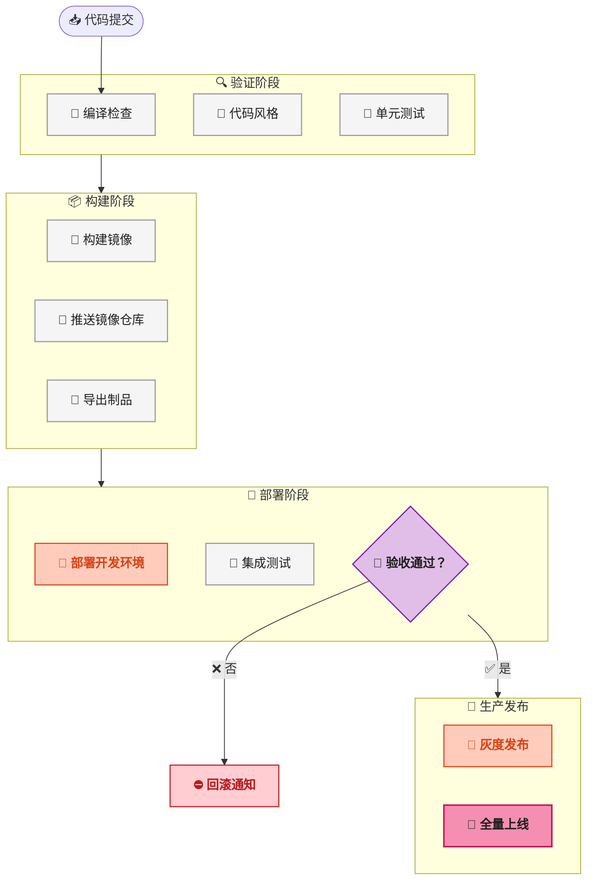
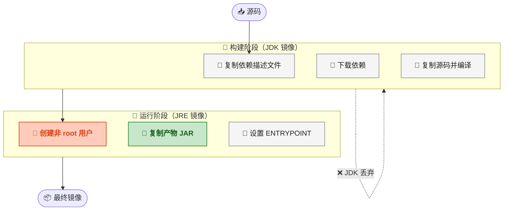
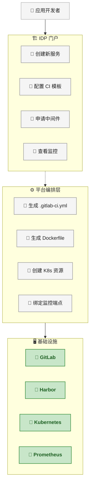
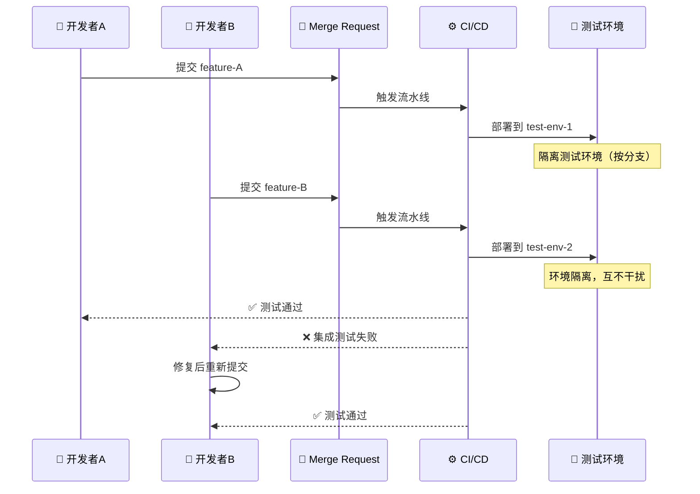

# 统一开发团队的流水线哲学：从 .gitlab-ci.yml 到 IDP 平台化治理

## 问题：为什么每个项目的流水线都长得不一样？

团队规模还小的时候，CI/CD 流水线通常是怎么来的？某个开发者把上个项目的 `.gitlab-ci.yml` 拷过来，改两行，能跑就行。再过两个月新开一个服务，又从那个改过的版本拷过去再改两行。一年下来，十个微服务有十种写法，review 流水线配置的时间比 review 业务代码还长。

这不是某个团队的个例，而是缺少 <strong>统一流水线规范</strong> 的必然结果。

造成这种混乱的根源有三层：

<strong>第一层，认知门槛。</strong>GitLab CI 的配置语法看似简单——`stages`、`jobs`、`script`、`only/except`，但真正写好需要理解 runner 的执行模型、cache 和 artifact 的区别、image 与 service 的作用域。大部分人止步于"能跑就行"，不会主动深究。

<strong>第二层，缺乏约束。</strong>GitLab CI 本身不做 schema 校验，`before_script` 里写什么都行，Dockerfile 里的 `RUN` 指令堆多少层也没人管。没有门禁、没有模板、没有 review 机制，流水线质量完全依赖开发者个人习惯。

<strong>第三层，业务压力。</strong>"先把功能上线"永远排在"把流水线写好"前面。流水线的技术债不像业务代码那样直接影响用户，于是越欠越多，直到有一天构建 40 分钟没人敢动。

> 📌 前置知识——GitLab CI 基础：建议先理解 `.gitlab-ci.yml` 的 `stages`、`jobs`、`script`、`image`、`cache`、`artifacts` 六个核心关键字（只需理解各自的职责和生效范围即可）。

## 结构：一条理想流水线的骨架

先从最核心的问题开始： <strong>一条"完美"的 `.gitlab-ci.yml` 应该长什么样？</strong>

答案不是给你一个 500 行的 YAML 文件，而是说清楚 <strong>原则</strong>。原则对了，具体写法可以按项目微调。

### 四阶段流水线



四个阶段各司其职：

| 阶段 | 目的 | 失败策略 |
|------|------|----------|
| 验证阶段 | 确认代码质量，跑编译+lint+单测 | 快速失败（fail-fast），阻止后续阶段 |
| 构建阶段 | 产出不可变制品（镜像、JAR包） | 失败时清理中间产物 |
| 部署阶段 | 部署到开发/测试环境，跑集成测试 | 自动回滚到上一个稳定版本 |
| 生产发布 | 灰度→全量，带监控和告警 | 保留至少一个可回滚版本 |

### 核心原则

<strong>原则一：一条流水线只产出一个制品。</strong>

这是最容易被违反的原则。某个开发者在 `build` 阶段的脚本里顺便打了个前端包，另一个开发者又在 `test` 阶段的 `after_script` 里推送了镜像。结果是一条流水线里藏了三个隐式的产出，依赖关系全靠注释说明。

正确的做法是显式声明 `artifacts`，按 `name` 区分：

```yaml
# ✅ 显式制品声明
backend-build:
  stage: build
  script:
    - ./gradlew build -x test
  artifacts:
    name: "backend-jar-$CI_COMMIT_SHA"
    paths:
      - build/libs/*.jar
    expire_in: 7 days
```

<strong>原则二：环境变量统一管理，不散落各处。</strong>

`.gitlab-ci.yml` 文件里不应出现硬编码的地址、端口、密钥。GitLab CI 支持三层变量：

```yaml
variables:
  # 全局默认值（优先级最低）
  APP_PORT: "8080"

backend-deploy:
  variables:
    # Job 级覆盖（优先级高）
    APP_PORT: "9090"
```

再加上 GitLab Settings → CI/CD → Variables 中配置的受保护变量（用于密钥），最终优先级从高到低是：Job 级变量 > Settings 变量 > 全局 variables。

> ⚠️ 新手提示：`variables` 在 `.gitlab-ci.yml` 中是明文存储的，即使仓库私有也不要在里面写密钥。密钥一律放在 Settings → CI/CD → Variables 并勾选 "Protect" 和 "Mask"。

<strong>原则三：缓存和制品分离。</strong>

这是新手最容易混淆的两个概念：

| | cache | artifacts |
|------|------|------|
| 用途 | 加速下次构建 | 跨阶段传递产物 |
| 典型内容 | `.gradle/`、`node_modules/` | JAR 包、dist 目录 |
| 生命周期 | 可跨流水线复用 | 仅当前流水线内有效 |
| 是否上传 | 本地压缩 | 上传到 GitLab 服务器 |

```yaml
# ✅ 正确的分离写法
backend-build:
  cache:
    key: "$CI_COMMIT_REF_SLUG"
    paths:
      - .gradle/
  artifacts:
    paths:
      - build/libs/*.jar
```

### 模板化与继承

当团队有 20 个微服务时，每个都写一遍完整流水线是不可接受的。GitLab CI 提供两个关键机制：

<strong>（1）`include` 引入公共模板</strong>

```yaml
# .gitlab-ci.yml（各项目根目录）
include:
  - project: 'devops/ci-templates'
    ref: 'v2.1.0'
    file: 'templates/java-backend.yml'
  - project: 'devops/ci-templates'
    ref: 'v2.1.0'
    file: 'templates/docker-build.yml'

variables:
  SERVICE_NAME: "order-service"
  JAVA_VERSION: "17"
```

公共模板仓库的版本通过 `ref` 锁定（推荐 tag 而非 branch），避免模板变更导致所有服务流水线同时受影响。

<strong>（2）`extends` 继承隐藏 Job</strong>

```yaml
# 公共模板中定义
.docker-build-template:
  stage: build
  image: docker:24
  services:
    - docker:24-dind
  script:
    - docker build -t $CI_REGISTRY_IMAGE:$CI_COMMIT_SHA .
    - docker push $CI_REGISTRY_IMAGE:$CI_COMMIT_SHA

# 各项目继承
docker-build:
  extends: .docker-build-template
  variables:
    DOCKER_BUILDKIT: 1
```

`extends` 支持多继承，一个 job 可以同时继承 `.docker-build-template` 和 `.security-scan-template`，合并后做一次构建+扫描。

流程到这里还差一环：构建出来的镜像到底是怎么打出来的？这就引出下一个核心话题。

## 流程：Dockerfile 的正确打开方式

如果说 `.gitlab-ci.yml` 定义了"怎么跑"，那 `Dockerfile` 就定义了"跑的是什么"。一条流水线的构建速度和质量，很大程度取决于 Dockerfile 写得怎么样。

> 📌 前置知识——Docker 镜像分层：建议理解 Docker 镜像的 overlay2 存储驱动和层缓存机制（重点看 COPY 与 ADD 指令为何会打破缓存、`docker history` 命令如何查看分层大小）。只需理解"指令改变→层失效→重建"的级联效应即可。

### 一条及格线之上的 Dockerfile

```dockerfile
# Stage 1: 构建
FROM eclipse-temurin:17-jdk-alpine AS builder
WORKDIR /app
COPY gradlew build.gradle settings.gradle ./
COPY gradle gradle/
RUN ./gradlew dependencies --no-daemon
COPY src/ src/
RUN ./gradlew build -x test --no-daemon

# Stage 2: 运行时
FROM eclipse-temurin:17-jre-alpine AS runtime
RUN addgroup -S app && adduser -S app -G app
WORKDIR /app
COPY --from=builder /app/build/libs/*.jar app.jar
USER app
EXPOSE 8080
HEALTHCHECK --interval=30s --timeout=3s --start-period=40s \
    CMD wget -qO- http://localhost:8080/actuator/health || exit 1
ENTRYPOINT ["java", "-XX:+UseContainerSupport", "-jar", "app.jar"]
```

这段 20 行不到的 Dockerfile 里藏着很多有意识的决策。逐一拆解。

### 决策拆解

<strong>（1）多阶段构建（multi-stage build）</strong>

这是最重要的一条。构建阶段用了 `eclipse-temurin:17-jdk-alpine`（JDK，约 180MB），但运行时只保留 `eclipse-temurin:17-jre-alpine`（JRE，约 80MB）。最终镜像只包含 JRE + 一个 JAR，体积从可能超过 400MB 压缩到 120MB 左右。



<strong>（2）依赖缓存利用</strong>

```dockerfile
COPY gradlew build.gradle settings.gradle ./
COPY gradle gradle/
RUN ./gradlew dependencies --no-daemon  # ← 关键：先下载依赖
COPY src/ src/                           # ← 再复制源码
RUN ./gradlew build -x test --no-daemon
```

先复制依赖描述文件（`build.gradle`、`gradle/`）再执行 `dependencies` 任务，最后才复制 `src/`。这样只有当依赖变更时才会重新下载，日常改业务代码时依赖层命中缓存，构建从 3 分钟缩短到 30 秒。

> ⚠️ 新手提示：很多人把 `COPY . .` 写在第一行，然后跑构建。这样每改一行代码，缓存全破，依赖从头下载。秘诀是 <strong>把变更频率最高的内容放在最后 COPY</strong>。

<strong>（3）非 root 运行</strong>

```dockerfile
RUN addgroup -S app && adduser -S app -G app
USER app
```

容器默认以 root 运行。如果在容器内应用存在任意文件写入或命令执行漏洞，攻击者获取的是容器内的 root 权限。加上 `USER app` 之后最小化攻击面。Java 应用监听 8080 端口不需要 root。

<strong>（4）HEALTHCHECK 和容器感知 JVM</strong>

`-XX:+UseContainerSupport` 告诉 JVM 读取 cgroup 的内存/CPU 限制而非宿主机的物理资源。没有这个参数，JVM 可能按照宿主机 64GB 内存来设置堆大小，然后在容器的 512MB 限制下被 OOMKilled。

`HEALTHCHECK` 让 Docker（或 Kubernetes）知道容器是否真的健康——进程活着不等于能处理请求。

### Dockerfile 检查清单

写成团队规范时，建议把以下几条做成 CI 门禁检查（比如用 `hadolint`）：

| # | 检查项 | 为什么 |
|---|--------|--------|
| 1 | 必须使用多阶段构建 | 减小镜像体积，分离构建依赖 |
| 2 | 基础镜像必须指定 digest 或精确 tag | `latest` tag 飘移导致不可复现的 bug |
| 3 | COPY 顺序从最不易变到最易变 | 最大化层缓存命中率 |
| 4 | 必须切换非 root 用户 | 最小权限原则 |
| 5 | 必须有 HEALTHCHECK | 容器编排平台依赖它做调度决策 |
| 6 | 层数不超过 15 层 | overlay2 下每多一层就多一次联合挂载开销 |

## IDP：把流水线变成平台能力

写到这里的 .gitlab-ci.yml 和 Dockerfile 已经比大多数项目好了。但团队再大一些——比如 50 个微服务、5 个业务线——只靠模板继承和代码 review 就不够了。这时需要引入 <strong>IDP（Internal Developer Platform，内部开发者平台）</strong> 的概念。

### IDP 是什么，不是什么

IDP 不是买一个工具装上就叫平台。它的本质是 <strong>把基础设施能力抽象成开发者可以自助使用的服务</strong>。



IDP 的核心价值不是"又一个平台"，而是 <strong>减少开发者的认知负荷</strong>。应用开发者不需要知道 `.gitlab-ci.yml` 怎么写、Dockerfile 最佳实践是什么、Kubernetes 的 Deployment 和 Service 怎么配——他们在门户里点"创建 Java 服务"，平台自动生成所有配置文件。

### 三个关键设计

<strong>（1）黄金路径（Golden Path）</strong>

平台不提供无限灵活性，而是提供有限但经过验证的"黄金路径"：

```yaml
# 开发者在 IDP 门户中选择：
#   语言：Java 17 + Spring Boot
#   部署方式：Kubernetes
#   中间件：MySQL + Redis
#
# 平台自动生成：
# - .gitlab-ci.yml（含编译→构建→部署全流程）
# - Dockerfile（多阶段构建，含 HEALTHCHECK）
# - k8s/deployment.yaml
# - k8s/service.yaml
# - application.yml（数据库连接注入）
```

黄金路径覆盖了 80% 的常见场景。剩下 20% 的特殊需求通过 `include` 自定义 job 或覆盖变量完成，而不是从头写。

<strong>（2）自服务能力</strong>

IDP 与"提工单等运维"模式的根本区别是 <strong>自服务</strong>。开发者不需要找运维申请 MySQL 实例——在 IDP 门户里点"申请中间件 → MySQL → 2C4G"，几分钟后拿到连接串。这背后是平台调用 Terraform 或 Crossplane 自动创建资源。

<strong>（3）可观测性统一注入</strong>

```yaml
# 平台自动注入的 deployment.yaml 片段
env:
  - name: OTEL_EXPORTER_OTLP_ENDPOINT
    value: "http://otel-collector.observability:4317"
  - name: JAVA_TOOL_OPTIONS
    value: "-javaagent:/app/opentelemetry-javaagent.jar"
```

每个通过 IDP 创建的服务自动接入 Prometheus 指标采集、OpenTelemetry 链路追踪、Loki 日志聚合。开发者什么都不用配，应用启动后自动在 Grafana 里出现对应的 Dashboard。

### IDP 不是银弹

`internal-developer-platform` 这个标签在 CNCF 的 Landscape 里年年增长，但需要正视几个现实问题：

<strong>起步成本高。</strong> 没有 30 人以上的团队、没有 20 个以上的微服务，IDP 的投入产出比不值得。小团队把 `.gitlab-ci.yml` 模板化和 Dockerfile 规范化做好就足够。

<strong>黄金路径有边界。</strong> 一旦业务的某些需求落在路径之外（比如要用非标准构建工具、特定版本的依赖），开发者需要绕开平台走"自定义路径"，而平台对自定义路径的可见性和管控力会显著下降。

<strong>维护投入被低估。</strong> 平台不是建完就完了。GitLab 升级、Kubernetes API 版本废弃、基础镜像 CVE 修复——每一项都需要平台团队持续跟进。把 IDP 当作一个"长期产品"而非"一次性项目"来运营。

## 微服务多人协作的五个坑

即使流水线写对了，Dockerfile 规范了，IDP 也搭建起来了，微服务下的多人协作仍然有自己的坑。这些坑不是技术问题，是 <strong>协作规范</strong> 问题。



### 坑一：共享环境互相覆盖

假设只有一个 `test` 环境，A 部署了自己的 feature 分支上去测试，5 分钟后 B 也部署了，把 A 的版本冲掉了。A 排查了半天"我的代码怎么没生效"，最后发现是 B 覆盖了部署。

<strong>解法：按分支动态创建测试环境。</strong>

```yaml
# .gitlab-ci.yml
deploy-to-test:
  stage: deploy
  script:
    - |
      NAMESPACE="test-${CI_COMMIT_REF_SLUG}"
      kubectl create namespace "$NAMESPACE" --dry-run=client -o yaml | kubectl apply -f -
      helm upgrade --install "$SERVICE_NAME" ./chart -n "$NAMESPACE" \
        --set image.tag="$CI_COMMIT_SHA"
  environment:
    name: "test/$CI_COMMIT_REF_SLUG"
    on_stop: cleanup-test-env

cleanup-test-env:
  stage: deploy
  when: manual
  script:
    - kubectl delete namespace "test-${CI_COMMIT_REF_SLUG}"
```

GitLab 的 `environment` 配合 `on_stop` 机制，MR 合并后自动清理环境，不会堆积垃圾命名空间。

> ⚠️ 新手提示：`CI_COMMIT_REF_SLUG` 会把分支名中的 `/` 转为 `-`，比如 `feature/order-v2` 变成 `feature-order-v2`，正好符合 Kubernetes 命名空间命名规范。

### 坑二：API 兼容性编译期不可见

A 改了 `order-service` 的一个 DTO 字段名，编译和单元测试全过，部署到测试环境后才把 `payment-service` 打挂——因为后者没有人更新对应的 DTO。

<strong>解法：契约测试（Contract Testing）</strong>

```yaml
# 在 CI 的验证阶段加入
contract-test:
  stage: verify
  script:
    - ./gradlew generateOpenApiDocs   # 生成 OpenAPI 契约
    - git diff --exit-code -- contracts/ # 契约有变更则失败
    - ./gradlew contractTest            # 跑 Spring Cloud Contract 或 Pact
```

核心思路是： <strong>接口定义的变更必须在 CI 阶段显式暴露，而非等到集成测试才发现</strong>。常见的工具选择：

| 工具 | 适用场景 |
|------|------|
| Spring Cloud Contract | Spring 生态，Consumer-Driven |
| Pact | 多语言，Consumer-Driven |
| OpenAPI Generator | 先定义契约再生成代码，Provider-Driven |

### 坑三：配置文件散落导致环境不一致

每个开发者本地有一套 `application-dev.yml`，测试环境有一套 `application-test.yml`，生产环境还有一套。三套配置的差异不是通过 diff 管理的，而是靠"谁最后改过谁记得"。

<strong>解法：配置中心统一管理 + 环境差异化仅保留最小集。</strong>

```yaml
# application.yml（纳入版本控制，所有环境共享）
spring:
  datasource:
    hikari:
      maximum-pool-size: 20
      minimum-idle: 5

# Nacos / Consul 中存储的环境差异化配置
# namespace: order-service-prod
spring:
  datasource:
    url: jdbc:mysql://${DB_HOST:localhost}:3306/orders
    username: ${DB_USER}
    password: ${DB_PASSWORD}
```

Git 仓库中只保留默认值和开发环境配置，生产环境的连接信息由配置中心（Nacos、Consul、Vault）按 namespace 下发。

### 坑四：数据库迁移脚本冲突

A 和 B 各自在 feature 分支创建了 `V1.0.1__add_column.sql`，合并时文件名不冲突（因为都叫 V1.0.1 的概率低），但 <strong>都修改了同一张表</strong>，先合的那个加了列，后合的那个加列语句没问题，但对应的应用逻辑可能假定表结构是"迁移前"的状态。

<strong>解法：数据库迁移纳入 CI 检查。</strong>

```yaml
db-migration-check:
  stage: verify
  script:
    - docker run --rm -v $PWD/migrations:/migrations flyway/flyway:9
        -url=jdbc:postgresql://ci-db:5432/test
        -user=test -password=test
        migrate -dryRun
```

在 MR 的 CI 流水线中执行一次 <strong>dry-run 迁移</strong>，验证迁移脚本语法是否正确、版本号是否有冲突、回滚脚本是否完备。

### 坑五：镜像 tag 策略混乱

见过这些 tag 吗：`latest`、`v1`、`20230101`、`fix-bug`、`test3`。当需要回滚时，没人知道哪个 tag 对应哪个 commit。

<strong>解法：不可变 tag 策略。</strong>

```yaml
# ✅ 好的 tag 策略
docker build -t $CI_REGISTRY_IMAGE:$CI_COMMIT_SHORT_SHA .   # 主 tag：Git SHA
docker tag $CI_REGISTRY_IMAGE:$CI_COMMIT_SHORT_SHA \
           $CI_REGISTRY_IMAGE:$(date +%Y%m%d-%H%M%S)          # 辅助 tag：时间戳
docker push $CI_REGISTRY_IMAGE:$CI_COMMIT_SHORT_SHA
docker push $CI_REGISTRY_IMAGE:$(date +%Y%m%d-%H%M%S)
```

两个 tag 指向同一个镜像：
- `$CI_COMMIT_SHORT_SHA`：精确回溯到 commit，用于回滚和审计
- `时间戳`：快速识别部署先后顺序，用于排查"从什么时候开始出问题的"

`latest` tag 在开发/测试环境可以用（方便本地拉最新），但在生产环境的 Deployment 中 <strong>必须用不可变 tag</strong>。

## 总结

回头看，从最开始的"流水线各写各的"，到模板化、再到 IDP 平台化，本质上在做同一件事： <strong>把重复的工程决策固化为规范，让开发者把精力花在业务上</strong>。

一条理想的 `.gitlab-ci.yml` 不是写得最炫的那个，而是 <strong>组里每个人都能看懂、都能改、改了不出事</strong> 的那个。一个好的 Dockerfile 不是指令最多的那个，而是 <strong>层数最少、体积最小、安全基线最高</strong> 的那个。

IDP 不是什么神秘的高大上概念——它就是"把上面这些规范自动化掉"。从手工拷贝 → 模板继承 → 平台自动生成，每一步减少一点认知负荷，积累起来就是整个团队交付效率的提升。

再往下走，如果想继续深入工程实践方向，建议关注：
- <strong>Backstage</strong>（Spotify 开源的 IDP 框架）：理解 IDP 门户的插件化架构
- <strong>Dagger</strong>（可编程 CI/CD SDK）：用代码而非 YAML 定义流水线的另一种思路
- <strong>OpenTelemetry</strong>：统一可观测性标准的实现细节
