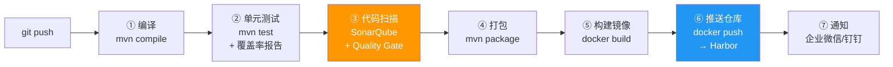

# GitLab CI/CD 流水线实战——编译、扫描、构建镜像、推送仓库

> 📖 <strong>前置阅读</strong>：本文假设读者已搭建 GitLab + Runner 并理解 `.gitlab-ci.yml` 基础语法（stages/jobs/artifacts/cache/rules）。如果还不熟悉，建议先阅读 [<strong>GitLab CI/CD 搭建与 Pipeline 语法精讲</strong>]()。

## 一、⚡ 编译过了——但你敢直接部署吗？代码质量谁保证？

上一篇文章的 Pipeline 只做了编译和测试——但真正的 CI/CD 不止这些：

```
真正的 CI/CD 流水线要回答 5 个问题：
  ① 编译成功了吗？ → mvn compile
  ② 测试通过了吗？ → mvn test + 覆盖率报告
  ③ 代码质量合格吗？ → SonarQube 扫描 + Quality Gate
  ④ 镜像构建成功了吗？ → docker build
  ⑤ 镜像推送到仓库了吗？ → docker push → Harbor

这 5 步全自动——缺一步都不能算 CI/CD
```

<strong>这篇的目标——搭一条完整的流水线：代码 push → 自动跑完上述 5 步——任何一个环节失败——Pipeline 变红——阻止部署。</strong>

## 二、🏗️ 完整的 Pipeline 架构



## 三、🔧 基础设施——SonarQube + Harbor 搭建

### 3.1 Docker Compose——加 SonarQube 和 Harbor

```yaml
# 在上一篇文章的 docker-compose.yml 基础上加两个服务
version: '3.8'
services:

  # ===== GitLab + Runner（同上一篇——省略）=====
  # ...

  # ===== SonarQube——代码质量扫描 =====
  sonarqube:
    image: sonarqube:10.3.0-community
    container_name: sonarqube
    environment:
      SONAR_JDBC_URL: jdbc:postgresql://sonarqube-db:5432/sonarqube
      SONAR_JDBC_USERNAME: sonar
      SONAR_JDBC_PASSWORD: sonar123
    ports:
      - "9000:9000"
    volumes:
      - sonarqube-data:/opt/sonarqube/data
      - sonarqube-extensions:/opt/sonarqube/extensions
    depends_on:
      - sonarqube-db

  sonarqube-db:
    image: postgres:15-alpine
    container_name: sonarqube-db
    environment:
      POSTGRES_USER: sonar
      POSTGRES_PASSWORD: sonar123
      POSTGRES_DB: sonarqube
    volumes:
      - sonarqube-db-data:/var/lib/postgresql/data

  # ===== Harbor——私有 Docker 镜像仓库 =====
  # Harbor 官方推荐用 docker-compose 独立部署——这里简化
  # 生产环境参考 https://goharbor.io/docs
  harbor:
    image: goharbor/registry-photon:v2.9.0
    container_name: harbor-registry
    ports:
      - "5000:5000"
    volumes:
      - harbor-data:/var/lib/registry

volumes:
  sonarqube-data:
  sonarqube-extensions:
  sonarqube-db-data:
  harbor-data:
```

### 3.2 SonarQube 初始化——创建项目 Token

```
① 浏览器打开 http://gitlab.local:9000
② 默认登录：admin / admin——首次强制修改密码
③ Administration → Projects → Create Project
   → Project key: order-service
   → Project name: order-service
   → 创建

④ 创建 Token：My Account → Security → Generate Token
   → Token name: gitlab-ci
   → 复制 Token——后续要放在 GitLab CI/CD 变量中

⑤ 在 GitLab 中配置 SonarQube 变量：
   GitLab → 项目 → Settings → CI/CD → Variables
   添加：
   SONAR_HOST_URL = http://sonarqube:9000
   SONAR_TOKEN = squ_xxxxxxxxxxxxxxxxxxxxxxxxxx  ← 刚才复制的 Token
```

### 3.3 Maven 项目的 SonarQube 配置

```xml
<!-- pom.xml——加 JaCoCo 覆盖率插件 + SonarQube 插件 -->
<build>
    <plugins>
        <!-- JaCoCo——代码覆盖率 -->
        <plugin>
            <groupId>org.jacoco</groupId>
            <artifactId>jacoco-maven-plugin</artifactId>
            <version>0.8.11</version>
            <executions>
                <execution>
                    <goals>
                        <goal>prepare-agent</goal>
                    </goals>
                </execution>
                <execution>
                    <id>report</id>
                    <phase>test</phase>
                    <goals>
                        <goal>report</goal>
                    </goals>
                </execution>
            </executions>
        </plugin>
    </plugins>
</build>

<properties>
    <!-- SonarQube 配置 -->
    <sonar.host.url>${env.SONAR_HOST_URL}</sonar.host.url>
    <sonar.login>${env.SONAR_TOKEN}</sonar.login>
    <sonar.projectKey>order-service</sonar.projectKey>
    <sonar.projectName>order-service</sonar.projectName>
    <sonar.java.binaries>target/classes</sonar.java.binaries>
    <sonar.coverage.jacoco.xmlReportPaths>target/site/jacoco/jacoco.xml</sonar.coverage.jacoco.xmlReportPaths>
</properties>
```

## 四、📝 完整的 .gitlab-ci.yml——从编译到推送镜像

### 4.1 完整 Pipeline 定义

```yaml
# order-service/.gitlab-ci.yml
# 完整的 CI/CD Pipeline——5 个阶段

stages:
  - compile          # ① 编译
  - test             # ② 测试 + 覆盖率
  - quality          # ③ SonarQube 扫描
  - package          # ④ 打包 + 构建镜像
  - push             # ⑤ 推送镜像到 Harbor

# ===== 全局变量 =====
variables:
  MAVEN_OPTS: "-Dmaven.repo.local=$CI_PROJECT_DIR/.m2/repository"
  MAVEN_CLI_OPTS: "-B -Dorg.slf4j.simpleLogger.log.org.apache.maven.cli.transfer.Slf4jMavenTransferListener=WARN"
  # Harbor 地址——在 GitLab CI/CD Variables 中配置
  HARBOR_URL: "harbor.local:5000"
  IMAGE_NAME: "$HARBOR_URL/order-service"

# ===== 全局缓存——Maven 依赖 =====
cache:
  key: maven-${CI_COMMIT_REF_SLUG}
  paths:
    - .m2/repository/
  policy: pull-push

# ===== Stage 1: 编译 =====
compile:
  stage: compile
  image: maven:3.9-eclipse-temurin-17
  script:
    - mvn $MAVEN_CLI_OPTS compile
  artifacts:
    paths:
      - target/classes/
    expire_in: 1 hour
  tags:
    - docker

# ===== Stage 2: 单元测试 + 覆盖率 =====
unit-test:
  stage: test
  image: maven:3.9-eclipse-temurin-17
  script:
    - mvn $MAVEN_CLI_OPTS test jacoco:report
  artifacts:
    when: always
    paths:
      - target/surefire-reports/
      - target/site/jacoco/           # ← JaCoCo 报告——给 SonarQube 用
    expire_in: 7 days
    reports:
      junit: target/surefire-reports/TEST-*.xml   # ← GitLab 自动展示测试结果
  coverage: '/Total.*?([0-9]{1,3})%/'            # ← GitLab 自动展示覆盖率百分比
  tags:
    - docker

# ===== Stage 3: SonarQube 代码扫描 =====
sonarqube-check:
  stage: quality
  image: maven:3.9-eclipse-temurin-17
  script:
    - mvn $MAVEN_CLI_OPTS sonar:sonar
        -Dsonar.host.url=$SONAR_HOST_URL
        -Dsonar.login=$SONAR_TOKEN
  # 只在 MR 或 main 分支扫描——feature 分支不扫（浪费 SonarQube 资源）
  rules:
    - if: $CI_PIPELINE_SOURCE == "merge_request_event"
    - if: $CI_COMMIT_BRANCH == "main"
  tags:
    - docker

# ===== Stage 4: 打包 =====
package:
  stage: package
  image: maven:3.9-eclipse-temurin-17
  script:
    - mvn $MAVEN_CLI_OPTS package -DskipTests
  artifacts:
    paths:
      - target/*.jar
    expire_in: 1 hour
  tags:
    - docker

# ===== Stage 5: 构建 Docker 镜像并推送到 Harbor =====
docker-build-push:
  stage: push
  image: docker:24-dind              # ← Docker-in-Docker 镜像——在容器内跑 Docker
  services:
    - docker:24-dind                 # ← 启动 Docker daemon sidecar
  before_script:
    - apk add --no-cache bash       # Alpine 需要 bash
    # 等待 Docker daemon 启动
    - until docker info > /dev/null 2>&1; do sleep 1; done
  script:
    # ① 构建镜像——用 commit SHA 作为 tag
    - docker build -t $IMAGE_NAME:$CI_COMMIT_SHORT_SHA .

    # ② 打标签——如果 main 分支——打 latest；如果有 tag——打 release 版本
    - |
      if [ "$CI_COMMIT_BRANCH" = "main" ]; then
        docker tag $IMAGE_NAME:$CI_COMMIT_SHORT_SHA $IMAGE_NAME:latest
      fi
    - |
      if [ -n "$CI_COMMIT_TAG" ]; then
        docker tag $IMAGE_NAME:$CI_COMMIT_SHORT_SHA $IMAGE_NAME:$CI_COMMIT_TAG
      fi

    # ③ 登录 Harbor——用户名密码配在 GitLab CI/CD Variables 中
    - echo "$HARBOR_PASSWORD" | docker login $HARBOR_URL -u "$HARBOR_USERNAME" --password-stdin

    # ④ 推送所有标签
    - docker push $IMAGE_NAME:$CI_COMMIT_SHORT_SHA
    - |
      if [ "$CI_COMMIT_BRANCH" = "main" ]; then
        docker push $IMAGE_NAME:latest
      fi
    - |
      if [ -n "$CI_COMMIT_TAG" ]; then
        docker push $IMAGE_NAME:$CI_COMMIT_TAG
      fi
  tags:
    - docker
```

### 4.2 Dockerfile——配合 CI/CD 的镜像构建

```dockerfile
# order-service/Dockerfile
# 多阶段构建——分离构建和运行——最终镜像只含 JRE

# ===== Stage 1: 构建——用 Maven 编译 =====
FROM maven:3.9-eclipse-temurin-17 AS builder
WORKDIR /build
COPY pom.xml .
# 先下载依赖——利用 Docker 缓存层——pom.xml 不变就不重新下载
RUN mvn dependency:go-offline -B
COPY src ./src
RUN mvn package -DskipTests -B

# ===== Stage 2: 运行——只含 JRE——镜像小 =====
FROM eclipse-temurin:17-jre-alpine
WORKDIR /app

# 创建非 root 用户——安全最佳实践
RUN addgroup -S appgroup && adduser -S appuser -G appgroup

# 从构建阶段复制 jar
COPY --from=builder /build/target/*.jar app.jar

# 切换到非 root 用户
USER appuser

# Health check——K8s 会调用这个
HEALTHCHECK --interval=30s --timeout=5s --retries=3 \
    CMD wget -qO- http://localhost:8081/actuator/health || exit 1

EXPOSE 8081
ENTRYPOINT ["java", "-jar", "app.jar"]
```

> ⚠️ 新手提示：上面的 Dockerfile 是"CI 内编译"的方式——jar 包在 CI Pipeline 中由 Maven 打好——Dockerfile 只需要 COPY jar。还有一种方式是"Dockerfile 内编译"——CI 不编译——Dockerfile 用多阶段构建完成编译。两种方式的区别：
> - CI 内编译：CI 中有 jar 包 artifact——可以复用（测试报告、SonarQube 扫描都基于同一份 jar）
> - Dockerfile 内编译：Docker 缓存加速了本地构建——但 CI 中没有 jar 包 artifact

## 五、🧩 关键实战——四个核心问题

### 5.1 Docker-in-Docker——Runner 容器内怎么构建镜像

```
问题：Runner 本身是 Docker 容器——在 Runner 容器内执行 docker build 怎么做到？
解法：Docker-in-Docker (DinD)——Runner 容器内启动一个 Docker daemon 作为 sidecar

工作原理：
  Runner 容器（docker:24-dind 镜像）
  ├── docker CLI（client）—— script 中的 docker build 命令
  └── docker daemon（server）—— 通过 services: docker:24-dind 启动
       └── 在这个 daemon 中构建镜像——推送镜像

关键：Runner 需要挂载 /var/run/docker.sock
  volumes:
    - /var/run/docker.sock:/var/run/docker.sock
  → 或者用 TLS 方式（services: docker:24-dind 默认 TLS）——更安全
```

```yaml
# Docker-in-Docker 的完整配置
docker-build-push:
  stage: push
  image: docker:24-dind
  services:
    - docker:24-dind
  variables:
    # 告诉 Docker CLI 用 TLS 连接 daemon
    DOCKER_TLS_CERTDIR: "/certs"
    DOCKER_HOST: "tcp://docker:2376"
    DOCKER_CERT_PATH: "/certs/client"
    DOCKER_TLS_VERIFY: "1"
  before_script:
    # 不是所有 docker 版本都需要——加上保险
    - until docker info > /dev/null 2>&1; do echo "等待 Docker daemon..."; sleep 1; done
  script:
    - docker build -t $IMAGE_NAME:$CI_COMMIT_SHORT_SHA .
    - docker push $IMAGE_NAME:$CI_COMMIT_SHORT_SHA
```

### 5.2 SonarQube Quality Gate——代码不合格阻止 Pipeline

```yaml
# SonarQube 默认只上报扫描结果——不阻止 Pipeline
# 需要加一个 Quality Gate 检查 job——查询 SonarQube 结果——不合格就失败

sonarqube-check:
  stage: quality
  image: maven:3.9-eclipse-temurin-17
  script:
    - mvn sonar:sonar -Dsonar.host.url=$SONAR_HOST_URL -Dsonar.login=$SONAR_TOKEN
  tags:
    - docker

# 加一个独立的 job——查询 Quality Gate 状态
quality-gate-check:
  stage: quality
  image: alpine/curl:latest
  needs:
    - sonarqube-check    # 等 SonarQube 扫描完成
  script:
    # 轮询 SonarQube API——等到分析完成
    - |
      echo "等待 SonarQube 分析完成..."
      for i in $(seq 1 30); do
        STATUS=$(curl -s -u $SONAR_TOKEN: \
          "$SONAR_HOST_URL/api/qualitygates/project_status?projectKey=order-service" \
          | grep -o '"status":"[^"]*"' | cut -d'"' -f4)
        if [ "$STATUS" = "OK" ]; then
          echo "✅ Quality Gate 通过！"
          exit 0
        elif [ "$STATUS" = "ERROR" ]; then
          echo "❌ Quality Gate 失败！代码质量不合格！"
          exit 1
        fi
        echo "分析中... ($i/30)"
        sleep 5
      done
      echo "⏰ 超时——SonarQube 分析未在 150 秒内完成"
      exit 1
  tags:
    - docker
```

### 5.3 Maven 多模块项目——只构建变更的模块

```yaml
# 微服务项目通常是多模块的——但每个服务有独立的仓库
# 如果确实有一个仓库包含多个模块（multi-module）：

# 全量构建——所有模块都编译——简单但慢
compile-all:
  stage: compile
  image: maven:3.9-eclipse-temurin-17
  script:
    - mvn compile -pl order-service,user-service,product-service  # 指定模块
  tags:
    - docker

# 增量构建——只构建变更的模块——快但需要额外逻辑
compile-changed:
  stage: compile
  image: maven:3.9-eclipse-temurin-17
  script:
    # GitLab 预定义变量 CI_COMMIT_BEFORE_SHA = push 之前的 commit
    # 比较变更——找出哪些模块变了
    - |
      CHANGED=$(git diff --name-only $CI_COMMIT_BEFORE_SHA $CI_COMMIT_SHA)

      MODULES=""
      if echo "$CHANGED" | grep -q "order-service/"; then
        MODULES="$MODULES,order-service"
      fi
      if echo "$CHANGED" | grep -q "user-service/"; then
        MODULES="$MODULES,user-service"
      fi
      if echo "$CHANGED" | grep -q "product-service/"; then
        MODULES="$MODULES,product-service"
      fi

      if [ -z "$MODULES" ]; then
        echo "没有模块变更——跳过编译"
      else
        MODULES=${MODULES#,}  # 去掉开头的逗号
        echo "变更的模块: $MODULES"
        mvn compile -pl $MODULES -am   # -am = also make——连依赖也编译
      fi
  tags:
    - docker
```

> ⚠️ 新手提示：微服务的最佳实践是<strong>每个服务一个 Git 仓库</strong>——一个服务的 Pipeline 只编译一个服务——不需要处理多模块问题。如果你在用单体仓库（monorepo）——用 GitLab 的 `trigger` 关键字——把每个服务的 Pipeline 拆分到子文件中：
> ```yaml
> order-service:
>   stage: build
>   trigger:
>     include: order-service/.gitlab-ci.yml
> ```

### 5.4 通知——Pipeline 完成时发消息到企业微信/钉钉

```yaml
# 成功/失败都发通知——不通知等于没做 CI/CD
notify-success:
  stage: .post          # ← .post 是内置的特殊 stage——在所有 stage 之后执行
  image: alpine/curl:latest
  script:
    - |
      curl -X POST "https://qyapi.weixin.qq.com/cgi-bin/webhook/send?key=$WECHAT_WEBHOOK_KEY" \
        -H "Content-Type: application/json" \
        -d "{
          \"msgtype\": \"markdown\",
          \"markdown\": {
            \"content\": \"✅ <strong>Pipeline 成功</strong>\n
            > 项目: $CI_PROJECT_NAME\n
            > 分支: $CI_COMMIT_BRANCH\n
            > Commit: $CI_COMMIT_SHORT_SHA - $CI_COMMIT_MESSAGE\n
            > [查看 Pipeline]($CI_PIPELINE_URL)\"
          }
        }"
  when: on_success       # 只在成功时发

notify-failure:
  stage: .post
  image: alpine/curl:latest
  script:
    - |
      curl -X POST "https://qyapi.weixin.qq.com/cgi-bin/webhook/send?key=$WECHAT_WEBHOOK_KEY" \
        -H "Content-Type: application/json" \
        -d "{
          \"msgtype\": \"markdown\",
          \"markdown\": {
            \"content\": \"❌ <strong>Pipeline 失败</strong>\n
            > 项目: $CI_PROJECT_NAME\n
            > 分支: $CI_COMMIT_BRANCH\n
            > Commit: $CI_COMMIT_SHORT_SHA - $CI_COMMIT_MESSAGE\n
            > 失败 Job: $CI_JOB_NAME\n
            > [查看 Pipeline]($CI_PIPELINE_URL)\"
          }
        }"
  when: on_failure       # 只在失败时发

# $WECHAT_WEBHOOK_KEY 配置在 GitLab CI/CD Variables 中——不在 yml 中暴露
```

## 六、⚡ 踩坑——花了我一个通宵的三个问题

### 坑 1：Runner 内存不足——Maven 编译 OOM

```
现象：compile job 跑到一半——直接 killed——没有任何 Java 堆栈

原因：Runner 容器默认内存很小——Maven 编译需要较多内存——OOM Killer 杀掉了

修复：
  ① 给 Runner 容器加内存限制：
     docker-compose.yml:
     gitlab-runner:
       mem_limit: 2g       # ← Runner 至少 2GB

  ② 限制 Maven JVM：
     .gitlab-ci.yml:
     variables:
       MAVEN_OPTS: "-Xmx1024m -Xms512m"   # ← 限制 Maven JVM 堆大小
```

### 坑 2：Docker build 每次都重新下载所有 jar

```
现象：docker build 慢——每次都看到 "Downloading from central..."

原因：Dockerfile 中 COPY . . 在 RUN mvn package 之前——src 变了——Docker 缓存失效——重新下载依赖

修复——利用 Docker 缓存分层：
  # ❌ 原来的写法
  COPY . .
  RUN mvn package       # ← COPY . 把 pom.xml 和 src 一起复制——src 改了——这层缓存失效

  # ✅ 优化后的写法
  COPY pom.xml .
  RUN mvn dependency:go-offline -B   # ← 先只复制 pom.xml——下载依赖——缓存这层
  COPY src ./src                     # ← 再复制 src——src 改了不影响上一层的缓存
  RUN mvn package -B                 # ← 重新编译——只编译——不重新下载依赖
```

### 坑 3：SonarQube 分析慢——每次全量扫描

```
现象：SonarQube 每次扫描都要 5 分钟——500 个 Java 文件全部扫

修复：SonarQube 支持增量分析——只扫变更的文件
  sonarqube-check:
    script:
      # 只分析本次 MR 变更的文件
      - |
        CHANGED_FILES=$(git diff --name-only $CI_MERGE_REQUEST_TARGET_BRANCH_SHA...$CI_MERGE_REQUEST_SOURCE_BRANCH_SHA | grep '\.java$' | tr '\n' ',')
        if [ -n "$CHANGED_FILES" ]; then
          mvn sonar:sonar \
            -Dsonar.inclusions=$CHANGED_FILES \
            -Dsonar.scm.disabled=false
        else
          echo "没有 Java 文件变更——跳过分析"
        fi
    rules:
      - if: $CI_PIPELINE_SOURCE == "merge_request_event"
```

## 🎯 总结

1. <strong>完整 CI/CD = 编译 + 测试 + 扫描 + 打包 + 镜像 + 推送——环环相扣</strong>：任何一个环节失败——Pipeline 变红——阻止部署。SonarQube Quality Gate 是代码质量的最后防线——不合格就不让构建镜像。

2. <strong>Docker-in-Docker 是 Runner 构建镜像的关键</strong>：Runner 容器内用 `services: docker:24-dind` 启动 Docker daemon sidecar——TLS 连接——在容器内完成 docker build + docker push。

3. <strong>GitLab CI/CD Variables 管理所有敏感信息</strong>：SonarQube Token、Harbor 密码、Webhook Key——全部放在 GitLab CI/CD Variables 中——yml 中只用 `$VARIABLE_NAME` 引用——不在代码中暴露。

4. <strong>Pipeline 优化三板斧——cache 缓存依赖、Dockerfile 分层缓存依赖、增量分析</strong>：cache 缓存 `.m2/repository`——Dockerfile 先 COPY pom.xml 再 RUN dependency:go-offline——SonarQube MR 只扫变更文件。编译 30 秒 vs 5 分钟——区别就在这三招。

> 📖 <strong>下一步阅读</strong>：镜像已经推到 Harbor 了——怎么部署到 dev/staging/prod？多环境怎么管理？K8s 部署怎么集成？版本回滚怎么做？继续阅读 [<strong>多环境部署与生产实践</strong>]()。
