# AQS 深度解析

## 🤔 道格·李为什么需要一个抽象的队列同步器框架

在 JSR 166 之前，Java 世界里只有一种等待机制：`synchronized` + `wait/notify`。想实现一个锁，思路无非是用 `synchronized` 包住一个布尔标志位，`wait()` 等、`notify()` 醒。

道格·李（Doug Lea）在设计 JUC 时面临的问题是：**每个同步组件都要从零手写一套等待队列吗？**

ReentrantLock 需要等待队列、Semaphore 需要等待队列、CountDownLatch 需要等待队列、ReentrantReadWriteLock 需要等待队列……如果每个组件都自己维护一套 CLH 链表、自己处理 `park/unpark`、自己实现取消和超时逻辑，JUC 将变成一坨互相复制粘贴、难以维护的代码。

更重要的是，`wait/notify` 有三个固有限制：无法区分公平/非公平（`notify()` 随机唤醒）、无法在等待期间响应中断后干净取消排队、无法支持共享模式（一次允许多个线程同时获取）。

道格·李的做法是 **提取共性，抽象成框架**。他把所有同步器的等待队列、状态管理、获取/释放模板方法抽成一个类——**AQS**（AbstractQueuedSynchronizer，抽象队列同步器）。

AQS 的核心契约只有一条：子类只需实现 `tryAcquire` / `tryRelease`（独占）或 `tryAcquireShared` / `tryReleaseShared`（共享），控制 state 字段的语义；AQS 替你搞定入队、阻塞、唤醒、取消、超时。ReentrantLock、Semaphore、CountDownLatch、ReentrantReadWriteLock 等所有 JUC 同步组件，内部都有一个继承自 AQS 的 `Sync` 内部类——这就是框架复用的力量。

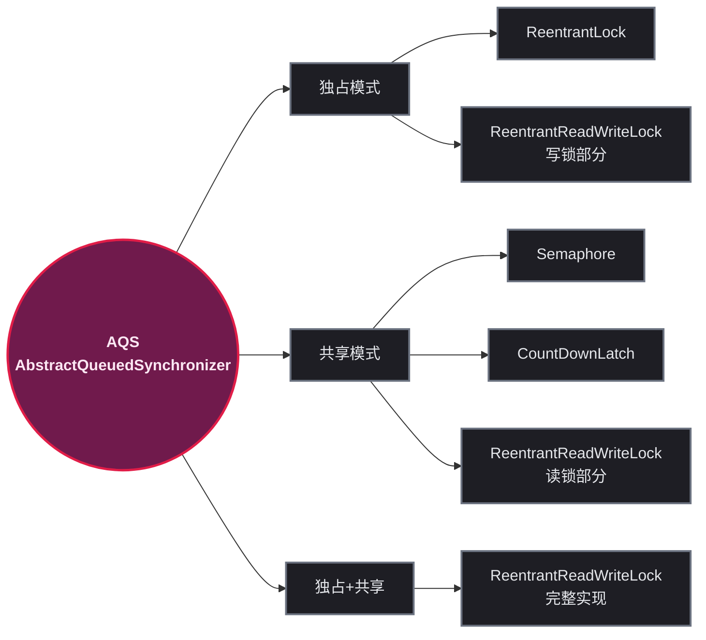

## 🧱 Node 数据结构：队列的构建单元

### 📋 Node 的关键字段

AQS 的 CLH 队列由 `Node` 对象链接而成。每个等待线程被包装为一个 Node：

```java
// AbstractQueuedSynchronizer.java（关键字段）
static final class Node {
    volatile int waitStatus;    // ① 节点状态（核心）
    volatile Node prev;         // ② 前驱节点指针
    volatile Node next;         // ③ 后继节点指针
    volatile Thread thread;     // ④ 被包装的线程
    Node nextWaiter;            // ⑤ 条件队列中的下一个节点 / 共享模式标记
}
```

| 字段 | 类型 | 作用 |
|------|------|------|
| `waitStatus` | `volatile int` | 节点状态，决定 AQS 如何处理该节点（唤醒、取消、传播等） |
| `prev` | `volatile Node` | 前驱指针，用于在同步队列中向前追溯、检查前驱状态 |
| `next` | `volatile Node` | 后继指针，用于唤醒后继节点。`prev` 和 `next` 构成双向链表 |
| `thread` | `volatile Thread` | 被该节点包装的等待线程 |
| `nextWaiter` | `Node` | 双用途：在条件队列中指下一个等待节点；在同步队列中，若值为 `SHARED` 常量表示共享模式 |

### 🔢 waitStatus 的 5 种状态

`waitStatus` 是 AQS 调度逻辑的核心依据：

```java
static final int CANCELLED =  1;  // 节点被取消（超时或中断）
static final int SIGNAL    = -1;  // 后继节点需要被唤醒
static final int CONDITION = -2;  // 节点在条件队列中
static final int PROPAGATE = -3;  // 共享模式下，唤醒需要向后传播
// 初始值 = 0（新节点入队时的默认值）
```

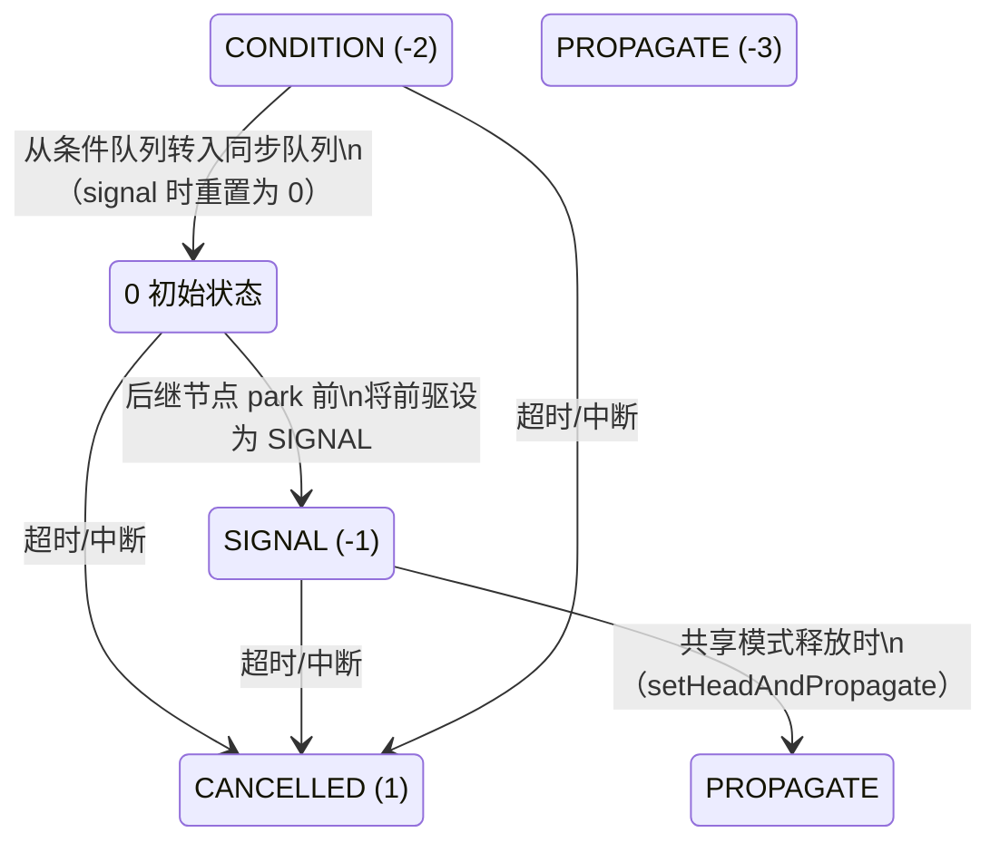

| 状态 | 值 | 含义 | 触发时机 |
|------|---|------|---------|
| **初始** | 0 | 节点刚入队，后继尚未 park | `addWaiter()` 创建新节点时 |
| **SIGNAL** | -1 | 后继节点已 park，释放时需唤醒后继 | 后继节点 `park()` 前，将前驱 `waitStatus` CAS 为 SIGNAL |
| **CANCELLED** | 1 | 节点被取消，将从队列中移除 | `acquire()` 超时或被中断，或条件等待超时 |
| **CONDITION** | -2 | 节点在条件队列中（不在同步队列） | `Condition.await()` 时创建节点，`waitStatus` 初始为 CONDITION |
| **PROPAGATE** | -3 | 共享模式下，唤醒需要向后传播 | `doReleaseShared()` 中 head 被设为 PROPAGATE，确保唤醒传导到后续节点 |

## 🔗 CLH 同步队列：双向链表的入队与出队

### 🏗️ 队列结构

每个 Node 内部装着 5 个关键字段，head/tail 是 AQS 的两个指针——`head` 指向哨兵节点（已获取锁），`tail` 指向队尾：

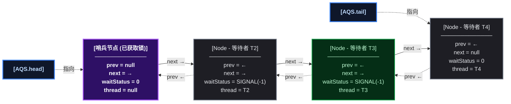

`head` 指向的节点是 **哨兵节点** （dummy node），它的 `thread` 字段为 `null`，代表已经获取到锁的线程。真正等待的线程从 `head.next` 开始排列。

### ⬅️ 入队操作：addWaiter + enq（高并发关键路径）

入队是竞争最激烈的操作——多个线程可能同时尝试插入队尾：

```java
private Node addWaiter(Node mode) {
    Node node = new Node(mode);          // ① 创建当前线程的节点
    for (;;) {                           // ② CAS 自旋
        Node oldTail = tail;
        if (oldTail != null) {           // ③ 队列已初始化
            node.setPrevRelaxed(oldTail); // ④ 先设置 prev 指针
            if (compareAndSetTail(oldTail, node)) {  // ⑤ CAS 抢 tail
                oldTail.next = node;     // ⑥ 成功后补 next 指针
                return node;
            }
        } else {
            initializeSyncQueue();       // ⑦ 队列未初始化，先初始化
        }
    }
}
```

**关键执行顺序** ：

1. 创建新节点
2. 设置 `node.prev = oldTail`（先链 prev）
3. CAS 将 `tail` 从 `oldTail` 更新为 `node`
4. CAS 成功后，设置 `oldTail.next = node`（再链 next）

这个 **"先链 prev，CAS 抢 tail，后补 next"** 的顺序是 AQS 设计的核心。它保证了即使 `next` 尚未设置，从 `tail` 出发沿 `prev` 向前遍历始终能找到所有节点。

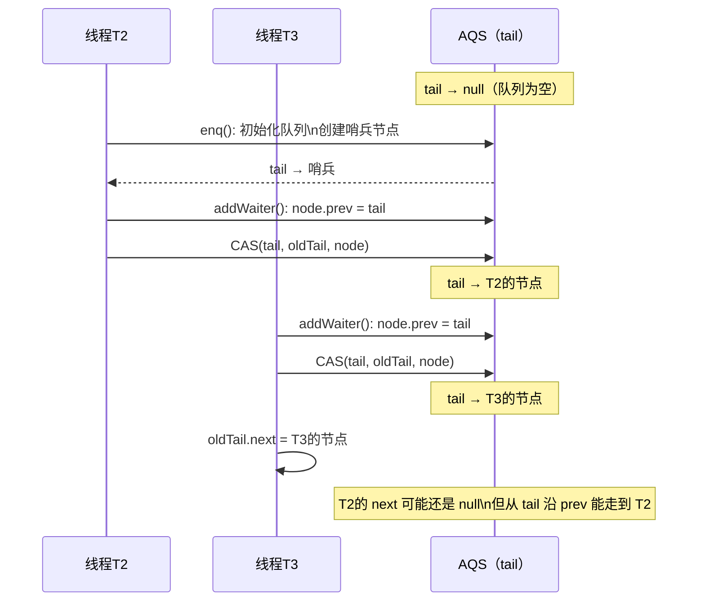

### ➡️ 出队操作：setHead

释放锁时，head 节点出队：

```java
private void setHead(Node node) {
    head = node;
    node.thread = null;   // 清空 thread，成为新的哨兵
    node.prev = null;     // 断开前驱引用，帮助 GC
}
```

出队不需要 CAS——只有持有锁的线程会调用 `setHead`，不存在竞争。

## 🏛️ state 字段：AQS 的核心变量

### 📝 state 的定义

```java
private volatile int state;

protected final int getState() { return state; }
protected final boolean compareAndSetState(int expect, int update) {
    return U.compareAndSetInt(this, STATE, expect, update);
}
```

`state` 是一个 `volatile int`，它是 AQS 的 **同步状态** 。不同子类赋予它完全不同的语义：

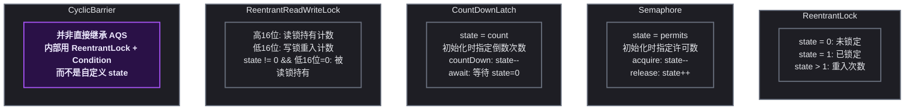

### 📐 state 在 ReentrantLock 中的使用（独占模式）

```java
// ReentrantLock.Sync（非公平版本）
final boolean tryAcquire(int acquires) {
    Thread current = Thread.currentThread();
    int c = getState();
    if (c == 0) {                         // ① state=0，锁空闲
        if (compareAndSetState(0, acquires)) {  // ② CAS 抢锁
            setExclusiveOwnerThread(current);   // ③ 设置持有者
            return true;
        }
    } else if (current == getExclusiveOwnerThread()) {
        int nextc = c + acquires;          // ④ state>0 且是当前线程 → 重入
        setState(nextc);                   // ⑤ 直接 setState（无需 CAS，单线程写）
        return true;
    }
    return false;                          // ⑥ 获取失败
}

protected final boolean tryRelease(int releases) {
    int c = getState() - releases;
    if (Thread.currentThread() != getExclusiveOwnerThread())
        throw new IllegalMonitorStateException();
    boolean free = false;
    if (c == 0) {                          // ⑦ state 减到 0，完全释放
        free = true;
        setExclusiveOwnerThread(null);
    }
    setState(c);
    return free;                           // ⑧ 返回 true 表示需要唤醒后继
}
```

### 📐 state 在 Semaphore 中的使用（共享模式）

```java
// Semaphore.Sync
final int tryAcquireShared(int acquires) {
    for (;;) {
        int available = getState();
        int remaining = available - acquires;
        // ① remaining<0 表示许可不足，进入队列等待
        // ② CAS 扣减，失败则自旋重试
        if (remaining < 0 ||
            compareAndSetState(available, remaining))
            return remaining;
    }
}

protected final boolean tryReleaseShared(int releases) {
    for (;;) {
        int current = getState();
        int next = current + releases;     // ③ 归还许可
        if (compareAndSetState(current, next))
            return true;
    }
}
```

### ⏳ state 在 CountDownLatch 中的使用

```java
// CountDownLatch.Sync
protected int tryAcquireShared(int acquires) {
    return (getState() == 0) ? 1 : -1;  // ① state=0 才成功
}

protected boolean tryReleaseShared(int releases) {
    for (;;) {
        int c = getState();
        if (c == 0) return false;
        int nextc = c - 1;               // ② 每次 countDown 减 1
        if (compareAndSetState(c, nextc))
            return nextc == 0;           // ③ 减到 0 时返回 true，触发唤醒
    }
}
```

<span style="color:red">state 是 AQS 唯一需要子类去定义的业务语义</span>——所有复杂的排队、阻塞、唤醒逻辑都由 AQS 的 `acquire` / `release` 模板方法处理，子类只需通过 `tryAcquire` / `tryRelease` 告诉 AQS"当前能否获取/释放"，而判断的依据就是对 `state` 的读写。

## 🔐 独占模式完整调用链：acquire → tryAcquire → addWaiter → acquireQueued

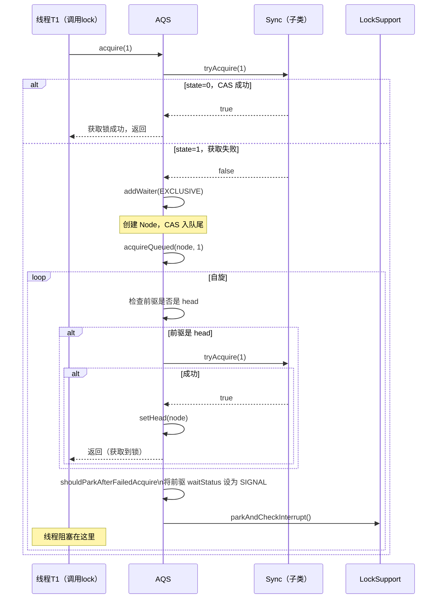

核心源码串联：

```java
// 1. 入口
public final void acquire(int arg) {
    if (!tryAcquire(arg) &&
        acquireQueued(addWaiter(Node.EXCLUSIVE), arg))
        selfInterrupt();  // 补中断标记
}

// 2. 入队后自旋获取
final boolean acquireQueued(final Node node, int arg) {
    boolean interrupted = false;
    try {
        for (;;) {
            final Node p = node.predecessor();
            if (p == head && tryAcquire(arg)) {  // 前驱是 head 才尝试
                setHead(node);                   // 获取成功，自己成为新 head
                p.next = null;                   // 断开旧 head，帮助 GC
                return interrupted;
            }
            if (shouldParkAfterFailedAcquire(p, node))  // 判断是否需要 park
                interrupted |= parkAndCheckInterrupt();  // park 并检查中断
        }
    } catch (Throwable t) {
        cancelAcquire(node);  // 异常时取消节点
        if (interrupted) selfInterrupt();
        throw t;
    }
}

// 3. 判断是否应该 park
private static boolean shouldParkAfterFailedAcquire(Node pred, Node node) {
    int ws = pred.waitStatus;
    if (ws == Node.SIGNAL)        // 前驱已经是 SIGNAL，放心 park
        return true;
    if (ws > 0) {                 // 前驱被取消，向前跳过所有取消节点
        do {
            node.prev = pred = pred.prev;
        } while (pred.waitStatus > 0);
        pred.next = node;
    } else {
        pred.compareAndSetWaitStatus(ws, Node.SIGNAL);  // 设置前驱为 SIGNAL
    }
    return false;                 // 返回 false，外层自旋会再试一次
}
```

**关键设计** ：线程 `park()` 前，必须先将前驱节点的 `waitStatus` 设为 SIGNAL。这样释放锁时，前驱检查自己的 `waitStatus` 就知道有后继需要唤醒。

## 🤝 共享模式完整调用链：acquireShared → releaseShared

共享模式与独占模式的核心差异在于 **唤醒传播** ：

```java
// 共享模式入口
public final void acquireShared(int arg) {
    if (tryAcquireShared(arg) < 0)        // ① 返回负值表示需要排队
        doAcquireShared(arg);
}

private void doAcquireShared(int arg) {
    final Node node = addWaiter(Node.SHARED);  // ② 创建 SHARED 模式节点
    boolean interrupted = false;
    try {
        for (;;) {
            final Node p = node.predecessor();
            if (p == head) {
                int r = tryAcquireShared(arg);
                if (r >= 0) {                    // ③ 获取成功
                    setHeadAndPropagate(node, r); // ④ 关键：设置 head 并传播
                    p.next = null;
                    return;
                }
            }
            if (shouldParkAfterFailedAcquire(p, node))
                interrupted |= parkAndCheckInterrupt();
        }
    } catch (Throwable t) {
        cancelAcquire(node);
        throw t;
    }
}

// 传播机制：共享模式的核心
private void setHeadAndPropagate(Node node, int propagate) {
    Node h = head;
    setHead(node);
    // ① propagate>0 表示还有剩余许可，需要继续唤醒
    // ② h.waitStatus < 0（可能是 PROPAGATE），也需要继续传播
    if (propagate > 0 || h == null || h.waitStatus < 0) {
        Node s = node.next;
        if (s == null || s.isShared())
            doReleaseShared();  // 唤醒后继共享节点
    }
}
```

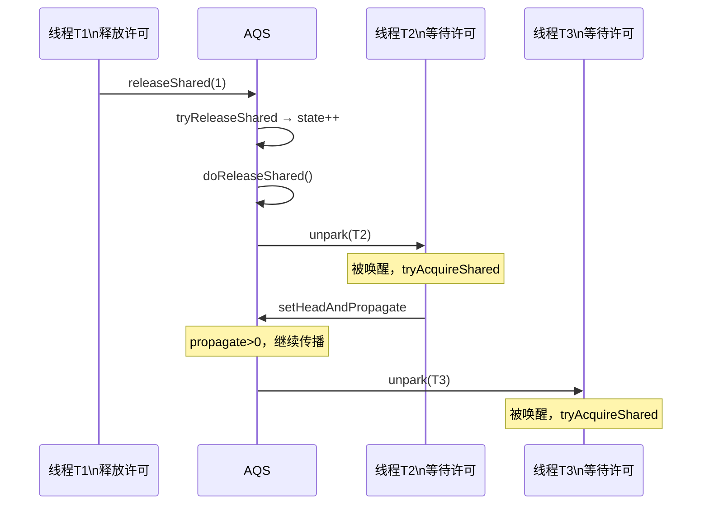

相比独占模式每次只唤醒 head.next，共享模式在 `setHeadAndPropagate` 中会 **连锁唤醒** 后续的共享节点，直到遇到独占节点或许可耗尽。这就是 Semaphore 释放一个许可后可以同时唤醒多个等待者的原理。

## 🎛️ 条件队列（Condition）：wait/notify 的升级版

### 🏗️ 条件队列的结构

AQS 的内部类 `ConditionObject` 实现了 `Condition` 接口。每个 ConditionObject 维护一条独立的 **条件队列** （单向链表）：

对比两张队列：同步队列是<strong>双向链表</strong>（prev + next），条件队列是<strong>单向链表</strong>（仅 nextWaiter）。注意条件队列中的节点 `prev` 和 `next` 字段全是 null——它们还没入队竞争锁：

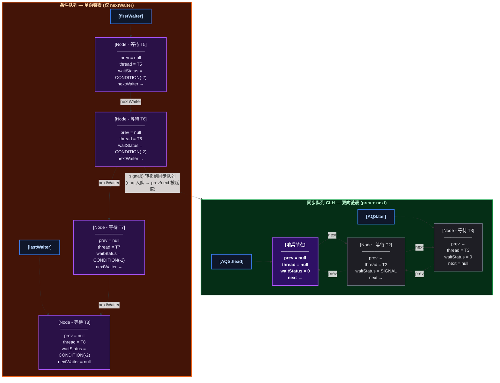

条件队列的 `firstWaiter` / `lastWaiter` 相当于同步队列的 `head` / `tail`，但只维护单向指针。关键区别：条件队列中的节点 <strong>`prev` 和 `next` 都是 null</strong>——它此时不属于同步队列。直到 `signal()` 被调用，节点才通过 `enq()` 进入同步队列尾部，`prev`/`next` 被赋值，`waitStatus` 从 CONDITION 改为 0。

```java
public class ConditionObject implements Condition {
    private transient Node firstWaiter;  // 条件队列的头
    private transient Node lastWaiter;   // 条件队列的尾

    // 核心方法：await() / signal() / signalAll()
}
```

### ⬇️ await() 调用链

```java
public final void await() throws InterruptedException {
    if (Thread.interrupted())
        throw new InterruptedException();
    Node node = addConditionWaiter();   // ① 加入条件队列（waitStatus=CONDITION）
    int savedState = fullyRelease(node); // ② 释放持有的所有 state（重入次数全部释放）
    int interruptMode = 0;
    while (!isOnSyncQueue(node)) {       // ③ 自旋：检查是否被转移到同步队列
        LockSupport.park(this);          // ④ 阻塞在条件队列上
        if ((interruptMode = checkInterruptWhileWaiting(node)) != 0)
            break;
    }
    // ⑤ 被 signal 唤醒后，节点已转移到同步队列，走 acquireQueued 重新竞争锁
    if (acquireQueued(node, savedState) && interruptMode != THROW_IE)
        interruptMode = REINTERRUPT;
    if (node.nextWaiter != null)
        unlinkCancelledWaiters();        // ⑥ 清理条件队列中取消的节点
    if (interruptMode != 0)
        reportInterruptAfterWait(interruptMode);
}
```

**关键步骤** ：
1. `addConditionWaiter()` — 在条件队列尾部添加节点（无需 CAS，因为持有锁的线程独占操作）
2. `fullyRelease(node)` — <span style="color:red">释放全部 state</span>（包括重入次数）。这是 await 必须释放锁的原因
3. 循环 `isOnSyncQueue(node)` — 等待被 signal 转移到同步队列
4. `acquireQueued` — 回到同步队列后，重新走标准锁竞争流程

### ⬆️ signal() 调用链：从条件队列转移到同步队列

```java
public final void signal() {
    if (!isHeldExclusively())
        throw new IllegalMonitorStateException();
    Node first = firstWaiter;
    if (first != null)
        doSignal(first);
}

private void doSignal(Node first) {
    do {
        if ((firstWaiter = first.nextWaiter) == null)
            lastWaiter = null;
        first.nextWaiter = null;           // ① 断开条件队列链接
    } while (!transferForSignal(first) &&  // ② 转移失败则继续下一个
             (first = firstWaiter) != null);
}

final boolean transferForSignal(Node node) {
    // ③ CAS 将 waitStatus 从 CONDITION 改为 0
    if (!node.compareAndSetWaitStatus(Node.CONDITION, 0))
        return false;  // 节点被取消，转移失败

    Node p = enq(node);         // ④ 加入同步队列队尾，返回前驱节点
    int ws = p.waitStatus;
    // ⑤ 如果前驱被取消，或 CAS 设置 SIGNAL 失败，直接 unpark 当前节点
    if (ws > 0 || !p.compareAndSetWaitStatus(ws, Node.SIGNAL))
        LockSupport.unpark(node.thread);
    return true;
}
```

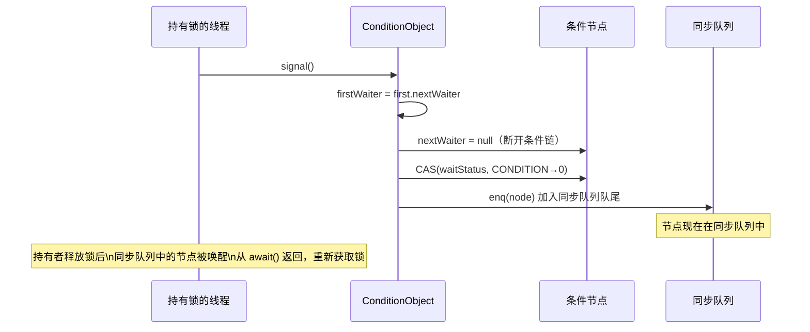

### ⬆️ signal 转移过程中的并发安全问题

`transferForSignal` 中有一个精妙的处理：转移后如果前驱节点被取消，会 **直接 unpark 被转移的节点** ：

```java
if (ws > 0 || !p.compareAndSetWaitStatus(ws, Node.SIGNAL))
    LockSupport.unpark(node.thread);
```

被 unpark 的线程从 `await()` 中的 `park()` 返回后，会进入 `acquireQueued` 的自旋循环。它会检测到前驱被取消，跳过取消节点，重新尝试获取锁。如果获取失败，会由 `shouldParkAfterFailedAcquire` 重新将新的有效前驱设为 SIGNAL，然后再次 park。整个过程是安全的。

## ⚠️ 高并发下的链表端断裂问题

### 🐛 问题场景：cancelAcquire 中的并发修改

当一个等待线程被中断或超时，它需要从同步队列中移除自己。但如果恰好此时前驱节点正在被释放（出队），就会出现链表断裂：

```java
private void cancelAcquire(Node node) {
    if (node == null) return;

    node.thread = null;                    // ① 清空线程引用

    // ② 向前跳过所有取消节点，找到有效前驱
    Node pred = node.prev;
    while (pred.waitStatus > 0)
        node.prev = pred = pred.prev;

    Node predNext = pred.next;            // ③ 记录 pred 当前的 next

    node.waitStatus = Node.CANCELLED;     // ④ 标记自己为取消

    // ⑤ 如果自己是 tail，CAS 将 tail 回退到 pred
    if (node == tail && compareAndSetTail(node, pred)) {
        pred.compareAndSetNext(predNext, null);  // 断开
    } else {
        // ⑥ 不是 tail：尝试让 pred.next 跳过自己
        int ws;
        if (pred != head &&
            ((ws = pred.waitStatus) == Node.SIGNAL ||
             (ws <= 0 && pred.compareAndSetWaitStatus(ws, Node.SIGNAL))) &&
            pred.thread != null) {
            Node next = node.next;
            if (next != null && next.waitStatus <= 0)
                pred.compareAndSetNext(predNext, next);  // CAS 跳过自己
        } else {
            unparkSuccessor(node);  // ⑦ 否则唤醒后继，让后继重新调整
        }
    }
    node.next = node;  // ⑧ 帮助 GC，同时标记该节点已离开队列
}
```

### 🌐 链表断裂的具体场景

假设队列为 `head → A → B → C → tail`，线程 B 超时取消，同时 A 正在被释放：

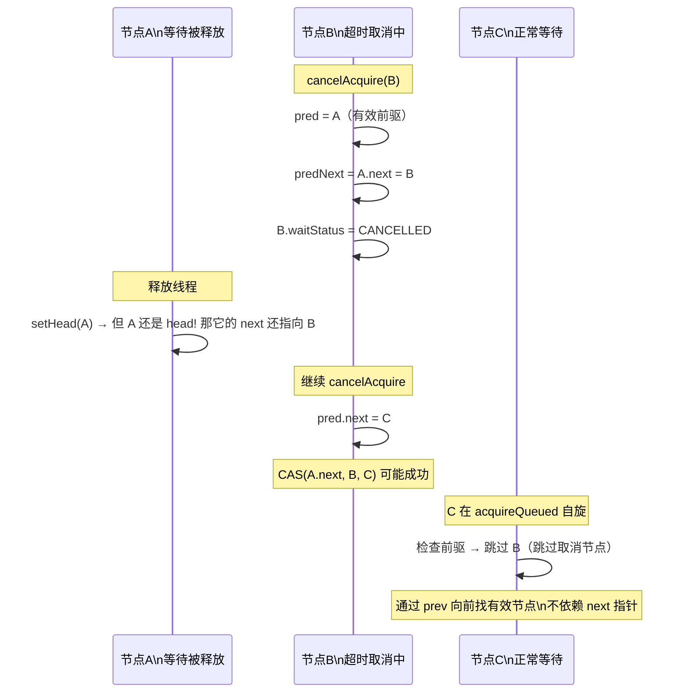

**关键保护机制** ：

| 机制 | 说明 |
|------|------|
| **prev 始终可靠** | 从 `tail` 沿 `prev` 向前追溯，始终能遍历到所有未取消的节点，因为 `prev` 在 `cancelAcquire` 中会被调整为跳过取消节点 |
| **next 不一定可靠** | `next` 是"尽力而为"的——`cancelAcquire` 用 CAS 更新 `pred.next`，如果 CAS 失败（并发修改），会走 `unparkSuccessor` 让后继自行处理 |
| **unparkSuccessor 从 tail 向前找** | 唤醒后继时，不是直接 `node.next`，而是从 `tail` 沿 `prev` 向前搜索最前面一个有效节点 |

```java
// unparkSuccessor 的关键逻辑
private void unparkSuccessor(Node node) {
    int ws = node.waitStatus;
    if (ws < 0)
        node.compareAndSetWaitStatus(ws, 0);

    Node s = node.next;
    // 如果 next 为 null 或被取消，从 tail 向前搜索
    if (s == null || s.waitStatus > 0) {
        s = null;
        for (Node p = tail; p != node && p != null; p = p.prev)
            if (p.waitStatus <= 0)
                s = p;  // 找到最前面一个有效节点
    }
    if (s != null)
        LockSupport.unpark(s.thread);
}
```

<span style="color:red">这就是 AQS 为什么使用双向链表且从 tail 向前搜索的原因</span>——在并发取消场景下，`next` 指针可能断裂或指向已取消节点，但 `prev` 始终可追溯到有效前驱。`unparkSuccessor` 从 `tail` 向前扫描，确保不会漏掉任何需要唤醒的节点。

### 🏁 另一个并发问题：enq 初始化竞态

当队列尚未初始化（`tail == null`），多个线程同时调用 `addWaiter()` 时：

```java
private Node enq(Node node) {
    for (;;) {
        Node oldTail = tail;
        if (oldTail != null) {
            node.setPrevRelaxed(oldTail);
            if (compareAndSetTail(oldTail, node)) {
                oldTail.next = node;
                return oldTail;
            }
        } else {
            initializeSyncQueue();  // 多个线程同时进入这里
        }
    }
}
```

`initializeSyncQueue()` 内部用 CAS 创建哨兵节点，只有一个线程会成功。失败的线程在外层 `for(;;)` 自旋，再次循环时 `tail` 已不为 null，走正常入队路径。这是 CAS 自旋的标准用法。

## 📊 AQS 衍生组件中 state 含义速查

| 组件 | 模式 | state 含义 | state=0 | state>0 |
|------|:---:|------|------|------|
| **ReentrantLock** | 独占 | 0=未锁定，1=已锁定，>1=重入次数 | 锁空闲 | 锁被持有（重入次数） |
| **Semaphore** | 共享 | 可用许可数 | 许可耗尽 | 还有 N 个许可 |
| **CountDownLatch** | 共享 | 剩余倒数次数 | 门闩打开 | 门闩关闭，await 阻塞 |
| **ReentrantReadWriteLock** | 独占+共享 | 高16位=读锁计数，低16位=写锁重入 | 无锁 | 有读锁或写锁持有中 |
| **CyclicBarrier** | — | 不直接继承 AQS，内部用 ReentrantLock + Condition | — | — |

## 🛠️ 日常开发中的常用方法

AQS 对上层开发者是不可见的（`abstract` 类），但对框架开发者是重要的扩展点。以下是基于 AQS 的 **SDK API** （面向日常使用者）：

| 组件 | 常用方法 | 用途 | 频率 |
|------|---------|------|:---:|
| `ReentrantLock` | `lock()` / `unlock()` | 互斥锁 | 高 |
| `ReentrantLock` | `tryLock(timeout, unit)` | 带超时的尝试获取 | 中 |
| `ReentrantLock` | `newCondition()` | 创建条件变量 | 中 |
| `Semaphore` | `acquire()` / `release()` | 信号量控制并发数 | 高 |
| `CountDownLatch` | `await()` / `countDown()` | 等待一组操作完成 | 高 |
| `ReentrantReadWriteLock` | `readLock().lock()` / `writeLock().lock()` | 读写锁 | 中 |

```java
// 场景1：ReentrantLock + Condition 实现有界阻塞队列
class BoundedQueue<T> {
    final ReentrantLock lock = new ReentrantLock();
    final Condition notFull = lock.newCondition();
    final Condition notEmpty = lock.newCondition();
    final Object[] items;
    int putIdx, takeIdx, count;

    BoundedQueue(int cap) { items = new Object[cap]; }

    public void put(T x) throws InterruptedException {
        lock.lock();
        try {
            while (count == items.length)
                notFull.await();          // 队列满，等待 notFull
            items[putIdx++] = x;
            if (putIdx == items.length) putIdx = 0;
            count++;
            notEmpty.signal();            // 通知 notEmpty
        } finally {
            lock.unlock();
        }
    }

    public T take() throws InterruptedException {
        lock.lock();
        try {
            while (count == 0)
                notEmpty.await();         // 队列空，等待 notEmpty
            T x = (T) items[takeIdx++];
            if (takeIdx == items.length) takeIdx = 0;
            count--;
            notFull.signal();             // 通知 notFull
            return x;
        } finally {
            lock.unlock();
        }
    }
}

// 场景2：Semaphore 限制数据库连接并发数
class ConnectionPool {
    final Semaphore semaphore = new Semaphore(10);  // 最多10个并发连接

    public void executeQuery(String sql) throws InterruptedException {
        semaphore.acquire();
        try {
            // 执行数据库查询
        } finally {
            semaphore.release();
        }
    }
}
```

## 🎯 总结

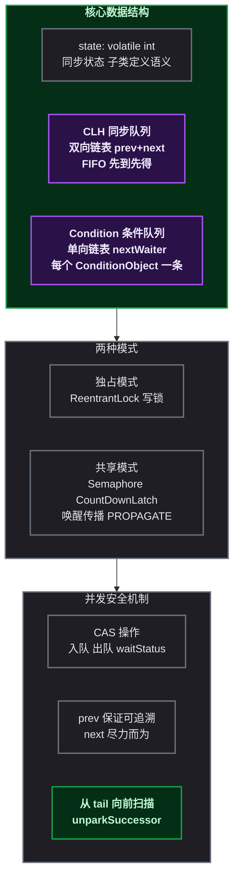

| 核心问题 | 答案 |
|---------|------|
| **AQS 解决什么问题** | 提供统一的同步器框架，封装排队、阻塞、唤醒逻辑，子类只需实现 `tryAcquire/tryRelease` 定义 state 语义 |
| **同步队列 vs 条件队列** | 同步队列是双向链表（CLH），存等待获取锁的线程；条件队列是单向链表，存等待 `signal` 的线程 |
| **state 的作用** | 同步状态的整数抽象，ReentrantLock 中是 0/1/重入次数，Semaphore 中是许可数，CountDownLatch 中是倒数计数 |
| **waitStatus 的作用** | 节点状态标记：SIGNAL 表示后继需唤醒，CANCELLED 表示节点已取消，CONDITION 表示在条件队列，PROPAGATE 表示共享传播 |
| **prev vs next 的区别** | `prev` 始终可靠（从 tail 可追溯所有有效节点），`next` 是尽力而为（并发取消时可能断裂），唤醒时从 tail 向前扫描保证不漏节点 |
| **共享模式为什么需要 PROPAGATE** | 防止在多线程并发 release 场景下，唤醒信号在传播链中丢失，导致后续共享节点永久阻塞 |
