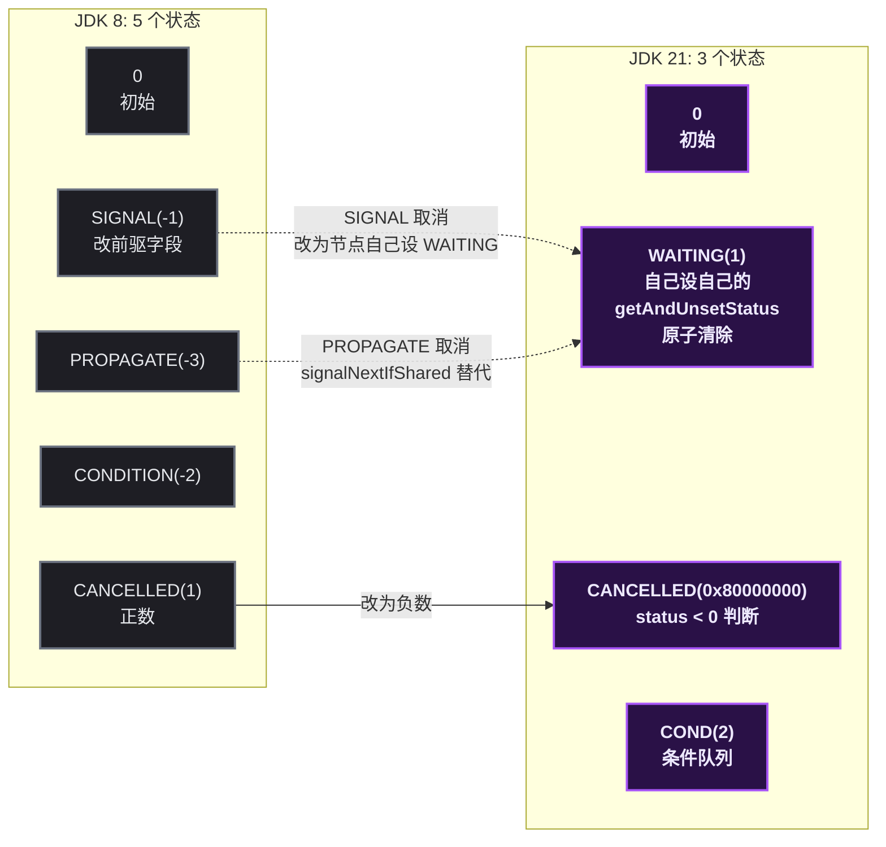
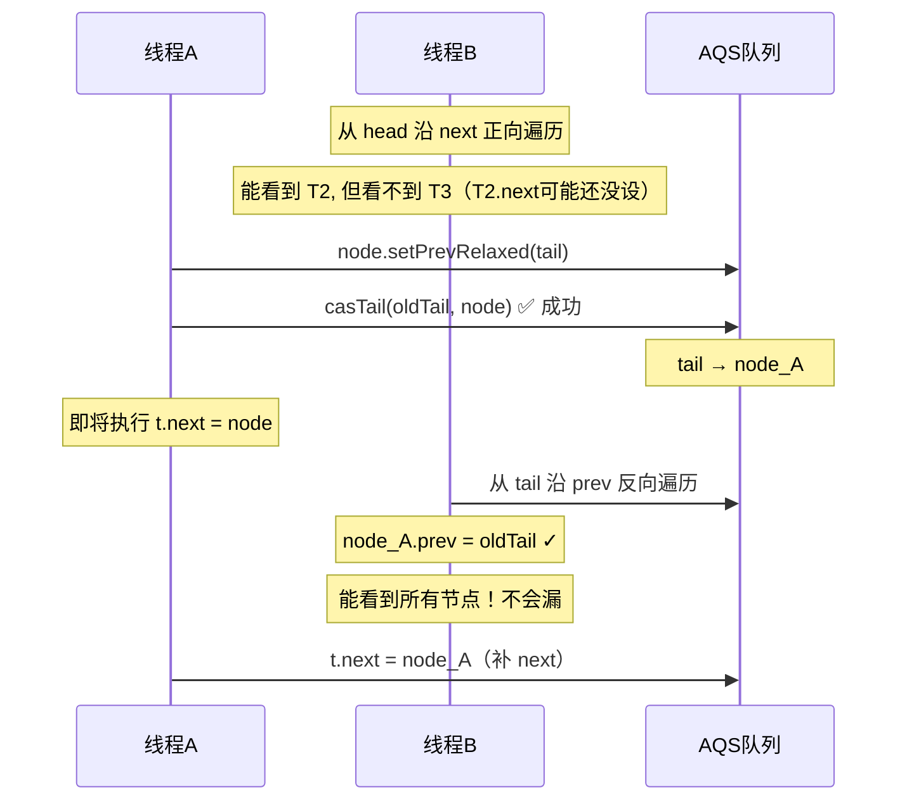
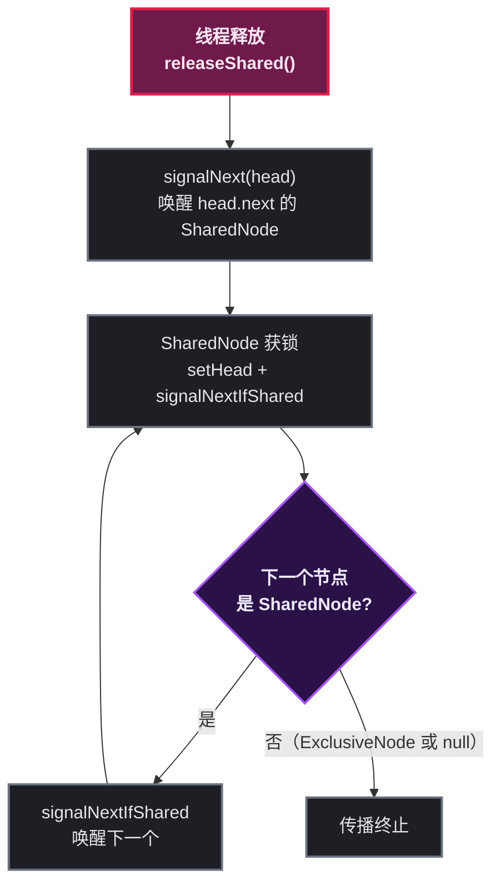
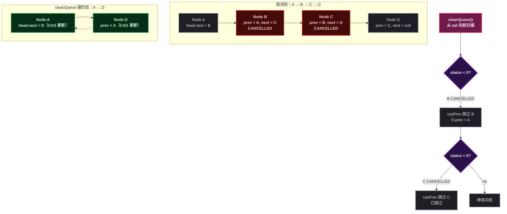
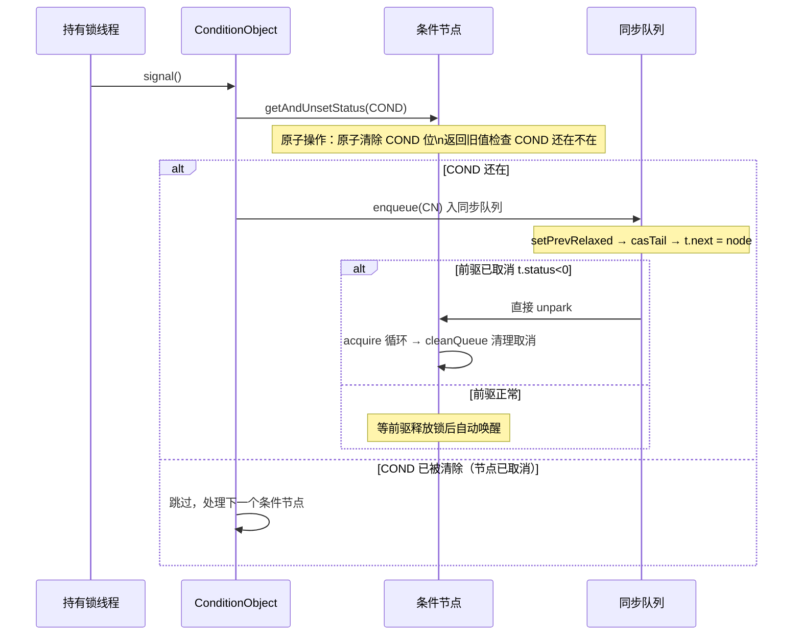

<!--
图解 → 源码 → 格式化 → 占位：按以下顺序执行。
-->

# AQS 源码重走：从「如果让我写」到「原来还可以这样」

某开发者背了一周 AQS 八股：CLH 队列、acquireQueued、shouldParkAfterFailedAcquire……面试官问「AQS 的 prev 和 next 为什么一个可靠一个不可靠？」——答了，但说不出这么设计是为了解决什么问题。面试官一句话戳穿：「你读过源码，但你有没有想过在并发场景下删队列中的一个节点，不这么写会发生什么？」

背源码最大的问题是：**你不知道那些代码是在解决什么问题。**

所以这篇文章不走寻常路——先问「如果不用 AQS，让我自己写一个锁排队框架，该怎么下手？」然后一步步推演，当你发现「哎这里不安全怎么办」的时候，再引出 Doug Lea 的解法。这个过程会让人惊叹：原来并发代码还可以这样写。

最后，会专门对比 JDK 8 和 JDK 21 两个版本的 AQS，讲清楚 Doug Lea 为什么在 JDK 21 中对核心逻辑做了一次大重构。

## 🏗️ 从零开始：如果让我实现一个可排队的锁

假设只有 ` synchronized ` 和 ` LockSupport.park/unpark ` ，让你实现一个「锁没抢到就排队等」的框架，你打算怎么写？

### 第一次尝试：一个粗暴的实现

``` java
// 初版思路
class NaiveLock {
    volatile int state = 0;          // 0=未锁, 1=已锁
    Queue<Thread> queue = new ...    // 等待队列

    void lock() {
        while (!CAS(&state, 0, 1)) { // 没抢到锁
            queue.enqueue(currentThread());  // 入队
            park();                           // 阻塞
        }
    }

    void unlock() {
        state = 0;                    // 释放锁
        Thread t = queue.dequeue();   // 从队列取一个
        unpark(t);                    // 唤醒
    }
}
``` 

看上去好像没问题。但仔细想想，全是坑：

1. **入队和 park 不是原子的**：刚入队就被 unpark 了怎么办？线程 B 释放锁、从队列取出该节点然后 unpark，但线程 A 还没执行到 park， ` unpark ` 就白费了（ ` park ` 语义虽说不丢信号，但 unpark 后线程 A 必须调用 park 才能消费这个信号，中间如果被其他事情卡住就丢了）。
2. **队列线程安全**：多个线程同时入队，谁保障 ` queue.enqueue ` 的线程安全？
3. **取消问题**：线程中断或超时了，怎么从队列里干净地移除自己？移除过程中别人正在出队怎么办？

这些问题 Doug Lea 全部考虑到了。AQS 的每一行代码都是这些问题的精准回答。

### 核心契约：子类只管 state，排队的事交给 AQS

AQS 的答案是模板方法模式：

``` java
// AQS.java:988
public final void acquire(int arg) {
    if (!tryAcquire(arg))                // ① 子类实现：能不能获取？
        acquire(null, arg, false, false, false, 0L); // ② 排队去
}

// AQS.java:1058
public final boolean release(int arg) {
    if (tryRelease(arg)) {               // ① 子类实现：能不能释放？
        signalNext(head);                // ② 唤醒后继
        return true;
    }
    return false;
}
``` 

子类只需要：
- **独占模式**：实现 ` tryAcquire ` / ` tryRelease ` ，读写 ` state ` 
- **共享模式**：实现 ` tryAcquireShared ` / ` tryReleaseShared ` 

剩下所有的排队、阻塞、唤醒、取消、超时、传播逻辑，AQS 帮你搞定。

怎么搞定的？下面逐层拆解。

## 📦 Node 数据结构：线程的排队凭证

AQS 的队列由 ` Node ` 节点链接而成，每个等待线程被包装为一个 Node。这是 JDK 21 的版本——和八股里的 JDK 8 版本已经大不一样了：

``` java
// AQS.java:467-522 (JDK 21)
abstract static class Node {
    volatile Node prev;        // 前驱
    volatile Node next;        // 后继
    Thread waiter;             // 被包装的线程
    volatile int status;       // 节点状态
}

static final class ExclusiveNode extends Node { }   // 独占模式
static final class SharedNode extends Node { }       // 共享模式

static final class ConditionNode extends Node implements ForkJoinPool.ManagedBlocker {
    ConditionNode nextWaiter;  // 条件队列中的下一个节点
}
``` 

### 为什么拆三个子类而不是一个？

**JDK 8** 用单个 Node 类，靠一个字段 ` nextWaiter ` 做双重语义：在同步队列中指向 ` SHARED ` 常量标记共享模式，在条件队列中指向下一个条件节点。一个字段两个含义，新手看了就晕。

**JDK 21** 拆成三个子类：
- ` ExclusiveNode ` / ` SharedNode ` ：类型由 ` instanceof ` 区分，意图一目了然
- ` ConditionNode ` ：实现 ` ForkJoinPool.ManagedBlocker ` ，条件等待时可以在 ForkJoinPool 中使用而不耗尽线程池 —— 这是对 JDK 8 的一个功能性增强
- 条件队列的 ` nextWaiter ` 指针移到 ` ConditionNode ` ，普通 Node 不再有这个字段，节省了内存

### waitStatus：从五状态到三状态

JDK 8 的 waitStatus 五个值：

| 状态 | 值 | 含义 |
|------|:---:|------|
| 初始 | 0 | 节点刚入队 |
| SIGNAL | -1 | 后继需要唤醒 |
| CANCELLED | 1 | 取消 |
| CONDITION | -2 | 在条件队列 |
| PROPAGATE | -3 | 共享传播 |

JDK 21 精简到三个：

``` java
static final int WAITING   = 1;           // 线程正在等待被 unpark
static final int CANCELLED = 0x80000000;  // 节点已取消（负值）
static final int COND      = 2;           // 在条件队列中
``` 

**为什么移除 SIGNAL 和 PROPAGATE？**

旧版 SIGNAL 的实现是：线程 park 前 CAS 设前驱的 waitStatus 为 SIGNAL（即 ` shouldParkAfterFailedAcquire ` ），释放锁时检查自身 waitStatus 是否为 SIGNAL，是则唤醒后继。这个机制需要**修改前驱的字段**，多了一次 CAS 操作。

JDK 21 改成：线程直接设自己的 ` status = WAITING ` 。谁想唤醒它，直接 ` getAndUnsetStatus(WAITING) ` 原子清除 WAITING 位 + ` unpark ` 。不需要改前驱——省了一次 CAS，也简化了逻辑。

**PROPAGATE** 在以前负责共享模式下的唤醒传播，防止多线程并发 release 时唤醒信号丢失。JDK 21 用 ` signalNextIfShared ` 在每次 setHead 后检测后继是否是 SharedNode 并唤醒，天然实现了传播，无需单独的 PROPAGATE 状态。

**CANCELLED 为什么从 1 变成 0x80000000？**

` 0x80000000 ` 是负数（最高位为 1），这样 ` status < 0 ` 可以判断已取消。旧版 CANCELLED = 1，必须用 ` waitStatus > 0 ` 判断，不太直观且位运算不如直接比较负数高效。统一成负数后， ` status < 0 ` 既可以检测 CANCELLED，也为未来其他负值状态留了扩展空间。


``` mermaid
%% 半暗底色 + 高亮描边 %%
flowchart LR
    subgraph OLD["JDK 8: 5 个状态"]
        O0["0\n初始"]
        O1["SIGNAL(-1)\n改前驱字段"]
        O2["CANCELLED(1)\n正数"]
        O3["CONDITION(-2)"]
        O4["PROPAGATE(-3)"]
    end

    subgraph NEW["JDK 21: 3 个状态"]
        N0["0\n初始"]
        N1["WAITING(1)\n自己设自己的\ngetAndUnsetStatus\n原子清除"]
        N2["CANCELLED(0x80000000)\nstatus < 0 判断"]
        N3["COND(2)\n条件队列"]
    end

    O1 -.->|"SIGNAL 取消\n改为节点自己设 WAITING"| N1
    O2 -->|"改为负数"| N2
    O4 -.->|"PROPAGATE 取消\nsignalNextIfShared 替代"| N1

    classDef process fill:#1e1e24,stroke:#6b7280,stroke-width:2px,color:#e5e7eb;
    classDef highlight fill:#2a1147,stroke:#a855f7,stroke-width:2px,color:#ede9fe,font-weight:bold;
    classDef reject fill:#450a0a,stroke:#dc2626,stroke-width:2px,color:#fecaca,font-weight:bold;
    class O0,O1,O2,O3,O4 process;
    class N0,N1,N2,N3 highlight;
``` 

## 🔗 CLH 同步队列：一次「先链再 CAS」的极致设计

### 队列结构

AQS 维护一个 FIFO 的双向链表：
- ` head ` ：指向 **哨兵节点**（已获取锁或从未使用，thread = null）
- ` tail ` ：指向队尾

``` 
head → [哨兵节点] ←→ [等待者T2] ←→ [等待者T3] ←→ [等待者T4] ← tail
          prev=null    thread=T2     thread=T3     thread=T4
          thread=null  status=SIGNAL status=SIGNAL status=0
``` 

### 入队：为什么「先链 prev → CAS 抢 tail → 后补 next」？

``` java
// acquire 方法的入队部分（JDK 21, L738-744）
node.waiter = current;
node.setPrevRelaxed(t);       // ① 先设 prev
if (!casTail(t, node))         // ② CAS 抢 tail
    node.setPrevRelaxed(null); // ③ 失败回退
else
    t.next = node;             // ④ 成功后补 next
``` 

这是 AQS 所有并发安全设计的根基。思考一个问题：

想象三个线程 A、B、C 同时入队。入队成功的关键是 ` casTail ` ——但这个操作之后， ` oldTail.next = node ` 还没执行。此时如果另一个线程从 ` head ` 沿 ` next ` 正向遍历，它会发现 ` next ` 指针断了：

``` 
T2   →   T3   →   T4(正在入队)   →   (next 尚未设置)
                                          ↑
                                    tail 指向这里，但 T3.next 还是 null
``` 

但是！如果从 ` tail ` 沿 ` prev ` **反向**遍历：T4.prev = T3, T3.prev = T2, T2.prev = head——每一步都走通了。

这就是 AQS 的根本设计原则：** ` prev ` 保证可靠， ` next ` 尽力而为。**

为什么 ` prev ` 总是可靠的？因为 ` setPrevRelaxed(t) ` 在 ` casTail ` 之前执行，而且如果 CAS 失败还会回退。一旦 ` casTail ` 成功， ` node.prev = oldTail ` 已经立住了，不管 ` next ` 有没有补上，从 tail 沿 prev 反走永远不会漏节点。

**这个设计的高明之处在于**：入队只需要一次 CAS（抢 tail），而不是两次（还要 CAS 改 prev.next）。在极度高并发下，CAS 是争抢最激烈的操作，能省一次就省一次。 ` next ` 的赋值不要求原子性，后面自然会被修正（ ` cleanQueue ` 会修复断裂的 ` next ` ）。


``` mermaid
%% 半暗底色 + 高亮描边 %%
sequenceDiagram
    participant TA as 线程A
    participant TB as 线程B
    participant AQS as AQS队列

    Note over TB: 从 head 沿 next 正向遍历
    Note over TB: 能看到 T2, 但看不到 T3（T2.next可能还没设）

    TA->>AQS: node.setPrevRelaxed(tail)
    TA->>AQS: casTail(oldTail, node) ✅ 成功
    Note over AQS: tail → node_A
    Note over TA: 即将执行 t.next = node

    TB->>AQS: 从 tail 沿 prev 反向遍历
    Note over TB: node_A.prev = oldTail ✓
    Note over TB: 能看到所有节点！不会漏

    TA->>AQS: t.next = node_A（补 next）
``` 

### 出队：断前驱而不是删自己

``` java
// acquire 方法 JDK 21, L716-720
node.prev = null;      // 断前驱
head = node;           // 设自己为 head
pred.next = null;      // 断旧 head 的 next
node.waiter = null;    // 清 thread 引用
``` 

出队不需要 CAS——**只有持有锁的线程才能出队**，不存在竞争。当前线程获锁后把自己变成新 head，旧 head 从队列中脱离。这个设计也说明了一个事实： ` head ` 指向的节点可能不是当前持有锁的线程（哨兵节点 thread = null），但 ` head ` 前面的节点一定已经释放了。

## 🏛️ state 字段：一个 int 撑起所有语义

``` java
private volatile int state;
``` 

AQS 只维护一个 ` volatile int state ` 。不同子类赋予它完全不同的含义：

| 组件 | 模式 | state 语义 |
|------|:---:|-----------|
| **ReentrantLock** | 独占 | 0=未锁，>0=锁持有+重入次数 |
| **Semaphore** | 共享 | 剩余许可数 |
| **CountDownLatch** | 共享 | 倒数计数，减到 0 放行 |
| **ReentrantReadWriteLock** | 独占+共享 | 高16位=读锁计数，低16位=写锁重入 |

**为什么是 int 不是 long？** 因为 CAS 在 int 上的 CPU 指令级支持最优化。long 的 CAS 在 32 位 JDK 上需要两次操作。而且 int 的 32 位对于重入计数来说已经绰绰有余（2^31 -1 ≈ 21 亿次重入，没谁会重入到这个数）。

` ReentrantReadWriteLock ` 在一个 state 里塞了两个计数器的玩法最精彩：读锁用高 16 位，写锁用低 16 位。 ` c >>> 16 ` 取读锁计数， ` c & 0xFFFF ` 取写锁重入数。

## 🎯 独占模式完整链路：lock 的幕后

### JDK 8 经典版本

JDK 8 中独占模式 ` acquire ` 的代码分散在多个方法中，但总体逻辑是：

``` java
// JDK 8
public final void acquire(int arg) {
    if (!tryAcquire(arg)) {
        Node node = addWaiter(Node.EXCLUSIVE);  // ① 入队
        boolean interrupted = acquireQueued(node, arg); // ② 自旋
        if (interrupted) selfInterrupt();
    }
}
``` 

` acquireQueued ` 里的自旋逻辑是八股集中营：

``` java
// JDK 8 acquireQueued
for (;;) {
    final Node p = node.predecessor();
    if (p == head && tryAcquire(arg)) {  // 前驱是 head 才抢
        setHead(node);
        p.next = null;
        return interrupted;
    }
    // 重点在这儿：➀ 设前驱为 SIGNAL → ➁ park
    if (shouldParkAfterFailedAcquire(p, node))
        interrupted |= parkAndCheckInterrupt();
}
``` 

``` java
// JDK 8 shouldParkAfterFailedAcquire
private static boolean shouldParkAfterFailedAcquire(Node pred, Node node) {
    int ws = pred.waitStatus;
    if (ws == Node.SIGNAL)          // 前驱已经是 SIGNAL → 可以 park
        return true;
    if (ws > 0) {                   // 前驱被取消 → 跳过取消的前驱
        do {
            node.prev = pred = pred.prev;
        } while (pred.waitStatus > 0);
        pred.next = node;
    } else {                        // 前驱是 0 或 PROPAGATE → 设 SIGNAL
        pred.compareAndSetWaitStatus(ws, Node.SIGNAL);
    }
    return false;                   // 返回 false，外层会自旋再试一次
}
``` 

JDK 8 这里的设计非常精巧，叫 **Dekker 风格的 lock 协议**：

1. 线程先设前驱的 waitStatus 为 SIGNAL（告诉前驱「我等你唤醒我」）
2. 然后重新检查 ` tryAcquire ` （防止设 SIGNAL 到 park 之间锁被释放了）
3. 如果确认没抢到，才 ` park() ` 阻塞

不这样会怎样？如果线程先 ` park() ` 再设 SIGNAL，从 park 返回的那一刻到 SIGNAL 设置完成之间，别人释放了锁但你的 SIGNAL 没设好，就永远没人唤醒你。 ` prepare → recheck → block ` 三步是经典的并发控制模式，CAS、Dekker、Peterson 等算法都遵循这个套路。

### JDK 21 统一方法

JDK 21 把上述所有逻辑合并到一个 ` acquire ` 方法中：

``` java
// AQS.java:670 (JDK 21)
final int acquire(Node node, int arg, boolean shared,
                  boolean interruptible, boolean timed, long time) {
    Thread current = Thread.currentThread();
    byte spins = 0, postSpins = 0;
    boolean interrupted = false, first = false;
    Node pred = null;

    for (;;) {
        // ① 检查前驱
        if (!first && ...) { if (pred.status < 0) cleanQueue(); ... }
        // ② 抢锁
        if (first || pred == null) { /* tryAcquire */ }
        // ③ 未初始化? 初始化
        else if (tail == null) { tryInitializeHead(); }
        // ④ 没创建节点? 创建
        else if (node == null) { node = new ExclusiveNode(); }
        // ⑤ 没入队? 入队
        else if (pred == null) { /* setPrevRelaxed → casTail */ }
        // ⑥ 入队后先空转几次（减少不公平）
        else if (first && spins != 0) { --spins; Thread.onSpinWait(); }
        // ⑦ 设自己的 WAITING 标志
        else if (node.status == 0) { node.status = WAITING; }
        // ⑧ park
        else { LockSupport.park(this); node.clearStatus(); }
    }
}
``` 

### JDK 8 → 21 对比总结

| 维度 | JDK 8 | JDK 21 | 技术考量 |
|------|-------|--------|---------|
| 方法组织 | ` acquire ` + ` addWaiter ` + ` acquireQueued ` + ` shouldParkAfterFailedAcquire ` 四个方法 | 单 ` acquire ` 六阶段循环 | 旧版分散的方法间传递多个布尔参数，逻辑难以追踪。合并后 6 个 else-if 分支对应 6 个阶段，状态机清晰，编译器更容易优化 |
| 信号机制 | 设前驱 ` waitStatus=SIGNAL ` | 设自己 ` status=WAITING ` | 旧版修改前驱需要一次 CAS；新版各设各的，减少 CAS 竞争 |
| 唤醒检测 | ` unparkSuccessor ` 从 tail 向前扫描找有效节点 | ` signalNext ` 只取 ` head.next ` | 入队顺序保证了 head.next 一定有效，简化了 release 路径；断裂由 ` cleanQueue ` 兜底 |
| 取消逻辑 | ` cancelAcquire ` 自己维护链表拼接 | 集中到 ` cleanQueue ` 完整扫表 | 取消往往成群出现， ` cleanQueue ` 一次扫清比逐节点修复更高效 |
| 首次唤醒自旋 | 无 | ` postSpins ` 指数增长（最多 256 次） | 减少不公平：被唤醒的线程如果立即再尝试（不 park），可能在别人入队前成功，降低排队抖动 |
| OOME 处理 | 无 | ` acquireOnOOME ` 回退 + ` OOME_COND_WAIT_DELAY ` | 遇到内存不足不直接抛异常，而是回退到自旋等待，期望内存恢复 |
| Condition 阻塞 | ` LockSupport.park ` | ` ForkJoinPool.managedBlock ` | 允许在 ForkJoinPool 中使用 Condition 而不会耗尽 ForkJoinPool 的工作线程 |

JDK 21 的改动用 Doug Lea 自己的话说（摘自注释第 360 行）：**"This allows some simplifications and efficiencies compared to previous versions of this class."** 核心驱动力不是加功能，而是**简化 + 提效**。

## 🤝 共享模式：唤醒传播的艺术

共享模式（Semaphore、CountDownLatch、读锁）与独占模式的核心差异在于：**一个线程释放后可能需要唤醒多个后继**。

JDK 21 的共享模式：

``` java
// AQS.java:650
private static void signalNextIfShared(Node h) {
    Node s;
    if (h != null && (s = h.next) != null &&
        (s instanceof SharedNode) && s.status != 0) {
        s.getAndUnsetStatus(WAITING);
        LockSupport.unpark(s.waiter);
    }
}
``` 

在 acquire 成功后的 setHead 中调用：

``` java
if (shared)
    signalNextIfShared(node);  // 唤醒继任共享节点
``` 

每次一个共享节点获取成功后，检查下一个节点是不是 ` SharedNode ` ，是就唤醒它。被唤醒的节点获锁后继续唤醒下一个——链式传播下去。直到遇到独占节点（如读写锁中的写锁）或队列尾才停止。


``` mermaid
%% 半暗底色 + 高亮描边 %%
flowchart TD
    R["线程释放\nreleaseShared()"] --> SN["signalNext(head)\n唤醒 head.next 的 SharedNode"]
    SN --> ACQ["SharedNode 获锁\nsetHead + signalNextIfShared"]
    ACQ --> CHECK{"下一个节点\n是 SharedNode?"}
    CHECK -->|"是"| SNEXT["signalNextIfShared\n唤醒下一个"]
    CHECK -->|"否（ExclusiveNode 或 null）"| STOP["传播终止"]
    SNEXT --> ACQ

    classDef startEnd fill:#701a4c,stroke:#e11d48,stroke-width:2.5px,color:#fce7f3,font-weight:bold;
    classDef condition fill:#2a1147,stroke:#a855f7,stroke-width:2px,color:#ede9fe,font-weight:bold;
    classDef process fill:#1e1e24,stroke:#6b7280,stroke-width:2px,color:#e5e7eb;
    class R startEnd;
    class CHECK condition;
    class SN,ACQ,SNEXT,STOP process;
``` 

## ⚠️ 取消与清理：高并发下那颗最难写的代码

面试中最难回答的问题往往集中在**节点取消**。当一个线程被中断或超时，它要从同步队列中移除自己。如果此时正好有人在遍历队列、释放锁、入队——链表会怎样？

### JDK 21 的 cancelAcquire

``` java
// AQS.java:822
private int cancelAcquire(Node node, boolean interrupted,
                          boolean interruptible) {
    if (node != null) {
        node.waiter = null;
        node.status = CANCELLED;    // 设取消标记
        if (node.prev != null)
            cleanQueue();           // 委托清理
    }
    // ...处理中断...
}
``` 

` cancelAcquire ` 极其简洁——它只做标记然后委托 ` cleanQueue ` 去清理。

为什么会这么设计？因为**取消节点的链表拼接比想象中复杂得多**。如果当前节点正好是 tail、正好是 head.next、或者前驱也在被取消，并发场景下各种边界条件叠在一起，每个都需要 CAS 保护。与其在每个 ` cancelAcquire ` 中处理这些复杂情况，不如统一交给 ` cleanQueue ` 做全队列扫描。

### cleanQueue：全队列扫描的勇气

``` java
// AQS.java:785
private void cleanQueue() {
    for (;;) {
        for (Node q = tail, s = null, p, n;;) {
            if (q == null || (p = q.prev) == null)
                return;
            if (q.status < 0) {        // 取消节点
                // CAS 把前驱的 next 和 后继的 prev 链起来
                if ((s == null ? casTail(q, p) : s.casPrev(q, p)) && ...)
                    p.casNext(q, s);   // 尝试修复 next（失败了也没事）
                break;
            }
            // ...
            s = q;
            q = q.prev;                // 从 tail 向前遍历
        }
    }
}
``` 

` cleanQueue ` 一次性扫描整条队列，找出所有取消节点并跳过它们。这个方法比 JDK 8 的逐节点修复更彻底——因为取消往往成群出现（一组线程同时超时），逐节点修复是 O(N) 的节点数，全队列扫描也是 O(N) 但一次搞定。

注意这里用的是 ` casPrev ` 而不是 ` setPrev ` ——因为可能存在多个线程同时在清理不同取消节点，需要用 CAS 防止覆盖。 ` casNext ` 成功与否不重要—— ` prev ` 可靠， ` next ` 后面会被再次修复。

这意味着 AQS 的队列一致性模型是：** ` prev ` 链始终正确（CAS 保护）， ` next ` 链尽力可达。**

怎么理解？假设队列是 ` A → B → C → D ` ，B 和 C 同时取消：

1. B 取消 → ` cleanQueue ` 扫到 B → 尝试将 ` A.next = C ` （CAS）
2. C 取消 → ` cleanQueue ` 扫到 C → 从 tail 反向走，看到 C 已取消 → ` B.casPrev(C.prev=A) ` → ` A.casNext(B, D) ` 

两次清理都通过 CAS 修改了 ` prev ` ，保证了 ` prev ` 链不断。但 ` next ` 可能在中间状态： ` A.next ` 可能指向 B（CAS 失败）， ` B.next ` 可能指向 C。不过没关系—— ` unparkSuccessor ` （JDK 8）或 ` getFirstQueuedThread ` （JDK 21）会从 tail 向前扫描找到真正的有效节点。


``` mermaid
%% 半暗底色 + 高亮描边 %%
flowchart TD
    subgraph BEFORE["取消前：A → B → C → D"]
        A1["Node A\nhead.next = B"]
        B1["Node B\nprev = A, next = C\nCANCELLED"]
        C1["Node C\nprev = B, next = D\nCANCELLED"]
        D1["Node D\nprev = C, next = null"]
        A1 --> B1 --> C1 --> D1
    end

    subgraph AFTER["cleanQueue 遍历后：A → D"]
        A2["Node A\nhead.next = D（CAS 更新）"]
        D2["Node D\nprev = A（CAS 更新）"]
        A2 --> D2
        D2 -.-> A2
    end

    CLEAN["cleanQueue()\n从 tail 向前扫描"] --> SCAN_B{"status < 0?"}
    SCAN_B -->|"B CANCELLED"| SKIP_B["casPrev 跳过 B\nD.prev = A"]
    SKIP_B --> SCAN_C{"status < 0?"}
    SCAN_C -->|"C CANCELLED"| SKIP_C["casPrev 跳过 C\n已跳过"]
    SCAN_C -->|"no"| DONE["继续向前"]

    classDef startEnd fill:#701a4c,stroke:#e11d48,stroke-width:2.5px,color:#fce7f3,font-weight:bold;
    classDef condition fill:#2a1147,stroke:#a855f7,stroke-width:2px,color:#ede9fe,font-weight:bold;
    classDef process fill:#1e1e24,stroke:#6b7280,stroke-width:2px,color:#e5e7eb;
    classDef reject fill:#450a0a,stroke:#dc2626,stroke-width:2px,color:#fecaca,font-weight:bold;
    classDef data fill:#052e16,stroke:#16a34a,stroke-width:2px,color:#bbf7d0,font-weight:bold;
    class CLEAN startEnd;
    class SCAN_B,SCAN_C condition;
    class B1,C1 reject;
    class A1,D1 process;
    class SKIP_B,SKIP_C,DONE process;
    class A2,D2 data;
``` 

## 🧩 条件队列（Condition）：从 Object.wait/notify 到显式条件变量

` Condition ` 接口（ ` Condition.java ` , 490 行）将 ` Object.wait/notify/notifyAll ` 的监视器方法抽象成独立的条件对象。它与 Lock 配合，实现**一组条件对应一个等待队列**。

对比 ` synchronized ` 的 ` wait/notify ` ：
- ` synchronized ` 只有一个隐式条件队列： ` wait() ` 释放锁→阻塞， ` notify() ` 随机唤醒一个
- ` Lock.newCondition() ` 可以创建多个条件：**一个锁对应多个条件队列**，每个队列存等待特定条件的线程。消费者/生产者模式一个锁出两个条件（ ` notFull ` / ` notEmpty ` ），各自独立等待和通知，避免无谓唤醒

### 条件队列的结构

条件队列由 ` ConditionNode ` 单向链表构成：

``` 
[ConditionObject]
   firstWaiter → T1 → T2 → T3 → null ← lastWaiter
                  ↑ status = COND|WAITING
                  不在同步队列中（prev = null, next = null）
``` 

### await：释放锁 → 入条件队列 → 阻塞

``` java
// AQS.java:1559 (enableWait)
private int enableWait(ConditionNode node) {
    node.waiter = Thread.currentThread();
    node.setStatusRelaxed(COND | WAITING);  // = 3
    // ...入条件队列尾部...
    int savedState = getState();
    if (release(savedState))       // 释放所有重入！
        return savedState;
}
``` 

这里有个极易踩坑的点：** ` release(savedState) ` 释放的是当前 state 的**全部值**，不是 1。如果你 ReentrantLock 重入了 3 次， ` await() ` 会把 state 从 3 减到 0。如果只释放 1，其他线程永远拿不到锁——因为已重入 3 次但只释放了 1 次。

被唤醒后， ` acquire(node, savedState, ...) ` 重新竞争锁——savedState 记录的是释放前的值，在 acquire 的 tryAcquire 中需要重新累加回来（ReentrantLock 的 ` tryAcquire ` 在重入时会加 ` acquires ` ）。

### signal：从条件队列转移到同步队列

``` java
// AQS.java:1506 (doSignal)
private void doSignal(ConditionNode first, boolean all) {
    while (first != null) {
        ConditionNode next = first.nextWaiter;
        if ((firstWaiter = next) == null)
            lastWaiter = null;
        // 📌 原子清除 COND 位。还在 → 入同步队列；已不在 → 节点被取消了
        if ((first.getAndUnsetStatus(COND) & COND) != 0) {
            enqueue(first);   // 入同步队列
            if (!all) break;
        }
        first = next;  // 当前节点已取消，处理下一个
    }
}
``` 

` getAndUnsetStatus(COND) ` 是一个**原子化的「一石二鸟」**：一次操作同时做了「检查 COND 位」和「清除 COND 位」。如果返回值表明 COND 位还在，说明节点尚未被取消，可以入同步队列；如果 COND 位已经被清除了，说明节点已被取消，跳过。

这不是巧合—— ` getAndUnsetStatus ` 内部用的是 ` U.getAndBitwiseAndInt(this, STATUS, ~v) ` ，即 ` AtomicInteger.getAndBitwiseAnd ` 的底层实现。一次性完成读 + 写，不需要额外加锁。

` enqueue ` 把节点加入同步队列尾部：

``` java
// AQS.java:606
final void enqueue(ConditionNode node) {
    for (Node t;;) {
        if ((t = tail) == null && (t = tryInitializeHead()) == null) {
            unpark = true; break;       // OOME，直接 unpark
        }
        node.setPrevRelaxed(t);
        if (casTail(t, node)) {
            t.next = node;
            if (t.status < 0)           // 前驱已取消 → 直接 unpark
                unpark = true;
            break;
        }
    }
    if (unpark) LockSupport.unpark(node.waiter);
}
``` 

精妙之处在 ` if (t.status < 0) unpark = true ` ——如果入队后发现前驱节点已取消，直接 unpark 被转移的线程。这个线程从 park 返回后进入 acquire 循环， ` cleanQueue ` 会帮它清理掉前驱取消节点。**让线程自己重新排队，比帮它处理取消更安全。**


``` mermaid
%% 半暗底色 + 高亮描边 %%
sequenceDiagram
    participant H as 持有锁线程
    participant CO as ConditionObject
    participant CN as 条件节点
    participant SQ as 同步队列

    H->>CO: signal()
    CO->>CN: getAndUnsetStatus(COND)
    Note over CN: 原子操作：原子清除 COND 位\n返回旧值检查 COND 还在不在
    alt COND 还在
        CO->>SQ: enqueue(CN) 入同步队列
        Note over SQ: setPrevRelaxed → casTail → t.next = node
        alt 前驱已取消 t.status<0
            SQ->>CN: 直接 unpark
            CN->>CN: acquire 循环 → cleanQueue 清理取消
        else 前驱正常
            Note over CN: 等前驱释放锁后自动唤醒
        end
    else COND 已被清除（节点已取消）
        CO->>CO: 跳过，处理下一个条件节点
    end
``` 

## ⚖️ JDK 8 与 JDK 21 源码逐段对比

下面把每个核心改动点贴上**实际的源码**做对比，逐行讲清楚设计意图。

### 对比一：Node 类型拆分

JDK 8 的 Node：

``` java
// JDK 8 AbstractQueuedSynchronizer.Node
static final class Node {
    volatile int waitStatus;
    volatile Node prev;
    volatile Node next;
    volatile Thread thread;
    Node nextWaiter;        // ⚠️ 双重语义！

    static final Node SHARED = new Node();  // 标记共享
    static final Node EXCLUSIVE = null;     // 标记独占
}
``` 

JDK 21 的 Node：

``` java
// JDK 21 AQS.Node
abstract static class Node {
    volatile Node prev;
    volatile Node next;
    Thread waiter;              // waiter 不再是 volatile（被 volatile 守卫包围）
    volatile int status;
}
// 子类：
static final class ExclusiveNode extends Node { }
static final class SharedNode extends Node { }
static final class ConditionNode extends Node implements ForkJoinPool.ManagedBlocker {
    ConditionNode nextWaiter;
}
``` 

**JDK 8 的问题**： ` nextWaiter ` 在同步队列里指向 ` SHARED ` 常量表示共享模式，在条件队列里指向下一个条件节点。一个字段两种含义，且所有 Node 无论模式都自带这个字段（浪费内存）。区分独占/共享要靠 ` node.nextWaiter == SHARED ` ，非常隐晦。

**JDK 21 的改进**：
- 类型本身就是标记： ` s instanceof SharedNode ` 一目了然
- 普通 Node 去掉 ` nextWaiter ` ，条件专属的指针移到 ` ConditionNode ` ，节省内存
- ` ConditionNode ` 实现 ` ManagedBlocker ` ，允许在 ForkJoinPool 中使用 Condition 等待。 ` ManagedBlocker ` 接口是 FJP 的补偿机制——如果一个工作线程调用了阻塞操作，FJP 可以额外创建一个工作线程来补偿，防止线程池耗尽。JDK 8 里 Condition 无法享受这个补偿

### 对比二：waitStatus 从五状态到三状态

JDK 8：

``` java
// JDK 8
static final int CANCELLED =  1;
static final int SIGNAL    = -1;
static final int CONDITION = -2;
static final int PROPAGATE = -3;
``` 

JDK 21：

``` java
// JDK 21
static final int WAITING   = 1;          // must be 1
static final int CANCELLED = 0x80000000; // must be negative
static final int COND      = 2;          // in a condition wait
``` 

逐个说：

**SIGNAL(-1) → 移除，改为 WAITING(1)**。JDK 8 里，线程 park 前要把**前驱**的 waitStatus CAS 为 SIGNAL（意味着「前驱你知道吗，我马上要 park 了，你释放锁的时候记得 unpark 我」）。释放锁时检查自己的 waitStatus，是 SIGNAL 才去 unpark 后继。这个方案的问题是：线程要修改前驱的字段，多了一次 CAS 操作。

JDK 21 的做法：线程直接在自己的节点上设 ` status = WAITING ` 。谁想唤醒它，直接 ` s.getAndUnsetStatus(WAITING) ` + ` LockSupport.unpark(s.waiter) ` 。不需要改前驱的任何东西——**省了一次 CAS，减少了缓存一致性流量**（修改前驱的 status 会让前驱所在 cache line 失效）。

> ⚠️ **新手提示**：CAS 不只是耗时问题，在高并发下 CAS 失败意味着重试，重试意味着更多 CPU 总线流量。减少 CAS 次数是 Doug Lea 一贯的设计追求。

**PROPAGATE(-3) → 移除，由 signalNextIfShared 替代**。JDK 8 的共享传播机制：

``` java
// JDK 8
private void setHeadAndPropagate(Node node, int propagate) {
    Node h = head;
    setHead(node);
    if (propagate > 0 || h == null || h.waitStatus < 0) {
        Node s = node.next;
        if (s == null || s.isShared())
            doReleaseShared();
    }
}
``` 

` doReleaseShared ` 里检查 head.waitStatus，如果是 SIGNAL 就 CAS 设 0 然后唤醒后继，如果是 0 就 CAS 设 PROPAGATE。PROPAGATE 的作用是防止高并发下释放和获取之间的竞态导致唤醒信号丢失——一个线程在设 PROPAGATE 后，另一个线程的 release 看到 PROPAGATE 就知道「虽然 head.waitStatus 不是 SIGNAL 但有人需要传播」，于是继续唤醒。

JDK 21 直接去掉了这个复杂的传播逻辑：

``` java
// JDK 21 acquire 方法中
if (first) {
    // ...setHead...
    if (shared)
        signalNextIfShared(node);  // 每次都检查下一个是不是 SharedNode
}
``` 

每次获取成功后检查下一个，是共享就唤醒来实现传播。 ` signalNextIfShared ` 检查 ` s instanceof SharedNode ` ，碰到独占节点（如读写锁的写锁）就停下。这个方案比 PROPAGATE 更直觉：不用额外的状态标记，靠类型自然实现了传播边界。

**CANCELLED(1) → CANCELLED(0x80000000)**。从 1 变成最高位为 1 的负数。这样判断可以简化为 ` status < 0 ` 。为什么之前是 1？历史原因——旧版里 CANCELLED 被设计为唯一正数状态（SIGNAL、CONDITION、PROPAGATE 都是负数），所以用 ` waitStatus > 0 ` 判断。改成负数后统一了判断方式，而且 ` 0x80000000 ` 这个值在二进制运算中更灵活（可以和 WAITING、COND 做位组合）。

### 对比三：acquire 从四个方法合并为一个

JDK 8 的 acquire 调用链：

``` java
// JDK 8
public final void acquire(int arg) {
    if (!tryAcquire(arg)) {
        Node node = addWaiter(Node.EXCLUSIVE);  // ① 入队
        boolean interrupted = acquireQueued(node, arg); // ② 自旋
        if (interrupted)
            selfInterrupt();
    }
}

// ① addWaiter —— 创建节点 + 入队
private Node addWaiter(Node mode) {
    Node node = new Node(mode);           // 传入 EXCLUSIVE/SHARED
    for (;;) {
        Node oldTail = tail;
        if (oldTail != null) {
            node.setPrevRelaxed(oldTail);
            if (compareAndSetTail(oldTail, node)) {
                oldTail.next = node;
                return node;
            }
        } else {
            initializeSyncQueue();        // 初始化队列
        }
    }
}

// ② acquireQueued —— 自旋获取
final boolean acquireQueued(final Node node, int arg) {
    boolean interrupted = false;
    try {
        for (;;) {
            final Node p = node.predecessor();
            if (p == head && tryAcquire(arg)) {
                setHead(node);
                p.next = null;
                return interrupted;
            }
            // ③ shouldParkAfterFailedAcquire
            if (shouldParkAfterFailedAcquire(p, node))
                interrupted |= parkAndCheckInterrupt();
        }
    } catch (Throwable t) {
        cancelAcquire(node);
        throw t;
    }
}

// ③ shouldParkAfterFailedAcquire —— 设前驱 SIGNAL
private static boolean shouldParkAfterFailedAcquire(Node pred, Node node) {
    int ws = pred.waitStatus;
    if (ws == Node.SIGNAL)
        return true;
    if (ws > 0) {
        do {
            node.prev = pred = pred.prev;
        } while (pred.waitStatus > 0);
        pred.next = node;
    } else {
        pred.compareAndSetWaitStatus(ws, Node.SIGNAL);
    }
    return false;
}
``` 

JDK 21 的 acquire 实现：

``` java
// JDK 21 —— 单方法六阶段
final int acquire(Node node, int arg, boolean shared,
                  boolean interruptible, boolean timed, long time) {
    Thread current = Thread.currentThread();
    byte spins = 0, postSpins = 0;
    boolean interrupted = false, first = false;
    Node pred = null;

    for (;;) {
        // ① 检查前驱状态
        if (!first && (pred = ...) != null && !(first = (head == pred))) {
            if (pred.status < 0) { cleanQueue(); continue; }
            else if (pred.prev == null) { Thread.onSpinWait(); continue; }
        }
        // ② 尝试获取
        if (first || pred == null) {
            if (shared ? tryAcquireShared(arg) >= 0 : tryAcquire(arg)) {
                if (first) { /* setHead + signalNextIfShared */ }
                return 1;
            }
        }
        // ③ 队列未初始化
        else if ((t = tail) == null) { tryInitializeHead(); }
        // ④ 节点未创建
        else if (node == null) { node = new (shared ? SharedNode : ExclusiveNode)(); }
        // ⑤ 入队
        else if (pred == null) { setPrevRelaxed(t); casTail(t, node); t.next = node; }
        // ⑥ 首次自旋
        else if (first && spins != 0) { --spins; Thread.onSpinWait(); }
        // ⑦ 设 WAITING
        else if (node.status == 0) { node.status = WAITING; }
        // ⑧ park
        else { LockSupport.park(this); node.clearStatus(); }
    }
}
``` 

**为什么要合并？**

JDK 8 把入队（ ` addWaiter ` ）、自旋（ ` acquireQueued ` ）、设 SIGNAL（ ` shouldParkAfterFailedAcquire ` ）拆成三个方法，它们之间通过参数和返回值传递状态。调用链是 ` acquire → addWaiter(返回node) → acquireQueued(node) → shouldParkAfterFailedAcquire(返回boolean) ` 。每个方法只做一件事，概念干净。但问题在于：
- 追踪一个线程的完整生命期需要跨越四个方法
- ` shouldParkAfterFailedAcquire ` 同时做了跳过取消节点、CAS 设 SIGNAL、返回是否该 park，三个职责混杂
- 中断、取消、超时这些异常路径分布在多个方法中

JDK 21 用一个大循环 + 明确的阶段编号来组织。注释第 677-690 行给出了完整的阶段状态机逻辑。每个 else-if 分支只负责一个阶段，读者从代码结构就能看出当前处于什么阶段。编译器也更容易做分支预测和循环优化。

核心的语义变化：**设 SIGNAL 变成设 WAITING**。前者改前驱、后者改自己，这是六个阶段的「第⑦阶段」。

### 对比四：唤醒信号——从 unparkSuccessor 到 signalNext

JDK 8 唤醒后继：

``` java
// JDK 8
private void unparkSuccessor(Node node) {
    int ws = node.waitStatus;
    if (ws < 0)
        node.compareAndSetWaitStatus(ws, 0);  // ① 清状态

    Node s = node.next;
    if (s == null || s.waitStatus > 0) {       // ② next 不可靠？从 tail 扫！
        s = null;
        for (Node p = tail; p != node && p != null; p = p.prev)
            if (p.waitStatus <= 0)
                s = p;
    }
    if (s != null)
        LockSupport.unpark(s.thread);
}
``` 

JDK 21 唤醒后继：

``` java
// JDK 21
private static void signalNext(Node h) {
    Node s;
    if (h != null && (s = h.next) != null && s.status != 0) {
        s.getAndUnsetStatus(WAITING);   // ① 原子清除 WAITING
        LockSupport.unpark(s.waiter);
    }
}
``` 

**对比差异及意图**：

JDK 8 的 ` unparkSuccessor ` 设计基于一个前提： ` next ` 指针在并发入队时可能还没设置好，所以必须提供从 tail 向前扫描的回退路径。 ` compareAndSetWaitStatus(ws, 0) ` 是为了清掉 SIGNAL 标记，防止重复唤醒。

JDK 21 的 ` signalNext ` 不再需要这个回退。原因是：
1. 入队顺序保证了 ` head.next ` 在 ` release ` 时一定已经设置好（因为入队线程在 ` casTail ` 成功后立即设置了 ` t.next = node ` ）
2. ` head ` 指针的更新发生在 ` setHead ` 中，而 ` setHead ` 只由获锁线程执行，不存在并发
3. 万一 ` head.next ` 断裂怎么办—— ` cleanQueue ` 兜底修复 ` next ` 

** ` getAndUnsetStatus(WAITING) ` 是全新的原子操作**：

``` java
// 底层是 Unsafe.getAndBitwiseAndInt
// 等价于 atomic 的 getAndBitwiseAnd
final int getAndUnsetStatus(int v) {
    return U.getAndBitwiseAndInt(this, STATUS, ~v);
}
``` 

这是一个**读-改-写原子操作**。一次调用完成了「检查 status 是否还有 WAITING」「清除 WAITING 位」「返回旧值」三个动作。旧版需要先 CAS 设 waitStatus = 0，再做其他操作——分两步，中间可能被别人插入。新版用 ` getAndUnsetStatus ` 把两步缩成一步原子操作，**消除了检查和清除之间的竞态窗口**。

### 对比五：取消从自处理到集中清理

JDK 8 的 cancelAcquire 片段：

``` java
// JDK 8 cancelAcquire（部分代码）
private void cancelAcquire(Node node) {
    node.thread = null;
    Node pred = node.prev;
    while (pred.waitStatus > 0)      // 跳过取消前驱
        node.prev = pred = pred.prev;
    Node predNext = pred.next;

    node.waitStatus = Node.CANCELLED;

    if (node == tail && compareAndSetTail(node, pred)) {
        pred.compareAndSetNext(predNext, null);  // 作为 tail 的取消
    } else {
        if (pred != head) {
            // 跳过自己的链表拼接
            pred.compareAndSetNext(predNext, node.next);
        } else {
            unparkSuccessor(node);   // 前驱是 head，唤醒自己的后继
        }
    }
    node.next = node;  // 帮助 GC
}
``` 

JDK 21 的 cancelAcquire：

``` java
// JDK 21
private int cancelAcquire(Node node, boolean interrupted, boolean interruptible) {
    if (node != null) {
        node.waiter = null;
        node.status = CANCELLED;        // 只设标记
        if (node.prev != null)
            cleanQueue();               // 委托清理
    }
    if (interrupted) {
        if (interruptible) return CANCELLED;
        else Thread.currentThread().interrupt();
    }
    return 0;
}
``` 

**两种设计哲学**：
- JDK 8：每个取消操作自己收拾残局——向前跳过取消节点、CAS 更新 pred.next、处理自己是 tail 的情况、处理前驱是 head 的情况。代码冗长，且每个边界情况都要仔细处理并发
- JDK 21： ` cancelAcquire ` 只做「标记 CANCELLED」，链表清洁由 ` cleanQueue ` 统一负责

Doug Lea 的注释（第 370-372 行）解释了为什么这么改：

> *"Because cancellation often occurs in bunches that complicate decisions about necessary signals, each call to cleanQueue traverses the queue until a clean sweep."*

取消往往成批出现——一组线程同时超时、一组线程同时被中断。JDK 8 逐节点处理，每个取消都做一遍链表拼接，前后节点可能重叠、CAS 可能互相冲突。JDK 21 委托 ` cleanQueue ` 做完整扫表，一次处理所有取消节点。

` cleanQueue ` 的核心逻辑：

``` java
// JDK 21 cleanQueue（核心片段）
for (Node q = tail, s = null, p, n;;) {
    if (q == null || (p = q.prev) == null) return;  // 到头了
    if (q.status < 0) {    // 发现取消节点
        if ((s == null ? casTail(q, p) : s.casPrev(q, p)) && q.prev == p)
            p.casNext(q, s);   // 修复 next（失败了也无所谓）
        if (p.prev == null) signalNext(p);
        break;
    }
    // ...
    s = q;
    q = q.prev;    // 从 tail 向前遍历
}
``` 

` casTail ` / ` casPrev ` 用 CAS 保证 ` prev ` 链更新是原子的。 ` casNext ` 成功与否不关键——prev 可靠就够了，next 以后会被再次修复。如果清理后 ` p.prev == null ` （p 变成了 head），还要 ` signalNext(p) ` 唤醒后继，因为 p.next 之前可能一直指向取消节点，一直没人唤醒真实的后继。

### 对比六：共享传播简化

JDK 8：

``` java
// JDK 8
private void setHeadAndPropagate(Node node, int propagate) {
    Node h = head;
    setHead(node);
    if (propagate > 0 || h == null || h.waitStatus < 0) {
        Node s = node.next;
        if (s == null || s.isShared())
            doReleaseShared();
    }
}

private void doReleaseShared() {
    for (;;) {
        Node h = head;
        if (h != null && h != tail) {
            int ws = h.waitStatus;
            if (ws == Node.SIGNAL) {
                if (!compareAndSetWaitStatus(h, Node.SIGNAL, 0))
                    continue;
                unparkSuccessor(h);
            } else if (ws == 0 &&
                       !compareAndSetWaitStatus(h, 0, Node.PROPAGATE))
                continue;
        }
        // ... 退出条件
    }
}
``` 

JDK 21：

``` java
// JDK 21 — 在 acquire 获锁后的 setHead 中
if (shared)
    signalNextIfShared(node);  // 唤醒下一个共享节点

private static void signalNextIfShared(Node h) {
    Node s;
    if (h != null && (s = h.next) != null &&
        (s instanceof SharedNode) && s.status != 0) {
        s.getAndUnsetStatus(WAITING);
        LockSupport.unpark(s.waiter);
    }
}
``` 

JDK 8 的 ` doReleaseShared ` 非常复杂：
- 它要处理多个并发 release 的情况：多个线程同时释放共享许可
- ` PROPAGATE ` 状态是为了防止丢失唤醒——设完 PROPAGATE 后，如果有一个新线程进来 release，看到 PROPAGATE 就知道需要继续传播
- 问题是这个状态机只有 ` SIGNAL → 0 → PROPAGATE ` 等少数几种转换，漏掉一种就可能导致线程永久阻塞

JDK 21 的 ` signalNextIfShared ` ：
- 每次获锁后检查下一个是什么类型—— ` instanceof SharedNode ` 是类型检查，没有任何时序依赖
- 传播天然沿着 ` head.next ` 走，不需要额外的状态标记
- 遇到独占节点（ExclusiveNode）自动停止——不需要 Conditon 判断

这个改进之所以可能，是因为 ` ExclusiveNode ` / ` SharedNode ` 的类型拆分——在 JDK 8 中无法简单通过 ` instanceof ` 区分模式。

### 对比七：Condition 的改动

JDK 8 的 ConditionObject：

``` java
// JDK 8 ConditionObject.await
public final void await() throws InterruptedException {
    if (Thread.interrupted()) throw new InterruptedException();
    Node node = addConditionWaiter();       // ① 入条件队列
    int savedState = fullyRelease(node);    // ② 释放全部 state
    int interruptMode = 0;
    while (!isOnSyncQueue(node)) {
        LockSupport.park(this);            // ③ 阻塞
        if ((interruptMode = checkInterruptWhileWaiting(node)) != 0)
            break;
    }
    if (acquireQueued(node, savedState) && interruptMode != THROW_IE)
        interruptMode = REINTERRUPT;
    // ... 清理取消节点
}
``` 

JDK 21 的 ConditionObject：

``` java
// JDK 21 ConditionObject.awaitUninterruptibly（简化版）
public final void awaitUninterruptibly() {
    ConditionNode node = newConditionNode();
    if (node == null) return;
    int savedState = enableWait(node);        // ① 入条件队列 + 释放锁
    while (!canReacquire(node)) {             // ② 等待 signal
        if (Thread.interrupted()) interrupted = true;
        else if ((node.status & COND) != 0) {
            ForkJoinPool.managedBlock(node);  // ③ 阻塞（支持 FJP！）
        } else Thread.onSpinWait();
    }
    acquire(node, savedState, false, false, false, 0L);  // ④ 重新竞争
    // ... 清理
}
``` 

**JDK 8 的 ` isOnSyncQueue ` 怎么判断的？**

``` java
// JDK 8
final boolean isOnSyncQueue(Node node) {
    if (node.waitStatus == Node.CONDITION || node.prev == null)
        return false;
    if (node.next != null)  // 如果有 next，一定在同步队列
        return true;
    return findNodeFromTail(node);  // 否则从 tail 扫描
}
``` 

JDK 21 的 ` canReacquire ` ：

``` java
// JDK 21
private boolean canReacquire(ConditionNode node) {
    Node p;
    return node != null && (p = node.prev) != null &&
        (p.next == node || isEnqueued(node));
}
``` 

两者语义一致——检查节点的 ` prev ` 不为 null 且双向可达。区别在于 JDK 21 用 ` canReacquire ` 名称更准确地表达了「节点是否已准备好重新竞争锁」的语义，而不是旧版的「是否在同步队列上」。

**ForkJoinPool.managedBlock 的引入是 JDK 21 的一大亮点**：

` ConditionNode ` 实现了 ` ManagedBlocker ` 接口：

``` java
// JDK 21 ConditionNode
public final boolean isReleasable() {
    return status <= 1 || Thread.currentThread().isInterrupted();
}
public final boolean block() {
    while (!isReleasable()) LockSupport.park();
    return true;
}
``` 

当你用 ` ForkJoinPool.managedBlock(node) ` 代替直接 ` LockSupport.park() ` 时，FJP 工作线程在阻塞期间不会被算作「不干活」——FJP 会额外创建一个备用线程来维持并行度。这是 AQS 条件变量在 JDK 21 中获得的重要增强，对于大量使用 ForkJoinPool 的应用（如并行流、CompletableFuture）意义重大。

### 对比八：新增的 OOME 兜底处理

这个改动不显眼但体现了 JDK 内部组件对待错误的哲学：

``` java
// JDK 21 acquire 方法中
else if (node == null) {
    try {
        node = (shared) ? new SharedNode() : new ExclusiveNode();
    } catch (OutOfMemoryError oome) {
        return acquireOnOOME(shared, arg);  // OOME 不抛异常，回退自旋！
    }
}
``` 

``` java
// JDK 21
private int acquireOnOOME(boolean shared, int arg) {
    for (long nanos = 1L;;) {
        if (shared ? (tryAcquireShared(arg) >= 0) : tryAcquire(arg))
            return 1;
        U.park(false, nanos);
        if (nanos < 1L << 30) nanos <<= 1;  // 指数退避，最多约 1 秒
    }
}
``` 

JDK 8 如果在创建 Node 时遇到 OOME，直接抛 Error，上层组件（如线程池）可能因此崩溃。JDK 21 认为 AQS 是 JDK 内部基础设施，不应该因为临时性内存不足就停止工作——回退到自旋 + 指数退避的 ` park ` ，期望内存恢复。 ` ConditionObject.await ` 也有类似的 ` OOME_COND_WAIT_DELAY = 10ms ` 慢速重试机制。

> Doug Lea 在注释第 436-447 行详细解释了 OOME 策略，甚至指出第一次使用 AQS 时的类加载也可能触发不可恢复的 OOME。这种对极端情况的考虑体现了 AQS 作为 JDK 基础设施的工程态度。

## 📊 改动清单速查

| 改动点 | JDK 8 | JDK 21 | 核心意图 |
|--------|-------|--------|---------|
| **Node** | 一个类， ` nextWaiter ` 双重语义 | 三个子类， ` instanceof ` 区分 | 语义清晰 + FJP 支持 + 节省内存 |
| **status** | SIGNAL/CANCELLED/CONDITION/PROPAGATE | WAITING/CANCELLED/COND | 自己设 WAITING 省 CAS； ` signalNextIfShared ` 替代 PROPAGATE |
| **acquire** | 四个方法分散 | 单方法六阶段 | 状态机集中，异常路径统一，编译器易优化 |
| **唤醒** | ` unparkSuccessor ` 从 tail 扫 | ` signalNext ` 只取 head.next | 入队顺序保证 head.next 已设置 |
| **取消** | ` cancelAcquire ` 自处理拼接 | 标记 + ` cleanQueue ` 全表扫 | 取消成批出现，全扫更高效 |
| **共享传播** | PROPAGATE + ` doReleaseShared ` | ` signalNextIfShared ` | 类型系统自然传播 |
| **Condition** | ` LockSupport.park ` | ` ForkJoinPool.managedBlock ` | 防止 FJP 线程耗尽 |
| **OOME** | 无处理 | ` acquireOnOOME ` 指数退避 | 基础设施不允许轻易失败 |
| **首次唤醒自旋** | 无 | ` postSpins ` 最多 256 次 | 减少反复排队抖动 |

AQS 核心要义就一条：**一个 int + 一个 CLH 变体队列 + 模板方法模式**。

从 JDK 8 到 JDK 21，Doug Lea 几乎把整个核心重写了一遍——不是在修 bug，而是在**简化**和**提效**。JDK 21 去掉了 SIGNAL、PROPAGATE 等面试常背的概念，不是因为 AQS 变简单了，而是因为代码变得更精简、更合理了。

读源码最后的感悟：那些看似随意的数字、顺序、if 分支，背后都是经过极致推敲的并发安全设计。比如先链 prev 再 CAS 抢 tail、比如 CANCELLED 用负数、比如 cleanQueue 全队列扫描——每一处都让人感叹：原来并发代码还可以这样写。


**占位列表：**
- [ ] B 站视频 —— 找一期对 JDK 21 AQS 源码 walkthrough 的讲解视频
- [ ] ` images/aqs-flow.png ` —— 核心流程总览图，根据文中 Mermaid 重绘更详细的 png
