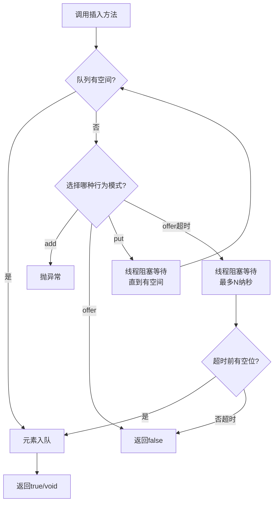
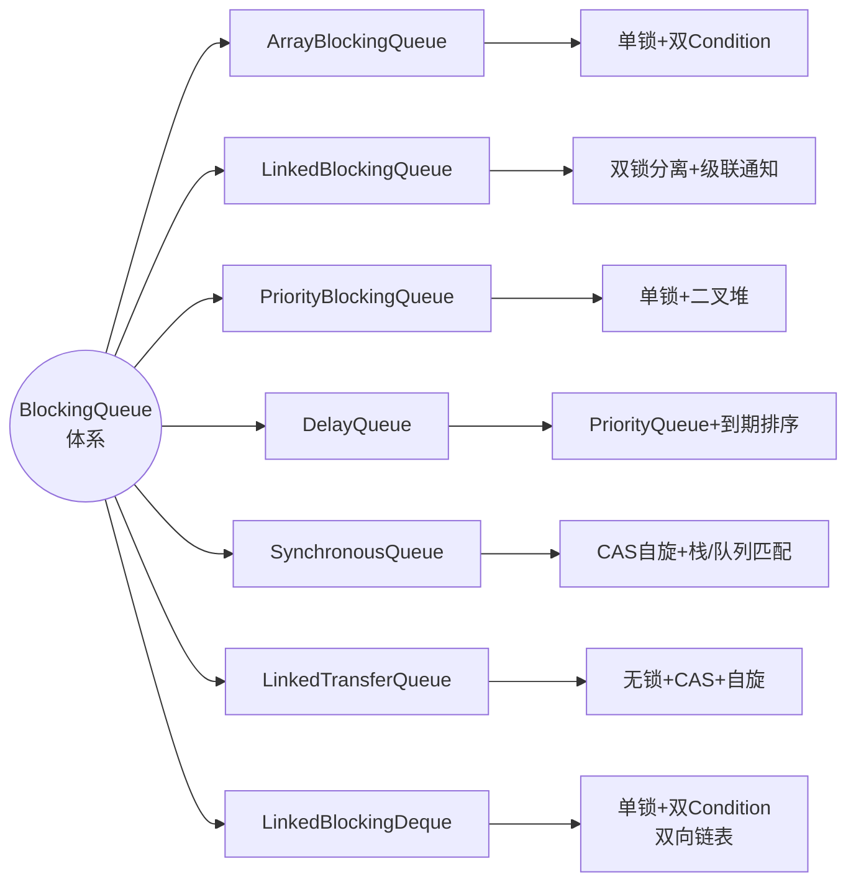
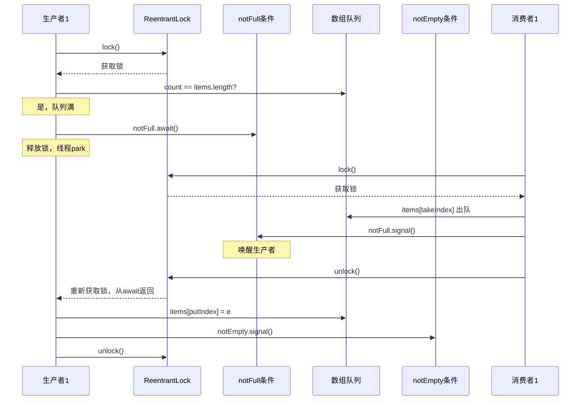
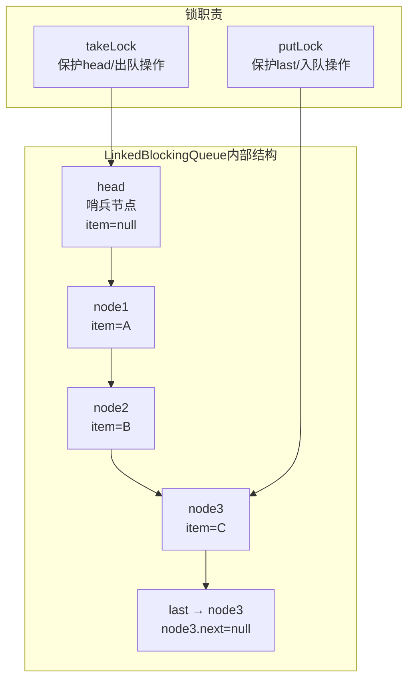
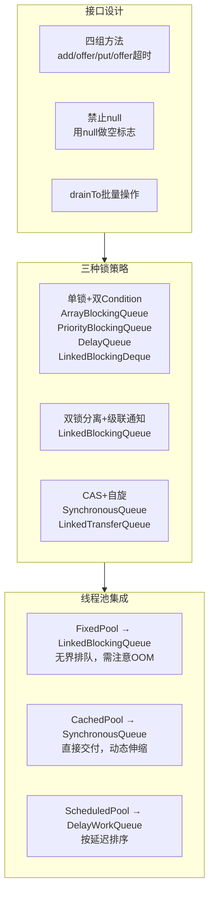

# BlockingQueue 设计解析

## 🤔 道格·李为什么需要一个阻塞队列接口

生产者-消费者模式是多线程编程里最常见的协作模型——一个（或多个）线程生产数据，另一个（或多个）线程消费数据。在 JUC 出现之前，Java 开发者只能用 `wait()` / `notify()` 手写这个模型。

手写版本的典型代码如下：

```java
public synchronized void put(E e) throws InterruptedException {
    while (list.size() == capacity) { wait(); }
    list.addLast(e);
    notifyAll();
}
```

这段代码表面正确，但道格·李在分析并发程序的常见错误时发现了几个根深蒂固的问题：

1. <strong>生产者唤醒生产者</strong>：`notifyAll()` 唤醒等待队列里的所有线程——包括生产者和消费者。当队列满时，多个生产者同时被唤醒，只有第一个能成功插入，其余又回到 wait。这些"无效唤醒"不是 Bug，但大量浪费 CPU
2. <strong>无法区分等待原因</strong>：所有线程在同一个条件队列上等待，生产者因为"队列满"而等，消费者因为"队列空"而等。`notifyAll()` 叫醒所有人，但被叫醒的线程可能发现条件仍不满足，继续睡——这就是为什么 `wait()` 必须放在 `while` 循环里
3. <strong>没有标准接口</strong>：每个项目都在重新发明这个轮子，而且各自的行为语义不一致——有的用 `null` 表示失败，有的抛异常，有的阻塞等待

道格·李的解决方案是两层的：<strong>接口层</strong>——`BlockingQueue` 接口定义了四组标准方法（抛异常、返回特殊值、阻塞、超时），统一了所有阻塞队列的行为契约。<strong>实现层</strong>——用 `ReentrantLock` 的两个 `Condition`（`notFull` 和 `notEmpty`）精确分离生产者与消费者的等待条件，让"队列满"只唤醒消费者，"队列空"只唤醒生产者，消除无效唤醒。

## 🚧 BlockingQueue 接口设计：四组方法的语义定义

BlockingQueue 接口最核心的设计决策在于： **同一操作提供四种不同的线程协作策略** ，以方法名区分行为，以返回类型区分语义。

| 行为模式 | 插入 | 移除 | 检查 | 语义 |
|---------|------|------|------|------|
| **抛异常** | `add(e)` | `remove()` | `element()` | 操作无法立即执行时抛出 `IllegalStateException` ，调用方需自行处理 |
| **返回特殊值** | `offer(e)` | `poll()` | `peek()` | 操作无法立即执行时返回 `false` 或 `null` ，调用方通过返回值判断是否成功 |
| **阻塞** | `put(e)` | `take()` | — | 操作无法立即执行时阻塞当前线程，直到条件满足，调用方被挂起 |
| **超时** | `offer(e, t, u)` | `poll(t, u)` | — | 操作无法立即执行时阻塞最多指定时长，超时返回 `false` 或 `null` |

<span style="color:red">四组方法的核心设计哲学是"让调用方选择等待策略而非被动接受"。</span> 同一个"放入元素"的需求，调用方可以根据业务场景选择：
- 快速失败（`add`）→ 用于必须保证容量、不允许等待的场景
- 非阻塞试探（`offer`）→ 用于"能放就放，放不了先干别的"的场景
- 必要时等待（`put`）→ 用于标准生产者-消费者模式
- 有限等待（`offer(e, timeout, unit)`）→ 用于不允许无限期等待但可以短暂容忍延迟的场景



BlockingQueue 还强制规定： **插入 null 时抛出 `NullPointerException`** 。这是因为 `null` 被 `poll()` / `peek()` 用作"队列为空"的返回值，如果允许插入 null，调用方将无法区分"取到了 null"和"队列为空"。

此外，BlockingQueue 还声明了 `drainTo(Collection, int)` 方法——批量将队列元素转移到另一个集合。这是一个 **一次性操作** ，要么取到 N 个元素，要么取到队列为空时的全部元素，不存在"取到一半又返回"的情况（除非异常）。

## ⚙️ 核心实现类总览

JUC 提供了 6 个核心 BlockingQueue 实现，外加一个 BlockingDeque 实现。它们在数据结构、锁策略、容量约束三个维度上各有取舍：



| 实现类 | 底层数据结构 | 锁机制 | 容量 | 关键特性 |
|-------|:---:|:---:|:---:|------|
| **ArrayBlockingQueue** | 数组（循环缓冲） | 单 `ReentrantLock` + 2 个 Condition | 有界（构造指定，不可变） | 公平性可选，FIFO |
| **LinkedBlockingQueue** | 单向链表 | 双 `ReentrantLock`（putLock + takeLock） | 可选有界（默认 Integer.MAX_VALUE） | 入队出队锁分离，高吞吐 |
| **PriorityBlockingQueue** | 数组二叉堆 | 单 `ReentrantLock` | 无界（自动扩容） | 按 `Comparable` 排序，不保证迭代顺序 |
| **DelayQueue** | PriorityQueue | 单 `ReentrantLock` | 无界 | 元素实现 `Delayed` ，到期才可取出 |
| **SynchronousQueue** | 无存储结构 | CAS 自旋 + 栈/队列 | 无容量 | 纯交付点，不存储元素 |
| **LinkedBlockingDeque** | 双向链表 | 单 `ReentrantLock` + 2 个 Condition | 可选有界 | 支持双端操作，工作窃取 |
| **LinkedTransferQueue** | 单向链表 | CAS + 自旋 | 无界 | `transfer()` 阻塞直到消费者取走 |

## 🚧 ArrayBlockingQueue 深度解析：单锁双 Condition 的经典模式

### 🏗️ 数据结构

ArrayBlockingQueue 使用 **循环数组** （circular array）存储元素，配合一把 **ReentrantLock** 🔒 和两个 **Condition** 🎛️ 实现阻塞/唤醒：

```java
public class ArrayBlockingQueue<E> extends AbstractQueue<E>
        implements BlockingQueue<E>, java.io.Serializable {
    final Object[] items;          // 底层数组
    int takeIndex;                 // 下次取元素的索引
    int putIndex;                  // 下次放元素的索引
    int count;                     // 当前元素数量
    final ReentrantLock lock;      // 唯一锁
    private final Condition notEmpty;  // 非空条件（消费者等待）
    private final Condition notFull;   // 非满条件（生产者等待）
}
```

`takeIndex` 和 `putIndex` 构成循环缓冲：当任一索引到达数组末尾，通过 `(index + 1) % items.length` 回到数组开头，避免移动元素。

### 🔄 put() 与 take() 流程



对应的源码实现：

```java
// ArrayBlockingQueue.put()
public void put(E e) throws InterruptedException {
    Objects.requireNonNull(e);
    final ReentrantLock lock = this.lock;
    lock.lockInterruptibly();
    try {
        while (count == items.length)
            notFull.await();           // ① 队列满时释放锁并阻塞
        enqueue(e);                    // ② 被唤醒后重新拿到锁，入队
    } finally {
        lock.unlock();
    }
}

private void enqueue(E e) {
    final Object[] items = this.items;
    items[putIndex] = e;               // ③ 放入元素
    if (++putIndex == items.length)
        putIndex = 0;                  // ④ 循环回绕
    count++;
    notEmpty.signal();                 // ⑤ 唤醒一个在 notEmpty 上等待的消费者
}
```

关键点：
- 第①行使用 `while` 而非 `if` 检查条件——防止虚假唤醒后 count 仍然满的情况下继续执行入队
- 第⑤行只调用 `signal()` 而非 `signalAll()`——每次只入队一个元素，只需唤醒一个消费者
- `lockInterruptibly()` 允许线程在阻塞期间响应中断，与 `synchronized` 下的 `wait()` 语义对等

```java
// ArrayBlockingQueue.take()
public E take() throws InterruptedException {
    final ReentrantLock lock = this.lock;
    lock.lockInterruptibly();
    try {
        while (count == 0)
            notEmpty.await();          // ① 队列空时释放锁并阻塞
        return dequeue();              // ② 被唤醒后重新拿到锁，出队
    } finally {
        lock.unlock();
    }
}

private E dequeue() {
    final Object[] items = this.items;
    @SuppressWarnings("unchecked")
    E e = (E) items[takeIndex];
    items[takeIndex] = null;           // ③ 帮助 GC
    if (++takeIndex == items.length)
        takeIndex = 0;                 // ④ 循环回绕
    count--;
    notFull.signal();                  // ⑤ 唤醒一个在 notFull 上等待的生产者
    return e;
}
```

将这两个方法与手动实现的 `wait()` / `notifyAll()` 对比：

| 维度 | 手动 wait/notifyAll | ArrayBlockingQueue |
|------|:---|:---|
| 等待条件分离 | 所有线程在同一个 wait set | 生产者等 `notFull` ，消费者等 `notEmpty` |
| 唤醒精度 | `notifyAll()` 唤醒所有人 | `signal()` 只唤醒一个目标线程 |
| 无效唤醒 | 存在（生产者唤醒生产者） | 不存在（条件明确分离） |
| 公平性 | 由 JVM 随机选，不可控 | 构造时可指定 `fair = true` ，锁按 FIFO 分配 |
| 中断响应 | `wait()` 响应中断 | `lockInterruptibly()` + `await()` 响应中断 |

## 🚧 LinkedBlockingQueue 深度解析：双锁分离与级联通知

LinkedBlockingQueue 的核心设计突破在于 **将入队锁和出队锁分离** ，让生产者和消费者可以同时操作队列的不同端。

### 🤔 为什么需要双锁

在 ArrayBlockingQueue 中， `put()` 和 `take()` 共享同一把锁。这意味着当一个消费者线程在执行 `take()` 时，生产者不能执行 `put()` ，即使队列有剩余空间。这种互斥在低到中等并发下可以接受，但在高并发场景下成为瓶颈。

LinkedBlockingQueue 的做法：用一个内部类 `Node` 构成单向链表，头部 `head` 始终指向一个值为 null 的哨兵节点（sentinel node），尾部 `last` 指向最后一个有效节点或哨兵节点。入队只改 `last` ，出队只改 `head` ，两个操作操作不同的指针，因此可以用两把锁分别保护。



### ⚙️ 核心源码与级联通知机制

```java
public class LinkedBlockingQueue<E> extends AbstractQueue<E>
        implements BlockingQueue<E>, java.io.Serializable {
    private final int capacity;                     // 容量（默认 Integer.MAX_VALUE）
    private final AtomicInteger count = new AtomicInteger();  // 当前元素数（原子变量）
    transient Node<E> head;                         // 哨兵节点
    private transient Node<E> last;                 // 尾节点
    private final ReentrantLock takeLock = new ReentrantLock();  // 出队锁
    private final Condition notEmpty = takeLock.newCondition();
    private final ReentrantLock putLock = new ReentrantLock();   // 入队锁
    private final Condition notFull = putLock.newCondition();
}
```

注意 `count` 是 **AtomicInteger** 而非普通的 `int`——因为入队和出队由不同锁保护，但 `count` 同时被两者读取，需要用原子变量保证可见性和一致增减。

下面是 `put()` 的源码：

```java
public void put(E e) throws InterruptedException {
    if (e == null) throw new NullPointerException();
    int c = -1;
    Node<E> node = new Node<E>(Objects.requireNonNull(e));
    final ReentrantLock putLock = this.putLock;
    final AtomicInteger count = this.count;
    putLock.lockInterruptibly();               // ① 获取入队锁
    try {
        while (count.get() == capacity) {
            notFull.await();                   // ② 满则等待
        }
        enqueue(node);                         // ③ 节点加入链表尾部
        c = count.getAndIncrement();           // ④ 原子自增，c 为入队前的 count
        if (c + 1 < capacity)
            notFull.signal();                  // ⑤ 入队后仍有余量，唤醒下一个生产者
    } finally {
        putLock.unlock();
    }
    if (c == 0)
        signalNotEmpty();                      // ⑥ 入队前队列为空，唤醒消费者
}
```

<span style="color:red">第④ ~ ⑥行是 LinkedBlockingQueue 核心的"级联通知"（cascading notification）逻辑：</span>

- 第④行： `c = count.getAndIncrement()` 用原子操作获取入队 **前** 的 count 值，c 代表"入队前队列中有多少元素"
- 第⑤行：如果入队后（`c + 1`）仍小于容量，说明还有空间，唤醒另一个等待入队的生产者——这是 **生产者到生产者的级联唤醒** ，避免只有最后一个生产者被唤醒而前面积压的线程一直等待
- 第⑥行：如果 `c == 0` ，说明入队前队列是空的，此时可能有消费者在 `notEmpty` 上等待。注意这个逻辑在 `putLock.unlock()` **之后** 执行——因为唤醒消费者需要获取 `takeLock` ，在释放 `putLock` 后再获取 `takeLock` ，可以避免嵌套锁和死锁

对应的 `take()` 源码：

```java
public E take() throws InterruptedException {
    E x;
    int c = -1;
    final AtomicInteger count = this.count;
    final ReentrantLock takeLock = this.takeLock;
    takeLock.lockInterruptibly();              // ① 获取出队锁
    try {
        while (count.get() == 0) {
            notEmpty.await();                  // ② 空则等待
        }
        x = dequeue();                         // ③ 从头部出队
        c = count.getAndDecrement();           // ④ 原子自减，c 为出队前的 count
        if (c > 1)
            notEmpty.signal();                 // ⑤ 出队后仍有元素，唤醒下一个消费者
    } finally {
        takeLock.unlock();
    }
    if (c == capacity)
        signalNotFull();                       // ⑥ 出队前队列是满的，唤醒生产者
    return x;
}
```

`take()` 的级联逻辑是对称的：
- `c > 1` 唤醒下一个消费者（消费者到消费者的级联）
- `c == capacity` 说明出队前队列是满的，必然有生产者在等待，唤醒一个生产者

> **级联通知本质上是** ：不依赖"每次操作后都唤醒对方"，而是让 **最后一个** 使条件满足的操作才去唤醒对方，中间的操作同侧级联传递，减少锁竞争和无效唤醒。

下面是两个具体的执行场景，帮助理解级联逻辑：

**场景一** ：队列已满（`count == capacity`），10 个生产者排队等待 `notFull` 。此时消费者取出 1 个元素：
- `c = count.getAndDecrement()` → `c == capacity` → `c != 0` 成立
- `c > 1` 不成立（只有一个空位），不唤醒下一个消费者
- `c == capacity` 成立！调用 `signalNotFull()` 唤醒 **一个** 生产者
- 生产者被唤醒，调用 `put()` ，入队后 `c`（入队前 count）= `capacity - 1`
- `c + 1 < capacity` 不成立（正好满），不唤醒下一个生产者
- 但 `c != 0` ，不唤醒消费者

这看起来只唤醒了一个生产者，队列又满了。但这就是级联通知的精妙之处：<span style="color:red">消费者每次取走一个元素，就唤醒一个生产者填入一个，供需逐次匹配，不会一次性唤醒 10 个生产者却只有 1 个能成功。</span>

**场景二** ：队列已空（`count == 0`），5 个消费者排队等待 `notEmpty` 。此时生产者放入 1 个元素：
- `c = count.getAndIncrement()` → `c == 0`
- `c + 1 < capacity` 成立（容量远大于 1），但当前没有其他生产者在等，signal 空操作
- `c == 0` 成立！调用 `signalNotEmpty()` 唤醒 **一个** 消费者
- 消费者取走后， `c`（出队前 count）= `1` ， `c > 1` 不成立，不唤醒下一个消费者
- 队列又空了，停止级联

同样，一次只放入一个元素，唤醒一个消费者取走，需求逐次匹配。

### 📊 ArrayBlockingQueue vs LinkedBlockingQueue 锁策略对比

| 维度 | ArrayBlockingQueue（单锁） | LinkedBlockingQueue（双锁） |
|------|:---|:---|
| 锁数量 | 1 把 ReentrantLock | 2 把 ReentrantLock（putLock + takeLock） |
| put 和 take 并发 | 互斥，无法并行 | 可并行执行 |
| 条件变量 | notFull / notEmpty 同锁 | notFull 绑定 putLock，notEmpty 绑定 takeLock |
| count 类型 | `int`（单锁保护，无需原子性） | `AtomicInteger`（双锁共享，需要原子变量） |
| 级联通知 | 不需要（signal 即可） | 需要（生产者→生产者，消费者→消费者） |
| 适用场景 | 低到中等并发，内存敏感的固定缓冲 | 高并发吞吐优先，但需注意默认无界风险 |

## 🔧 其他重要实现类

### ⚡ PriorityBlockingQueue：无界优先级队列

基于数组二叉堆（binary heap），每次 `take()` 取出优先级最高的元素（堆顶）。核心方法 `siftUpComparable` / `siftDownComparable` 维持堆序：

```java
// 入队：放入堆底，向上筛选
private static <T> void siftUpComparable(int k, T x, Object[] array) {
    Comparable<? super T> key = (Comparable<? super T>) x;
    while (k > 0) {
        int parent = (k - 1) >>> 1;         // 父节点索引
        Object e = array[parent];
        if (key.compareTo((T) e) >= 0)
            break;                           // 满足堆序，停止
        array[k] = e;                        // 父节点下沉
        k = parent;
    }
    array[k] = key;
}
```

由于无界， `put()` 永远不会阻塞（等同于 `offer()`），只有 `take()` 在队列空时阻塞。

### ⏰ DelayQueue：延迟队列

元素必须实现 `Delayed` 接口：

```java
public interface Delayed extends Comparable<Delayed> {
    long getDelay(TimeUnit unit);  // 返回剩余延迟时间
}
```

内部用 PriorityQueue 按到期时间排序。 `take()` 时只有检查到堆顶元素的 `getDelay()` ≤ 0 才出队返回；如果堆顶未到期， `take()` 用 `available.awaitNanos(delay)` 等待到期。

### 🔄 SynchronousQueue：零容量交付

SynchronousQueue 内部不存储任何元素。 `put()` 必须等待另一个线程的 `take()` ，反之亦然——它是一个线程间直接传递引用的汇合点。

底层根据公平性选择两种数据结构：
- **非公平（默认）** ：TransferStack，LIFO 栈，后到的线程先匹配
- **公平** ：TransferQueue，FIFO 队列，先到的线程先匹配

```java
// 经典用法：Executors.newCachedThreadPool() 使用 SynchronousQueue
public static ExecutorService newCachedThreadPool() {
    return new ThreadPoolExecutor(0, Integer.MAX_VALUE,
                                  60L, TimeUnit.SECONDS,
                                  new SynchronousQueue<Runnable>());
}
```

`CachedThreadPool` 中，每个新任务如果没有空闲线程去 `take()` ， `offer()` 就失败，线程池创建新线程。SynchronousQueue 在这里起到"只有有空闲线程时才接受任务"的阀门作用。

### 🔗 LinkedBlockingDeque：双端阻塞队列

实现 `BlockingDeque` 接口，支持 `putFirst` / `putLast` / `takeFirst` / `takeLast` 等双端操作。底层双向链表 + 单锁 + 两个 Condition。适合 **工作窃取** （work-stealing）模式：每个线程从自己的双端队列头部取任务，空闲线程从其他线程队列尾部窃取任务，减少竞争。

## 🏊 线程池中的 BlockingQueue：选型直接影响行为

BlockingQueue 的选择直接影响 `ThreadPoolExecutor` 的行为模式：

| 线程池 | 使用的队列 | 行为 |
|-------|:---|------|
| `Executors.newFixedThreadPool(n)` | `LinkedBlockingQueue`（无界） | 核心线程满后任务无限排队，永远不会创建超出核心数的线程 |
| `Executors.newCachedThreadPool()` | `SynchronousQueue` | 无排队能力，每个任务都要有线程处理，空闲线程回收后动态伸缩 |
| `Executors.newSingleThreadExecutor()` | `LinkedBlockingQueue`（无界） | 所有任务严格 FIFO 串行执行 |
| `Executors.newScheduledThreadPool(n)` | `DelayWorkQueue`（类似 DelayQueue） | 按延迟时间排序执行 |

<span style="color:red">使用 `newFixedThreadPool` 时最常见的陷阱：</span> 它的默认队列是 `LinkedBlockingQueue()`（无界），当任务提交速率远大于处理速率时，任务在队列中无限堆积，最终导致 OOM。正确做法是显式传入有界队列：

```java
// 错误：队列无界，可能导致 OOM
ExecutorService pool1 = Executors.newFixedThreadPool(10);

// 正确：显式指定有界队列 + 拒绝策略
ExecutorService pool2 = new ThreadPoolExecutor(
    10, 20, 60L, TimeUnit.SECONDS,
    new ArrayBlockingQueue<>(1000),     // 有界队列
    new ThreadPoolExecutor.CallerRunsPolicy()
);
```

## 🛠️ 日常开发中的常用方法

| 方法 | 用途 | 频率 |
|------|------|:---:|
| `BlockingQueue.put(E e)` | 阻塞式入队，队列满时等待 | 高 |
| `BlockingQueue.take()` | 阻塞式出队，队列空时等待 | 高 |
| `BlockingQueue.offer(E e)` | 非阻塞入队，立即返回是否成功 | 高 |
| `BlockingQueue.poll()` | 非阻塞出队，立即返回元素或 null | 高 |
| `BlockingQueue.offer(E, long, TimeUnit)` | 带超时的入队 | 中 |
| `BlockingQueue.poll(long, TimeUnit)` | 带超时的出队 | 中 |
| `BlockingQueue.drainTo(Collection)` | 批量排出所有元素 | 中 |
| `BlockingQueue.remainingCapacity()` | 返回剩余容量 | 低 |

### 🏭 标准生产者-消费者

```java
BlockingQueue<Task> queue = new ArrayBlockingQueue<>(100);

// 生产者
new Thread(() -> {
    while (true) {
        Task t = produce();
        queue.put(t);  // 满时自动阻塞，无需手动 wait
    }
}).start();

// 消费者
new Thread(() -> {
    while (true) {
        Task t = queue.take();  // 空时自动阻塞
        t.execute();
    }
}).start();
```

### 🏃 多消费者竞争消费

```java
BlockingQueue<Task> queue = new LinkedBlockingQueue<>(1000);
int consumerCount = 4;
for (int i = 0; i < consumerCount; i++) {
    new Thread(() -> {
        while (true) {
            Task t = queue.poll(2, TimeUnit.SECONDS);  // 超时后返回 null
            if (t != null) {
                t.execute();
            } else {
                // 2 秒没任务，可以做清理或心跳检测
                heartbeat();
            }
        }
    }).start();
}
```

### 📥 drainTo 批量消费

```java
List<Task> batch = new ArrayList<>(50);
queue.drainTo(batch, 50);  // 一次取走最多 50 个
for (Task t : batch) {
    t.execute();  // 批量处理，减少每次加锁开销
}
```

## 🎯 总结



| 设计问题 | 答案 |
|---------|------|
| 为什么有四组方法 | 让调用方选择等待策略（抛异常/返回特殊值/阻塞/超时），而非硬编码一种行为 |
| 为什么禁止插入 null | `poll()` / `peek()` 用 null 表示队列为空，允许 null 将无法区分 |
| ArrayBlockingQueue 为什么用单锁 | 设计简单，循环数组 + 单锁实现对低到中等并发足够，且支持公平性 |
| LinkedBlockingQueue 为什么用双锁 | 入队和出队操作链表的不同端，用不同锁保护可实现并行，提升高并发吞吐 |
| 级联通知解决什么问题 | 避免每次操作都跨锁唤醒对方（需要嵌套锁），而是同侧级联传递，仅在边界条件跨侧唤醒 |
| SynchronousQueue 为什么不存储元素 | 设计目标就是"交付"而非"缓存"——线程间的直接传递比先放入再取出少一次数据拷贝 |
| 线程池为什么默认用无界队列 | 历史原因：JDK 5 时期的设计认为任务排队优于拒绝。现在推荐显式指定有界队列 |

