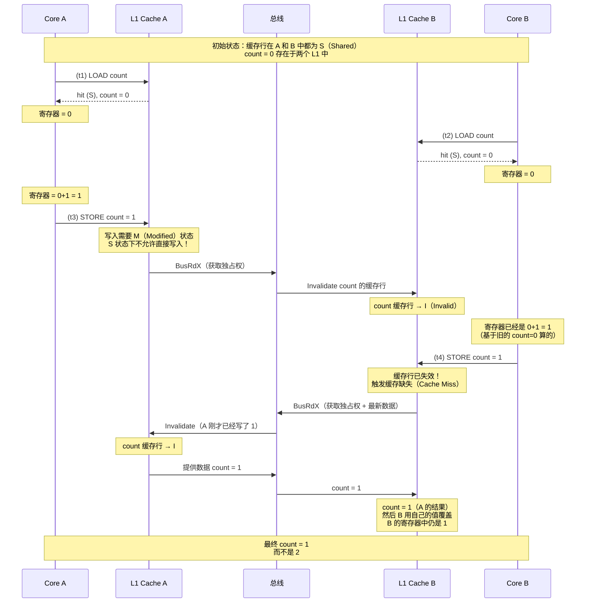
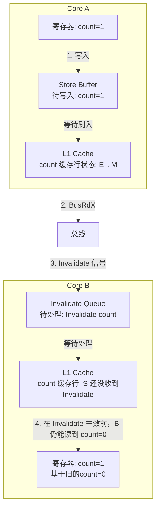
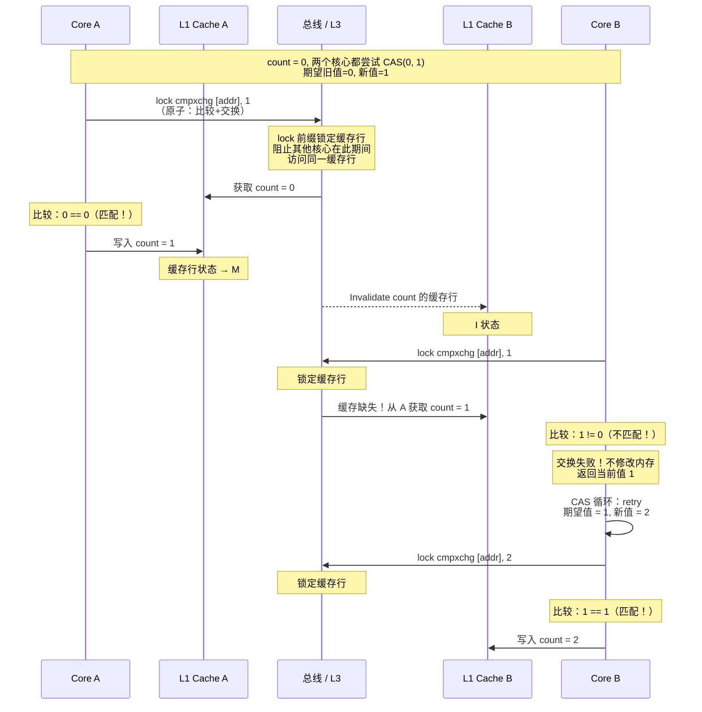
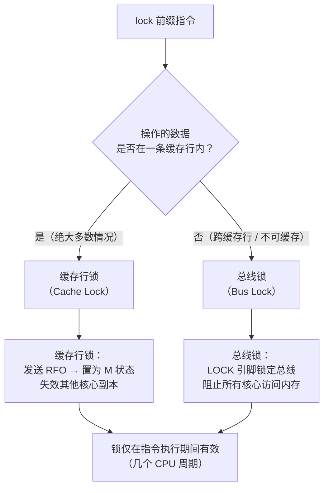
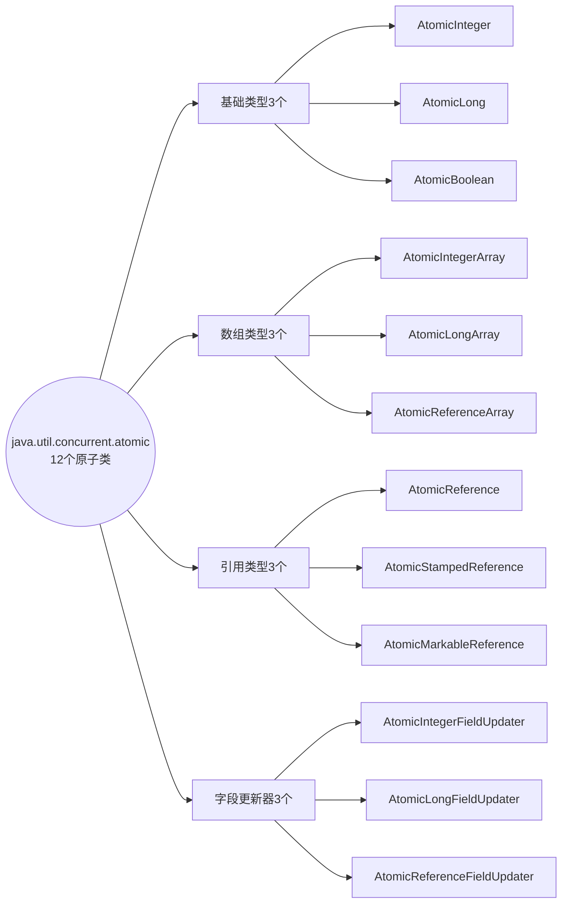
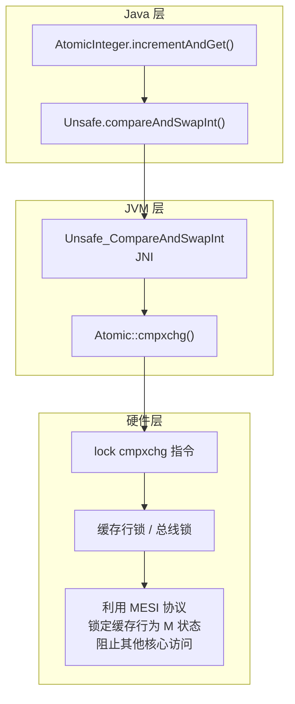

# CAS 从硬件到 Java

## 🤔 一、Intel 的工程师为什么要给 CPU 加一条 `lock cmpxchg` 指令

多线程编程中最基础的问题——`count++` 不是原子操作。Java 层面它是三条字节码，CPU 层面它是 "LOAD → ADD → STORE" 三条指令。两个核心同时执行，结果必然互相覆盖。

一种解决思路是加锁——`synchronized` 把整个 `count++` 包住，一次只有一个线程执行。但锁的代价高：上下文切换、线程阻塞/唤醒、内核态切换。高竞争场景下，线程在等待锁上花的时间可能比干活的时间还多。

有没有办法**不阻塞线程、靠硬件指令**实现原子更新？Intel 的 CPU 架构师提供了一个答案：`lock cmpxchg`（Compare and Swap）指令。它将"比较旧值→如果匹配就写新值"这个过程变成一条不可分割的 CPU 指令，配合 `lock` 前缀锁定总线（或缓存行），保证同一时刻只有一个核心能成功操作该内存地址。

这个思路的妙处在于：**把"锁"从软件层（JVM / OS Mutex）下沉到硬件层（CPU 缓存一致性协议）**。失败重试的代价只是几个 CPU 周期，不死锁、不阻塞、不切换上下文。道格·李在 JUC 中大量依赖 CAS 来构建无锁数据结构——`ConcurrentHashMap` 的 bucket 写入、`ConcurrentLinkedQueue` 的节点插入、AQS 的 state 更新，底层全是 CAS。

本文从 CAS 的硬件原理开始，一直讲到 Java 的 12 个原子类。

## 🏗️ 二、MESI 视角：为什么硬件需要 CAS

### 🏗️ 2.1 两个 CPU 同时写一个变量——MESI 的"竞速"

从 MESI 协议的角度重新审视 `i++` 的三条指令。假设两个 CPU 核心（Core A 和 Core B）同时尝试对同一地址执行 `++`：



关键点：<span style="color:red">MESI 协议保证了缓存一致性（所有核心最终看到一致的数据），但没有保证读-改-写（LOAD → ADD → STORE）三步的原子性。</span> 两个核心可以同时处于步骤 (1)（LOAD 阶段），读到相同的值，然后各自独立完成 ADD 和 STORE。

问题出在 LOAD 和 STORE 之间有"时间窗口"——在这个窗口内，另一个核心也完成了 LOAD。这就是 **竞态条件** 。

### 📦 2.2 为什么不能只靠 MESI 解决——Store Buffer 的滞后效应

情况在加入 Store Buffer 后更糟。回顾之前讲的 Store Buffer：写操作不是立即到达 L1 Cache，而是先暂存在 Store Buffer 中：



Core A 把 `store count=1` 放入 Store Buffer 后，需要通过 BusRdX 获取独占权。从发出 BusRdX 到 Invalidate 信号到达 Core B 并被 Core B 处理完，这之间有一个时间差。在这个时间差内，<span style="color:red">Core B 仍然可以读到自己 L1 中 count=0 的旧值。</span>

这就是为什么需要一种机制， **将 LOAD 和 STORE 绑定成一个不可分割的整体** ——要么 LOAD 到 STORE 之间不被任何其他核心插入，要么 STORE 阶段能检测到"在我读之后，有其他核心改过这个值"。

### 📌 2.3 CAS 的硬件答案：`lock cmpxchg`

在 x86 架构上，CAS 通过 `lock cmpxchg` 指令实现。`cmpxchg`（Compare and Exchange）本身是一条指令，加上 `lock` 前缀（锁定总线或缓存行），这条指令就变成了原子操作。



`lock cmpxchg` 由两个关键部分组成：

| 组成部分            | 作用                                                                                                                                                                     |
| ------------------- | ------------------------------------------------------------------------------------------------------------------------------------------------------------------------ |
| **cmpxchg**   | 单条指令完成"比较 + 交换"：如果 `[addr]` 的值等于 `expected`（存在 EAX/AX/AL 寄存器中），则将 `new` 写入 `[addr]`；否则将 `[addr]` 的当前值加载到 EAX 寄存器中 |
| **lock 前缀** | 在指令执行期间锁定总线或缓存行，保证该指令对内存的读-改-写操作不会被其他 CPU 核心打断                                                                                    |

### 🔒 2.4 总线锁 vs 缓存行锁

`lock` 前缀在不同场景下的实现方式不同：



| 锁类型             | 触发条件                                                   |     粒度     | 对其他核心的影响               |
| ------------------ | ---------------------------------------------------------- | :----------: | ------------------------------ |
| **缓存行锁** | 操作的数据完全在一条 64 字节的缓存行内（且内存区域可缓存） |  单条缓存行  | 只影响试图访问同一缓存行的核心 |
| **总线锁**   | 操作的数据跨缓存行边界、或内存区域不可缓存（如 MMIO）      | 整个系统总线 | 所有核心都无法访问任何内存地址 |

现代 x86 CPU 上，绝大多数 CAS 操作都走缓存行锁——开销远小于总线锁。在 `lock cmpxchg` 执行期间，该缓存行被 Core A 置为 M 状态且锁定。Core B 如果试图访问同一地址，MESI 协议会让 Core B 等待，直到 Core A 的 `lock cmpxchg` 执行完毕。

这揭示了 CAS 的本质：<span style="color:red">CAS 是一条硬件提供的原子指令，它在执行期间通过缓存行锁（MESI 协议扩展）阻止其他核心访问同一内存地址，从而将"读-比较-写"三步打包成一个不可分割的操作。</span>

## 三、从硬件到 Java：Unsafe 中的 CAS

### 📌 3.1 Unsafe.compareAndSwapInt

Java 的 CAS 能力来自 `sun.misc.Unsafe` 类。它提供了三个核心 native 方法：

```java
// Unsafe.java
public final native boolean compareAndSwapInt(
    Object o, long offset,  // o + offset = 目标内存地址
    int expected,           // 期望的旧值
    int x                   // 要设置的新值
);

public final native boolean compareAndSwapLong(Object o, long offset, long expected, long x);

public final native boolean compareAndSwapObject(
    Object o, long offset,
    Object expected,
    Object x
);
```

这三个方法的 native 实现在 HotSpot 源码 `unsafe.cpp` 中，最终调用 `Atomic::cmpxchg()`，在 x86 上编译为 `lock cmpxchg` 指令。

调用链：`Unsafe.compareAndSwapInt()` → `Unsafe_CompareAndSwapInt` (JNI) → `Atomic::cmpxchg()` → `__asm__ lock cmpxchg`

```cpp
// hotspot/src/share/vm/runtime/atomic.cpp（简化）
// x86 上的 Atomic::cmpxchg 内联汇编
inline jint Atomic::cmpxchg(jint exchange_value,
                             volatile jint* dest,
                             jint compare_value) {
    __asm__ volatile (
        "lock cmpxchgl %1, (%3)"   // lock cmpxchg [dest], exchange_value
        : "=a" (exchange_value)     // 输出：EAX = 旧值（如果CAS失败）
        : "r" (exchange_value),     // 输入1：新值
          "a" (compare_value),      // 输入2：期望值 → EAX
          "r" (dest)                // 输入3：目标地址
        : "cc", "memory"            // 告诉编译器：修改了条件码和内存
    );
    return exchange_value;
}
```

关键要点：`cmpxchg` 指令隐藏比较逻辑——CPU 内部将 EAX（期望值）与 `[dest]`（内存中的当前值）比较。如果相等，ZF 标志位置 1，将新值写入 `[dest]`；如果不相等，ZF 置 0，将 `[dest]` 的当前值加载到 EAX。Java 层通过判断返回值是否等于 `expected` 来确定 CAS 是否成功。

## ⚛️ 四、12 个原子类：完整体系与使用

JDK 的 `java.util.concurrent.atomic` 包提供了 12 个原子类，分为四组：



### 📋 4.1 基础类型（AtomicInteger / AtomicLong / AtomicBoolean）

这是最常用的三个类，提供了对单一 `int`、`long`、`boolean` 值的原子操作。

**核心 API** （以 AtomicInteger 为例）：

| 方法                                           | 说明                      | CAS 等价伪代码                                                         |
| ---------------------------------------------- | ------------------------- | ---------------------------------------------------------------------- |
| `get()`                                      | 返回当前值                | 直接读 `volatile int value`                                          |
| `set(int newVal)`                            | 设置新值                  | 直接写 `volatile int value`                                          |
| `compareAndSet(expected, newVal)`            | CAS 原语                  | `if (value==expected) { value=newVal; return true; } return false;`  |
| `getAndSet(int newVal)`                      | 设新值，返回旧值          | CAS 循环直到成功                                                       |
| `incrementAndGet()`                          | `++i`（原子版）         | CAS 循环：`do { cur=get(); } while(!cas(cur, cur+1)); return cur+1;` |
| `getAndIncrement()`                          | `i++`（原子版）         | 同上，返回旧值                                                         |
| `decrementAndGet()`                          | `--i`（原子版）         | CAS 循环                                                               |
| `getAndDecrement()`                          | `i--`（原子版）         | CAS 循环                                                               |
| `addAndGet(int delta)`                       | `i += delta`（原子版）  | CAS 循环                                                               |
| `getAndAdd(int delta)`                       | 同上，返回旧值            | CAS 循环                                                               |
| `updateAndGet(IntUnaryOperator)`             | 自定义算术（Java 8+）     | CAS 循环执行 `operator.apply(cur)`                                   |
| `accumulateAndGet(int x, IntBinaryOperator)` | 自定义二元运算（Java 8+） | CAS 循环执行 `operator.apply(cur, x)`                                |

**日常用法** ：

```java
// 1. 线程安全的计数器
AtomicInteger counter = new AtomicInteger(0);
counter.incrementAndGet();   // 原子 +1，返回新值
counter.getAndIncrement();   // 原子 +1，返回旧值
counter.addAndGet(5);        // 原子 +5，返回新值

// 2. 线程安全的标志位
AtomicBoolean flag = new AtomicBoolean(false);
if (flag.compareAndSet(false, true)) {
    // 只有一个线程能进入这里（从 false → true 只生效一次）
    doExclusiveWork();
}

// 3. 自定义原子更新（Java 8+）
AtomicInteger ai = new AtomicInteger(10);
ai.updateAndGet(x -> x * 2);      // 原子 ×2，返回 20
ai.accumulateAndGet(3, (a, b) -> a + b);  // 原子 +3，返回 23

// 4. 高性能序号生成器
class SequenceGenerator {
    private final AtomicLong seq = new AtomicLong(0);
    public long next() {
        return seq.incrementAndGet();
    }
}
```

**AtomicLong 与 AtomicBoolean** 的 API 与 AtomicInteger 高度一致。AtomicBoolean 内部也是用 `int` 实现（`0` = false, `1` = true），提供的核心方法除了 `compareAndSet` 外，还包括 `getAndSet` 和 `lazySet`。

### 📋 4.2 数组类型（AtomicIntegerArray / AtomicLongArray / AtomicReferenceArray）

这三个类提供对数组元素的原子操作。与基础类型的关键区别： **操作的是数组的某个索引位置** 。

**核心 API** （以 AtomicIntegerArray 为例）：

| 方法                                               | 说明                           |
| -------------------------------------------------- | ------------------------------ |
| `AtomicIntegerArray(int length)`                 | 创建指定长度的数组，初始值全 0 |
| `AtomicIntegerArray(int[] array)`                | 从已有数组复制创建             |
| `get(int i)`                                     | 返回索引 i 的值                |
| `set(int i, int newVal)`                         | 设置索引 i 的值                |
| `compareAndSet(int i, int expected, int newVal)` | 对索引 i 做 CAS                |
| `incrementAndGet(int i)`                         | `arr[i]++`（原子版）         |
| `addAndGet(int i, int delta)`                    | `arr[i] += delta`（原子版）  |

```java
// 并发环境下的多计数器
class MultiCounter {
    private final AtomicIntegerArray counters = new AtomicIntegerArray(10);

    public void increment(int id) {
        counters.incrementAndGet(id % 10);  // 原子操作数组的某个槽
    }

    public int get(int id) {
        return counters.get(id % 10);
    }
}
```

注意：<span style="color:red">数组本身引用是不变的，但数组元素的修改是原子的。</span> AtomicIntegerArray 内部通过 `Unsafe` 计算每个元素的偏移地址，对单个元素执行 CAS。

### 📋 4.3 引用类型（AtomicReference / AtomicStampedReference / AtomicMarkableReference）

这三个类提供对 **引用类型** （对象）的原子操作。

#### 📌 AtomicReference

最基本的引用原子类，可以原子地更新一个对象引用：

```java
// 线程安全的对象更新
class ConcurrentStack<T> {
    private final AtomicReference<Node<T>> top = new AtomicReference<>(null);

    public void push(T value) {
        Node<T> newNode = new Node<>(value);
        Node<T> oldTop;
        do {
            oldTop = top.get();          // 读取当前栈顶
            newNode.next = oldTop;        // 新节点的 next 指向旧栈顶
        } while (!top.compareAndSet(oldTop, newNode));  // CAS 更新栈顶
    }

    public T pop() {
        Node<T> oldTop;
        Node<T> newTop;
        do {
            oldTop = top.get();
            if (oldTop == null) return null;
            newTop = oldTop.next;
        } while (!top.compareAndSet(oldTop, newTop));
        return oldTop.value;
    }
}
```

#### 🏷️ AtomicStampedReference——解决 ABA 问题

**ABA 问题** 是 CAS 最经典的陷阱：一个值从 A 变成 B，又变回 A，CAS 检测不到中间的变化。

```java
// ABA 问题演示
AtomicReference<String> ref = new AtomicReference<>("A");

// 线程1: 执行 CAS("A", "C") —— 刚开始
// 线程2: 执行 CAS("A", "B") → 成功，ref = "B"
// 线程2: 执行 CAS("B", "A") → 成功，ref = "A"
// 线程1: CAS("A", "C") → 成功！（但 ref 已经被修改过两次）
```

AtomicStampedReference 在引用基础上附加了一个 **版本号（stamp）** ，每次更新 stamp +1，从而区分"A（v1）"和"A（v2）"：

```java
AtomicStampedReference<String> ref = new AtomicStampedReference<>("A", 0);
int[] stampHolder = new int[1];

// 线程1:
String current = ref.get(stampHolder);        // current="A", stamp=0
int stamp = stampHolder[0];
// ... 其他线程可能已经经历了 A→B→A，stamp 变成 2 ...
boolean ok = ref.compareAndSet("A", "C", stamp, stamp + 1);  // 失败！stamp不匹配
```

#### 🚩 AtomicMarkableReference——简化版的标记引用

AtomicMarkableReference 只用 1 个 `boolean` 标记（而非 int stamp），适用于"一次性"状态标记（如"是否已删除"）：

```java
AtomicMarkableReference<Node> ref = new AtomicMarkableReference<>(node, false);
boolean[] markHolder = new boolean[1];

Node current = ref.get(markHolder);
boolean marked = markHolder[0];
// 尝试标记为"已删除"
ref.compareAndSet(current, current, false, true);  // 引用不变，只改标记
```

### 📌 4.4 字段更新器（AtomicIntegerFieldUpdater / AtomicLongFieldUpdater / AtomicReferenceFieldUpdater）

这三个类是"轻量级"原子类——它们不创建新的原子对象，而是 **把已有对象中的某个 volatile 字段"升级"为原子操作** 。这在需要原子操作大量对象中的字段时节省内存：

```java
class Player {
    volatile int score;        // 必须 volatile，不能 private
    // 其他很多字段...
}

// 全局只创建一个 Updater，对所有 Player 实例的 score 字段做原子操作
class GameRoom {
    private static final AtomicIntegerFieldUpdater<Player> SCORE_UPDATER =
        AtomicIntegerFieldUpdater.newUpdater(Player.class, "score");

    public void addScore(Player p, int delta) {
        SCORE_UPDATER.addAndGet(p, delta);  // 原子 p.score += delta
    }
}
```

**约束条件** ：

| 要求                        | 说明                                                 |
| --------------------------- | ---------------------------------------------------- |
| 目标字段必须是 `volatile` | CAS 依赖 volatile 的内存语义                         |
| 目标字段不能是 `private`  | Updater 使用反射访问字段                             |
| 目标字段不能是 `static`   | Updater 只能更新实例字段                             |
| 类型必须匹配                | `AtomicIntegerFieldUpdater` 不能用于 `long` 字段 |

**适用场景** ：当有大量对象每个都需要原子更新某个字段时，用 Updater 比每个对象持有一个 AtomicInteger 更省内存（内存中少了几万个对象引用）。

### 🎯 4.5 12 个类的选型速查

| 场景                    | 使用哪个类                         | 示例                         |
| ----------------------- | ---------------------------------- | ---------------------------- |
| 单计数器                | `AtomicInteger` / `AtomicLong` | 请求计数、序列号生成         |
| 布尔标志位              | `AtomicBoolean`                  | "是否已初始化"、"是否已关闭" |
| 多计数器（数组）        | `AtomicIntegerArray`             | 分片计数器、按哈希槽统计     |
| 引用型链表/栈的节点更新 | `AtomicReference`                | 无锁栈、无锁队列             |
| 需要防止 ABA 的引用更新 | `AtomicStampedReference`         | 无锁链表的节点删除           |
| 一次性标记的引用        | `AtomicMarkableReference`        | 逻辑删除标记                 |
| 大量对象的字段原子更新  | `AtomicIntegerFieldUpdater` 等   | 游戏玩家分数、缓存命中计数   |

## 🔄 五、CAS 的核心问题与应对

### ❓ 5.1 ABA 问题

| 维度               | 说明                                                                                             |
| ------------------ | ------------------------------------------------------------------------------------------------ |
| **定义**     | 值从 A 变为 B 再变回 A。CAS 只检查"值是否还是 A"——它确实是，但中间经历过其他状态               |
| **危险场景** | 无锁栈的 pop：线程 T1 读到 top=A，T2 弹出 A 再弹出 B 再把 A 推回去。T1 的 CAS 成功，但栈已经变了 |
| **解决方案** | `AtomicStampedReference`（版本号递增）或 `AtomicMarkableReference`（布尔标记）               |

### 📌 5.2 自旋开销

CAS 更新失败时会重试（while 循环）。在 <span style="color:red">高竞争</span> 场景下，大量线程同时 CAS 循环会消耗大量 CPU：

```java
// 高竞争时的 CAS 自旋——CPU 空转
AtomicInteger counter = new AtomicInteger(0);
// 10 个线程同时调用 10000 次
for (int i = 0; i < 10000; i++) {
    counter.incrementAndGet();  // 每次 CAS 失败就重试
}
```

**JDK 8 的解决方案——LongAdder** （不在 12 个原子类中，但密切相关）：

```java
// LongAdder 将竞争分散到多个 Cell
LongAdder adder = new LongAdder();
// 10 个线程同时调用
adder.increment();     // 热点分散到不同 Cell，最后 sum() 汇总
```

LongAdder 在高竞争下性能显著优于 AtomicLong，但代价是 `sum()` 不是快照一致性的（sum 计算过程中可能有新写入）。

### 📌 5.3 不能保证多个变量的原子性

CAS 一次只能操作一个变量。如果需要原子地更新两个变量（如"余额-100 且 积分+100"），CAS 做不到。此时只能用 `synchronized` 或 `ReentrantLock`。

| 需求                           | 适用工具                                   |
| ------------------------------ | ------------------------------------------ |
| 单个 int/long/boolean 原子更新 | AtomicInteger / AtomicLong / AtomicBoolean |
| 单个引用原子更新               | AtomicReference 系列                       |
| 多个变量的原子更新             | `synchronized` / `ReentrantLock`       |

## 🎯 六、总结

CAS 的完整链路，从硬件到 Java：



| 层级                     | 做了什么                       | 如何保证原子性                                                                                                   |
| ------------------------ | ------------------------------ | ---------------------------------------------------------------------------------------------------------------- |
| **硬件（x86）**    | `lock cmpxchg` 指令          | `lock` 前缀触发缓存行锁，执行期间 MESI 协议阻止其他核心访问同一缓存行                                          |
| **JVM（HotSpot）** | `Atomic::cmpxchg()` 内联汇编 | 将 Java 的方法调用翻译为 `lock cmpxchg`，处理不同平台的指令差异（x86: `lock cmpxchg`, ARM: `ldrex/strex`） |
| **Java（原子类）** | `AtomicInteger` 等           | CAS + while 循环，失败时重试。将单次 CAS 包装成 `incrementAndGet` 等语义明确的方法                             |

CAS 不是无成本的——高竞争下 CAS 自旋的 CPU 开销可能超过 synchronized 的阻塞开销。但在低到中等竞争的计数器、标志位、无锁数据结构的场景中，CAS 消除了锁的上下文切换开销，是轻量级原子操作的首选。

12 个原子类的选择原则：基础类型用于单一计数器/标志位，数组类型用于分片统计，引用类型用于无锁数据结构，Updater 用于大量对象中的 volatile 字段原子更新。
