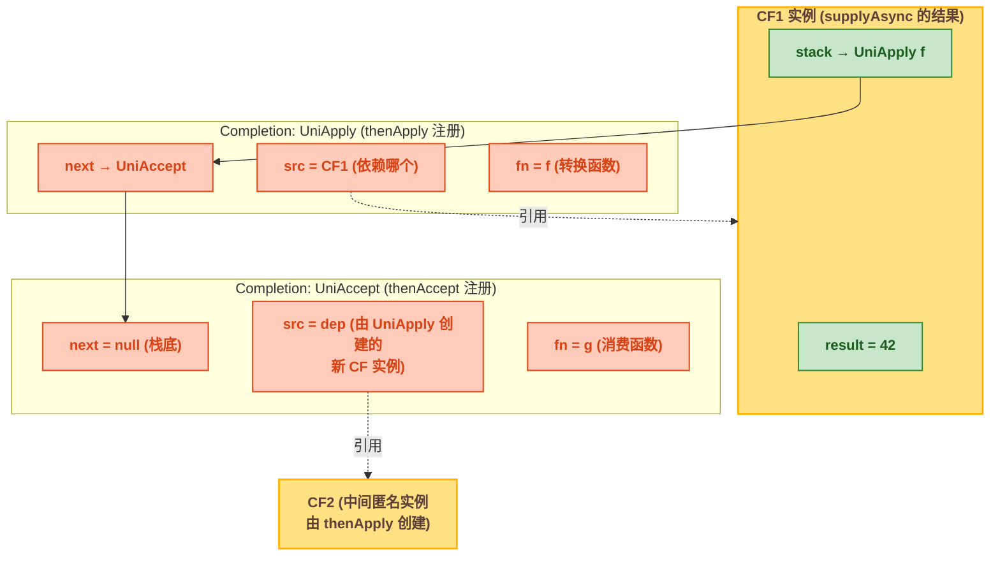
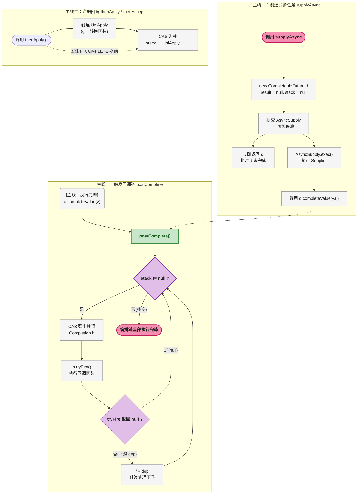
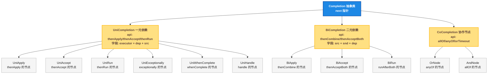
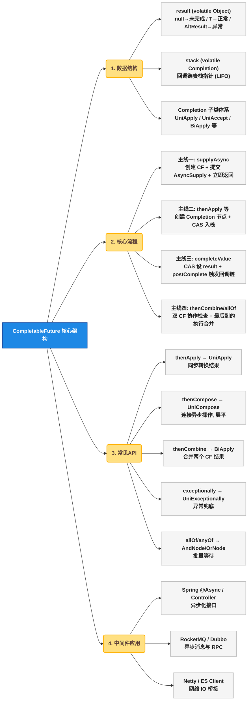

# CompletableFuture 异步编排：Completion 链表与多中间件应用全解析

## 🤔 一、道格·李为什么需要比 Future 更强大的异步工具

Java 5 引入了 `Future` 接口和 `FutureTask` 实现，解决了"异步执行、获取返回值"的基础需求。到 Java 7 时代，`Future` 的局限已经非常明显：它只是一个结果的容器，<strong>没有回调机制</strong>——你不能在结果就绪时自动触发下一步操作，只能调用 `get()` 阻塞等待。

这在简单的"提交任务→等待结果"场景中够用，但面对以下需求时完全无力：
1. <strong>链式编排</strong>：A 的结果作为 B 的输入，B 完成后触发 C。用 `Future` 只能嵌套 `get()`，代码缩进越来越深
2. <strong>多结果组合</strong>：等 A、B、C 三个结果全部就绪后做汇总。用 `Future` 只能逐个 `get()`，最慢的那个决定了总耗时
3. <strong>异常传播</strong>：`Future.get()` 把异常包装成 `ExecutionException`，调用方需要捕获后 `getCause()`——异常处理散落在各处

道格·李在设计 `CompletableFuture`（Java 8 引入）时参考了 JavaScript 的 Promise 模式和函数式编程中的 monad 概念。核心思路是：<strong>把异步计算的结果建模为一条流水线</strong>——每个阶段接受上一个阶段的输出，产生下一个阶段的输入，阶段之间通过回调串联。这样开发者不需要手动管理线程和等待，只需要"声明"各个步骤之间的关系：

```java
// 声明式：订单+用户拼好，再拼优惠券
orderFuture.thenCombine(userFuture, this::mergeOrderUser)
           .thenCombine(couponFuture, this::assembleFinal);
```

`CompletableFuture` 的革新在于把异步编程从"命令式等结果"推到了"声明式编排"——关心的不是什么时候拿到结果，而是结果拿到之后要做什么。

## 🔮 二、数据结构：CompletableFuture 内部长什么样

### ⚙️ 2.1 核心字段

从 JDK 源码中看 `CompletableFuture<T>` 的结构定义（Java 8，`java.util.concurrent.CompletableFuture`）：

```java
public class CompletableFuture<T> implements Future<T>, CompletionStage<T> {
    volatile Object result;       // 1. 计算结果（或异常信息 AltResult）
    volatile Completion stack;    // 2. 依赖此 CF 的回调链表（栈结构）
    // ... 省略其他
}
```

`result` 和 `stack` 两个字段撑起了整个异步编排体系：

| 字段 | 类型 | 作用 | 可能的实际类型 |
|------|------|------|-------------|
| `result` | `volatile Object` | 持有最终计算结果 | `null`（未完成）、`T`（正常结果）、`AltResult`（异常/取消） |
| `stack` | `volatile Completion` | 回调链表头指针（栈顶） | `UniApply`、`BiApply`、`CoCompletion` 等 Completion 子类 |

> ⚠️ 新手提示：`result` 类型是 `Object` 而非 `T`，因为 `T` 在运行期会被擦除（Type Erasure，Java 泛型编译后 `T` 变成 `Object`）。实际存的值要么是正常结果 `T`，要么是 `AltResult`（包装异常信息）。`null` 表示任务尚未完成。

`AltResult` 是 `Completion` 的静态内部类，只做一件事——把异常包一层：

```java
static final class AltResult {
    final Throwable ex;  // 异常对象
    AltResult(Throwable x) { this.ex = x; }
}
```

### 📌 2.2 Completion —— 回调链的基石

`Completion` 是一个抽象基类，所有"等待当前 CF 完成后要执行的动作"都是它的子类。字段只有两个：

```java
abstract static class Completion extends ForkJoinTask<Void>
    implements Runnable, AsynchronousCompletionTask {
    volatile Completion next;  // 链表指针：下一个 Completion 节点
    // 没有 prev，所以是单向链表（实际是栈）
}
```

关键信息：
- 继承 `ForkJoinTask<Void>`：兼容 ForkJoinPool 调度
- 实现 `Runnable`：可以投递到线程池执行
- `next` 单向指针：`stack` 不是队列而是 **栈** （LIFO，后进先出），新注册的回调压到栈顶，触发时逐个弹出执行

下面用 Mermaid 图直观展示 `supplyAsync(...).thenApply(f).thenAccept(g)` 后的内部链表结构：



**要点**：
- `stack` 是一条以 `Completion.next` 串联的单链表，入栈操作在 `pushStack` 或 `UniWhenComplete` 等子类中完成
- 每个 `Completion` 的 `src` 字段指向它依赖的"上游 CF"，这样上游完成时才能找到回调并触发它
- `thenApply` 内部会创建一个新的 CF（图中 CF2）作为中间结果持有者，新 CF 又作为下游回调的 `src`

---

## 🔄 三、核心流程：异步编排的三大主线

CF 的 API 虽然多，但核心就四条执行路径。下面分别梳理。

### 📌 3.1 主线一：创建异步任务

入口方法有两个，底层都调用同一个私有方法 `asyncSupplyStage`：

```
supplyAsync(Supplier<U>)     → asyncSupplyStage(supplier, pool)
runAsync(Runnable)           → asyncSupplyStage(() -> { r.run(); return null; }, pool)
```

其中 `runAsync` 等价于用一个返回 `null` 的 `Supplier` 调 `supplyAsync`。

`asyncSupplyStage` 的调用链很短：

```java
// 简化版调用链
static <U> CompletableFuture<U> asyncSupplyStage(Executor e, Supplier<U> f) {
    CompletableFuture<U> d = new CompletableFuture<U>();  // 1. 创建新的 CF 实例
    e.execute(new AsyncSupply<U>(d, f));                   // 2. 封装为 AsyncSupply 提交到线程池
    return d;                                              // 3. 立即返回（非阻塞）
}
```

`AsyncSupply` 本质是一个 `ForkJoinTask`，其 `exec()` 方法只做一件事——执行 `Supplier` 然后调用 `d.completeValue(val)` 完成 CF：

```java
// AsyncSupply 核心逻辑（简化）
static final class AsyncSupply<T> extends ForkJoinTask<Void> {
    final CompletableFuture<T> dep;  // 这个任务"归属"的 CF 实例
    final Supplier<T> fn;            // 用户传入的任务

    public final boolean exec() {
        T v;
        try { v = fn.get(); }        // 执行用户任务
        catch (Throwable ex) { dep.completeThrowable(ex); return true; }
        dep.completeValue(v);        // 设置结果，触发回调链
        return true;
    }
}
```

> ⚠️ 新手提示：`supplyAsync` 执行时，你拿到的 CF 对象是被"立即返回"的，此时 `result` 还是 `null`。任务实际在另一个线程里跑，跑完后通过 `completeValue` 修改 `result`。这就是"异步"的底层实现——创建对象 + 提交任务 + 立即返回，三者分离。

### 📌 3.2 主线二：注册回调（栈式入链）

以 `thenApply(Function)` 为例，它的作用是：当前 CF 完成后，用 `Function` 转换结果，返回一个新的 `CF<U>`。

简化调用链：

```
thenApply(Function<T,U> fn)
  → uniApplyStage(null, fn)  // null 表示使用默认线程池
     → new UniApply<T,U>(null, this, fn)  // 创建 Completion 节点
        → push(this, uniApply)     // 尝试将回调入栈
           → CAS 将 uniApply 设为 stack 的新栈顶
```

关键源码 `push`（简化）：

```java
final void push(UniCompletion<?,?> c) {
    if (c != null) {
        // CAS 循环：把当前 stack 设为 c.next，再把 c 设为新 stack
        do { c.next = stack; }
        while (!UNSAFE.compareAndSwapObject(this, STACK, c.next, c));
    }
}
```

放入栈的结果：新注册的回调成为栈顶，`next` 指向原来的栈顶。后注册的先被触发。

> ⚠️ 新手提示："后注册先触发"听起来反直觉，但实际上所有回调都是等上游 CF 完成后才触发的，触发顺序是从栈顶往下逐个弹出，所以 `thenApply` 注册的多个回调会按注册的 **逆序** 执行。不过在单回调场景下（大多数情况），这无所谓。

### 📌 3.3 主线三：结果完成 + 触发回调链

当 `AsyncSupply` 执行完用户任务后，调用 `completeValue(val)`：

```java
final void completeValue(T t) {
    // CAS 将 result 从 null 设为 t（只允许设置一次）
    if (UNSAFE.compareAndSwapObject(this, RESULT, null,
                                     (t == null) ? NIL : t)) {
        postComplete();  // 触发所有等待的回调
    }
}
```

`postComplete()` 是 CF 的灵魂。它的逻辑看起来复杂，但核心就一个循环：

```
postComplete()
  → 循环：取出 stack 栈顶的 Completion 节点
     → 调用 tryFire() 执行该回调
     → 如果 tryFire() 返回 null，出栈（当前回调执行完毕）
     → 如果 tryFire() 返回新的 dep，说明生成了下游任务，继续处理
```

简化版 `postComplete`：

```java
final void postComplete() {
    CompletableFuture<?> f = this; Completion h;
    while ((h = f.stack) != null || (f != this && (h = (f = this).stack) != null)) {
        CompletableFuture<?> d; Completion t;
        if (UNSAFE.compareAndSwapObject(f, STACK, h, h.next)) { // 弹出栈顶
            if (h instanceof UniCompletion) {
                // 这里核心逻辑在 tryFire() 中
            }
            t = h;
            if ((d = h.tryFire(NESTED)) == null)  // 执行回调
                f = cleanStack();                  // 无下游，清理
            else
                f = d;                            // 有下游，继续循环
        }
    }
}
```

> ⚠️ 新手提示：`tryFire` 返回 `null` 表示没有新的异步任务产生；返回一个 `CompletableFuture` 实例表示下游还有任务需要触发。这就是链式编排能"一触发到底"的原因——`postComplete` 的循环会一直顺着 `stack` 往下走，直到栈空。

### 📌 3.4 主线四：双任务组合

`thenCombine` 需要等两个 CF 都完成。实现不是轮询，而是利用 `BiApply` + `pushStack`：

1. 两个 CF（设为 A 和 B）各自注册一个 `CoCompletion` 回调
2. 无论 A 先完成还是 B 先完成，回调中检查"另一个是否也完成了？"
3. 如果另一个也完成了 → 执行 `BiFunction` 合并两个结果
4. 如果另一个没完成 → 什么都不做，等另一个完成时再触发

这就是"协作式完成"——谁先到谁等着，最后一个到的执行合并逻辑。

下面是完整的主流程 Mermaid 图：



**三条线的时间顺序是关键**：主线一（提交任务）和主线二（注册回调）都可能先发生。如果任务在线程池中执行很快，可能在 `thenApply` 注册回调之前就完成了——此时 `push` 方法检测到 `result != null`，会直接触发 `postComplete`，回调立即执行，不会入栈。

---

## 📖 四、源码佐证：关键类定义

### 🏗️ 4.1 Completion 类层次结构

```java
abstract static class Completion extends ForkJoinTask<Void>
    implements Runnable, AsynchronousCompletionTask {
    volatile Completion next;  // 单链表 next
}

// 一元依赖：thenApply / thenAccept / thenRun 使用
abstract static class UniCompletion<T,V> extends Completion {
    Executor executor;           // 指定线程池
    CompletableFuture<V> dep;    // 下游 CF（回调的结果 CF）
    CompletableFuture<T> src;    // 上游 CF（回调依赖的 CF）
    // tryFire(boolean mode) 为抽象方法，由子类实现
}

// thenApply 的回调节点
static final class UniApply<T,V> extends UniCompletion<T,V> {
    Function<? super T,? extends V> fn;  // 用户传入的转换函数
    // tryFire 中：先检查 src.result，完成则执行 fn.apply(result)
}
```

### 📌 4.2 异常处理节点

```java
static final class UniExceptionally<T> extends UniCompletion<T,T> {
    Function<? super Throwable, ? extends T> fn;  // 异常转换函数
    // tryFire 中：如果 src.result 是 AltResult，执行 fn.apply(ex)
}

static final class UniWhenComplete<T> extends UniCompletion<T,T> {
    BiConsumer<? super T, ? super Throwable> fn;  // 无论成功失败都执行
    // tryFire 中：成功则 fn.accept(val, null)，失败则 fn.accept(null, ex)
}
```

### 📌 4.3 多个 CF 的组合节点

```java
// thenCombine 的节点，等待两个上游
static final class BiApply<T,U,V> extends BiCompletion<T,U,V> {
    Function<? super T,? super U,? extends V> fn;
}

// allOf / anyOf 的核心
abstract static class CoCompletion extends Completion {
    // 持有"另一个 CF"的引用，用于协作检查
}
```

这些类之间的继承关系梳理为 Mermaid 图：



这张图覆盖了 CF 的所有回调核心节点类型。日常开发中用到的每一个 API，背后都对应其中一种节点。

---

## 五、日常开发中的常用 API

### 📋 5.1 方法速查表

| 方法 | 用途 | 前置条件 | 返回类型 | 频率 |
|------|------|---------|---------|:---:|
| `supplyAsync(Supplier)` | 异步执行有返回值的任务 | — | `CF<U>` | 高 |
| `runAsync(Runnable)` | 异步执行无返回值的任务 | — | `CF<Void>` | 高 |
| `thenApply(Function)` | 转换上一步结果 | 上游成功 | `CF<U>` | 高 |
| `thenAccept(Consumer)` | 消费上一步结果 | 上游成功 | `CF<Void>` | 高 |
| `thenCompose(Function)` | 连接另一个异步操作（防嵌套） | 上游成功 | `CF<U>` | 高 |
| `thenCombine(CF, BiFunction)` | 等待两个 CF 都完成，合并结果 | 两个都成功 | `CF<V>` | 中 |
| `exceptionally(Function)` | 捕获异常，返回兜底值 | 上游异常 | `CF<T>` | 高 |
| `whenComplete(BiConsumer)` | 无论成功/失败都执行 | 上游完成 | `CF<T>` | 中 |
| `allOf(CF...)` | 等待所有 CF 完成 | — | `CF<Void>` | 高 |
| `anyOf(CF...)` | 任意一个完成即触发 | — | `CF<Object>` | 中 |
| `join()` | 获取结果（非受检异常） | CF 已完成 | `T` | 高 |
| `get(timeout, unit)` | 限时获取结果（受检异常） | — | `T` | 中 |

### 🛠️ 5.2 高频用法示例

**（1）thenCompose —— 连接两个异步操作**

最容易和 `thenApply` 搞混的 API。区别一句话：`thenApply` 返回的是普通对象，`thenCompose` 返回的是 `CompletableFuture`，**避免出现 `CF<CF<T>>` 嵌套**。

```java
// 错误：thenApply 返回 CF<CF<User>>
CompletableFuture<CompletableFuture<User>> nested =
    CompletableFuture.supplyAsync(() -> userId)
                     .thenApply(id -> queryUserAsync(id));

// 正确：thenCompose 返回 CF<User>，自动展平
CompletableFuture<User> flat =
    CompletableFuture.supplyAsync(() -> userId)
                     .thenCompose(id -> queryUserAsync(id));
```

> ⚠️ 新手提示：`thenCompose` 内部做了"展平（Flatten）"——当回调返回一个 CF 时，它不是把整个 CF 当作结果，而是等这个 CF 完成后再把其内部结果传递下去。需要连续依赖前一步异步结果的场景（如"查用户 → 用用户 ID 查订单"），用 `thenCompose` 别用 `thenApply`。

**（2）exceptionally —— 异常兜底**

```java
CompletableFuture.supplyAsync(() -> queryPrice(productId))
    .thenApply(price -> price * discount)
    .exceptionally(ex -> {
        log.error("价格查询降级", ex);
        return DEFAULT_PRICE;  // 兜底价格
    });
```

**（3）allOf —— 批量等待**

```java
List<CompletableFuture<Result>> futures = items.stream()
    .map(item -> CompletableFuture.supplyAsync(() -> processItem(item)))
    .collect(toList());

CompletableFuture.allOf(futures.toArray(new CompletableFuture[0]))
    .thenRun(() -> {
        // 所有任务完成后汇总
        List<Result> results = futures.stream()
            .map(CompletableFuture::join)  // 此时 join 不阻塞
            .collect(toList());
        saveBatch(results);
    });
```

`allOf` 返回 `CF<Void>` 不携带结果。实际开发中需要手动从各个 CF 中提取结果（如上面的 `join()`），此时 `join` 非阻塞因为已经完成。

---

## 六、哪些中间件在用 CompletableFuture

理解了 CF 本身之后，你会发现在实际开发中它已经渗透到了几乎所有异步框架。以下是主流开源中间件对 CF 的使用：

### 📌 6.1 Spring Framework

Spring 从 4.0 开始支持 CF 作为 Controller 返回值：

```java
@RestController
public class OrderController {
    @GetMapping("/order/{id}")
    public CompletableFuture<Order> getOrder(@PathVariable Long id) {
        return CompletableFuture.supplyAsync(() -> orderService.query(id));
        // Spring MVC 自动将 CF 的结果序列化返回，主线程不阻塞
    }
}
```

Spring 的 `@Async` 注解底层也支持返回 `CompletableFuture`：

```java
@Async
public CompletableFuture<User> queryUserAsync(Long id) {
    return CompletableFuture.completedFuture(userDao.selectById(id));
}
```

Spring WebFlux（响应式 Web 框架）内部大量使用 CF 作为 `Mono`/`Flux` 与同步代码之间的桥接——`Mono.fromFuture(cf)` 可把 CF 转换为响应式流。

### 📌 6.2 Apache RocketMQ

RocketMQ 4.x 的生产者和消费者都提供了基于 CF 的异步 API：

```java
// 异步发送消息
CompletableFuture<SendResult> future = new CompletableFuture<>();
producer.send(msg, new SendCallback() {
    public void onSuccess(SendResult result) {
        future.complete(result);
    }
    public void onException(Throwable e) {
        future.completeExceptionally(e);
    }
});
// 可以链式编排：发送成功后更新本地状态
future.thenAccept(result -> updateLocalStatus(result.getMsgId()));
```

RocketMQ 5.x 更进一步，Producer API 直接返回 `CompletableFuture`，去掉了回调嵌套：

```java
CompletableFuture<SendResult> result = producer.sendAsync(msg);
result.thenApply(SendResult::getMsgId)
      .thenAccept(this::updateOrderStatus);
```

### 📌 6.3 Apache Dubbo

Dubbo 3.0 提供了 `AsyncRpcResult` 接口，`CompletableFuture` 是其核心实现：

```java
// Dubbo 异步调用
CompletableFuture<Order> future = AsyncRpcContext.getContext().getCompletableFuture();
future.thenAccept(order -> cache.put(order.getId(), order));
```

Dubbo 内部的响应回调 `DefaultFuture` 本质就是一个 `CompletableFuture` 的变体。

### 📌 6.4 Netty

Netty 从 4.x 开始，`io.netty.util.concurrent.Future` 提供了 `toCompletableFuture()` 方法，将 Netty 的 Future 桥接到 JDK 的 CF，让基于 Netty 的网络操作能接入 Java Stream 的异步编排链。

### 📌 6.5 Elasticsearch Java Client

ES 8.x 的 Java High Level Client 被 `elasticsearch-java` 替代后，异步查询全部返回 `CompletableFuture`：

```java
CompletableFuture<SearchResponse<Product>> future =
    client.search(req -> req.index("products").query(q -> q.match(t -> t.field("name").query("手机"))),
                  Product.class);
```

### 🎯 6.6 总结表

| 中间件/框架 | 使用场景 | 关键 API |
|-------------|---------|---------|
| **Spring MVC** | Controller 返回值异步化 | `new DeferredResult<>()` / `CF` 直接返回 |
| **Spring `@Async`** | 业务方法异步执行 | 方法返回 `CF<T>`，AOP 自动处理 |
| **Spring WebFlux** | 响应式与同步桥接 | `Mono.fromFuture(cf)` |
| **RocketMQ** | 异步消息发送 | `producer.sendAsync(msg)` 返回 `CF<SendResult>` |
| **Dubbo** | 异步 RPC 调用 | `AsyncRpcContext.getCompletableFuture()` |
| **Netty** | 网络 IO 与 JDK 桥接 | `nettyFuture.toCompletableFuture()` |
| **ES Java Client** | 异步搜索 | `client.search(req, T.class)` 返回 `CF<Response>` |

---

## 🎯 七、总结

一张总览图把核心知识点串起来：



| 维度 | 核心要点 |
|------|---------|
| **解决了什么** | `Future.get()` 阻塞 + 无法编排回调，CF 用链表 + CAS 实现了非阻塞的异步编排 |
| **核心数据结构** | `result`（计算结果）+ `stack`（Completion 链表栈），所有回调都是 `Completion` 子类 |
| **核心流程** | 创建任务（`AsyncSupply`）→ 注册回调（`CAS 入栈`）→ 结果完成（`CAS 设 result`）→ 触发链（`postComplete` 循环弹栈） |
| **双任务组合** | `BiApply` 实现协作检查，两个 CF 各注册 `CoCompletion`，最后一个到的执行合并 |
| **线程池** | 默认 `ForkJoinPool.commonPool()`，可传入自定义 `Executor` |
| **中间件生态** | Spring、RocketMQ、Dubbo、Netty、ES Client 全部基于 CF 提供异步 API |

CF 是 Java 异步编程的基石。理解它不是为了背 API，而是为了在看任何异步框架时，能说："哦，底层就是这个 Completion 链表 + CAS 入栈 + postComplete 弹栈的组合拳。"
