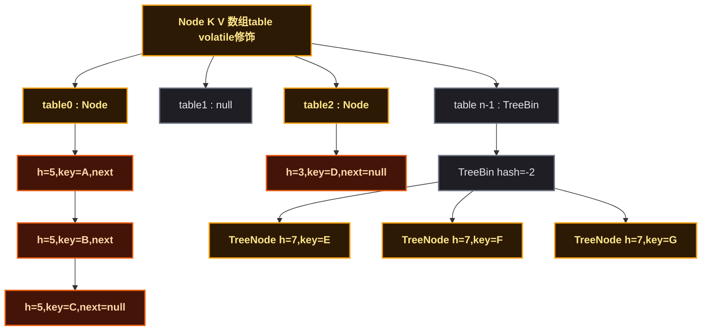
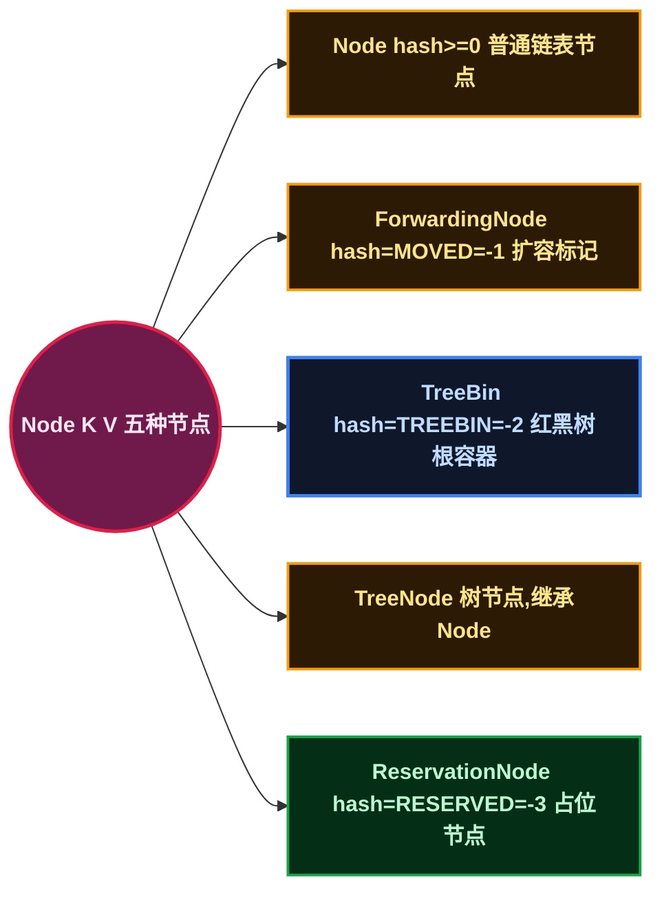
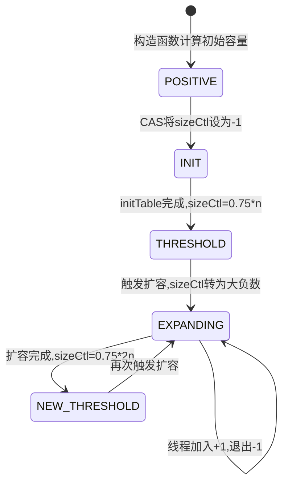
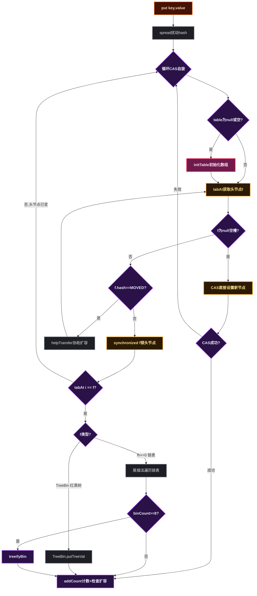
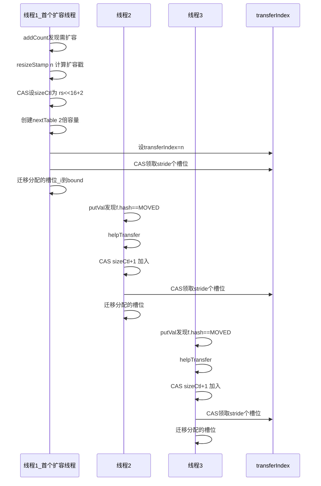
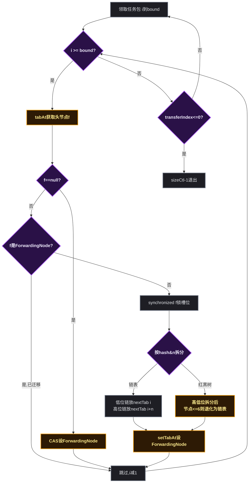
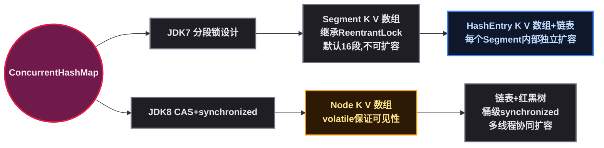

# ConcurrentHashMap 深度解析：从数据结构到线程安全的底层实现

## 一、道格·李为什么需要重新设计一个并发哈希表

Java 1.0 提供了 `Hashtable`——一个线程安全的 Map 实现。它的线程安全策略很简单：在所有 public 方法上加 `synchronized`。这个策略正确但不实用——任何时候只有一个线程能操作整个表，即使两个线程操作的是不同的键。在 1.0 时代并发不常见时还凑合，到了 Java 5 时代，服务器端的多线程访问同一个缓存 Map 已经是常规操作，`Hashtable` 的全局锁成了吞吐量的天花板。

`HashMap` 是 `Hashtable` 的非线程安全替代，性能好得多，但一旦多线程并发 put，就会出现数据丢失、size 计数错误，甚至在 JDK 7 扩容时出现链表成环导致 CPU 100%。

道格·李在设计 `ConcurrentHashMap` 时面临的问题是：<strong>既要保证线程安全（不能丢数据），又要提供接近 HashMap 的并发吞吐量（不能全局锁）</strong>。这是两个互相矛盾的目标，传统的 `synchronized` 方案只能取其一。

道格·李的解决方案是<strong>把锁的粒度从"整张表"缩小到"单个桶"</strong>。JDK 5 ~ 7 中用了 Segment 分段锁（16 个段，每段独立加锁），JDK 8 进一步细化为<strong>桶级别 CAS + synchronized</strong>——对空桶用 CAS 无锁插入，对非空桶只锁链表/红黑树的头节点。这种设计让 16 个线程同时操作 16 个不同桶时完全无竞争，并发度从 `Hashtable` 的 1 提升到桶的数量级。

## 🗺️ 二、ConcurrentHashMap 的数据结构

JDK 8 的 ConcurrentHashMap 放弃了 JDK 7 的 `Segment` 分段锁设计，直接采用与 HashMap 相似的结构： **`Node` 数组 + 链表 + 红黑树** 。



核心变化：锁不再加在 Segment 上，而是 **加在每个数组槽位的头节点上** （`synchronized(f)`）。这意味着理论上最多可以有 `table.length` 个线程同时并发写入，只要它们操作的是不同槽位。

### 🔑 2.1 关键属性一览

从 JDK 源码中截取 `ConcurrentHashMap` 的核心字段定义：

```java
public class ConcurrentHashMap<K,V> extends AbstractMap<K,V>
    implements ConcurrentMap<K,V>, Serializable {

    transient volatile Node<K,V>[] table;          // 存储数据的桶数组
    private transient volatile Node<K,V>[] nextTable; // 扩容时的新数组
    private transient volatile long baseCount;       // 基础计数值
    private transient volatile CounterCell[] counterCells; // 分段计数器
    private transient volatile int sizeCtl;           // 多义控制字段
    private transient volatile int transferIndex;     // 扩容调度索引
    private transient volatile int cellsBusy;         // CounterCell 扩容锁
}
```

| 属性 | 类型 | 说明 |
|------|------|------|
| `table` | `volatile Node<K,V>[]` | 存储数据的桶数组，`volatile` 保证扩容替换时对其他线程立即可见 |
| `nextTable` | `volatile Node<K,V>[]` | 扩容时的新数组（容量为旧数组的 2 倍），非扩容时为 null |
| `baseCount` | `volatile long` | 基础计数值，`size()` 的核心组成部分 |
| `counterCells` | `volatile CounterCell[]` | 分段计数器数组，减少 `baseCount` 上的 CAS 竞争 |
| `sizeCtl` | `volatile int` | **多义控制字段** ，值的范围决定其含义（详见 2.3 节） |
| `transferIndex` | `volatile int` | 扩容时全局调度指针，从 n 递减到 0，用于多线程分包迁移 |
| `cellsBusy` | `volatile int` | CounterCell 数组初始化或扩容时的 CAS 锁标志 |

每个字段都是 `volatile` 修饰，这是 **get 不加锁仍能保证可见性** 的基础。

### 📋 2.2 五种节点类型

ConcurrentHashMap 中共有五种节点，通过 `hash` 字段的值来区分角色：



JDK 源码中的常量定义：

```java
static final int MOVED     = -1; // hash for forwarding nodes
static final int TREEBIN   = -2; // hash for roots of trees
static final int RESERVED  = -3; // hash for transient reservations
```

| 节点类型 | hash 值 | 作用 |
|---------|:---:|------|
| `Node<K,V>` | `>= 0` | 普通链表节点，存储 key、value、hash、next 四个字段 |
| `ForwardingNode<K,V>` | `-1` (MOVED) | 扩容标记节点，持有 `nextTable` 引用。线程 `get` 碰到它会自动转发到新表查找 |
| `TreeBin<K,V>` | `-2` (TREEBIN) | 红黑树的根节点容器，持有 `root` 引用和自建的读写锁 |
| `TreeNode<K,V>` | 原 key 的 hash（`>= 0`） | 红黑树中的子节点，继承自 Node，仅作为 TreeBin 的内部节点 |
| `ReservationNode<K,V>` | `-3` (RESERVED) | 临时占位节点，用于 `computeIfAbsent` / `compute` 等原子计算方法的占位 |

**关键设计** ：hash 值不仅用于计算 `(n-1) & hash` 定位槽位，还充当节点类型标识。当 `hash < 0` 时，表示这是一个特殊节点，`get` 操作会根据具体负数值走不同的查找分支（`ForwardingNode.find()` 转发到新表，`TreeBin.find()` 在红黑树中搜索）。

### 📌 2.3 sizeCtl 多义字段

`sizeCtl` 是 ConcurrentHashMap 中最核心的控制字段，同一个 int 变量在不同值范围下代表完全不同的含义：

| sizeCtl 值 | 含义 |
|:---:|------|
| `0` | 未指定初始容量，使用默认值 16 |
| `> 0` | 数组已初始化时：下次扩容的阈值（`0.75 × n`）；构造函数调用后：记录的初始容量 |
| `-1` | 有线程正在执行 `initTable()`，其他线程看到 -1 应让出 CPU |
| `-(1 + nThreads)`（即 `< -1`） | 正在扩容中： **高 16 位** 为扩容戳（`resizeStamp`，唯一标识一次扩容）， **低 16 位** 为参与扩容的线程数 + 1 |

`sizeCtl` 的状态转换流程：



一个 int 变量承载了五种语义，这通过 **值的范围来区分角色** 实现：
- `0`：默认
- 正数：阈值/容量
- `-1`：初始化锁
- 负大数：扩容状态（高 16 位 + 低 16 位组合信息）

这种设计避免了引入多个 boolean 标志和多把锁，用单个 CAS 变量统一管理所有并发状态转换。

---

## ⚙️ 三、线程安全的实现机制

ConcurrentHashMap 的线程安全不是靠一把大锁实现的，而是通过 **三种粒度的并发控制** 组合完成：

| 场景 | 并发控制方式 | 粒度 |
|------|:---:|:---:|
| 数组初始化 | CAS 将 `sizeCtl` 从正数设为 -1 | 全局互斥 |
| 空槽位插入 | `casTabAt` CAS 直接设置 | 单个槽位 |
| 非空槽位修改 | `synchronized(f)` 锁头节点 | 单个槽位 |
| 计数累加 | CAS `baseCount` + CounterCell 分段 | 计数专用 |
| 扩容任务调度 | CAS `transferIndex` | 调度索引 |

### 👁️ 3.1 volatile 保证可见性

`table` 数组和 `nextTable` 都声明为 `volatile`：

```java
transient volatile Node<K,V>[] table;
private transient volatile Node<K,V>[] nextTable;
```

Node 内部的核心字段也用 `volatile` 修饰：

```java
static class Node<K,V> implements Map.Entry<K,V> {
    final int hash;
    final K key;
    volatile V val;
    volatile Node<K,V> next;
}
```

这意味着：
- `table` 扩容时被替换为新数组引用，所有线程立即看到新引用
- 一个线程修改 Node 的 `val` 或 `next` 指针，其他线程立刻看到最新值——通过 JMM 的 **volatile 写** （插入 StoreStore + StoreLoad 屏障）和 **volatile 读** （插入 LoadLoad + LoadStore 屏障）保证
- 这是 **`get` 方法可以完全不加锁** 的根本原因：所有读都是 volatile 读，拿到的永远是内存中最新的值

### 📌 3.2 CAS 无锁操作

CAS（Compare And Swap，比较并交换）适用于竞争概率低的场景。ConcurrentHashMap 封装了三个 `Unsafe` 原子操作方法：

```java
// 以 volatile 语义读取 tab[i]，对应 Unsafe.getObjectVolatile
static final <K,V> Node<K,V> tabAt(Node<K,V>[] tab, int i) {
    return (Node<K,V>)U.getObjectVolatile(tab, ((long)i << ASHIFT) + ABASE);
}

// CAS 设置 tab[i]：预期值 c → 新值 v，对应 Unsafe.compareAndSwapObject
static final <K,V> boolean casTabAt(Node<K,V>[] tab, int i,
                                    Node<K,V> c, Node<K,V> v) {
    return U.compareAndSwapObject(tab, ((long)i << ASHIFT) + ABASE, c, v);
}

// 以 volatile 语义写入 tab[i]，对应 Unsafe.putObjectVolatile
static final <K,V> void setTabAt(Node<K,V>[] tab, int i, Node<K,V> v) {
    U.putObjectVolatile(tab, ((long)i << ASHIFT) + ABASE, v);
}
```

| 方法 | 内存语义 | 使用场景 |
|------|---------|---------|
| `tabAt` | volatile 读 | `get` 和 `put` 中获取槽位头节点 |
| `casTabAt` | CAS 原子写 | 空槽位插入首个节点 |
| `setTabAt` | volatile 写 | 扩容后在新数组设置节点；旧槽位设置 ForwardingNode |

这三个方法封装了对数组元素的 **volatile 访问** 。Java 中数组元素本身不具备 volatile 语义（即便数组引用是 volatile 的），所以必须通过 `Unsafe` 的 `getObjectVolatile` / `putObjectVolatile` 来手动实现。

**为什么空槽插入用 CAS 就够了？** 因为空槽插入的场景是：当前槽位为 null，需要放入一个新 Node。只需要保证"从 null 变为新 Node"这个操作是原子的——刚好 CAS 天然支持"比较旧值为 null，是则替换为新 Node"。不需要锁住整个链表，因为没有链表。

### 📌 3.3 synchronized 细粒度锁

当目标槽位已经有节点（非空），CAS 无法处理链表/红黑树内的复杂修改，此时用 `synchronized` 锁定 **槽位的头节点对象 f** ：

```java
synchronized (f) {
    if (tabAt(tab, i) == f) {   // 双重检查：确认头节点未被其他线程修改
        if (fh >= 0) {
            // 链表：遍历 → 比较 key → 尾插法插入或覆盖 value
        } else if (f instanceof TreeBin) {
            // 红黑树：调用 TreeBin.putTreeVal 插入
        }
    }
}
```

锁对象是 `f`——即槽位的头节点。这意味着：
- 操作槽位 `i` 时锁住 `table[i]`，不影响其他槽位
- 并发度理论上限 = `table.length`（每个槽一个锁）
- 比 JDK 7 的 Segment 锁粒度更细：JDK 7 一个 Segment 锁住 16 个槽位，JDK 8 一个锁只锁一个槽位

双重检查 `tabAt(tab, i) == f` 是必要的：在竞争获取 `synchronized(f)` 的期间，头节点可能已被其他线程修改（比如被删除、被替换为 ForwardingNode 或 TreeBin）。如果不做这个检查，就会在已过期的状态下操作。

### 📌 3.4 CounterCell 分段计数

多线程并发调用 `put()` 时，如果所有线程都 CAS 竞争同一个 `baseCount`，性能会严重下降（CAS 失败 → 自旋重试 → 浪费 CPU）。ConcurrentHashMap 引入了类似 `LongAdder` 的分段计数机制：

```java
@sun.misc.Contended
static final class CounterCell {
    volatile long value;
    CounterCell(long x) { value = x; }
}
```

<span style="color:red">计数流程</span>：
1. 先尝试 CAS 更新 `baseCount`
2. 如果 CAS 失败，随机分配一个 `CounterCell`，CAS 更新其 `value`
3. `size()` 方法将 `baseCount` 与所有 `CounterCell[].value` 累加

`@sun.misc.Contended` 注解用于防止 **伪共享** （False Sharing）：不同线程修改相邻的 CounterCell 对象时，若它们落在同一个 CPU 缓存行（Cache Line，通常 64 字节），会导致缓存行在 CPU 核之间反复失效同步，严重拖慢性能。`@Contended` 通过在对象前后填充空白字节，保证每个 CounterCell 独占一个缓存行。

---

## 📖 四、核心流程源码解析

### 📌 4.1 数组初始化：initTable

构造 `ConcurrentHashMap` 时不会立即分配数组，数组在第一次 `put` 时才初始化（懒初始化）。多个线程同时执行第一次 `put`，通过 CAS 竞争初始化权：

```java
private final Node<K,V>[] initTable() {
    Node<K,V>[] tab; int sc;
    while ((tab = table) == null || tab.length == 0) {
        if ((sc = sizeCtl) < 0)
            Thread.yield();              // 1. 其他线程正在初始化，让出CPU
        else if (U.compareAndSwapInt(this, SIZECTL, sc, -1)) {
            try {                         // 2. CAS成功，获得初始化权
                if ((tab = table) == null || tab.length == 0) {
                    int n = (sc > 0) ? sc : DEFAULT_CAPACITY;
                    Node<K,V>[] nt = (Node<K,V>[])new Node<?,?>[n];
                    table = tab = nt;
                    sc = n - (n >>> 2);   // 3. 计算阈值 = 0.75n
                }
            } finally {
                sizeCtl = sc;             // 4. sizeCtl 从 -1 变为阈值
            }
            break;
        }
    }
    return tab;
}
```

流程解释（对应注释编号）：
1. `sizeCtl < 0` 说明其他线程持有初始化权（`sizeCtl = -1`）或正在扩容，当前线程调用 `Thread.yield()` 让出 CPU，避免空转浪费
2. CAS 将 `sizeCtl` 从预期值 `sc` 设为 `-1`。只有一个线程能成功，失败的回到 step 1
3. 扩容阈值 `n - (n >>> 2)` = `n - n/4` = `0.75 × n`。`>>> 2` 相当于除以 4
4. `sizeCtl` 从 `-1` 改为正值（阈值），完成初始化

### 🔄 4.2 putVal 插入流程



对应关键源码（省略部分细节，保留核心分支逻辑）：

```java
final V putVal(K key, V value, boolean onlyIfAbsent) {
    if (key == null || value == null) throw new NullPointerException();
    int hash = spread(key.hashCode());           // 扰动：高16位与低16位异或
    int binCount = 0;
    for (Node<K,V>[] tab = table;;) {            // 自旋循环
        Node<K,V> f; int n, i, fh;
        if (tab == null || (n = tab.length) == 0)
            tab = initTable();                    // 分支A：懒初始化
        else if ((f = tabAt(tab, i = (n - 1) & hash)) == null) {
            if (casTabAt(tab, i, null,
                         new Node<K,V>(hash, key, value, null)))
                break;                            // 分支B：空槽CAS插入，最快路径
        }
        else if ((fh = f.hash) == MOVED)
            tab = helpTransfer(tab, f);           // 分支C：发现ForwardingNode，协助扩容
        else {
            V oldVal = null;
            synchronized (f) {                    // 分支D：锁头节点
                if (tabAt(tab, i) == f) {        // 双重检查
                    if (fh >= 0) {
                        binCount = 1;
                        // 遍历链表，尾插法——找到相同key则覆盖，否则追加到末尾
                        for (Node<K,V> e = f;; ++binCount) {
                            K ek;
                            if (e.hash == hash &&
                                ((ek = e.key) == key ||
                                 (ek != null && key.equals(ek)))) {
                                oldVal = e.val;
                                if (!onlyIfAbsent)
                                    e.val = value;
                                break;
                            }
                            Node<K,V> pred = e;
                            if ((e = e.next) == null) {
                                pred.next = new Node<K,V>(hash, key, value, null);
                                break;
                            }
                        }
                    }
                    else if (f instanceof TreeBin) {
                        // 红黑树插入
                        binCount = 2;
                        // ...
                    }
                }
            }
            if (binCount >= TREEIFY_THRESHOLD)
                treeifyBin(tab, i);              // 链表转红黑树
            if (oldVal != null)
                return oldVal;
            break;
        }
    }
    addCount(1L, binCount);                      // 计数 + 检查是否需要扩容
    return null;
}
```

设计精髓：
- **分支 B（空槽 CAS）是最快路径** ：零锁开销，一个原子指令完成插入
- **分支 C（协助扩容）体现"全员参与"理念** ：发现正在扩容时不等待，主动参与迁移
- **分支 D 中 `synchronized(f)` + 双重检查** ：锁住头节点后确认其仍未变化，防止锁排队期间状态过期
- **尾插法而非头插法** ：JDK 7 的 HashMap 使用头插法导致扩容时链表反转、成环，JDK 8 全部改为尾插法

### 🔄 4.3 get 查询流程

```java
public V get(Object key) {
    Node<K,V>[] tab; Node<K,V> e, p; int n, eh; K ek;
    int h = spread(key.hashCode());
    if ((tab = table) != null && (n = tab.length) > 0 &&
        (e = tabAt(tab, (n - 1) & h)) != null) {
        if ((eh = e.hash) == h) {                  // 1. 头节点命中
            if ((ek = e.key) == key || (ek != null && key.equals(ek)))
                return e.val;
        }
        else if (eh < 0)                           // 2. hash<0：特殊节点
            return (p = e.find(h, key)) != null ? p.val : null;
        while ((e = e.next) != null) {              // 3. 遍历链表
            if (e.hash == h &&
                ((ek = e.key) == key || (ek != null && key.equals(ek))))
                return e.val;
        }
    }
    return null;
}
```

**全程无锁** ，三种查找路径：

| 路径 | 条件 | 操作 |
|------|------|------|
| 头节点命中 | `eh == h`（hash 相等且 >= 0） | 直接比较 key 返回 |
| 特殊节点查找 | `eh < 0`（ForwardingNode 或 TreeBin） | 调用 `e.find(h, key)`——ForwardingNode 转发到 `nextTable`，TreeBin 在红黑树中搜索 |
| 链表遍历 | 普通链表节点 | 沿 `next` 指针遍历比较 |

get 不加锁能正确工作的前置条件：
- `table` 是 volatile，扩容替换数组引用后立即可见
- Node 的 `val` 和 `next` 是 volatile，修改对其他线程立即可见
- 扩容期间，已迁移的槽位放置 ForwardingNode，其 `find()` 方法转发到 `nextTable` 查找，不会漏数据
- 正在迁移的槽位被 `synchronized(f)` 锁住，get 无锁读取时要么看到迁移前状态，要么看到迁移后状态，不会看到中间态

### 📌 4.4 树化：treeifyBin

当链表长度达到 `TREEIFY_THRESHOLD(8)` 时，不会立即树化，而是先判断数组长度：

```java
private final void treeifyBin(Node<K,V>[] tab, int index) {
    Node<K,V> b; int n, sc;
    if (tab != null) {
        if ((n = tab.length) < MIN_TREEIFY_CAPACITY) {
            tryPresize(n << 1);   // 数组长度 < 64：优先扩容，而非树化
        }
        else if ((b = tabAt(tab, index)) != null && b.hash >= 0) {
            synchronized (b) {    // 锁头节点，构建TreeNode链表再包装为TreeBin
                // 遍历链表 → 构造TreeNode → 构建红黑树 → new TreeBin包装
            }
        }
    }
}
```

关键逻辑： **`tab.length < 64` 时优先扩容而非树化** 。原因：
- 短数组时扩容可以将节点分摊到更多槽位，直接降低单槽链表长度
- 扩容成本（复制 + 拆分链表）低于树化成本（构建红黑树 + 维护树平衡）+ 树查询开销
- 只有当数组已经足够长（>= 64）但某个槽的链表依然 >= 8 时，才说明哈希冲突严重，需要树化

---

## 🔍 五、扩容机制详解

### 📌 5.1 触发条件

扩容在以下入口被触发：

| 触发入口 | 条件 | 说明 |
|---------|------|------|
| `addCount()` | `sizeCtl > 0`（阈值）且实际元素数 >= 阈值 | `put` 完成后计数时检查，最常见入口 |
| `treeifyBin()` | 链表长度 >= 8 但 `tab.length < 64` | 树化前的兜底检查 |
| `tryPresize()` | 显式调用（`putAll` 批量插入、`treeifyBin` 内部） | 直接尝试扩容到目标容量的 2 倍幂 |

### 📌 5.2 transfer 多线程协同迁移

这是 ConcurrentHashMap 最复杂的部分。多个线程可以同时参与数据迁移，通过 `transferIndex` 分配任务包。



每个线程迁移单个槽位的内部流程：



链表拆分的核心源码：

```java
// 按 hash & n 将链表分成低位链和高位链
// n 是旧数组长度，是 2 的幂（如 16 = 10000₂）
for (Node<K,V> p = f; p != lastRun; p = p.next) {
    int ph = p.hash; K pk = p.key; V pv = p.val;
    if ((ph & n) == 0)
        ln = new Node<K,V>(ph, pk, pv, ln);   // 低位链：新位置 = 旧位置 i
    else
        hn = new Node<K,V>(ph, pk, pv, hn);   // 高位链：新位置 = i + n
}
setTabAt(nextTab, i, ln);       // 低位链放入新数组原位置
setTabAt(nextTab, i + n, hn);   // 高位链放入新数组偏移位置
setTabAt(tab, i, fwd);          // 旧槽位打上ForwardingNode标记
```

为什么 `hash & n` 能准确拆分？数组容量 n 是 2 的幂。节点在旧数组中的槽位由 `hash & (n-1)` 决定（取 hash 的低 `log₂(n)` 位），在新数组 `2n` 中的槽位由 `hash & (2n-1)` 决定（取低 `log₂(2n)` 位）。多出来的那一位就是第 `log₂(n)` 位，而这个位的值恰好由 `hash & n` 决定：
- `hash & n == 0`：多出来的位为 0，新位置 = 旧位置（低位链）
- `hash & n != 0`：多出来的位为 1，新位置 = 旧位置 + n（高位链）

### ⚡ 5.3 lastRun 优化

在拆分链表前，先扫描一次链表寻找 `lastRun`——从某个节点开始到链表末尾的所有节点 `hash & n` 结果相同：

```java
Node<K,V> lastRun = f;
for (Node<K,V> p = f.next; p != null; p = p.next) {
    if ((p.hash & n) != (lastRun.hash & n))
        lastRun = p;
}
// lastRun 及其后续节点无需重新创建 Node 对象，直接复用
if ((lastRun.hash & n) == 0) {
    ln = lastRun;
} else {
    hn = lastRun;
}
```

这个优化的意义：链表尾部连续同类的节点（全部属于低位链或全部属于高位链），不需要逐个创建新 Node 对象，直接复用原引用即可。JDK 的注释提到，统计上这约减少了 5/6 的节点克隆量。

### 📌 5.4 扩容结束判定

每个线程完成自己的迁移任务后，将 `sizeCtl` 减 1（CAS 操作）：

```java
if (U.compareAndSwapInt(this, SIZECTL, sc = sizeCtl, sc - 1)) {
    if ((sc - 2) != resizeStamp(n) << RESIZE_STAMP_SHIFT)
        return;   // 不是最后一个线程，直接退出
    // 最后一个线程：收尾
    table = nextTab;
    sizeCtl = (n << 1) - (n >>> 1);  // 新阈值 = 2n * 0.75
}
```

判定逻辑：`sizeCtl` 的初始值为 `(rs << 16) + 2`。每个线程加入时 `sizeCtl + 1`，退出时 `sizeCtl - 1`。当低 16 位变回 2 时，表示所有参与线程都已退出，最后一个退出的线程负责：
1. 将 `table` 指向 `nextTable`（新数组正式上岗）
2. 重新计算 `sizeCtl` 为新数组的扩容阈值

### 📌 5.5 helpTransfer 协助扩容

线程在 `putVal` 中发现当前槽位头节点是 ForwardingNode（`hash == MOVED`），不会阻塞等待扩容完成，而是调用 `helpTransfer` 主动参与迁移：

```java
final Node<K,V>[] helpTransfer(Node<K,V>[] tab, Node<K,V> f) {
    Node<K,V>[] nextTab; int sc;
    if (tab != null && (f instanceof ForwardingNode) &&
        (nextTab = ((ForwardingNode<K,V>)f).nextTable) != null) {
        int rs = resizeStamp(tab.length);
        while (nextTab == nextTable && table == tab &&
               (sc = sizeCtl) < 0) {       // 扩容未结束
            // 检查扩容戳是否一致、扩容是否已到尾声
            if ((sc >>> RESIZE_STAMP_SHIFT) != rs ||
                transferIndex <= 0)
                break;
            if (U.compareAndSwapInt(this, SIZECTL, sc, sc + 1)) {
                transfer(tab, nextTab);     // 领取任务开始迁移
                break;
            }
        }
        return nextTab;
    }
    return table;
}
```

核心设计： **扩容不是被等待的，而是被推动的** 。每个发现"正在扩容"的线程都主动参与迁移，参与线程越多，迁移完成越快，扩容停顿越短。

---

## 🛠️ 六、日常开发中的常用方法

### 📋 6.1 基础 CRUD 操作

| 方法 | 用途 | 频率 |
|------|------|:---:|
| `new ConcurrentHashMap<>()` | 创建默认容量（16）的实例 | 高 |
| `put(K key, V value)` | 插入键值对（key/value 均不能为 null） | 高 |
| `get(Object key)` | 无锁读取 | 高 |
| `remove(Object key)` | 删除键值对 | 高 |
| `size()` | 获取元素总数（非精确值，是估算） | 中 |
| `containsKey(Object key)` | 判断 key 是否存在 | 中 |
| `isEmpty()` | 判断是否为空 | 中 |

### 🏁 6.2 原子复合操作（避免 check-then-act 竞态）

这些方法将"检查 + 操作"合并为一个原子步骤，避免 if-check-then-act 的竞态条件：

| 方法 | 用途 | 频率 |
|------|------|:---:|
| `putIfAbsent(K, V)` | key 不存在时才插入，返回旧值或 null | 高 |
| `remove(Object key, Object value)` | key 对应的 value 匹配时才删除 | 中 |
| `replace(K, V, V)` | 旧值匹配时才替换为新值 | 中 |
| `computeIfAbsent(K, Function)` | key 不存在时通过 Function 计算值并插入 | 高 |
| `computeIfPresent(K, BiFunction)` | key 存在时通过 BiFunction 重新计算值 | 中 |
| `compute(K, BiFunction)` | 无论 key 是否存在都重新计算值 | 中 |
| `merge(K, V, BiFunction)` | key 不存在直接设值，存在则用 BiFunction 合并 | 中 |

典型用法示例：

```java
ConcurrentHashMap<String, Integer> map = new ConcurrentHashMap<>();

// 1. putIfAbsent —— 不存在才放，避免覆盖
Integer old1 = map.putIfAbsent("counter", 1);   // return null（插入成功）
Integer old2 = map.putIfAbsent("counter", 100); // return 1（已存在，不覆盖）

// 2. computeIfAbsent —— 懒初始化缓存（比 putIfAbsent 更高效，只在缺失时计算）
ConcurrentHashMap<String, List<String>> cache = new ConcurrentHashMap<>();
cache.computeIfAbsent("users", k -> new ArrayList<>()).add("Alice");

// 3. compute —— 原子更新
map.compute("counter", (k, v) -> v == null ? 1 : v + 1);

// 4. merge —— 合并统计（经典场景：单词计数）
ConcurrentHashMap<String, Long> wordCount = new ConcurrentHashMap<>();
wordCount.merge("hello", 1L, Long::sum);
wordCount.merge("hello", 1L, Long::sum);  // "hello" → 2

// 5. replace —— 条件更新（CAS 语义）
boolean replaced = map.replace("counter", 5, 10); // 只有 oldValue=5 时才替换为 10
```

### 📌 6.3 批量与遍历操作

| 方法 | 用途 | 频率 |
|------|------|:---:|
| `putAll(Map)` | 批量插入 | 中 |
| `keySet()` / `values()` / `entrySet()` | 获取视图集合 | 高 |
| `forEach(BiConsumer)` | 遍历所有键值对 | 高 |
| `forEachEntry(long parallelismThreshold, ...)` | 并行遍历 | 低 |
| `reduceValues(long parallelismThreshold, ...)` | 并行归约 | 低 |
| `search(long parallelismThreshold, ...)` | 并行搜索 | 低 |

**注意** ：ConcurrentHashMap 的迭代器是 **弱一致性** （Weakly Consistent）的。遍历过程中看到的数据是某个时间点的快照，不会反映遍历期间其他线程的并发修改，也 **不会抛出 ConcurrentModificationException** 。

### 📊 6.4 与 HashMap 的关键 API 差异

```java
// HashMap：允许 null key 和 null value
Map<String, String> hm = new HashMap<>();
hm.put(null, "value");   // OK
hm.put("key", null);     // OK

// ConcurrentHashMap：禁止 null —— 直接抛 NullPointerException
ConcurrentHashMap<String, String> chm = new ConcurrentHashMap<>();
chm.put(null, "value");  // ❌ NullPointerException
chm.put("key", null);    // ❌ NullPointerException
```

禁止 null 的原因：在并发环境下，无法区分"key 不存在返回 null"和"key 对应的 value 就是 null"。如果用 `containsKey` 判断，在并发场景下其结果在返回的瞬间就可能过期（其他线程刚好插入或删除了这个 key），导致二义性无法消除。

---

## 📐 七、JDK 7 vs JDK 8 的设计演进



| 维度 | JDK 7 | JDK 8 | 演进原因 |
|------|-------|-------|---------|
| 数据结构 | Segment 数组 + HashEntry 链表 | Node 数组 + 链表 + 红黑树 | 红黑树避免链表查询退化到 O(n) |
| 锁机制 | 分段锁（Segment 继承 ReentrantLock） | CAS + `synchronized(f)`（桶级锁） | JDK 8 `synchronized` 性能大幅优化（偏向锁/轻量级锁/锁粗化） |
| 并发度上限 | Segment 数量（默认 16，初始化后不变） | `table.length`（随扩容自动增加） | 锁粒度从段级细化到桶级 |
| 扩容范围 | 单个 Segment 内部数组独立扩容 | 整体 `table` 统一扩容 | 整体扩容配合多线程协作，利用多核加速 |
| 扩容参与 | 持有 Segment 锁的单线程 | 多线程通过 `helpTransfer` 协作 | 减少扩容停顿 |
| 查询性能 | O(n) | O(n) 链表 / O(log n) 红黑树 | 红黑树在大链表场景下显著提升查询速度 |
| 红黑树 | 无 | 链表 >= 8 且数组 >= 64 时树化 | JDK 8 新增 |
| size() | 计算 3 次后加锁（精确） | `baseCount + CounterCell[]` 累加（非精确估算） | 避免 `size()` 阻塞写线程 |

JDK 8 放弃分段锁的三个关键原因：

1. **`synchronized` 性能已不再是瓶颈** 。JDK 6 ~ 8 引入了偏向锁（Biased Locking）、轻量级锁（Lightweight Locking）、锁粗化（Lock Coarsening）、锁消除（Lock Elimination）等优化。在低竞争场景下（单槽位的读写竞争通常很低），`synchronized` 使用偏向锁或轻量级锁，性能接近 CAS，不再需要 ReentrantLock 的额外对象开销。

2. **Segment 固定并发级别是结构性问题** 。初始化时设定的 `concurrencyLevel`（默认 16）决定了 Segment 数量，且 Segment 数组初始化后不可扩容。随着数据量增长，Segment 数量不变 → 锁粒度越来越粗。JDK 8 的桶级锁随 `table` 扩容自然增加并发度。

3. **代码复杂度显著降低** 。JDK 7 的 `Segment` 类继承 `ReentrantLock`，内部还要维护自己的 `HashEntry[]` 和扩容逻辑，两级结构（Segment → HashEntry）带来大量样板代码。JDK 8 直接用 Node 作为锁对象，结构扁平化。

---

## 🎯 八、总结

### 📐 8.1 核心设计思想

ConcurrentHashMap 的线程安全本质上是 **"最小化锁范围"** 的设计：

| 层级 | 策略 | 具体实现 |
|:---:|------|------|
| 第一层 | 能无锁则无锁 | get 全程 volatile 读；空槽 CAS 插入 |
| 第二层 | CAS 解决低竞争 | initTable、addCount、transferIndex 调度 |
| 第三层 | 仅必要时加锁，锁到最小粒度 | `synchronized(f)` 桶级锁，只锁一个槽位 |

### ⚙️ 8.2 机制速查表

| 机制 | 核心字段/操作 | 线程安全方式 |
|------|------|:---:|
| 数组可见性 | `volatile table` | volatile 读/写 |
| 空槽插入 | `casTabAt(tab, i, null, newNode)` | CAS |
| 非空槽修改 | `synchronized(f)` + 双重检查 | 桶级锁 |
| 初始化互斥 | CAS `sizeCtl` 设为 -1 | CAS 竞争 |
| 元素计数 | `baseCount + CounterCell[]` | CAS + 分段计数 |
| 扩容任务分配 | `transferIndex` | CAS 递减 |
| 扩容数据迁移 | `synchronized(f)` + 链表/树拆分 | 桶级锁 |
| 扩容标记 | ForwardingNode（hash = -1） | 转发到 `nextTable` 查找 |
| 协助扩容 | `hash == MOVED` 触发 `helpTransfer` | 多线程协作推动 |

### ❓ 8.3 面试高频问题速答

| 问题 | 答案要点 |
|------|---------|
| ConcurrentHashMap 如何保证线程安全？ | 三级机制：volatile 可见性 + CAS 无锁操作 + `synchronized` 桶级锁。get 无锁，put 空槽 CAS、非空槽锁头节点 |
| get 为什么不需要加锁？ | `table` 是 volatile，Node 的 `val`/`next` 是 volatile，JMM 保证 volatile 读到最新值；扩容期间 ForwardingNode 转发到新表 |
| sizeCtl 的含义？ | 多义字段：0 = 默认容量 16；正数 = 扩容阈值 0.75n 或初始容量；-1 = 有线程正在 initTable；< -1 = 扩容中（高 16 位扩容戳 + 低 16 位线程数 + 1） |
| 扩容流程？ | `addCount` 发现超阈值 → 首个线程创建 2 倍容量的 `nextTable` → `transferIndex` 分配任务包 → 多线程领取并迁移 → 链表按 `hash & n` 拆为高低两条链 → 旧槽位放置 ForwardingNode → 最后线程收尾 |
| 为什么 HashMap 扩容会链表成环？ | JDK 7 头插法 + 多线程扩容导致链表反转形成循环引用（A→B→A）。JDK 8 改为尾插法已修复此问题，但并发 put 仍会导致数据覆盖 |
| JDK 7 和 JDK 8 的区别？ | 7: Segment 分段锁（ReentrantLock），固定并发度；8: CAS + synchronized 桶级锁 + 红黑树 + 多线程协同扩容 |
| 为什么不允许 null？ | 并发环境下 `get()` 返回 null 有二义性——无法区分 key 不存在和 value 为 null。`containsKey` 的判断在并发下随时过期 |
| 什么时候链表转红黑树？ | 链表长度 >= 8 **且** 数组长度 >= 64。若数组 < 64，优先通过扩容来分散节点 |
| 什么时候红黑树退化为链表？ | 扩容拆分后树节点数 <= `UNTREEIFY_THRESHOLD(6)` |
| `size()` 返回值精确吗？ | **不精确** ，是 `baseCount + CounterCell[]` 累加的估算值。高并发下实时精确计数的代价太大 |
| CounterCell 为什么用 `@Contended`？ | 防止伪共享——不同线程修改相邻 CounterCell 时落入同一 CPU 缓存行，导致缓存行在核之间反复失效同步 |

---

*本文基于 JDK 8 ConcurrentHashMap 源码分析。JDK 版本演进中部分实现细节可能有调整，建议结合具体版本源码阅读。*
