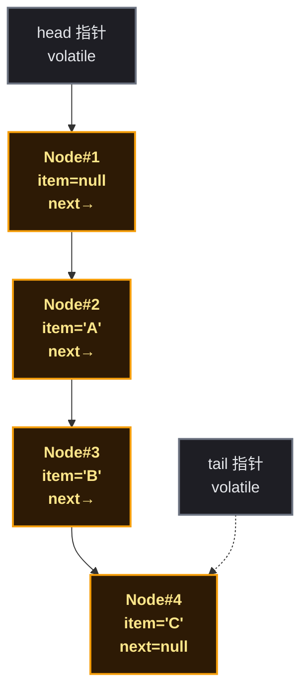
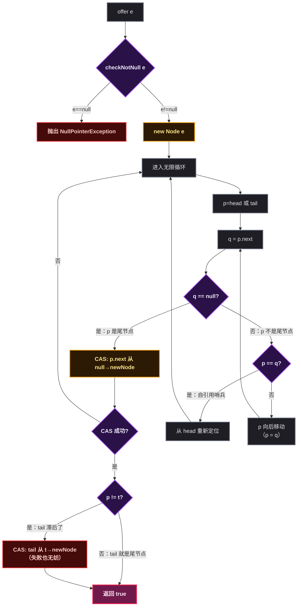
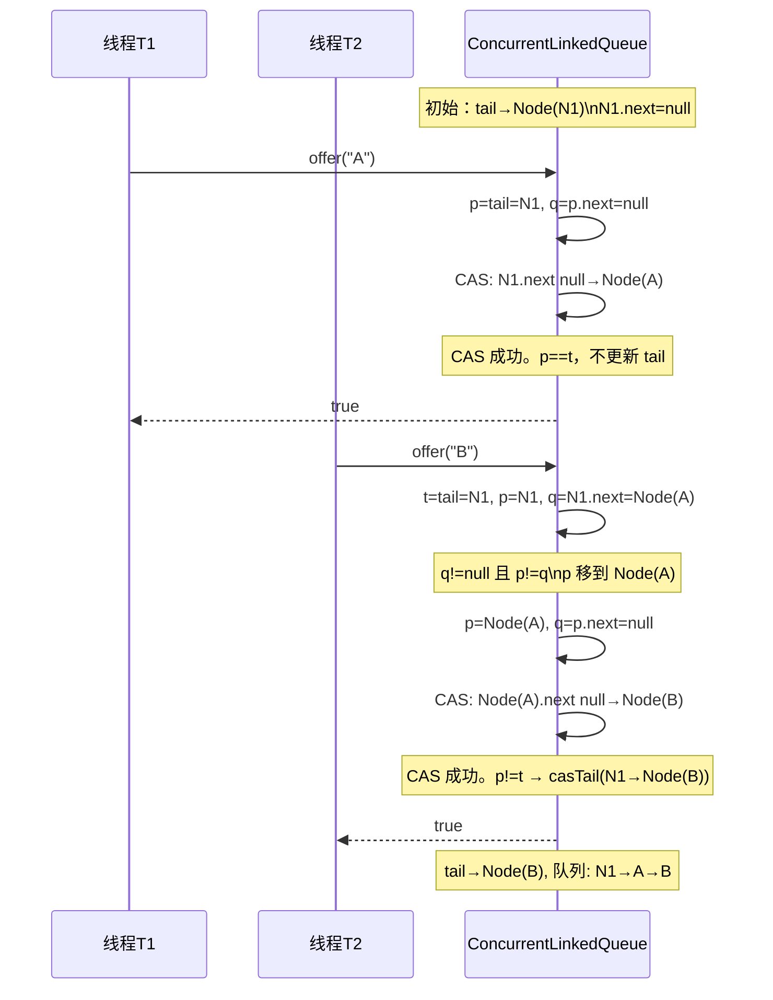
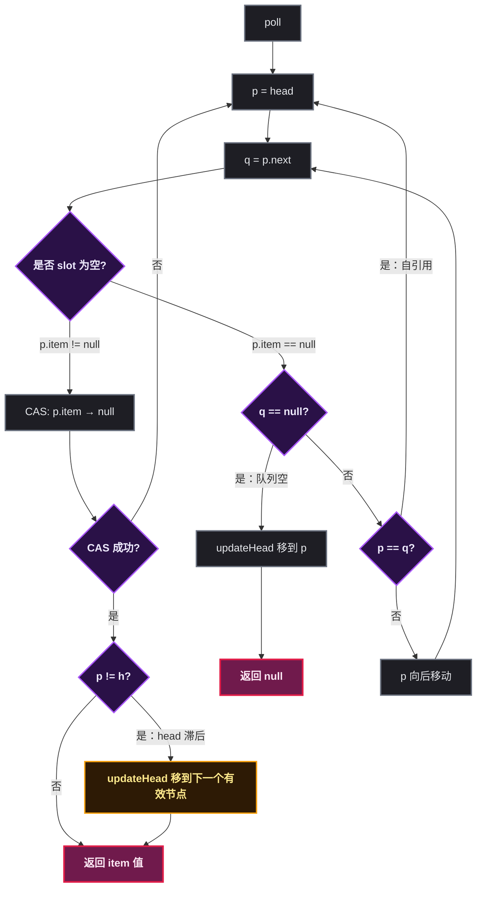
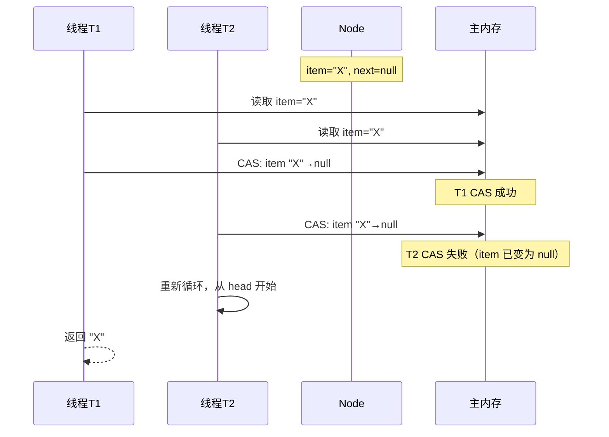
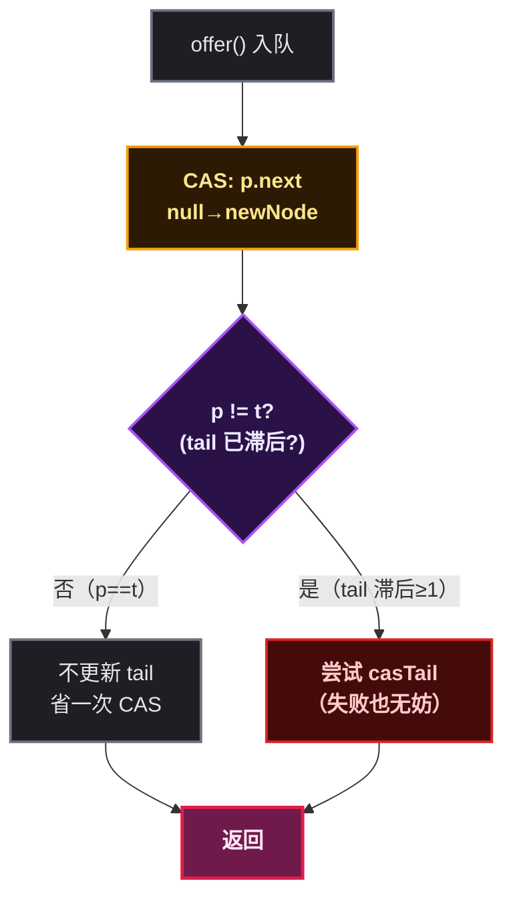
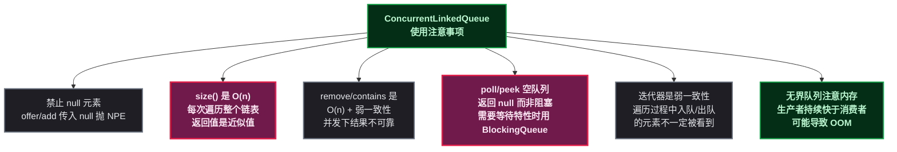
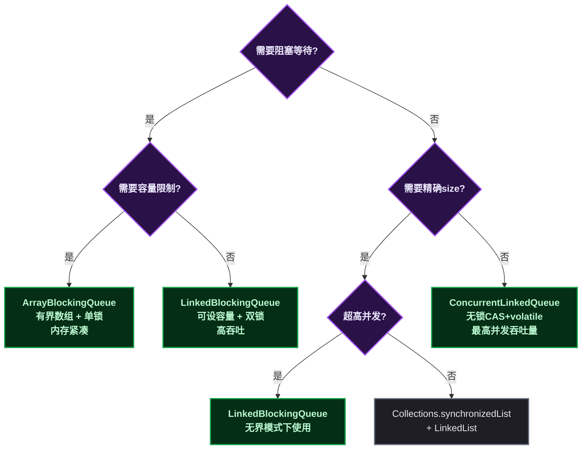
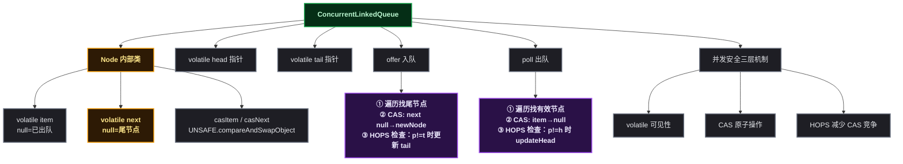

# ConcurrentLinkedQueue：无锁并发队列、Michael-Scott 算法与 HOPS 延迟更新机制全解析

## 🚀 道格·李为什么需要一个无锁队列

生产环境中大量使用多生产者-多消费者的队列模型：多个线程投递任务，多个线程取出执行。传统的做法是用 `LinkedList` 加 `synchronized`——任意时刻只有一个线程能操作队列，其他线程排队等锁。在高并发下，锁争用（Lock Contention）迅速成为吞吐量瓶颈：CPU 时间大量消耗在线程的阻塞-唤醒切换上，而非实际的消息处理。

道格·李在设计 JSR 166 时为这个场景引入了一个完全不同的方案：<strong>无锁并发队列</strong>。`ConcurrentLinkedQueue` 使用 CAS（Compare-And-Swap，比较并交换）原子操作替代锁，基于 Michael-Scott 算法（1996 年由 Maged Michael 和 Michael Scott 提出的无锁队列算法）实现多线程并发入队和出队。

核心设计思想：
- <strong>入队和出队操作各自独立</strong>——生产者在队尾 CAS 插入，消费者在队头 CAS 移除，彼此不阻塞
- <strong>没有锁，就不会有线程被操作系统挂起</strong>——CAS 失败意味着有其他线程抢先了一步，重试即可，没有上下文切换开销
- <strong>HOPS 延迟更新策略</strong>——`tail` 指针不必每次都更新到最后一个节点，允许滞后 1 ~ 2 个位置，用额外的 CAS 判断换来更少的 volatile 写操作

`ConcurrentLinkedQueue` 是 JUC 无锁数据结构的基础模型——理解了它的 CAS 操作模式和 HOPS 策略，再看 `ConcurrentHashMap`、`LinkedTransferQueue` 等无锁结构会轻松很多。

## 🏗️ 核心数据结构

### 整体架构：基于 Node 的单向链表

`ConcurrentLinkedQueue` 的底层是一个 **单向链表**，由 `head` 和 `tail` 两个 volatile 指针维护：



`head` 总是指向链表中的第一个节点（该节点 item 可能为 null，即"已出队"状态），`tail` 指向最后一个节点或倒数第二个节点。

### 🔧 Node 节点：volatile 字段 + CAS 原子操作

```java
// JDK 源码：ConcurrentLinkedQueue.Node 内部类（精简）
private static class Node<E> {
    volatile E item;              // 存储的元素值
    volatile Node<E> next;        // 后继节点引用

    Node(E item) {
        UNSAFE.putObject(this, itemOffset, item);  // 通过 UNSAFE 写入，保证可见性
    }

    boolean casItem(E cmp, E val) {
        return UNSAFE.compareAndSwapObject(this, itemOffset, cmp, val);
    }

    void lazySetNext(Node<E> val) {
        UNSAFE.putOrderedObject(this, nextOffset, val);  // 延迟写入，不保证立即可见
    }

    boolean casNext(Node<E> cmp, Node<E> val) {
        return UNSAFE.compareAndSwapObject(this, nextOffset, cmp, val);
    }

    // item 和 next 的内存偏移量在 static 块中通过反射初始化
    private static final sun.misc.Unsafe UNSAFE;
    private static final long itemOffset;
    private static final long nextOffset;
    static {
        try {
            UNSAFE = sun.misc.Unsafe.getUnsafe();
            itemOffset = UNSAFE.objectFieldOffset(Node.class.getDeclaredField("item"));
            nextOffset = UNSAFE.objectFieldOffset(Node.class.getDeclaredField("next"));
        } catch (Exception e) { throw new Error(e); }
    }
}
```

每个字段的含义和操作方式：

| 字段 | 类型 | 含义 | 写入方式 | 读取保证 |
|------|------|------|---------|---------|
| `item` | `volatile E` | 存储的元素，可为 null（表示已删除） | `casItem`（CAS 写入）或构造时 `putObject` | volatile 立即可见 |
| `next` | `volatile Node<E>` | 后继节点引用 | `casNext`（CAS 写入）或 `lazySetNext`（延迟写入） | volatile 立即可见 |

三个 CAS 操作的区别：

| 操作 | 底层方法 | 保证 | 用途 |
|------|---------|------|------|
| `casItem` | `compareAndSwapObject` | 原子 CAS，立即对其他线程可见 | 将 item 从元素值置为 null（移除元素） |
| `casNext` | `compareAndSwapObject` | 原子 CAS，立即对其他线程可见 | 将尾节点的 next 从 null 指向新节点 |
| `lazySetNext` | `putOrderedObject` | 不保证立即可见，但最终会可见 | 设置哨兵节点的自引用（帮助 GC） |

### ✨ head 和 tail 的"滞后更新"特性

```java
// JDK 源码：ConcurrentLinkedQueue 的核心字段
public class ConcurrentLinkedQueue<E> extends AbstractQueue<E>
        implements Queue<E>, java.io.Serializable {
    private transient volatile Node<E> head;   // 指向队列头部
    private transient volatile Node<E> tail;   // 指向队列尾部（不一定精确）
}
```

**`head` 和 `tail` 并不总是指向链表的真正首/尾节点**。这是设计的核心——为了减少 CAS 竞争：

- `head` 可能指向第一个节点的前一个节点（即一个 item 已为 null 的哨兵节点）
- `tail` 可能指向倒数第二个节点，而非最后一个节点

每次定位真正的头/尾节点时，需要从 `head`/`tail` 开始向后遍历。这个"滞后"策略被称为 HOPS（跳跃）机制，是吞吐量优于锁方案的关键。

### 🔢 初始状态

```java
// JDK 源码：ConcurrentLinkedQueue 无参构造器
public ConcurrentLinkedQueue() {
    head = tail = new Node<E>(null);  // head 和 tail 指向同一个空哨兵节点
}
```

初始时，队列中只有一个 `item=null`、`next=null` 的哨兵节点（sentinel node），`head` 和 `tail` 都指向它。

## 🔄 入队流程详解：offer()

`offer(E e)` 是入队的核心方法。与 `add(E e)` 的区别仅是 `add` 继承自 `AbstractQueue` 并内部调用 `offer`。

### 📞 完整调用链



### 📖 源码逐段分析

```java
// JDK 源码：ConcurrentLinkedQueue.offer()（精简注释版）
public boolean offer(E e) {
    checkNotNull(e);                          // ① 禁止 null
    final Node<E> newNode = new Node<E>(e);

    for (Node<E> t = tail, p = t;;) {         // ② p 从 tail 开始遍历
        Node<E> q = p.next;
        if (q == null) {                      // ③ p 是最后一个节点
            if (p.casNext(null, newNode)) {   // ④ CAS 链接新节点
                if (p != t)                   // ⑤ tail 滞后超过 1 个节点？
                    casTail(t, newNode);      // ⑥ 尝试更新 tail（失败也无妨）
                return true;
            }
            // CAS 失败 → 其他线程抢先插入了，重试
        }
        else if (p == q)                      // ⑦ 遇到自引用哨兵
            p = (t != (t = tail)) ? t : head; // ⑧ tail 已更新则用新 tail，否则从 head 重来
        else                                  // ⑨ p 走了但没到尾
            p = (p != t && t != (t = tail)) ? t : q;  // ⑩ 尽可能跳到最新 tail
    }
}
```

逐段解释：

**① `checkNotNull(e)`**：强制非 null。这是设计约束——队列中用 `item == null` 表示"该节点已出队"，因此 null 不能作为有效元素。

**② `p` 从 `tail` 开始**：`p` 是遍历指针，初始指向 `tail`。但由于 tail 可能滞后，不一定在真正的尾节点上。

**③ ~ ④ 定位尾节点并 CAS 链接**：当 `q == null` 时，`p` 就是尾节点。用 `p.casNext(null, newNode)` 将新节点原子链接到链表尾部。如果 CAS 失败，说明另一个线程抢先链接了它的新节点，当前线程重新循环。

**⑤ ~ ⑥ HOPS 检查**：`p != t` 说明已经遍历了至少 1 个节点（tail 滞后）。此时尝试更新 tail。`casTail` 失败也无妨——可能另一个线程已经更新了，或者下一次入队会再次尝试。

**⑦ ~ ⑧ 自引用哨兵处理**：当节点的 `next` 指向自身时（`p == q`），说明该节点已经出队且被标记为哨兵。此时需要重新定位：如果 tail 已被更新则跳到新 tail，否则从 head 重新开始。

**⑨ ~ ⑩ 向后遍历**：`p` 不是尾节点也不是哨兵，继续向后移动。同时检查 tail 是否已被其他线程更新——如果更新了就直接跳到新 tail，减少遍历步数。

### 入队时序图



## 🔄 出队流程详解：poll()

### 📞 完整调用链



### 📖 源码逐段分析

```java
// JDK 源码：ConcurrentLinkedQueue.poll()（精简注释版）
public E poll() {
    restartFromHead:
    for (;;) {
        for (Node<E> h = head, p = h, q;;) {     // ① p 从 head 开始
            E item = p.item;

            if (item != null && p.casItem(item, null)) {  // ② CAS 将 item 置 null
                if (p != h)                                // ③ head 滞后？
                    updateHead(h, ((q = p.next) != null) ? q : p);
                return item;
            }
            else if ((q = p.next) == null) {      // ④ 队列为空
                updateHead(h, p);                 // ⑤ head 移到最后一个有效位置
                return null;
            }
            else if (p == q)                      // ⑥ 遇到自引用哨兵
                continue restartFromHead;         // ⑦ 从 head 重新开始
            else
                p = q;                            // ⑧ 移动到下一个节点
        }
    }
}
```

逐段解释：

**① `p` 从 `head` 开始**：与 `offer` 的遍历逻辑对称。`p` 是遍历指针，`h` 记录初始 head 用于后续判断是否需要更新 head。

**② CAS 移除元素**：`p.casItem(item, null)` 将节点的 item 字段从"有效元素值"原子替换为 `null`。**item 变为 null 就是元素"被取出"的标志**——不需要物理删除节点。

**③ HOPS 检查**：`p != h` 说明 head 滞后了至少 1 个节点。此时调用 `updateHead()` 更新 head。`updateHead` 内部还会将旧 head 的 next 指向自身（自引用），既标记为"已删除"又帮助 GC。

**④ ~ ⑤ 队列为空**：`q == null` 表示已经走到链表末尾。调用 `updateHead(h, p)` 确保 head 指向最后一个有效位置，下次 poll 可以更快返回 null。

**⑥ ~ ⑦ 自引用处理**：当遍历到一个 next 指向自身的哨兵节点时（可能因为其他线程刚刚调用了 `updateHead`），跳回外层循环从 head 重新开始。

**⑧ 向后遍历**：`p` 不是头节点不是哨兵，移动到 `q`（下一个节点）继续检查。

### 🔄 updateHead：head 更新与自引用标记

```java
// JDK 源码：ConcurrentLinkedQueue.updateHead()（精简）
final void updateHead(Node<E> h, Node<E> p) {
    if (h != p && casHead(h, p))       // CAS 更新 head：h → p
        h.lazySetNext(h);              // 旧 head 的 next 指向自身
}
```

`lazySetNext(h)` 将旧哨兵节点的 next 指向自身，形成自引用。这有两个作用：

1. 任何遍历到该节点的线程通过 `p == q` 检测到自引用，从而从 head 重新定位
2. 自引用帮助 GC 回收旧节点（不再有外部引用链指向旧节点的后续节点）

## 🔄 无锁并发安全的三层机制

### 🧠 第一层：volatile 保证内存可见性

`Node.item` 和 `Node.next` 都声明为 `volatile`：

- **写入**：一个线程修改 volatile 字段后，新值立即刷新到主内存
- **读取**：另一个线程读取 volatile 字段时，强制从主内存获取最新值

这保证了每个字段的单次读/写是线程间可见的。但 volatile 本身不保证 **复合操作的原子性**——例如"检查 item 不为 null 再将其置为 null"这个两步操作，需要 CAS 来保证原子性。

### 🔧 第二层：CAS 保证原子操作

队列中的所有状态变更都通过 `UNSAFE.compareAndSwapObject` 完成，这是一个 **硬件级别的原子指令**（x86 上是 `CMPXCHG` 指令，ARM 上是 `LDREX/STREX`）：

| 操作 | CAS 调用 | 原子变更内容 |
|------|---------|------------|
| 入队（链接新节点） | `p.casNext(null, newNode)` | 尾节点的 next：null → 新节点 |
| 出队（移除元素） | `p.casItem(item, null)` | 头节点的 item：有效值 → null |
| tail 滞后更新 | `casTail(t, newNode)` | tail 指针：旧尾 → 新尾 |
| head 滞后更新 | `casHead(h, p)` | head 指针：旧头 → 新头 |



CAS 竞争失败时，线程重新循环重试——这是 **无锁算法**（lock-free algorithm）的标准模式：不阻塞等待，而是重试直至成功。

### 第三层：HOPS 延迟更新减少 CAS 竞争

这是 ConcurrentLinkedQueue 性能优化的核心策略。如果每次入队/出队都更新 tail/head，这两个指针会成为 **热点**（hot spot）——所有线程争相 CAS 修改同一个内存位置，导致大量 CAS 失败和重试。



具体策略：

| 场景 | tail 更新行为 | 原因 |
|------|-------------|------|
| 第一次入队（tail 正好在尾节点） | 不更新 tail | `p == t`，省一次 CAS |
| 第二次入队（tail 已滞后 1 个节点） | 尝试更新 tail | `p != t`，把 tail 推进到新位置 |
| 并发 CAS tail 失败 | 不重试，直接返回 | 另一个线程已经更新了 tail |

这样 tail 大约每两次入队才更新一次（"hop two nodes at a time"），将 tail 上的 CAS 竞争压力减半。head 的更新也采用同样的延迟策略。

### 自引用哨兵：标记已删除节点

当一个节点出队 + head 更新后，旧 head 的 next 被设为指向自身。后续任何遍历到该节点的线程都会通过 `p == q` 检测到这个自引用，从而跳到最新 head 重新定位：

```java
// succ() 方法：获取下一个有效节点
final Node<E> succ(Node<E> p) {
    Node<E> next = p.next;
    return (p == next) ? head : next;  // 自引用 → 返回当前 head
}
```

这是 **Michael-Scott 非阻塞并发队列算法** 的核心技术之一——用自引用作为"垃圾回收标记"，避免使用锁来删除节点。

## 🛠️ 其他关键方法

### 🗑️ remove(Object o)：遍历 + CAS 删除

```java
// JDK 源码：ConcurrentLinkedQueue.remove()（精简）
public boolean remove(Object o) {
    if (o != null) {
        Node<E> next, pred = null;
        for (Node<E> p = first(); p != null; pred = p, p = next) {
            boolean removed = false;
            E item = p.item;
            if (item != null) {
                if (!o.equals(item)) {
                    next = succ(p);       // 不匹配，继续遍历
                    continue;
                }
                removed = p.casItem(item, null);  // ① 匹配，CAS 置 null
            }
            next = succ(p);
            if (pred != null && next != null)
                pred.casNext(p, next);            // ② CAS 跳过已删除节点
            if (removed)
                return true;
        }
    }
    return false;
}
```

`remove()` 是一个两阶段操作：先 CAS 将匹配节点的 item 置 null，再 CAS 将前驱节点的 next 从被删节点改为被删节点的后继。两个 CAS 都不是必需成功的——如果 ② 失败，被跳过的节点（item 已为 null）会在后续遍历中被自然忽略。

### 🤝 size()：O(n) 遍历，弱一致性

```java
// JDK 源码：ConcurrentLinkedQueue.size()
public int size() {
    int count = 0;
    for (Node<E> p = first(); p != null; p = succ(p))
        if (p.item != null)
            if (++count == Integer.MAX_VALUE)      // 防止无限循环
                break;
    return count;
}
```

这段代码揭示了三个关键事实：

1. **时间复杂度 O(n)**：每次调用都需要遍历整个链表
2. **弱一致性**：遍历过程中其他线程可能正在入队或出队，返回值是近似值
3. **上限保护**：`++count == Integer.MAX_VALUE` 防止并发修改导致无限遍历

> **警告**：`size()` 返回的只是一个估计值，不应在业务逻辑中依赖它做精确判断。如果需要判断队列是否为空，应当使用 `isEmpty()`（内部只检查 `first() == null`，比 `size() == 0` 快得多）。

### 🤝 contains(Object o)：遍历比较，同样弱一致性

```java
// contains 和 remove 共享同样的遍历 + 比较逻辑
public boolean contains(Object o) {
    if (o != null) {
        for (Node<E> p = first(); p != null; p = succ(p)) {
            E item = p.item;
            if (item != null && o.equals(item))
                return true;
        }
    }
    return false;
}
```

同样是 O(n) 遍历 + 弱一致性——并发场景下，`contains` 返回 true 到调用者执行后续逻辑之间，元素可能已被另一个线程 poll 走。

## 🛠️ 日常开发中的常用方法

### 高频 API 速查

| 方法 | 签名 | 用途 | 频率 |
|------|------|------|:---:|
| `offer(e)` | `boolean offer(E e)` | 入队（推荐），无阻塞 | 高 |
| `poll()` | `E poll()` | 出队，空队列返回 null | 高 |
| `peek()` | `E peek()` | 查看队头但不移除 | 中 |
| `isEmpty()` | `boolean isEmpty()` | 判断是否为空，O(1) | 中 |
| `add(e)` | `boolean add(E e)` | 入队，内部调用 offer | 中 |
| `remove(o)` | `boolean remove(Object o)` | 移除指定元素，O(n) | 低 |
| `contains(o)` | `boolean contains(Object o)` | 是否包含指定元素，O(n) | 低 |
| `size()` | `int size()` | 返回元素数量（近似值），O(n) | 低 |
| `toArray()` | `Object[] toArray()` | 转换为数组，弱一致性 | 低 |
| `iterator()` | `Iterator<E> iterator()` | 返回弱一致性迭代器 | 低 |

### 🛠️ 典型用法示例

**1. offer() / poll() —— 最基本的生产-消费模式**

```java
ConcurrentLinkedQueue<Task> queue = new ConcurrentLinkedQueue<>();

// 生产者
queue.offer(new Task("job-1"));

// 消费者
Task task = queue.poll();
if (task != null) {
    task.execute();
}
```

**2. peek() —— 查看队头但不移除（可用于"预览"逻辑）**

```java
Task next = queue.peek();
if (next != null && next.isUrgent()) {
    // 下一个是紧急任务，提前准备资源
    prepareResourceFor(next);
}
// 真正消费时仍然用 poll
Task actual = queue.poll();
```

**3. isEmpty() 替代 size() == 0**

```java
// 错误写法
if (queue.size() == 0) { ... }   // O(n) 遍历，高并发下极慢

// 正确写法
if (queue.isEmpty()) { ... }     // O(1)，只检查 first() 是否为 null
```

**4. 批量排空队列（drain）**

```java
List<Task> batch = new ArrayList<>();
Task t;
while ((t = queue.poll()) != null) {
    batch.add(t);
}
// 批量处理 batch
```

**5. 实现非阻塞的多生产者-多消费者管道**

```java
class TaskPipeline {
    private final ConcurrentLinkedQueue<Task> queue = new ConcurrentLinkedQueue<>();
    private volatile boolean running = true;

    public void start(int workerCount) {
        for (int i = 0; i < workerCount; i++) {
            new Thread(() -> {
                while (running || !queue.isEmpty()) {
                    Task task = queue.poll();
                    if (task != null) {
                        task.execute();
                    } else {
                        Thread.yield();  // 空队列时让出 CPU
                    }
                }
            }).start();
        }
    }

    public void submit(Task task) { queue.offer(task); }
    public void shutdown() { running = false; }
}
```

**6. 与其他并发工具有对比意义的场景**

```java
// 场景：需要等待元素的阻塞模式 → 用 LinkedBlockingQueue
BlockingQueue<Task> blockingQ = new LinkedBlockingQueue<>();
Task t = blockingQ.take();  // 阻塞等待

// 场景：超高并发、不需要阻塞 → 用 ConcurrentLinkedQueue
ConcurrentLinkedQueue<Task> nonBlockingQ = new ConcurrentLinkedQueue<>();
Task t = nonBlockingQ.poll();  // 立即返回 null 也不阻塞
```

## 🛠️ 使用注意事项（图解总结）



### ⚠️ 注意事项速查表

| 注意点 | 原因 | 规避方案 |
|--------|------|---------|
| **禁止 null** | `item == null` 是"已出队"标记 | 入队前做 null 检查，或用 Optional |
| **不要频繁调用 size()** | O(n) 遍历，并发下返回近似值 | 用 `isEmpty()` 替代 `size() == 0` |
| **remove/contains 不可靠** | 遍历过程中并发修改，可能漏检 | 不在并发生产-消费场景中依赖它们 |
| **poll 返回 null 不等于队列空** | 可能是并发插入尚未完成可见 | 不要以 poll 返回 null 作为"队列已空"的精确信号 |
| **无界队列可能导致 OOM** | 生产者速度快于消费者时无限膨胀 | 必要时设置外部计数器限制，或用 `LinkedBlockingQueue(capacity)` |
| **迭代器是快照式的** | `iterator()` 创建后不反映后续变更 | 不要在遍历中依赖"最新"状态 |

## 🔗 ConcurrentLinkedQueue vs 其他队列

| 维度 | ConcurrentLinkedQueue | LinkedBlockingQueue | ArrayBlockingQueue |
|------|-----------------------|--------------------|--------------------|
| 底层结构 | 单向链表（Node） | 单向链表（Node） | 数组（Object[]） |
| 并发机制 | **无锁（CAS + volatile）** | 两把锁（putLock + takeLock） | 一把锁（ReentrantLock） |
| 阻塞行为 | 非阻塞，poll 空返回 null | **阻塞**，take 空等待 | **阻塞**，take 空等待 |
| 容量限制 | 无界 | 可选有界/无界 | **有界**（必须指定） |
| size() 时间 | **O(n)**，弱一致性 | **O(1)**，精确（持锁） | **O(1)**，精确（持锁） |
| 吞吐量（极高并发） | **最高**（无 CAS 热点竞争） | 较高（分离锁减少竞争） | 一般（单锁） |
| 内存开销 | 每元素一个 Node 对象 | 每元素一个 Node 对象 | 无额外对象（数组紧凑） |
| 适用场景 | 超高并发、非阻塞、无界需求 | 生产者-消费者，需阻塞等待 | 有界缓存、需阻塞等待 |

### 🎯 选型决策



## 🎯 总结

### 🔭 知识全景图



### 📋 核心概念速查

| 概念 | 一句话解释 | 关键源码位置 |
|------|-----------|-------------|
| Node 节点 | 单向链表节点，`volatile item` + `volatile next` | `Node<E>` 内部类 |
| casItem | CAS 将 item 从有效值置为 null，表示元素被取出 | `Node.casItem()` |
| casNext | CAS 将尾节点 next 从 null 指向新节点，完成入队 | `Node.casNext()` |
| lazySetNext | 延迟写入 next，用于自引用标记（帮助 GC） | `Node.lazySetNext()` |
| head 滞后 | head 不总指向第一个有效节点，约每 2 次 poll 才更新 | `updateHead()` |
| tail 滞后 | tail 不总指向最后一个节点，约每 2 次 offer 才更新 | `casTail()` |
| HOPS 机制 | 延迟更新 head/tail 以减少 CAS 热点竞争 | `offer()` / `poll()` 中的 `p != t` / `p != h` 判断 |
| 自引用哨兵 | 已删除节点的 next 指向自身，遍历时检测并跳过 | `succ()` 中 `p == next` 判断 |
| Michael-Scott 算法 | 基于 CAS 的无锁并发队列算法，本类的理论基础 | 整体 offer + poll 结构 |

### 🔄 一条完整的并发入队与出队流程

```
初始队列：head → Node(S1, item=null, next=null) ← tail

--- 线程 T1 offer("A") ---
1. 从 tail 开始遍历，p = S1, q = p.next = null
2. p 是尾节点 → CAS: S1.next null→Node(A)
3. CAS 成功，p == t（遍历了 0 步），不更新 tail
   结果：head → S1(null) → A ← tail(未更新)

--- 线程 T2 offer("B") ---
1. t = tail = S1, p = S1, q = S1.next = Node(A)
2. q != null → p 移动到 Node(A)
3. p = Node(A), q = A.next = null
4. p 是尾节点 → CAS: A.next null→Node(B)
5. CAS 成功，p != t（遍历了 1 步）→ casTail(S1→Node(B))
   结果：head → S1(null) → A → B ← tail

--- 线程 T3 poll() ---
1. h = head = S1, p = S1, item = null（哨兵节点 item 为空）
2. q = S1.next = Node(A)（q != null）
3. p 移到 Node(A), item = "A"
4. CAS: A.item "A"→null → 成功
5. p != h（移动了 1 步）→ updateHead(S1→Node(A))
   结果：head → Node(A, item=null, next→B) → B ← tail
         S1.next → S1（自引用哨兵，帮助 GC）
```

以上就是 `ConcurrentLinkedQueue` 从使用到源码的完整分析。它的核心设计思想可以总结为三句话：**"用 volatile 保证字段可见性，用 CAS 保证状态变更原子性，用 HOPS 延迟更新减少 CAS 热点竞争"**。理解这三个层次，就理解了它为什么能在无锁的前提下实现高吞吐量的并发安全队列。
