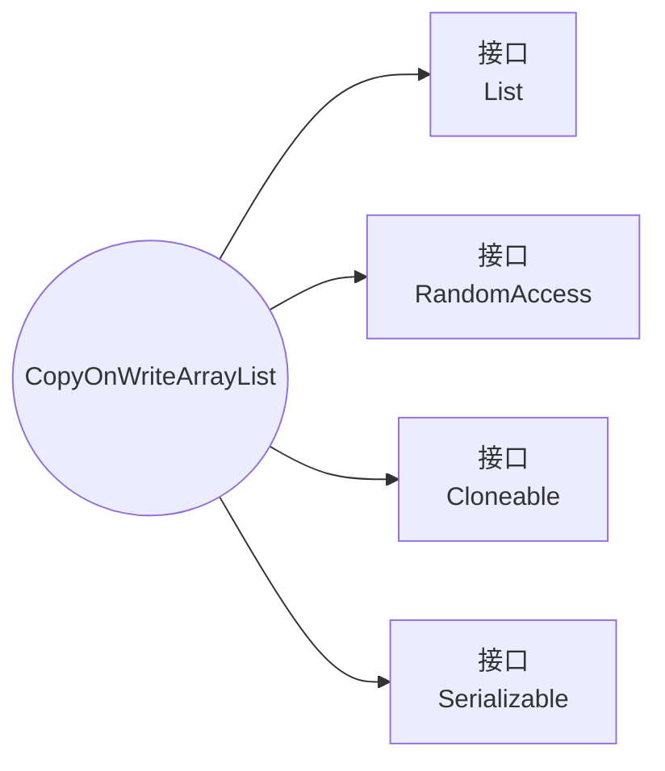
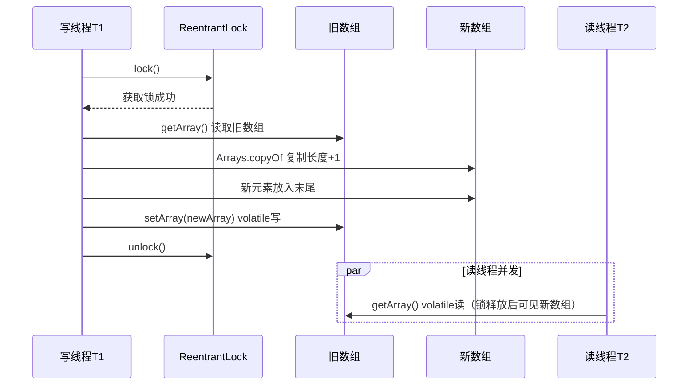
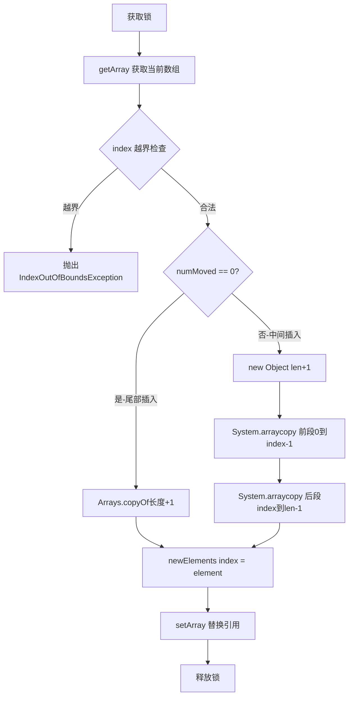
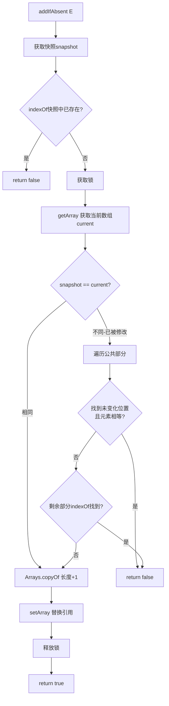
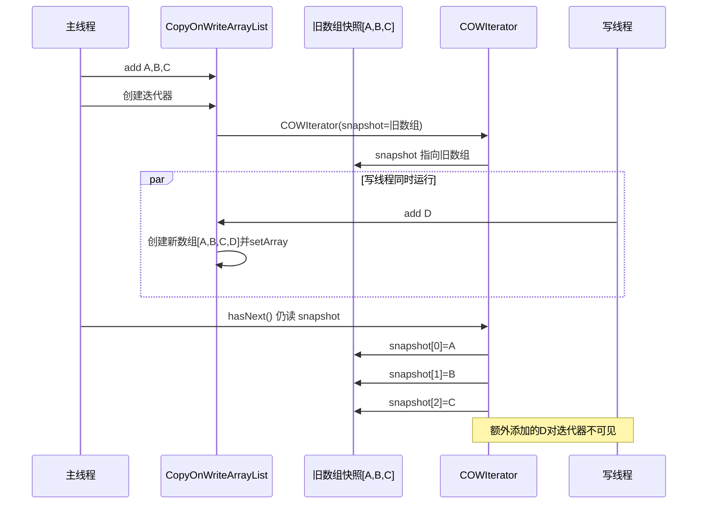
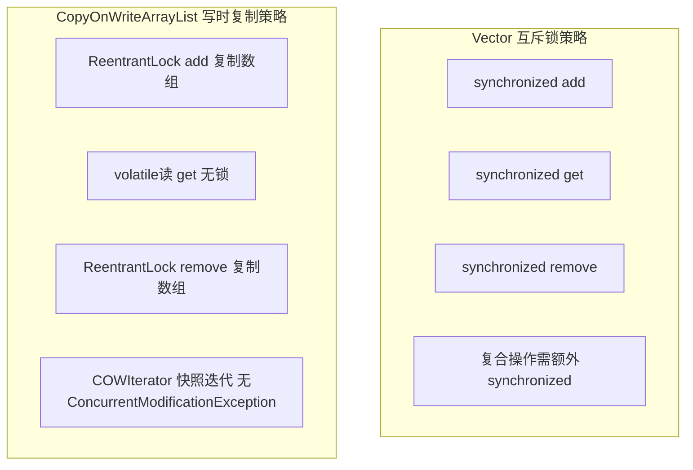
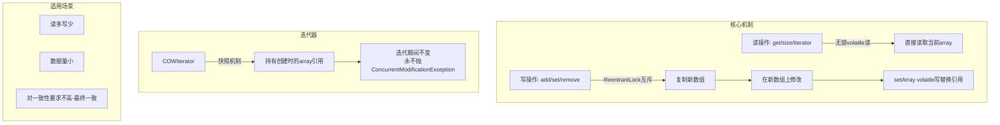

# CopyOnWriteArrayList 源码深度解析：从线程安全列表到写时复制的实现原理

## 一、问题切入：一个会抛出 ConcurrentModificationException 的场景

### ❓ 1.1 普通 ArrayList 在并发下的问题

写一段看似正常的代码：遍历一个 `ArrayList` 的同时往里面添加元素。

```java
public class ArrayListConcurrencyDemo {
    public static void main(String[] args) {
        List<String> list = new ArrayList<>();
        list.add("A");
        list.add("B");
        list.add("C");

        // 线程1：遍历
        new Thread(() -> {
            for (String s : list) {
                System.out.println(s);
                try {
                    Thread.sleep(100);
                } catch (InterruptedException e) {
                    e.printStackTrace();
                }
            }
        }).start();

        // 主线程：写入
        new Thread(() -> {
            try {
                Thread.sleep(50);
            } catch (InterruptedException e) {
                e.printStackTrace();
            }
            list.add("D");
        }).start();
    }
}
```

这段代码运行时大概率抛出 `ConcurrentModificationException`。这是 `ArrayList` 的 **fail-fast** 机制（快速失败）：迭代器在遍历时检测到集合结构被修改，立即抛出异常。

另一种更隐蔽的场景：多个线程同时对同一个 `ArrayList` 调用 `add()` 方法。由于 `ArrayList` 内部的 `elementData` 数组和 `size` 计数器都没有做同步保护，可能出现：

- 两个线程同时 add，一个元素丢失（线程 A 刚把元素放进数组 slot，还没更新 size，线程 B 又放进了同一个 slot）
- `size` 变量因竞态条件出现错误值
- 数组扩容时 IndexOutOfBoundsException

<span style="color:red">ArrayList 不是线程安全的，且没有自行处理并发保护</span>——直接用于多线程环境会导致数据错乱或异常。

### 📌 1.2 传统方案：Vector 或 Collections.synchronizedList

常规解决方式有两种：

```java
// 方案一：Vector
List<String> vector = new Vector<>();
vector.add("A");

// 方案二：同步包装器
List<String> syncList = Collections.synchronizedList(new ArrayList<>());
syncList.add("A");
```

但这两个方案有一个共同的缺陷：**复合操作仍不安全**。一个线程调用 `size()` 获取大小 3，另一个线程紧跟调用 `remove(0)`，此时第一个线程再用 size=3 去 get 最后一个元素就会越界。复合操作必须额外加锁：

```java
synchronized (syncList) {
    for (int i = 0; i < syncList.size(); i++) {
        System.out.println(syncList.get(i));
    }
}
```

这种额外的 `synchronized` 在并发量高时带来严重的锁竞争开销。于是 `CopyOnWriteArrayList` 提出了一种完全不同的并发安全策略——**写时复制**。

## 📐 二、设计理念：Copy-On-Write

### 📌 2.1 什么是写时复制

写时复制（Copy-On-Write，COW）是一种并发优化策略。它的核心思想只有一句话：**当容器需要被修改时，不直接在原数组上操作，而是先复制一份新数组，在新数组上修改，修改完成后用新数组替换旧数组的引用**。

这就保证了：读操作永远在不变的数组上进行，完全不需要加锁；写操作虽然开销大，但只影响它自己，不会阻塞任何读线程。

### 📌 2.2 CopyOnWriteArrayList 的架构总览

CopyOnWriteArrayList 的并发安全由"一锁一数组"两个组件配合完成：

```mermaid
flowchart TD
    COW[CopyOnWriteArrayList]
    COW --> ARRAY[array: volatile Object[]]
    COW --> LOCK[lock: ReentrantLock]
    ARRAY --> A0[元素0]
    ARRAY --> A1[元素1]
    ARRAY --> A2[元素2]
    ARRAY --> AN[元素N]
    LOCK -->|写操作加锁| W[写线程]
    ARRAY -->|volatile读无锁| R[读线程]
```

| 组件 | 类型 | 作用 |
|------|------|------|
| `array` | `volatile Object[]` | 存储元素，volatile 保证写后对其他线程立即可见 |
| `lock` | `final ReentrantLock` | 写操作的互斥锁，同一时刻只允许一个写线程 |

<span style="color:red">`array` 加上 `volatile` 是关键</span>——写线程完成数组替换后，`volatile` 写语义将所有读线程看到的旧引用刷成新引用，保证最终一致性。

### 🔗 2.3 类继承关系



CopyOnWriteArrayList 实现了四个接口：

| 接口 | 含义 |
|------|------|
| `List<E>` | 提供列表的标准增删改查 API |
| `RandomAccess` | 标记接口，表明底层基于数组，支持 O(1) 随机访问 |
| `Cloneable` | 支持 `clone()` 创建浅拷贝 |
| `Serializable` | 支持序列化与反序列化 |

对比它的"并发兄弟" `CopyOnWriteArraySet`，CopyOnWriteArraySet 内部直接持有一个 CopyOnWriteArrayList 实例，所有操作都委托给它——两者共享同一套写时复制的并发安全实现。

## 🔒 三、数据结构展开：volatile 数组 + ReentrantLock

### ⚙️ 3.1 核心字段

打开 JDK 源码，CopyOnWriteArrayList 的核心字段只有两个：

```java
public class CopyOnWriteArrayList<E>
    implements List<E>, RandomAccess, Cloneable, java.io.Serializable {

    /** 保证写操作的互斥 */
    final transient ReentrantLock lock = new ReentrantLock();

    /** 存储元素的数组，volatile 保证可见性 */
    private transient volatile Object[] array;
}
```

字段逐行解释：

- **`lock`**：`final` 修饰，构造时初始化一次，不可变。所有写操作（add、set、remove 等）必须先获取此锁。读操作不碰此锁。
- **`array`**：`volatile` 修饰。`volatile` 的核心作用是：当一个线程调用 `setArray(newArray)` 后，其他所有线程随后通过 `getArray()` 读到的都是新数组引用，不会看到过期的旧引用。`transient` 意味着序列化时不会直接序列化此字段——CopyOnWriteArrayList 通过自定义 `writeObject`/`readObject` 处理。

### 📋 3.2 获取和设置数组的工具方法

```java
final Object[] getArray() {
    return array;           // volatile 读
}

final void setArray(Object[] a) {
    array = a;              // volatile 写
}
```

这两个方法是 CopyOnWriteArrayList 内部操作数组的唯一入口。<span style="color:red">所有写操作最终都通过 `setArray` 原子性地替换数组引用，所有读操作都通过 `getArray` 读取当前快照</span>。

这里有一个重要的设计细节：`lock` 字段是通过 `synchronized (lock)` 或直接 `lock.lock()` 使用的，但 CopyOnWriteArrayList 还通过反射 + CAS 获取了 `lock` 字段的内存偏移量（`lockOffset`），用于 `addIfAbsent` 方法的优化。这一点在后面的源码分析中展开。

## 📖 四、源码分析：写操作的完整调用链

### 🔄 4.1 add(E e)——经典写时复制流程

`add` 是理解整个写时复制机制最好的入口。它的完整源码如下：

```java
public boolean add(E e) {
    final ReentrantLock lock = this.lock;
    lock.lock();                          // ① 获取锁
    try {
        Object[] elements = getArray();   // ② 获取当前数组快照
        int len = elements.length;
        Object[] newElements = Arrays.copyOf(elements, len + 1); // ③ 复制新数组
        newElements[len] = e;             // ④ 在新数组末尾放入新元素
        setArray(newElements);            // ⑤ volatile 写，替换数组引用
        return true;
    } finally {
        lock.unlock();                    // ⑥ 释放锁
    }
}
```

逐行解读：

- **① 获取锁**：`ReentrantLock.lock()` 保证写操作互斥。如果线程 A 正在 add，线程 B 的 add 会在这里阻塞。
- **② 获取当前数组**：`getArray()` 是 `volatile` 读，拿到此时最新的数组引用。
- **③ `Arrays.copyOf`**：这是理解 COW 开销的关键。JDK 底层调用 `System.arraycopy` 将原数组的每个元素复制到长度 +1 的新数组。时间复杂度 O(n)。
- **④ 赋值新元素**：直接固定在 `newElements[len]` 位置。
- **⑤ volatile 写**：`setArray(newElements)` 将 array 指向新数组。从此刻起，所有新发起的读请求都能看到新元素。
- **⑥ 释放锁**：无论是否发生异常，锁都会被释放。

时序图展示整个流程：



**关键点**：读线程 T2 在整个过程中没有等待任何锁。在 T1 执行 `setArray` 之前，T2 读到的还是旧数组（没有新元素）；在 T1 执行 `setArray` 之后，T2 的 `volatile` 读就能看到新数组（包含新元素）。

### 📌 4.2 add(int index, E element)——指定位置插入

在指定位置插入元素的源码：

```java
public void add(int index, E element) {
    final ReentrantLock lock = this.lock;
    lock.lock();
    try {
        Object[] elements = getArray();
        int len = elements.length;
        if (index > len || index < 0)
            throw new IndexOutOfBoundsException("Index: " + index + ", Size: " + len);
        Object[] newElements;
        int numMoved = len - index;
        if (numMoved == 0)
            newElements = Arrays.copyOf(elements, len + 1);
        else {
            newElements = new Object[len + 1];
            System.arraycopy(elements, 0, newElements, 0, index);
            System.arraycopy(elements, index, newElements, index + 1, numMoved);
        }
        newElements[index] = element;
        setArray(newElements);
    } finally {
        lock.unlock();
    }
}
```

与尾部 add 的区别在于数组复制策略：如果插入位置不是末尾，需要两次 `System.arraycopy`——先复制 `[0, index)` 段，再复制 `[index, len)` 段到偏移一位的位置。



### 📌 4.3 set(int index, E element)——替换指定位置元素

```java
public E set(int index, E element) {
    final ReentrantLock lock = this.lock;
    lock.lock();
    try {
        Object[] elements = getArray();
        E oldValue = get(elements, index);

        if (oldValue != element) {
            int len = elements.length;
            Object[] newElements = Arrays.copyOf(elements, len);
            newElements[index] = element;
            setArray(newElements);
        } else {
            // 新旧值相同，但为了 volatile 写语义，仍调用 setArray
            setArray(elements);
        }
        return oldValue;
    } finally {
        lock.unlock();
    }
}
```

注意这段代码中的细节：当 `oldValue == element`（新旧值是同一个引用），并没有直接跳过写操作，而是执行了 `setArray(elements)`。这个"空写"不是多余的——它保证了 `volatile` 的写语义。如果直接 `return`，其他线程可能因为缺少 `volatile` 写与后续 `volatile` 读之间的 happens-before 关系而看到过时状态。

### 📌 4.4 remove(int index)——删除指定位置元素

```java
public E remove(int index) {
    final ReentrantLock lock = this.lock;
    lock.lock();
    try {
        Object[] elements = getArray();
        int len = elements.length;
        E oldValue = get(elements, index);
        int numMoved = len - index - 1;
        if (numMoved == 0)
            setArray(Arrays.copyOf(elements, len - 1));
        else {
            Object[] newElements = new Object[len - 1];
            System.arraycopy(elements, 0, newElements, 0, index);
            System.arraycopy(elements, index + 1, newElements, index, numMoved);
            setArray(newElements);
        }
        return oldValue;
    } finally {
        lock.unlock();
    }
}
```

删除操作与 add(index, element) 的复制策略对称：

- **删除最后一个元素**（`numMoved == 0`）：直接用 `Arrays.copyOf(elements, len - 1)` 截断尾部。
- **删除中间元素**：创建 `len - 1` 长度的新数组，先复制 `[0, index)` 段，再复制 `[index+1, len)` 段（跳过被删元素）。

### 🔧 4.5 addIfAbsent(E e)——"不存在才添加"的并发安全实现

`addIfAbsent` 是 CopyOnWriteArrayList 中最复杂的方法。它的语义是：**如果元素 e 不在列表中，则添加并返回 true；否则直接返回 false**。这看起来像是 `contains` + `add` 的复合操作，但在并发环境下可能会有两个线程同时发现元素不存在，二者都添加——这正是需要 `addIfAbsent` 保证原子性的原因。

```java
public boolean addIfAbsent(E e) {
    Object[] snapshot = getArray();
    return indexOf(e, snapshot, 0, snapshot.length) >= 0 ? false :
        addIfAbsent(e, snapshot);
}

private boolean addIfAbsent(E e, Object[] snapshot) {
    final ReentrantLock lock = this.lock;
    lock.lock();
    try {
        Object[] current = getArray();
        int len = current.length;
        if (snapshot != current) {            // ① 快照已过时
            int common = Math.min(snapshot.length, len);
            for (int i = 0; i < common; i++) {
                if (current[i] != snapshot[i] && eq(e, current[i]))
                    return false;             // ② 已被其他线程添加
            }
            if (indexOf(e, current, common, len) >= 0)
                return false;                 // ③ 在超出部分中找到
        }
        Object[] newElements = Arrays.copyOf(current, len + 1);
        newElements[len] = e;
        setArray(newElements);
        return true;
    } finally {
        lock.unlock();
    }
}
```

这个方法的执行流程分为两个阶段：

**阶段一（无锁预检）**：在加锁前，先用 `indexOf` 在快照 snapshot 上检查元素是否已存在。如果已存在，直接返回 false，避免了加锁的开销。这一步只是优化，不保证正确性（因为检查时无锁，快照可能过时）。

**阶段二（加锁后双重检查）**：获取锁后，再次检查。重点在于 `snapshot != current` 这个判断：

- 如果快照和当前数组相同（引用相等），说明在获取快照到加锁之间没有其他写操作，可以直接走到复制添加逻辑。
- 如果快照和当前数组不同，说明这期间发生了写操作。此时需要遍历快照和历史数组的公共部分，对比差异：若某个位置 `current[i] != snapshot[i]` 且 `current[i].equals(e)`，说明目标元素 e 已被其他线程添加，直接返回 false。还不够——如果公共部分没找到差异，还要检查超出的那一段（`indexOf(key, current, common, len)`），因为新数组可能更长。



这个双重检查机制是 `CopyOnWriteArrayList` 中唯一一处涉及"比较新旧数组差异"的地方，也是它实现 `Set` 语义（`CopyOnWriteArraySet` 底层复用了这个方法）的核心逻辑。

## 5️⃣ 五、COWIterator：快照迭代器

### ⚙️ 5.1 快照机制的设计

CopyOnWriteArrayList 的迭代器 `COWIterator` 的核心设计是：**创建迭代器时，直接持有当前数组引用的快照**。

```java
static final class COWIterator<E> implements ListIterator<E> {
    private final Object[] snapshot;   // 创建时的数组快照
    private int cursor;                // 当前位置索引

    private COWIterator(Object[] elements, int initialCursor) {
        cursor = initialCursor;
        snapshot = elements;           // 直接引用，不复制
    }

    public boolean hasNext() {
        return cursor < snapshot.length;
    }

    public E next() {
        if (!hasNext())
            throw new NoSuchElementException();
        return (E) snapshot[cursor++];
    }
}
```

关键点：<span style="color:red">`snapshot` 不是复制出来的新数组，而是直接指向创建时刻的 `array` 引用</span>。由于 CopyOnWriteArrayList 的写操作总是创建新数组然后替换引用，旧数组本身不会被修改。因此，这个 snapshot 引用在迭代器的整个生命周期中都是安全且不变的。

### 📌 5.2 弱一致性的具体表现

下面用一张时序图展示迭代器"看不到后续写入"的现象：



### 📌 5.3 不支持写操作

COWIterator 的 `remove()`、`set()`、`add()` 全部抛出 `UnsupportedOperationException`：

```java
public void remove() {
    throw new UnsupportedOperationException();
}

public void set(E e) {
    throw new UnsupportedOperationException();
}

public void add(E e) {
    throw new UnsupportedOperationException();
}
```

这是由快照机制决定的——迭代器操作的是旧数组，如果在旧数组上修改，修改会被写线程的新数组覆盖，导致数据丢失。

## 六、与 Vector 的全面对比

Vector 和 CopyOnWriteArrayList 都是 `List` 的线程安全实现，但两者的安全策略完全不同。



| 对比维度 | Vector | CopyOnWriteArrayList |
|---------|--------|---------------------|
| 读操作加锁 | 是，`synchronized` | 否，volatile 读直接返回 |
| 写操作实现 | 直接在原数组操作 | 复制新数组，在新数组操作后替换引用 |
| 迭代器安全性 | fail-fast，修改抛 `ConcurrentModificationException` | fail-safe，快照迭代，永不抛异常 |
| 迭代器写支持 | 支持 `remove()` | 不支持，抛 `UnsupportedOperationException` |
| 数据一致性 | 强一致性 | 最终一致性（弱一致性） |
| 写操作内存开销 | 低，原地修改 | 高，每次复制整个数组 |
| 适用场景 | 写操作较多 | 读多写少 |

<span style="color:red">Vector 的读操作加锁是主要的性能瓶颈</span>。即使是为了获取一个尺寸 `size()`，也要排他性地获取锁。而 CopyOnWriteArrayList 的 `size()` 只需要一次 volatile 读。

`Collections.synchronizedList(new ArrayList<>())` 的情况与 Vector 相同——所有方法都通过 `synchronized` 包装，包括读方法。

## 🛠️ 七、日常开发中的常用方法

CopyOnWriteArrayList 作为 `List` 接口的实现，日常使用的 API 与 `ArrayList` 几乎相同，但因为线程安全特性的加持，在特定场景下是更好的选择。

| 方法 | 用途 | 频率 |
|------|------|------|
| `new CopyOnWriteArrayList<>()` | 创建空列表 | 高 |
| `add(E e)` | 末尾添加元素（会复制数组） | 高 |
| `get(int index)` | 按索引读取（无锁） | 高 |
| `set(int index, E e)` | 替换指定位置元素 | 中 |
| `remove(int index)` | 按索引删除（会复制数组） | 中 |
| `addIfAbsent(E e)` | 不存在才添加（原子性保证） | 中 |
| `iterator()` | 获取快照迭代器 | 高 |
| `size()` | 获取元素个数（无锁） | 高 |
| `contains(Object o)` | 判断元素是否存在（无锁） | 中 |

### 💻 7.1 基本使用示例

```java
// 创建
CopyOnWriteArrayList<String> list = new CopyOnWriteArrayList<>();

// 批量添加
list.add("redis");
list.add("mysql");
list.add("mongodb");

// 并发读——多个线程可以同时读，完全无锁
new Thread(() -> {
    for (String s : list) {
        System.out.println(s);
    }
}).start();

// 并发写——ReentrantLock 互斥
new Thread(() -> {
    list.add("elasticsearch");   // 内部复制整个数组
}).start();

// addIfAbsent——不存在才添加
boolean added = list.addIfAbsent("redis");    // false，已存在
boolean added2 = list.addIfAbsent("kafka");   // true，添加成功
```

### 🌐 7.2 典型的读多写少场景

```java
public class EventListenerRegistry {
    // 监听器列表：注册/注销远少于事件通知
    private final CopyOnWriteArrayList<EventListener> listeners =
        new CopyOnWriteArrayList<>();

    public void register(EventListener listener) {
        listeners.addIfAbsent(listener);
    }

    public void unregister(EventListener listener) {
        listeners.remove(listener);
    }

    public void fireEvent(Event event) {
        // 读操作：无锁遍历，高频调用无性能瓶颈
        for (EventListener listener : listeners) {
            listener.onEvent(event);
        }
    }
}
```

在这个场景中，`register` / `unregister` 仅在系统启动或配置变更时偶尔触发，而 `fireEvent` 在每次业务请求时都会调用。使用 CopyOnWriteArrayList 避免了事件通知路径上的锁竞争。

### 📊 7.3 与 ArrayList 的现代用法对比

| 场景 | 传统 ArrayList 写法 | CopyOnWriteArrayList 写法 |
|------|---------------------|--------------------------|
| 普通遍历 | `for (String s : list)` | 相同，但迭代器为快照 |
| 遍历中删元素 | `iterator.remove()` 支持 | 不支持，需另外收集后批量 removeAll |
| 排序 | `Collections.sort(list)` | 不支持，内部数组不可变；需 `toArray()` 后排序再批量添加 |

## 🛠️ 八、使用注意事项

### 📌 8.1 内存开销：每次写操作都复制整个数组

这是 CopyOnWriteArrayList 最核心的代价。假设列表中有 10 万个元素，每次 `add` 都要复制这 10 万个元素到新数组。如果写操作频率较高，GC 压力会显著上升。

```java
// 错误用法：列表较大时频繁写入
CopyOnWriteArrayList<Integer> list = new CopyOnWriteArrayList<>();
for (int i = 0; i < 100_000; i++) {
    list.add(i);   // 第i次add复制 i 个元素，累计O(n²)复制量
}
```

正确做法：如果初始化阶段有大量写入，应先用普通 `ArrayList` 完成批量操作，再转为 CopyOnWriteArrayList。

```java
List<Integer> temp = new ArrayList<>();
for (int i = 0; i < 100_000; i++) {
    temp.add(i);
}
CopyOnWriteArrayList<Integer> list = new CopyOnWriteArrayList<>(temp);
```

### 📌 8.2 数据一致性：读写之间是弱一致性

CopyOnWriteArrayList 只能保证 **最终一致性**，不能保证 **实时一致性**。以下场景会读到旧数据：

```java
CopyOnWriteArrayList<String> list = new CopyOnWriteArrayList<>();
list.add("old");

// 线程A：写操作
new Thread(() -> {
    list.set(0, "new");   // 复制数组并替换引用
}).start();

// 主线程：紧跟着读
System.out.println(list.get(0));  // 可能还是 "old"
```

`set` 操作包括：加锁 → 复制数组 → 修改元素 → volatile 写替换引用 → 释放锁。在 `setArray` 执行之前发起 `get` 的线程，读到的还是旧数组。

### 📌 8.3 迭代器不可修改

前面已经提到，COWIterator 的 `remove()`、`set()`、`add()` 都直接抛异常。如果在迭代过程中需要删除元素，必须在遍历完成后批量处理：

```java
CopyOnWriteArrayList<String> list = new CopyOnWriteArrayList<>();
list.add("A"); list.add("B"); list.add("C");

// 错误写法
for (String s : list) {
    if ("B".equals(s)) {
        list.remove(s);   // 不会抛异常，但删除的是"当前数组"而非"快照数组"
    }
}

// 正确写法：先收集，再批量删除
List<String> toRemove = new ArrayList<>();
for (String s : list) {
    if ("B".equals(s)) {
        toRemove.add(s);
    }
}
list.removeAll(toRemove);
```

### 🌐 8.4 不适合数据量大的场景

在高性能互联网应用中，如果列表的数据量可能达到几千甚至上万，且存在写操作，使用 CopyOnWriteArrayList 可能导致：

- **Young GC / Full GC**：每次写操作产生一个新的数组对象，旧数组被立即废弃。如果元素数量多，数组占用内存大（比如 10 万个引用 ≈ 0.8 MB），频繁写入会快速填满 Young 区，甚至触发 Full GC。
- **写操作延迟抖动**：数组复制的时间与元素数量成正比。在延迟敏感的系统中，一个 `add` 调用可能突然耗时数十毫秒，造成请求超时。

### ⚠️ 8.5 不适合排序操作

CopyOnWriteArrayList 会拒绝 `Collections.sort()`：

```java
CopyOnWriteArrayList<Integer> list = new CopyOnWriteArrayList<>();
list.add(3); list.add(1); list.add(2);
Collections.sort(list);  // 抛出 UnsupportedOperationException
```

原因是 `sort` 内部会尝试调用 `List.set()`，但迭代器需要获取数组长度等数值并在原地写——这在 COW 的数据结构上无法高效实现。如果必须排序，需要先转为数组：

```java
Integer[] arr = list.toArray(new Integer[0]);
Arrays.sort(arr);
CopyOnWriteArrayList<Integer> sorted = new CopyOnWriteArrayList<>(arr);
```

### 🎯 8.6 适用场景总结

| 场景 | 是否适合 | 说明 |
|------|:---:|------|
| 事件监听器注册列表 | 适合 | 注册/注销低频，事件通知高频 |
| 白名单/黑名单缓存 | 适合 | 更新频率极低，读取频率极高 |
| 系统配置项列表 | 适合 | 启动时写入，运行时只读 |
| 高并发写入队列 | 不适合 | 写操作复制整个数组，性能极差 |
| 大数据量列表（> 1 万条） | 不适合 | 每次写复制大量数据，内存和 CPU 开销大 |
| 需要排序的列表 | 不适合 | 不支持 `sort()` |

## 🎯 九、总结

CopyOnWriteArrayList 通过 **volatile + ReentrantLock + 数组复制** 三种机制的组合，实现了一种适合"读多写少"场景的线程安全列表。



| 维度 | 要点回顾 |
|------|---------|
| 设计理念 | 写时复制（COW）：写时不修改原数组，而是复制新数组、修改、替换引用 |
| 数据结构 | `volatile Object[] array` + `final ReentrantLock lock` |
| 读操作 | 完全无锁，volatile 读保证可见性 |
| 写操作 | ReentrantLock 互斥，复制整个数组，时间复杂度 O(n) |
| 迭代器 | COWIterator 快照机制，弱一致性，不支持 remove/set/add |
| 与 Vector 对比 | 读操作无锁性能显著优于 Vector，但写操作内存开销大 |
| 核心局限 | 每次写操作复制整个数组，内存消耗大，不能保证实时一致性 |
