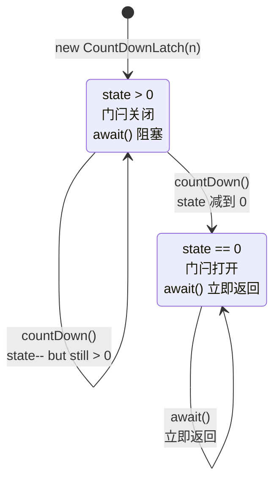
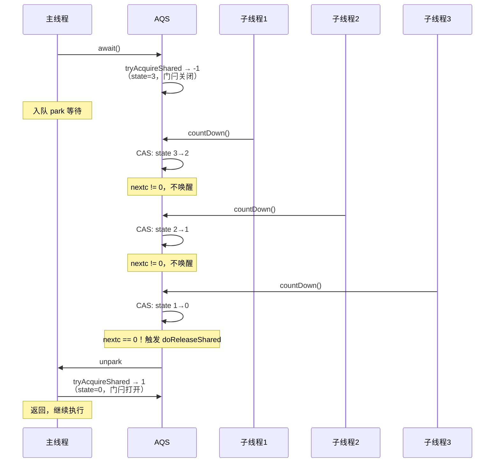
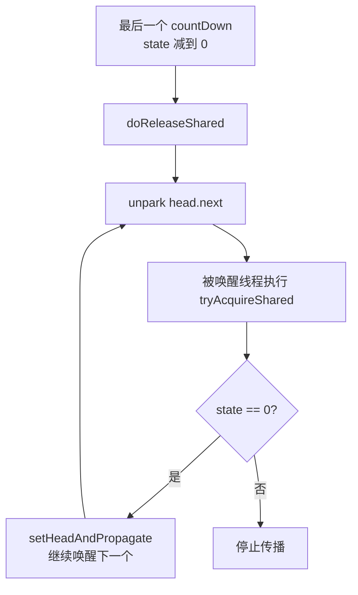
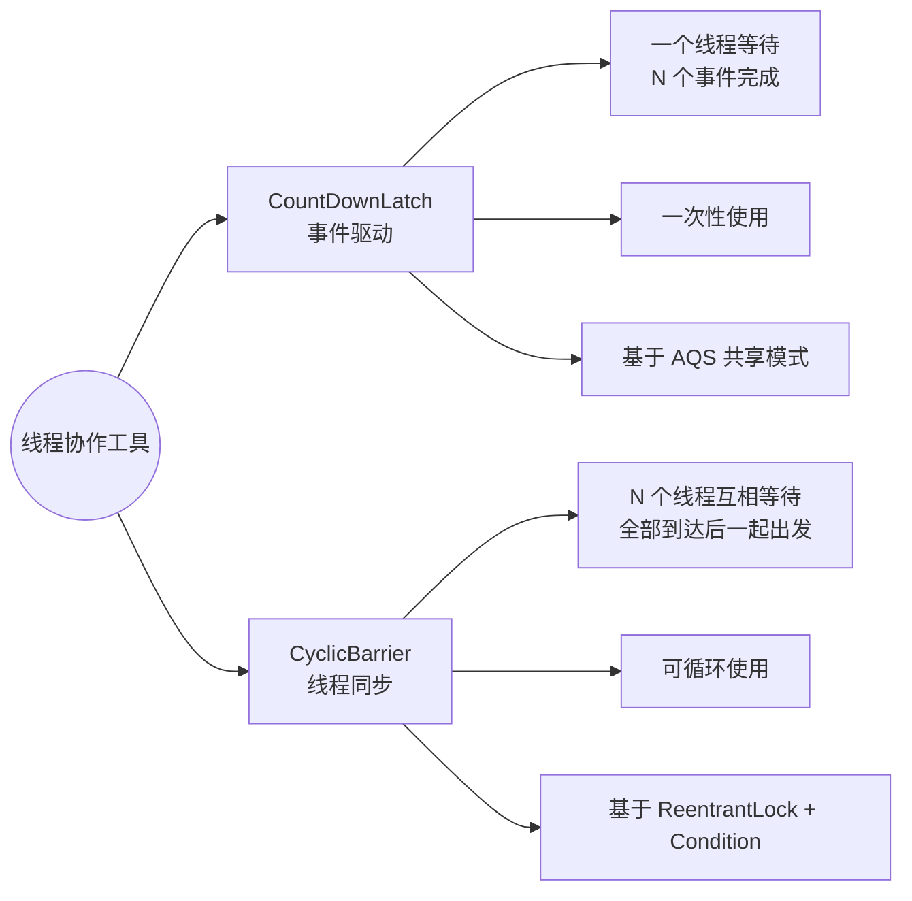
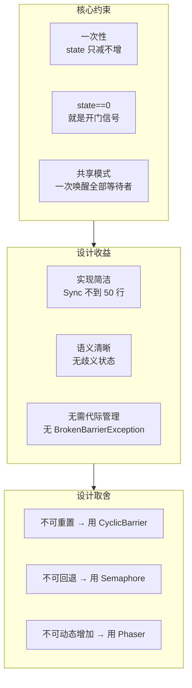

# CountDownLatch 设计思想解析：一次性的共享门闩为什么这样设计

## 🤔 问题切入：等待多个异步任务完成的困境

以下是一个常见的业务场景——主线程需要等待 3 个子任务全部完成后才能继续：

```java
public class NaiveParallel {
    static volatile int finished = 0;

    public static void main(String[] args) throws InterruptedException {
        for (int i = 0; i < 3; i++) {
            new Thread(() -> {
                doWork();
                finished++;  // 自增不是原子的
            }).start();
        }

        while (finished < 3) {  // 自旋等待，浪费 CPU
            Thread.sleep(100);
        }
        System.out.println("所有任务完成");
    }
}
```

这段代码有三个问题：① `finished++` 不是原子操作；② 主线程自旋空转浪费 CPU；③ `sleep(100)` 导致最多 100ms 的延迟响应。

用 `Thread.join()` 可以解决部分问题，但 `join()` 等待的是线程终止，而不是"任务完成"。如果线程是复用的（线程池）， `join()` 完全不适用。

**CountDownLatch** ⏳ 就是为这个场景设计的——它提供了一个轻量级的"倒计时门闩"：主线程在 `await()` 上阻塞，子任务完成后调用 `countDown()`，计数器归零时主线程自动唤醒。

```java
public class CountDownLatchDemo {
    public static void main(String[] args) throws InterruptedException {
        int n = 3;
        CountDownLatch latch = new CountDownLatch(n);

        for (int i = 0; i < n; i++) {
            new Thread(() -> {
                doWork();
                latch.countDown();  // 原子减 1
            }).start();
        }

        latch.await();  // 阻塞直到计数器 = 0
        System.out.println("所有任务完成");
    }
}
```

## 设计理念 1：一次性的约束

CountDownLatch 最核心的设计约束是 **一次性** ——一旦计数器从 N 减到 0，门闩永久打开，无法再关闭。

这个约束绝非"能力不足"，而是 **刻意的设计取舍** ：

| 如果支持重置 | 代价 |
|------------|------|
| 需要处理"已有线程在 await 上等待"和"重置后的新等待者"两种状态 | 状态机复杂度翻倍 |
| `countDown` 和 `reset` 并发时的语义难以定义 | 需要额外的同步机制 |
| 每个等待者都要知道自己是"老批次"还是"新批次" | 需要代际（generation）标记 |

<span style="color:red">一次性约束消除了一个巨大的设计空间：时间维度上的状态管理。</span> CountDownLatch 只有两个有意义的状态： `state > 0` （门闩关闭）和 `state == 0` （门闩打开）。从关闭到打开只需要 `state` 单向递减，不需要考虑"打开了又关上"的复杂路径。



state 只减不增，状态转换单向不可逆。这让 CountDownLatch 的实现极其简洁——Sync 内部类不到 50 行源码。

如果需要可重置的"栅栏"语义，应使用 CyclicBarrier。两者的选择不是"谁更好"，而是"你的场景需要什么样的语义"。如果需要等待多个线程到达同一同步点后集体出发，用 CyclicBarrier；如果只需要等待 N 个事件发生，用 CountDownLatch。

## 设计理念 2：用 state 的值本身作为"是否开门"的判断

回顾 AQS 的 `tryAcquireShared` 模板方法——它的返回值有三种语义：

```java
// tryAcquireShared 返回值约定：
// 负数    → 获取失败，入队等待
// 0       → 获取成功，但不传播唤醒
// 正数    → 获取成功，且需要传播唤醒给后续共享节点
```

CountDownLatch 对此的使用堪称精妙：

```java
// CountDownLatch.Sync
protected int tryAcquireShared(int acquires) {
    return (getState() == 0) ? 1 : -1;
    //      state=0 → 门闩打开 → 返回 1（成功+传播）
    //      state>0 → 门闩关闭 → 返回 -1（失败，入队）
}
```

不需要额外的布尔标志，不需要额外的锁， **state 的值本身就是判断条件** 。 `state == 0` 的意思是"开门"，这个语义直接编码在 state 的数值上。

再看看 `tryReleaseShared`：

```java
protected boolean tryReleaseShared(int releases) {
    for (;;) {
        int c = getState();
        if (c == 0)
            return false;          // ① 已经是 0，不做任何事
        int nextc = c - 1;         // ② 减 1
        if (compareAndSetState(c, nextc))
            return nextc == 0;     // ③ 减到 0 时返回 true，触发唤醒
    }
}
```

`return nextc == 0` 是点睛之笔：<span style="color:red">只有当这次 countDown 恰好把计数器减到 0 时，才返回 true 通知 AQS 去唤醒等待者。</span> 之前的所有 `countDown`（`c > 1` 时）返回 false，AQS 不会做唤醒操作。这意味着：

- N 次 `countDown()` 中，前 N-1 次只修改 state，不触发唤醒
- 最后一次 `countDown()` 才负责唤醒所有在 `await()` 上阻塞的线程



## 设计理念 3：共享模式的唤醒传播

CountDownLatch 选择 AQS **共享模式** 的原因是：可能有多个线程同时在 `await()` 上等待——它们需要被同时唤醒。



关键代码在 AQS 的 `setHeadAndPropagate` 中：

```java
private void setHeadAndPropagate(Node node, int propagate) {
    Node h = head;
    setHead(node);
    if (propagate > 0 || h == null || h.waitStatus < 0) {
        Node s = node.next;
        if (s == null || s.isShared())
            doReleaseShared();  // 唤醒下一个共享节点
    }
}
```

`tryAcquireShared` 返回 1（正数），满足 `propagate > 0`，因此唤醒会沿同步队列向后传播，直到所有等待者都被唤醒。这就是"一次 `countDown` 到 0，唤醒所有等待者"的底层机制。

这里有一个容易被忽略的设计细节： **为什么 `tryAcquireShared` 返回 1 而不是 0？**

如果返回 0， `propagate > 0` 不成立，传播不会发生。在高并发场景下，可能有等待线程因为传播链断裂而永久阻塞。返回 1 确保传播一定会进行——这是 CountDownLatch 与 Semaphore （ `tryAcquireShared` 可能返回 0 表示最后一个许可被取走，后续无需传播）在设计意图上的根本区别。

## 设计理念 4：await 的超时与不可复用

`await(long timeout, TimeUnit unit)` 提供了超时等待能力。当超时发生时，线程被中断唤醒，AQS 的 `doAcquireSharedNanos` 将节点的 `waitStatus` 置为 CANCELLED，并从队列中移除。

但超时返回的线程 **不会影响其他仍在等待的线程** ——state 没有变化，门闩仍然关闭。其他线程继续等待，直到 state 减到 0。

这意味着 CountDownLatch 天然支持"部分等待者超时退出，其余继续等待"的场景，不需要额外设计。

## 与 CyclicBarrier 的设计取舍对比

这两个工具类经常被放在一起比较，但它们的 **设计意图完全不同** ：



| 设计维度 | CountDownLatch | CyclicBarrier |
|---------|---------------|---------------|
| **核心语义** | 等待"倒计时归零"这个事件 | 等待"所有线程到达"这个同步点 |
| **角色关系** | 等待者（被动）与倒计时者（主动）角色分离 | 所有参与者平等，互相等待 |
| **可重用性** | 一次性，state 只减不增 | 可循环，所有线程释放后自动重置 |
| **底层实现** | 继承 AQS，使用共享模式 | 组合 ReentrantLock + Condition |
| **触发条件** | state 减到 0 | 所有 N 个线程都调用了 `await()` |
| **中断处理** | 单个等待者被中断不影响其他等待者 | 一个线程被中断会破坏整个栅栏（BrokenBarrierException） |
| **state 方向** | 单向递减 N → 0 | 单向递增 0 → N（到达计数） |
| **代码行数** | ~100 行（含 Sync） | ~400 行（含 Generation 代际管理） |

<span style="color:red">CyclicBarrier 的循环能力是以更高的实现复杂度为代价的。</span> 它需要 `Generation` 对象来区分不同"代"的同步批次——当一代完成后，创建新的 Generation 开始下一轮。CountDownLatch 通过放弃循环能力，换取了极其简单的实现。

### 🌐 各自适用场景

```java
// CountDownLatch 适用：主线程等待多个异步任务的结果
ExecutorService pool = Executors.newFixedThreadPool(5);
CountDownLatch latch = new CountDownLatch(10);
for (int i = 0; i < 10; i++) {
    pool.submit(() -> {
        processOneItem();
        latch.countDown();  // "我完成了"的信号
    });
}
latch.await();  // 等待全部完成
System.out.println("10 个任务全部完成");

// CyclicBarrier 适用：多个线程分阶段协同计算
CyclicBarrier barrier = new CyclicBarrier(3, () -> {
    System.out.println("本轮计算完成，汇总结果");
});
for (int i = 0; i < 3; i++) {
    new Thread(() -> {
        for (int round = 0; round < 5; round++) {
            computeOneRound();
            barrier.await();  // 等待同伴，然后一起进入下一轮
        }
    }).start();
}
```

## 设计理念 5：极简 API 体现单一职责

CountDownLatch 只暴露两个核心方法，远少于其他 JUC 工具：

| 方法 | 职责 |
|------|------|
| `CountDownLatch(int count)` | 构造，设定初始计数 |
| `countDown()` | 计数器减 1 |
| `await()` | 阻塞直到计数器 = 0 |
| `await(long, TimeUnit)` | 带超时的阻塞等待 |
| `getCount()` | 查询当前计数（仅用于调试/日志） |

没有 `reset()`、没有 `increase()`、没有 `close()`。每个方法职责单一，不重叠，不模糊。

这种 API 设计反映了 CountDownLatch 的 **单一职责** ：只负责倒计时这个任务。如果需要更复杂的操作（如动态增加计数、重置），说明你的场景不适合 CountDownLatch，应该用其他工具（如 Phaser）。

## 🛠️ 日常开发中的典型使用场景

```java
// 场景1：微服务启动依赖检查
public class ServiceBootstrap {
    public void start() throws InterruptedException {
        CountDownLatch dbReady = new CountDownLatch(1);
        CountDownLatch cacheReady = new CountDownLatch(1);

        initDatabase(dbReady);
        initCache(cacheReady);

        dbReady.await();
        cacheReady.await();
        System.out.println("所有依赖就绪，开始接收请求");
    }
}

// 场景2：并发测试工具——让所有线程同时出发
public class ConcurrentTest {
    public void benchmark(int threadCount) throws InterruptedException {
        CountDownLatch startGate = new CountDownLatch(1);
        CountDownLatch endGate = new CountDownLatch(threadCount);

        for (int i = 0; i < threadCount; i++) {
            new Thread(() -> {
                try {
                    startGate.await();  // 等待发令枪
                    doWork();
                } catch (InterruptedException e) { } 
                finally {
                    endGate.countDown();
                }
            }).start();
        }

        long start = System.nanoTime();
        startGate.countDown();  // 发令枪
        endGate.await();        // 等待所有线程完成
        long elapsed = System.nanoTime() - start;
        System.out.println("耗时: " + elapsed / 1_000_000 + " ms");
    }
}
```

## 🎯 总结



| 设计问题 | 答案 |
|---------|------|
| 为什么是一次性的 | 消除"打开→关闭"的逆状态转换，避免代际管理，实现极简化 |
| 为什么用共享模式 | 多个等待者需要被同时唤醒，共享模式的传播机制天然适配 |
| state 为什么只减不增 | state 的值直接编码"是否开门"的语义，单向递减保证了不可逆性 |
| 为什么只有 2 个核心方法 | 单一职责——只做倒计时。复杂需求用 CyclicBarrier 或 Phaser |
| 与 CyclicBarrier 的本质区别 | Latch 等待事件（countDown 信号），Barrier 等待同伴（线程到达） |
| 前 N-1 次 countDown 为什么不唤醒 | 只有 state 恰好减到 0 的那次才返回 true 触发唤醒，之前都是无意义的提早唤醒 |
