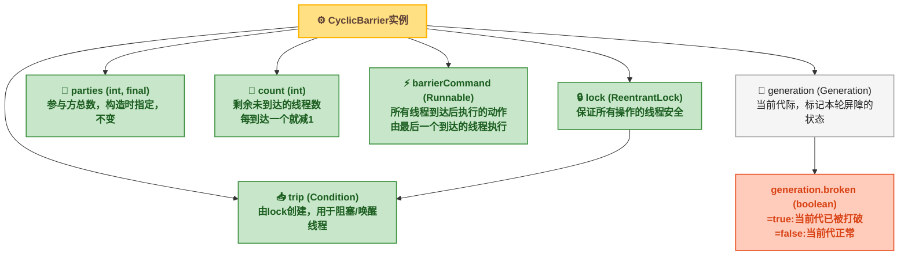
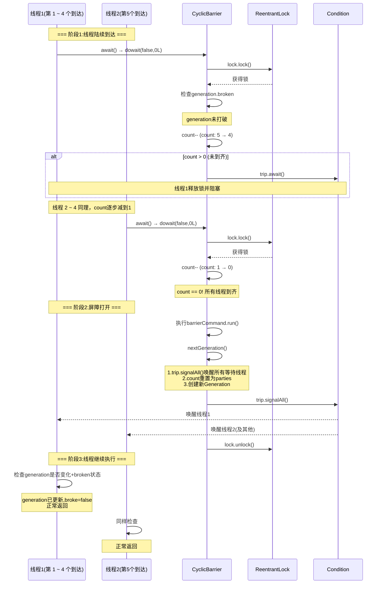
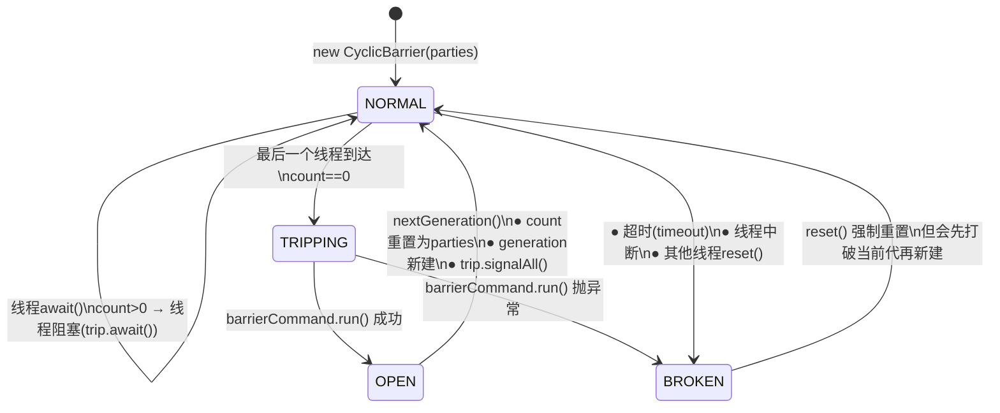
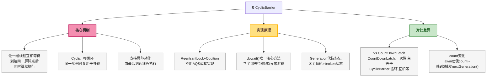

# CyclicBarrier 可循环屏障：源码解析、代际机制与 CountDownLatch 对比全解析

## 🤔 一、道格·李为什么需要一个可循环的屏障

`CountDownLatch` 解决了一个问题：一个线程等待多个线程完成操作。但道格·李在设计 JSR 166 时意识到，还有一种更复杂的同步场景没有覆盖：<strong>多个线程彼此等待</strong>——所有线程都到达同一个"集合点"后，再一起继续往下走。这在分片并行计算中非常常见：N 个线程各算各的，算完之后需要"对表"（交叉校验、汇总），然后继续算下一阶段。

`CountDownLatch` 做不了这件事——它是一次性的，计数器归零后无法重置。而且它的语义是"一个线程等 N 个线程"，不是"N 个线程彼此等"。

`Thread.join()` 也做不了——`join()` 等的是线程终止，不是线程到达某个执行点。如果线程需要继续执行（而不是终止），`join()` 完全不对路。

道格·李因此设计了 `CyclicBarrier`：<strong>一组线程各自执行到某个"屏障点"后调用 `await()`，先到的线程阻塞等待，直到最后一个线程也到达屏障，所有线程同时被唤醒，继续往下执行</strong>。屏障打开后自动重置，可以用于下一个阶段——这就是 `Cyclic`（可循环）的含义。

与 `CountDownLatch` 的核心设计区别：
- `CountDownLatch`：外部协调者等待 N 个工人完成任务（一次性，一个等 N 个）
- `CyclicBarrier`：N 个工人彼此等到齐后一起行动（可循环，N 个彼此等）

## 🔄 二、数据结构展开：CyclicBarrier 的六大核心字段

### 📌 2.1 字段总览

```java
// java.util.concurrent.CyclicBarrier
public class CyclicBarrier {

    private final ReentrantLock lock = new ReentrantLock();   // ① 锁
    private final Condition trip = lock.newCondition();       // ② 条件队列
    private final int parties;                                // ③ 参与方总数
    private final Runnable barrierCommand;                    // ④ 屏障动作
    private Generation generation = new Generation();         // ⑤ 当前代际
    private int count;                                        // ⑥ 倒计数

    // 内部类——代际
    private static class Generation {
        Generation() {}          // 默认 broken = false
        boolean broken;          // 当前代是否被打破
    }
}
```

用一张结构图展示这些字段之间的关系：



### 📌 2.2 各字段的详细说明

| 字段 | 类型 | 作用 | 可变性 |
|------|------|------|:---:|
| **lock** | `ReentrantLock` | 保护所有字段的线程安全访问。所有 `await()` 操作都在持有锁的情况下进行 | 不可变（final） |
| **trip** | `Condition` | 由 `lock.newCondition()` 创建。到达屏障的线程调用 `trip.await()` 在此阻塞，屏障打开时调用 `trip.signalAll()` 唤醒所有等待线程 | 不可变（final） |
| **parties** | `int` | 参与线程的总数。构造时指定，之后不再改变 | 不可变（final） |
| **count** | `int` | 倒计数。初始值等于 `parties`。每有一个线程到达屏障，`count` 减 1。减到 0 时屏障打开，`count` 重置为 `parties` | 可变 |
| **barrierCommand** | `Runnable` | 屏障打开时执行的动作。由最后一个到达屏障的线程（即把 `count` 减到 0 的那个线程）直接调用 `run()`——<span style="color:red">注意是同步调用，不是新开线程执行</span> | 不可变（final） |
| **generation** | `Generation` | 标识当前轮次（代际）。每次屏障打开或被打碎后，会创建新 `Generation` 实例——这是"循环"（Cyclic）的底层实现 | 可变（替换为新实例） |

### 📐 2.3 Generation：代际标记的设计用意

`Generation` 只包裹了一个 `boolean broken`，它的设计用意是：

```java
private static class Generation {
    boolean broken;  // false=本轮正常，true=本轮已打破
}
```

为什么需要一个专门的类来包裹一个 boolean？因为 CyclicBarrier 会 **复用**——屏障打开后不是销毁，而是重置 count 并开启新一轮。当一个线程在 `await()` 中阻塞很久后被唤醒，它需要判断自己是被"正常唤醒"（所有线程到齐）还是"异常唤醒"（某个线程超时/中断导致屏障被打破）。

<span style="color:red">Generation 的引用变化就是区分"这一轮"和"下一轮"的标记</span>。线程在阻塞前记住当前 `generation`，唤醒后对比——如果 `generation` 引用变了，说明屏障已经进入下一代，本轮已结束。

## 📞 三、流程逐层深入：await() 的完整调用链

### 📌 3.1 对外入口：两个 await() 重载

```java
// 无限等待——直到所有线程到达或被打断
public int await() throws InterruptedException, BrokenBarrierException {
    try {
        return dowait(false, 0L);  // timed=false, 不超时
    } catch (TimeoutException e) {
        throw new Error(e);         // 不可能发生（timed=false 不会超时）
    }
}

// 限时等待——超时会打破屏障
public int await(long timeout, TimeUnit unit)
        throws InterruptedException, BrokenBarrierException, TimeoutException {
    return dowait(true, unit.toNanos(timeout));  // timed=true
}
```

两个方法都委托给 `dowait(boolean timed, long nanos)`——这是 CyclicBarrier 的 **唯一核心逻辑**。

### ⏱️ 3.2 dowait() 时序图



### 🔍 3.3 dowait() 源码逐段分析

```java
// java.util.concurrent.CyclicBarrier.dowait()
private int dowait(boolean timed, long nanos)
        throws InterruptedException, BrokenBarrierException, TimeoutException {

    final ReentrantLock lock = this.lock;
    lock.lock();                                       // ① 获取锁
    try {
        final Generation g = generation;               // ② 记住当前代际

        // ③ 先检查：当前代是否已经被打破？
        if (g.broken)
            throw new BrokenBarrierException();

        // ④ 再检查：当前线程是否被中断？
        if (Thread.interrupted()) {
            breakBarrier();                            // 打破屏障
            throw new InterruptedException();
        }

        // ⑤ 倒计数减1
        int index = --count;

        // ⑥ 判断：是否是最后一个到达的线程？
        if (index == 0) {                              // 所有线程到齐！
            boolean ranAction = false;
            try {
                final Runnable command = barrierCommand;
                if (command != null)
                    command.run();                     // 执行屏障动作
                ranAction = true;
                nextGeneration();                      // 进入下一代
                return 0;
            } finally {
                if (!ranAction)
                    breakBarrier();                    // 屏障动作抛异常→打破屏障
            }
        }

        // ⑦ count > 0，不是最后一个到达，进入自旋等待
        for (;;) {
            try {
                if (!timed)
                    trip.await();                      // 无限等待
                else if (nanos > 0L)
                    nanos = trip.awaitNanos(nanos);    // 限时等待
            } catch (InterruptedException ie) {
                // ⑧ 被中断的处理
                if (g == generation && !g.broken) {
                    breakBarrier();                    // 同一代、未被打破→我来打破
                    throw ie;
                } else {
                    Thread.currentThread().interrupt(); // 已经是新代→重置中断标记
                }
            }

            // ⑨ 唤醒后检查：屏障被打破了？
            if (g.broken)
                throw new BrokenBarrierException();

            // ⑩ 唤醒后检查：已经是新代了？
            if (g != generation)
                return index;                          // 正常返回

            // ⑪ 超时处理
            if (timed && nanos <= 0L) {
                breakBarrier();
                throw new TimeoutException();
            }
        }
    } finally {
        lock.unlock();                                 // ⑫ 释放锁
    }
}
```

逐段解释这个核心方法的关键逻辑：

**① 获取锁**：所有操作在 `ReentrantLock` 保护下进行。`lock.lock()` 保证同一时刻只有一个线程能进入 `dowait()` 的核心区域。

**② 记住当前代际**：获取局部变量 `g`，指向当前的 `generation` 对象。释放锁后被唤醒时，通过对比 `g` 和 `this.generation` 是否还是同一个对象来判断"这一轮是不是已经结束了"。

**③ 检查 broken**：如果 `g.broken == true`，说明本代屏障已因中断/超时被打破，直接抛异常。

**④ 检查中断**：`Thread.interrupted()` 是静态方法，检查并清除当前线程的中断标记。如果被中断，打破屏障并抛异常——<span style="color:red">一个线程中断会拖垮整组线程</span>。

**⑤~⑥ 倒计数判断**：`--count` 返回减之后的值。如果是 0，说明自己是最后一个到达的。此时执行 `barrierCommand.run()`（最后一个线程直接 run，不是新开线程），然后 `nextGeneration()` 重置 count + 创建新 Generation + `trip.signalAll()` 唤醒所有等待线程。

**⑦ 自旋等待**：不是最后一个，进入 `for(;;)` 循环，释放锁并在 Condition 上阻塞。这里用 `for(;;)` 而不是 `while(condition)` 是因为唤醒后有多种情况需要处理。

**⑧ 中断处理**：如果在 `trip.await()` 过程中被中断，需要判断：如果当前代还是同一个且未被打破，说明是自己导致了这代屏障失败，调用 `breakBarrier()`；如果已经是新代（说明在中断信号到达之前屏障已经正常打开），只需恢复中断标记即可。

**⑨~⑩ 唤醒后状态检查**：从 `trip.await()` 返回后，依次检查"屏障是否被打破"和"是否已进入新一代"，决定是抛异常还是正常返回。

**⑪ 超时处理**：限时等待场景下，如果 `nanos <= 0` 说明超时了，打破屏障。

**⑫ 释放锁**：`finally` 中释放锁，确保无论正常返回还是抛异常，锁都能被释放。

### 📊 3.4 nextGeneration() 与 breakBarrier() 的源码对比

```java
// 进入下一代——屏障正常打开时调用
private void nextGeneration() {
    trip.signalAll();          // 唤醒所有在 trip 上等待的线程
    count = parties;           // 重置计数器
    generation = new Generation();  // 创建新代际（broken=false）
}

// 打破屏障——发生异常时调用
private void breakBarrier() {
    generation.broken = true;  // 标记当前代已打破
    count = parties;           // 重置计数器
    trip.signalAll();          // 唤醒所有等待线程（它们醒来后会抛异常）
}
```

两者的核心差异：

| 操作 | `nextGeneration()` | `breakBarrier()` |
|------|:---:|:---:|
| **brok​en 标记** | 创建新 Generation（`brok​en=false`） | 设置当前 Generation.`brok​en=true` |
| **trip.signalAll()** | 有 | 有 |
| **count 重置** | 重置为 `parties` | 重置为 `parties` |
| **被唤醒的线程行为** | 检测到 `g != generation`，正常返回 | 检测到 `g.broken == true`，抛 `Brok​enBarrierException` |
| **触发时机** | 所有线程到齐 | 任一线程中断/超时/barrierCommand 抛异常 |
| **屏障能否继续使用** | 可以，进入新一轮 | 可以，但需要先调用 `reset()` 或所有线程收到异常后自动恢复 |

### 🔢 3.5 屏障状态转换图



这张状态图揭示了 CyclicBarrier 名字中 **Cyclic**（可循环）的含义：<span style="color:red">从 NORMAL → OPEN → NORMAL 形成一个闭环</span>。屏障打开后不是销毁，而是通过 `nextGeneration()` 自动重置，同一个 `CyclicBarrier` 实例可以反复用于多轮协调。

## 4️⃣ 四、关键细节

### ▶️ 4.1 屏障动作（barrierCommand）的执行线程

一个常见误区是认为 `barrierCommand` 会由一个新线程执行。实际上：

```java
// dowait() 中 index==0 分支
final Runnable command = barrierCommand;
if (command != null)
    command.run();   // 直接调用 run()，不是 start() 或 submit()
```

<span style="color:red">`barrierCommand` 由最后一个到达屏障的线程在当前线程中同步执行</span>。如果 `barrierCommand` 执行时间很长，其他 4 个线程会一直阻塞等待——它们要等 `trip.signalAll()` 之后才能被唤醒，而 `signalAll()` 在 `command.run()` 之后才调用。

```java
// 验证代码
CyclicBarrier barrier = new CyclicBarrier(3, () -> {
    System.out.println(Thread.currentThread().getName() + " 执行屏障动作");
    try { Thread.sleep(2000); } catch (InterruptedException e) {}
});

for (int i = 0; i < 3; i++) {
    new Thread(() -> {
        try {
            System.out.println(Thread.currentThread().getName() + " 到达");
            barrier.await();
            System.out.println(Thread.currentThread().getName() + " 继续");
        } catch (Exception e) {}
    }).start();
}

// 输出:
// Thread-0 到达
// Thread-1 到达
// Thread-2 到达
// Thread-2 执行屏障动作        ← 最后一个到达的线程执行
// (停顿2秒)
// Thread-0 继续               ← 其他线程等barrierCommand执行完才被唤醒
// Thread-1 继续
// Thread-2 继续
```

### 🔢 4.2 broken 状态的传染性

一旦屏障被打破，<span style="color:red">所有已经在等待的线程以及后续到达的线程都会收到 `BrokenBarrierException`</span>：

```java
// 验证代码
CyclicBarrier barrier = new CyclicBarrier(3);

// 线程A：到达后等待
new Thread(() -> {
    try {
        barrier.await();  // 被中断，抛出 InterruptedException
    } catch (Exception e) {
        System.out.println("A: " + e.getClass().getSimpleName());
    }
}).start();

Thread.sleep(100);

// 线程B：到达后超时
new Thread(() -> {
    try {
        barrier.await(1, TimeUnit.SECONDS);  // 超时
    } catch (Exception e) {
        System.out.println("B: " + e.getClass().getSimpleName());
    }
}).start();

Thread.sleep(2000);

// 线程C：后续到达
new Thread(() -> {
    try {
        barrier.await();  // 屏障已破，直接抛异常
    } catch (Exception e) {
        System.out.println("C: " + e.getClass().getSimpleName());
    }
}).start();

// 输出:
// B: TimeoutException         ← B超时触发了breakBarrier()
// A: InterruptedException     ← A被中断(因为B的break触发了signalAll)
// C: BrokenBarrierException   ← C发现generation.broken=true
```

这个示例验证了 `dowait()` 源码中的逻辑：任何线程的超时或中断都会触发 `breakBarrier()`，导致 `generation.broken = true` 和 `trip.signalAll()`——所有等待线程被唤醒后检测到 `g.broken == true` 而抛异常，后续到达的线程在步骤③就直接检测到 broken 而抛异常。

### 📌 4.3 Cyclic 的体现：循环使用

`CyclicBarrier` 区别于 `CountDownLatch` 的核心特征是可循环使用。以下代码展示了三轮使用同一个实例：

```java
CyclicBarrier barrier = new CyclicBarrier(3, () ->
    System.out.println("=== 屏障打开 ===")
);

for (int round = 1; round <= 3; round++) {
    System.out.println("--- 第" + round + "轮 ---");
    for (int i = 0; i < 3; i++) {
        new Thread(() -> {
            try {
                Thread.sleep(ThreadLocalRandom.current().nextInt(500));
                System.out.println(Thread.currentThread().getName() + " 到达");
                barrier.await();
                System.out.println(Thread.currentThread().getName() + " 通过");
            } catch (Exception e) {}
        }).start();
    }
    Thread.sleep(3000); // 等本轮全部完成
}

// 输出:
// --- 第1轮 ---
// Thread-0 到达
// Thread-1 到达
// Thread-2 到达
// === 屏障打开 ===
// Thread-2 通过
// Thread-0 通过
// Thread-1 通过
// --- 第2轮 ---
// ...(同样模式)...
```

`nextGeneration()` 中的 `count = parties` 和 `generation = new Generation()` 使屏障恢复到全新的初始状态，这就是"循环"的源码基础。

## 五、与 CountDownLatch 的对比

CyclicBarrier 和 CountDownLatch 是 JUC 中最常被对比的两个同步工具。虽然都能"等所有人到齐再走"，但设计哲学截然不同。

### 📊 5.1 核心差异表

| 对比维度 | CyclicBarrier | CountDownLatch |
|---------|:---:|:---:|
| **等待方向** | 参与者互相等待（谁先到谁等别人） | 一个或多个线程等待其他线程完成任务 |
| **count 变化** | `count--`（倒计数，每到达一个减 1） | `countDown()` 减 1 |
| **触发条件** | count 减到 0 | count 减到 0 |
| **可复用性** | 可以（`nextGeneration()` 自动重置 count 和 generation） | 不可以（一次性的，count 到 0 后永远为 0） |
| **底层实现** | `ReentrantLock` + `Condition` | AQS（AbstractQueuedSynchronizer）共享模式 |
| **屏障动作** | 支持（`barrierCommand`，由最后一个到达线程执行） | 不支持 |
| **异常处理** | 支持 broken 状态，中断/超时会打破屏障 | 不支持打破，`await()` 可响应中断 |
| **典型场景** | 多线程分阶段并行计算，需要互相等待对齐进度 | 主线程等待一组子线程初始化完毕 |

### 🔧 5.2 底层实现差异

```java
// CountDownLatch 内部依赖 AQS 的 Sync
private static final class Sync extends AbstractQueuedSynchronizer {
    Sync(int count) { setState(count); }
    int getCount()  { return getState(); }
    protected int tryAcquireShared(int acquires) {
        return (getState() == 0) ? 1 : -1;  // count==0 才成功
    }
    protected boolean tryReleaseShared(int releases) {
        for (;;) {
            int c = getState();
            if (c == 0) return false;        // 已经是0，不能再减
            int nextc = c - 1;
            if (compareAndSetState(c, nextc))
                return nextc == 0;           // 减到0时唤醒所有等待线程
        }
    }
}

// CyclicBarrier 内部使用 ReentrantLock + Condition
private final ReentrantLock lock = new ReentrantLock();
private final Condition trip = lock.newCondition();
```

CyclicBarrier 不用 AQS，而是直接用 `ReentrantLock` + `Condition`。原因是：

1. **需要 broken 状态管理**：AQS 的状态机只有"获取/释放"两个方向，而 CyclicBarrier 有 NORMAL / OPEN / BROKEN 三种状态，用 Condition 配合 Generation 更灵活。
2. **需要循环重置**：AQS 的 state 减到 0 后无法再恢复到初始值（`CountDownLatch` 是一次性的），而 CyclicBarrier 通过 `nextGeneration()` 直接创建新 Generation + 重置 count。
3. **barrierCommand 的执行需要在锁内**：`command.run()` 必须在持有锁的情况下同步执行，用显式的 `ReentrantLock` 更容易控制。

### 🎯 5.3 使用场景选择

| 场景 | 推荐工具 | 原因 |
|------|---------|------|
| 主线程等 N 个子线程初始化完毕 | CountDownLatch | 一次性等待，不需要循环 |
| N 个线程分阶段计算，每阶段对齐进度 | CyclicBarrier | 需要反复对齐，循环使用 |
| 微服务优雅停机，等所有请求处理完 | CountDownLatch | 一次性倒计数 |
| 并行测试，等所有线程就绪后同时开始 | CyclicBarrier | 互相等待 + 可配合 barrierCommand 发令 |
| 数据分片并行处理，所有分片完成后汇总 | 两者皆可 | 一次性用 CountDownLatch，需反复用 CyclicBarrier |

## 🛠️ 六、日常开发用法

### ⚙️ 6.1 核心 API

| 方法 | 用途 | 频率 |
|------|------|:---:|
| `new CyclicBarrier(int parties)` | 创建屏障，指定参与方数量 | 低（通常作为字段） |
| `new CyclicBarrier(int parties, Runnable barrierAction)` | 创建屏障，附带屏障打开时执行的动作 | 中 |
| `await()` | 到达屏障并等待其他线程 | 高 |
| `await(long timeout, TimeUnit unit)` | 限时等待，超时抛 `TimeoutException` 并打破屏障 | 中 |
| `reset()` | 手动重置屏障（先打破当前代，再创建新代） | 低 |
| `getParties()` | 获取参与方数量 | 低 |
| `getNumberWaiting()` | 获取当前已在屏障处等待的线程数 | 低 |
| `isBroken()` | 判断屏障是否已被打破 | 低 |

### 🛠️ 6.2 标准用法一：分阶段并行计算

```java
public class PhasedCalculation {
    private static final int THREADS = 3;
    private static final ConcurrentMap<String, Integer> sharedData = new ConcurrentHashMap<>();

    public static void main(String[] args) {
        CyclicBarrier barrier = new CyclicBarrier(THREADS, () -> {
            // 每阶段结束后打印当前汇总
            System.out.println("阶段完成，当前数据: " + sharedData);
        });

        for (int i = 0; i < THREADS; i++) {
            final int threadId = i;
            new Thread(() -> {
                try {
                    // 阶段一：各算各的
                    sharedData.put("t" + threadId, threadId * 10);
                    barrier.await();  // 等其他人也算完阶段一

                    // 阶段二：基于共享数据继续算
                    int sum = sharedData.values().stream().mapToInt(v -> v).sum();
                    sharedData.put("t" + threadId + "_sum", sum);
                    barrier.await();  // 等其他人也算完阶段二

                    // 阶段三：验证
                    System.out.println("线程" + threadId + " 全部完成");
                } catch (InterruptedException | BrokenBarrierException e) {
                    Thread.currentThread().interrupt();
                }
            }).start();
        }
    }
}
```

### 🛠️ 6.3 标准用法二：并发测试——所有线程同时起跑

```java
public class ConcurrentTest {
    private static final int THREADS = 10;

    public static void main(String[] args) throws InterruptedException {
        // 屏障动作：发令枪
        CyclicBarrier startBarrier = new CyclicBarrier(THREADS, () ->
            System.out.println("所有线程就绪，同时开始！")
        );

        for (int i = 0; i < THREADS; i++) {
            new Thread(() -> {
                try {
                    System.out.println(Thread.currentThread().getName() + " 已就绪");
                    startBarrier.await();  // 等所有人就绪
                    // 从此处开始，所有线程几乎同时执行
                    doActualWork();
                } catch (Exception e) {
                    Thread.currentThread().interrupt();
                }
            }).start();
        }
    }
}
```

### ❌ 6.4 常见错误

| 错误 | 后果 | 修正 |
|------|------|------|
| `parties` 和线程数不匹配 | 线程数 < parties → 永远等不齐；线程数 > parties → 第一轮 ok，但多余线程在第二轮可能提前到达 | 确保 `parties == 实际参与线程数` |
| 忘记处理 `BrokenBarrierException` | 线程中断或超时后，屏障被打破，其他线程收到此异常但未处理，静默失败 | 捕获 `BrokenBarrierException` 并做降级处理 |
| 在 `barrierCommand` 中执行耗时操作 | 所有等待线程被阻塞，直到 `barrierCommand` 执行完毕 | `barrierCommand` 应尽量轻量，耗时逻辑异步化 |
| `barrierCommand` 中抛异常 | 异常会导致 `breakBarrier()`，所有线程收到 `BrokenBarrierException` | `barrierCommand` 内部 try-catch，或接受打破屏障的行为 |
| 多轮使用时线程数不一致 | 第一轮 5 个线程，第二轮只有 4 个——永远等不齐 | 每轮确保参与线程数 == parties，或在新轮开始前 `reset()` |
| 用 `CyclicBarrier` 替代 `CountDownLatch` 做一次性等待 | 功能能实现但引入了不必要的复杂度（代际机制、broken 处理等） | 一次性等待用 `CountDownLatch`，需要反复对齐用 `CyclicBarrier` |

## 🎯 七、总结



| 维度 | 结论 |
|------|------|
| **CyclicBarrier 做什么** | 让 N 个线程到达同一个屏障点后互相等待，全部到齐后同时继续执行 |
| **数据存储在哪** | 六大字段：`lock`（ReentrantLock）、`trip`（Condition）、`parties`（总参与方数）、`count`（剩余未到达数）、`barrierCommand`（屏障动作）、`generation`（代际标记） |
| **核心流程** | 所有线程调用 `await()` → `dowait()` → `lock.lock()` → `--count` → 如果 `count != 0` 则 `trip.await()` 阻塞 → 如果 `count == 0` 则执行 `barrierCommand` → `nextGeneration()` (`signalAll` + 重置 count + 新 Generation) |
| **broken 触发条件** | 任一等待线程被中断、任一限时等待线程超时、`barrierCommand` 执行抛异常——三个条件任一触发都会调用 `breakBarrier()` 打破屏障 |
| **Cyclic 如何实现** | `nextGeneration()` 中 `count = parties` + `generation = new Generation()`，屏障回到初始状态 |
| **与 CountDownLatch 的关键区别** | CyclicBarrier 可循环、互相等待、支持屏障动作、用 ReentrantLock+Condition 实现；CountDownLatch 一次性、单向等待、基于 AQS 共享模式 |
| **barrierCommand 注意事项** | 由最后一个到达的线程在当前线程同步执行。如果执行耗时长，其他线程会被阻塞。如果抛异常，会打破屏障 |
| **选择建议** | 一次性等待子线程完成 → `CountDownLatch`；多线程分阶段需要反复对齐 → `CyclicBarrier`；单纯线程间传值 → `ThreadLocal`/`TransmittableThreadLocal` |
