# ForkJoinPool 源码深度解析：从分治思想到工作窃取的完整实现

## 🤔 一、道格·李为什么需要一个"能偷工作"的线程池

Java 5 的 `ThreadPoolExecutor` 解决了线程复用的问题，但它有一个结构性的局限：<strong>所有线程共享一个任务队列</strong>。当一个线程提交了子任务后阻塞等待子任务结果，而子任务又在同一个队列里等待被执行时，就会发生线程饥饿——等待的线程占着一个槽位但不干活，队列里的子任务没人执行，形成死锁。

这个问题在递归分治算法（把大问题拆成小问题递归求解）中尤为致命。分治算法天然适合并行——子问题之间互不依赖，可以同时计算。但如果每个线程都把子任务扔到共享队列然后等结果，队列很快就会堆满等待被执行的任务而所有线程都在等。

道格·李在 Java 7 中引入 `ForkJoinPool` 时，核心创新是<strong>工作窃取</strong>（Work-Stealing）：
- 每个工作线程有自己的<strong>双端队列</strong>（Deque），线程从自己的队列头部取任务
- 当一个线程 fork 子任务时，子任务被 push 到该线程自己的队列
- 当线程自己的队列空了，它会从其他线程的队列<strong>尾部窃取</strong>任务来执行

这个设计解决了两个问题：① 递归 fork 的子任务不会堵塞共享队列；② 快线程不会空等——它会偷慢线程的活来干。`ForkJoinPool` 也是 Java 8 并行流（`parallelStream()`）的底层引擎。

## 二、设计思想：分治算法 + 工作窃取

### 📌 2.1 分治算法（Divide-and-Conquer）

ForkJoinPool 的设计基础是分治算法（Divide-and-Conquer），其核心过程为三个方面：

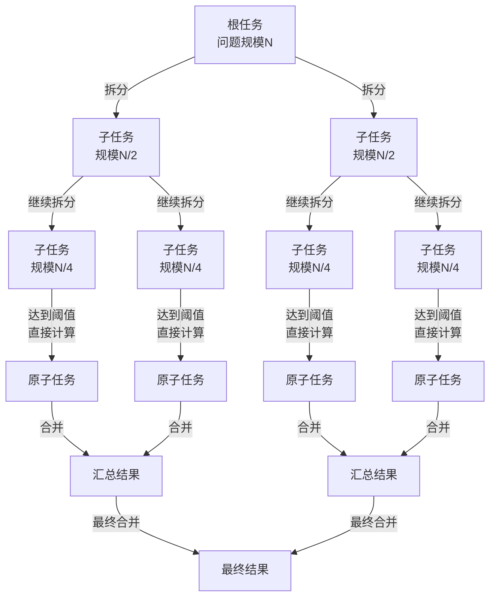

| 阶段 | 操作 | 说明 |
|------|------|------|
| **Divide（拆分）** | `fork()` | 将大任务递归拆分为小任务，直到达到阈值 |
| **Conquer（求解）** | `compute()` | 对原子任务执行实际计算 |
| **Combine（合并）** | `join()` | 递归汇总所有子任务的结果 |

### 📌 2.2 工作窃取算法（Work-Stealing）

普通的 ThreadPoolExecutor 使用单一共享阻塞队列（BlockingQueue），所有线程竞争同一个队列的头元素，存在单点竞争瓶颈。ForkJoinPool 则采用完全不同的设计：**每个工作线程维护自己的双端队列（WorkQueue）**。

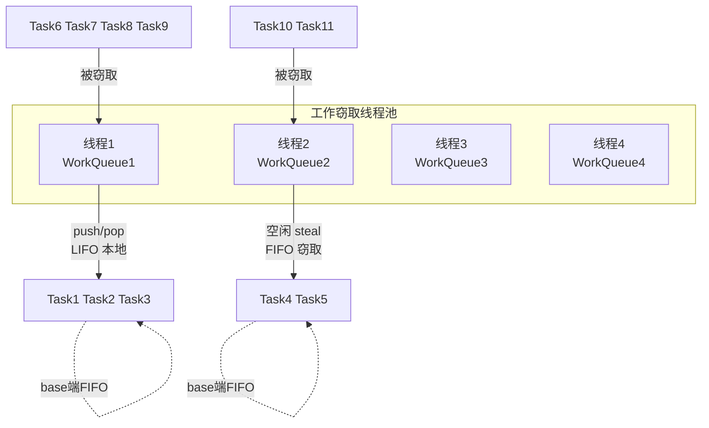

工作窃取的关键规则：

| 操作 | 执行者 | 队列端 | 顺序 | 说明 |
|------|--------|:---:|:---:|------|
| **push** | 队列所属线程 | top 端 | LIFO（后进先出） | 子任务 `fork()` 时推入自身队列顶部 |
| **pop** | 队列所属线程 | top 端 | LIFO | 本地取任务，优先处理最新产生的子任务（数据局部性） |
| **poll** | 其他空闲线程 | base 端 | FIFO（先进先出） | 窃取最早入队的任务，任务粒度通常较大 |

<span style="color:red">LIFO 入队 + LIFO 出队（本地）保证热点数据局部性；FIFO 窃取（远程）保证窃取到的任务粒度大，减少窃取频次</span>。这是 ForkJoinPool 高性能的核心原因之一。

## 🏗️ 三、类继承体系与核心数据结构

### 📌 3.1 三大模块

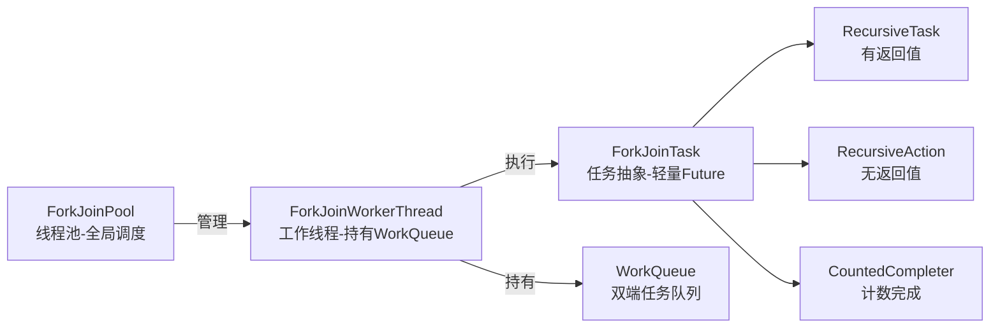

### 📌 3.2 ForkJoinTask 的 status 字段

ForkJoinTask 最核心的设计是 `volatile int status`，它用一个 int 承载了任务状态和等待线程信号两种信息：

```java
volatile int status;

// 完成状态（高 4 位，均为负值）
static final int NORMAL      = 0xf0000000;  // 正常完成
static final int CANCELLED   = 0xc0000000;  // 取消
static final int EXCEPTIONAL = 0x80000000;  // 异常

// 信号标记（低位，正值）
static final int SIGNAL      = 0x00010000;  // 有线程在等待
static final int SMASK       = 0x0000ffff;  // 低位掩码（取标记用）
```

逐字段解读：

- **高 4 位为完成状态**：`status < 0` 表示任务已完成，三种完成状态都是负值（NORMAL=0xf..., CANCELLED=0xc..., EXCEPTIONAL=0x8...）。判断任务是否完成的逻辑非常简洁：`status < 0`。
- **SIGNAL（0x00010000）**：等待标记，表示有线程正在 `join()` 该任务。被等待线程在完成时会通过此标记唤醒等待者。
- **SMASK（0x0000ffff）**：低 16 位掩码，用于提取栈顶线程的索引信息。

### ⚙️ 3.3 ctl——ForkJoinPool 的核心控制字

`ctl` 是 ForkJoinPool 中最核心的一个字段，一个 64 位的 `long` 被切分为四个 16 位子域，用来无锁地管理整个线程池的全局状态：

```java
volatile long ctl;

// 子域位偏移
// |----------|----------|----------|----------|
//  63      48 47      32 31      16 15       0
//      AC         TC         SS        ID

private static final long SP_MASK    = 0xffffffffL;      // 低 32 位掩码
private static final long UC_MASK    = ~SP_MASK;          // 高 32 位掩码

private static final long AC_UNIT    = 0x0001L << 48;     // AC 增量
private static final long TC_UNIT    = 0x0001L << 32;     // TC 增量
private static final long ADD_WORKER = 0x0001L << (32+15); // 需添加工作线标志
```

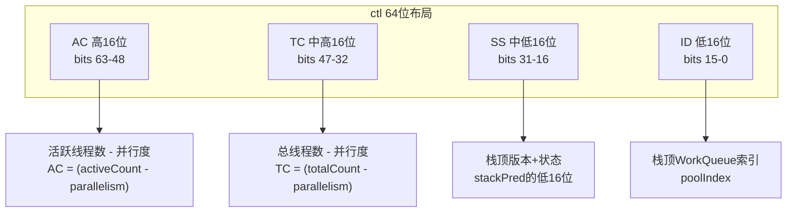

| 子域 | 位范围 | 含义 | 符号 |
|------|--------|------|:---:|
| **AC** | 63 ~ 48 | 活跃工作线程数 - 目标并行度。`AC < 0` 表示活跃线程不足 | `ctl < 0L` |
| **TC** | 47 ~ 32 | 总工作线程数 - 目标并行度。决定是否可以创建新线程 | — |
| **SS** | 31 ~ 16 | 栈顶线程的版本计数和状态（INACTIVE 标记等） | — |
| **ID** | 15 ~ 0 | 栈顶 `WorkQueue` 在 `workQueues` 数组中的索引 | — |

<span style="color:red">用 `ctl < 0L` 即可判断是否需要激活新线程</span>。因为 AC 在高位，当活跃线程数小于并行度时 AC 为负数，整个 64 位值也就为负。这个设计把复杂的比较判断精简为一条 CPU 指令。

### 📌 3.4 WorkQueue——双端任务队列

WorkQueue 是 ForkJoinPool 最核心的数据结构，每个工作线程持有自己的 WorkQueue 实例：

```java
static final class WorkQueue {
    volatile int scanState;     // 扫描状态：<0 失活(INACTIVE)，奇数=SCANNING
    int stackPred;              // 前一个栈顶的 ctl 低 32 位值
    int nsteals;                // 窃取任务计数
    int hint;                   // 窃取者随机索引提示
    int config;                 // 池索引(低16位) + 模式(高16位)
    volatile int qlock;         // 1:锁定中，<0:终止，0:正常
    volatile int base;          // poll端索引（队列头，FIFO出队）
    int top;                    // push端索引（栈顶，LIFO入队）
    ForkJoinTask<?>[] array;    // 任务数组，容量为 2 的幂
    final ForkJoinWorkerThread owner; // 所属线程，SHARED_QUEUE 模式下为 null
    volatile Thread parker;     // 阻塞期间设为 owner
    volatile ForkJoinTask<?> currentJoin;   // 正在被 join 的任务
    volatile ForkJoinTask<?> currentSteal;  // 当前正在执行的窃取任务
}
```

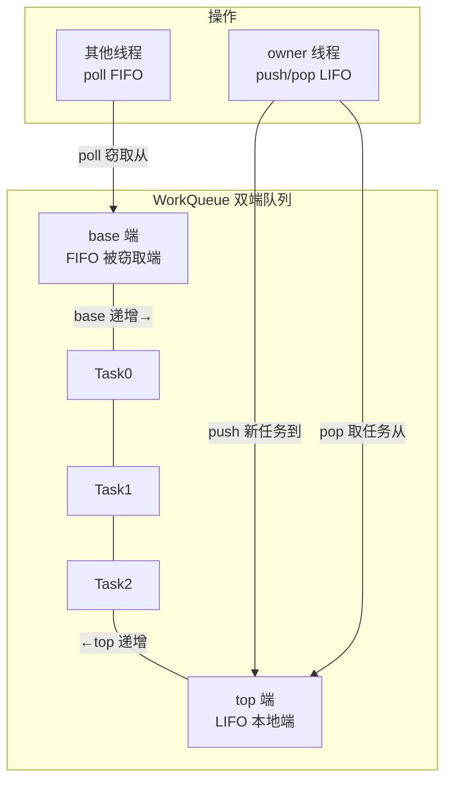

| 字段 | 作用 | 说明 |
|------|------|------|
| `scanState` | 线程工作状态 | `<0`=失活（INACTIVE），奇数=正在扫描（SCANNING），偶数=忙碌 |
| `base` | 队列头部 | `poll()` 从此处取任务（FIFO），`volatile` 使窃取线程可见 |
| `top` | 队列尾部 | `push()`/`pop()` 在此操作（LIFO），仅 owner 线程访问，非 volatile |
| `config` | 索引+模式 | 低 16 位=poolIndex，高 16 位=模式（SHARED_QUEUE/FIFO_QUEUE/LIFO_QUEUE） |
| `qlock` | 锁定标志 | 基于 CAS 的轻量锁，替代 `synchronized` |
| `currentSteal` | 当前窃取任务 | 记录当前正在执行的、从其他队列窃取来的任务，供 `helpStealer` 定位 |
| `currentJoin` | 当前 join 任务 | 记录当前线程正在等待（join）的任务，供 `helpStealer` 找到"窃取链" |

任务数组的容量始终是 2 的幂，初始大小为 `1 << 13`（8192），最大为 `1 << 26`（约 67M）。扩容按 2 倍增长。

**共享队列与私有队列的区分**：

| 队列类型 | 索引规律 | `config` 模式 | `owner` | 用途 |
|---------|:---:|------|:---:|------|
| 外部提交队列 | 偶数槽位 | `SHARED_QUEUE` | null | 接收外部 `execute()`/`submit()` 提交的任务 |
| 工作线程队列 | 奇数槽位 | `LIFO_QUEUE`/`FIFO_QUEUE` | 所属的 ForkJoinWorkerThread | 存储该线程 `fork()` 产生的子任务 |

## 📖 四、源码分析（一）：外部任务提交流程

### 🔄 4.1 externalPush——提交流程入口

外部通过 `execute()`、`submit()`、`invoke()` 提交任务时，最终都落入 `externalPush(task)`：

```java
final void externalPush(ForkJoinTask<?> task) {
    WorkQueue[] ws; WorkQueue q; int m;
    int r = ThreadLocalRandom.getProbe();       // ① 获取当前线程的探针值
    int rs = runState;
    if ((ws = workQueues) != null && (m = (ws.length - 1)) >= 0 &&
        (q = ws[m & r & SQMASK]) != null && r != 0 && rs > 0 &&
        U.compareAndSwapInt(q, QLOCK, 0, 1)) { // ② CAS 锁定随机偶数槽位
        ForkJoinTask<?>[] a; int am, n, s;
        if ((a = q.array) != null &&
            (am = a.length - 1) > (n = (s = q.top) - q.base)) {
            int j = ((am & s) << ASHIFT) + ABASE;
            U.putOrderedObject(a, j, task);     // ③ 任务放入数组
            U.putOrderedInt(q, QTOP, s + 1);    // ④ 更新 top
            U.putOrderedInt(q, QLOCK, 0);       // ⑤ 解锁
            if (n <= 1)
                signalWork(ws, q);              // ⑥ 通知线程来执行
            return;
        }
        U.compareAndSwapInt(q, QLOCK, 1, 0);    // ⑦ 失败则回退
    }
    externalSubmit(task);                       // ⑧ 完整路径（首次或特殊场景）
}
```

逐行解读：

- **① 探针值 r**：`ThreadLocalRandom.getProbe()` 返回当前线程的一个随机值，用于分散提交到不同队列，避免全部命中同一个槽位。
- **② CAS 锁定偶数槽位**：`m & r & SQMASK` 计算目标偶数索引。CAS 对 `qlock` 加锁，失败说明槽位被争用，回退到 `externalSubmit`。
- **③ `putOrderedObject`**：将任务放入数组的 `(am & top)` 位置。`putOrderedObject` 是一个 **有序写**（lazySet 语义），不保证立即可见但保证最终可见且不重排序——介于普通写和 volatile 写之间的开销。
- **④ `putOrderedInt` 更新 top**：top 使用有序写而非 volatile，因为只有 owner 线程读取 top。
- **⑤ 解锁**：`putOrderedInt(q, QLOCK, 0)` 释放锁。
- **⑥ `signalWork`**：当队列原本为空（`n <= 1`），通知线程池激活一个新线程来消费该任务。
- **⑦ 失败回退**：CAS 锁定失败或队列已满时回退。
- **⑧ `externalSubmit`**：完整的首次提交路径，处理初始化、槽位创建等逻辑。

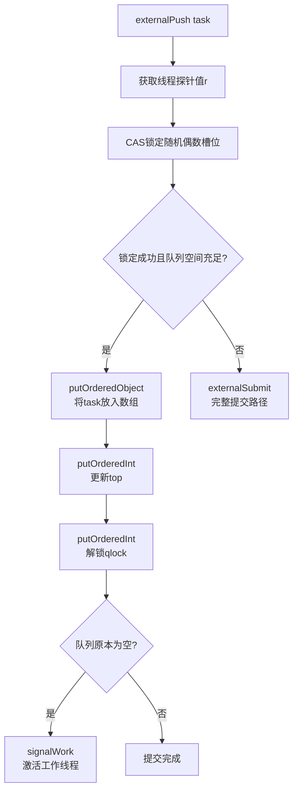

### 📌 4.2 signalWork——激活或创建工作线程

```java
final void signalWork(WorkQueue[] ws, WorkQueue q) {
    long c; int sp, i; WorkQueue v; Thread p;
    while ((c = ctl) < 0L) {                        // ① AC < 0，活跃线程不足
        if ((sp = (int)c) == 0) {                   // ② 无空闲线程
            if ((c & ADD_WORKER) != 0L)             // ③ 允许添加线程
                tryAddWorker(c);                    // ④ 创建新线程
            break;
        }
        if (ws == null)
            break;
        if (ws.length <= (i = sp & SMASK))          // ⑤ 栈顶索引越界
            break;
        if ((v = ws[i]) == null)
            break;
        int vs = (sp + SS_SEQ) & ~INACTIVE;         // ⑥ 计算新scanState（加版本号）
        int d = sp - v.scanState;                   // ⑦ 版本号差值
        long nc = (UC_MASK & (c + AC_UNIT)) | (SP_MASK & v.stackPred);
        if (d == 0 && U.compareAndSwapLong(this, CTL, c, nc)) {  // ⑧ CAS 更新 ctl
            v.scanState = vs;
            if ((p = v.parker) != null)
                U.unpark(p);                        // ⑨ 唤醒阻塞线程
            break;
        }
    }
}
```

逐行解读：

- **① `ctl < 0L`**：判断活跃线程数是否小于并行度。循环体中的每次 CAS 失败都会重新读取 ctl 再判断。
- **② `sp == 0`**：低 16 位全 0 表示 Treiber 栈为空，没有空闲线程可以唤醒。
- **③ `ADD_WORKER` 标志**：`ctl` 的 bit 47 标识是否允许创建新线程。当总线程数未超限时此标志为 1。
- **④ `tryAddWorker(c)`**：CAS 更新 ctl（同时增加 AC 和 TC），然后调用 `createWorker()`。
- **⑥ `sp + SS_SEQ`**：递增版本号，防止 ABA 问题——同一个线程被唤醒、执行完毕、再次失活之间的状态混淆。
- **⑧ CAS 更新 ctl**：用 `c + AC_UNIT` 增加活跃线程计数，用 `v.stackPred` 更新栈顶为下一个空闲线程。
- **⑨ `U.unpark(p)`**：唤醒阻塞线程，让其从 `awaitWork()` 返回。

### 📌 4.3 createWorker——注册新的工作线程

```java
private boolean createWorker() {
    ForkJoinWorkerThreadFactory fac = factory;
    Throwable ex = null;
    ForkJoinWorkerThread wt = null;
    try {
        if (fac != null && (wt = fac.newThread(this)) != null) {
            wt.start();                          // 启动线程 → 调用 ForkJoinWorkerThread.run()
            return true;
        }
    } catch (Throwable rex) {
        ex = rex;
    }
    deregisterWorker(wt, ex);                    // 创建失败，清理
    return false;
}
```

`ForkJoinWorkerThread` 的构造函数中调用了 `pool.registerWorker(this)`，这个方法负责：

1. 为线程分配一个 `WorkQueue`（奇数索引）
2. 将 WorkQueue 注册到 `workQueues` 数组
3. 如果数组满则扩容（2 倍）

```java
final WorkQueue registerWorker(ForkJoinWorkerThread wt) {
    // ...
    WorkQueue w = new WorkQueue(this, wt);
    int i = 0;
    int mode = config & MODE_MASK;
    int rs = lockRunState();
    try {
        WorkQueue[] ws; int n;
        if ((ws = workQueues) != null && (n = ws.length) > 0) {
            int s = indexSeed += SEED_INCREMENT;
            int m = n - 1;
            i = ((s << 1) | 1) & m;             // 计算奇数索引
            if (ws[i] != null) {                 // 槽位冲突
                int probes = 0;
                int step = (n <= 4) ? 2 :
                    ((n >>> 1) & EVENMASK) + 2;  // 线性探测步长
                while (ws[i = (i + step) & m] != null) {
                    if (++probes >= n) {
                        workQueues = ws = Arrays.copyOf(ws, n <<= 1);
                        m = n - 1;
                        probes = 0;
                    }
                }
            }
            // ...
            ws[i] = w;
        }
    } finally { unlockRunState(rs, rs); }
    wt.setName(workerNamePrefix.concat(Integer.toString(i >>> 1)));
    return w;
}
```

关键点：索引计算 `((s << 1) | 1) & m` 保证 Worker 的队列始终占用 **奇数槽位**。`<< 1` 左移去除符号位，`| 1` 保证结果为奇数。槽位冲突时使用线性探测，步长为偶数（`(n >>> 1) & EVENMASK) + 2`），保证探测只在奇数槽位间跳跃。

## 📖 五、源码分析（二）：工作窃取核心——scan 方法

### 📌 5.1 ForkJoinWorkerThread.run() 的顶层循环

```java
public void run() {
    if (workQueue.array == null) {       // 首次运行才初始化
        Throwable exception = null;
        try {
            onStart();
            pool.runWorker(workQueue);   // 核心循环
        } catch (Throwable ex) {
            exception = ex;
        } finally {
            try { onTermination(exception); }
            catch (Throwable ex) { ... }
            finally {
                pool.deregisterWorker(this, exception);
            }
        }
    }
}
```

`runWorker` 是工作线程的核心循环：

```java
final void runWorker(WorkQueue w) {
    w.growArray();                       // 分配任务数组
    int seed = w.hint;
    int r = (seed == 0) ? 1 : seed;
    for (ForkJoinTask<?> t;;) {
        if ((t = scan(w, r)) != null)    // ① 扫描窃取任务
            w.runTask(t);                // ② 执行窃取到的任务
        else if (!awaitWork(w, r))       // ③ 无任务，进入等待
            break;                       // ④ 超时/终止，退出
        r ^= r << 13; r ^= r >>> 17;
        r ^= r << 5;                     // ⑤ 更新随机种子
    }
}
```

工作线程在 `scan → runTask → scan → ... → awaitWork` 之间循环：

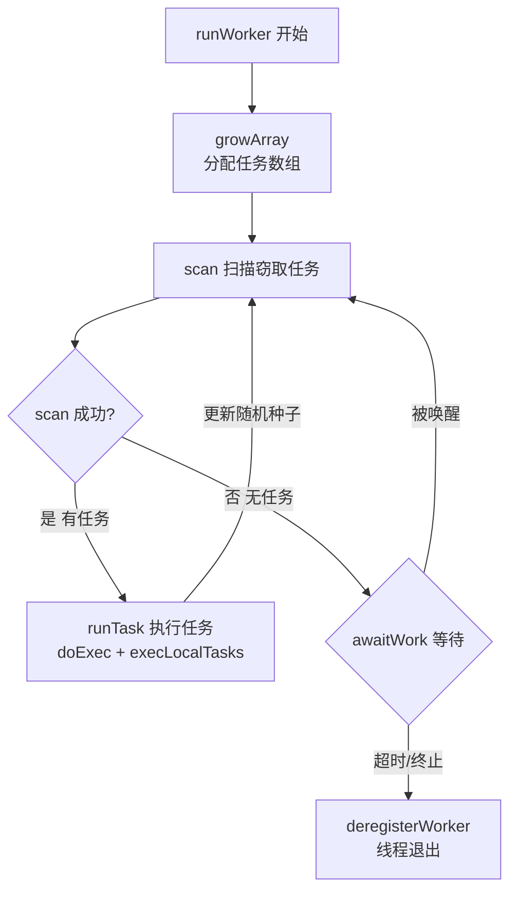

### 📌 5.2 scan()——随机窃取与失活逻辑

`scan(WorkQueue w, int r)` 是整个工作窃取算法的核心实现。其流程非常精妙：

```java
private ForkJoinTask<?> scan(WorkQueue w, int r) {
    WorkQueue[] ws; int m;
    if ((ws = workQueues) != null && (m = ws.length - 1) > 0 && w != null) {
        int ss = w.scanState;
        for (int origin = r & m, k = origin, oldSum = 0, checkSum = 0;;) {
            WorkQueue q; ForkJoinTask<?>[] a; ForkJoinTask<?> t;
            int b, n; long c;
            if ((q = ws[k]) != null) {                       // ① 当前槽位有队列
                if ((n = (b = q.base) - q.top) < 0 &&        // ② 队列非空
                    (a = q.array) != null) {
                    long i = (((a.length - 1) & b) << ASHIFT) + ABASE;
                    if ((t = ((ForkJoinTask<?>)
                              U.getObjectVolatile(a, i))) != null && // ③ volatile 读 base 位置
                        q.base == b) {
                        if (ss >= 0) {
                            if (U.compareAndSwapObject(a, i, t, null)) {  // ④ CAS 取走任务
                                q.base = b + 1;              // ⑤ 更新 base
                                if (n < -1)
                                    signalWork(ws, q);       // ⑥ 还剩任务，通知其他线程
                                return t;
                            }
                        }
                        else if (oldSum == 0 &&
                                 w.scanState < 0)
                            tryRelease(c = ctl, ws[m & (int)c], AC_UNIT); // ⑦ 唤醒失活线程
                    }
                    if (ss < 0)
                        ss = w.scanState;
                }
            }
            if (--checkSum == 0) {
                if (ss < 0) {                                 // ⑧ 当前线程已失活
                    if (oldSum == 0 && (oldSum = checkSum = 1) == 1) {
                        // ... 尝试再次扫描 (双重检查)
                        continue;
                    }
                }
                // ... oldSum/checkSum 递增逻辑，防止无限循环
            }
            if ((k = (k + 1) & m) == origin) {               // ⑨ 扫描完一整圈
                if (ss >= 0)
                    return null;
                break;
            }
        }
        // ⑩ 失活——CAS 将 scanState 设为 INACTIVE，更新 ctl
        int ns = ss | INACTIVE;
        long nc = ((SP_MASK & ns) | (UC_MASK & ((c = ctl) - AC_UNIT)));
        w.stackPred = (int) c;
        U.putInt(w, QSCANSTATE, ns);
        if (U.compareAndSwapLong(this, CTL, c, nc)) {
            ss = ns;
            // ... 更新 w.hint
        }
        // ⑪ 灭活后再次扫描一圈
        // ... 如果仍然无任务，返回 null（最终进入 awaitWork）
    }
    return null;
}
```

这段代码的流程可总结为以下步骤：

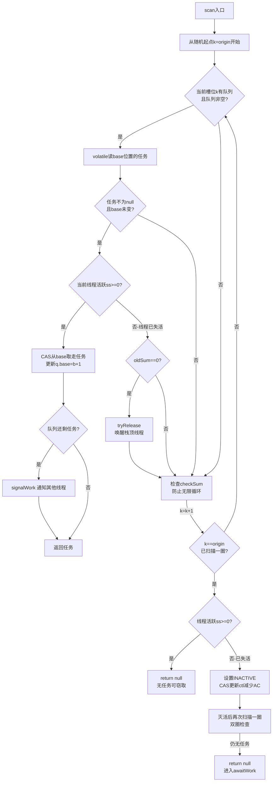

<span style="color:red">双圈检查的设计意图</span>：线程灭活（设为 INACTIVE）后会再次扫描一整圈。这是因为在设置 INACTIVE 的 CAS 前后，可能有新的任务被提交——双圈扫描作为第二道防线，避免线程过早进入阻塞。

### 📌 5.3 tryRelease——唤醒空闲线程

```java
private boolean tryRelease(long c, WorkQueue v, long inc) {
    int sp = (int) c, vs = (sp + SS_SEQ) & ~INACTIVE;
    if (v != null && v.scanState == sp) {
        long nc = (UC_MASK & (c + inc)) | (SP_MASK & v.stackPred);
        if (U.compareAndSwapLong(this, CTL, c, nc)) {
            v.scanState = vs;
            if ((p = v.parker) != null)
                U.unpark(p);
            return true;
        }
    }
    return false;
}
```

`tryRelease` 被两种场景调用：
1. **scan 中发现任务但活跃线程不足**（`inc = AC_UNIT`）：增加 AC 计数后唤醒栈顶空闲线程
2. **deregisterWorker 中线程退出**（`inc = TC_UNIT + AC_UNIT`）：减少 TC 和 AC，唤醒替换线程

## 📖 六、源码分析（三）：fork 与 join——子任务的生与合

### 📌 6.1 fork()——子任务入队

```java
public final ForkJoinTask<V> fork() {
    Thread t;
    if ((t = Thread.currentThread()) instanceof ForkJoinWorkerThread)
        ((ForkJoinWorkerThread)t).workQueue.push(this);  // ① Worker 线程：push 到自身队列
    else
        ForkJoinPool.common.externalPush(this);           // ② 外部线程：走 externalPush
    return this;
}
```

工作线程执行子任务 `fork()` 时，任务被 `push` 到自身 WorkQueue 的 top 端（LIFO）：

```java
final void push(ForkJoinTask<?> task) {
    ForkJoinTask<?>[] a; ForkJoinPool p;
    int b = base, s = top, n;
    if ((a = array) != null) {
        int m = a.length - 1;
        U.putOrderedObject(a, ((m & s) << ASHIFT) + ABASE, task);  // ① 放入 (m & top) 位置
        U.putOrderedInt(this, QTOP, s + 1);                        // ② top + 1
        if ((n = s - b) <= 1) {
            if ((p = pool) != null)
                p.signalWork(p.workQueues, this);                  // ③ 队列原为空，通知
        }
        else if (n >= m)
            growArray();                                           // ④ 满则扩容
    }
}
```

### 📌 6.2 join()——等待子任务结果

`join()` 的源码极其简洁，核心逻辑在 `doJoin()` 中：

```java
public final V join() {
    int s;
    if ((s = doJoin() & DONE_MASK) != NORMAL)
        reportException(s);
    return getRawResult();
}

private int doJoin() {
    int s; Thread t; ForkJoinWorkerThread wt; ForkJoinPool.WorkQueue w;
    return (s = status) < 0 ? s :    // ① 检查是否已经完成
        ((t = Thread.currentThread()) instanceof ForkJoinWorkerThread) ?
        (w = (wt = (ForkJoinWorkerThread)t).workQueue).
        tryUnpush(this) && (s = doExec()) < 0 ? s :  // ② 尝试从本地 top 弹出并执行
        wt.pool.awaitJoin(w, this, 0L) :             // ③ 否则进入等待
        externalAwaitDone();                          // ④ 外部线程的等待路径
}
```

<span style="color:red">`doJoin()` 的三步策略是 ForkJoinPool 性能优化最精华的部分</span>：

| 优先级 | 策略 | 条件 | 效果 |
|:---:|------|------|------|
| 1 | `status < 0` 快速返回 | 任务已完成 | 零开销 |
| 2 | `tryUnpush` 弹出并直接执行 | 任务在本地队列 top 端 | 避免阻塞，最佳路径 |
| 3 | `awaitJoin` 进入等待 | 任务不在本地或不在 top | 帮助执行其他任务，必要时阻塞 |

**为什么 `tryUnpush` 是最佳路径？** 子任务刚 `fork()` 后被 `push` 到 top 端，紧接着调用 `join()` 时它大概率还在 top 位置。此时直接弹出执行，避免了上下文切换和任务在队列间的转移。

### 📐 6.3 awaitJoin——加入等待的三种策略

```java
final int awaitJoin(WorkQueue w, ForkJoinTask<?> task, long deadline) {
    int s = 0;
    if (task != w.currentJoin)
        w.currentJoin = task;                        // ① 记录当前 join 的任务
    ForkJoinTask<?> prevJoin = w.currentJoin;        //    供 helpStealer 定位
    for (int k = 0, side = 0;;) {
        if ((s = task.status) < 0)                   // ② 任务已完成
            break;
        if (side == 0) {
            ForkJoinTask<?> subtask = w.currentSteal; // ③ 当前窃取的任务
            if (subtask != null)
                ForkJoinTask.helpExpungeStaleExceptions();
            if (subtask instanceof CountedCompleter)
                helpComplete(w, (CountedCompleter<?>) subtask, k, side);
            else if (w.base == w.top ||              // ④ 本地队列为空
                     w.tryRemoveAndExec(task))       // ⑤ 尝试找到并执行
                helpStealer(w, task, k);             // ⑥ 核心：帮助窃取者执行
        }
        // ... 更多侧循环逻辑
        if ((s = task.status) < 0)                   // ⑦ 再次检查
            break;
        // ⑧ tryCompensate：补偿机制
        Thread.interrupted();
        if (deadline == 0L)
            ForkJoinPool.tryCompensate(w);
        // ⑨ 内部等待（自旋 + timed park）
        long ms = 1L;
        task.internalWait(ms);
    }
    w.currentJoin = prevJoin;
    return s;
}
```

`awaitJoin` 在等待任务完成时，不是简单地阻塞，而是**主动帮助其他线程完成工作**。这是 ForkJoinPool 区别于 ThreadPoolExecutor 最核心的特征。

### ▶️ 6.4 helpStealer——帮助窃取者执行

这是工作窃取中"任务转让"最精妙的部分。当线程 A 的 `join()` 阻塞在某个任务 `T` 上时，`T` 可能被线程 B 窃取并正在执行。线程 A 的逻辑是：**找到窃取了 T 的线程 B，去帮 B 执行它的任务**，从而间接加速 T 的完成。

```java
final void helpStealer(WorkQueue w, ForkJoinTask<?> task, int k) {
    WorkQueue[] ws = workQueues;
    int n = ws.length;
    if (ws != null && n > 0) {
        for (int m = n - 1, j = -n - m;;) {          // ① 从后往前扫描
            WorkQueue q = ws[j & m & 0xffff];
            if (q != null) {
                ForkJoinTask<?> t = q.currentSteal;   // ② 获取该队列当前执行的窃取任务
                if (t == task) {                       // ③ 找到窃取者
                    if (w.tryRemoveAndExec(task))      // ④ 尝试执行目标任务
                        break;
                    do {
                        if ((t = q.currentSteal) == task) {
                            if (w.base - w.top >= 0)
                                return;
                            do {} while (!w.tryRemoveAndExec(task));
                        }
                        // ⑤ 从窃取者队列 poll 任务执行
                        while (q.base != q.top) {
                            ForkJoinTask<?> o = q.poll();
                            if (o != null) {
                                w.runSubtask(o);       // ⑥ 帮助执行窃取者的任务
                            }
                        }
                    } while (w.base - w.top < 0);      // ⑦ 本地有新任务产生
                    break;
                }
            }
            if (--j == 0)
                break;
        }
    }
}
```

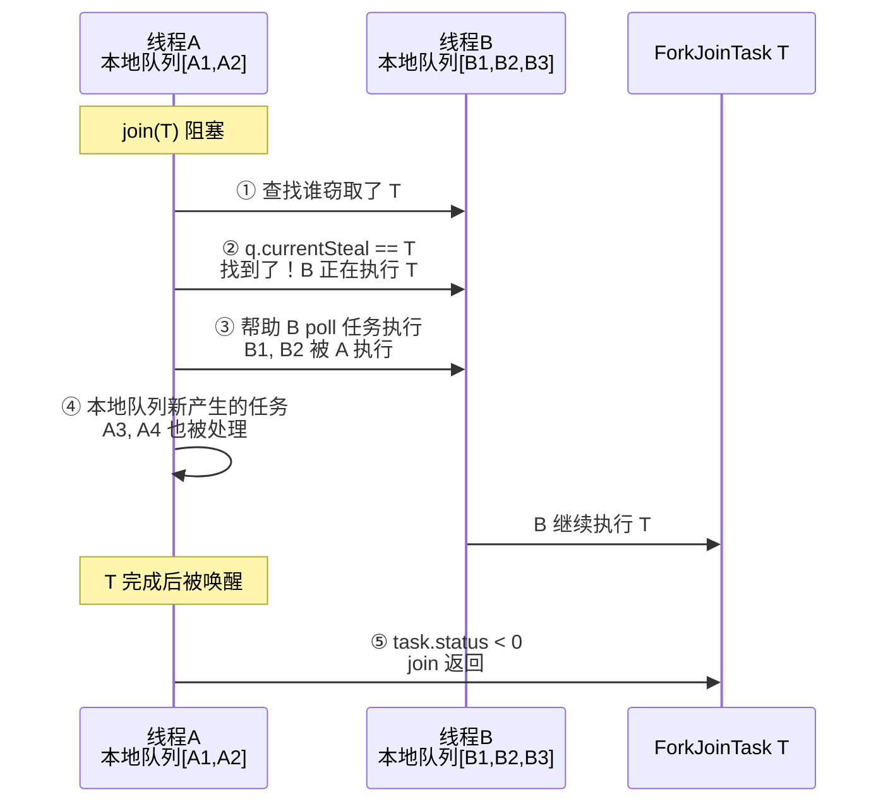

<span style="color:red">这就是 fork/join 框架最核心的"任务在不同线程间转让"机制</span>：线程 A 在等待自己的任务 T 时，不是空转或阻塞，而是去帮助"阻碍 T 完成"的线程 B 执行它的任务。A 帮 B，B 就能更快完成 T，A 也就能更快从 `join()` 返回。

### 📌 6.5 tryCompensate——补偿线程创建

当所有工作线程都忙且等待链太长时，需要创建补偿线程（补偿线程，Compensation Thread）来打破僵局：

```java
final boolean tryCompensate(WorkQueue w) {
    boolean canBlock;
    WorkQueue[] ws; long c; int m, pc, sp;
    if (w == null || w.qlock < 0 || (ws = workQueues) == null ||
        (m = ws.length - 1) < 0 || (pc = config & SMASK) == 0)
        canBlock = false;
    else if ((sp = (int)(c = ctl)) != 0)
        canBlock = tryRelease(c, ws[sp & 0x7fffffff], TC_UNIT); // ① 有空闲线程，唤醒
    else {
        int ac = (int)(c >> AC_SHIFT) + pc;
        int tc = (short)(c >> TC_SHIFT) + pc;
        int nbusy = 0;
        for (int i = 0; i <= m; ++i) {
            WorkQueue v = ws[i];
            if (v != null && v.scanState >= 0) ++nbusy;        // ② 统计忙碌线程
        }
        if (nbusy != (tc + ac) || c != ctl)
            canBlock = false;
        else if (tc >= pc && ac > 1 && w.isEmpty())
            canBlock = false;                                   // ③ 不需要补偿
        else
            canBlock = tryAddWorker(c);                         // ④ 创建补偿线程
    }
    return canBlock;
}
```

补偿决策树：

| 条件 | 决策 | 原因 |
|------|:---:|------|
| 有空闲线程（`sp != 0`） | 唤醒空闲线程 | 直接唤醒即可，无需创建 |
| `tc >= pc && ac > 1 && 队列空` | 不补偿 | 线程数已达并行度，且调用者无本地任务 |
| 总线程 < 并行度 或 活跃线程 ≤ 1 | 创建补偿线程 | 避免死锁：当所有线程都在 join 等待时，需要额外线程来执行就绪任务 |

## 📖 七、源码分析（四）：任务执行——runTask 与本地任务消费

### ▶️ 7.1 runTask——执行窃取到的任务

```java
final void runTask(ForkJoinTask<?> task) {
    if (task != null) {
        scanState &= ~SCANNING;                    // ① 清除 SCANNING，标记忙碌
        (currentSteal = task).doExec();            // ② 执行窃取任务
        U.putOrderedObject(this, QCURRENTSTEAL, null);
        execLocalTasks();                          // ③ 消费本地队列中的所有任务
        ForkJoinTask<?>[] a = array;
        if (a != null && a.length > 0)
            reinitialize();                        // ④ 重置 WorkQueue 内部状态
        if (++nsteals < 0)
            transferStealCount(pool);              // ⑤ 窃取计数溢出处理
        scanState |= SCANNING;                     // ⑥ 恢复 SCANNING 状态
        if (owner != null)
            owner.afterTopLevelExec();             // ⑦ 顶层任务执行后的钩子
    }
}
```

关键设计：<span style="color:red">窃取一个任务后，顺带消费本地队列中的所有任务（`execLocalTasks`）</span>。这是 LIFO 策略的优势所在——从窃取任务中 fork 出的子任务都在本地队列中，批量执行可最大化缓存局部性。

### 📌 7.2 execLocalTasks——批量消费本地任务

```java
final void execLocalTasks() {
    int b = base, m, s;
    ForkJoinTask<?>[] a = array;
    if (b - (s = top - 1) <= 0 && a != null && (m = a.length - 1) >= 0) {
        if ((config & FIFO_QUEUE) == 0) {          // LIFO 模式（默认）
            for (ForkJoinTask<?> t;;) {
                if ((t = (ForkJoinTask<?>)
                     U.getObject(a, ((m & s) << ASHIFT) + ABASE)) == null)
                    break;
                U.putOrderedInt(this, QTOP, s);
                t.doExec();
                if (base - (s = top - 1) > 0)
                    break;                         // 队列为空则退出
            }
        }
        else                                       // FIFO 模式
            pollAndExecAll();                      // 从 base 端取，类似窃取的顺序
    }
}
```

LIFO 模式下，从 top 端逐个 pop 并执行，每个任务的执行都可能产生新子任务 push 到 top 端——形成深度优先的计算模式。FIFO 模式下则从 base 端取，产生广度优先的计算模式。

## 🛠️ 八、日常使用方式

### 📌 8.1 创建 ForkJoinPool

```java
// 方式一：自定义并行度
ForkJoinPool pool = new ForkJoinPool(4);  // 4 个工作线程

// 方式二：完整参数
ForkJoinPool pool = new ForkJoinPool(
    4,                    // parallelism：并行度
    ForkJoinPool.defaultForkJoinWorkerThreadFactory,
    null,                 // handler：异常处理器
    false                 // asyncMode：false=LIFO(默认)，true=FIFO
);

// 方式三：使用公共池（JDK 8+）
ForkJoinPool common = ForkJoinPool.commonPool();
// 默认并行度 = Runtime.getRuntime().availableProcessors() - 1

// 方式四：通过 Executors
ExecutorService pool = Executors.newWorkStealingPool();
// 等同于 new ForkJoinPool(parallelism, factory, handler, true)
```

### 📌 8.2 高频 API

| 方法 | 用途 | 频率 |
|------|------|------|
| `pool.invoke(task)` | 提交 ForkJoinTask 并阻塞等待结果 | 高 |
| `pool.submit(task)` | 提交任务，返回 Future，不等待 | 高 |
| `task.fork()` | 子任务异步提交到本地队列 | 高 |
| `task.join()` | 阻塞等待子任务完成并返回结果 | 高 |
| `task.compute()` | 当前线程直接执行 | 高 |
| `RecursiveTask.invokeAll(t1, t2)` | 并行执行两个子任务（推荐方式） | 中 |
| `pool.execute(task)` | 提交任务，无返回值 | 中 |
| `task.quietlyJoin()` | 静默等待（不抛异常） | 低 |
| `task.isCompletedAbnormally()` | 检查是否异常完成 | 低 |

### 📌 8.3 RecursiveTask 有返回值任务

```java
public class ArraySum {
    static class SumTask extends RecursiveTask<Long> {
        private final int[] arr;
        private final int start, end;
        static final int THRESHOLD = 1000;

        SumTask(int[] arr, int start, int end) {
            this.arr = arr;
            this.start = start;
            this.end = end;
        }

        @Override
        protected Long compute() {
            if (end - start <= THRESHOLD) {
                long sum = 0;
                for (int i = start; i < end; i++) sum += arr[i];
                return sum;
            }
            int mid = (start + end) >>> 1;
            SumTask left = new SumTask(arr, start, mid);
            SumTask right = new SumTask(arr, mid, end);
            invokeAll(left, right);   // 推荐：框架自动优化并行
            return left.join() + right.join();
        }
    }

    public static void main(String[] args) {
        int[] arr = new int[10_000_000];
        Arrays.parallelSetAll(arr, i -> i);  // 并行填充
        ForkJoinPool pool = new ForkJoinPool();
        long result = pool.invoke(new SumTask(arr, 0, arr.length));
        System.out.println("Sum: " + result);
    }
}
```

### 📌 8.4 RecursiveAction 无返回值任务

```java
public class QuickSortParallel {
    static class SortTask extends RecursiveAction {
        private final int[] arr;
        private final int lo, hi;
        static final int THRESHOLD = 1000;

        SortTask(int[] arr, int lo, int hi) {
            this.arr = arr;
            this.lo = lo;
            this.hi = hi;
        }

        @Override
        protected void compute() {
            if (hi - lo <= THRESHOLD) {
                Arrays.sort(arr, lo, hi);
                return;
            }
            int pivot = partition(arr, lo, hi);
            SortTask left = new SortTask(arr, lo, pivot);
            SortTask right = new SortTask(arr, pivot + 1, hi);
            invokeAll(left, right);
        }

        private int partition(int[] arr, int lo, int hi) {
            // 标准快排分区逻辑
            int pivot = arr[lo];
            int i = lo, j = hi;
            while (i < j) {
                while (i < j && arr[--j] >= pivot);
                arr[i] = arr[j];
                while (i < j && arr[++i] <= pivot);
                arr[j] = arr[i];
            }
            arr[i] = pivot;
            return i;
        }
    }
}
```

### 📌 8.5 JDK 中 ForkJoinPool 的实际使用

| JDK 组件 | 使用 ForkJoinPool | 说明 |
|---------|:---:|------|
| `Arrays.parallelSort()` | 使用 `ForkJoinPool.commonPool()` | 并行排序，JDK 8+ |
| `ConcurrentHashMap.forEach()` | 使用 `ForkJoinPool.commonPool()` | 并行遍历，JDK 8+ |
| `CompletableFuture.supplyAsync()` | 默认使用 `ForkJoinPool.commonPool()` | 异步任务的默认线程池 |
| `parallel()` Stream | 使用 `ForkJoinPool.commonPool()` | 并行流的底层执行器 |

## 九、与 ThreadPoolExecutor 的本质区别

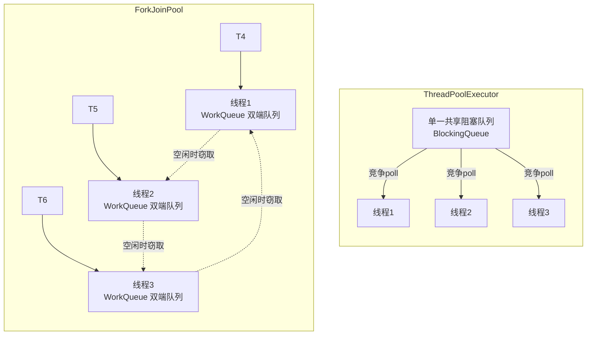

| 维度 | ForkJoinPool | ThreadPoolExecutor |
|------|-------------|-------------------|
| 队列结构 | 每个线程独立 WorkQueue（双端队列） | 单一共享 BlockingQueue |
| 任务调度 | 工作窃取（Work-Stealing） | 生产者-消费者模型 |
| 负载均衡 | 空闲线程主动从其他队列窃取 | 所有线程争抢同一队列 |
| 任务类型 | 专为 ForkJoinTask 设计（支持 fork/join） | 通用 Runnable / Callable |
| 任务产生方式 | 任务内部可 `fork()` 产生子任务 | 所有任务由外部提交 |
| 本地执行 | LIFO 从 top 端取，缓存友好 | 无本地队列概念 |
| 等待策略 | awaitJoin → helpStealer 帮助执行 | park 阻塞等待 |
| 线程数控制 | 并行度（parallelism），可创建补偿线程 | corePoolSize + maxPoolSize |
| 空闲收缩 | 2 秒超时无任务则退出 | keepAliveTime 可配置 |
| 防伪共享 | `@Contended` 注解 WorkQueue | 无 |

<span style="color:red">最重要的区别是：ForkJoinPool 的线程在"等待"时从不空闲</span>——它们会走到 helpStealer 路径，主动帮助其他线程执行任务。这使得 ForkJoinPool 在处理递归分治任务时的 CPU 利用率远高于 ThreadPoolExecutor。

## 🛠️ 十、使用注意事项

### 📌 10.1 避免不必要的 fork

```java
// 错误：过度 fork
left.fork();
right.fork();
long result = left.join() + right.join();  // 两个 join 都阻塞

// 正确：一个当前线程执行，一个 fork
left.fork();
long rightResult = right.compute();        // 当前线程直接计算
long leftResult = left.join();             // 等待异步的那个
return leftResult + rightResult;

// 最佳：使用 invokeAll
invokeAll(left, right);
return left.join() + right.join();
```

### 📌 10.2 正确设置阈值

阈值（THRESHOLD）决定了任务的粒度。过大则并行度不足，过小则 fork/join 开销大于计算本身。

| 建议 | 说明 |
|------|------|
| 单次 `compute()` 应执行 100 ~ 10000 个基本计算步骤 | Doug Lea 的推荐范围 |
| 通过 JMH 实际测试确定最优阈值 | 不同硬件/JDK 版本有差异 |
| 测试前需要 JIT 预热 | 确保编译优化已生效 |

### 📌 10.3 异常处理：子任务异常不会自动传播

ForkJoinTask 的异常处理机制与普通 Future 不同：

```java
SumTask task = new SumTask(arr, 0, arr.length);
pool.execute(task);  // 用 execute 而非 invoke
// task 内部的异常被捕获并保存在 status 中
// 必须显式调用 join()/get() 才会抛出异常
try {
    task.join();
} catch (RuntimeException e) {
    // 处理异常
}
```

可以用 `isCompletedAbnormally()` 检查任务是否异常完成：

```java
if (task.isCompletedAbnormally()) {
    // 通过 getException() 获取原始异常
    Throwable ex = task.getException();
}
```

### 📌 10.4 避免在 ForkJoinTask 中使用阻塞 I/O

ForkJoinPool 是为 CPU 密集型计算设计的。如果在 `compute()` 中执行 I/O 阻塞操作，会占用工作线程且无法被窃取。如果需要混用 CPU 计算和 I/O，应考虑：

- 使用 `ManagedBlocker` 接口通知线程池当前线程即将阻塞
- 或者将 CPU 任务和 I/O 任务分离到不同的线程池

### 📌 10.5 Common Pool 的注意事项

`ForkJoinPool.commonPool()` 是 JVM 级别的共享线程池，`parallelStream()`、`CompletableFuture` 等都默认使用它：

```java
// 错误：在 commonPool 中执行耗时任务会影响全局
IntStream.range(0, 100).parallel().forEach(i -> {
    Thread.sleep(10000);  // 阻塞 commonPool 线程，影响其他所有使用它的功能
});

// 正确：耗时/阻塞任务使用自定义线程池
ForkJoinPool customPool = new ForkJoinPool(4);
customPool.submit(() -> {
    // 耗时操作
}).get();
```

### 🎯 10.6 适用场景总结

| 场景 | 适合 | 说明 |
|------|:---:|------|
| 大量小规模计算任务（递归拆分） | 是 | 核心场景，fork/join 天然高效 |
| 并行排序、并行数组操作 | 是 | JDK 内置 `parallelSort` |
| 大多数任务是独立、无fork/join关系的 | 否 | 用 ThreadPoolExecutor 更简单 |
| 涉及阻塞 I/O 的任务 | 否 | CPU 密集设计，阻塞会耗尽线程 |
| 任务粒度极细（微秒级） | 否 | fork/join 开销可能大于计算本身 |
| 需要任务优先级调度 | 否 | 工作窃取不提供优先级支持 |

## 十一、总结

ForkJoinPool 通过 **分治递归 + 工作窃取 + 双端队列 + helpStealer 任务转让** 四层机制，构建了一个专为递归并行计算优化的线程池。

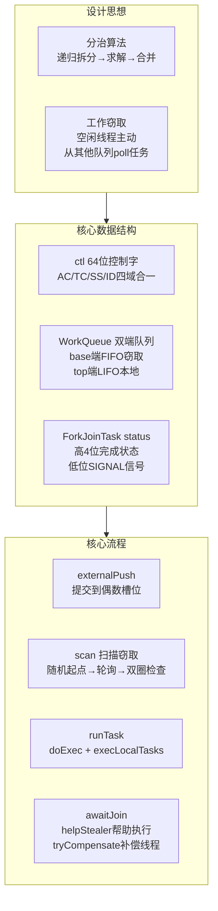

| 维度 | 要点回顾 |
|------|---------|
| 设计思想 | 分治算法（拆分→求解→合并）+ 工作窃取（空闲线程主动 poll 其他队列） |
| 核心数据结构 | ctl（64 位 AC/TC/SS/ID）+ WorkQueue（base/top 双端）+ ForkJoinTask（status 状态机） |
| 外部提交 | `externalPush` → 随机偶数槽位 → CAS 锁定 → `signalWork` 激活线程 |
| 工作窃取 | `scan` 方法：随机起点轮询每个槽位 → CAS poll base 端 → 双圈无任务则灭活进入 `awaitWork` |
| fork | `push` 到 top 端（LIFO），队列由空变非空时调用 `signalWork` |
| join | `tryUnpush`（top 位直接执行）→ `awaitJoin` → `helpStealer`（帮窃取者执行）→ `tryCompensate`（补偿线程） |
| 空闲唤醒 | `tryRelease`：加版本号防 ABA → CAS 更新 ctl → `unpark` |
| 线程退出 | `deregisterWorker`：移除 WorkQueue → 转移 stealCount → 取消剩余任务 → `tryAddWorker` 替换 |
| 与 TPE 区别 | 多独立双端队列 vs 单一共享队列；工作窃取 vs 生产者-消费者；等待时帮助执行 vs 纯阻塞 |
