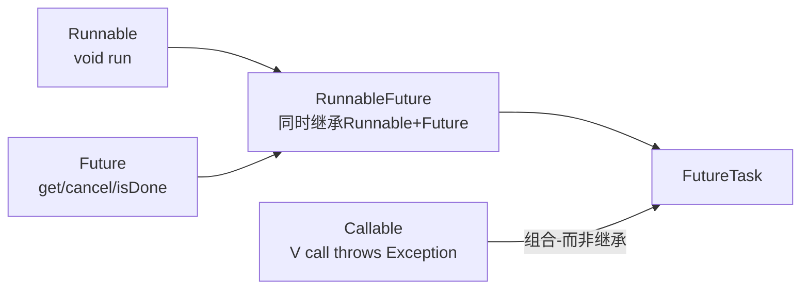
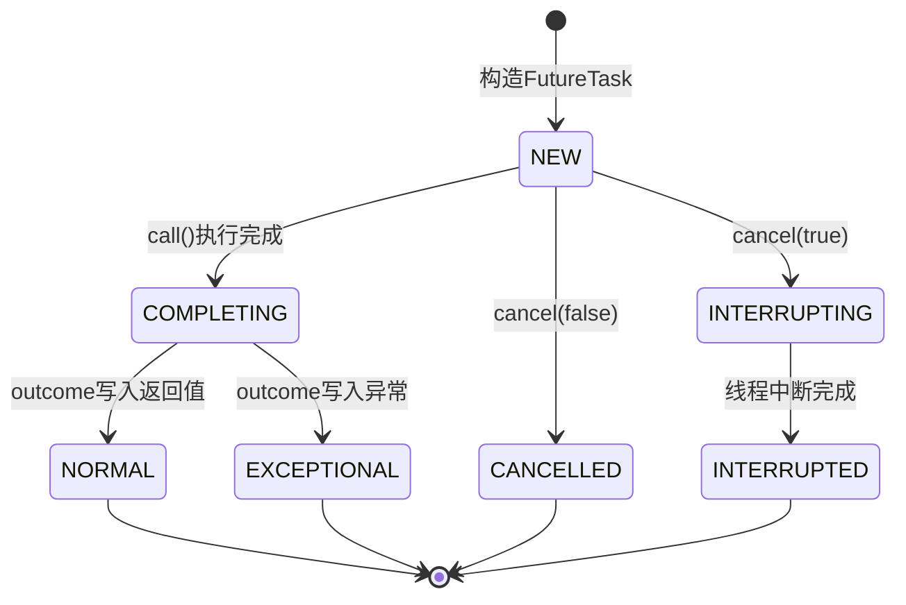
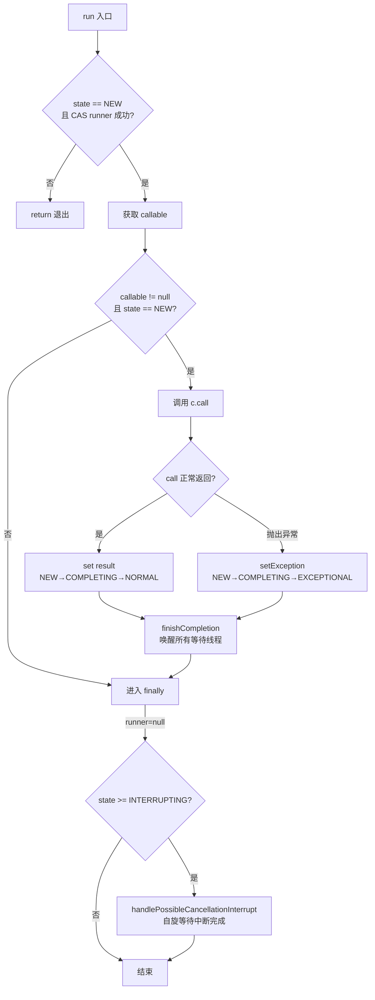
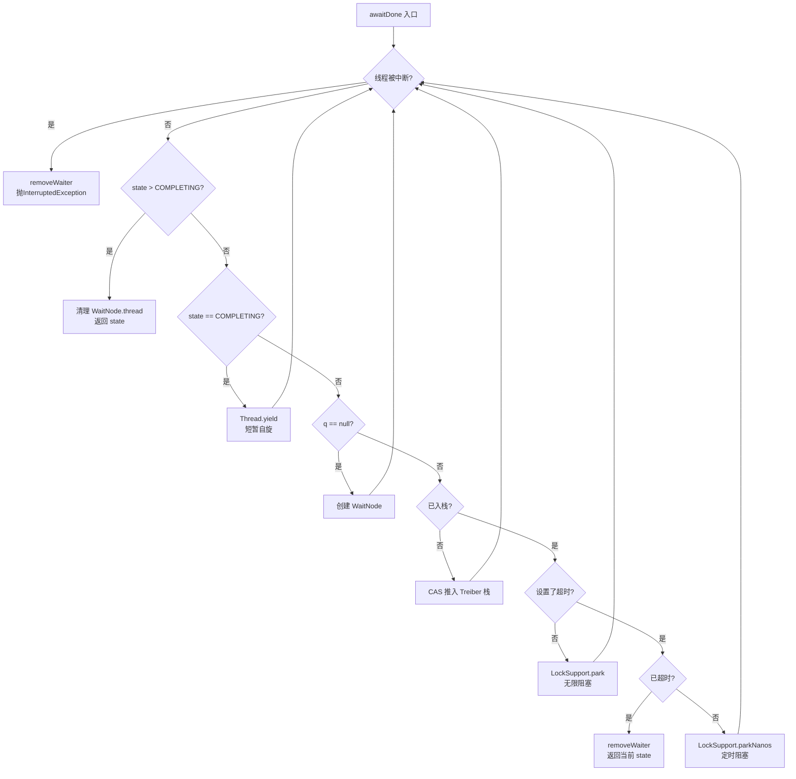
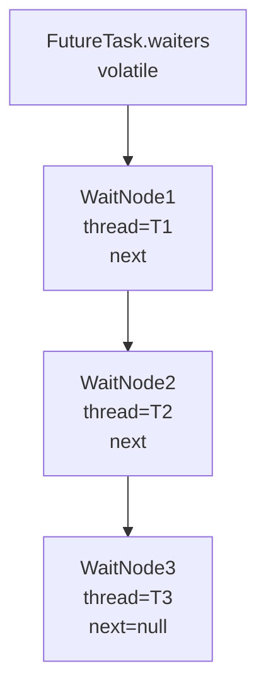
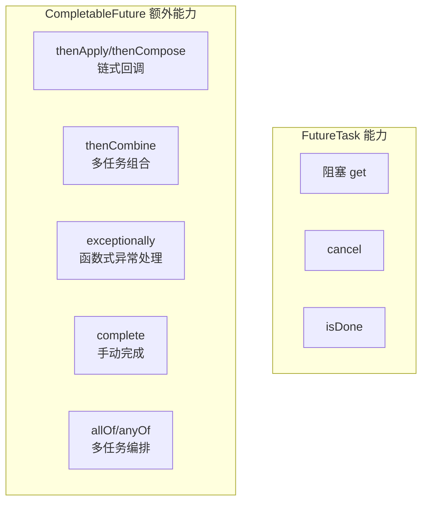
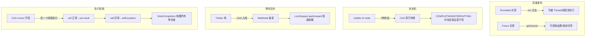

# FutureTask 源码深度解析：从 Runnable 的局限到异步结果获取的完整实现

## 🤔 一、问题切入：一段"拿不到结果"的代码

### ⚠️ 1.1 Runnable 的局限

用多线程执行一个计算密集型任务，主线程需要拿到计算结果做后续处理。最直接的想法是用 `Runnable`：

```java
public class RunnableLimitation {
    public static void main(String[] args) throws Exception {
        // 希望计算 1 到 100 的和，并在主线程拿到结果
        Thread thread = new Thread(() -> {
            int sum = 0;
            for (int i = 1; i <= 100; i++) {
                sum += i;
            }
            // 问题：这个 sum 怎么传回主线程？
        });
        thread.start();
        thread.join();
        // 拿不到 sum，因为 Runnable.run() 的返回值是 void
    }
}
```

问题很清楚：`Runnable` 接口的 `run()` 方法签名为 `void run()`，它不返回计算结果，也不能抛出受检异常（checked exception）。要在主线程获取子线程的计算结果，只能用共享变量、回调等间接手段，代码变得分散且难以阅读。

<details>
<summary>传统绕行方式——共享变量</summary>

```java
final int[] result = new int[1];
Thread t = new Thread(() -> {
    int sum = 0;
    for (int i = 1; i <= 100; i++) sum += i;
    result[0] = sum;  // 写入共享数组
});
t.start();
t.join();
System.out.println(result[0]);  // 读取结果
```
这种方式没有类型安全，也不能处理异常。
</details>

### 📌 1.2 Callable 和 Future 的出现

JDK 1.5 引入了 `Callable<V>` 和 `Future<V>`：

```java
@FunctionalInterface
public interface Callable<V> {
    V call() throws Exception;   // 有返回值，可抛异常
}

public interface Future<V> {
    boolean cancel(boolean mayInterruptIfRunning);
    boolean isCancelled();
    boolean isDone();
    V get() throws InterruptedException, ExecutionException;
    V get(long timeout, TimeUnit unit)
        throws InterruptedException, ExecutionException, TimeoutException;
}
```

- **Callable**：与 Runnable 功能等价，但 `call()` 有返回值且可抛异常，解决了"任务有结果"的问题。
- **Future** 🔮：表示异步计算的结果句柄（handle），提供获取结果、取消任务、判断完成等操作。

但 Callable 和 Future 本身是分离的——Callable 只定义了任务，Future 只提供结果查询接口，它们需要被组合在一起才能使用。谁来做这个组合？<span style="color:red">FutureTask 就是 JDK 给出的答案，它同时实现了 Runnable 和 Future，一个对象身兼两职</span>。

### ❓ 1.3 用 FutureTask 解决同一个问题

```java
public class FutureTaskSolution {
    public static void main(String[] args) throws Exception {
        // 定义可返回结果的任务
        Callable<Integer> task = () -> {
            int sum = 0;
            for (int i = 1; i <= 100; i++) {
                sum += i;
            }
            return sum;   // 有返回值
        };

        FutureTask<Integer> futureTask = new FutureTask<>(task);
        Thread thread = new Thread(futureTask);  // 作为 Runnable 传给 Thread
        thread.start();

        // 作为 Future 获取结果——阻塞等待
        Integer result = futureTask.get();
        System.out.println("结果: " + result);  // 5050
    }
}
```

这段代码展示了 FutureTask 的核心能力：<span style="color:red">它既是一个 Runnable（可被 Thread 执行），又是一个 Future（可获取异步结果）</span>。

## 🔮 二、类继承体系：RunnableFuture 的双重身份

### 🏗️ 2.1 继承结构图



| 接口/类 | 角色 | 核心方法 |
|---------|------|---------|
| `Runnable` | 可执行任务 | `void run()` |
| `Callable<V>` | 有结果的任务 | `V call() throws Exception` |
| `Future<V>` | 结果句柄 | `get()`, `cancel()`, `isDone()` |
| `RunnableFuture<V>` | 二者的桥接接口 | 继承 `Runnable` + `Future`，无新增方法 |
| `FutureTask<V>` | 具体实现 | 组合 `Callable`，实现所有逻辑 |

### 📌 2.2 RunnableFuture 接口

```java
public interface RunnableFuture<V> extends Runnable, Future<V> {
    void run();
}
```

这个接口只有 3 行，没有新增任何方法，只是将 `Runnable` 和 `Future` 合并。它的价值在于类型层面的统一——一个 `RunnableFuture` 实例可以同时作为任务提交给线程池和作为 Future 供调用方查询结果。

### ⚙️ 2.3 FutureTask 的核心字段

```java
public class FutureTask<V> implements RunnableFuture<V> {
    private volatile int state;          // 状态字段，volatile 保证可见性
    private Callable<V> callable;        // 待执行的任务
    private Object outcome;              // 存储返回值或异常对象
    private volatile Thread runner;      // 正在执行 call() 的线程
    private volatile WaitNode waiters;   // Treiber 栈——等待 get() 的线程链表
}
```

| 字段 | 类型 | volatile | 说明 |
|------|------|:---:|------|
| `state` | `int` | 是 | 任务生命周期状态（7 种），发生变更时对所有线程立即可见 |
| `callable` | `Callable<V>` | 否 | 待执行任务，执行完毕后被置 null 帮助 GC |
| `outcome` | `Object` | 否 | 结果（正常返回或 Throwable 异常），通过 state 的 happens-before 保证可见 |
| `runner` | `Thread` | 是 | 记录正在运行 `call()` 的线程，cancel 时需要中断它 |
| `waiters` | `WaitNode` | 是 | Treiber 栈的栈顶指针，保存了所有阻塞在 `get()` 上的线程节点 |

<span style="color:red">`outcome` 不是 volatile，但它通过 state 的 volatile 写建立了 happens-before 关系</span>——先写 outcome，再用 volatile 写改变 state；get 端先 volatile 读 state，再读 outcome。JMM 的 volatile 写-读传递性保证了 outcome 的可见性。这是一个经典的 volatile 借用（piggyback）模式。

## 📐 三、状态机：7 种状态的设计

### 📝 3.1 状态常量定义

```java
private static final int NEW          = 0;  // 初始状态
private static final int COMPLETING   = 1;  // 执行完成，结果/异常尚未写入 outcome
private static final int NORMAL       = 2;  // 正常完成（终态）
private static final int EXCEPTIONAL  = 3;  // 执行异常（终态）
private static final int CANCELLED    = 4;  // 被取消，未中断线程（终态）
private static final int INTERRUPTING = 5;  // 正在中断执行线程（中间态）
private static final int INTERRUPTED  = 6;  // 已中断线程（终态）
```

每个状态的含义逐行解读：

- **NEW（0）**：任务刚创建，尚未被任何线程执行。`run()` 方法的入口条件就是 state 必须为 NEW。
- **COMPLETING（1）**：`call()` 已执行完毕，但返回值或异常还没有写入 `outcome` 字段。这是一个 **中间瞬态**，停留时间极短（仅一次字段赋值）。
- **NORMAL（2）**：正常完成，`outcome` 中存储的是 `call()` 的返回值。**终态**，不可逆转。
- **EXCEPTIONAL（3）**：`call()` 抛出异常，`outcome` 中存储的是异常对象。**终态**。
- **CANCELLED（4）**：任务被取消（`cancel(false)`），不中断执行中的线程。**终态**。
- **INTERRUPTING（5）**：`cancel(true)` 后，正在调用 `runner.interrupt()`。**中间瞬态**。
- **INTERRUPTED（6）**：中断线程操作完成。**终态**。

设计中存在两个中间态（COMPLETING 和 INTERRUPTING），其作用都是保证状态转换的原子性——它们作为 CAS 的"临界区锁"，防止并发修改。

### 🔢 3.2 状态转换图



四种转换路径：

| 路径 | 状态变化 | 触发条件 |
|------|---------|---------|
| 正常执行 | `NEW → COMPLETING → NORMAL` | `call()` 正常返回 |
| 执行异常 | `NEW → COMPLETING → EXCEPTIONAL` | `call()` 抛出异常 |
| 取消不中断 | `NEW → CANCELLED` | `cancel(false)` 或任务尚未开始执行 |
| 取消并中断 | `NEW → INTERRUPTING → INTERRUPTED` | `cancel(true)` 且任务正在执行 |

### 📋 3.3 状态判断的工具方法

```java
private boolean ranOrCancelled(int state) {
    return state >= COMPLETING;  // 大于等于 COMPLETING 表示已非 NEW
}
```

所有结束状态（CANCELLED、INTERRUPTED、INTERRUPTING、COMPLETING、NORMAL、EXCEPTIONAL）的值都 ≥ COMPLETING(1)。这个判断在多个方法中被复用。

## 四、源码分析：从 run 到 get 的完整调用链

### ▶️ 4.1 run()——任务执行与 CAS 抢占

`run()` 是 FutureTask 作为 Runnable 的实现入口。它的核心逻辑是：通过 CAS 确保只有一个线程执行 Callable。

```java
public void run() {
    if (state != NEW ||
        !UNSAFE.compareAndSwapObject(this, runnerOffset,
                                     null, Thread.currentThread()))
        return;                                   // ① CAS 失败或 state ≠ NEW，直接退出
    try {
        Callable<V> c = callable;
        if (c != null && state == NEW) {
            V result;
            boolean ran;
            try {
                result = c.call();                // ② 执行任务
                ran = true;
            } catch (Throwable ex) {
                result = null;
                ran = false;
                setException(ex);                 // ③ 异常路径
            }
            if (ran)
                set(result);                      // ④ 正常路径
        }
    } finally {
        runner = null;                            // ⑤ 清理 runner
        int s = state;
        if (s >= INTERRUPTING)
            handlePossibleCancellationInterrupt(s); // ⑥ 处理待定中断
    }
}
```

逐行解读：

- **① CAS 抢占**：将 `runner` 字段从 null 改为当前线程。CAS 的原子性保证了即使多个线程同时调用 `run()`，也只有一个能成功。失败的线程直接 return，不会重复执行。这一步也检查 state 是否为 NEW——如果任务已被 cancel，state 不再是 NEW，直接退出。
- **② 执行 `call()`**：调用 Callable 的 `call()` 方法。返回结果或异常。
- **③ 异常路径 `setException(ex)`**：CAS 将 state 从 NEW 改为 COMPLETING → 将异常写入 outcome → lazySet state 为 EXCEPTIONAL → 调用 `finishCompletion()` 唤醒等待线程。
- **④ 正常路径 `set(result)`**：CAS 将 state 从 NEW 改为 COMPLETING → 将结果写入 outcome → lazySet state 为 NORMAL → 调用 `finishCompletion()` 唤醒等待线程。
- **⑤ finally 块**：无论如何都将 runner 置 null，防止持有线程引用导致 GC 问题。
- **⑥ `handlePossibleCancellationInterrupt`**：处理在 `call()` 执行期间发生的 cancel 请求。如果 state ≥ INTERRUPTING，说明有线程调用了 `cancel(true)`，当前线程需要自旋等待中断操作完成。



### 🔧 4.2 set() 和 setException()——状态转换的具体实现

```java
protected void set(V v) {
    if (UNSAFE.compareAndSwapInt(this, stateOffset, NEW, COMPLETING)) {
        outcome = v;
        UNSAFE.putOrderedInt(this, stateOffset, NORMAL); // lazySet
        finishCompletion();
    }
}

protected void setException(Throwable t) {
    if (UNSAFE.compareAndSwapInt(this, stateOffset, NEW, COMPLETING)) {
        outcome = t;
        UNSAFE.putOrderedInt(this, stateOffset, EXCEPTIONAL); // lazySet
        finishCompletion();
    }
}
```

这两个方法的关键操作完全对称：

1. **CAS NEW → COMPLETING**：先 CAS 抢占中间态 COMPLETING，防止并发 set。如果 CAS 失败说明已被其他线程抢先，直接返回。
2. **写入 outcome**：将结果或异常写入 outcome 字段。此时 state = COMPLETING，其他调用 `get()` 的线程看到 COMPLETING 会自旋等待（awaitDone 中的 yield 逻辑）。
3. **lazySet 写入终态**：`putOrderedInt` 是一个低开销的 volatile 写（不保证立即对其他线程可见，但保证最终可见且不重排序）。用于将 state 从 COMPLETING 更新为 NORMAL 或 EXCEPTIONAL。这里使用 lazySet 而不是直接 volatile 写，是因为 COMPLETING 本身已经起到了"写锁"的作用——不会有并发写入者。
4. **finishCompletion()**：唤醒所有阻塞在 `get()` 上的线程。

### 📌 4.3 finishCompletion()——唤醒所有等待者

```java
private void finishCompletion() {
    for (WaitNode q; (q = waiters) != null;) {
        if (UNSAFE.compareAndSwapObject(this, waitersOffset, q, null)) {
            for (;;) {
                Thread t = q.thread;
                if (t != null) {
                    q.thread = null;
                    LockSupport.unpark(t);      // 逐个唤醒
                }
                WaitNode next = q.next;
                if (next == null)
                    break;
                q.next = null;                  // 断开链接，帮助 GC
                q = next;
            }
            break;
        }
    }
    done();                                     // 扩展点，子类可覆盖
    callable = null;                            // 释放 callable，帮助 GC
}
```

逐行解读：

- **CAS 摘除整条链表**：`CAS waiters ← null`，一次性摘下整个 Treiber 栈。如果 CAS 失败（有新的等待者入栈），外层 for 循环重试。
- **遍历链表逐个 unpark**：从栈顶开始遍历 WaitNode 链表，对每个节点调用 `LockSupport.unpark(t)` 唤醒对应线程。被唤醒的线程会从 `awaitDone()` 的 `LockSupport.park()` 返回，继续检查状态。
- **`q.next = null`**：断开链表引用，帮助 GC 回收节点。
- **`done()`**：protected 空方法，供子类（如 ExecutorCompletionService 内部实现的子类）覆盖以添加自定义完成回调。
- **`callable = null`**：释放 Callable 引用，帮助 GC。

### 📌 4.4 get()——阻塞获取结果

```java
public V get() throws InterruptedException, ExecutionException {
    int s = state;
    if (s <= COMPLETING)          // 状态为 NEW 或 COMPLETING，需要等待
        s = awaitDone(false, 0L);
    return report(s);             // 根据最终状态返回结果或抛异常
}

public V get(long timeout, TimeUnit unit)
    throws InterruptedException, ExecutionException, TimeoutException {
    // 同上，但 awaitDone 传入超时参数，超时后抛出 TimeoutException
}
```

`get()` 的逻辑极其简洁，复杂度全部隐藏在 `awaitDone()` 和 `report()` 中：

```java
private V report(int s) throws ExecutionException {
    Object x = outcome;
    if (s == NORMAL)
        return (V) x;                                      // 正常，返回结果
    if (s >= CANCELLED)
        throw new CancellationException();                 // 已取消
    throw new ExecutionException((Throwable) x);           // 执行异常，包装后抛出
}
```

| 最终状态(s) | report 行为 |
|------------|------------|
| `NORMAL` | 强制转型 outcome 并返回 |
| `CANCELLED` / `INTERRUPTING` / `INTERRUPTED` | 抛出 `CancellationException` |
| `EXCEPTIONAL` | 从 outcome 取出 Throwable，抛出 `ExecutionException` 包裹它 |

### ⚙️ 4.5 awaitDone()——自旋 + 阻塞的核心等待逻辑

这是 FutureTask 中最复杂的方法。它在一个 `for(;;)` 自旋循环中处理多种情况，体现了高性能并发等待的设计思路：

```java
private int awaitDone(boolean timed, long nanos)
    throws InterruptedException {
    final long deadline = timed ? System.nanoTime() + nanos : 0L;
    WaitNode q = null;
    boolean queued = false;
    for (;;) {
        if (Thread.interrupted()) {              // ① 线程中断
            removeWaiter(q);
            throw new InterruptedException();
        }
        int s = state;
        if (s > COMPLETING) {                    // ② 任务已完成
            if (q != null)
                q.thread = null;
            return s;
        }
        else if (s == COMPLETING)                // ③ 正在完成中
            Thread.yield();
        else if (q == null)                      // ④ 创建 WaitNode
            q = new WaitNode();
        else if (!queued)                        // ⑤ CAS 入栈
            queued = UNSAFE.compareAndSwapObject(
                this, waitersOffset, q.next = waiters, q);
        else if (timed) {                        // ⑥ 带超时
            nanos = deadline - System.nanoTime();
            if (nanos <= 0L) {
                removeWaiter(q);
                return state;
            }
            LockSupport.parkNanos(this, nanos);
        }
        else                                     // ⑦ 无限阻塞
            LockSupport.park(this);
    }
}
```

这 8 个分支的设计逻辑非常清晰：

| 分支 | 条件 | 行为 | 设计意图 |
|:---:|------|------|---------|
| ① | 线程被中断 | 从 Treiber 栈移除节点，抛 InterruptedException | 响应中断，防止内存泄漏 |
| ② | `s > COMPLETING` | 清理 WaitNode.thread，返回状态 | 任务已完成，快速返回 |
| ③ | `s == COMPLETING` | `Thread.yield()` 让出 CPU | 结果即将写入，自旋等待避免 park 开销 |
| ④ | `q == null` | 创建新的 WaitNode 对象 | 懒初始化，只在确实需要等待时才分配 |
| ⑤ | `!queued` | CAS 将节点推入 Treiber 栈 | 入栈失败说明有并发修改，重试循环 |
| ⑥ | `timed && 已超时` | 从栈中移除节点，返回当前状态 | 超时处理，防止 hold 住永不释放 |
| ⑦ | `timed && 未超时` | `LockSupport.parkNanos()` | 定时阻塞，到期自动唤醒 |
| ⑧ | 无限等待 | `LockSupport.park()` | 无限阻塞，等待 `finishCompletion()` 唤醒 |

<span style="color:red">③ 中的 `Thread.yield()` 是关键优化</span>：COMPLETING 是一个瞬态，通常持续几个指令周期。此时不要 park（park/unpark 有上下文切换开销），而是通过 yield 短暂自旋，几乎马上就能看到终态。这就是"半忙等"策略——先短暂自旋，再进入重锁阻塞。



### 📌 4.6 WaitNode 与 Treiber 栈

WaitNode 是 FutureTask 的内部类，代表一个等待线程：

```java
static final class WaitNode {
    volatile Thread thread;   // 等待线程引用
    volatile WaitNode next;   // 下一个节点
    WaitNode() { thread = Thread.currentThread(); }
}
```

所有 WaitNode 通过 `next` 指针构成单向链表，链表头由 `FutureTask.waiters` 字段（volatile）指向。新节点始终 CAS 插入头部，形成一个 **Treiber 栈**（Treiber Stack，一种无锁并发栈结构）：



入栈操作是典型的 CAS 无锁模式：

```java
// 等效于这段核心逻辑
q.next = waiters;                          // 新节点指向旧栈顶
UNSAFE.compareAndSwapObject(
    this, waitersOffset, q.next, q);       // CAS 将 waiters 指向新节点
```

### 📌 4.7 cancel(boolean mayInterruptIfRunning)

```java
public boolean cancel(boolean mayInterruptIfRunning) {
    if (!(state == NEW &&
          UNSAFE.compareAndSwapInt(this, stateOffset, NEW,
              mayInterruptIfRunning ? INTERRUPTING : CANCELLED)))
        return false;                                    // ① CAS 失败，取消失败
    try {
        if (mayInterruptIfRunning) {
            try {
                Thread t = runner;
                if (t != null)
                    t.interrupt();                       // ② 中断执行线程
            } finally {
                UNSAFE.putOrderedInt(this, stateOffset, INTERRUPTED);
            }
        }
    } finally {
        finishCompletion();                              // ③ 唤醒所有等待者
    }
    return true;
}
```

关键点：
- **① 只能从 NEW 状态取消**：如果任务已经完成或已被取消，CAS 失败，返回 false。这保证了取消操作的幂等性——重复 cancel 不会产生副作用。
- **② `mayInterruptIfRunning=true` 才中断**：不等于强制终止任务——中断只是设置线程的中断标志。任务代码是否响应中断取决于 Callable 内部是否检查 `Thread.interrupted()`。
- **③ finishCompletion() 无论哪种取消都会调用**：因为等待 `get()` 的线程需要被唤醒，得知任务已被取消（report 会抛 CancellationException）。

## 🛠️ 五、日常使用方式

### 🛠️ 5.1 三种典型用法

| 方式 | 结构 | 适用场景 |
|------|------|---------|
| Future + ExecutorService | `Future<T> f = executor.submit(callable);` | 任务提交与结果分离，推荐 |
| FutureTask + ExecutorService | `executor.submit(futureTask);` | 需要精确控制 FutureTask 实例 |
| FutureTask + Thread | `new Thread(futureTask).start();` | 不用线程池，手动管理线程 |

### 🛠️ 5.2 高频 API 用法

| 方法 | 用途 | 频率 |
|------|------|------|
| `new FutureTask<>(Callable)` | 创建任务 | 高 |
| `new FutureTask<>(Runnable, V result)` | Runnable 适配，返回固定值 | 中 |
| `futureTask.get()` | 阻塞获取结果 | 高 |
| `futureTask.get(long, TimeUnit)` | 带超时获取结果 | 高 |
| `futureTask.isDone()` | 非阻塞判断是否完成 | 中 |
| `futureTask.cancel(boolean)` | 取消任务 | 中 |
| `futureTask.isCancelled()` | 判断是否已取消 | 低 |

### 💻 5.3 基本使用示例

```java
// 方式一：Future + ExecutorService（最常用）
ExecutorService executor = Executors.newFixedThreadPool(2);
Future<Integer> future = executor.submit(() -> {
    Thread.sleep(1000);
    return 42;
});
Integer result = future.get(2, TimeUnit.SECONDS);  // 带超时，返回 42
executor.shutdown();
```

```java
// 方式二：FutureTask + Thread（手动管理线程）
FutureTask<String> task = new FutureTask<>(() -> {
    // 模拟耗时计算
    Thread.sleep(500);
    return "done";
});
Thread t = new Thread(task);
t.start();
System.out.println(task.get());  // "done"
```

```java
// 方式三：Runnable 适配——不返回实际结果，但需要一个"完成信号"
FutureTask<String> task = new FutureTask<>(
    () -> System.out.println("执行完毕"),
    "SUCCESS"  // Runnable 无返回值，用此参数作为 get() 的返回值
);
new Thread(task).start();
String status = task.get();  // "SUCCESS"
```

### 🌐 5.4 实际业务场景：并发查询多数据源

```java
public class MultiSourceQuery {
    public static void main(String[] args) throws Exception {
        ExecutorService executor = Executors.newFixedThreadPool(3);

        // 同时查询三个独立的数据源
        FutureTask<Integer> dbQuery = new FutureTask<>(() -> {
            Thread.sleep(200); return 100;  // 模拟 DB 查询
        });
        FutureTask<Integer> cacheQuery = new FutureTask<>(() -> {
            Thread.sleep(100); return 200;  // 模拟缓存查询
        });
        FutureTask<Integer> apiQuery = new FutureTask<>(() -> {
            Thread.sleep(300); return 300;  // 模拟 API 调用
        });

        executor.submit(dbQuery);
        executor.submit(cacheQuery);
        executor.submit(apiQuery);

        // 主线程汇总结果
        int total = dbQuery.get() + cacheQuery.get() + apiQuery.get();
        System.out.println("汇总结果: " + total);  // 600

        executor.shutdown();
    }
}
```

## 六、与 CompletableFuture 的对比

FutureTask 解决了"异步任务获取结果"的基础问题，但在复杂异步编程中显得力不从心。Java 8 的 `CompletableFuture` 提供了更强大的能力。



| 维度 | FutureTask | CompletableFuture |
|------|-----------|-------------------|
| 接口 | 实现 `RunnableFuture` | 实现 `Future`, `CompletionStage` |
| 结果获取 | 仅 `get()` 阻塞 | 阻塞 get + 回调 thenApply 等 |
| 任务组合 | 不支持 | 支持 `thenCombine`/`thenCompose`/`allOf` |
| 异常处理 | try-catch 包裹 `get()` | `exceptionally`/`handle` 函数式处理 |
| 手动完成 | 不支持 | `complete(value)` / `completeExceptionally(ex)` |
| 多个任务编排 | 需手动协调 | `allOf(f1, f2).thenApply(...)` |
| 底层依赖 | Treiber 栈 + LockSupport | 同，增加了 `Completion` 链表用于回调链 |

**选择建议**：如果场景是"提交一个任务，在某处等待结果"，FutureTask 足够。如果涉及"任务 A 的结果作为任务 B 的输入"或"多个任务全部完成后再汇总"这种任务编排，CompletableFuture 是更合适的选择。

## 🛠️ 七、使用注意事项

### 📌 7.1 get() 会无限阻塞

如果 Callable 内部有死锁、死循环或永远不返回，`get()` 的调用线程会一直阻塞。**始终使用带超时的 `get(timeout, unit)`**。

```java
// 错误用法
V result = futureTask.get();  // 任务卡死 → get 卡死 → 线程泄漏

// 正确用法
try {
    V result = futureTask.get(5, TimeUnit.SECONDS);
} catch (TimeoutException e) {
    futureTask.cancel(true);   // 超时后取消任务
    // 处理超时逻辑
}
```

### 📌 7.2 cancel 不一定能终止任务

`cancel(true)` 调用 `Thread.interrupt()`，只是设置中断标志，不等于强制停止线程。如果 Callable 代码不响应中断（不检查 `Thread.interrupted()` 或不在可中断的阻塞方法上等待），任务会继续执行直到完成。

```java
FutureTask<?> task = new FutureTask<>(() -> {
    while (true) {
        // 没有检查 Thread.interrupted()，cancel 无效
        computeNextValue();
    }
});
executor.submit(task);
task.cancel(true);   // 中断标志被设置，但任务不会停止
```

Callable 的实现最好在循环中检查中断或在阻塞操作中响应 `InterruptedException`。

### ▶️ 7.3 多次调用 get 不会重复执行

`get()` 只是查询已计算好的结果（或等待计算完成）。无论调用多少次 `get()`，Callable 的 `call()` 只会执行一次。这是因为 `run()` 方法通过 CAS 保证只有一个线程能执行。

### 📌 7.4 结果只被保存一次

一旦 `state` 进入终态（NORMAL/EXCEPTIONAL/CANCELLED/INTERRUPTED），结果（或异常）就固定了。后续的 `run()` 调用（如果有线程试图再次执行）会因为 `state != NEW` 的判断直接返回。

### ❓ 7.5 线程池中 FutureTask 的复用问题

同一个 FutureTask 实例只能被提交执行一次。如果尝试将同一个 FutureTask 提交两次，第二次提交会成功，但 `run()` 方法会因 state 不是 NEW 而直接返回，任务不会被执行。

```java
FutureTask<Integer> task = new FutureTask<>(() -> 42);
executor.submit(task);   // 正常执行
executor.submit(task);   // run() 直接 return，不执行，task.get() 返回之前的结果
```

### 🎯 7.6 适用场景总结

| 场景 | 适合 | 说明 |
|------|:---:|------|
| 单次异步计算，需要阻塞等待结果 | 是 | 核心场景 |
| 多个异步任务串行编排 | 否 | 用 CompletableFuture |
| 需要非阻塞回调通知 | 否 | 用 CompletableFuture 的 thenApply |
| 需要任务超时控制 | 是 | 用 `get(timeout, unit)` |
| 需要取消正在执行的任务 | 部分 | 取决于 Callable 是否响应中断 |

## 🎯 八、总结

FutureTask 通过 **RunnableFuture 双重接口 + 7 状态 CAS 无锁状态机 + Treiber 栈等待队列 + LockSupport 阻塞/唤醒** 四层机制，实现了一个线程安全的异步任务容器。



| 维度 | 要点回顾 |
|------|---------|
| 核心解决的问题 | Runnable 无返回值→Callable+Future→FutureTask 统一两者 |
| 类继承 | `RunnableFuture<V>` extends `Runnable`, `Future<V>` |
| 状态设计 | 7 种状态，2 个中间态（COMPLETING、INTERRUPTING），4 个终态 |
| 线程安全 | state 的 volatile 语义 + CAS 操作 runner/waiters + Treiber 栈 |
| run 抢占 | CAS runner 从 null → 当前线程，仅一个线程成功执行 |
| get 等待 | awaitDone：自旋(COMPLETING) → CAS 入栈 → park 阻塞 |
| cancel | CAS 状态转换，`mayInterruptIfRunning=true` 时中断 runner |
| 唤醒机制 | finishCompletion 遍历 Treiber 栈，逐个 LockSupport.unpark |
| outcome 可见性 | 非 volatile，通过 state volatile 写→读的 happens-before 保证 |
| 与 CompletableFuture | FutureTask 只有阻塞 get，CompletableFuture 支持回调链和任务编排 |
