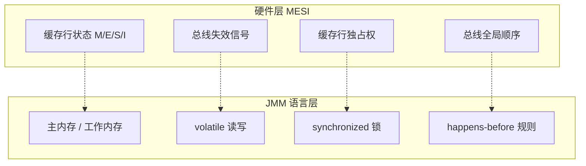
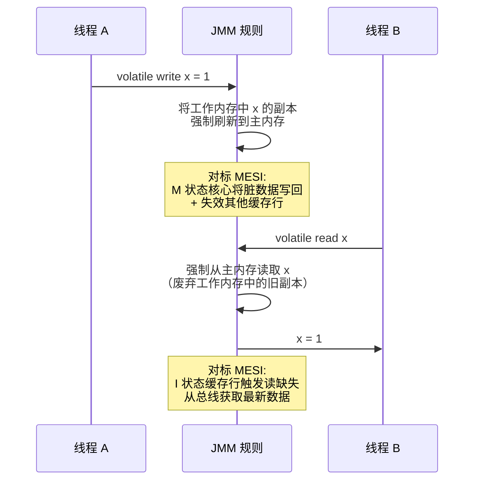
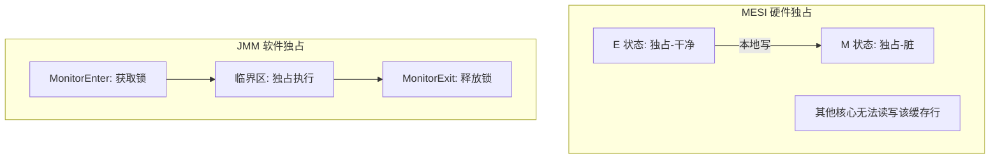
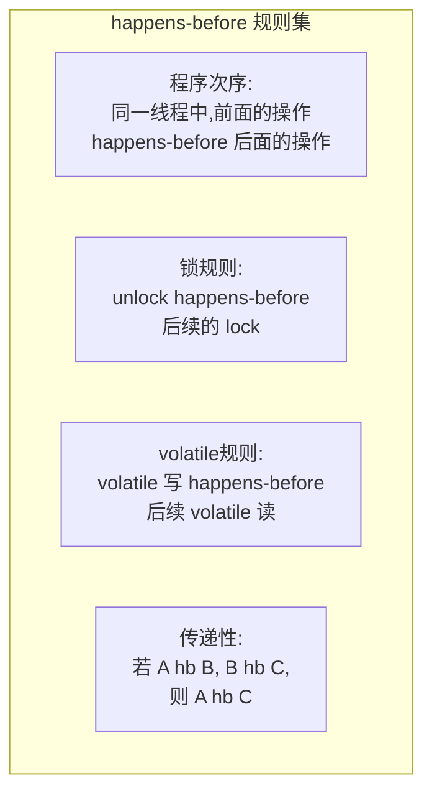

# JMM 如何借鉴 MESI：Java 内存模型的概念引入

## 🏗️ 一、JSR 133 专家组为什么需要定义 JMM

上一篇文章讲完了 MESI 协议。它让所有核心看到一致的数据，但有一个前提：只管理 L1 Cache 之间的总线通信。Store Buffer、Invalidate Queue、编译器和 CPU 的指令重排序——这三样东西 MESI 完全不管。

CPU 架构师不管是有意为之：关掉 Store Buffer 和 Invalidate Queue 的代价是几十倍的性能损失，没有哪个芯片厂会做这种亏本买卖。但 Java 程序员不能不管——如果写了一个 `stopped = true`，另一个线程永远看不到，这就是线上事故。

2004 年，JSR 133 专家组（道格·李是核心成员之一）面临的问题很明确：**不同的 CPU 架构有不同的内存模型（x86 是 TSO，ARM/PowerPC 更弱），Java 不能为每种 CPU 写一套并发程序。** Java 的"一次编写，到处运行"在并发领域受到了硬件差异的致命挑战。

专家组的选择是：在 Java 语言规范中定义一套**软件层的内存可见性契约**——JMM（Java Memory Model）。JMM 不规定 JVM 怎么实现（不管你是插 `lock` 指令还是 `dmb` 屏障），只管规则：如果你写了 `volatile`，那么 `volatile` 写之前的操作对 `volatile` 读之后的操作可见。

JMM 的核心参考模型就是 MESI。它将 MESI 的硬件概念映射为语言层的抽象：

## 🧠 二、JMM 的定位：一层"软件级缓存一致性"

JMM 不是一个运行时可执行的东西。它是一套写在 Java 语言规范中的规则。它不规定 JVM 必须怎么实现 volatile——它只规定：如果你写了 volatile，那么 volatile 写之前的操作对 volatile 读之后的操作可见。

至于这个"可见"具体怎么做到——是 JIT 编译器插入 `lock` 指令、是 ARM 上插入 `dmb` 屏障、还是其他手段——JMM 不管。JMM 只管"合同怎么签"，不管"工人怎么干活"。

这套合同条款的核心是对 MESI 硬件模型的 **概念级模仿**。MESI 在硬件层有什么结构，JMM 就在软件层抽象出对应的概念：



这不是一一对应的等效关系——不能说 volatile 写等于 BusRdX。但它们的 **设计意图** 是对标的：MESI 用硬件解决什么，JMM 用语言规范解决什么。

## 🧠 三、逐项对标：MESI 概念到 JMM 概念

### 💾 3.1 缓存行 → 主内存 / 工作内存

MESI 管理的是物理缓存行，每个缓存行有 M/E/S/I 四种状态。JMM 不管理物理缓存行，但把内存抽象为两层：

- **主内存**（Main Memory）：所有线程共享，对标物理内存
- **工作内存**（Working Memory）：每个线程私有，对标 CPU 缓存 + 寄存器

```
MESI:  Core A 的 L1 缓存行处于 M 状态 → Core B 的同地址缓存行处于 I 状态 → Core B 读时触发缓存缺失
 JMM:  线程 A 修改了工作内存中的副本 → 线程 B 的工作内存中副本失效 → 线程 B 必须从主内存重新读取
```

JMM 定义的核心操作只有 8 个：`lock`、`unlock`、`read`、`load`、`use`、`assign`、`store`、`write`。每个操作都在 "主内存 ↔ 工作内存" 之间定义数据流向。这些操作之间的关系就是 happens-before 规则的基础。

| 维度 | MESI | JMM |
|------|------|-----|
| 管理粒度 | 缓存行（64 字节硬件单位） | 变量（任意大小，软件单位） |
| 状态模型 | 4 状态硬件状态机（M/E/S/I） | 8 种抽象操作（lock/unlock/read/load/use/assign/store/write） |
| 一致性维护方式 | 总线监听自动维护 | 关键字（volatile/synchronized）显式触发 |
| 设计目标 | 所有核心看到一致的数据 | 所有线程在特定条件下看到一致的数据 |

### 📌 3.2 总线失效信号 → volatile

MESI 中，一个核心写入时通过 BusRdX 向总线发送失效信号，其他核心的对应缓存行被置为 I。下次其他核心读取时触发缓存缺失，从总线获取最新数据。

JMM 中，`volatile` 做了同一件事——但它是通过触发 JVM 层面的动作来完成的：



JMM 层面的 volatile 语义翻译为硬件操作的过程：

| 步骤 | JMM 语义 | 硬件操作（x86） |
|------|---------|--------------|
| volatile 写 | 将工作内存刷新到主内存 | `mov [addr], reg` + `lock` 前缀→清空 Store Buffer→触发 MESI 失效 |
| volatile 读 | 废弃工作内存，从主内存重新读取 | `mov reg, [addr]` → 若缓存行已被失效（I 状态），自动触发缓存缺失 |

关键点在于：<span style="color:red">volatile 不强求每次读写都绕过缓存直连内存——它利用的正是 MESI 的缓存一致性机制</span>。volatile 写只是"把 Store Buffer 刷进缓存然后发失效"，volatile 读只是"读缓存，如果已经被失效就自动拿新的"。

### 💾 3.3 缓存行独占权 → synchronized

MESI 中，E 或 M 状态意味着该核心对该缓存行有独占权。E → M 的写入不需要通知任何人，因为根本没有其他核心持有。

JMM 中，`synchronized` 实现了同样的独占模式——只是粒度从"64 字节缓存行"变成了"任意代码块"：



两者关键行为的对标：

| 行为 | MESI | JMM synchronized |
|------|------|-----------------|
| 获取独占权 | 通过 BusRdX 失效其他副本 | 通过 CAS 竞争 monitor 所有权 |
| 独占期间的读写 | M 状态下无需总线事务 | 临界区内无需额外同步 |
| 释放独占权 | 驱逐或降级为 S | MonitorExit：刷工作内存到主内存 |
| 后续访问者如何看到变更 | 读缺失→总线获取最新值 | MonitorEnter：从主内存重新读取 |

synchronized 的 MonitorExit 比 volatile 写更重——它不只是刷新一个变量，而是刷新整个线程工作内存中所有被修改的副本。MonitorEnter 同理，不只是读一个变量，而是废弃整个工作内存的副本。

### 📌 3.4 总线全局顺序 → happens-before

MESI 之所以能保证一致性，一个重要前提是 **总线天然串行化了对同一地址的访问**——两个核心不能同时向总线发送冲突的请求，总线会按顺序仲裁。这个全局顺序让所有核心看到的写操作序列是一致的。

JMM 不可能要求 Java 代码在一个"全局总线"上执行，但它需要通过其他方式建立操作之间的顺序关系。这就是 **happens-before** 规则。

happens-before 定义了操作 A 和操作 B 之间的一种偏序关系：如果 A happens-before B，则 A 的执行结果对 B 可见，且 A 在内存视角下的执行顺序先于 B。



<span style="color:red">happens-before 是 JMM 的灵魂</span>——所有 volatile、synchronized、final 的语义最终都归结为 happens-before 关系。它本质上是在软件层模拟 MESI 总线提供的那种"全局顺序"，只是总线自动保证的事，在 Java 代码中需要程序员用关键字显式声明。

用一段简短的伪代码说明 happens-before 如何连接 JMM 和 MESI：

```java
// 普通变量
int data = 0;
// volatile 变量——JMM 的"总线信号"
volatile boolean ready = false;

// 线程 A: 写入
data = 42;              // (1) 普通写
ready = true;           // (2) volatile 写 → JMM 插入 StoreLoad 屏障
                        //     → 硬件: 清空 Store Buffer → MESI 失效

// 线程 B: 读取
if (ready) {            // (3) volatile 读 → JMM 保证读到 2 之后的值
    int r = data;       // (4) 一定见到 42
}
// 推导链: (1) hb (2) hb (3) hb (4) → 传递性 → (1) hb (4)
```

这个例子中，`ready` 变量的 volatile 修饰相当于在硬件总线上插入了一个"失效-获取"序列，让普通变量 `data` 的写入也被顺便携带到了线程 B。

### 🎯 3.5 对标关系总结表

| MESI 层（硬件） | 解决的问题 | JMM 层（语言规范） | 实现方式 |
|:---|------|:---|------|
| 缓存行状态 M/E/S/I | 缓存数据一致性 | 主内存 / 工作内存模型 | 8 种原子操作 |
| BusRdX 失效信号 | 让其他核心的副本失效 | `volatile` 写 | JIT 插入 StoreLoad 屏障 |
| 缓存缺失自动获取最新值 | 读到最新数据 | `volatile` 读 | JIT 插入 LoadLoad + LoadStore 屏障 |
| E/M 状态的独占访问 | 无竞争的写入 | `synchronized` | MonitorEnter/Exit + 屏障 |
| 总线仲裁的全局顺序 | 所有核心看到一致的写顺序 | `happens-before` 规则 | 编译器 + CPU 的指令定序约束 |
| Store Buffer 刷新 | 写入何时对他人可见 | StoreLoad 屏障（`mfence`/`lock`） | 清空 Store Buffer → 触发 MESI 失效 |
| Invalidate Queue 处理 | 失效消息何时生效 | LoadLoad 屏障（x86 天然保证） | 等待 Invalidate Queue 处理完毕 |

## 🧠 四、JMM 引入的关键字一览

有了上面对标关系，这些 JMM 关键字就不再是凭空出现的规则，而是有明确的硬件对标物：

| 关键字/概念 | 对标 MESI 的什么 | 一句话定位 |
|-----------|:---:|------|
| **volatile** | BusRdX 失效 + 缓存缺失自动获取 | 最轻量的跨线程可见性机制，对标单次缓存失效 |
| **synchronized** | E/M 状态的独占权 + 释放时的全刷新 | 完整的互斥 + 可见性，对标缓存行独占 + 写回 |
| **final** | —（MESI 无对标，JMM 特有） | 构造函数安全发布：final 字段在构造完成前不可被其他线程看到默认值 |
| **happens-before** | 总线全局顺序 | JMM 的偏序关系定义，所有可见性规则的基础 |
| **内存屏障** | Store Buffer 刷新 + Invalidate Queue 处理 | JMM 与 MESI 之间的翻译层，JIT 在需要时插入 |
| **主内存 / 工作内存** | 物理内存 / L1/L2 缓存 | JMM 的抽象模型，定义了线程间数据流动的方向 |

这些关键字将在后续博客中逐一深入展开。目前只需要记住：<span style="color:red">每一个 JMM 关键字背后，都对应着 MESI 协议中的一种硬件行为</span>。volatile 写最终触发的是 Store Buffer 刷新 + 缓存行失效，synchronized 的解锁最终触发的是整个 Store Buffer 的批量刷新。

## 五、实际场景中的 MESI-JMM 对照

### 🌐 5.1 状态标志——volatile 的最轻量场景

线程 A 负责执行任务，线程 B 负责发出停止信号。`flag` 不需要原子操作（只有 B 在写），不需要锁（没有复合操作），但需要可见性（A 必须能看到 B 的修改）。

```java
volatile boolean stopped = false;

// 线程 B: 发出停止信号
stopped = true;  // volatile 写 → StoreLoad 屏障 → Store Buffer 刷新 → MESI 失效

// 线程 A: 检查信号
while (!stopped) {  // volatile 读 → 若缓存行被失效 → 缓存缺失 → 获取最新值
    doWork();
}
```

在 MESI 视角下，线程 B 的写操作让线程 A 的缓存行从 S 变为 I，线程 A 下一次读取时自动触发缓存缺失，拿到 `stopped = true`。整个过程只有一次失效传播，不需要锁。

### 📌 5.2 复合操作——synchronized 的必要性

如果要在 `stopped` 的基础上加一个计数器 `stoppedCount`（"被停止了多少次"），volatile 就不够了——`stoppedCount++` 是"读-改-写"三步，需要原子性。

```java
int stoppedCount = 0;

synchronized void markStopped() {
    stoppedCount++;  // 读-改-写 → 需要原子性 → volatile 不够
    stopped = true;  // volatile 保证可见性
}
```

`synchronized` 对标 MESI 的缓存行独占——进入临界区相当于把相关变量"锁"在自己核心的 M 状态中，其他核心必须等解锁后才能访问。

### 📌 5.3 构造安全——final 的 JMM 特供

`final` 字段在 MESI 中没有直接对标，因为 MESI 是纯运行时机制，不涉及对象构造。但 JMM 专门为 `final` 定义了一条规则：<span style="color:red">在构造函数完成之前，final 字段的默认值（0/null）对其他线程不可见</span>。

```java
class Config {
    final int maxConnections;

    Config(int max) {
        this.maxConnections = max;  // final 写 → JMM 插入 StoreStore 屏障
    }                               // 构造完成 → JMM 插入 StoreLoad 屏障
}
```

JMM 通过内存屏障保证了 final 字段的写入一定在对象引用发布之前完成。这使得不可变对象可以安全发布到多线程而不需要额外的同步。

## 🎯 六、总结：JMM 与 MESI 的分工

MESI 和 JMM 的关系不是"JMM 实现了 MESI"，而是 **JMM 以 MESI 为蓝本，在语言层定义了对应的可见性契约**：

1. **MESI 提供"能力"**——缓存行状态的硬件管理、总线失效广播、缓存缺失自动获取。这些是 JMM 不能重新发明的物理基础，JMM 的所有可见性保证最终都依赖 MESI 的失效传播机制。

2. **JMM 提供"时机"**——MESI 的失效传播是自动的，但 **什么时候触发** 这个传播，由 JMM 的关键字（volatile、synchronized）决定。不写这些关键字，JIT 不会插入内存屏障，Store Buffer 不会主动刷新，其他线程就看不到你的写入。

3. **内存屏障是连接器**——JIT 编译器根据 JMM 规则（happens-before），在正确的代码位置插入内存屏障（`lock`、`mfence`、`dmb`），这些屏障触发 Store Buffer 刷新和 Invalidate Queue 处理，从而激活 MESI 的失效传播。

用一句话概括：**MESI 是公路，内存屏障是红绿灯，JMM 是交通规则**——没有公路车跑不了，没有规则车会撞。

下一篇将开始深入 JMM 的核心机制：happens-before 的完整规则体系、volatile 的读写语义在 JIT 层面是如何翻译为内存屏障的、以及不同硬件平台上屏障策略的差异。
