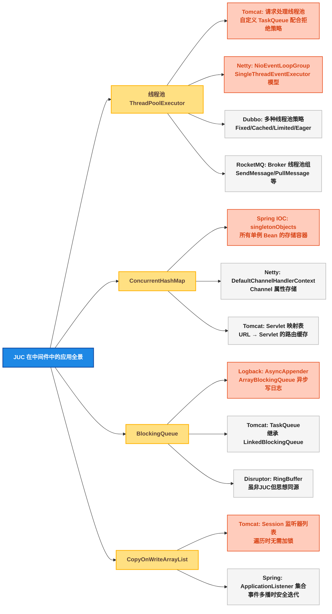
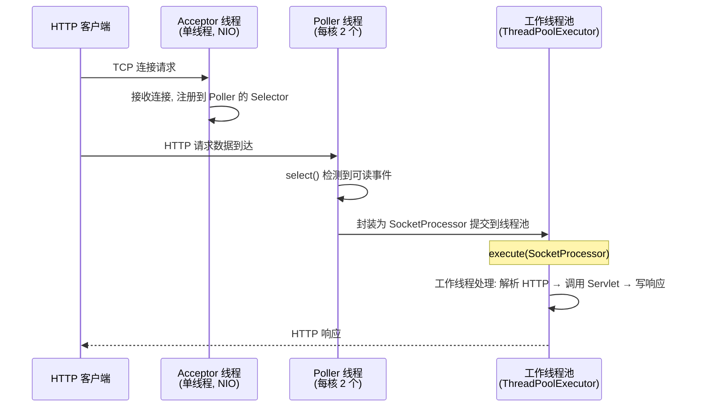
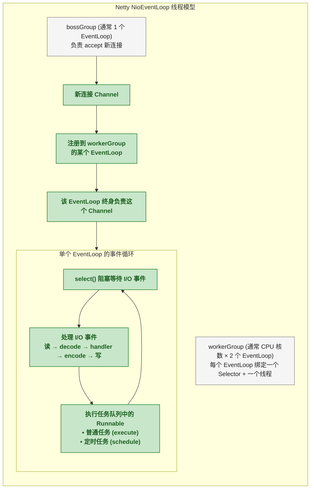
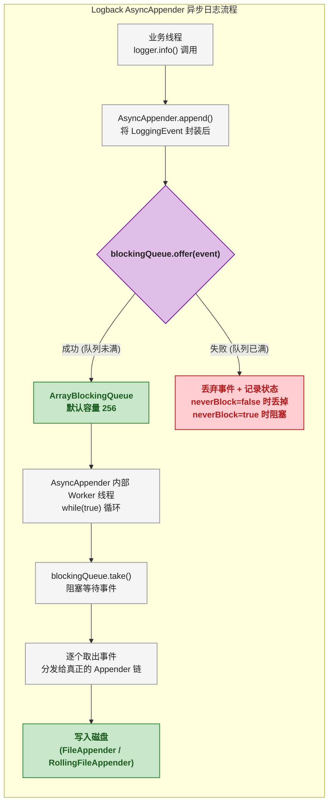
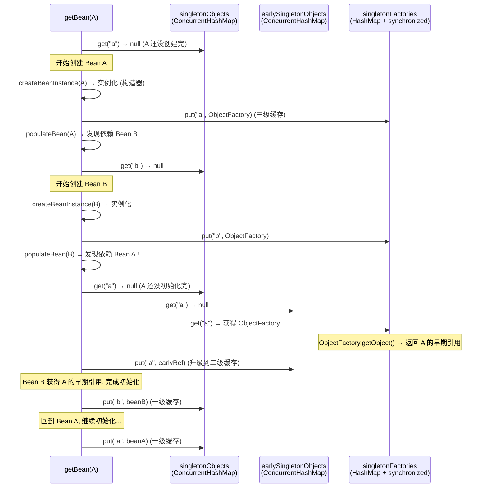
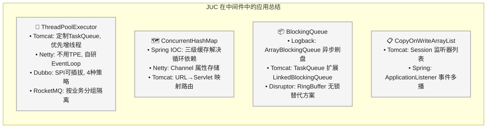

# JUC 在中间件中的应用：线程池与并发集合实战全景

## 问题切入：道格·李的组件在中间件里是如何落地的

道格·李设计的每一个 JUC 组件都有明确的定位：`ThreadPoolExecutor` 管理线程资源、`ConcurrentHashMap` 提供高并发下的安全容器、`BlockingQueue` 协调生产者与消费者。但这些组件本身只是"积木"——积木搭成什么，看用的人。

Tomcat、Netty、Dubbo、RocketMQ 这些中间件的作者，就是最高水平的积木搭手。他们在道格·李提供的基础上做了大量二次定制：继承 `ThreadPoolExecutor` 改写拒绝策略、用 `ConcurrentHashMap` 存储单例对象、用 `BlockingQueue` 实现异步日志缓冲。

翻开这些中间件的源码，你会发现：标准 JUC 组件很少被直接使用，几乎都被继承或组合包装。这不是因为标准组件不够好，而是因为每个中间件的场景都有自己的约束——Tomcat 的线程池需要在队列满时反过来创建线程（而不是拒绝），Netty 用 `NioEventLoopGroup` 把线程池拆成了事件循环。

本篇从源码层面逐一拆解**道格·李的 JUC 积木如何在中间件中被定制、组合和落地**。覆盖的中间件和对应的 JUC 组件如下：



## 🏊 线程池在中间件中的应用

### 🏊 Tomcat：请求处理的线程池引擎

Tomcat 处理 HTTP 请求的核心是一个定制化的 `ThreadPoolExecutor` 。它没有直接用 JDK 的标准实现，而是继承了 `ThreadPoolExecutor` 并重写了其中的关键行为。

**源码结构（Tomcat 10， `org.apache.tomcat.util.threads.ThreadPoolExecutor` ）** ：

```java
public class ThreadPoolExecutor extends java.util.concurrent.ThreadPoolExecutor {

    // 核心定制: 使用 Tomcat 自己的 TaskQueue
    public ThreadPoolExecutor(
            int corePoolSize,
            int maximumPoolSize,
            long keepAliveTime,
            TimeUnit unit,
            BlockingQueue<Runnable> workQueue,  // ← TaskQueue
            ThreadFactory threadFactory,
            RejectedExecutionHandler handler) {
        super(corePoolSize, maximumPoolSize, keepAliveTime,
              unit, workQueue, threadFactory, handler);
    }

    // ★ 关键重写: 任务执行前后触发计数
    @Override
    protected void beforeExecute(Thread t, Runnable r) {
        super.beforeExecute(t, r);
        // 统计当前活跃线程数 (用于连接池打满监控)
        submittedCount.incrementAndGet();
    }

    @Override
    protected void afterExecute(Runnable r, Throwable t) {
        // ★ 关键重写: 检查 TaskQueue 是否还有能力接收任务
        // 如果当前线程数即将降到 corePoolSize 以下,
        // 且队列中还有任务, 则创建新线程确保吞吐
        submittedCount.decrementAndGet();
        super.afterExecute(r, t);
    }
}
```

**Tomcat 的任务队列 `TaskQueue`** 继承自 `LinkedBlockingQueue` ，重写了 `offer` 方法——这是 Tomcat 线程池设计中最精妙的部分：

```java
public class TaskQueue extends LinkedBlockingQueue<Runnable> {

    private ThreadPoolExecutor parent = null; // 反向引用父线程池

    @Override
    public boolean offer(Runnable o) {
        // ★ 如果当前线程数已达到 maximumPoolSize, 直接入队
        int currentPoolSize = parent.getPoolSize();

        // ★ 如果还有空闲线程, 优先使用线程而非入队
        if (currentPoolSize < parent.getMaximumPoolSize()
                && parent.getSubmittedCount() <= currentPoolSize) {
            // 返回 false 让 ThreadPoolExecutor 走 addWorker 分支
            return false;
        }

        // 否则正常入队 (调用父类 LinkedBlockingQueue.offer)
        return super.offer(o);
    }
}
```

`offer` 返回 `false` 后，JDK `ThreadPoolExecutor.execute` 的标准流程会走"创建非核心线程"的路径——这就是 Tomcat 优先增线程而非积压任务的策略。

**对比：JDK 标准行为 vs Tomcat 定制行为** ：

| 维度 | JDK 标准 ThreadPoolExecutor | Tomcat 定制 ThreadPoolExecutor |
|------|------|------|
| 任务队列 | 用户选择（LinkedBlockingQueue / ArrayBlockingQueue 等） | 固定为 TaskQueue |
| 任务入队时机 | 核心线程满了就入队 | 优先尝试创建新线程（直到 max），队列满后才触发拒绝 |
| 队列满后行为 | 创建非核心线程 | 创建非核心线程（此时通常已经 max） |
| 监控扩展 | 无 | beforeExecute / afterExecute 中维护 submittedCount |

Tomcat 选择这种策略的原因是： **HTTP 请求的延迟远比内存消耗重要** 。先创建线程处理当前请求（可能短暂超 max），比让请求在队列中排队等待要好得多。

Tomcat 中还有一个重要细节——**Acceptor 线程** 与 **工作线程池** 的分工：



Acceptor 和 Poller 各自是少量固定线程（不由工作线程池管理），只有真正的业务处理（HTTP 解析 + Servlet 执行）才进入 `ThreadPoolExecutor` 。

### 🧵 Netty：EventLoop 线程模型

Netty 没有使用 `ThreadPoolExecutor` ，而是自研了 `NioEventLoopGroup`——它是一组 `SingleThreadEventExecutor` 的容器。每个 `NioEventLoop` 绑定一个线程，该线程终身负责一组 Channel 的所有 I/O 事件和任务执行。



Netty EventLoop 内部的任务队列使用的是 **`MpscUnboundedArrayQueue`** （多生产者单消费者无界队列），它不是 JUC 标准组件，但在思想上与 `ConcurrentLinkedQueue` 同源——MPSC（Multiple Producer Single Consumer）保证了 EventLoop 线程消费任务时无锁。

### 📐 Dubbo：可插拔的线程池策略

Dubbo 的服务端（Provider）通过 SPI 机制支持多种线程池实现，通过 `<dubbo:protocol threadpool="xxx" />` 配置切换：

```java
// Dubbo 线程池 SPI 接口 (org.apache.dubbo.common.threadpool.ThreadPool)
@SPI("fixed")
public interface ThreadPool {
    @Adaptive
    Executor getExecutor(URL url);
}
```

| 线程池实现 | SPI Key | 核心行为 | 适用场景 |
|------|:---:|------|------|
| `FixedThreadPool` | `fixed` | 固定线程数，默认 200。队列无限 | 大多数场景，稳定可预测 |
| `CachedThreadPool` | `cached` | 线程数无界，60s 空闲回收 | 短任务、流量波动大 |
| `LimitedThreadPool` | `limited` | 线程数有上限，队列有上限 | 需要反压机制，防止 OOM |
| `EagerThreadPool` | `eager` | 与 Tomcat 类似——优先创建线程而非入队 | 低延迟优先场景 |

**`EagerThreadPool` 的 `TaskQueue`** 与 Tomcat 的 `TaskQueue` 设计思路一致，都是在 `offer` 中返回 `false` 引导 JDK 走 `addWorker` ：

```java
// Dubbo EagerThreadPool 的 TaskQueue.offer 核心逻辑
@Override
public boolean offer(Runnable runnable) {
    // 如果当前线程数还没达到最大, 拒绝入队 → 触发 addWorker
    if (executor.getPoolSize() < executor.getMaximumPoolSize()) {
        return false;
    }
    return super.offer(runnable);
}
```

### 🏊 RocketMQ：Broker 的分组线程池

RocketMQ Broker 需要处理多种不同性质的任务——发送消息、拉取消息、管理请求、事务消息等。每种任务使用 **独立的线程池** ，通过线程池隔离避免单一任务打爆所有资源：

```java
// RocketMQ Broker 控制器中定义的线程池 (org.apache.rocketmq.broker.processor)
public class BrokerController {
    // 发送消息线程池
    private ExecutorService sendMessageExecutor;

    // 拉取消息线程池
    private ExecutorService pullMessageExecutor;

    // 管理请求线程池
    private ExecutorService adminExecutor;

    // 客户端管理线程池
    private ExecutorService clientManageExecutor;

    // 查询消息线程池
    private ExecutorService queryMessageExecutor;

    // 事务消息线程池
    private ExecutorService endTransactionExecutor;

    // 初始化示例
    public void initialize() {
        this.sendMessageExecutor = new ThreadPoolExecutor(
            corePoolSize,    // 核心线程数 (可配置)
            maxPoolSize,     // 最大线程数
            1000 * 60,       // 空闲保活 1 分钟
            TimeUnit.MILLISECONDS,
            new LinkedBlockingQueue<>(10000),  // 队列容量 10000
            new ThreadFactoryImpl("SendMessageThread_")
        );
        // ... 其他线程池类似配置
    }
}
```

RocketMQ 的这种"线程池按业务分组"模式，在大型系统中很常见。核心原则： **不同优先级的任务使用不同的线程池** 。发送和拉取是核心路径，管理请求是辅助路径——如果管理请求打爆了线程池，不应该影响用户发消息。

**各中间件线程池设计对比** ：

| 中间件 | 线程模型 | 队列策略 | 拒绝策略 |
|------|------|------|------|
| Tomcat | `ThreadPoolExecutor` + 自定义 `TaskQueue` | 优先增线程（重写 `offer` 返回 false） | 抛 `RejectedExecutionException` 后由 Acceptor 控制连接速率 |
| Netty | `NioEventLoopGroup` (自研) | MPSC 无锁队列，单线程消费 | 不拒绝（无界队列） |
| Dubbo Fixed | `ThreadPoolExecutor` + `SynchronousQueue` | 无缓冲，直接交付给线程 | 默认 `AbortPolicy` |
| Dubbo Eager | `ThreadPoolExecutor` + 自定义 `TaskQueue` | 同 Tomcat，优先增线程 | 抛异常后 Dubbo 返回错误响应给调用方 |
| RocketMQ | 多个独立 `ThreadPoolExecutor` | `LinkedBlockingQueue` 有界 | `AbortPolicy` ，任务被拒时打印 ERROR 日志 |

## 🔌 并发集合在中间件中的应用

### ⚙️ ConcurrentHashMap：Spring IOC 容器的核心存储

Spring IOC 容器中，所有单例 Bean 都存储在一个 `ConcurrentHashMap` 中。这个集合是 Spring 启动和运行期间访问最频繁的数据结构。

**源码位置（ `org.springframework.beans.factory.support.DefaultSingletonBeanRegistry` ）** ：

```java
public class DefaultSingletonBeanRegistry extends SimpleAliasRegistry
        implements SingletonBeanRegistry {

    // ★ 一级缓存: 存储完全初始化好的单例 Bean
    // ConcurrentHashMap 保证多线程获取 Bean 时的可见性和安全性
    private final Map<String, Object> singletonObjects = new ConcurrentHashMap<>(256);

    // ★ 二级缓存: 存储提前曝光的半成品 Bean (解决循环依赖)
    private final Map<String, Object> earlySingletonObjects = new ConcurrentHashMap<>(16);

    // ★ 三级缓存: 存储 ObjectFactory (解决 AOP 循环依赖)
    private final Map<String, ObjectFactory<?>> singletonFactories = new HashMap<>(16);

    // 获取 Bean 的核心路径
    @Nullable
    protected Object getSingleton(String beanName, boolean allowEarlyReference) {
        // ★ 第一步: 从一级缓存取 (大部分命中就在这里, O(1) 无锁)
        Object singletonObject = this.singletonObjects.get(beanName);

        // 未命中 + 正在创建 → 检查二级、三级缓存 (解决循环依赖)
        if (singletonObject == null && isSingletonCurrentlyInCreation(beanName)) {
            singletonObject = this.earlySingletonObjects.get(beanName);
            if (singletonObject == null && allowEarlyReference) {
                synchronized (this.singletonObjects) {
                    // 双重检查 + 从三级缓存升级到二级缓存
                    singletonObject = this.singletonObjects.get(beanName);
                    if (singletonObject == null) {
                        singletonObject = this.earlySingletonObjects.get(beanName);
                        if (singletonObject == null) {
                            ObjectFactory<?> singletonFactory =
                                    this.singletonFactories.get(beanName);
                            if (singletonFactory != null) {
                                singletonObject = singletonFactory.getObject();
                                this.earlySingletonObjects.put(beanName, singletonObject);
                                this.singletonFactories.remove(beanName);
                            }
                        }
                    }
                }
            }
        }
        return singletonObject;
    }
}
```

**为什么用 `ConcurrentHashMap` ？**

1. **线程安全获取** ：多线程并发调用 `getBean()` 时，不需要对 IOC 容器加全局锁
2. **高并发读** ： `ConcurrentHashMap.get` 在读不冲突时不需要加锁，而 `Hashtable` / `Collections.synchronizedMap` 每次 `get` 都需要锁
3. **初始化容量 256** ：Spring 显式设定了初始容量，避免大部分应用启动时的扩容开销

Netty 中也大量使用 `ConcurrentHashMap`——`DefaultChannelHandlerContext` 中用 `ConcurrentHashMap` 存储每个 Channel 的自定义属性（ `AttributeMap` ）， `Channel` 注册/注销/属性读写都在多线程环境下进行。

### 🚧 BlockingQueue：Logback 异步日志的缓冲区

Logback 的 `AsyncAppender` 是 `BlockingQueue` 在中间件中最经典的应用——它通过生产者-消费者模式解耦"日志产生"和"日志写入磁盘"：



**Logback 中 `AsyncAppender` 的核心源码（ `ch.qos.logback.classic.AsyncAppender` ）** ：

```java
public class AsyncAppender extends AsyncAppenderBase<ILoggingEvent> {

    // ★ 核心: 有界阻塞队列, 默认 256
    // 使用 ArrayBlockingQueue 而非 LinkedBlockingQueue,
    // 因为数组结构有更好的缓存局部性, 且固定容量避免内存溢出
    public static final int DEFAULT_QUEUE_SIZE = 256;
    private int queueSize = DEFAULT_QUEUE_SIZE;

    private BlockingQueue<E> blockingQueue;

    @Override
    public void start() {
        // 创建队列
        blockingQueue = new ArrayBlockingQueue<>(queueSize);
        // 启动消费线程
        worker.setDaemon(true);
        worker.setName("AsyncAppender-Worker-" + worker.getName());
        worker.start();
        super.start();
    }

    // 生产者: 业务线程调用
    @Override
    protected void append(E eventObject) {
        if (!isQueueBelowDiscardThreshold() || !blockingQueue.offer(eventObject)) {
            // 队列满了 → 丢弃 (默认行为, 不阻塞业务线程)
        }
    }

    // 消费者: Worker 线程循环
    class Worker extends Thread {
        public void run() {
            AsyncAppenderBase<E> parent = AsyncAppender.this;
            while (parent.isStarted()) {
                try {
                    // ★ take() 阻塞等待, 消费者不会空转浪费 CPU
                    E e = parent.blockingQueue.take();
                    parent.aai.appendLoopOnAppenders(e);
                } catch (InterruptedException ie) {
                    break;
                }
            }
        }
    }
}
```

**关键设计决策解读** ：

| 决策 | 选择 | 原因 |
|------|------|------|
| 队列类型 | `ArrayBlockingQueue` | 固定容量防 OOM，数组连续内存结构缓存友好 |
| 默认容量 | 256 | 太少丢日志，太多占内存。256 是平衡值 |
| 队列满行为 | 丢弃（默认） | 日志不应阻塞业务线程。若日志比业务更重要则设 `neverBlock=true` |
| 消费端 | `take()` 阻塞 | 消费者空转等待会浪费 CPU， `take()` 让出 CPU 直到有数据 |

### 📝 CopyOnWriteArrayList：Tomcat 的 Session 监听器

Tomcat 中每个 `Session` 都可以注册多个监听器。当 Session 属性变更或过期时，需要遍历所有监听器并一一回调。遍历期间监听器列表可能被并发修改（其他线程正在添加/移除监听器）， `CopyOnWriteArrayList` 保证遍历的安全迭代。

**Tomcat `StandardSession` 源码片段** ：

```java
public class StandardSession implements HttpSession, Session, Serializable {

    // ★ 监听器列表: 读多写少 → CopyOnWriteArrayList
    // 属性变更时遍历, 通常只在应用启动时增删
    private final transient List<SessionListener> listeners =
            new CopyOnWriteArrayList<>();

    public void addSessionListener(SessionListener listener) {
        listeners.add(listener);   // 写: 全量复制数组
    }

    public void removeSessionListener(SessionListener listener) {
        listeners.remove(listener);
    }

    // 属性变更时调用: 遍历所有监听器
    public void tellChangedSessionId(String newId, String oldId,
                                      boolean notifySessionListeners,
                                      boolean notifyContainerListeners) {
        // ★ 遍历: 直接迭代, 无需加锁
        // CopyOnWriteArrayList.iterator() 返回的是快照迭代器
        for (SessionListener listener : listeners) {
            listener.sessionIdChanged(this, oldId);
        }
    }
}
```

Spring 中的 `ApplicationListener` 管理也是同样的模式——`AbstractApplicationEventMulticaster` 使用 `CopyOnWriteArrayList` 存储所有事件监听器，发布事件时遍历通知：

```java
// Spring 事件多播器中的监听器集合
public abstract class AbstractApplicationEventMulticaster
        implements ApplicationEventMulticaster, BeanClassLoaderAware, BeanFactoryAware {

    // ★ 与 Tomcat 一样的选择
    public final Collection<ApplicationListener<?>> applicationListeners =
            new CopyOnWriteArrayList<>();
}
```

**为什么不用 `ConcurrentHashMap` 或 `synchronizedList` ？**

| 集合 | 读并发 | 写开销 | 合适场景 |
|------|:---:|:---:|------|
| `CopyOnWriteArrayList` | 无锁，直接用数组索引 | 全量复制 O(n) | 监听器列表（写极少，读频繁） |
| `ConcurrentHashMap` | 读基本无锁 | 分段锁，单条记录 CAS | 高频读写都多的场景（如 Bean 缓存） |
| `synchronizedList` | 每次读加锁 | 每次写加锁 | 读写频率相近且低 |
| `ConcurrentLinkedQueue` | 无锁 CAS | 无锁 CAS | 队列场景（FIFO），不适用随机访问 |

## 源码关联：从中间件追溯到 JDK

### 📨 关联一：Tomcat TaskQueue.offer → ThreadPoolExecutor.execute

整个关联链如下：

```
Tomcat TaskQueue.offer()
  → 返回 false (当前线程数 < max)
    → JDK ThreadPoolExecutor.execute(Runnable) 第 3 步
      → addWorker(command, false)  // 创建非核心线程
        → new Worker(firstTask).thread.start()
          → Worker.run() → runWorker()
            → task.run()
```

```java
// JDK ThreadPoolExecutor.execute 的节选 (java.util.concurrent)
public void execute(Runnable command) {
    int c = ctl.get();
    // Step 1: 当前线程数 < corePoolSize → addWorker
    if (workerCountOf(c) < corePoolSize) {
        if (addWorker(command, true)) return;
        c = ctl.get();
    }
    // Step 2: 核心满了, 尝试 offer 入队
    if (isRunning(c) && workQueue.offer(command)) {
        int recheck = ctl.get();
        if (!isRunning(recheck) && remove(command))
            reject(command);
        else if (workerCountOf(recheck) == 0)
            addWorker(null, false);
    }
    // Step 3: 入队失败 (Tomcat TaskQueue 返回 false)
    // → 尝试创建非核心线程
    else if (!addWorker(command, false))
        reject(command);  // max 也满了 → 拒绝
}
```

Tomcat 的 `TaskQueue.offer` 返回 `false` 时，JDK 的 `execute` 方法会跳过 Step 2，直接进入 Step 3，创建非核心线程。这就是 Tomcat "优先增线程"策略的底层协作方式。

### 💾 关联二：Spring getSingleton → ConcurrentHashMap.get → 三级缓存升级

当 Bean A 依赖 Bean B，Bean B 又依赖 Bean A 时（循环依赖），Spring 的解决路径：



`ConcurrentHashMap` 在这里的角色：一级缓存 `singletonObjects` 的 `get` 是纯无锁读（在大多数 JDK 实现中），保证 Spring 运行时每次 `getBean()` 都极快。

## 🎯 总结



本文核心要点总结：

| 维度 | 核心结论 |
|------|------|
| **Tomcat 的线程池定制** | 继承 `ThreadPoolExecutor` ，通过重写 `TaskQueue.offer` 返回 `false` 引导 JDK 走 `addWorker` ，实现"优先增线程"策略 |
| **Netty 的线程模型** | 不用 `ThreadPoolExecutor` ，自研 `SingleThreadEventExecutor` ，一个线程终身负责一组 Channel，MPSC 无锁队列消费任务 |
| **Dubbo 的可插拔线程池** | SPI 机制支持 4 种实现， `EagerThreadPool` 与 Tomcat 策略一致，适合低延迟场景 |
| **RocketMQ 的线程池分组** | 不同业务（发送/拉取/管理/事务）使用独立线程池，避免单一任务打爆所有资源 |
| **ConcurrentHashMap 在 Spring** | 三级缓存（ `singletonObjects` / `earlySingletonObjects` / `singletonFactories` ）是 Spring 解决循环依赖的核心机制 |
| **BlockingQueue 在 Logback** | `AsyncAppender` 用 `ArrayBlockingQueue` 做缓冲区，生产者（业务线程）offer 入队，消费者（Worker 线程）take 阻塞消费 |
| **CopyOnWriteArrayList** | 监听器列表的标准选择——写极少（启动时注册），读频繁（每次事件都要遍历） |
