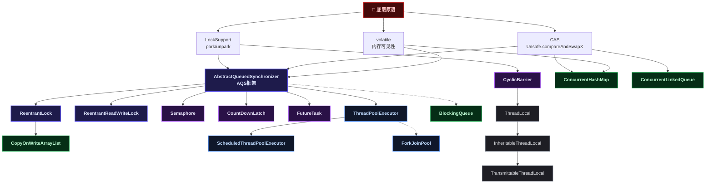
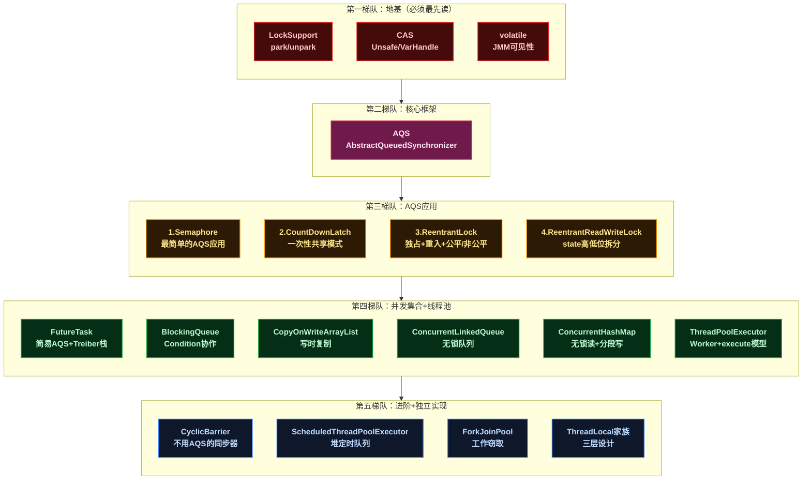
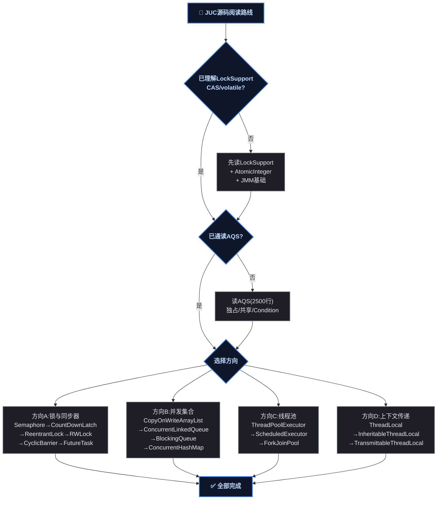

# JUC 源码阅读路线图：从 LockSupport 到 ForkJoinPool 的完整导读

## ❓ 1️⃣ 一、道格·李的 JUC 有明确的分层设计——读源码必须按这个顺序

道格·李在设计 `java.util.concurrent` 包时，不是把二十几个类平铺在一个包里的。JUC 有严格的分层：**底层原语**（CAS、volatile、LockSupport）→ **核心框架**（AQS）→ **具体实现**（锁、同步器、集合、线程池）。

这个分层意味着：如果你一上来就读 `ReentrantLock.lock()` 的源码，三行之后就会遇到 `tryAcquire()`，再往下就是 CAS 修改 AQS state、`LockSupport.park()` 阻塞线程——全是底层 API。不知道 CAS 的语义，不知道 state 的 CLH 入队流程，不知道 `park/unpark` 的 permit 机制，每走一步都得暂停查资料，阅读体验极差。

反之，如果你按道格·李的设计顺序来读——先理解 CAS 和 `LockSupport`（地基），再啃透 AQS（骨架），然后逐一看 ReentrantLock、Semaphore、CountDownLatch 怎么在骨架上加肉（定制 `tryAcquire` / `tryRelease`）——整个 JUC 包的结构就一目了然了。

这篇博客提供的就是这份**按设计分层排列的源码阅读路线图**——告诉你每个组件在 JDK 中的位置、入口 API、核心函数调用链、推荐阅读顺序、以及读完这个组件你能学到什么设计思想。不会逐行分析源码（各组件详细分析见本系列其他文章）。

## 🏗️ 2️⃣ 二、总览：JUC 全景架构图

阅读之前，先建立全局坐标系。以下是所有 JUC 核心组件的逻辑关系图：



这张图揭示了 JUC 的设计分层：

| 层级 | 包含组件 | 角色 |
|:---:|------|------|
| **底层原语** | `CAS`（Unsafe/VarHandle）、`volatile`、`LockSupport` | 所有并发组件的地基。CAS 提供原子操作，volatile 提供可见性，LockSupport 提供线程阻塞/唤醒 |
| **核心框架** | `AQS`（AbstractQueuedSynchronizer） | JUC 的"骨架"——ReentrantLock、Semaphore、CountDownLatch 等都是在 AQS 之上定制的 |
| **锁实现** | `ReentrantLock`、`ReentrantReadWriteLock` | 基于 AQS 独占/共享模式的具体锁 |
| **同步器** | `Semaphore`、`CountDownLatch`、`CyclicBarrier`、`FutureTask` | 线程间协调工具 |
| **并发集合** | `ConcurrentHashMap`、`ConcurrentLinkedQueue`、`CopyOnWriteArrayList`、`BlockingQueue` | 线程安全的数据容器 |
| **线程池** | `ThreadPoolExecutor`、`ScheduledThreadPoolExecutor`、`ForkJoinPool` | 线程复用与管理 |
| **上下文传递** | `ThreadLocal` → `InheritableThreadLocal` → `TransmittableThreadLocal` | 线程本地变量与跨线程传递 |

## 3️⃣ 三、第一阶段：地基——理解底层原语

在阅读任何 JUC 高层组件之前，必须先理解这三个底层机制。它们出现的频率极高——AQS 的每次 `acquire()` 都要调 `LockSupport.park()`，每次 `compareAndSetState()` 都要用到 CAS。

### 📌 3.1 LockSupport——线程阻塞与唤醒的原语

| 项目 | 内容 |
|------|------|
| **JDK 源码位置** | `java.util.concurrent.locks.LockSupport`（约 400 行） |
| **核心依赖** | `sun.misc.Unsafe.park()` / `unpark()`（native 方法） |

**入口 API**：

```java
LockSupport.park()       // 阻塞当前线程
LockSupport.parkNanos()  // 限时阻塞
LockSupport.unpark(t)    // 唤醒指定线程
```

**核心调用链**（仅列出函数名与作用）：

```
park() → Unsafe.park(false, 0L)           // native，阻塞当前线程
unpark(Thread) → Unsafe.unpark(Thread)    // native，唤醒线程
```

**推荐阅读顺序**（按行号从低到高）：

| 顺序 | 方法 / 区域 | 重点看什么 |
|:---:|------|------|
| 1 | 类顶部的静态初始化块 | `UNSAFE` 实例的获取方式——通过反射拿 `Unsafe.theUnsafe` |
| 2 | `setBlocker(Thread, Object)` | blocker 字段的作用：为调试/监控提供阻塞原因 |
| 3 | `park()` | 实际调用链很短，重点是理解"permit"机制 |
| 4 | `unpark(Thread)` | 与 `park()` 的配合：permit 是二值信号量（最多 1 个，不可累积） |

**阅读前需要知道的**：

- LockSupport 的 **permit**（许可）是一个二值信号量：`park()` 消耗 permit（如果没有则阻塞），`unpark()` 发放 permit（如果已有则不累积，上限为 1）。这解释了为什么 `unpark()` 可以先于 `park()` 调用——当 `park()` 被调用时发现已有 permit，直接消耗并返回，不会阻塞。
- `Thread.suspend()`/`resume()` 已被废弃，就是因为 `resume()` 如果在 `suspend()` 之前执行会导致线程永久挂起。LockSupport 的 permit 机制解决了这个问题。

**读了能学到什么**：

- 线程阻塞/唤醒的最底层抽象
- permit 二值信号量的精妙设计
- 为什么 AQS 用 `LockSupport.park()` 而不是 `Object.wait()`（因为不需要先获取锁，不依赖监视器对象）

### 📋 3.2 CAS——无锁并发的原子操作基础

| 项目 | 内容 |
|------|------|
| **JDK 源码位置** | Java 9+：`java.lang.invoke.VarHandle`；Java 8：`sun.misc.Unsafe`（JDK 内部类） |
| **核心依赖** | CPU 指令（x86: `cmpxchg`，ARM: `LDREX/STREX`） |

**核心调用链**：

```
// Java 8 路径
Unsafe.compareAndSwapInt(obj, offset, expect, update)   // native，CAS 原语
Unsafe.compareAndSwapObject(obj, offset, expect, update) // native

// Java 9+ 路径
VarHandle.compareAndSet(obj, expect, update)
```

**推荐阅读源码位置**：

| 顺序 | 位置 | 重点看什么 |
|:---:|------|------|
| 1 | `AtomicInteger.compareAndSet()` | 最简单的 CAS 封装，一行代码，看 VarHandle 怎么用 |
| 2 | `AtomicReference.compareAndSet()` | 引用类型的 CAS，用于理解 AQS 的 `compareAndSetState()` |
| 3 | `AtomicIntegerFieldUpdater` | 字段级别的 CAS 更新，AQS 中 `addWaiter()` 的 `compareAndSetTail()` 就是这个模式 |

**读了能学到什么**：

- CAS 的三个操作数：内存偏移量、期望值、新值
- ABA 问题的产生与解决（`AtomicStampedReference`）
- 自旋（spin loop）的基本写法：`while (!cas(...)) {}`

### 👁️ 3.3 volatile——Java 内存模型中的可见性保证

| 项目 | 内容 |
|------|------|
| **JDK 中的关键用法** | AQS 的 `state` 字段声明为 `volatile int` |
| **涉及规范** | JSR-133（Java Memory Model） |

**在 JUC 源码中验证 volatile 作用的典型位置**：

| 顺序 | 代码位置 | 看什么 |
|:---:|------|------|
| 1 | `AQS.state` 字段 | 声明为 `private volatile int state`，读写分别用 `getState()`/`setState()` |
| 2 | `ConcurrentHashMap.Node.val` | `volatile V val`，保证 get() 无锁读的可见性 |
| 3 | `FutureTask.outcome` | `volatile Object outcome`，保证多线程可见 |

**读了能学到什么**：

- volatile 的写-读 happens-before 关系
- 为什么 `volatile` 不能替代 `synchronized`（不保证原子性）
- AQS 为什么用 `volatile state` + CAS 而不是直接 `volatile++`

## 🏛️ 四、第二阶段：核心框架——AQS

AQS（AbstractQueuedSynchronizer，抽象队列同步器）是 JUC 中最重要的一个类。读完它，ReentrantLock、Semaphore、CountDownLatch、ReentrantReadWriteLock、FutureTask 的源码都会变得容易理解。

| 项目 | 内容 |
|------|------|
| **JDK 源码位置** | `java.util.concurrent.locks.AbstractQueuedSynchronizer`（约 2500 行） |
| **内部类** | `Node`（CLH 队列节点）、`ConditionObject`（条件队列实现） |

**推荐阅读顺序**（这是 JUC 源码阅读中最关键的一个顺序）：

| 顺序 | 方法 / 区域 | 重点看什么 | 预计时间 |
|:---:|------|------|:---:|
| 1 | `Node` 内部类 | 5 个 waitStatus 值（0/CANCELLED/SIGNAL/CONDITION/PROPAGATE）、prev/next 指针、thread 字段 | 15 min |
| 2 | 字段区 | `state`(volatile)、`head`/`tail`(CLH 队列)、`exclusiveOwnerThread`（父类 `AbstractOwnableSynchronizer`） | 5 min |
| 3 | `acquire(int)` | 独占模式获取的模板方法——最核心 | 10 min |
| 4 | `tryAcquire(int)` | 只定义原型，具体实现在子类（如 ReentrantLock.Sync） | 5 min |
| 5 | `addWaiter(Node)` | 如何用 CAS 将节点加入 CLH 队列尾部 | 10 min |
| 6 | `acquireQueued(Node, int)` | 入队后的自旋逻辑 + `shouldParkAfterFailedAcquire()` + `parkAndCheckInterrupt()` | 20 min |
| 7 | `release(int)` | 独占模式释放 + `unparkSuccessor()` 唤醒后继 | 10 min |
| 8 | `acquireShared(int)` / `releaseShared(int)` | 共享模式的获取/释放（Semaphore、CountDownLatch 用这个） | 15 min |
| 9 | `ConditionObject` | `await()` / `signal()` / `signalAll()`，条件队列与 CLH 队列的转移 | 30 min |
| 10 | `hasQueuedPredecessors()` | 公平锁的判断逻辑——一行 `h != t && ...` 决定了是否允许插队 | 5 min |

**核心函数调用链**（独占模式，从上往下读）：

```
acquire(int arg)
  ├── tryAcquire(arg)                  // 子类实现：尝试快速获取
  ├── addWaiter(Node.EXCLUSIVE)        // 失败则创建节点入队
  │     ├── compareAndSetTail()        // CAS 设置队尾
  │     └── enq(node)                  // 自旋入队（初始化 head 或 CAS 重试）
  └── acquireQueued(node, arg)         // 入队后的自旋
        ├── shouldParkAfterFailedAcquire(p, node)  // 检查是否应阻塞（设置前驱 SIGNAL）
        └── parkAndCheckInterrupt()   // LockSupport.park(this) 阻塞
              └── LockSupport.park(this)

release(int arg)
  ├── tryRelease(arg)                  // 子类实现：尝试释放
  └── unparkSuccessor(head)            // 唤醒后继节点
        └── LockSupport.unpark(s.thread)
```

**设计思想体现**：

- **模板方法模式**：`acquire()`/`release()` 定义骨架流程，`tryAcquire()`/`tryRelease()` 留给子类定义具体策略。这是 AQS 最核心的设计——一个框架支持了独占锁（ReentrantLock）、共享信号量（Semaphore）、一次性闩（CountDownLatch）等多种同步器。
- **CLH 队列变体**：原始 CLH 是自旋等待，AQS 改为阻塞等待（`park()`），降低了 CPU 空转。节点的 `prev`/`next` 双向指针支持从中间取消（CANCELLED 状态）。
- **waitStatus 用 int 而不是 enum**：为了支持 CAS 原子更新——`compareAndSetWaitStatus()` 需要一个 int 值。

**一个具体的问题来测试你是否真读懂了**：`acquireQueued()` 返回 `boolean`（中断标记），为什么不在 `acquire()` 中直接抛 `InterruptedException`，而要返回 boolean 让上层决定？答案在 `lock()` vs `lockInterruptibly()` 的区别中——前者不响应中断但恢复标记，后者响应中断抛异常。

## 🏛️ 五、第三阶段：AQS 的典型应用

读完 AQS 之后，按以下顺序阅读它的子类实现。每个子类都只有几百行，关键是看懂它的 `tryAcquire` / `tryRelease` 如何利用 AQS 的 `state`。

### 📐 5.1 Semaphore——最简单的 AQS 共享模式入门

| 项目 | 内容 |
|------|------|
| **JDK 源码位置** | `java.util.concurrent.Semaphore`（约 600 行，核心代码不到 200 行） |
| **内部类** | `Sync` → `FairSync` / `NonfairSync` |

**推荐理由**：Semaphore 的 AQS 用法是最简单的——`state` 直接表示"剩余许可数"，`tryAcquireShared` 就是 CAS 减 `state`，`tryReleaseShared` 就是 CAS 加 `state`。

**核心调用链**：

```
acquire() → sync.acquireSharedInterruptibly(1)
  └── tryAcquireShared(1)         // CAS: state-1
        └── nonfairTryAcquireShared(1)
              └── compareAndSetState(current, remaining)

release() → sync.releaseShared(1)
  └── tryReleaseShared(1)         // CAS: state+1
        └── compareAndSetState(current, next)
```

**推荐阅读顺序**：`Sync` 内部类 → `nonfairTryAcquireShared()` → `tryReleaseShared()` → `FairSync.tryAcquireShared()`（看 `hasQueuedPredecessors()` 怎么影响公平性）。

### 📐 5.2 CountDownLatch——一次性倒计时的 AQS 共享模式

| 项目 | 内容 |
|------|------|
| **JDK 源码位置** | `java.util.concurrent.CountDownLatch`（约 300 行，核心不到 100 行） |

**推荐理由**：CountDownLatch 的内部 Sync 只有两个方法——`tryAcquireShared` 检查 `state == 0`，`tryReleaseShared` 就是 `countDown()` 减 1。读完 Semaphore 再看这个，几乎不用费脑力。

**与 Semaphore 的关键区别**：CountDownLatch 的 `tryReleaseShared` 不需要 CAS 循环——它只减不增（`nextc = state - 1`），且 `compareAndSetState` 失败后直接 return 不重试。为什么？因为它不需要精确并发——多个 `countDown()` 同时执行时，每个都是一次独立递减，语义上不要求原子减。

### 🔧 5.3 ReentrantLock——AQS 独占模式的完整实现

| 项目 | 内容 |
|------|------|
| **JDK 源码位置** | `java.util.concurrent.locks.ReentrantLock`（约 500 行） |
| **内部类** | `Sync` → `FairSync` / `NonfairSync` |

**核心调用链**：

```
lock() → sync.acquire(1)
  └── tryAcquire(1)
        ├── NonfairSync: 先 CAS 插队，失败再走 AQS acquire 流程
        └── FairSync: 先检查 hasQueuedPredecessors()，有等待者就不插队

unlock() → sync.release(1)
  └── tryRelease(1)
        └── state--, 如果 state==0 则 setExclusiveOwnerThread(null)
```

**推荐阅读顺序**：`NonfairSync.lock()`（看插队逻辑）→ `NonfairSync.tryAcquire()` → `FairSync.tryAcquire()`（对比差异）→ `tryRelease()` → `newCondition()`（看 Condition 怎么绑定到 AQS）。

**重点要悟透的点**：`state` 在这里表示"重入次数"——`state == 0` 表示未锁定，`state > 0` 表示锁被持有且重入次数为 state。`tryRelease()` 中要判断 `state == 0` 才释放 `exclusiveOwnerThread`，这就是重入的源码基础。

### 📌 5.4 ReentrantReadWriteLock——state 高低位拆分

| 项目 | 内容 |
|------|------|
| **JDK 源码位置** | `java.util.concurrent.locks.ReentrantReadWriteLock`（约 800 行） |
| **内部类** | `Sync`、`ReadLock`、`WriteLock`、`HoldCounter`、`ThreadLocalHoldCounter` |

**核心 state 编码**：

```
state (32-bit int)
  ├── 高16位: 读锁持有计数（所有线程的读锁总数）
  └── 低16位: 写锁重入计数

sharedCount(state) = state >>> 16      // 读计数
exclusiveCount(state) = state & 0xFFFF  // 写计数
```

**推荐阅读顺序**：

| 顺序 | 方法 | 重点看什么 |
|:---:|------|------|
| 1 | `Sync` 字段区 | `SHARED_SHIFT`、`SHARED_UNIT`、`MAX_COUNT`、`EXCLUSIVE_MASK`——四个常量定义 |
| 2 | `tryAcquire(int)` | 写锁获取：读锁被持有时不能获取（`readCount != 0`），已有写锁时可以重入 |
| 3 | `tryAcquireShared(int)` | 读锁获取：写锁被其他线程持有时不能获取，被本线程持有时可以（锁降级的基础） |
| 4 | `HoldCounter` + `cachedHoldCounter` | 跟踪每个线程的读锁重入次数——为什么用 ThreadLocal？因为 AQS.state 只有 32 位，高 16 位是所有线程的读锁总数，无法区分每个线程的单独计数 |
| 5 | `tryReleaseShared(int)` | 读锁释放：CAS 减读计数 |
| 6 | 锁降级示例 | 先 `writeLock.lock()` → `readLock.lock()` → `writeLock.unlock()` → 读写交替 |

**设计思想**：用 int 的高 16 位和低 16 位分别编码两种状态，在一个 CAS 变量上实现读写锁的互斥与共享。`HoldCounter` 通过 `ThreadLocal` 解决"单个线程读锁重入次数"无法从全局 state 中获取的问题。

## 🔧 6️⃣ 六、第四阶段：独立实现的同步器

### 📌 6.1 CyclicBarrier——不用 AQS 的同步器

| 项目 | 内容 |
|------|------|
| **JDK 源码位置** | `java.util.concurrent.CyclicBarrier`（约 400 行） |

**为什么不用 AQS？** AQS 的状态机只有"获取成功/失败"两个出口，而 CyclicBarrier 有 NORMAL / OPEN / BROKEN 三种状态，且需要"循环重置"。用 `ReentrantLock` + `Condition` 更灵活。

**核心调用链**：

```
await() → dowait(false, 0L)
  ├── lock.lock()
  ├── int index = --count
  ├── if index == 0:
  │     ├── barrierCommand.run()     // 最后一个线程执行屏障动作
  │     └── nextGeneration()         // trip.signalAll() + count=parties + new Generation
  └── else:
        └── for(;;) trip.await()     // 在 Condition 上阻塞
```

**推荐阅读顺序**：六个字段（`lock`/`trip`/`parties`/`count`/`barrierCommand`/`generation`）→ `dowait()`（唯一核心方法）→ `nextGeneration()` vs `breakBarrier()` 对比 → `Generation` 内部类。

**重点**：`Generation` 是一个只包含 `boolean broken` 的类，用来区分"正常进入下一代"和"屏障被打破"。这个设计值得学习——用一个不可变的对象引用（`new Generation()` 创建新实例）来标记逻辑轮次。

## 🔄 七、第五阶段：JUC 并发集合

### 📌 7.1 ConcurrentHashMap——无锁读 + 分段写 + 并发扩容

| 项目 | 内容 |
|------|------|
| **JDK 源码位置** | `java.util.concurrent.ConcurrentHashMap`（约 6300 行——做好心理准备） |
| **最复杂的功能** | 并发扩容（`transfer()`） |

**核心数据结构**：

| 结构 | 作用 |
|------|------|
| `Node<K,V>[] table` | 主哈希表，Node.val 是 volatile |
| `Node` | 普通节点（链表），val 和 next 都是 volatile |
| `TreeNode` | 红黑树节点（链表 > 8 时树化） |
| `ForwardingNode` | 标记节点——扩容期间，旧表的槽位指向此节点表示"数据已迁移，请查新表" |
| `sizeCtl` | 多角色变量：表未初始化时为初始容量，正常时为扩容阈值（负数表示正在扩容） |

**`put()` 核心调用链**：

```
put(key, value) → putVal(key, value, false)
  ├── ① 若 table 未初始化 → initTable()
  │     └── while(table==null) CAS设置sizeCtl=-1 → new Node[n] → sizeCtl=阈值
  ├── ② 若 table[i]==null → casTabAt(i, null, newNode) // 无锁插入
  ├── ③ 若 table[i] 是 ForwardingNode → helpTransfer()   // 帮助扩容
  ├── ④ synchronized(table[i]) → 链表/红黑树查找 + 插入 // 锁住槽位
  └── ⑤ addCount(1) → 检查是否需要扩容 → transfer()
```

**推荐阅读顺序**：

| 顺序 | 方法 / 区域 | 重点看什么 | 预计时间 |
|:---:|------|------|:---:|
| 1 | 字段区 | `table`、`nextTable`、`sizeCtl` 的多角色含义 | 15 min |
| 2 | `putVal()` | 四个分支：① initTable ② 空槽 CAS ③ ForwardingNode 帮助扩容 ④ synchronized 锁槽位 | 30 min |
| 3 | `get()` | 为什么 get 完全无锁——`Node.val` 是 volatile，保证可见性 | 10 min |
| 4 | `initTable()` | 用 `sizeCtl` 做 CAS 控制：只有一个线程执行 `new Node[n]` | 10 min |
| 5 | `transfer()` | 并发扩容的核心——`stride` 分片、`ForwardingNode` 标记、`helpTransfer()` 帮助机制 | 45 min |
| 6 | `addCount()` | 计数 + 扩容触发——CounterCell 分散竞争（LongAdder 思想） | 20 min |

**读之前要知道的**：`sizeCtl` 是一个变量表达多种语义的范例——`-1`（正在初始化）、`-(1+扩容线程数)`（正在扩容）、`>0`（正常时的扩容阈值）、`0`（默认容量）。它在不同生命周期阶段含义不同，阅读时要时刻注意上下文。

### 📌 7.2 CopyOnWriteArrayList——写时复制，读不加锁

| 项目 | 内容 |
|------|------|
| **JDK 源码位置** | `java.util.concurrent.CopyOnWriteArrayList`（约 1200 行） |

**核心调用链**（极其简短的 add 方法）：

```
add(E e)
  └── synchronized(lock) {
        Object[] newElements = Arrays.copyOf(array, len+1); // 复制
        newElements[len] = e;                                 // 修改副本
        setArray(newElements);                                // volatile 写切换
      }

get(int index)
  └── return array[index];  // 无锁直接读，array 是 volatile 保证可见性
```

**推荐阅读顺序**：`array` 字段（`volatile Object[]`）→ `get()` → `add()` → `iterator()`（`COWIterator`——快照迭代器，迭代期间不感知写入）。

**设计思想**：写的代价高（`Arrays.copyOf()` 全量复制），读的代价为零（无锁直接访问）。适用于 **读多写极少** 的场景（如配置信息、白名单）。

### 📌 7.3 ConcurrentLinkedQueue——无锁队列的 Michael-Scott 算法

| 项目 | 内容 |
|------|------|
| **JDK 源码位置** | `java.util.concurrent.ConcurrentLinkedQueue`（约 800 行） |

**核心调用链**：

```
offer(E e) → 新建 Node → 自旋 CAS 找到 tail 并链接 → 偶尔更新 tail 指针
poll()    → 自旋 CAS 取 head 的 item → 偶尔更新 head 指针 → 返回 item
```

**推荐阅读顺序**：`Node` 内部类（`item` 和 `next` 都是 volatile）→ `offer()` → `poll()` → 理解 HOPS 延迟更新（tail/head 不是每次 CAS 都更新，允许落后 1 ~ 2 个节点以减少 CAS 竞争）。

**读完后能回答这个问题**：`size()` 方法为什么是遍历整个队列（O(n)）？因为队列是无锁的，没有维护一个原子计数字段——遍历是获取实时大小的唯一准确方式。

### 🔧 7.4 BlockingQueue——阻塞队列接口与核心实现

| 项目 | 内容 |
|------|------|
| **JDK 源码位置** | 接口：`java.util.concurrent.BlockingQueue`；实现：`ArrayBlockingQueue`、`LinkedBlockingQueue` |

**重点阅读两个实现**：

| 实现 | 内部结构 | 锁策略 | 重点读什么 |
|------|---------|--------|---------|
| `ArrayBlockingQueue` | 定长数组 + `putIndex`/`takeIndex` | 一把 `ReentrantLock` + 两个 `Condition`（`notEmpty`/`notFull`） | `put()` 和 `take()` 如何用 Condition 协作 |
| `LinkedBlockingQueue` | 单向链表 + `head`/`last` | 两把锁（`putLock` + `takeLock`），入队和出队不互斥 | 双锁如何协调 count（`AtomicInteger`） |

**核心调用链**（ArrayBlockingQueue）：

```
put(E e) → lock.lockInterruptibly()
  └── while(count == items.length) notFull.await()  // 满则等
  └── enqueue(e) → notEmpty.signal()                 // 入队后唤醒取线程

take() → lock.lockInterruptibly()
  └── while(count == 0) notEmpty.await()              // 空则等
  └── dequeue() → notFull.signal()                    // 出队后唤醒放线程
```

## 🏊 八、第六阶段：线程池框架

### 🧮 8.1 FutureTask——异步计算结果的 state 状态机

| 项目 | 内容 |
|------|------|
| **JDK 源码位置** | `java.util.concurrent.FutureTask`（约 500 行） |

**核心状态机**（7 个状态）：

```
NEW → COMPLETING → NORMAL           (正常完成)
NEW → COMPLETING → EXCEPTIONAL      (异常完成)
NEW → CANCELLED                     (被取消)
NEW → INTERRUPTING → INTERRUPTED    (被中断)
```

**核心调用链**：

```
run() → Callable.call() → set(result)
  └── compareAndSetState(NEW, COMPLETING)
        └── outcome = result
        └── state = NORMAL  (最终状态)
        └── finishCompletion()
              └── LockSupport.unpark(t) 唤醒所有在 get() 中等待的线程

get() → 若state<=COMPLETING → awaitDone()
  └── 在 Treiber栈(WaitNode)上自旋或阻塞
        └── LockSupport.park(this)  等待完成
```

**推荐阅读顺序**：7 个状态常量 → `state` 字段 → `run()` → `get()` → `awaitDone()`（Treiber 栈的 WaitNode 等待队列）→ `finishCompletion()`。

**设计思想**：Treiber 栈（CAS 入栈的单向链表）用于管理等待线程——比 AQS 的 CLH 队列更轻量，因为 FutureTask 只需要管理"等待结果的线程"这一个简单场景。`awaitDone()` 中的自旋逻辑（先自旋一定次数再 park）也是减少上下文切换的常见优化。

### ⚙️ 8.2 ThreadPoolExecutor——线程池核心

| 项目 | 内容 |
|------|------|
| **JDK 源码位置** | `java.util.concurrent.ThreadPoolExecutor`（约 2000 行） |
| **最核心的两个方法** | `execute(Runnable)` + `runWorker(Worker)` |

**ctl 编码**（一个 AtomicInteger 编码两种信息）：

```
ctl (32-bit AtomicInteger)
  ├── 高3位: runState (RUNNING/SHUTDOWN/STOP/TIDYING/TERMINATED)
  └── 低29位: workerCount (当前存活 Worker 数)
```

**核心调用链**：

```
execute(Runnable command)                // 三步决策模型
  ├── ① workerCount < corePoolSize → addWorker(command, true)
  ├── ② workQueue.offer(command) 成功 → 检查状态，必要时 addWorker(null, false)
  └── ③ 队列满了 → addWorker(command, false) → 失败则 reject(command)

addWorker(firstTask, core)
  ├── CAS 增加 workerCount
  └── new Worker(firstTask) → t.start()

runWorker(Worker w)                      // Worker 线程的主循环
  └── while(task != null || (task = getTask()) != null)
        ├── w.lock()
        ├── beforeExecute() → task.run() → afterExecute()
        └── w.unlock()

getTask()                                // 从队列取任务
  └── workQueue.poll(keepAliveTime) 或 workQueue.take()
```

**推荐阅读顺序**：

| 顺序 | 方法 / 区域 | 重点看什么 | 预计时间 |
|:---:|------|------|:---:|
| 1 | 字段区 | `ctl`（编码）、`workers`（HashSet）、`workQueue`、5 个状态常量 | 15 min |
| 2 | `execute()` | 三步决策模型——理解为什么先用核心线程、再入队、再用最大线程 | 15 min |
| 3 | `addWorker()` | 分为两段：① CAS 增加计数 ② `new Worker()` + `t.start()` | 15 min |
| 4 | `Worker` 内部类 | 继承 AQS 实现不可重入互斥锁 + 实现 Runnable | 15 min |
| 5 | `runWorker()` | 主循环——`while(task != null || getTask() != null)` | 20 min |
| 6 | `getTask()` | 如何根据 `keepAliveTime` 决定 poll 还是 take，超时后返回 null 触发 Worker 退出 | 15 min |
| 7 | `shutdown()` vs `shutdownNow()` | 状态转换 + 中断策略的差异 | 10 min |
| 8 | `tryTerminate()` | 状态转为 TIDYING → TERMINATED 的触发链 | 10 min |

**设计思想**：`Worker` 继承 AQS 不是为了构建同步器，而是为了用 AQS 的"不可重入互斥锁"特性表示"线程是否正在执行任务"——`state==0` 表示空闲（可被中断），`state==1` 表示忙碌（不可被中断）。

### ▶️ 8.3 ScheduledThreadPoolExecutor——延时 + 定时执行

| 项目 | 内容 |
|------|------|
| **JDK 源码位置** | `java.util.concurrent.ScheduledThreadPoolExecutor`（约 900 行） |
| **继承关系** | `extends ThreadPoolExecutor implements ScheduledExecutorService` |

**核心调用链**：

```
schedule(Runnable, delay, unit)
  └── new ScheduledFutureTask(runnable, triggerTime(delay))
        └── delayedExecute(task)
              └── super.getQueue().add(task)  // 加入 DelayedWorkQueue

DelayedWorkQueue.take()  // 基于堆的阻塞队列
  └── 取堆顶任务（最早到期的）
        ├── 若 delay <= 0 → 立即返回执行
        └── 若 delay > 0 → condition.awaitNanos(delay)
```

**推荐阅读顺序**：`DelayedWorkQueue`（二叉堆实现，非 BlockingQueue 接口标准实现）→ `ScheduledFutureTask`（`compareTo()` 方法——按 `nextExecutionTime` 排序） → `schedule()` → `scheduleAtFixedRate()` → `scheduleWithFixedDelay()`。

### 📌 8.4 ForkJoinPool——工作窃取算法

| 项目 | 内容 |
|------|------|
| **JDK 源码位置** | `java.util.concurrent.ForkJoinPool`（约 3000+ 行——阅读难度最高） |

**建议阅读策略**：ForkJoinPool 是 JUC 中最复杂的类之一。建议先理解 **概念**（工作窃取、双端队列、Fork/Join 分治），再带着具体问题读代码。不要试图一次通读。

**核心调用链**（简化版）：

```
submit(ForkJoinTask) → externalPush(task) 或 externalSubmit(task)
  └── 将任务放入某个 WorkQueue

ForkJoinTask.fork() → ForkJoinPool.workQueue.push(this)
ForkJoinTask.join() → doJoin()
  └── 若未完成则从 WorkQueue 窃取任务执行（工作窃取）
```

**推荐阅读顺序**：`ForkJoinPool` 字段区（`WorkQueue` 数组、`ctl`、`config`）→ `ForkJoinTask.fork()` → `ForkJoinTask.join()` → `WorkQueue.push()` / `WorkQueue.pop()`（自己队列 LIFO）→ `scan()` / `helpStealer()`（窃取别人队列 FIFO）。

## 🧵 九、第七阶段：ThreadLocal 家族

### 📌 9.1 ThreadLocal——线程隔离的数据存储

| 项目 | 内容 |
|------|------|
| **JDK 源码位置** | `java.lang.ThreadLocal`（约 400 行） |
| **内部类** | `ThreadLocalMap`（约 600 行） |

**核心调用链**：

```
get() → currentThread().threadLocals → map.getEntry(this)
  ├── 快速路径: table[i].get() == this → 直接返回
  └── 慢速路径: getEntryAfterMiss() → 线性探测

set(T) → map.set(this, value)
  ├── 哈希定位: threadLocalHashCode & (len-1)
  ├── 线性探测找空位/匹配
  └── cleanSomeSlots() 启发式清理
```

**推荐阅读顺序**：`Thread.threadLocals` 字段 → `ThreadLocalMap.Entry`（WeakReference 设计）→ `threadLocalHashCode` + `0x61c88647` → `get()` → `set()` → `getEntryAfterMiss()` → `expungeStaleEntry()`（清理机制）→ `remove()`。

### 📌 9.2 InheritableThreadLocal——父子线程传递

| 项目 | 内容 |
|------|------|
| **JDK 源码位置** | `java.lang.InheritableThreadLocal`（约 40 行——极其简短） |

**核心要点**：重写 `getMap()`/`createMap()` 将数据路由到 `Thread.inheritableThreadLocals`，在 `Thread.init()` 中触发 `createInheritedMap()` 复制。

**推荐阅读顺序**：重写的 3个方法（`getMap`/`createMap`/`childValue`）→ `Thread.init()` 中的 `inheritableThreadLocals` 复制逻辑 → `ThreadLocal.createInheritedMap()`。

**重点要理解的问题**：为什么线程池下 ITL 失效？因为传递只在 `Thread.init()` 中执行一次，线程池复用线程不走 `init()`。

### 🌐 9.3 TransmittableThreadLocal——线程池场景的解决方案

| 项目 | 内容 |
|------|------|
| **Maven 坐标** | `com.alibaba:transmittable-thread-local` |
| **核心类** | `TransmittableThreadLocal`、`TtlRunnable`、`TransmittableThreadLocal.Transmitter` |

**核心三段式操作**：

```
① capture(): 遍历 holder 中所有已注册 TTL，快照当前线程的值 → 返回 Map
② replay(captured): 将快照值设置到工作线程，同时备份工作线程原值 → 返回 backup
③ restore(backup): 用备份恢复工作线程原值，防止数据污染
```

**推荐阅读顺序**：`holder` 字段（全局注册中心）→ `Transmitter.capture()` → `Transmitter.replay()` → `Transmitter.restore()` → `TtlRunnable.get()` + `TtlRunnable.run()`。

**设计思想**：装饰器模式——`TtlRunnable` 包装原始 `Runnable`，在 `run()` 前后插入 `replay()`/`restore()`。将传递时机从"线程创建时"（ITL 的 `Thread.init()`）移到"任务提交/执行时"。

## 🔟 十、推荐阅读顺序总览

如果从零开始读 JUC 源码，建议按以下梯队推进：



| 梯队 | 组件 | 累计阅读时间 | 核心收获 |
|:---:|------|:---:|------|
| 第一梯队 | LockSupport + CAS + volatile | 1 ~ 2 小时 | 理解线程阻塞/唤醒原语、原子操作、内存可见性 |
| 第二梯队 | AQS | 3 ~ 5 小时 | 模板方法模式、CLH 队列、独占/共享双模式、Condition |
| 第三梯队 | Semaphore → CountDownLatch → ReentrantLock → ReentrantReadWriteLock | 2 ~ 3 小时 | 如何基于 AQS 定制不同同步器、state 的多义性 |
| 第四梯队 | FutureTask → BlockingQueue → CopyOnWriteArrayList → ConcurrentLinkedQueue → ConcurrentHashMap → ThreadPoolExecutor | 5 ~ 8 小时 | 无锁编程、Condition 协作、CAS 循环、并发扩容、三步决策模型 |
| 第五梯队 | CyclicBarrier → ScheduledThreadPoolExecutor → ForkJoinPool → ThreadLocal 家族 | 3 ~ 5 小时 | 非 AQS 实现、二叉堆定时、工作窃取、弱引用内存管理 |

**总计：约 14 ~ 23 小时** 可以完成 JUC 核心源码的第一次通读。

## 十一、通用 JDK 源码阅读技巧

### 📌 11.1 从哪里获取源码

| 方式 | 说明 |
|------|------|
| **IDE 内直接查看** | IDEA 中 `Ctrl+N` 输入类名，会自动下载 `src.zip` 中的源码 |
| **JDK 安装目录** | `$JAVA_HOME/lib/src.zip` 包含所有标准库源码 |
| **[OpenJDK GitHub](https://github.com/openjdk/jdk)** | `src/java.base/share/classes/java/util/concurrent/` |
| **[hg.openjdk.org](https://hg.openjdk.org/)** | OpenJDK 官方 Mercurial 仓库 |

### 💡 11.2 具体阅读技巧

| 技巧 | 说明 |
|------|------|
| **先看字段，再看方法** | 字段定义了一个类的核心数据结构，读懂了字段就读懂了一半。从 `private final` 字段开始，这些不可变字段定义了类的"骨架" |
| **从 public API 做入口** | 每个类从最常用的 public 方法进入（如 `lock()`、`put()`、`execute()`），顺着调用链往下读，而不是从文件头读到文件尾 |
| **不要陷入 native 方法** | 遇到 `native` 方法，理解其语义（做什么）即可，不需要去读 HotSpot C++ 源码（除非你在研究 JVM 实现） |
| **画图** | 每个队列/状态机/引用链都画出来。AQS 的 CLH 队列、ConcurrentHashMap 扩容时的链表迁移、FutureTask 的 WaitNode 栈——不画图很难只看代码就建立全局认知 |
| **带着问题读** | 比如"为什么 `get()` 不用锁还能保证拿到正确的值？"带着具体问题比通读效率高得多 |
| **对比读** | 把 `FairSync` 和 `NonfairSync` 的 `tryAcquire()` 并排对比，差异一目了然 |
| **每读完一个类，写一个简单的调用示例** | 用自己的话总结核心调用链，能帮你确认是否真正理解了 |

### ❓ 11.3 每个组件读完后应该能回答的问题

| 组件 | 读完后应能回答 |
|------|------|
| **LockSupport** | `unpark()` 先于 `park()` 调用会怎样？为什么？ |
| **AQS** | 一个线程从 `acquire()` 进入到最终获得锁或阻塞，经历了哪些步骤？ |
| **ReentrantLock** | `state` 从 1 变成 2 意味着什么？`tryRelease()` 中为什么判断 `state==0` 才释放 `exclusiveOwnerThread`？ |
| **Semaphore** | 如果 permit 初始值为 5，3 个线程各 `acquire(2)`，会发生什么？ |
| **CountDownLatch** | 为什么不能重置？源码中哪一行阻止了重置？ |
| **CyclicBarrier** | `Generation` 为什么是一个类而不是一个 boolean？ |
| **ConcurrentHashMap** | `get()` 为什么不加锁还能读到正确的值？`ForwardingNode` 的作用是什么？ |
| **ThreadPoolExecutor** | `Worker` 为什么继承 AQS？核心线程和非核心线程在源码中有什么区别？ |
| **ThreadLocal** | Key 被 GC 后，Value 为什么不会自动回收？`expungeStaleEntry()` 在什么时机触发？ |

## 十二、总结



JUC 源码是 Java 并发编程领域最值得深入阅读的代码库之一。它的设计思想（模板方法、CAS 无锁、volatile 可见性、Condition 协作、工作窃取）代表了 Doug Lea 等大师在并发领域的工程实践。

**关于本系列其他文章**：这篇路线图覆盖了 posts 目录下 18 个 JDK 组件的源码入口。每个组件的深度源码分析（含完整调用链、Mermaid 图解、关键源码片段逐行注释）请参考对应文章：

| 分组 | 文章 |
|------|------|
| 底层原语 | `LockSupport.md`、`CAS.md`、`Volatile.md`、`JmmIntroduction.md` |
| JMM | `MesiAndJmm.md`、`SynchronizedLockUpgrade.md` |
| AQS 应用 | `AqsDeepAnalysis.md`、`ReentrantLock.md`、`ReentrantReadWriteLock.md`、`Semaphore.md`、`CountDownLatch.md` |
| 独立同步器 | `LockSupport.md`、`CyclicBarrier.md` |
| 并发集合 | `ConcurrentHashMap.md`、`CopyOnWriteArrayList.md`、`ConcurrentLinkedQueue.md`、`BlockingQueue.md` |
| 线程池 | `ThreadPoolExecutor.md`、`FutureTask.md`、`ForkJoinPool.md`、`ScheduledThreadPoolExecutor.md` |
| 上下文 | `ThreadLocal.md`（含 ITL 和 TTL） |

建议阅读模式：**先读本文路线图 → 选一个组件 → 打开 JDK 源码按本文的调用链跟读 → 遇到不理解的设计思想回来看本系列对应文章**。
