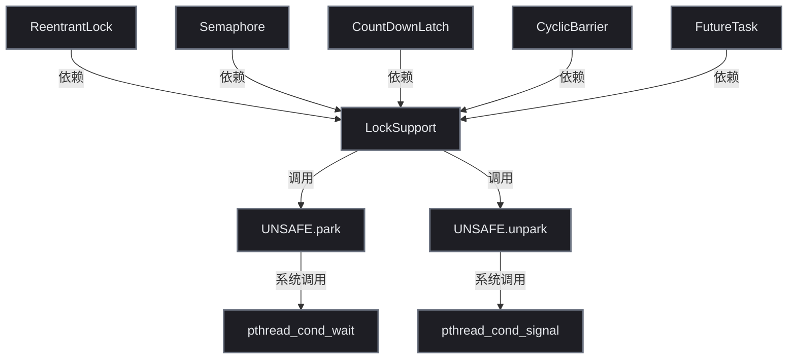
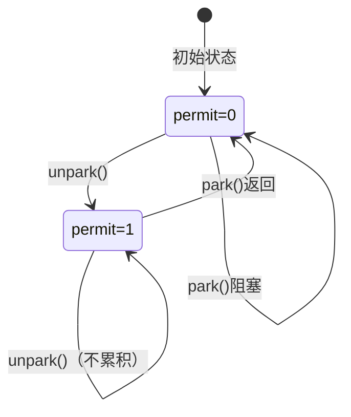
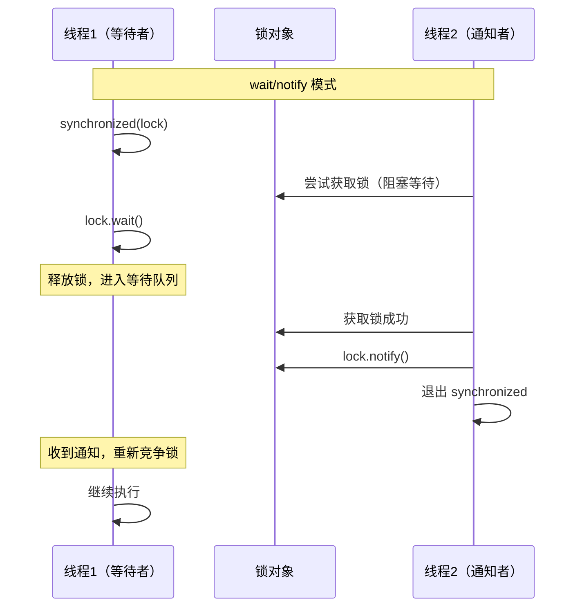
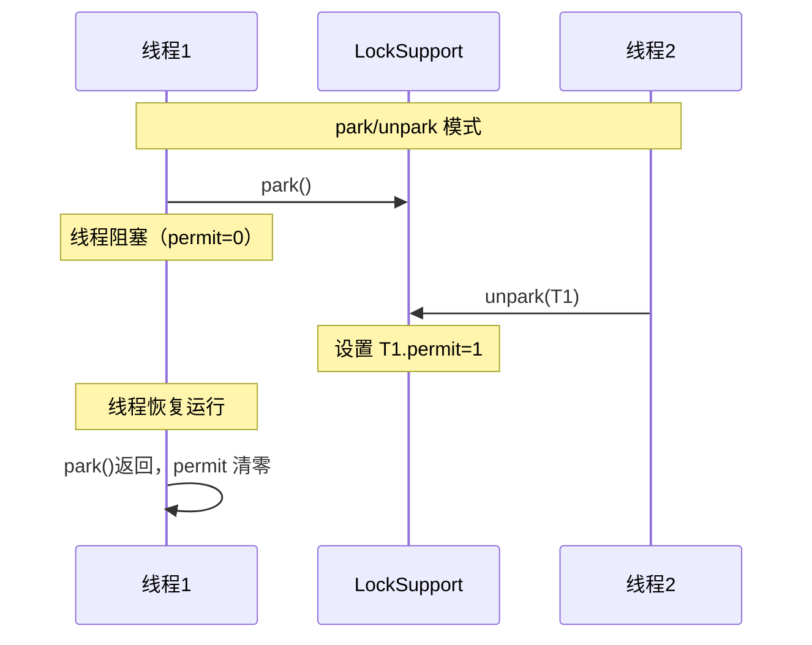
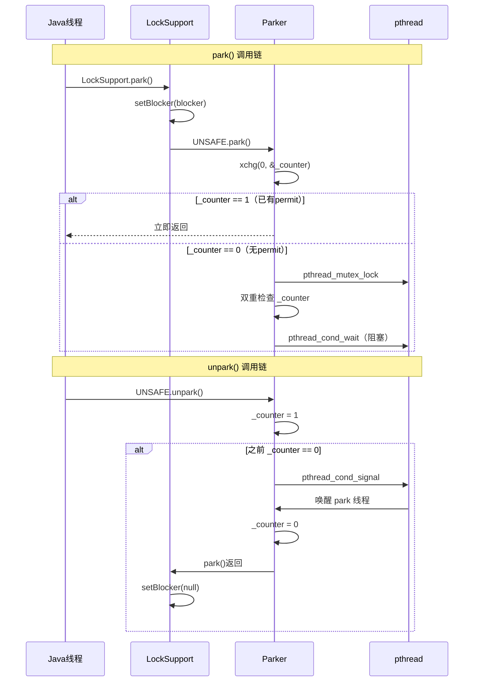
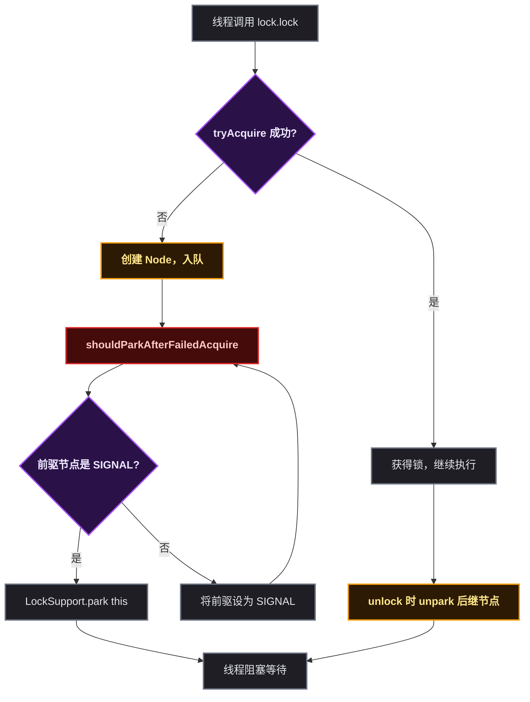
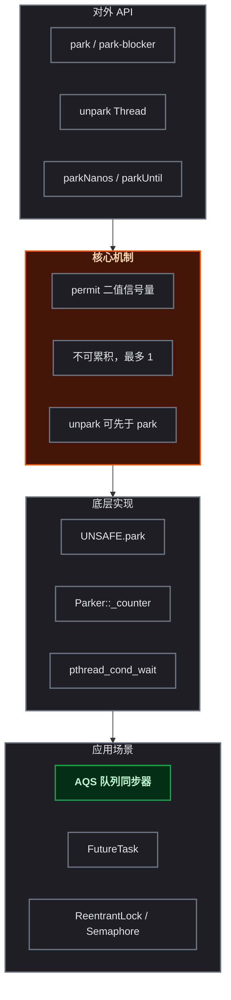

# LockSupport 深度解析

## 🤔 道格·李为什么需要一个比 wait/notify 更可靠的阻塞原语

在 `java.util.concurrent` 诞生之前，Java 线程阻塞/唤醒的唯一手段是 `Object.wait()` 和 `Object.notify()`。每个 Java 程序员都知道这两件事：第一，必须在 `synchronized` 块里调用；第二，`notify()` 如果在 `wait()` 之前调用，信号就丢了，线程永远醒不过来。

道格·李在构建 AQS 时遇到了一个棘手的问题：AQS 的 `acquire()` 是先尝试获取锁，失败了再 `park()`。但线程可能在 `tryAcquire` 失败和 `park()` 之间被 `unpark()`——如果 `park()` 没有"许可证记忆"能力，这个 `unpark()` 就白调了，线程永久阻塞。这和 `wait/notify` 的丢信号问题是同源的。

更麻烦的是，`wait/notify` 必须配合 `synchronized` 使用，而 AQS 内部用的是 CAS——如果为了调 `wait()` 还要加一层 `synchronized`，性能和设计都会变成灾难。

道格·李需要一个**更底层的线程阻塞原语**，满足三个条件：`unpark()` 可以先于 `park()` 调用（许可证语义，不像 `notify` 必须后于 `wait`）、不需要配合 `synchronized` 监视器锁、直接调用操作系统的线程挂起/恢复能力。

这就是 `LockSupport` 的诞生背景。它基于二值信号量（permit）——每个线程有且仅有一个 permit（0 或 1），`park()` 消费 permit（没有则阻塞），`unpark()` 生产 permit（最多为 1）。这一设计让 AQS 的 `acquire()` / `release()` 有了可靠的线程调度基础。

## 🅿️ LockSupport 是什么

`LockSupport` 是 `java.util.concurrent.locks` 包下的一个基础工具类，提供线程阻塞（park）和唤醒（unpark）的能力。它不依赖对象监视器（Monitor），直接通过 `Unsafe` 类调用操作系统原语实现线程的挂起和恢复。

它的定位是 JUC 框架的 **基础设施** ：AQS（AbstractQueuedSynchronizer）、ReentrantLock、Semaphore、CountDownLatch 等所有 JUC 同步组件，底层都依赖 `LockSupport` 来管理线程的阻塞与唤醒。



## 核心 API

`LockSupport` 对外暴露的 API 非常精简，核心只有 3 个方法：

| 方法 | 说明 |
|------|------|
| `LockSupport.park()` | 阻塞当前线程，直到被 unpark 或被中断 |
| `LockSupport.park(Object blocker)` | 同上，额外记录阻塞原因（用于调试） |
| `LockSupport.unpark(Thread thread)` | 唤醒指定线程 |

```java
// 最简单的使用
Thread t = new Thread(() -> {
    System.out.println("线程即将被阻塞");
    LockSupport.park();          // 阻塞在这里
    System.out.println("线程被唤醒");
});
t.start();

Thread.sleep(1000);
LockSupport.unpark(t);           // 1 秒后唤醒
```

## ⚙️ 核心机制：permit（许可）

### 📝 permit 的定义

`LockSupport` 内部使用一个 **二值信号量** （permit，许可证）来控制线程的阻塞与唤醒。每个线程 **有且仅有一个** permit，取值只有 0 或 1：

- permit = 0：线程没有"通行证"，调用 `park()` 会阻塞
- permit = 1：线程持有"通行证"，调用 `park()` 立即返回并消耗掉 permit（重置为 0）



### ✨ permit 的 4 个核心特性

**（1）不可累积** ：permit 最多只有 1 个。连续调用多次 `unpark()`，效果等同于一次。

```java
LockSupport.unpark(t);  // permit 变为 1
LockSupport.unpark(t);  // permit 仍然是 1，不会变为 2
LockSupport.unpark(t);  // 还是一样
t.park();               // 返回，permit 消耗为 0
t.park();               // 阻塞！因为没有更多 permit 了
```

**（2）可预先发放** ：`unpark()` 可以在 `park()` 之前调用，permit 会被保存。

```java
LockSupport.unpark(t);  // 先发放 permit
// ... 任意时间之后 ...
t.park();               // 立即返回，不需要真正阻塞
```

**（3）park() 不释放 permit** ：`park()` 返回后 permit 被清零，不存在"带 permit 继续运行"的状态。

**（4）可响应中断但不会抛异常** ：`park()` 被中断后会立即返回，但 **不抛出 `InterruptedException`** 。需要通过 `Thread.interrupted()` 自行检测。

```java
// park 响应中断的正确写法
while (!condition) {
    LockSupport.park();
    if (Thread.interrupted()) {  // 自行检测中断状态
        // 处理中断逻辑
        break;
    }
}
```

## 与 wait/notify 的对比

这是面试中的高频问题。两者的核心差异：

| 维度 | wait/notify | park/unpark |
|------|------------|------------|
| **依赖** | 必须持有对象监视器（synchronized） | 无依赖，直接使用 |
| **顺序敏感性** | 必须 wait 先于 notify，否则死锁 | unpark 可以先于 park 调用 |
| **唤醒目标** | notify 随机唤醒一个，notifyAll 全部唤醒 | unpark 精准唤醒指定线程 |
| **permit 累积** | 不累积，丢失的 notify 无效果 | 最多累积 1 个 permit |
| **中断处理** | 抛出 InterruptedException | 返回但不抛异常，需自行检测 |
| **条件等待** | 必须在循环中用条件判断 | 同样需要循环判断（虚假唤醒） |





park/unpark 不依赖锁，调用顺序更灵活，这是它能成为 JUC 基础设施的根本原因。

## 🚧 阻塞调试：park(Object blocker)

`park(Object blocker)` 重载方法接受一个 blocker 对象，用于记录线程被阻塞的 **原因** 。这个信息会出现在线程 dump 中：

```java
// 不带 blocker — 线程 dump 看不到原因
LockSupport.park();

// 带 blocker — 线程 dump 可以看到阻塞原因
LockSupport.park(aqsNode);  // "parking to wait for <...>"
```

当使用 `jstack` 或直接获取线程 dump 时，带 blocker 的 park 会输出类似：

```
"thread-1" #13 prio=5 WAITING
  java.lang.Thread.State: WAITING (parking)
       at sun.misc.Unsafe.park(Native Method)
       at java.util.concurrent.locks.LockSupport.park(LockSupport.java:304)
       - parking to wait for  <0x00000007c2a1e4a0> (a java.util.concurrent.locks.AbstractQueuedSynchronizer$ConditionObject)
```

`<0x...>` 就是 blocker 对象的地址。在 AQS 中，blocker 通常是代表等待节点的 Node 对象，这让线上排查死锁/活锁问题时能 **快速定位阻塞根源** 。

## 📖 底层源码实现

### 入口层：LockSupport.java

```java
// jdk/src/share/classes/java/util/concurrent/locks/LockSupport.java

public static void park(Object blocker) {
    Thread t = Thread.currentThread();
    setBlocker(t, blocker);   // ① 记录 blocker
    UNSAFE.park(false, 0L);   // ② 调用 native 方法
    setBlocker(t, null);      // ③ 醒来后清除 blocker
}

public static void unpark(Thread thread) {
    if (thread != null)
        UNSAFE.unpark(thread); // 直接调用 native
}
```

关键点：
- `setBlocker` 使用 `UNSAFE.putObject` 直接写入 `Thread.parkBlocker` 字段（volatile 不可见，这里靠 native 的 CAS 保证）
- `park` 的两个参数：`isAbsolute=false` 表示相对时间，`time=0L` 表示无限等待
- blocker 的 set/clear 包裹 park 调用，保证醒来后 dump 信息不会残留旧值

### 🏗️ JVM 层：Parker 结构体

`UNSAFE.park` 进入 JVM 后在 `os_posix.cpp` 中实现，核心数据结构是 **Parker** ：

```cpp
// hotspot/src/share/vm/runtime/park.hpp
class Parker : public os::PlatformParker {
private:
    volatile int _counter;   // ① 相当于 permit，0 或 1
    Parker *  FreeNext;      // ② 空闲链表指针（复用机制）
    JavaThread * AssociatedWith; // ③ 关联的 Java 线程
public:
    void park(bool isAbsolute, jlong time);
    void unpark();
};
```

关键字段：
- `_counter`：就是 permit 的 C++ 实现。0 表示无许可，1 表示有许可。`unpark()` 将其设为 1，`park()` 检测到 1 则减为 0 并立即返回
- `FreeNext`：Parker 对象有缓存复用机制，释放的 Parker 放入空闲链表
- `AssociatedWith`：每个 Parker 绑定一个 Java 线程（通过 Thread 对象的 `_parker` 字段关联）

### 🔄 核心流程：Linux 下的 park/unpark

```cpp
// os_posix.cpp（简化）
void Parker::park(bool isAbsolute, jlong time) {
    // ① 先检查 _counter：如果已经是 1，直接消耗并返回
    if (Atomic::xchg(0, &_counter) == 1) return;

    // ② _counter 为 0，需要真正阻塞
    Thread* thread = Thread::current();

    pthread_mutex_lock(&_mutex);         // ③ 加锁
    if (_counter > 0) {                  // ④ 双重检查（unpark 可能在加锁前发生）
        _counter = 0;
        pthread_mutex_unlock(&_mutex);
        return;
    }

    // ⑤ 条件等待（真正阻塞在这里）
    pthread_cond_wait(&_cond, &_mutex);
    _counter = 0;                        // ⑥ 醒来后清零
    pthread_mutex_unlock(&_mutex);
}

void Parker::unpark() {
    pthread_mutex_lock(&_mutex);
    int s = _counter;
    _counter = 1;                        // ① 设置 permit
    pthread_mutex_unlock(&_mutex);

    if (s == 0) {                        // ② 之前是 0，说明线程可能在阻塞
        pthread_cond_signal(&_cond);     // ③ 唤醒阻塞的线程
    }
}
```



整个流程的关键设计点：

1. `xchg` 原子交换：park 的第一步用原子操作检查 `_counter`，如果是 1 则 **不需要加锁就返回** ，这是无竞争时的快速路径（fast path）
2. 双重检查：在 `pthread_mutex_lock` 之后再次检查 `_counter`，防止在加锁间隙期间 `unpark` 已经设置了 permit
3. `pthread_cond_wait` 副作用：它会 atomically 释放 mutex 并阻塞，醒来后重新持有 mutex，保证 `_counter` 操作的线程安全

## 虚假唤醒

**虚假唤醒** （Spurious Wakeup）是指线程在没有收到 `unpark()` 调用的情况下，从 `park()` 中返回。这是操作系统层面的行为，JDK 无法消除。

正确的使用模式是 **在循环中调用 park** ：

```java
// 正确写法：循环检查条件
while (!canProceed()) {
    LockSupport.park();
}

// 配合中断处理
while (!canProceed()) {
    LockSupport.park();
    if (Thread.interrupted()) {
        throw new InterruptedException();
    }
}
```

AQS 源码中正是这样使用的：

```java
// AbstractQueuedSynchronizer.java
final boolean acquireQueued(final Node node, int arg) {
    boolean failed = true;
    try {
        boolean interrupted = false;
        for (;;) {
            final Node p = node.predecessor();
            if (p == head && tryAcquire(arg)) {
                setHead(node);
                p.next = null;
                failed = false;
                return interrupted;
            }
            // 循环中调用 park，处理虚假唤醒
            if (shouldParkAfterFailedAcquire(p, node) &&
                parkAndCheckInterrupt())           // ← park 在这里
                interrupted = true;
        }
    } finally {
        if (failed)
            cancelAcquire(node);
    }
}
```

## 🏛️ AQS 中的实际应用

AQS 是 LockSupport 的最大用户。以 `ReentrantLock` 竞争失败为例：



## ❓ 面试高频问题汇总

| 问题 | 答案要点 |
|------|---------|
| park/unpark 和 wait/notify 的区别？ | 无需 synchronized、unpark 可先于 park、精准唤醒、permit 不累积 |
| unpark 调用多次，park 能返回多次吗？ | 不能，permit 最多为 1，不累积 |
| park 被中断会抛异常吗？ | 不会，返回但不抛 InterruptedException，需自行检测 |
| park(Object blocker) 的作用？ | 线程 dump 时显示阻塞原因，方便排查 |
| 实际在哪些场景中使用？ | AQS 中等待获取锁、Condition 的 await、FutureTask 中等待结果 |
| 虚假唤醒是什么？如何解决？ | 线程无 unpark 自行苏醒，必须在循环中调用 park 并检查条件 |

## 🛠️ 日常开发中的常用方法

| 方法 | 用途 | 频率 |
|------|------|------|
| `LockSupport.park()` | 阻塞当前线程 | 高 |
| `LockSupport.park(Object)` | 阻塞并记录原因 | 高 |
| `LockSupport.unpark(Thread)` | 唤醒指定线程 | 高 |
| `LockSupport.parkNanos(long)` | 定时阻塞（纳秒） | 中 |
| `LockSupport.parkUntil(long)` | 阻塞到指定时间点 | 中 |
| `LockSupport.getBlocker(Thread)` | 获取线程的 blocker 对象 | 低 |

```java
// 场景 1：实现简单的互斥开关
class BooleanLatch {
    private volatile boolean triggered;

    public void await() {
        while (!triggered) {
            LockSupport.park(this);
            if (Thread.interrupted()) {
                Thread.currentThread().interrupt();
                return;
            }
        }
    }

    public void signal() {
        triggered = true;
        LockSupport.unpark(Thread.currentThread()); // 简化示例
    }
}

// 场景 2：带超时的等待
Thread t = new Thread(() -> {
    long deadline = System.nanoTime() + TimeUnit.SECONDS.toNanos(5);
    LockSupport.parkUntil(deadline); // 最多等 5 秒
    System.out.println("超时或被唤醒");
});
```

## 🎯 总结



| 关键点 | 一句话总结 |
|--------|-----------|
| 定位 | JUC 框架的线程阻塞基础设施 |
| 核心 | permit（二值信号量），每个线程一个，最多为 1 |
| 优势 vs wait/notify | 无序依赖锁、unpark 可先执行、精准唤醒 |
| 注意 | 需循环使用防止虚假唤醒，中断不抛异常需自行检测 |
| 底层 | UNSAFE → Parker::_counter → pthread_cond_wait/signal |
