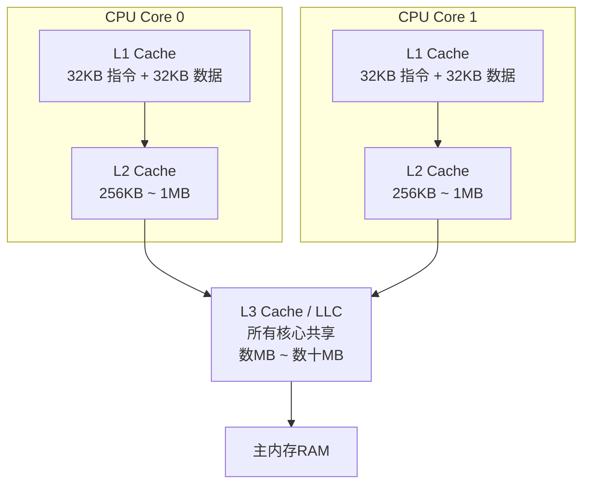
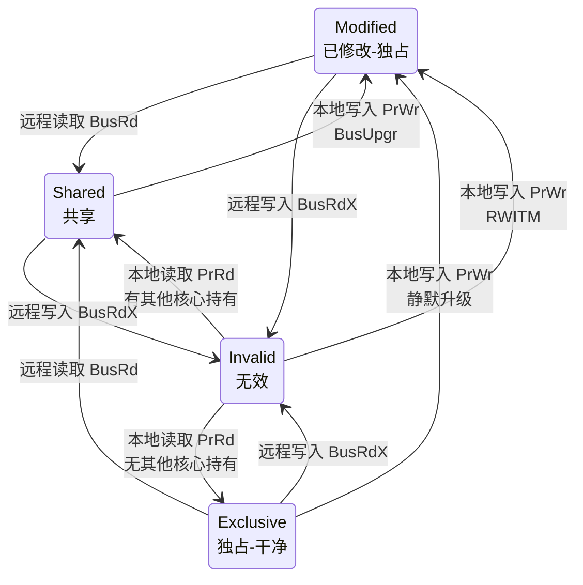
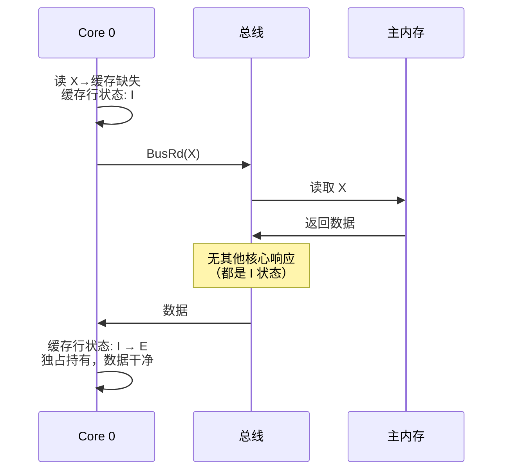
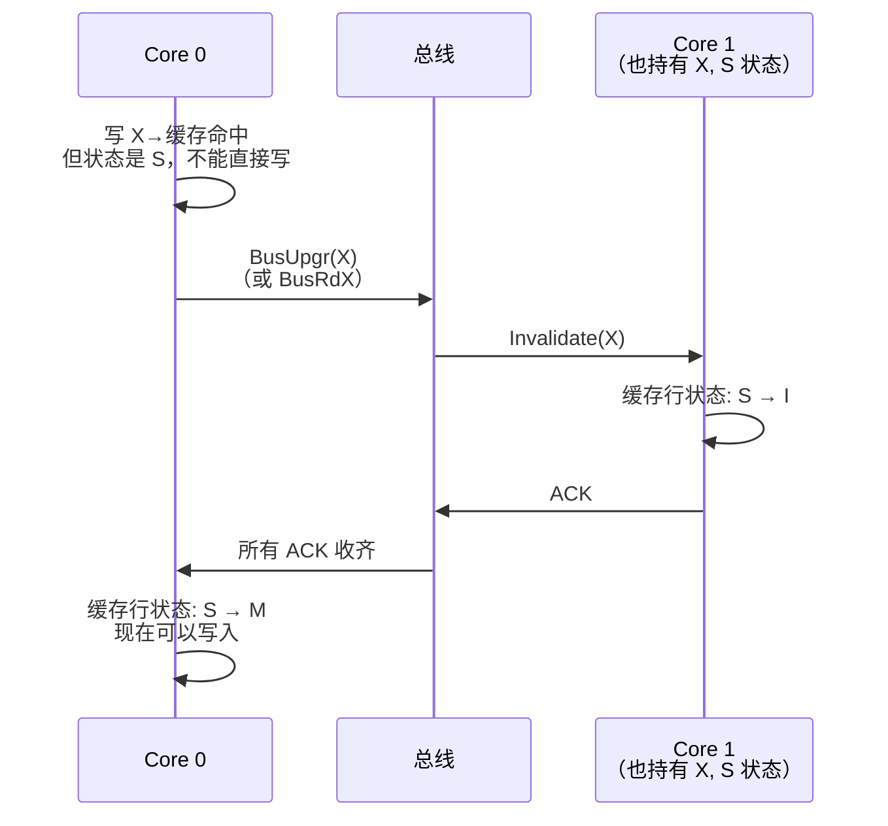
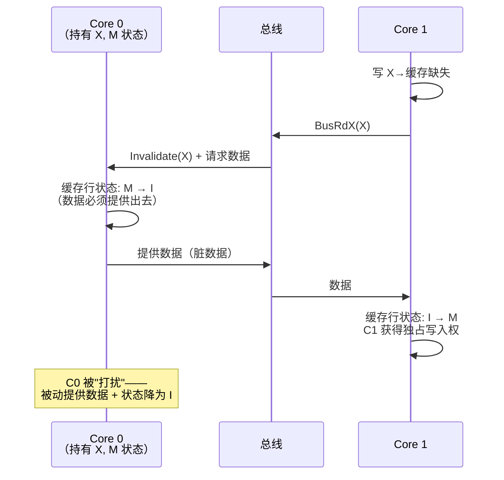
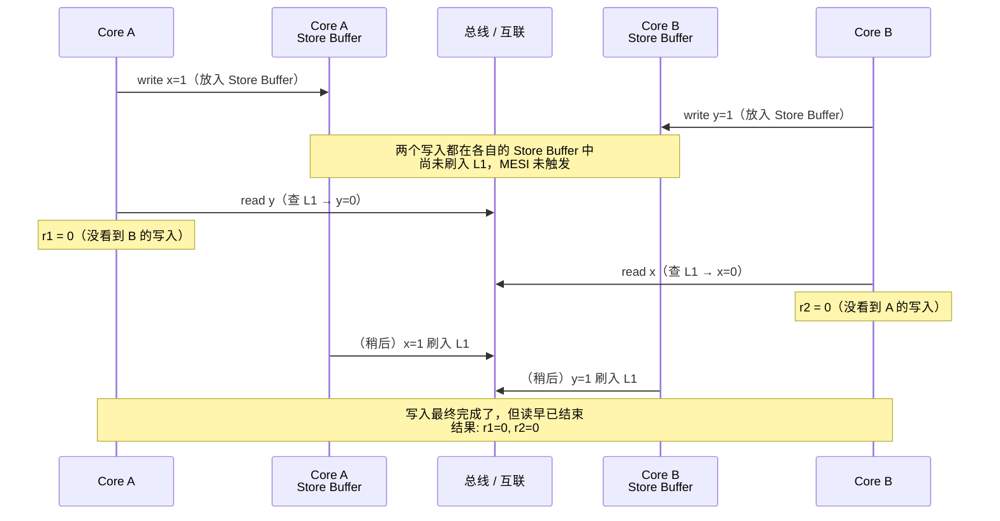
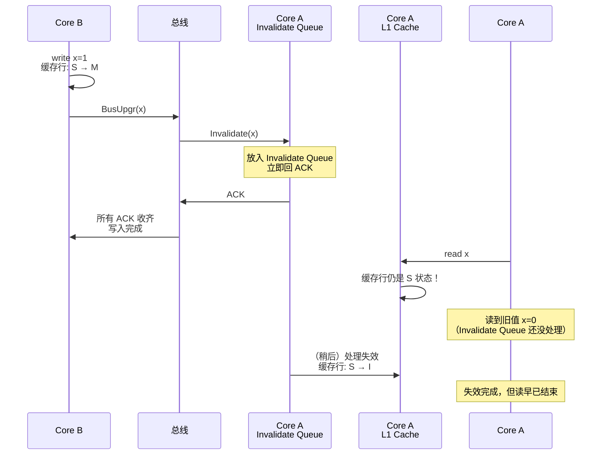
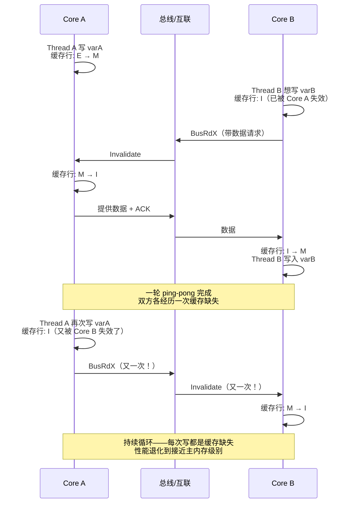
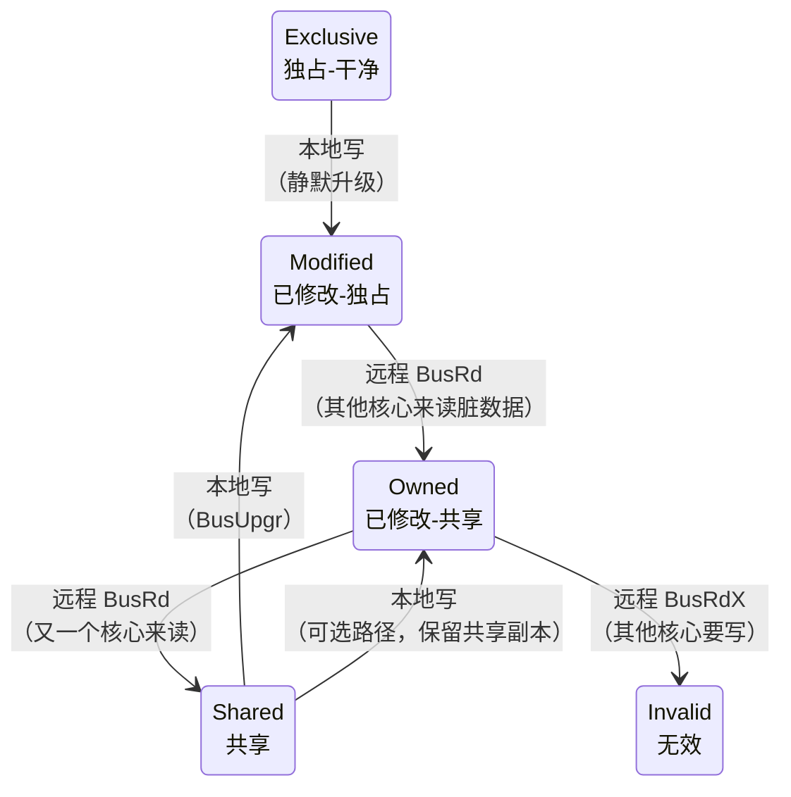
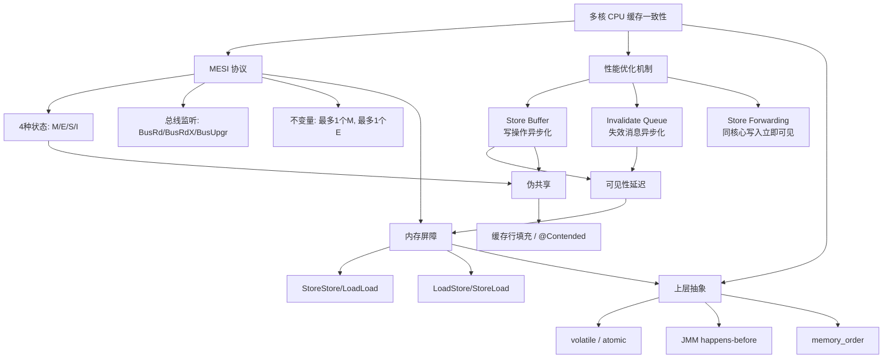

# MESI 缓存一致性协议

## 🤔 一、问题切入：两个线程写共享变量为什么出错

先看一段代码：

```java
public class Counter {
    private static int count = 0;

    public static void main(String[] args) throws InterruptedException {
        Thread t1 = new Thread(() -> {
            for (int i = 0; i < 10000; i++) count++;
        });
        Thread t2 = new Thread(() -> {
            for (int i = 0; i < 10000; i++) count++;
        });

        t1.start();
        t2.start();
        t1.join();
        t2.join();

        System.out.println("count = " + count);  // 期望 20000，实际 < 20000
    }
}
```

两个线程各执行 10000 次 `count++` ，直觉上最终 `count` 应该是 20000，但实际运行结果总是小于 20000。原因有两个层面：

- **Java 层面** ： `count++` 不是原子操作（读-改-写三步，线程不安全）
- **硬件层面** ：即使把 `count++` 变成原子操作，多核 CPU 的缓存机制本身也会导致一个核心的写入对另一个核心 **延迟可见** （不是立即可见）

第一个层面可以用 `synchronized` 或 `AtomicInteger` 解决。第二个层面是硬件问题——CPU 为了性能，不会让每次写入都立即同步到主内存。这个"延迟可见"的根因，就是 **CPU 缓存一致性协议** （Cache Coherence Protocol）要管理的范畴。MESI 是其中最经典、使用最广泛的实现。

在深入 MESI 之前，先明确缓存一致性到底保证什么：

1. 对同一地址的写操作 **最终** 对所有核心可见
2. 所有核心对同一地址的写操作有一个 **全局一致的顺序** （serialization）

它不是"所有核心时刻看到完全相同的值"——电信号传递本身有延迟，那是不可能的。它保证的是：给定足够时间，一致性一定会达成。

## 🏗️ 二、CPU 缓存层级结构

### 💾 2.1 三级缓存布局

现代多核 CPU 的缓存分为三级。L1/L2 每个核心私有，L3 所有核心共享：



关键点：

- **L1/L2 私有** ：每个核心独享，速度最快但容量最小。MESI 协议主要在 L1 这一层执行（L2/L3 也参与，但状态机逻辑集中在 L1）
- **L3 共享** ：也称为 LLC（Last Level Cache），所有核心通过环形总线或 mesh 网络访问
- L1 通常分为 **L1I** （指令缓存）和 **L1D** （数据缓存），MESI 只管理 L1D——指令缓存是只读的，不需要一致性协议

各级缓存的延迟量级（x86 典型值，3GHz）：

| 存储层级 | 延迟（CPU 周期） | 延迟（纳秒） | 相对比例 |
|---------|:---:|:---:|:---:|
| L1 Cache | 4 ~ 5 | ~1.3 ~ 1.6 ns | 1x |
| L2 Cache | 12 ~ 14 | ~4 ~ 4.7 ns | ~3x |
| L3 Cache / LLC | 40 ~ 50 | ~13 ~ 17 ns | ~10x |
| 主内存 RAM | 100 ~ 300 | ~33 ~ 100 ns | ~25x ~ 60x |

### 📐 2.2 包含策略与 MESI 的关系

L1/L2/L3 之间的数据包含关系直接影响 MESI 状态如何在层级间传播：

| 策略 | 含义 | 对 MESI 的影响 | 代表厂商 |
|------|------|--------------|---------|
| **Inclusive** （包含） | L3 包含 L2 的所有行，L2 包含 L1 的所有行 | L3 需要跟踪每个核心持有哪些行；L3 中某行被驱逐时，必须向 L1/L2 发送 Back-Invalidate，强制上层也驱逐该行 | Intel |
| **Exclusive** （独占） | 数据在某一级缓存中只出现一次 | L1 驱逐时数据下沉到 L2；L2 驱逐时下沉到 L3。MESI 状态随数据一起迁移 | AMD |
| **NINE** （非包含非独占） | 灵活策略，允许部分包含 | 折中，降低 Invalidate 风暴 | 部分 ARM |

以 Intel 的 Inclusive 策略为例：当 Core 0 的 L1 中某缓存行从 M 变为 I（被其他核心的写操作失效），这个状态变化需要向上传播——L2 中的对应行也要标记为 I，L3 中的目录信息也要更新。

### 🏗️ 2.3 Write-Back：MESI 存在的前提

缓存的写入策略有两种：

| 策略 | 行为 | 与 MESI 的关系 |
|------|------|--------------|
| **Write-Through** （写穿透） | 写入 L1 的同时直接写入下一级缓存/内存 | 缓存与内存始终一致，不需要 M 状态——没有"缓存比内存新"的情况 |
| **Write-Back** （写回） | 只写入缓存，标记为 dirty，驱逐时才写回内存 | 可能出现缓存与内存不一致，M 状态正是用来追踪这种情况 |

现代 CPU 全部使用 Write-Back。如果使用 Write-Through，每次写操作都直达内存，多核缓存的"不一致"问题根本不会出现——但性能会退化到近乎不可用。Write-Back 是性能优化的选择，而 MESI 是为了让 Write-Back 在多核下正确工作而引入的代价。

## 🏗️ 三、缓存行结构

### 💾 3.1 为什么以缓存行为单位

CPU 不以字节为单位管理缓存，而是以 **缓存行** （Cache Line，CPU 缓存中数据管理的最小单位）为最小单位。一个缓存行通常为 **64 字节** （x86/x64；ARM 可选 64 或 128 字节）。

原因有三：

- **空间局部性** （Spatial Locality）：程序访问一个地址后，大概率会访问相邻地址，一次加载 64 字节命中率更高
- **管理开销** ：如果每个字节独立追踪 MESI 状态，状态位的存储开销将远大于数据本身
- **总线效率** ：一次总线事务传输 64 字节比传输 1 字节只略慢一点

Linux 内核中定义了缓存行大小的常量：

```c
// include/linux/cache.h
#define L1_CACHE_SHIFT      CONFIG_X86_L1_CACHE_SHIFT  // x86 默认为 6
#define L1_CACHE_BYTES      (1 << L1_CACHE_SHIFT)       // 1 << 6 = 64 字节

// 缓存行对齐宏
#define ____cacheline_internodealigned_in_smp \
    __attribute__((__aligned__(1 << L1_CACHE_SHIFT)))
```

关键点： `L1_CACHE_SHIFT` 为 6，左移 6 位就是 64。 `____cacheline_internodealigned_in_smp` 利用 GCC 的 `aligned` 属性强制变量按 64 字节对齐——这正是后文"伪共享修复"的底层实现基础。

### 💾 3.2 物理地址到缓存行的映射

```
物理地址（以 48 位虚拟地址为例）：
┌──────────────────────────┬──────────────┬───────────┐
│          Tag             │   Set Index  │  Offset   │
│       (高位比特)          │  (组索引)    │ (行内偏移) │
└──────────────────────────┴──────────────┴───────────┘
```

- **Offset** （6 bit， `2^6 = 64` ）：64 字节缓存行内的字节偏移
- **Set Index** ：组相连映射中的组号（如 8 路组相连，每组 8 行）
- **Tag** ：剩余的高位比特，用于匹配——同一组内 8 行中哪一行是目标地址

### 💾 3.3 缓存行的元数据

每个缓存行除了 64 字节数据本体，还附带状态元数据：


| 元数据字段 | 比特数 | 作用 |
|-----------|:---:|------|
| Tag | ~40 bit（取决于物理地址宽度和 set 数） | 匹配地址，判断缓存是否命中 |
| MESI State | 2 bit | 00=I, 01=S, 10=E, 11=M |
| Valid | 1 bit | 该行是否有效（I 状态时 Valid=0） |
| Dirty | 1 bit | 数据是否被修改过（与 M 状态关联，写回时判断） |
| LRU/替换 | 3 ~ 5 bit | 替换策略（伪-LRU、RRIP 等），决定驱逐哪一行 |

<span style="color:red">MESI 的核心就是管理那 2 bit 的状态字段</span>——什么时候从 00 变成 10，什么时候从 10 变成 01，都有严格的规则。下面展开这四种状态。

## 🏗️ 四、MESI 四种状态

MESI 这个名字来自四种状态的首字母： **M**odified（已修改）、**E**xclusive（独占-干净）、**S**hared（共享）、**I**nvalid（无效）。这四种状态描述的是 **某一个缓存行在某一核心的缓存中的当前状态** 。不同核心对同一地址的缓存行可能有不同的状态，但它们的组合受到协议约束。

### 🔢 4.1 状态总览



### 📌 4.2 Modified（已修改 / 脏独占）

| 属性 | 值 |
|------|-----|
| 数据与主内存 | **不一致** ——缓存中的数据更新 |
| 独占性 | **只有本核心持有** |
| 本地读 | 直接读，无总线操作 |
| 本地写 | 直接写，无总线操作 |
| 被驱逐时 | **必须先写回主内存** （Write-Back），不能直接丢弃 |
| 收到远程 BusRd | 提供数据给请求方，状态降为 S |
| 收到远程 BusRdX | 提供数据给请求方，状态降为 I |

M 状态是唯一允许"缓存与内存不一致"的状态。持有 M 状态的核心是数据当前的"所有者"——如果其他核心要读这份数据，本核心必须提供数据（缓存到缓存传输），同时将自己的状态降级为 S。

### 📌 4.3 Exclusive（独占-干净）

| 属性 | 值 |
|------|-----|
| 数据与主内存 | **一致** |
| 独占性 | **只有本核心持有** |
| 本地读 | 直接读，无总线操作 |
| 本地写 | 直接写， **静默升级为 M** ——无需任何总线事务 |
| 被驱逐时 | 可以直接丢弃（因为内存中有相同数据） |

E 状态的价值在于 **E → M 是零成本写入路径** ——本核心是唯一持有者，不需要通知任何人。CPU 在读取数据时会尽量以 E 状态获取：如果后续要写，省去一次总线事务。

### 📌 4.4 Shared（共享-干净）

| 属性 | 值 |
|------|-----|
| 数据与主内存 | **一致** |
| 独占性 | **可能多个核心同时持有** |
| 本地读 | 直接读，无总线操作 |
| 本地写 | 必须先发 **BusUpgr** 或 **BusRdX** 失效其他副本， **有总线开销** |
| 被驱逐时 | 可以直接丢弃 |

S 状态是"最拥挤"的状态——要写必须先通知所有其他持有者。相比之下 E 状态要安静得多：独占时写入零开销。

### 📌 4.5 Invalid（无效）

| 属性 | 值 |
|------|-----|
| 数据与主内存 | 无关——缓存行不可用 |
| 独占性 | 无关 |
| 本地读 | 触发 **读缺失** （Read Miss），发起总线请求 |
| 本地写 | 触发 **写缺失** （Write Miss），发起 RWITM |
| 被驱逐时 | 无关（本来就是无效的） |

I 状态是默认状态——刚上电时所有缓存行都是 I。被其他核心的写入失效后也会进入 I。

### 🔢 4.6 状态不变量

对于同一个内存地址，它在所有核心的缓存中的 MESI 状态必须满足以下不变量：

| 规则 | 说明 |
|------|------|
| 最多一个核心处于 **M** | 否则两个核心同时修改，写冲突 |
| 最多一个核心处于 **E** | 独占性定义 |
| 可以有 0 到 N 个核心处于 **S** | N 为核心总数 |
| **M 和 E 不可共存** | 两者都是独占，不能同时出现 |
| 如果存在 M 或 E，不能存在任何 S | 独占与共享互斥 |

## 🔢 5️⃣ 五、总线操作与状态转换

### 📌 5.1 两类触发源

MESI 的状态转换由两类事件触发：

- **本地操作** ：本核心的读（PrRd, Processor Read）或写（PrWr, Processor Write）
- **总线事件** ：snoop（监听）到其他核心的总线请求

每个核心的缓存控制器持续 **监听总线** （Bus Snooping），观察其他核心发起的请求。如果请求的地址恰好命中本核心缓存的某一行，缓存控制器会根据 MESI 协议作出响应：提供数据、失效自己的副本、或改变自己的状态。

### 📌 5.2 四种总线操作

| 操作 | 全称 | 触发场景 | 含义 | 是否需要数据 |
|------|------|---------|------|:---:|
| **BusRd** | Bus Read | 某核心读缺失 | 读取一个缓存行，不打算修改 | 是 |
| **BusRdX** | Bus Read Exclusive | 某核心写缺失 | 读取一个缓存行并计划修改——同时失效所有其他副本。也称为 RWITM（Read With Intent To Modify） | 是 |
| **BusUpgr** | Bus Upgrade | 某核心写命中 S 状态行 | 失效所有其他副本，但不需要数据（本核心已有） | 否 |
| **Flush / WriteBack** | Write Back | 驱逐 M 状态行 | 将脏数据写回主内存 | 是（写回） |

**BusRd 与 BusRdX 的核心区别** ：BusRd 是"我只想读"，不影响其他副本的状态（除了可能让某个 E 降级为 S）。BusRdX 是"我要写"，会把其他所有核心的对应缓存行强制置为 I。

**BusUpgr 与 BusRdX 的区别** ：BusRdX 既要数据又要失效别人（写缺失场景——缓存中没有数据，先读后改）。BusUpgr 只要失效别人（写命中 S 状态场景——已经持有数据，只需要升级权限）。BusUpgr 比 BusRdX 省一次数据传输。

### 🔄 5.3 核心转换流程详解

下面用三个典型场景的时序图来展示状态转换的完整过程：

#### 场景一：I → E（独占读取）

Core 0 首次读取地址 X，没有其他核心持有 X：



关键点：Core 0 发现没有任何其他核心响应 BusRd，说明自己是唯一持有者，因此获得了 **E** 状态。后续如果要写 X，可以直接 E → M 静默升级，零总线开销。

#### 场景二：S → M（共享写入升级）

Core 0 持有 X（S 状态），现在要写 X：



关键点：S → M 必须经过总线事务。即使数据已经在缓存中，也必须通知所有其他持有 S 的核心失效。这次 BusUpgr 的开销是 S 状态写入比 E 状态写入慢的根本原因——前者需要 1 次失效广播 + N 个 ACK，后者是零开销。

#### 场景三：M → S → I（脏数据被驱逐的全过程）

Core 0 持有 X（M 状态），Core 1 要写 X：



关键点：M → I 是被动触发但开销不低——本核心必须立即提供脏数据，可能停顿几个到几十个周期。这也是为什么一个核心长时间持有 M 状态可以提高性能：没有其他核心来"打扰"。

### 🔢 5.4 全部状态转换汇总

| 转换 | 触发 | 总线操作 | 其他核心的响应 | 开销等级 |
|------|------|---------|--------------|:---:|
| I → E | 本地读，无其他核心持有 | BusRd | 无（所有核心对应行都是 I） | 中 |
| I → S | 本地读，有其他核心持有 | BusRd | 持有 M/E/S 的核心提供数据，持有 E 的降为 S | 中 |
| I → M | 本地写 | BusRdX / RWITM | 所有其他核心将对应行置为 I | 高 |
| E → M | 本地写命中 | **无** | 无——没有任何其他核心持有 | **零** |
| E → S | 远程 BusRd 命中本核心的 E 行 | 本核心提供数据 | 双方都进入 S | 低（被动） |
| E → I | 远程 BusRdX 命中本核心的 E 行 | 本核心提供数据 | 本核心失效，请求方进入 M | 低（被动） |
| S → M | 本地写命中 | BusUpgr 或 BusRdX | 所有其他持有 S 的核心置为 I | 中 |
| S → I | 远程 BusRdX 命中 | 无（本核心只监听） | 本核心置为 I，请求方进入 M | 极低（被动） |
| M → S | 远程 BusRd 命中 | 本核心提供脏数据 | 双方进入 S，数据可能写回 | 中（被动） |
| M → I | 远程 BusRdX 命中 | 本核心提供脏数据 + 写回 | 本核心失效，请求方进入 M | 高（被动） |

最关键的三个洞察：

1. **E → M 是唯一的零成本写入路径** ：CPU 会尽量让缓存行处于 E 状态（通过 BusRd 而不是 BusRdX 读取），为后续可能的写入保留最低成本的升级路径
2. **S → M 比 E → M 多了一次 BusUpgr** ：这就是多线程共享数据写入慢的根本原因——每次写都要发失效信号。"伪共享"会展开这个问题的极端情况
3. **M → I 是被动触发但开销不低** ：持有 M 状态的核心被"打扰"时，必须立即提供脏数据并写回

### ⚙️ 5.5 监听机制的实现方式

缓存一致性协议通过 **总线监听** （Bus Snooping）实现。每个核心的缓存控制器持续监视总线上的请求。实现方式有两种：

| 实现方式 | 原理 | 适用场景 | 优缺点 |
|---------|------|---------|--------|
| **Snooping Bus** （监听总线） | 所有核心共享一条物理总线，每个核心看到所有请求 | 核心数少的系统（≤8） | 简单，但总线带宽成为瓶颈 |
| **Directory-Based** （目录协议） | 用中央目录记录每个缓存行被哪些核心持有，只向相关核心发送失效消息 | 大规模多路系统（>8核） | 节省带宽，但目录本身有存储和查询开销 |

现代 CPU 实际使用的方案：

- **x86 消费级** （Ring Bus，环形总线）：每个核心挂载在环上，消息沿环传递。Intel 从 Sandy Bridge 开始使用 Ring Bus 连接所有核心和 LLC 分片
- **x86 服务器级** （Mesh）：Intel Skylake-SP 及之后使用二维 mesh 网络，每个核心和 LLC 分片是 mesh 中的一个节点，本质属于分布式目录
- **AMD** ：Infinity Fabric，使用目录协议实现 CCX（Core Complex）内和跨 CCX 的一致性

## 6️⃣ 六、Store Buffer——缓存一致性的"裂缝"

### 📦 6.1 为什么需要 Store Buffer

MESI 协议下，写操作有时需要等总线事务完成。以 S → M 为例，必须先发 BusUpgr，等所有其他核心确认失效（ACK）后才能完成写入。这个过程可能消耗几十个 CPU 周期。CPU 的设计者不会让核心停等——引入了 **Store Buffer** 📦 （写缓冲，CPU 核心私有的异步写入队列）：

```
CPU Core 执行写入流程：
  1. 将写操作（地址 + 数据）放入 Store Buffer（FIFO 队列）
  2. CPU 继续执行下一条指令（不等待 MESI 完成）
  3. Store Buffer 异步等待 MESI 协议获取缓存行所有权
  4. 获取所有权后，将数据写入 L1 Cache
  5. 写入 L1 时触发 MESI 状态转换（E/S → M）
```

<span style="color:red">Store Buffer 是每个核心私有的</span>，不同核心的 Store Buffer 互相不可见。核心 A 的 Store Buffer 里有什么，核心 B 完全不知道。

### 📌 6.2 Store Forwarding（存储转发）

同一个核心的后续读操作需要看到自己之前（尚未刷入 L1）的写入，否则单线程程序都会出错。硬件通过 **Store Forwarding** （存储转发，同一核心内读操作先从 Store Buffer 查找匹配地址的机制）解决：

```
核心 A 执行：
  write x = 1;        // 写入进入 Store Buffer，尚未到 L1
  read x;             // CPU 先从 Store Buffer 找到 x=1，直接返回
                      // 如果 Store Buffer 中没有，再去 L1 查找
```

Store Forwarding 让同一核心始终看到自己的最新写入，但它 **无法让其他核心看到这些写入** ——数据还在核心 A 的 Store Buffer 里，根本没到缓存，MESI 协议无从发挥作用。

### ❓ 6.3 Store Buffer 导致的可见性问题

```java
// 初始: x = 0, y = 0（两个变量在不同的缓存行）
//
// 核心 A:                核心 B:
//   write x = 1;           write y = 1;
//   r1 = read y;           r2 = read x;
//
// 可能结果: r1 = 0, r2 = 0  ← 两个核心的读都没看到对方的写
```

这个结果让很多人困惑：两个核心都写了值，但对方的读都没看到。原因正是 Store Buffer：



<span style="color:red">根本原因：Store Buffer 让写操作在 MESI 协议完成之前就对本地可见了（通过 Store Forwarding），但对远程不可见。</span>这破坏了程序员直觉中的"顺序一致性"。

### 🔄 6.4 Store-Load 重排序

同一个核心内部，写后读也可能出问题：

```
初始: x = 0, y = 0

核心 A:
  write x = 1;   // 进入 Store Buffer
  read y;        // 查 L1，y = 0
                 // x = 1 还在 Store Buffer 中
                 // 从外部看：先读了 y(=0)，然后 x 才写完
                 // 而核心 B 可能在这个间隙中做了 write y = 1
```

| 可见性问题 | 产生原因 | Store Buffer 的角色 |
|-----------|---------|-------------------|
| 跨核心写可见性延迟 | 写入在 Store Buffer 中未刷入 L1，MESI 未触发 | 延迟了 MESI 失效信号的发出 |
| Store-Load 重排 | 写操作延迟提交，读操作直接走 L1，读可能在写生效前完成 | 创造了"写比读慢"的执行假象 |

要解决这两个问题，必须在需要的时候 **强制刷新 Store Buffer** （等待所有 pending 写入完成）。这就是 **内存屏障** 🚧 （Memory Barrier / Fence）的由来。

## 7️⃣ 七、Invalidate Queue——另一个"裂缝"

### 📥 7.1 为什么需要 Invalidate Queue

当核心 A 发起 BusRdX 写某个地址时，它需要通过总线向所有其他核心发送 Invalidate 消息。收到消息的核心需要：

1. 在自己的缓存中查找该地址对应的缓存行
2. 将该行的状态改为 I
3. 发送 ACK 确认消息给核心 A

在大型多核系统中，一个核心可能有几十 MB 的 L2/L3 缓存，查找一个地址需要时间。如果让发送方等待所有接收方都真正完成失效再继续，延迟太高。硬件优化：先把 Invalidate 消息放进 **Invalidate Queue** 📥 （失效队列，CPU 核心私有的异步失效消息缓冲区），立即回 ACK，然后异步处理：

```
收到 Invalidate 消息的处理：
  1. 将消息放入 Invalidate Queue（极快，几乎零延迟）
  2. 立即发送 ACK 确认（不等实际失效完成）
  3. 在后续的某个时刻，从 Invalidate Queue 中取出消息
  4. 真正将对应缓存行置为 I
```

和 Store Buffer 一样，Invalidate Queue 是每个核心 **私有的** 。

### ❓ 7.2 Invalidate Queue 导致的可见性问题

```
初始: x = 0，Core A 的缓存持有 x（S 状态），Core B 的缓存也持有 x（S 状态）

Core B:                          Core A:
  write x = 1;                    read x;
  （BusUpgr → 向 Core A 发 Invalidate）
                                  ↓
                                  收到 Invalidate → 放入 Invalidate Queue
                                  ↓
                                  立即 ACK → Core B 收到 ACK，认为完成了
                                  ↓
                                  （Core A 的 Invalidate Queue 还没处理！）
                                  read x → 查 L1 → x 仍是 S 状态（有效！）
                                  → 读到旧值 x = 0
                                  ↓
                                  （稍后）处理 Invalidate Queue → 缓存行置为 I
                                  → 但已经读完了，为时已晚
```



<span style="color:red">Invalidate Queue 让失效操作变得"异步"</span>——发送方收到了 ACK，以为所有核心的副本都已失效，但接收方可能还没真正处理。在这个间隙中，接收方的读操作仍然能命中"即将失效但还没失效"的缓存行。

### 📥 7.3 Store Buffer + Invalidate Queue 的组合效应

两个机制叠加在一起，形成了现代多核 CPU 中所有内存可见性问题的根源：

| 组合问题 | 机制 | 结果 |
|---------|------|------|
| 核心 A 写，核心 B 读不到 | A 的写入在 Store Buffer + B 的 Invalidate Queue 还没处理 | 经典的单向可见性问题 |
| A 写 x=1 读 y=0；B 写 y=1 读 x=0 | 双方写入都在 Store Buffer，双方的读都没看到对方的写 | Store Buffer 导致的"对称不可见" |
| A 先写 x=1 再写 y=1，B 看到 y=1 但 x=0 | A 的 x 写入还在 Store Buffer，y 先刷入了 L1 | Store Buffer 的 FIFO 非即时性造成的写-写重排假象 |

可以得出一个关键结论： **MESI 协议本身保证了缓存状态的一致性，但 Store Buffer 和 Invalidate Queue 的存在让这个一致性出现了"时间窗口" ** ——在窗口内，一致性尚未达成，读操作可能看到过时数据。

## 🚧 八、内存屏障——填补"裂缝"的机制

### 📌 8.1 四种内存屏障

Store Buffer 和 Invalidate Queue 都是为了性能而存在的。大多数时候程序不需要关注它们。但在需要跨线程通信时，必须强迫它们"对齐"：

| 屏障类型 | 做什么 | 解决什么问题 | 硬件实现（x86） |
|---------|------|------------|:---:|
| **StoreStore** | 等待 Store Buffer 中此前的写入全部完成，再允许后续写入进入 Store Buffer | 写-写重排：后写的值先被其他核心看到 | `sfence` 或隐式保证 |
| **LoadLoad** | 等待 Invalidate Queue 中此前的失效全部处理，再允许后续读操作 | 读-读重排：后面的读先完成，读到旧值 | `lfence` 或隐式保证 |
| **LoadStore** | 等待此前的读完成后，再允许后续写进入 Store Buffer | 读-写重排：写先于读生效 | `mfence` 或隐式保证 |
| **StoreLoad** | 先等待 Store Buffer 清空，再等待 Invalidate Queue 清空 | 写-读重排：这是最重的屏障，同时清空两个队列 | `mfence` 或 `lock` 前缀指令 |

<span style="color:red">StoreLoad 是四种屏障中开销最大的</span>——它必须同时清空 Store Buffer 和 Invalidate Queue，涉及的等待周期最长。在 x86 上， `mfence` 指令的执行延迟约为 33 ~ 100 个 CPU 周期。

### 🔧 8.2 Linux 内核中的内存屏障实现

Linux 内核为不同架构提供了统一的内存屏障宏。x86 架构下的实现：

```c
// arch/x86/include/asm/barrier.h
#define mb()        asm volatile("mfence":::"memory")   // 全屏障（StoreLoad）
#define rmb()       asm volatile("lfence":::"memory")   // 读屏障（LoadLoad）
#define wmb()       asm volatile("sfence":::"memory")   // 写屏障（StoreStore）

// 编译期屏障（仅禁止编译器重排，不生成 CPU 指令）
#define barrier()   asm volatile("":::"memory")
```

逐行解释：
- `mb()` ：全屏障， `mfence` 指令同时清空 Store Buffer 和 Invalidate Queue，是最重的屏障
- `rmb()` ：读屏障， `lfence` 确保此前所有的读操作在后续读之前完成
- `wmb()` ：写屏障， `sfence` 确保 Store Buffer 中此前的写入全部刷入 L1 后才允许后续写入
- `"memory"` clobber：告诉编译器内存可能被修改，禁止编译器跨屏障重排内存访问指令

### 📌 8.3 HotSpot JVM 中的内存屏障

HotSpot 在 Linux x86 上通过 `lock` 前缀指令实现全屏障：

```cpp
// hotspot/src/os_cpu/linux_x86/orderAccess_linux_x86.inline.hpp
inline void OrderAccess::fence() {
    // 使用 lock addl 而不是 mfence——在 Intel 处理器上更高效
    __asm__ volatile ("lock; addl $0,0(%%rsp)" : : : "memory");
}

inline void OrderAccess::loadload() {
    // x86 保证 Load-Load 有序，无需显式屏障
    compiler_barrier();
}
```

逐行解释：
- `lock; addl $0,0(%%rsp)` ： `lock` 前缀锁住总线（或缓存锁）， `addl $0` 是一个对栈顶的无操作加法，实际效果是清空 Store Buffer 并等待所有 pending 失效完成。之所以不用 `mfence`，是因为 Intel 处理器上 `lock addl` 的延迟更低
- `loadload()` ：x86 的 TSO 模型保证 Load-Load 有序，只需编译期屏障（防止编译器重排）即可
- 这段代码就是 Java 中 `volatile` 写操作在 x86 上的最终硬件实现——JVM 在 `volatile` 写之后插入 `StoreLoad` 屏障，而 `StoreLoad` 屏障在 x86 上就是这段 `lock addl` 汇编

### 📊 8.4 不同 CPU 架构的差异

不同的 CPU 架构对上述重排序的"容忍度"不同，因此所需的显式屏障也不同：

| 重排序类型 | x86（TSO 模型） | ARM / RISC-V（弱内存模型） |
|:---|:---:|:---:|
| Load-Load 重排 | 不允许（天然有序） | **允许** ——需要 `dmb` / `fence` |
| Store-Store 重排 | 不允许（天然有序） | **允许** ——需要屏障 |
| Load-Store 重排 | 不允许（天然有序） | **允许** ——需要屏障 |
| Store-Load 重排 | **允许** ——需要 `mfence` / `lock` | **允许** ——需要屏障 |

x86 的 TSO（Total Store Order）属于"强内存模型"，只开了 Store-Load 一个口子。ARM 属于"弱内存模型"，四个口子全开。这也是为什么在 ARM Mac（Apple Silicon）上跑未适配的 Java 应用时，有时会暴露 x86 上看不到的并发 bug。

### 🏗️ 8.5 内存屏障如何利用 MESI

以 x86 上最重的 StoreLoad 屏障为例， `lock addl $0, 0(%rsp)` 的执行过程：

```
lock addl $0, 0(%rsp) 的执行过程：
  1. lock 前缀锁住总线（或使用缓存锁协议——锁住缓存行而非整条总线）
  2. 等待 Store Buffer 中的所有写入完成（刷入 L1）
  3. 这些写入触发 MESI 状态转换（S/E → M，通过 BusUpgr/BusRdX 失效其他核心的副本）
  4. 其他核心的缓存行被置为 I
  5. 解锁总线
  6. 后续的读操作会看到最新数据（读缺失 → 从总线或缓存到缓存传输获取最新值）
```

关键链路：<span style="color:red">锁指令 → 清空 Store Buffer → MESI 状态转换（失效传播）→ 其他核心缓存行进入 I → 后续读触发缓存缺失 → 获得最新值</span>。

这就是整个硬件层"可见性"的完整链条。上层语言的内存模型（C++ 的 `std::atomic`、Java 的 `volatile`、Rust 的 `Ordering` ）本质上都是在这一链条上封装了一层抽象，让开发者不用手写 `mfence` 。

## 9️⃣ 九、伪共享

### 📌 9.1 成因

缓存行的 64 字节粒度是性能优化的选择，但也带来了副作用。如果两个线程各自频繁写入不同的变量，而这两个变量碰巧落在同一个缓存行内，就会引发 **伪共享** （False Sharing，多个线程无关联地访问不同变量但因它们落在同一缓存行而触发的缓存一致性开销）：

```
缓存行（64 字节）：
┌───────────────────────┬───────────────────────┬──────────────────┐
│   variable A (8 字节)  │   variable B (8 字节)  │      ...         │
└───────────────────────┴───────────────────────┴──────────────────┘
           ↑                         ↑
    Thread A 频繁写             Thread B 频繁写
    （只关心 A）                （只关心 B）
```

虽然 A 和 B 在逻辑上毫不相关，但因为它们共享同一个缓存行：

1. Thread A 写 A → Core A 的缓存行进入 M → Core B 的缓存行被置为 I
2. Thread B 想写 B → 缓存行在 Core B 为 I → 写缺失 → BusRdX → Core A 的缓存行被置为 I
3. Thread A 再次写 A → 缓存行又失效了 → 又触发 BusRdX
4. 反复循环——每次写都是一次缓存缺失

### 🔄 9.2 MESI 视角下的伪共享流程



### ⚡ 9.3 性能影响量化

| 场景 | 每次写入的 MESI 操作 | 总线事务 | 相对延迟 |
|------|------|:---:|:---:|
| 无伪共享（E → M） | 无 | 无 | ~1 周期 |
| 无伪共享（S → M，首次） | BusUpgr | 1 次失效广播 | ~20 ~ 50 周期 |
| **伪共享（反复 ping-pong） ** | BusRdX + Invalidate | 每次写都需要 | ~50 ~ 200 周期/次写 |

在紧密循环中（如多线程更新相邻的计数器），伪共享可以让吞吐量下降 **5 ~ 10 倍** 。这不是锁竞争导致的，纯粹是 MESI 缓存一致性协议的开销。

### 📌 9.4 检测与修复

**Linux 上的检测工具** ： `perf c2c` （Cache-to-Cache）可以分析 HITM（Hit Modified）事件——当一个核心的读命中另一个核心的 M 状态行时，说明存在伪共享。HITM 计数越高，伪共享越严重。

```bash
perf c2c record ./my_program
perf c2c report
```

**Java 中的修复** ：

```java
// JDK 8: 手动填充——用无用的 long 字段占满 64 字节
public class PaddedCounter {
    public volatile long value = 0;
    long p1, p2, p3, p4, p5, p6, p7;  // 7 × 8B = 56B padding
    // value (8B) + padding (56B) = 64B = 一个缓存行
}

// JDK 9+: @Contended 注解（需要添加 JVM 参数 -XX:-RestrictContended）
@jdk.internal.vm.annotation.Contended
public class Counter {
    public volatile long value = 0;
}
```

**C/C++ 中的修复** ：

```cpp
// C11/C++11: alignas 说明符确保变量独占一个缓存行
struct alignas(64) PaddedCounter {
    std::atomic<long> value{0};
};
```

**实际案例** ：JDK 的 `Striped64` 类（`LongAdder` 的父类）内部使用 `@Contended` 注解在 `Cell` 类上，防止不同线程在更新不同桶的计数器时产生伪共享。 `ConcurrentHashMap` 的内部计数器也受益于此。

## 🏗️ 十、MESI 的变体

MESI 是基础版本。实际 CPU 实现中各有扩展，以应对不同的工程取舍。

### 📌 10.1 MOESI（AMD）

AMD 在 MESI 的基础上增加了 **O（Owned） ** 状态： **dirty + shared** 。数据被修改过，本核心是"所有者"负责写回，但也允许其他核心持有 S 状态副本。

O 状态的价值：M → S 转换（其他核心来读脏数据）时不需要立即写回内存——持有 O 状态的核心继续保留脏数据的所有权，其他核心用 S 状态持有只读副本。当该行最终被驱逐时，只有 O 状态的核心负责写回，减少了不必要的内存写入。



MOESI 下 O 状态承担的职责：M 是"脏 + 独占"，O 是"脏 + 共享"。两者都表示数据比内存新，但独占性不同。

### 🏗️ 10.2 MESIF（Intel）

Intel 在 Nehalem 架构之后使用 MESIF，增加了 **F（Forward） ** 状态：特殊的 S 状态——多个 S 副本中只有 **一个** 被指定为 F，负责在 BusRd 时转发数据。

F 状态解决的问题：当多个核心都是 S 状态时，一个 BusRd 请求过来，如果所有核心同时响应，总线竞争和功耗都很大。F 状态指定一个"发言人"，只有它响应 BusRd，其他 S 状态的核心保持静默。

```
MESIF 中的 BusRd 处理（接力棒传递）：
  BusRd 命中多个 S 状态副本
    → 只有 F 状态的核心提供数据
    → 不产生额外的总线冲突
    → 提供数据的 F 核心变为 S
    → 请求方变为新的 F（"接力棒"传递给了最新访问者）
```

这个设计利用了 **时间局部性** ：最近访问过某缓存行的核心，大概率还会再次访问。让新访问者成为 F，下次它需要转发时可以快速响应。

### 📌 10.3 MSI——去掉 E 的简化版

MESI 需要 2 bit 追踪四种状态。在一些面积或功耗敏感的嵌入式场景中，MSI 简化了状态编码：

| 状态 | MSI 中 | 与 MESI 的区别 |
|------|--------|--------------|
| M | ✓ 保留 | 相同：已修改-独占 |
| S | ✓ 保留 | 合并了 E 的语义——第一次读取直接进 S |
| I | ✓ 保留 | 相同：无效 |
| E | **不存在** | 被合并到 S 中 |

没有 E 状态的代价：第一次读后即使独占，状态也是 S。后续写必须发 BusUpgr（而 MESI 下可以 E → M 静默升级）。对于单线程占主导的工作负载，这次额外的 BusUpgr 是浪费的。

这就是为什么 x86/x64/ARM 高性能核心都使用完整 MESI 或其变体——E 状态消除了一次常见情况下的不必要总线事务。

### 📊 10.4 变体对比总结

| 状态 | MESI | MOESI（AMD） | MESIF（Intel） | MSI（嵌入式） |
|------|:---:|:---:|:---:|:---:|
| M（已修改-独占） | ✓ | ✓ | ✓ | ✓ |
| E（独占-干净） | ✓ | ✓ | ✓ | — |
| S（共享-干净） | ✓ | ✓ | ✓ | ✓ |
| I（无效） | ✓ | ✓ | ✓ | ✓ |
| O（脏-共享） | — | ✓ | — | — |
| F（转发） | — | — | ✓ | — |

## 🏗️ 十一、MESI 与上层语言内存模型的关系

<span style="color:red">MESI 只解决"缓存数据是否一致"，不解决"指令以什么顺序执行"和"写入何时对别人可见"。</span>

回顾全文，MESI 的核心职责是三件事：

1. 追踪每个缓存行的所有权和有效性（M/E/S/I 四种状态）
2. 通过总线监听机制，在核心之间传递数据（缓存到缓存传输）和失效信号
3. 保证最终一致性——给定足够时间，所有核心会看到相同的值

MESI **不管** 的事情：

- **Store Buffer 导致的写入延迟** ：一个核心的写入多久能被其他人看到，MESI 定了"怎么传播"，但没定"什么时候开始传播"——Store Buffer 推迟了传播的起点
- **Invalidate Queue 导致的失效延迟** ：收到了失效消息多久才真正处理，MESI 没规定
- **指令重排序** ：编译器可以把 `write A; read B` 调成 `read B; write A`；CPU 的乱序执行也可以。MESI 对此毫无概念——它只看到最终抵达缓存的读写序列

上层语言的内存模型（Java 的 JMM、C++ 的 `std::memory_order`、Rust 的 `Ordering` ）就是要在这三件事之上，给程序员一个清晰的契约：什么样的代码在什么样的条件下，多线程之间的数据是一定可见的。

这些语言模型通过 **内存屏障** 🚧 （第八节介绍的四种屏障）来控制 Store Buffer 的刷新时机和 Invalidate Queue 的处理时机，而内存屏障在硬件上的执行又依赖于 MESI 的失效机制。因此：

> **MESI 提供了"可见性如何传播到其他核心"的物理基础。上层语言模型决定"什么时候触发这个传播"和"传播完成之前能做什么"。 **

Java 的 `volatile`、C++ 的 `memory_order_release/acquire`、Rust 的 `Ordering::Release/Acquire`，本质上都是编译器 + CPU 按照上述契约在正确的位置插入内存屏障，而这些屏障最终通过 MESI 的失效传播完成"让其他核心看到"的动作。

## 十二、总结



全文核心要点：

1. **MESI 是缓存行级别的状态机** ：每个缓存行（64 字节）独立追踪自己的 M/E/S/I 状态，2 bit 编码四种状态，不同缓存行之间互不干扰
2. **状态转换由本地操作和总线监听共同驱动** ：本地读写触发请求（PrRd/PrWr），总线监听触发响应（BusRd/BusRdX/BusUpgr），双方共同维护全局一致性
3. **E → M 是唯一的零成本写入路径** ：CPU 会尽量"独占读取"来获取 E 状态，为后续写入保留静默升级的可能。这就是为什么 CPU 用 BusRd（而非 BusRdX）来读取——即使后续可能写，也先拿 E，等真正写的时候再零成本升级
4. **Store Buffer 和 Invalidate Queue 创造了性能，也创造了垃圾** ：两者通过异步化提升了吞吐，但也引入了可见性时间窗口。内存屏障是修复这些窗口的机制——`mfence`/`lock addl` 强制清空 Store Buffer 和 Invalidate Queue
5. **伪共享是 MESI 粒度的负面效应** ：64 字节缓存行导致无关变量互相失效。开发高性能多线程代码时必须关注数据布局，使用缓存行填充或 `@Contended` 隔离热点变量
6. **MESI 是硬件基础设施，上层语言模型在其上构建抽象** ： `volatile` / `atomic` / `synchronized` 等语言特性最终都落实为 MESI 状态转换——中间经过了编译器屏障和 CPU 屏障的翻译层

一个多线程写的共享变量，从 `store` 指令发出到其他核心读到，中间经历了：Store Buffer 排队 → 获取缓存行所有权（MESI 状态转换）→ 失效广播 → Invalidate Queue 排队 → 其他核心的缓存行进入 I → 下次读缺失 → 从总线获取数据。理解这每一步的机制和延迟，才能真正理解 `volatile` 为什么比 `synchronized` 轻， `Atomic` 的 CAS 为什么比锁快，以及伪共享为什么能让高性能代码跪得悄无声息。

| 概念 | 作用层面 | 核心机制 | 解决的问题 | 引入的新问题 |
|------|---------|---------|----------|------------|
| MESI | CPU 缓存 | 4 状态 + 总线监听 | 多核缓存数据一致 | — |
| Store Buffer | CPU 核心私有 | 写操作异步 FIFO | 写操作不用等 MESI 完成 | 跨核心写可见性延迟 |
| Invalidate Queue | CPU 核心私有 | 失效消息异步处理 | 失效处理不阻塞发送方 | 失效不及时，读到旧值 |
| Store Forwarding | CPU 核心内部 | 同核心读先去 Store Buffer 找 | 同核心看到自己的最新写入 | 无（必要机制） |
| 内存屏障 | CPU 指令 | 强制清空 Store Buffer / Invalidate Queue | 修复异步机制导致的可见性问题 | 性能开销（尤其是 StoreLoad） |
| 伪共享修复 | 数据布局 | 缓存行填充 / @Contended | 无关变量互相失效 | 内存占用增加 |
