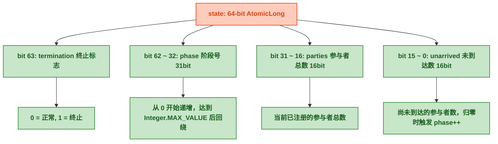
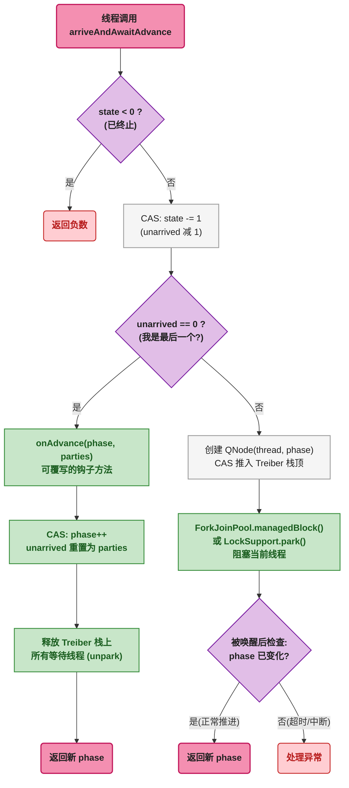
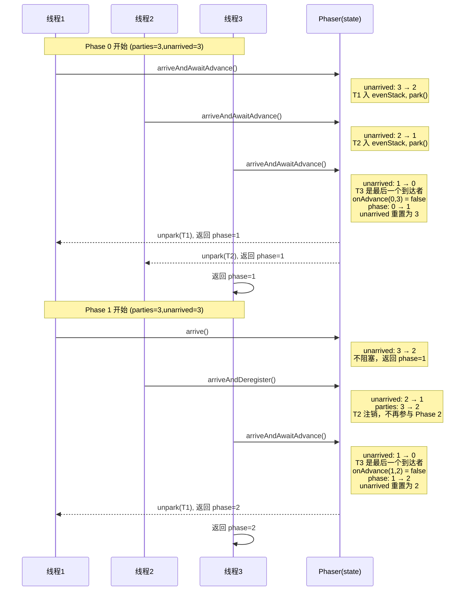
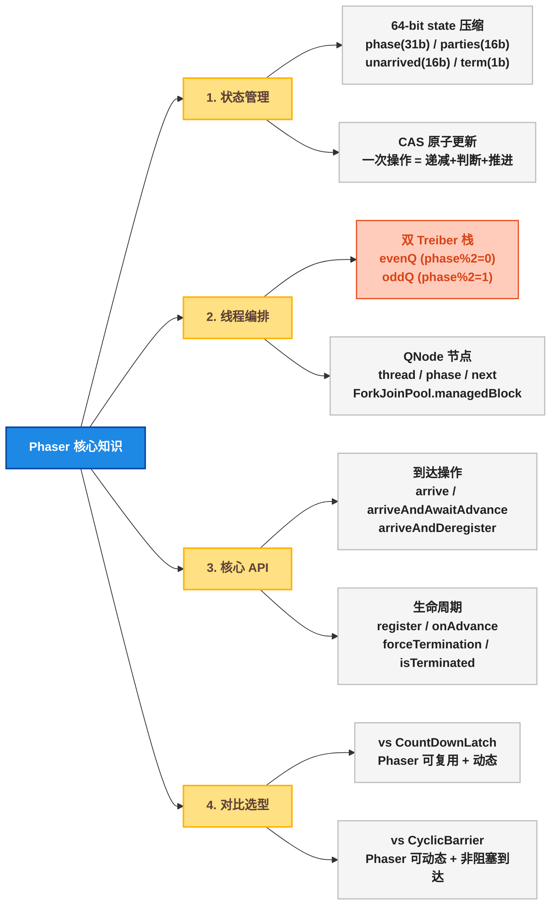

# Phaser 可重用动态线程同步屏障：双栈编排机制、64 位状态字与多阶段调度全解析

## 🤔 一、道格·李为什么需要比 CyclicBarrier 更灵活的屏障

`CountDownLatch` 和 `CyclicBarrier` 分别覆盖了两种同步场景：前者是"一个线程等 N 个线程完成"，后者是"N 个线程彼此等到齐后一起走"。但道格·李在后续实践中发现了一个覆盖盲区：<strong>多阶段计算中，每阶段的参与者数量可能并不相同</strong>。

举个例子：分片计算一个大型数据集，第一阶段 8 个线程并行处理各自的分片；第二阶段某些分片的数据已经为空，对应的线程应该退出，剩下 5 个线程继续；第三阶段可能又加入 2 个新线程处理汇总结果。

`CountDownLatch` 做不到——它是一次性的，三个阶段需要三个实例。

`CyclicBarrier` 也做不到——它的 `parties` 数量在构造时固定，运行期间不能增删参与者。如果有线程中途退出，`CyclicBarrier` 会永远等不到第 N 个线程而永久阻塞（或者触发 BrokenBarrierException）。

道格·李因此在 Java 7 引入了 `Phaser`：一个<strong>支持动态参与者数量 + 多阶段循环使用的同步屏障</strong>。线程可以在运行时通过 `register()` 加入、通过 `arriveAndDeregister()` 退出，`Phaser` 自动调整每轮的等待计数。内部用一个 64 位的 `state` 字段打包了阶段号、已到达计数、未到达计数等所有状态信息，通过 CAS 无锁操作更新——这是 JUC 中最复杂的一个状态字设计。

## 🎚️ 二、Phaser 核心概念（术语定义）

在深入源码前，先明确几个关键术语：

| 术语 | 定义 | 类比理解 |
|------|------|---------|
| **Phase**（阶段号） | 从 0 开始递增的整数，每轮同步完成后 +1 | 表示"第几轮同步" |
| **Party**（参与者） | 注册到 Phaser 中的一个线程/任务 | 需要等待的对象 |
| **Unarrived**（未到达数） | 当前阶段尚未调用 `arrive()` 的参与者数量 | 每到达一个就减 1 |
| **Arrive**（到达） | 线程调用 `arrive()` 表示完成当前阶段工作 | 通知 Phaser"我到了" |
| **Advance**（推进） | 当 `unarrived` 归零时，phase 自增，进入下一轮 | 所有人都到了，开始下一阶段 |
| **Register**（注册） | 增加一个参与者（`parties + 1, unarrived + 1`） | 动态加入 |
| **Deregister**（注销） | 减少一个参与者（`parties - 1, unarrived - 1`） | 动态退出 |
| **Termination**（终止） | Phaser 进入终止态，所有操作立即返回负数 | 强制结束，不再同步 |

## 🏗️ 三、数据结构展开

### 🔢 3.1 64 位状态字：所有信息的原子载体

Phaser 没有使用 AQS，而是直接将全部状态压缩在一个 `AtomicLong`（字段名 `state`）中。这是理解 Phaser 的根基。



**为什么要把 4 个字段塞进一个 long？** 因为 CAS 只能原子地比较并交换**一个**变量。如果将 phase、parties、unarrived 分别存放，那么"递减 unarrived + 判断是否归零 + 推进 phase"这三个操作就无法在一次 CAS 中完成，必须加锁。压缩在一个 long 中后，一次 `compareAndSet(oldState, newState)` 即可原子地完成全部更新。

四个字段的位宽设计也有讲究：

| 字段 | 位宽 | 最大值 | 设计考量 |
|------|:---:|--------|---------|
| `unarrived` | 16 bit | 65535 | 单个 Phaser 最多 65535 个参与者，远超实际需求 |
| `parties` | 16 bit | 65535 | 与 `unarrived` 对齐，register/deregister 时同时增减 |
| `phase` | 31 bit | `Integer.MAX_VALUE` | 足够大，JDK 注释说明回绕后仍能正确处理（利用奇偶性） |
| `termination` | 1 bit | 0/1 | 单独一个 bit，CAS 可精确控制 |

### 📝 3.2 状态字段常量定义（JDK 源码佐证）

从 JDK `Phaser.java` 中截取状态位偏移常量：

```java
// Phaser.java 源码片段（JDK 17）
private static final int  PARTIES_SHIFT   = 16;    // parties 从 bit16 开始
private static final int  PHASE_SHIFT     = 32;    // phase 从 bit32 开始
private static final int  UNARRIVED_MASK  = 0xffff; // 低 16 位全 1
private static final long PARTIES_MASK    = 0xffff0000L; // bit16~31
private static final long TERMINATION_BIT = 1L << 63;   // bit63
private static final long ONE_ARRIVAL     = 1;      // 递减 1
private static final long ONE_PARTY       = 1L << 16;   // 递减 1 个 party
private static final long ONE_DEREGISTER  = ONE_ARRIVAL | ONE_PARTY; // 同时减
```

**关键点**：`ONE_ARRIVAL = 1` 操作低 16 位（unarrived），`ONE_PARTY = 1 << 16` 操作 bit16 ~ 31（parties），`ONE_DEREGISTER = ONE_ARRIVAL | ONE_PARTY` 同时操作两个字段。这里的设计极简——`arrive()` 只需要 `state -= ONE_ARRIVAL`（一次 CAS 减法），`arriveAndDeregister()` 则是 `state -= ONE_DEREGISTER`（同时 -1 到 unarrived 和 parties）。

### 📌 3.3 QNode：Treiber 栈的节点

当线程到达但不是最后一个时，它会被包装成一个 `QNode`，推入 `Treiber` 栈（一种无锁栈，使用 CAS 操作 `top` 指针实现入栈/出栈）中等待：

```java
// Phaser.java 内部类 QNode
static final class QNode implements ForkJoinPool.ManagedBlocker {
    final Phaser phaser;
    final int phase;        // 节点所属的阶段号（用于校验唤醒是否过期）
    final boolean interruptible;
    final boolean timed;
    boolean wasInterrupted;
    long nanos;
    final long deadline;
    volatile Thread thread;  // 被阻塞的线程引用
    QNode next;              // 下一个节点（单链表）

    // ... 构造方法省略
}
```

**关键字段说明**：

| 字段 | 作用 |
|------|------|
| `thread` | 被 `park` 的线程引用，唤醒时通过此字段 `unpark` |
| `phase` | 记录入栈时的阶段号。唤醒后校验：如果当前 phase 已经变了，说明是正常推进唤醒；如果 phase 没变，说明是超时或中断 |
| `next` | 栈的下一个节点。`Treiber` 栈是单链表结构，入栈用 CAS 竞争 `top` 指针 |
| `wasInterrupted` | 中断标志，唤醒后传递给调用方 |

### 📌 3.4 双 Treiber 栈：奇偶分离

Phaser 内部维护了**两个** `Treiber` 栈的栈顶指针，分别用于偶数阶段和奇数阶段：

```java
// Phaser.java 字段（简化）
private final AtomicReference<QNode> evenQ;  // 偶数 phase 的等待栈
private final AtomicReference<QNode> oddQ;   // 奇数 phase 的等待栈
```

**为什么需要两个栈？** 这和 `phase` 的回绕有关。Phase 是一个 31 位的整数，达到 `Integer.MAX_VALUE` 后回绕到 0。如果没有奇偶分离，phase=0 的线程和 phase=2（回绕后的"偶数"）的线程会共用同一个栈，可能出现"旧 phase 线程被错误唤醒"的 ABA 问题。将奇偶分开后，phase=0 的线程在 `evenQ`，phase=1 的线程在 `oddQ`，phase=2 回到 `evenQ`——但此时 phase=0 的线程早已被清空，不会混淆。

### 📌 3.5 整体架构示意图（DrawIO 精确绘图）

下图精确展示了 Phaser 的三大核心组件——状态字、双栈结构、线程到达流程——以及它们之间的交互关系：


图中三个区域分别对应：
- **左侧**：64 位状态字的位域划分，展示了 phase、parties、unarrived 和 termination 在 `AtomicLong` 中的精确位置
- **中间**：偶数栈（绿色）和奇数栈（橙色）的 `Treiber` 链表结构，QNode 串联形成等待队列
- **右侧**：`arriveAndAwaitAdvance()` 的完整决策流程，包括最后一个到达者如何触发 `onAdvance()` 并唤醒栈上所有线程

## 🔄 四、流程逐层深入

### 📋 4.1 核心方法全景

Phaser 暴露给使用者的 API 分为四类：

| 类别 | 方法 | 语义 |
|------|------|------|
| **注册** | `register()` | 增加 1 个 party |
| | `bulkRegister(int)` | 批量增加 N 个 party |
| **到达（非阻塞）** | `arrive()` | 到达但不等待，返回当前 phase |
| | `arriveAndDeregister()` | 到达并注销（parties 减 1） |
| **到达（阻塞等待）** | `arriveAndAwaitAdvance()` | 到达并阻塞，等所有人到齐后返回 |
| | `awaitAdvance(int phase)` | 等待指定 phase 结束（不主动到达） |
| **控制** | `forceTermination()` | 强制进入终止态 |
| | `isTerminated()` | 查询是否已终止 |
| **回调** | `onAdvance(int, int)` | 阶段推进时的钩子方法（可覆写） |

### 🔄 4.2 `arriveAndAwaitAdvance()`：最完整的流程

这是 Phaser 中使用频率最高的方法。下面是它的完整决策流程：



**流程要点**：

1. 每次 `arriveAndAwaitAdvance()` 首先 CAS 递减 `unarrived`（即 `state -= 1`，操作低 16 位）
2. 如果递减后 `unarrived == 0`，说明当前线程是**最后一个到达者**，触发 phase 推进
3. 如果递减后 `unarrived > 0`，说明还有线程没到，当前线程**入栈阻塞**
4. Phase 推进时，最后一个到达者遍历栈链表，**逐一 `unpark` 唤醒**所有等待线程

### 📌 4.3 `arrive()`：非阻塞到达

`arrive()` 是最轻量的操作——只做 CAS 递减 `unarrived`，不阻塞：

```java
// Phaser.java arrive() 核心逻辑（简化）
public int arrive() {
    long s = state;
    int phase = (int)(s >>> PHASE_SHIFT);
    int unarrived = (int)s & UNARRIVED_MASK;
    if (unarrived <= 0)
        throw new IllegalStateException("No unarrived parties");

    // CAS: state -= 1
    long ns = s - ONE_ARRIVAL;
    if (casState(s, ns)) {
        if (unarrived == 1) {  // 我是最后一个?
            ns = state;        // 重新读取（可能已被其他线程修改）
            // 在这里调用 onAdvance 并推进 phase...
        }
        return phase;
    }
    // CAS 失败，自旋重试...
}
```

`arrive()` 和 `arriveAndAwaitAdvance()` 的本质区别只有一处：**`arrive()` 在递减后不调用内部的 `internalAwaitAdvance()`**，直接返回。

### 📌 4.4 `register()` / `arriveAndDeregister()`：动态参与者

`register()` 同时增加 `parties` 和 `unarrived`：

```java
// register() 核心逻辑（简化）
public int register() {
    long s = state;
    int phase = (int)(s >>> PHASE_SHIFT);
    int unarrived = (int)s & UNARRIVED_MASK;

    long ns = s + ONE_ARRIVAL + ONE_PARTY;  // unarrived+1, parties+1
    if (casState(s, ns))
        return phase;
    // CAS 失败则自旋重试...
}
```

`arriveAndDeregister()` 则是递减 `unarrived` **和** `parties`：

```java
// arriveAndDeregister() 使用 ONE_DEREGISTER = ONE_ARRIVAL | ONE_PARTY
long ns = s - ONE_DEREGISTER;  // 同时减 unarrived 和 parties
```

**时序约束**：`register()` 必须在 `arrive()` 之前调用。如果在当前 phase 的最后一个 `arrive()` 之后才 `register()`，新注册的参与者会归入**下一阶段**。

### 📌 4.5 `onAdvance(int phase, int registeredParties)`：阶段推进回调

这是 Phaser 唯一可覆写的方法，也是控制 Phaser 生命周期的**唯一入口**：

```java
// 默认实现
protected boolean onAdvance(int phase, int registeredParties) {
    return registeredParties == 0;  // 没有参与者时自动终止
}
```

**返回值含义**：
- `true` → Phaser 进入终止态，所有等待线程立即被唤醒并收到负数返回值
- `false` → Phaser 继续运行，进入下一阶段

**典型覆写场景**：

```java
// 场景1: 执行固定轮次后自动终止
Phaser phaser = new Phaser(3) {
    @Override
    protected boolean onAdvance(int phase, int registeredParties) {
        return phase >= 2;  // 执行 3 轮 (phase 0/1/2) 后终止
    }
};

// 场景2: 记录每个阶段的耗时
Phaser phaser = new Phaser(3) {
    private long startTime = System.nanoTime();
    @Override
    protected boolean onAdvance(int phase, int registeredParties) {
        if (phase > 0) {
            long elapsed = System.nanoTime() - startTime;
            System.out.println("Phase " + (phase - 1) + " 耗时: " + elapsed + "ns");
            startTime = System.nanoTime();
        }
        return false;
    }
};
```

### 💻 4.6 多线程协作时序示例

以下时序图展示了 3 个线程如何通过 Phaser 完成两阶段同步：



**关键观察**：

1. Phase 0：T1 和 T2 **入栈阻塞**，T3 作为最后一个到达者触发推进并**唤醒**前两个
2. Phase 1：T2 调用 `arriveAndDeregister()`，从 Phase 2 起 `parties` 永久变为 2
3. T1 在 Phase 1 仅用 `arrive()`（非阻塞），因为它不需要等别人——它在 Phase 0 结束时已经在等 T3 了

## 📖 五、底层源码佐证

### 📋 5.1 `doArrive()`：状态递减的核心方法

JDK 中 `arrive()` 和 `arriveAndDeregister()` 的核心逻辑都委托给私有方法 `doArrive(int adjust)`：

```java
// Phaser.java doArrive (JDK 17, 简化)
private int doArrive(int adjust) {
    for (;;) {
        long s = state;
        int phase = (int)(s >>> PHASE_SHIFT);
        int unarrived = (int)s & UNARRIVED_MASK;

        if (unarrived == 0) {
            // 当前 phase 所有人都已到达
            if (phase < 0)
                return phase;  // 已终止
            // 等等...应该在 onAdvance 中推进过 phase 了？
            // 这里的逻辑处理 register() 引发的边界情况
        }

        long ns = s - adjust;
        if (casState(s, ns)) {
            if (unarrived == 1) {
                // 我是最后一个到达者
                ns = state;  // 重新读取最终 state
                // 构造新 state: phase+1, unarrived = parties
                long n = ns & ~UNARRIVED_MASK;  // 清空 unarrived
                n = ((long)phase + 1) << PHASE_SHIFT;
                // ... 处理 parties 变化 ...
                casState(ns, n);  // CAS 推进 phase
                releaseWaiters(phase);  // 唤醒栈上所有等待线程
            }
            return phase;
        }
        // CAS 失败，自旋重试
    }
}
```

**逐段解读**：

| 行号逻辑 | 解释 |
|---------|------|
| `for (;;)` | 无锁自旋，CAS 失败就重试。没有使用 `synchronized` 或 `Lock` |
| `int unarrived = (int)s & UNARRIVED_MASK` | 从 state 低 16 位提取未到达数 |
| `long ns = s - adjust` | `adjust` 是 `ONE_ARRIVAL` 或 `ONE_DEREGISTER`，决定了只减 unarrived 还是同时减 parties |
| `if (unarrived == 1)` | 递减**前**的值为 1，说明递减后归零，当前线程是最后一个到达者 |
| `releaseWaiters(phase)` | 遍历当前 phase 对应的 Treiber 栈，逐一 `LockSupport.unpark(thread)` |

### 📌 5.2 `releaseWaiters()`：唤醒栈上所有等待线程

```java
// Phaser.java releaseWaiters (JDK 17, 简化)
private void releaseWaiters(int phase) {
    QNode q;
    Thread t;
    // 根据 phase 的奇偶性选择对应的栈
    AtomicReference<QNode> head = (phase & 1) == 0 ? evenQ : oddQ;
    // CAS 将栈顶设为 null，一次性摘下整个链表
    q = head.getAndSet(null);

    // 遍历链表，逐一唤醒
    while (q != null) {
        t = q.thread;
        if (t != null) {
            q.thread = null;      // 断开 thread 引用，帮助 GC
            LockSupport.unpark(t); // 唤醒线程
        }
        q = q.next;  // 遍历下一个节点
    }
}
```

**关键点**：`head.getAndSet(null)` 是一次原子操作——把整个链表从栈顶摘下来，栈顶变成 `null`。这行代码之后，即使有新线程尝试入栈（比如 `register()` 新加入的线程），也会推入**全新的**空栈中，不会和正在被唤醒的节点混在一起。

### 🔧 5.3 `internalAwaitAdvance()`：线程阻塞的实现

```java
// Phaser.java internalAwaitAdvance (JDK 17, 简化)
private int internalAwaitAdvance(int phase, QNode node) {
    // 尝试自旋等待（短暂等待，避免昂贵的 park 开销）
    int p;
    while ((p = (int)(state >>> PHASE_SHIFT)) == phase) {
        if (node == null)
            return phase;  // 不可中断模式，简单返回

        // 检查是否已被中断
        if (Thread.interrupted()) {
            node.wasInterrupted = true;
            break;
        }

        // 尝试通过 ForkJoinPool.managedBlock park
        try {
            ForkJoinPool.managedBlock(node);
        } catch (InterruptedException ie) {
            node.wasInterrupted = true;
        }
    }
    return p;
}
```

这里有一个重要设计：**优先使用 `ForkJoinPool.managedBlock()` 而非直接 `LockSupport.park()`**。原因是——如果当前线程恰好是 `ForkJoinPool` 的工作线程，`managedBlock()` 会在 park 期间**补偿一个线程**来继续执行任务，避免 `ForkJoinPool` 因所有工作线程都被 park 而饿死。如果不在 `ForkJoinPool` 环境中，`managedBlock()` 内部会回退到 `LockSupport.park()`。

## 📊 六、Phaser vs CountDownLatch vs CyclicBarrier 全维度对比

三者的能力对比如下：

| 特性 | CountDownLatch | CyclicBarrier | Phaser |
|------|:---:|:---:|:---:|
| **可复用** | 否（一次性） | 是 | 是 |
| **动态参与者数** | 否 | 否 | **是** |
| **到达操作粒度** | `countDown()`（只能 -1） | `await()`（只能 -1） | `arrive()` / `arriveAndDeregister()` / `arriveAndAwaitAdvance()` |
| **阻塞等待** | `await()` | `await()` | `arriveAndAwaitAdvance()` / `awaitAdvance()` |
| **非阻塞到达** | 无 | 无 | `arrive()` |
| **阶段回调** | 无 | `Runnable barrierAction` | `onAdvance(int, int)` |
| **终止控制** | 无（count 到 0 自然结束） | `reset()` / `breakBarrier()` | `forceTermination()` / `onAdvance()` 返回 true |
| **底层同步器** | AQS（共享模式） | `ReentrantLock` + `Condition` | 自研（`AtomicLong` + `Treiber` 栈） |
| **线程中断处理** | `await()` 响应中断 | `await()` 响应中断 + `BrokenBarrierException` | `arriveAndAwaitAdvance()` 响应中断 |
| **最大参与者** | 无上限（state 是 int） | 65535（`ReentrantLock` 限制） | 65535（16 bit 限制） |

**选型建议**：

| 场景 | 推荐工具 | 原因 |
|------|---------|------|
| 主线程等 N 个子线程完成，只需一次 | `CountDownLatch` | 最简单，语义最明确 |
| N 个线程互相等待，固定轮次 | `CyclicBarrier` | 比 Phaser 轻量，`barrierAction` 足够用 |
| N 个线程互相等待，线程数可能动态变化 | **`Phaser`** | 唯一支持动态 participants |
| 需要非阻塞到达（某个线程只通知不等） | **`Phaser`** | `arrive()` 是独有的 |
| 多阶段流水线，每阶段需要回调 | **`Phaser`** | 覆写 `onAdvance()` 即可 |

## 🛠️ 七、日常开发中的常用方法

以下 API 是 `Phaser` 在日常并发编程中的高频使用方法：

| 方法 | 用途 | 频率 |
|------|------|:---:|
| `new Phaser(int parties)` | 创建指定参与者数的 Phaser | 高 |
| `arriveAndAwaitAdvance()` | 到达并等待同阶段所有参与者 | 高 |
| `arrive()` | 非阻塞到达，不等待 | 中 |
| `arriveAndDeregister()` | 到达并注销，不再参与后续阶段 | 中 |
| `register()` | 动态增加一个参与者 | 中 |
| `onAdvance(int phase, int registeredParties)` | 覆写以控制终止条件或记录日志 | 中 |
| `forceTermination()` | 强制终止，唤醒所有等待线程 | 低 |
| `getPhase()` | 查询当前阶段号（调试用） | 低 |
| `getRegisteredParties()` | 查询当前参与者数 | 低 |
| `isTerminated()` | 判断是否已终止 | 低 |

### 🛠️ 7.1 典型用法一：多阶段并行计算

```java
public class MultiPhaseComputation {
    public static void main(String[] args) {
        Phaser phaser = new Phaser(3) {
            @Override
            protected boolean onAdvance(int phase, int registeredParties) {
                System.out.println("Phase " + phase + " 完成，参与者: " + registeredParties);
                return phase >= 2;  // 执行 3 轮后终止
            }
        };

        for (int i = 0; i < 3; i++) {
            final int tid = i;
            new Thread(() -> {
                while (!phaser.isTerminated()) {
                    int phase = phaser.getPhase();
                    doPhaseWork(tid, phase);
                    phaser.arriveAndAwaitAdvance();
                }
            }).start();
        }
    }

    static void doPhaseWork(int tid, int phase) {
        System.out.println("线程" + tid + " 执行阶段 " + phase);
        // 实际业务逻辑...
    }
}
```

### 🛠️ 7.2 典型用法二：动态增减参与线程

```java
public class DynamicParticipants {
    public static void main(String[] args) {
        Phaser phaser = new Phaser(1);  // 主线程先注册

        // 模拟：在处理过程中动态发现需要额外线程
        for (int i = 0; i < 3; i++) {
            phaser.register();  // 动态增加参与者
            final int tid = i;
            new Thread(() -> {
                System.out.println("线程" + tid + " 完成工作");
                phaser.arriveAndDeregister();  // 完成后退出
            }).start();
        }

        // 主线程也完成自己的工作并等待
        phaser.arriveAndAwaitAdvance();
        System.out.println("所有线程完成，当前参与者: " + phaser.getRegisteredParties());
    }
}
```

### 🛠️ 7.3 典型用法三：分层 Phaser（树形结构）

当参与者数量很大时，可以使用父子 Phaser 减少竞争：

```java
public class TieredPhaser {
    public static void main(String[] args) {
        Phaser root = new Phaser(1);

        // 创建 3 个子 Phaser，每个管理 10 个线程
        Phaser[] children = new Phaser[3];
        for (int i = 0; i < 3; i++) {
            root.register();  // 根 Phaser 为每个子 Phaser 注册
            children[i] = new Phaser(root, 10);  // 子 Phaser，父为 root
        }

        // 每个子 Phaser 下挂 10 个线程
        for (int i = 0; i < 3; i++) {
            Phaser child = children[i];
            for (int j = 0; j < 10; j++) {
                new Thread(() -> {
                    doWork();
                    child.arriveAndAwaitAdvance();  // 子级同步
                }).start();
            }
        }

        // 根级同步：所有子 Phaser 完成当前阶段后推进
        root.arriveAndAwaitAdvance();
        System.out.println("所有 30 个线程完成当前阶段");
    }
}
```

分层 Phaser（ `new Phaser(parent, parties)` ）的工作原理：子 Phaser 在 `onAdvance()` 中自动调用父 Phaser 的 `arrive()`。这样父 Phaser 的 `unarrived` 归零时，就意味着所有子 Phaser 的当前阶段都已完成。

## 八、哪些中间件或项目使用了 Phaser

Phaser 在主流的 Java 后端中间件中**确实很少被使用**，这有以下几个原因：

1. **后端请求处理模型通常是"单线程 per request"**——每个请求由独立的线程处理，请求之间不需要互相等待，Phaser 的多线程同步场景在后端不常见
2. **异步编程模型的普及**——`CompletableFuture`、响应式编程（Reactor/RxJava）解决了大部分协调需求
3. **Phaser 的设计偏向计算密集型并行任务**——它的典型场景是 fork-join 风格的分治计算，而非 IO 密集型后端

不过，仍有以下项目和场景中可以看到 Phaser 的使用：

| 项目/场景 | 使用方式 |
|---------|---------|
| **Eclipse Collections**（原 GS Collections） | 在其并行集合操作（`ParallelIterate`）内部使用 Phaser 协调多线程的批处理阶段 |
| **Apache Lucene** | 索引合并（Segment Merging）的某些并行阶段使用 Phaser 进行多线程同步 |
| **自定义 ETL/数据处理管线** | 多阶段数据清洗、格式转换、批量导入等离线处理任务中，Phaser 的多阶段特性非常契合 |
| **并发测试框架** | 在需要精确控制多线程执行时序的单元测试中，Phaser 可用于分阶段调度线程（如：第一阶段所有线程就位 → 第二阶段同时开始 → 第三阶段验证结果） |
| **JCTools**（部分参考） | 虽然未直接使用 Phaser，但其内部的无锁数据结构设计与 Phaser 的 Treiber 栈有相似之处 |

**实际应用场景总结**：Phaser 最适合的场景是"多线程分阶段并行计算 + 线程数可能动态变化"。如果在后端 CRUD 开发中遇到需要 Phaser 的场景，通常说明你的设计可能过度复杂——优先考虑用 `CompletableFuture.allOf()` 或 `CountDownLatch` 替代。

## 🎯 九、总结

### 📐 9.1 核心设计思想

Phaser 的设计可以浓缩为三个关键决策：

1. **状态压缩**：将 phase、parties、unarrived、termination 四个字段压缩在一个 `AtomicLong` 中，用一次 CAS 完成原本需要锁保护的复合操作
2. **双栈奇偶分离**：用两个 `Treiber` 无锁栈分别管理奇偶 phase 的等待线程，避免 phase 回绕导致的 ABA 问题，同时实现了完全无锁的线程阻塞/唤醒机制
3. **`ForkJoinPool.managedBlock` 优先**：在 park 线程时优先使用 `ForkJoinPool.managedBlock()`，确保在 `ForkJoinPool` 环境下不会因所有工作线程被 park 而饿死

### 📌 9.2 知识总览



### 🎯 9.3 一句话总结

`Phaser` 是 JUC 中最灵活但使用频率最低的线程同步器——它用一个 `AtomicLong` 压缩全部状态，用两个 `Treiber` 无锁栈管理线程等待，实现了**可重用、参与者动态增减、支持非阻塞到达**的多阶段同步屏障。在日常开发中，固定参与者的多轮同步优先用 `CyclicBarrier`，一次性的主等子优先用 `CountDownLatch`，只有在需要动态增减参与者或多阶段回调才用 `Phaser`。
