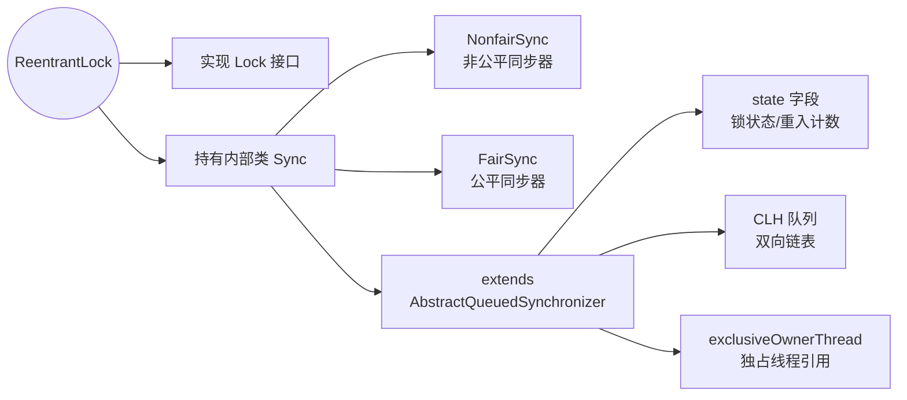
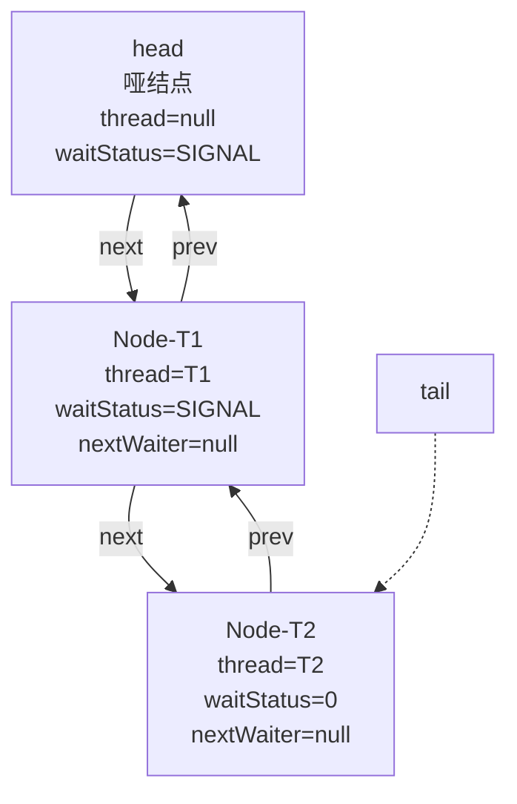
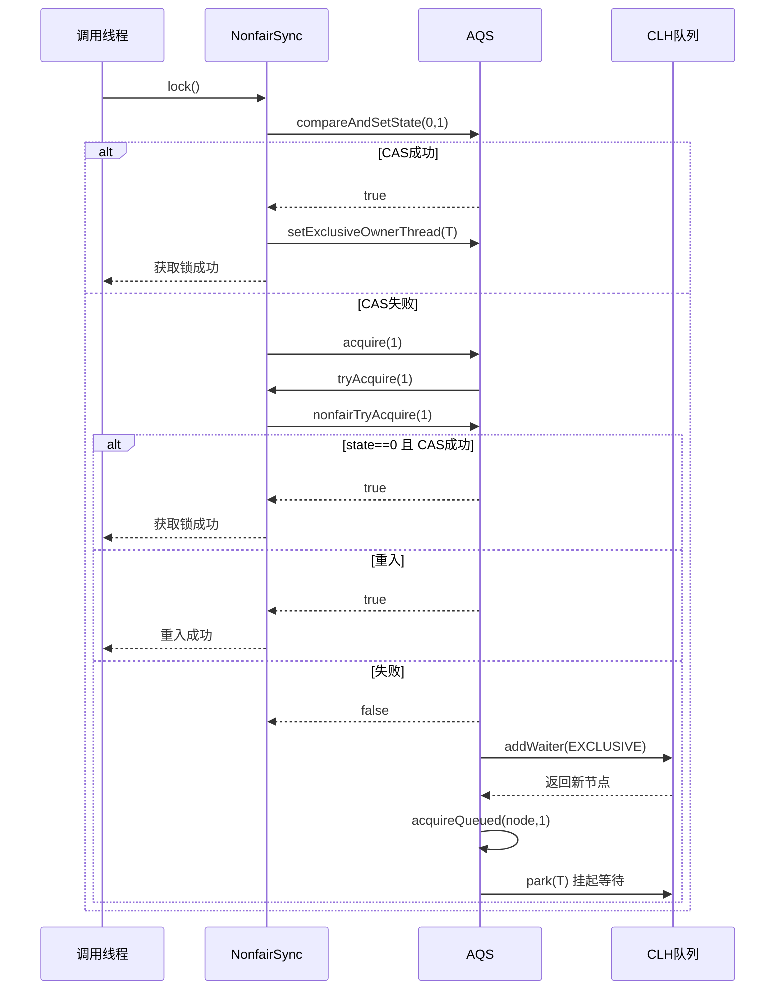
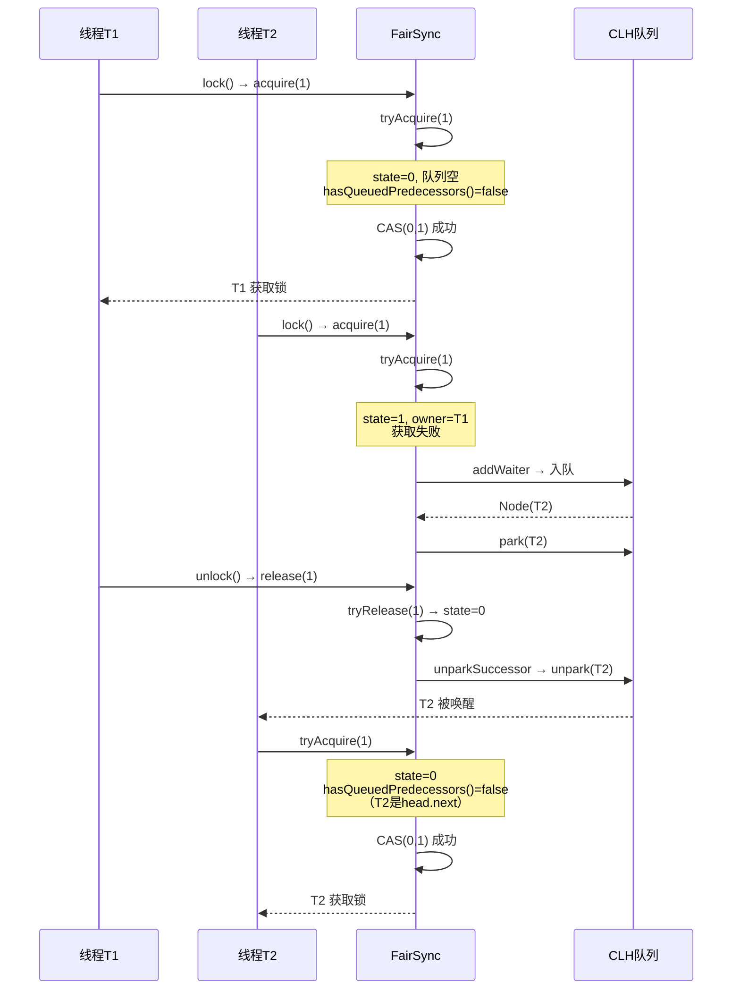
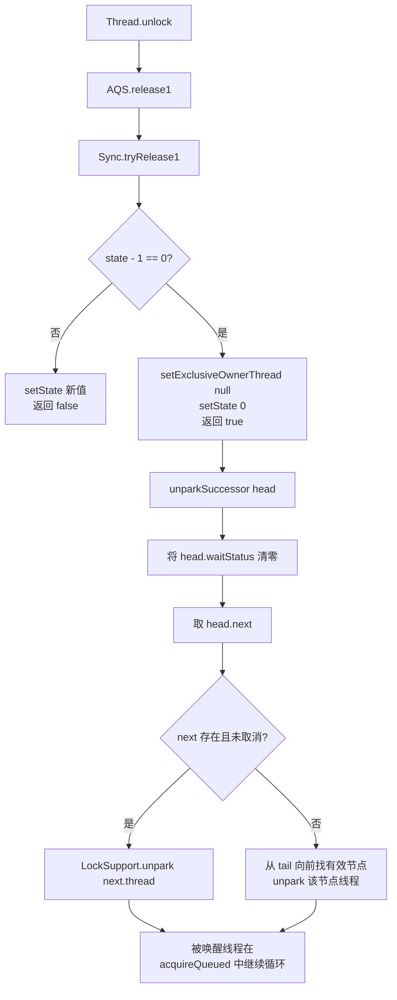
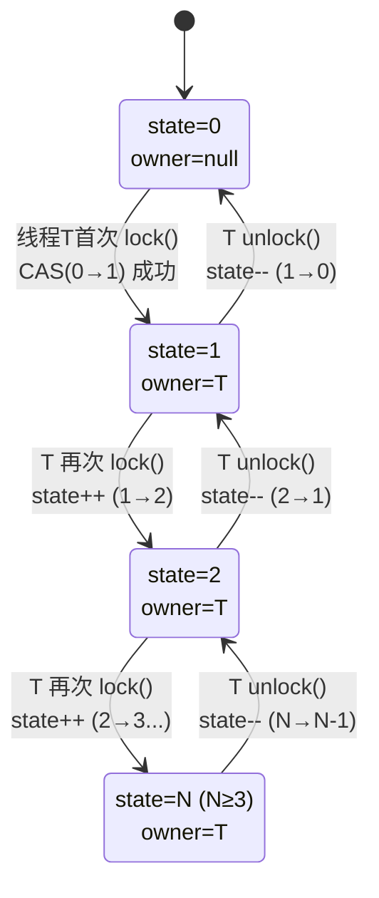
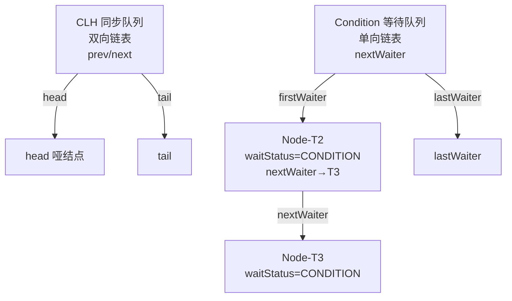
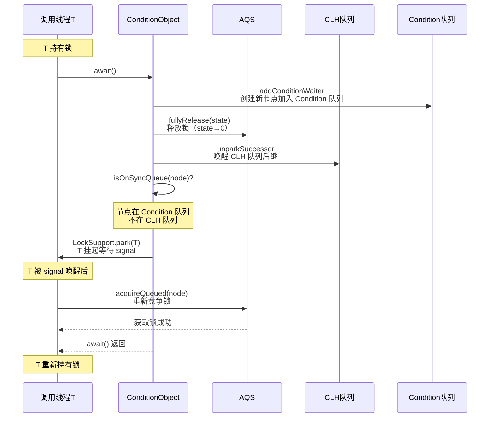
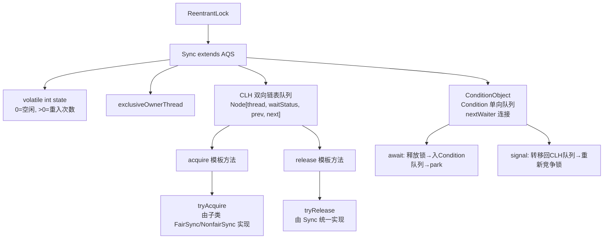

# ReentrantLock 源码解析：AQS 同步队列、可重入机制与公平锁实现

## 🚀 道格·李为什么需要一把新锁

在 Java 1.0 时代，多线程互斥只有一个选择——`synchronized`。它用起来简单：在方法签名上加个关键字，JVM 自动处理加锁和解锁。但随着并发编程场景的复杂化，`synchronized` 的局限越来越明显：

1. <strong>无法尝试获取锁</strong>：线程要么拿到锁，要么无限期阻塞。没有"试一下，拿不到就先干别的"这个选项。这在需要获取多个锁（避免死锁）的场景里是致命的——一旦第一个锁拿到但第二个锁拿不到，已持有的锁无法自动释放
2. <strong>无法中断等待</strong>：如果一个线程在 `synchronized` 上阻塞了，外部无法通过 `interrupt()` 让它停止等待。这在需要超时取消的场合（比如用户点了取消按钮）完全没办法
3. <strong>无法实现公平锁</strong>：`synchronized` 的锁分配由 JVM 内部机制决定，不保证先来后到。高并发下可能出现线程饥饿——某个线程永远抢不到锁
4. <strong>一个对象只有一个条件队列</strong>：`synchronized` 配合 `wait/notify` 使用时，所有线程在同一个 wait set 上等待，无法区分"因为缓冲区满了而等待的生产者"和"因为缓冲区空了而等待的消费者"

道格·李在设计 JSR 166（`java.util.concurrent` 包的基础）时意识到：<strong>要构建一个可靠的并发工具包，必须有一把比 `synchronized` 更灵活的锁</strong>。这把锁需要支持尝试获取、超时获取、可中断获取、公平调度——这些 `synchronized` 做不到的事，是构建 Semaphore、CountDownLatch、BlockingQueue 这些高级并发组件的基础。

这就是 `ReentrantLock` 的诞生背景。它不是简单地把 `synchronized` 重写一遍，而是<strong>把锁的控制权从 JVM 内部暴露给开发者</strong>——开发者可以决定：要不要公平、等多久算超时、拿到锁之后要不要释放。

```java
// synchronized 做不到的三件事：
// ① tryLock：试一下，拿不到就做别的
if (lock.tryLock()) { try { ... } finally { lock.unlock(); } }

// ② tryLock(timeout)：等一段时间，超时就不等了
if (lock.tryLock(2, TimeUnit.SECONDS)) { try { ... } finally { lock.unlock(); } }

// ③ lockInterruptibly：别人让你停你就停
lock.lockInterruptibly();  // 被 interrupt 时抛 InterruptedException
```

接下来逐层深入 `ReentrantLock` 的内部实现——它如何在 AQS 框架上构建这些能力。

## 🏗️ 核心数据结构

### 🏗️ 整体类层次结构

`ReentrantLock` 的代码量不大（JDK 17 中约 700 行），因为它把大部分同步逻辑委托给了 **AQS** 🏛️（AbstractQueuedSynchronizer，队列同步器）。以下是类层次关系：



核心设计：**ReentrantLock 不直接继承 AQS，而是通过内部类 `Sync` 间接继承**。`Sync` 是一个抽象类，提供公共的锁释放逻辑 `tryRelease()` 和非公平获取逻辑 `nonfairTryAcquire()`。`NonfairSync` 和 `FairSync` 是 `Sync` 的两个子类，各自实现不同的获取策略。

```java
// JDK 源码：ReentrantLock 的核心结构
public class ReentrantLock implements Lock, java.io.Serializable {
    private final Sync sync;  // 唯一的实例字段

    // 默认构造器：非公平锁
    public ReentrantLock() {
        sync = new NonfairSync();
    }

    // 指定公平性
    public ReentrantLock(boolean fair) {
        sync = fair ? new FairSync() : new NonfairSync();
    }

    // 所有 Lock 接口方法都委托给 sync
    public void lock()    { sync.acquire(1); }
    public void unlock()  { sync.release(1); }
    // ... 其他方法同理
}
```

关键点：`sync` 字段是 `final` 的，意味着一个 `ReentrantLock` 实例一旦创建，其公平/非公平策略就不可更改。

### 🔢 AQS 的 state 字段：锁状态的唯一载体

整个 `ReentrantLock` 的锁状态由 AQS 中一个 `volatile int state` 字段承载，含义如下：

| state 值 | 含义 | 触发条件 |
|:--------:|------|---------|
| `0` | 锁空闲，无线程持有 | 初始状态 / 完全释放 |
| `1` | 锁被某线程持有，重入 1 次 | 线程首次获取锁 |
| `N（N > 1）` | 锁被同一线程重入了 N 次 | 同一线程重复调用 `lock()` |

这是一个 **多义复用** 的设计——同一个整数字段既是"锁是否被占用"的布尔标志，又是"重入了几次"的计数器。

### ⚙️ CLH 队列：等待线程的排队机制

当线程尝试获取锁失败时，它不会自旋空耗 CPU，而是会被包装成一个 `Node` 节点，插入 AQS 内部维护的 **CLH 队列**（Craig, Landin, and Hagersten 锁队列的变体——一个 FIFO 双向链表）的尾部，然后挂起（park）。



每个 `Node` 节点的关键字段：

| 字段 | 类型 | 含义 |
|------|------|------|
| `thread` | `volatile Thread` | 该节点代表的等待线程（被 park 的线程） |
| `waitStatus` | `volatile int` | 节点状态：`SIGNAL(-1)` / `CANCELLED(1)` / `CONDITION(-2)` / `PROPAGATE(-3)` / `0` |
| `prev` | `Node` | 前驱节点引用 |
| `next` | `Node` | 后继节点引用 |
| `nextWaiter` | `Node` | 指向 Condition 队列中的下一个节点（独占模式下为 null） |

`waitStatus` 五个取值的含义：

```java
// JDK 源码：AbstractQueuedSynchronizer.Node 内部类
static final int CANCELLED =  1;  // 节点被取消（超时或中断），不可恢复
static final int SIGNAL    = -1;  // 后继节点的线程需要被唤醒
static final int CONDITION = -2;  // 节点在 Condition 队列中等待
static final int PROPAGATE = -3;  // 共享模式下释放锁需要传播到后续节点
// 0 是初始值，表示节点刚创建，尚未确定状态
```

最重要的一对关系：**前驱节点的 `waitStatus == SIGNAL` 意味着后继节点处于 park 状态，前驱释放锁时必须负责 unpark 后继**。

```java
// JDK 源码：Node 节点定义（精简）
static final class Node {
    volatile int waitStatus;
    volatile Node prev;
    volatile Node next;
    volatile Thread thread;
    Node nextWaiter;
    // 共享/独占标记
    static final Node EXCLUSIVE = null;  // 独占模式（ReentrantLock 使用此模式）
    // ... 构造器省略
}
```

## 🔄 锁获取流程详解

### ⚖️ 非公平锁获取：两次插队机会

非公平锁的 `lock()` 入口不检查队列，直接尝试 CAS 抢占：

```java
// JDK 源码：NonfairSync.lock()
final void lock() {
    if (compareAndSetState(0, 1))       // ① 第一次插队：直接 CAS 抢
        setExclusiveOwnerThread(Thread.currentThread());
    else
        acquire(1);                     // ② 抢失败，走 AQS 标准流程
}
```

步骤 ① 的含义：调用 `lock()` 的线程先不考虑有没有其他线程在排队，直接尝试把 `state` 从 0 改成 1。如果成功，立即成为锁的持有者。这个 CAS 是在 `AQS.acquire()` 流程之外的"额外机会"。

步骤 ② 进入 AQS 的 `acquire(1)`，内部还会再给一次抢锁机会：

```java
// JDK 源码：AQS.acquire() —— 所有独占锁的模板方法
public final void acquire(int arg) {
    if (!tryAcquire(arg) &&                          // ② 第二次插队
        acquireQueued(addWaiter(Node.EXCLUSIVE), arg)) // ③ 都失败则入队 park
        selfInterrupt();
}
```

`tryAcquire()` 在 `NonfairSync` 中的实现调用父类 `Sync.nonfairTryAcquire()`：

```java
// JDK 源码：Sync.nonfairTryAcquire()
final boolean nonfairTryAcquire(int acquires) {
    final Thread current = Thread.currentThread();
    int c = getState();
    if (c == 0) {                                    // 锁空闲
        if (compareAndSetState(0, acquires)) {       // 直接 CAS 抢，不检查队列
            setExclusiveOwnerThread(current);
            return true;
        }
    }
    else if (current == getExclusiveOwnerThread()) { // 当前线程已持有锁
        int nextc = c + acquires;                    // 可重入：state 累加
        if (nextc < 0) // 溢出检查
            throw new Error("Maximum lock count exceeded");
        setState(nextc);
        return true;
    }
    return false;                                    // 抢不到，返回 false
}
```

这段代码有三个分支：

1. **`c == 0`（锁空闲）**：直接 CAS 抢，不检查队列——这是非公平锁第二次插队的代码位置
2. **`current == getExclusiveOwnerThread()`（重入）**：state 累加，成功——这是 **可重入性的核心实现**
3. **其他情况**：返回 false，进入排队逻辑

完整调用链如下：



### ⚖️ 公平锁获取：先看有没有人排队

```java
// JDK 源码：FairSync.lock()
final void lock() {
    acquire(1);  // 直接走 AQS 标准流程，不尝试 CAS 抢占
}
```

公平锁的唯一区别在 `tryAcquire()` 中多了一个 **`hasQueuedPredecessors()`** 检查：

```java
// JDK 源码：FairSync.tryAcquire()
protected final boolean tryAcquire(int acquires) {
    final Thread current = Thread.currentThread();
    int c = getState();
    if (c == 0) {
        if (!hasQueuedPredecessors() &&          // ★ 关键：确认前面没人排队
            compareAndSetState(0, acquires)) {
            setExclusiveOwnerThread(current);
            return true;
        }
    }
    else if (current == getExclusiveOwnerThread()) {
        int nextc = c + acquires;
        if (nextc < 0)
            throw new Error("Maximum lock count exceeded");
        setState(nextc);
        return true;
    }
    return false;
}
```

`hasQueuedPredecessors()` 的逻辑：

```java
// JDK 源码：AQS.hasQueuedPredecessors()
public final boolean hasQueuedPredecessors() {
    Node h = head;
    Node t = tail;
    Node s;
    return h != t &&                             // 队列不为空
        ((s = h.next) == null ||                 // head.next 存在
         s.thread != Thread.currentThread());    // head.next 不是当前线程
}
```

返回值 true 表示"前面有等待更久的线程"，当前线程必须排队。只有当队列为空，或者当前线程恰好在 head 的下一个节点（即它是队列中等待最久的线程）时，才允许 CAS 抢占。

公平锁的获取时序如下：



### 🔄 acquireQueued：入队后的自旋挂起逻辑

当 `tryAcquire()` 失败后，线程通过 `addWaiter()` 入队，然后进入 `acquireQueued()`：

```java
// JDK 源码：AQS.acquireQueued()（精简）
final boolean acquireQueued(final Node node, int arg) {
    boolean interrupted = false;
    try {
        for (;;) {
            final Node p = node.predecessor();
            if (p == head && tryAcquire(arg)) {      // 前驱是 head 时再试一次
                setHead(node);                       // 成功则设为新 head
                p.next = null; // help GC
                return interrupted;
            }
            if (shouldParkAfterFailedAcquire(p, node) && // 判断是否需要 park
                parkAndCheckInterrupt())                 // park 挂起
                interrupted = true;
        }
    } catch (Throwable t) {
        cancelAcquire(node);
        if (interrupted) selfInterrupt();
        throw t;
    }
}
```

关键流程：
1. 检查前驱节点是否是 head——如果是，说明当前节点是队列中的第一个等待者，有资格再试一次
2. 如果前驱不是 head，调用 `shouldParkAfterFailedAcquire()` 将前驱的 `waitStatus` 设为 `SIGNAL`
3. 设为 `SIGNAL` 后，下一次循环进入 `parkAndCheckInterrupt()`，通过 `LockSupport.park()` 挂起线程

## 🔄 锁释放流程

释放流程对公平锁和非公平锁是相同的，都走 `Sync.tryRelease()`：

```java
// JDK 源码：Sync.tryRelease()
protected final boolean tryRelease(int releases) {
    int c = getState() - releases;
    if (Thread.currentThread() != getExclusiveOwnerThread())
        throw new IllegalMonitorStateException();   // ★ 非持有者调用 unlock 直接抛异常
    boolean free = false;
    if (c == 0) {                                   // state 归零 = 完全释放
        free = true;
        setExclusiveOwnerThread(null);
    }
    setState(c);
    return free;
}
```

这段代码的三层含义：

1. **安全性校验**：如果调用 `unlock()` 的线程不是锁的持有者，直接抛出 `IllegalMonitorStateException`——所以 `lock()` 和 `unlock()` 必须在同一个线程内成对调用
2. **可重入递减**：state 减 1，只有当 state 减到 0 时才认为锁完全释放
3. **返回值语义**：`free == true` 表示锁已完全释放，需要唤醒后继节点；若 state > 0 则说明还有重入次数未释放，不唤醒后继

释放成功后，AQS 调用 `unparkSuccessor()` 唤醒后继：

```java
// JDK 源码：AQS.release() —— 释放的模板方法
public final boolean release(int arg) {
    if (tryRelease(arg)) {                     // state 归零则进入
        Node h = head;
        if (h != null && h.waitStatus != 0)
            unparkSuccessor(h);                // 唤醒 head 的后继节点
        return true;
    }
    return false;
}
```

完整释放调用链：



## ⚙️ 可重入性：state 字段的累加与递减

**可重入** 是指同一个线程在持有锁的情况下可以再次获取同一把锁，不会导致死锁。`ReentrantLock` 的名字正是来源于此特性。

实现机制非常直接：`state` 字段同时充当"锁是否被占用"和"重入次数"两个角色。当持有锁的线程再次调用 `lock()` 时：

```java
// 重入的关键代码（Sync.nonfairTryAcquire 中）
else if (current == getExclusiveOwnerThread()) {
    int nextc = c + acquires;   // state 累加，每重入一次 +1
    if (nextc < 0)
        throw new Error("Maximum lock count exceeded");
    setState(nextc);
    return true;
}
```

释放时对称递减：

```java
// 释放的关键代码（Sync.tryRelease 中）
int c = getState() - releases;  // state 递减
if (c == 0) {                    // 直到归零才算真正释放
    free = true;
    setExclusiveOwnerThread(null);
}
setState(c);
```

用状态图表示 `state` 的变化：



注意：**每一次 `lock()` 必须对应一次 `unlock()`**。如果 lock 了 3 次但只 unlock 了 2 次，state 永远是 1，锁永远不会释放，其他线程将永远阻塞——这是常见的线上死锁原因之一。

### 🧵 getHoldCount：查询当前线程的重入次数

```java
// JDK 源码：Sync.getHoldCount()
final int getHoldCount() {
    return isHeldExclusively() ? getState() : 0;
}
```

只有当调用线程恰好是锁的持有者时才返回 state 值，否则返回 0。

## 公平锁 vs 非公平锁全维度对比

| 维度 | 公平锁 (FairSync) | 非公平锁 (NonfairSync) |
|------|-------------------|------------------------|
| `lock()` 入口 | 直接 `acquire(1)` | 先 `CAS(0,1)` 抢一次 |
| `tryAcquire()` | 先 `hasQueuedPredecessors()` 检查 | 直接 CAS，不检查队列 |
| 插队次数（单次 lock） | 0 次 | 最多 2 次（lock 入口 + tryAcquire） |
| 吞吐量（高并发） | 较低（每次严格按序） | 较高（刚释放的锁可能被新线程截获） |
| 线程饥饿风险 | 无 | 可能存在（一直排不到队） |
| 上下文切换 | 较多（每次都唤醒队首线程） | 较少（新线程直接抢到可省 park/unpark） |
| 适用场景 | 对公平性有硬性要求的业务 | 追求吞吐量的通用场景 |

**为什么默认是非公平锁？** JDK 的设计者权衡后认为：非公平锁虽然可能导致线程饥饿，但吞吐量更高。因为一次上下文切换（park/unpark）的代价很大——如果锁刚刚释放，正好有一个新线程在调用 `lock()`，让它直接拿到锁可以省去一次挂起再唤醒的开销。

## 🎛️ Condition 条件变量

### 为什么需要 Condition

`synchronized` 的 `wait()/notify()` 只有一个等待队列（wait-set），所有条件等待都混在一起。而 `ReentrantLock` 可以通过 `newCondition()` 创建多个 `Condition` 实例，每个 `Condition` 维护独立的等待队列，实现更精细的线程协作。

典型场景：一个阻塞队列，需要区分"队列满了，生产者等待"和"队列空了，消费者等待"两种条件。

```java
class BoundedBuffer {
    final ReentrantLock lock = new ReentrantLock();
    final Condition notFull  = lock.newCondition();   // 生产者等待条件
    final Condition notEmpty = lock.newCondition();   // 消费者等待条件

    final Object[] items = new Object[100];
    int putptr, takeptr, count;

    public void put(Object x) throws InterruptedException {
        lock.lock();
        try {
            while (count == items.length)
                notFull.await();                // 队列满，生产者等待
            items[putptr] = x;
            if (++putptr == items.length) putptr = 0;
            ++count;
            notEmpty.signal();                  // 通知消费者
        } finally {
            lock.unlock();
        }
    }

    public Object take() throws InterruptedException {
        lock.lock();
        try {
            while (count == 0)
                notEmpty.await();               // 队列空，消费者等待
            Object x = items[takeptr];
            if (++takeptr == items.length) takeptr = 0;
            --count;
            notFull.signal();                   // 通知生产者
            return x;
        } finally {
            lock.unlock();
        }
    }
}
```

这段代码来自 JDK 的 `ArrayBlockingQueue` 官方文档注释，展示了 `Condition` 的典型用法：两个不同的条件变量分别管理生产者和消费者的等待与唤醒，避免了 `notifyAll()` 带来的无效唤醒。

### 🔍 Condition 的内部数据结构

每个 `Condition` 实例内部对应一个 **Condition 队列**（单向链表，通过 `Node.nextWaiter` 连接）：



关键区别：CLH 同步队列使用 `prev/next` 双向指针，Condition 等待队列使用 `nextWaiter` 单向指针。同一个 `Node` 对象不会同时出现在两个队列中——`await()` 将节点从同步队列转移到 Condition 队列，`signal()` 将节点从 Condition 队列转移回同步队列。

### ⬇️ await() 流程

`await()` 的执行步骤：



核心源码片段：

```java
// JDK 源码：ConditionObject.await()（精简）
public final void await() throws InterruptedException {
    if (Thread.interrupted()) throw new InterruptedException();
    Node node = addConditionWaiter();        // ① 加入 Condition 队列
    int savedState = fullyRelease(node);     // ② 释放锁（state→0），返回释放前的 state
    int interruptMode = 0;
    while (!isOnSyncQueue(node)) {           // ③ 检查节点是否回到 CLH 队列
        LockSupport.park(this);              // ④ 挂起等待 signal
        // 被唤醒后检查中断
    }
    if (acquireQueued(node, savedState) &&   // ⑤ 回到 CLH 队列后重新竞争锁
        interruptMode != THROW_IE)
        interruptMode = REINTERRUPT;
    // ... 清理取消节点
}
```

关键步骤：

1. **addConditionWaiter**：将当前线程包装为 `waitStatus = CONDITION` 的 Node，加入 Condition 队列尾部
2. **fullyRelease**：释放当前线程持有的所有重入次数（state 直接归零），唤醒 CLH 队列的后继节点
3. **while 循环 park**：线程在 Condition 队列上挂起，等待 `signal()` 将其转移回 CLH 队列
4. **acquireQueued**：被 signal 唤醒并转移回 CLH 队列后，重新竞争锁。获取到锁时，恢复到 await 之前的 state

### ⬆️ signal() 流程

```java
// JDK 源码：ConditionObject.signal()（精简）
public final void signal() {
    if (!isHeldExclusively())                // 非持有者调用抛异常
        throw new IllegalMonitorStateException();
    Node first = firstWaiter;
    if (first != null)
        doSignal(first);                     // 唤醒 Condition 队列的第一个节点
}
```

`doSignal()` → `transferForSignal()` 的核心逻辑：

```java
// JDK 源码：ConditionObject.transferForSignal()
final boolean transferForSignal(Node node) {
    if (!node.compareAndSetWaitStatus(Node.CONDITION, 0))
        return false;                         // 节点已取消
    Node p = enq(node);                       // 将节点从 Condition 队列转移到 CLH 队列尾部
    int ws = p.waitStatus;
    if (ws > 0 || !p.compareAndSetWaitStatus(ws, Node.SIGNAL))
        LockSupport.unpark(node.thread);      // 确保节点线程被唤醒
    return true;
}
```

`signal()` 只做转移，不立即让等待线程运行——被唤醒的线程需要重新竞争锁。

### 📊 Condition vs Object.wait/notify

| 维度 | Condition | Object.wait/notify |
|------|-----------|-------------------|
| 所属体系 | `ReentrantLock` / AQS | `synchronized` 内置 |
| 条件队列数量 | 一个 Lock 可创建多个 Condition | 每个对象只有一个 wait-set |
| 唤醒精确度 | `signal()` 唤醒单个等待者 | `notify()` 随机唤醒一个 |
| 中断响应 | `await()` 响应中断并抛异常 | `wait()` 响应中断并抛异常 |
| 超时等待 | `await(time, unit)` | `wait(timeout)` |
| 节点结构 | AQS Node（复用同步队列的节点结构） | JVM 内部 ObjectWaiter |

## 🛠️ 日常开发中的常用方法

### 高频 API 速查

| 方法 | 签名 | 用途 | 频率 |
|------|------|------|:---:|
| `lock()` | `void lock()` | 阻塞获取锁，不响应中断 | 高 |
| `unlock()` | `void unlock()` | 释放锁 | 高 |
| `tryLock()` | `boolean tryLock()` | 非阻塞尝试获取，立即返回 | 中 |
| `tryLock(timeout)` | `boolean tryLock(long, TimeUnit)` | 带超时的尝试获取 | 中 |
| `lockInterruptibly()` | `void lockInterruptibly()` | 阻塞获取锁，响应中断 | 中 |
| `newCondition()` | `Condition newCondition()` | 创建条件变量 | 中 |
| `isLocked()` | `boolean isLocked()` | 查询锁是否被持有 | 低 |
| `getHoldCount()` | `int getHoldCount()` | 查询当前线程重入次数 | 低 |
| `getQueueLength()` | `int getQueueLength()` | 查询等待队列长度 | 低 |
| `hasQueuedThreads()` | `boolean hasQueuedThreads()` | 查询是否有线程在排队 | 低 |

### 🛠️ 典型用法示例

**1. lock() / unlock() —— 最基本的互斥**

```java
ReentrantLock lock = new ReentrantLock();
lock.lock();
try {
    // 临界区代码
} finally {
    lock.unlock();  // 必须在 finally 中释放
}
```

**2. tryLock() —— 非阻塞尝试，拿不到锁就做别的事**

```java
ReentrantLock lock = new ReentrantLock();
if (lock.tryLock()) {
    try {
        // 获取到锁，执行临界区
    } finally {
        lock.unlock();
    }
} else {
    // 没获取到锁，执行备选逻辑
    doSomethingElse();
}
```

**3. tryLock(timeout) —— 等一段时间，超时则放弃**

```java
ReentrantLock lock = new ReentrantLock();
try {
    if (lock.tryLock(500, TimeUnit.MILLISECONDS)) {
        try {
            // 500ms 内获取到锁
        } finally {
            lock.unlock();
        }
    } else {
        // 超时未获取，记录告警或执行降级逻辑
        log.warn("获取锁超时");
    }
} catch (InterruptedException e) {
    Thread.currentThread().interrupt();
}
```

**4. lockInterruptibly() —— 阻塞获取但可被中断**

```java
ReentrantLock lock = new ReentrantLock();
try {
    lock.lockInterruptibly();  // 等待期间收到 interrupt() 会抛异常
    try {
        // 临界区
    } finally {
        lock.unlock();
    }
} catch (InterruptedException e) {
    // 被中断，清理工作
    Thread.currentThread().interrupt();
}
```

**5. newCondition() —— 创建条件变量实现等待/通知**

```java
ReentrantLock lock = new ReentrantLock();
Condition condition = lock.newCondition();

// 线程 A：等待条件
lock.lock();
try {
    while (!conditionMet) {
        condition.await();       // 释放锁，等待被唤醒
    }
    // 条件满足，执行业务
} finally {
    lock.unlock();
}

// 线程 B：改变条件并通知
lock.lock();
try {
    conditionMet = true;
    condition.signal();          // 唤醒一个等待者
    // 或 condition.signalAll()  // 唤醒所有等待者
} finally {
    lock.unlock();
}
```

### 现代 Java 中的替代选择

在 Java 8+ 之后，有些场景可以用更高级的并发工具替代原始 `ReentrantLock`：

| 旧写法（ReentrantLock） | 新写法（Java 8+） | 适用场景 |
|------------------------|-------------------|---------|
| `ReentrantLock + Condition` 的复杂等待/通知 | `CompletableFuture` 链式编排 | 异步任务编排 |
| 手动 lock/unlock 保护共享变量 | `AtomicInteger` / `LongAdder` | 简单计数/累加 |
| `ReentrantLock` 保护读写 | `StampedLock` / `ReentrantReadWriteLock` | 读多写少场景 |

但对于精细化的线程协作（如上面 `BoundedBuffer` 的例子），`ReentrantLock + Condition` 仍然是 API 最直观、最可控的方案。

## 🔒 ReentrantLock vs synchronized 全维度对比

| 维度 | ReentrantLock | synchronized |
|------|---------------|--------------|
| 实现层面 | JDK 层面（Java + CAS + `LockSupport`） | JVM 层面（字节码 `monitorenter`/`monitorexit`、ObjectMonitor） |
| 锁类型 | 支持公平锁和非公平锁 | 仅非公平锁 |
| 可中断获取 | `lockInterruptibly()` | 不支持（阻塞后无法中断） |
| 超时获取 | `tryLock(timeout)` | 不支持 |
| 条件变量 | 多个 `Condition`（每个 Lock 可创建多个） | 单个 wait-set（`wait()/notify()`） |
| 释放方式 | 显式 `unlock()`，必须在 finally 中 | 自动释放（代码块结束或异常退出） |
| 可重入 | 支持（基于 state 累加） | 支持（基于 ObjectMonitor 的 recursions 字段） |
| 锁状态查询 | `isLocked()`, `getHoldCount()`, `getQueueLength()` | 不支持查询（需通过 `Thread.holdsLock()` 间接判断） |
| 性能（JDK 6+） | 与 synchronized 差距很小 | JDK 6 引入偏向锁/轻量级锁/锁粗化后大幅优化 |
| 使用风险 | 忘记 unlock 导致死锁 | 不会忘记释放，但 wait/notify 易出错 |

**选型建议**：

- 需要 `tryLock()` 超时、可中断、公平锁、多 Condition → 选 `ReentrantLock`
- 简单的互斥需求、不需要上述高级特性 → 选 `synchronized`（代码更简洁，不易出错）

## 🎯 总结

### 🔭 知识全景图



### 📋 核心概念速查

| 概念 | 一句话解释 | 关键源码位置 |
|------|-----------|-------------|
| AQS 模板方法 | `acquire()`/`release()` 定义骨架，子类实现 `tryXxx()` | `AQS.acquire()` / `AQS.release()` |
| state 字段 | 0=空闲，N=重入次数。CAS 修改 | `AQS.state` |
| CLH 队列 | FIFO 双向链表，Node 挂等待线程 | `AQS.Node` 内部类 |
| 非公平锁插队 | `lock()` 入口 CAS 一次 + `tryAcquire()` 中 CAS 一次 | `NonfairSync.lock()` |
| 公平锁排队 | `hasQueuedPredecessors()` 检查前是否有等待者 | `FairSync.tryAcquire()` |
| 可重入 | 同一线程重复 lock，state 累加；unlock 递减至 0 才释放 | `Sync.nonfairTryAcquire()` + `Sync.tryRelease()` |
| SIGNAL | 前驱节点的 waitStatus，表示后继需要被唤醒 | `Node.SIGNAL = -1` |
| Condition 队列 | 独立的单向链表，与 CLH 分离，signal 时转移 | `ConditionObject` 内部类 |
| park/unpark | `LockSupport` 的线程挂起/唤醒原语 | `LockSupport.park()` / `unpark()` |

### ⚖️ 一条完整的调用链（非公平锁从获取到释放）

```
线程A lock()
  → NonfairSync.lock()
    → compareAndSetState(0, 1) 成功 → setExclusiveOwnerThread(A) → 获取锁

线程B lock()
  → NonfairSync.lock()
    → compareAndSetState(0, 1) 失败 → acquire(1)
      → tryAcquire(1) → nonfairTryAcquire(1) → state=1 且 owner≠B → false
      → addWaiter(EXCLUSIVE) → 创建 Node(B) 入队尾
      → acquireQueued(Node(B), 1) → 前驱是 head，再次 tryAcquire → 失败
        → shouldParkAfterFailedAcquire → 前驱 waitStatus 设为 SIGNAL
        → LockSupport.park(B) → B 挂起

线程A unlock()
  → release(1)
    → tryRelease(1) → state 1→0 → owner=null → free=true
    → unparkSuccessor(head) → LockSupport.unpark(B)
    → B 被唤醒，在 acquireQueued 循环中继续
      → 前驱是 head → tryAcquire(1) → CAS(0,1) 成功
      → setHead(Node(B)) → B 成为新 head → 返回

线程B unlock()
  → release(1)
    → tryRelease(1) → state 1→0 → owner=null → free=true
    → head.waitStatus==0 → 无需唤醒后继（队列中无等待者）
```

以上就是 `ReentrantLock` 从使用到源码的完整分析。从最外层的 `lock()/unlock()` API，到 AQS 的 `state` 字段、CLH 队列、公平/非公平策略的差异，再到 `Condition` 的等待/通知机制——核心设计思想始终是 **"模板方法 + 状态字段 + CAS + 队列管理"** 这四个要素的组合。
