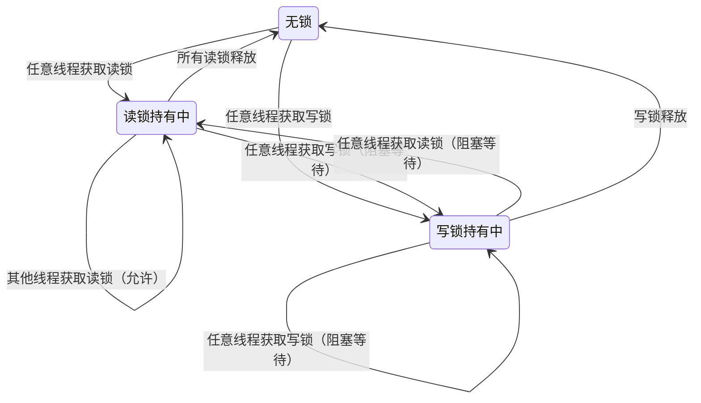
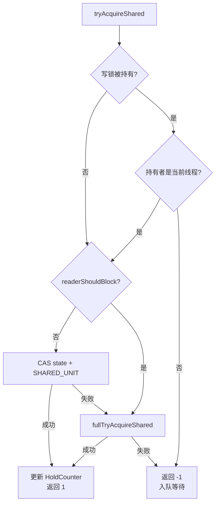
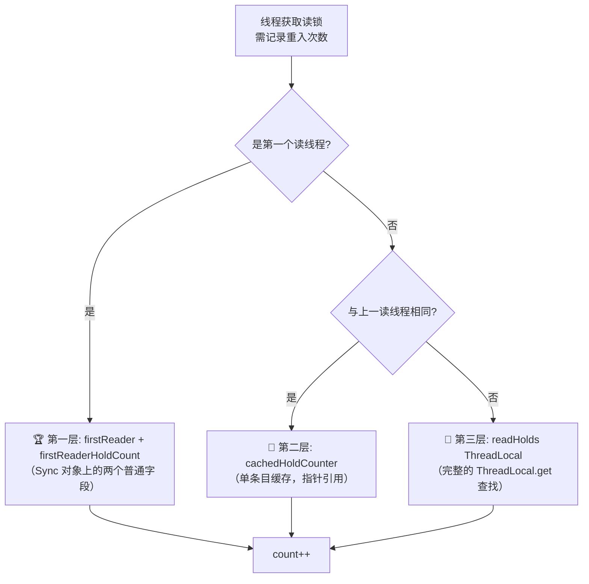
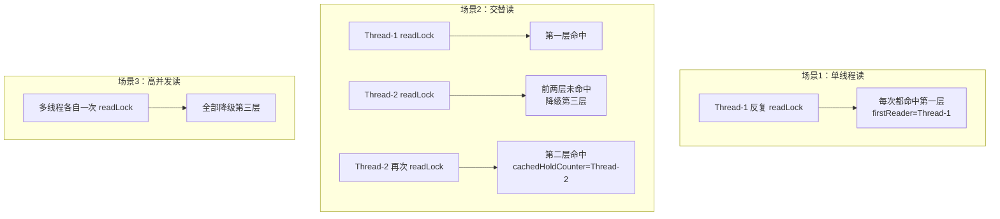
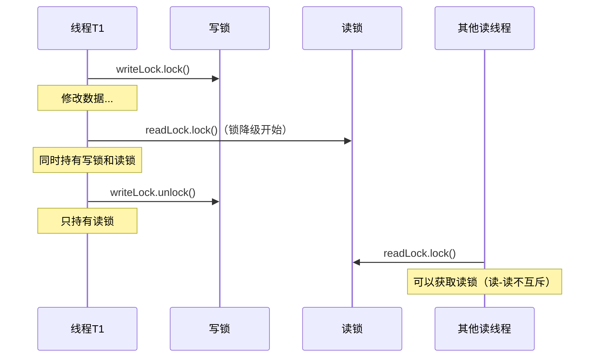
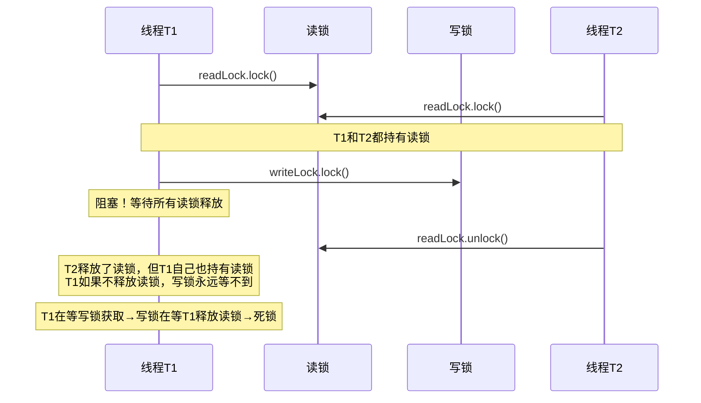
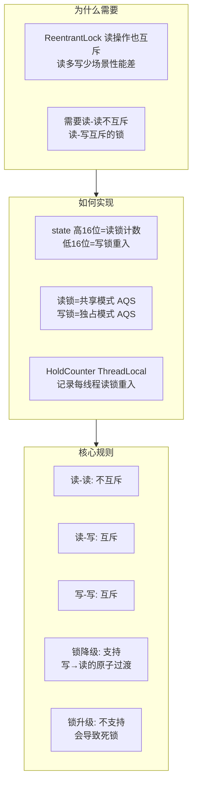

# ReentrantReadWriteLock 深度解析

## 🤔 道格·李为什么要区分读锁和写锁

`ReentrantLock` 是可重入的互斥锁——无论什么操作，同一时刻只有一个线程能持有锁。这在写多读少的场景里不是问题，但在<strong>读多写少</strong>的场景（缓存查询、配置读取、字典加载）中，`ReentrantLock` 带来了不必要的串行化：100 个线程同时读，它们不应该互相阻塞，因为读取不修改数据。

道格·李在设计 JSR 166 时专门为此引入了读写锁。`ReentrantReadWriteLock` 把锁拆成两把：
- <strong>读锁（readLock）</strong>——共享锁，多个读线程可以同时持有，读与读不互斥
- <strong>写锁（writeLock）</strong>——独占锁，写线程独占，写与写、写与读互斥

这个设计基于一个观察：大多数并发访问的数据结构是"读多写少"的。如果 90% 的操作都是读取，那么互斥锁让这 90% 的操作全部串行化——白白浪费了并发能力。读写锁让读操作完全并行，只在写操作发生时短暂阻塞。

内部实现上，`ReentrantReadWriteLock` 把 AQS 的 32 位 `state` 字段拆成高 16 位（记录共享的读锁持有次数）和低 16 位（记录独占的写锁重入次数），用一个 `int` 同时跟踪两种模式的持有状态。这也是为什么读写锁在同一时刻要么被读线程共享、要么被写线程独占——两种模式共享同一个 `state`，状态机决定了它们互斥。

## 📋 基本用法：readLock 和 writeLock

`ReentrantReadWriteLock` 提供两个 `Lock` 对象：

| 锁 | 类型 | 获取方法 | AQS 模式 |
|------|------|---------|:---:|
| `readLock()` | 共享锁 | `readLock.lock()` | 共享模式（Shared） |
| `writeLock()` | 独占锁 | `writeLock.lock()` | 独占模式（Exclusive） |

```java
ReentrantReadWriteLock rwLock = new ReentrantReadWriteLock();
Lock readLock = rwLock.readLock();
Lock writeLock = rwLock.writeLock();

// 读锁：多线程可同时持有
readLock.lock();
try {
    // 读取操作
} finally {
    readLock.unlock();
}

// 写锁：只有一个线程能持有
writeLock.lock();
try {
    // 写入操作
} finally {
    writeLock.unlock();
}
```

### 读写互斥规则



| 当前状态 | 请求读锁 | 请求写锁 |
|---------|:---:|:---:|
| **无锁** | 允许 | 允许 |
| **读锁持有中** | 允许（读-读不互斥） | 阻塞（读-写互斥） |
| **写锁持有中** | 阻塞（写-读互斥） | 阻塞（写-写互斥） |

**关键点** ：写锁释放后，如果有读线程和写线程同时在等待，谁先获取取决于锁的公平性设置。非公平模式下，写线程可能被插队的读线程持续阻塞（写饥饿问题）。

## 📐 state 的拆分设计：一个 int 存两种状态

### 为什么需要拆分 state

ReentrantLock 只需一个 `state` 就能表达锁状态：`0` = 空闲，`1` = 锁定，`>1` = 重入。但 ReentrantReadWriteLock 需要同时表达两种锁的状态：多个线程各自持有一份读锁，同时有一个线程持有写锁。一个 int 变量如何表达这些信息？

答案是 **按位拆分** ：将 32 位 int 拆成高 16 位和低 16 位。


源码中的常量定义和拆分操作：

```java
// ReentrantReadWriteLock.Sync
static final int SHARED_SHIFT   = 16;
static final int SHARED_UNIT    = (1 << SHARED_SHIFT);  // 65536
static final int MAX_COUNT      = (1 << SHARED_SHIFT) - 1;  // 65535
static final int EXCLUSIVE_MASK = (1 << SHARED_SHIFT) - 1;  // 0x0000FFFF

// 获取读锁计数：state 右移 16 位
static int sharedCount(int c)    { return c >>> SHARED_SHIFT; }

// 获取写锁计数：state 与低 16 位掩码
static int exclusiveCount(int c) { return c & EXCLUSIVE_MASK; }
```

| 操作 | 公式 | 示例 |
|------|------|------|
| 获取读锁计数 | `state >>> 16` | state=65537 → 读计数=1, 写计数=1 |
| 获取写锁计数 | `state & 0x0000FFFF` | state=131072 → 读计数=2, 写计数=0 |
| 读锁+1 | `state + (1 << 16)` | CAS: `compareAndSetState(c, c + SHARED_UNIT)` |
| 写锁+1 | `state + 1` | `setState(c + 1)`（与 ReentrantLock 一致） |

**关键字段解释** ：
- `SHARED_UNIT` = 65536 = 2^16。读锁每获取一次，state 增加 65536，相当于高 16 位 +1
- `EXCLUSIVE_MASK` = 0x0000FFFF。用这个掩码过滤 state，得到低 16 位（写锁计数）
- `sharedCount(c)`：`>>>` 是无符号右移，保证高位填 0

### 为什么用 16 位分割

16 位能表达的最大值是 65535。这意味着：
- 写锁最多重入 65535 次（实际不会触达）
- 读锁每个线程的持有计数也受 ThreadLocal 的 `HoldCounter` 约束

## 写锁的获取与释放

写锁是 **独占模式** ，逻辑与 `ReentrantLock` 类似，但需要额外检查读锁是否被持有：

```java
// ReentrantReadWriteLock.Sync
protected final boolean tryAcquire(int acquires) {
    Thread current = Thread.currentThread();
    int c = getState();
    int w = exclusiveCount(c);        // ① 获取写锁计数（低 16 位）

    if (c != 0) {                     // ② state != 0，锁已被持有
        if (w == 0 || current != getExclusiveOwnerThread())
            return false;             // ③ 有读锁（w=0, c!=0）或者写锁不是自己的 → 失败
        if (w + acquires > MAX_COUNT)
            throw new Error("Maximum lock count exceeded");
        setState(c + acquires);       // ④ 写锁重入：state + 1
        return true;
    }

    // ⑤ c == 0，无锁状态
    if (writerShouldBlock() ||        // ⑥ 公平/非公平策略判断
        !compareAndSetState(c, c + acquires))
        return false;                 // ⑦ CAS 失败或策略要求阻塞 → 入队
    setExclusiveOwnerThread(current); // ⑧ CAS 成功，设置写锁持有者
    return true;
}
```

**写锁获取失败的两种情况** ：
1. `c != 0 && w == 0`：state 非零但写锁计数为 0 → 有线程持有读锁 → 写锁必须等待所有读锁释放
2. `c == 0` 但 `writerShouldBlock()` 返回 true → 入队等待

```java
protected final boolean tryRelease(int releases) {
    if (!isHeldExclusively())
        throw new IllegalMonitorStateException();
    int nextc = getState() - releases;         // ① state - 1
    boolean free = exclusiveCount(nextc) == 0; // ② 写锁计数归零
    if (free)
        setExclusiveOwnerThread(null);         // ③ 清除持有者
    setState(nextc);                           // ④ 更新 state
    return free;
}
```

写锁释放与 ReentrantLock 一致。`free = true` 时 AQS 会唤醒后继节点。

## 读锁的获取与释放

读锁是 **共享模式** ，核心复杂度在于需要记录每个线程的读锁重入次数：

```java
// ReentrantReadWriteLock.Sync
protected final int tryAcquireShared(int unused) {
    Thread current = Thread.currentThread();
    int c = getState();

    // ① 如果有写锁且持有者不是当前线程 → 失败
    if (exclusiveCount(c) != 0 &&
        getExclusiveOwnerThread() != current)
        return -1;

    int r = sharedCount(c);  // ② 当前读锁总计数

    // ③ 快速路径：CAS 增加读锁计数
    if (!readerShouldBlock() &&          // 公平/非公平策略
        r < MAX_COUNT &&
        compareAndSetState(c, c + SHARED_UNIT)) {
        // ... 更新 HoldCounter（见下文）
        return 1;
    }
    // ④ CAS 失败或需要阻塞 → 走完整版本
    return fullTryAcquireShared(current);
}
```

**读锁获取成功的条件** ：
- 没有写锁被其他线程持有（写锁持有者是当前线程时允许 —— 这是锁降级的基础）
- `readerShouldBlock()` 返回 false



### 📝 HoldCounter：记录每个线程的读锁重入次数

读锁被多个线程同时持有，但 AQS 的 `state` 只有总计数。需要单独的数据结构记录每个线程各自的读锁重入次数：

```java
// ReentrantReadWriteLock.Sync
static final class HoldCounter {
    int count;          // 该线程的读锁重入次数
    final long tid = LockSupport.getThreadId(Thread.currentThread());
}

static final class ThreadLocalHoldCounter
    extends ThreadLocal<HoldCounter> {
    public HoldCounter initialValue() {
        return new HoldCounter();
    }
}
```

```java
// 快速路径中的 HoldCounter 更新（在 tryAcquireShared 中）
if (r == 0) {                    // 第一个读线程
    firstReader = current;
    firstReaderHoldCount = 1;
} else if (firstReader == current) {
    firstReaderHoldCount++;      // 第一个读线程重入
} else {
    HoldCounter rh = cachedHoldCounter;
    if (rh == null || rh.tid != LockSupport.getThreadId(current))
        cachedHoldCounter = rh = readHolds.get();  // ThreadLocal 获取
    else if (rh.count == 0)
        readHolds.set(rh);
    rh.count++;                  // 重入计数 +1
}
```

**三层读锁重入计数缓存体系** ：

道格·李（Doug Lea）为了追求极致性能，设计了三层递进的缓存来记录每个线程的读锁重入次数，逐层降级避免昂贵的 ThreadLocal 查找：



| 层级 | 缓存结构 | 存储位置 | 命中条件 | 开销 |
|:---:|------|------|------|------|
| 🥇 第一层 | `firstReader` + `firstReaderHoldCount` | Sync 对象字段 | 当前线程是全局第一个获取读锁的线程 | 2 次字段读写，无 CAS，无 ThreadLocal |
| 🥈 第二层 | `cachedHoldCounter` | Sync 对象字段 | 当前线程与上一次获取读锁的线程相同 | 1 次引用比较 + 1 次 `tid` 比较 |
| 🥉 第三层 | `readHolds`（ThreadLocalHoldCounter） | Thread → ThreadLocalMap | 前两层全部未命中 | `ThreadLocal.get()` → ThreadLocalMap 线性探测查找 |

**第一层：`firstReader` / `firstReaderHoldCount`**

绝大多数情况下，第一个读线程就是唯一的读线程（没有并发读），或至少是获取读锁频率最高的线程。这两个字段直接挂在 Sync 对象上，绕过所有缓存查找：

```java
// Sync 对象上的字段（非 volatile，单线程写入）
private transient Thread firstReader;
private transient int firstReaderHoldCount;
```

命中时只需 2 次直接字段赋值，不需要进入 ThreadLocalMap。`firstReader` 不是 `volatile` 的，因为只有持有读锁的线程在 `tryAcquireShared` 中写入，不存在多线程竞争写的问题。

**第二层：`cachedHoldCounter`**

如果 `firstReader` 不命中，检查 `cachedHoldCounter` 是否指向当前线程的 `HoldCounter`。多数业务代码中，读锁的连续获取发生在同一个线程内（例如 for 循环中多次 `readLock.lock()`），因此上一个获取读锁的线程很大概率就是当前线程：

```java
// Sync 对象上的字段
private transient HoldCounter cachedHoldCounter;

// 在 tryAcquireShared 中：
HoldCounter rh = cachedHoldCounter;
if (rh == null || rh.tid != LockSupport.getThreadId(current))
    cachedHoldCounter = rh = readHolds.get();  // 未命中，降级到第三层
else if (rh.count == 0)
    readHolds.set(rh);  // rh 之前被 remove 过，重新 set 回 ThreadLocal
rh.count++;
```

<span style="color:red">`cachedHoldCounter` 的关键细节</span>：当 `rh.tid` 匹配成功但 `rh.count == 0` 时，意味着该线程之前释放过读锁，其 `HoldCounter` 已从 ThreadLocal 中 `remove`（读锁释放到 0 时会调用 `readHolds.remove()`）。此时需要重新 `readHolds.set(rh)` 将 HoldCounter 放回当前线程的 ThreadLocalMap 中。

**第三层：`readHolds`（ThreadLocalHoldCounter）**

前两层全部不命中时，才执行 `readHolds.get()` — 这是一个完整的 `ThreadLocal.get()` 调用，内部需要计算 `0x61c88647` 黄金分割哈希索引，在 ThreadLocalMap 中做线性探测查找：

```java
private transient ThreadLocalHoldCounter readHolds;

// ThreadLocal.get() 内部的调用链：
// readHolds.get()
//   → Thread.threadLocals（ThreadLocalMap）
//     → Entry[(threadLocalHashCode & (len-1))]（哈希定位）
//       → 线性探测（最多 n 次比较）
```

**三层命中率分析**



在实际业务中，场景1和场景2占绝大多数，前两层缓存命中率极高。道格·李通过这三个字段，将读锁重入计数的平均开销从一次完整的 `ThreadLocal.get()`（含线性探测）降到了 2 次普通字段访问。

读锁释放时，将 `HoldCounter.count` 递减，同时对 `state` 执行 `CAS(c - SHARED_UNIT)`。当 `sharedCount` 归零时，AQS 会唤醒后继的写线程。

## ⬇️ 锁降级：从写锁降到读锁

**锁降级** （Lock Downgrade）是指在持有写锁的情况下，先获取读锁，再释放写锁的过程：

```java
public void processData() {
    writeLock.lock();
    try {
        // 修改数据
        cache.put("key", computeValue());
        // 获取读锁（在写锁释放之前）
        readLock.lock();
    } finally {
        // 先释放写锁
        writeLock.unlock();
    }
    // 现在只持有读锁
    try {
        // 读取数据（其他读线程也可同时读）
        return cache.get("key");
    } finally {
        readLock.unlock();
    }
}
```



**为什么需要锁降级** ：持有写锁修改数据后，希望后续的读取能看到刚写入的数据。如果先释放写锁再获取读锁，中间可能被其他写线程插入修改，导致读取到的不一致数据。锁降级保证了 **写 → 读的原子性过渡** 。

**锁降级在源码中的支撑** ：读锁的 `tryAcquireShared` 中有这一判断：

```java
if (exclusiveCount(c) != 0 &&
    getExclusiveOwnerThread() != current)
    return -1;
```

`exclusiveCount(c) != 0` 表示有写锁，但 `getExclusiveOwnerThread() == current` 表示写锁是当前线程持有的。此时读锁 **不阻塞** ，允许获取。这是锁降级可以执行的根本原因。

## ⬆️ 为什么不能锁升级

**🔒 锁升级** （Lock Upgrade）是指在持有读锁的情况下，尝试获取写锁。 **ReentrantReadWriteLock 不支持锁升级** ，尝试这样做会导致死锁：

```java
// 这段代码会导致死锁！
readLock.lock();
try {
    // ... 读操作
    writeLock.lock();  // 永久阻塞！读锁未释放，写锁永远等不到
    try {
        // ... 永远不会到达
    } finally {
        writeLock.unlock();
    }
} finally {
    readLock.unlock();
}
```

**死锁原因** ：



T1 自己持有读锁，同时尝试获取写锁。但写锁要求所有读锁释放才能获取——包括 T1 自己的读锁。而 T1 正在 `writeLock.lock()` 中阻塞，不会去释放读锁。这就是典型的 **自己阻塞自己的死锁** 。

| 操作 | 是否支持 | 原因 |
|------|:---:|------|
| **锁降级** （写→读） | 支持 | 持有写锁的线程可以安全获取读锁，释放写锁后只留读锁 |
| **锁升级** （读→写） | 不支持 | 读锁未释放时尝试获取写锁，要求所有读锁释放（包括自己），导致死锁 |

## 📐 公平模式与非公平模式

```java
// 非公平（默认）
ReentrantReadWriteLock rwLock = new ReentrantReadWriteLock();

// 公平
ReentrantReadWriteLock fairLock = new ReentrantReadWriteLock(true);
```

两者的核心差异在两个方法中体现：

```java
// 非公平版本：读锁不阻塞（除非队列头是写线程，防止写饥饿）
final boolean readerShouldBlock() {
    return apparentlyFirstQueuedIsExclusive();  // ① 队列头是写线程时阻塞
}

// 公平版本：队列中有等待者就阻塞
final boolean readerShouldBlock() {
    return hasQueuedPredecessors();  // ② 严格 FIFO
}

// 非公平版本：写锁从不阻塞（极易抢到）
final boolean writerShouldBlock() {
    return false;  // ③ 永远不阻塞 → 非公平
}

// 公平版本：写锁也检查是否有前驱
final boolean writerShouldBlock() {
    return hasQueuedPredecessors();  // ④ 严格 FIFO
}
```

| 维度 | 非公平模式 | 公平模式 |
|------|---------|---------|
| 读锁阻塞条件 | 队列头部是写线程 | 队列中有任何等待者 |
| 写锁阻塞条件 | 永不阻塞（直接 CAS） | 队列中有任何等待者 |
| 吞吐量 | 高 | 低 |
| 写饥饿风险 | 有（大量读线程可能让写线程持续等待） | 无 |
| 默认 | 是 | — |

## 🛠️ 日常开发中的常用方法

| 方法 | 用途 | 频率 |
|------|------|:---:|
| `readLock().lock()` / `unlock()` | 获取/释放读锁 | 高 |
| `writeLock().lock()` / `unlock()` | 获取/释放写锁 | 高 |
| `readLock().tryLock(timeout, unit)` | 带超时的读锁尝试 | 中 |
| `writeLock().tryLock(timeout, unit)` | 带超时的写锁尝试 | 中 |
| `getReadLockCount()` | 获取当前持有读锁的线程数近似值 | 低 |
| `isWriteLocked()` | 查询写锁是否被持有 | 低 |

```java
// 场景1：带超时的缓存更新
public Object getOrCompute(String key) throws InterruptedException {
    // 先尝试读
    readLock.lock();
    try {
        Object val = cache.get(key);
        if (val != null) return val;
    } finally {
        readLock.unlock();
    }

    // 缓存未命中，尝试写
    if (!writeLock.tryLock(500, TimeUnit.MILLISECONDS)) {
        throw new TimeoutException("获取写锁超时");
    }
    try {
        // 双重检查（其他线程可能已写入）
        Object val = cache.get(key);
        if (val != null) return val;
        val = computeValue(key);
        cache.put(key, val);
        return val;
    } finally {
        writeLock.unlock();
    }
}

// 场景2：锁降级确保数据一致性
public Map<String, Object> snapshot() {
    writeLock.lock();
    try {
        // 更新数据
        cache.put("version", incrementVersion());
        // 锁降级：获取读锁后再释放写锁
        readLock.lock();
    } finally {
        writeLock.unlock();
    }
    // 只持有读锁，安全返回快照
    try {
        return new HashMap<>(cache);
    } finally {
        readLock.unlock();
    }
}
```

## 🎯 总结



| 核心问题 | 答案 |
|---------|------|
| 为什么需要 ReentrantReadWriteLock | 读多写少场景下，ReentrantLock 将读操作串行化。读写锁允许多线程同时读，只在写时互斥 |
| state 如何表达两种状态 | 高 16 位存储读锁总计数（`state>>>16`），低 16 位存储写锁重入计数（`state&0xFFFF`） |
| 为什么不能锁升级 | 持有读锁时尝试获取写锁，写锁要求所有读锁释放（包括自己持有的），自己阻塞自己，形成死锁 |
| 锁降级为什么安全 | 写锁持有者获取读锁时，`tryAcquireShared` 专门允许写锁持有者获取读锁，不阻塞 |
| 写饥饿如何缓解 | 非公平模式下 `readerShouldBlock()` 检查队列头是否是写线程，是则让读线程入队，给写线程机会 |
| 读锁重入次数存在哪 | `HoldCounter` + `ThreadLocal`，记录每个线程各自的读锁重入次数。`firstReader` 和 `cachedHoldCounter` 做缓存优化 |
