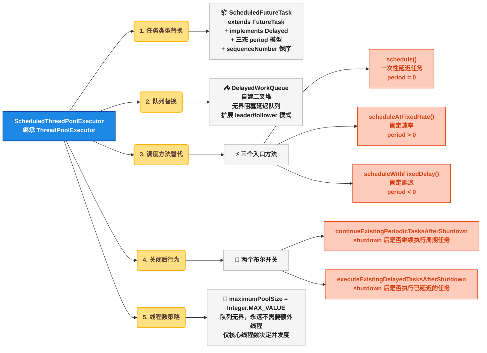
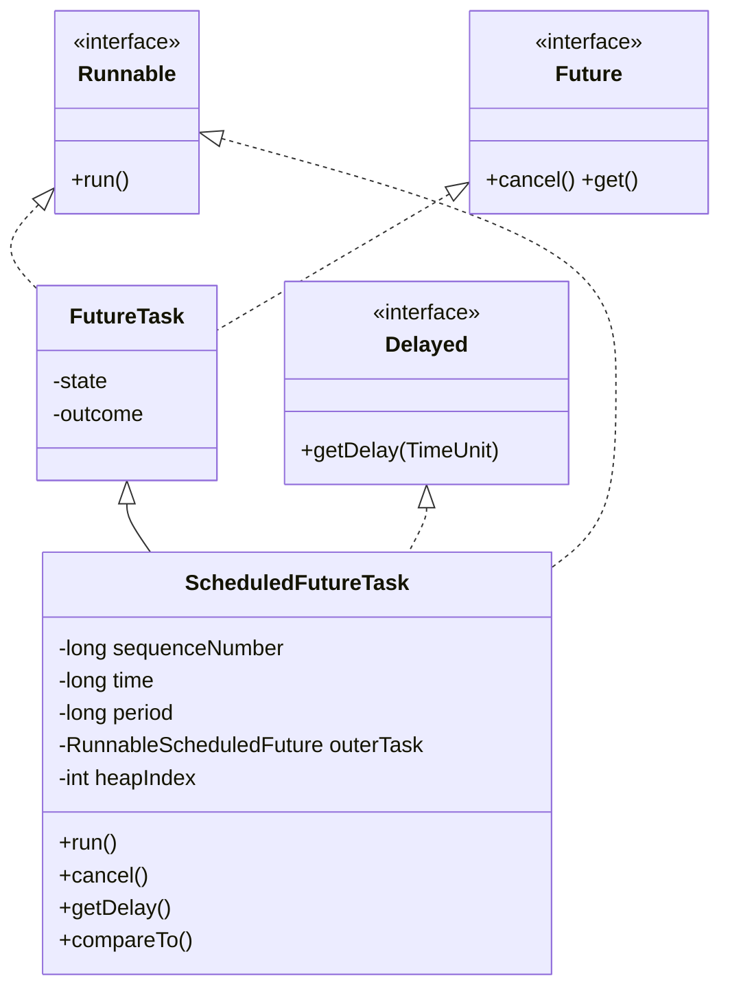
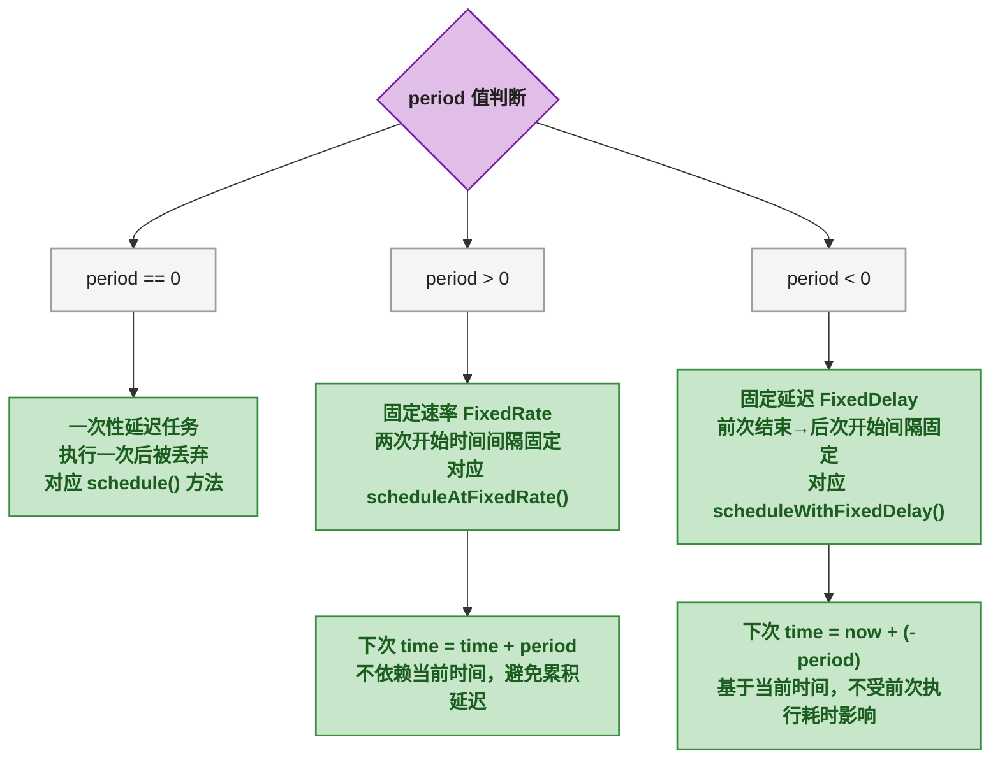
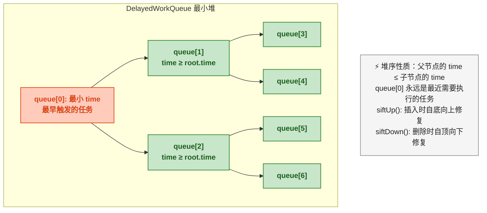
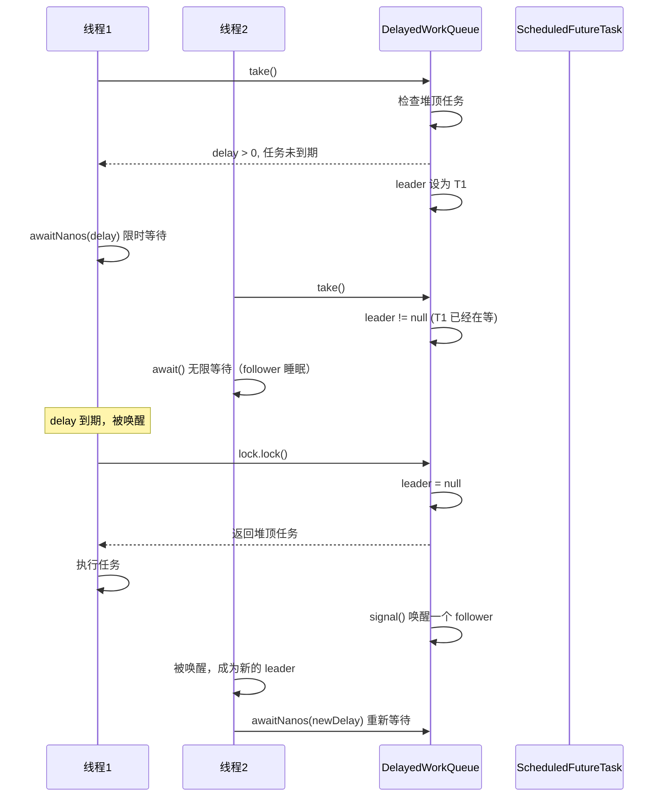
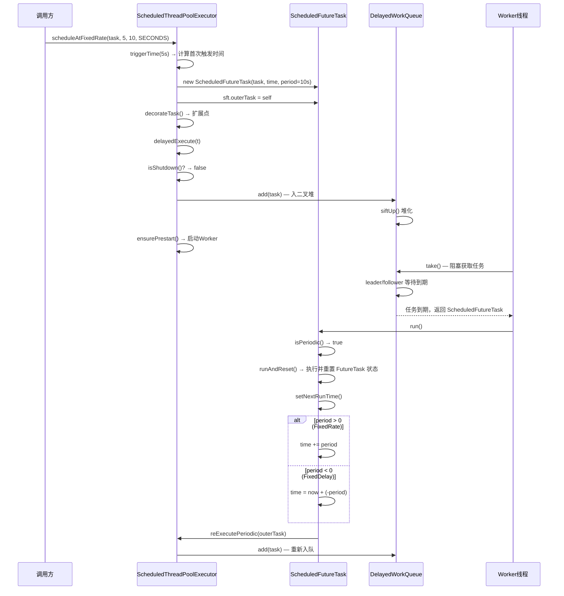
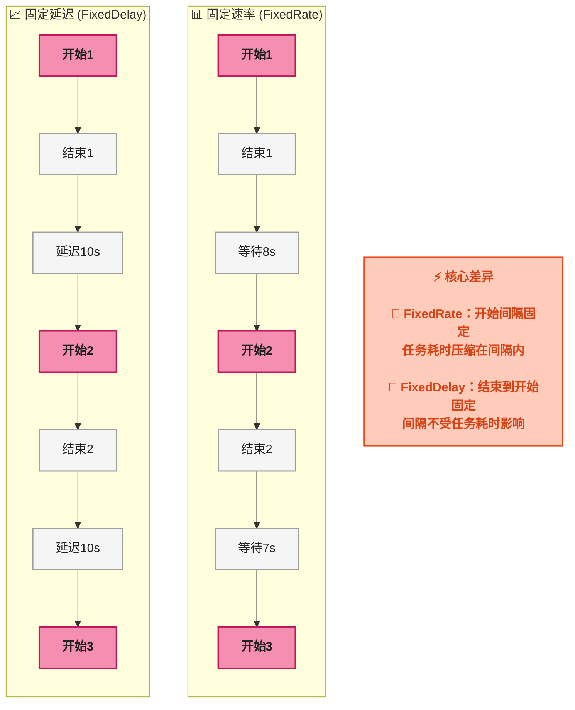
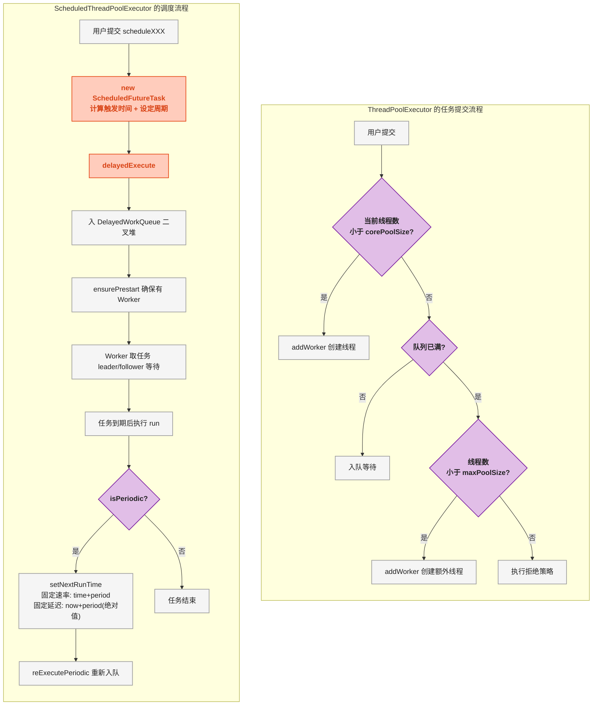
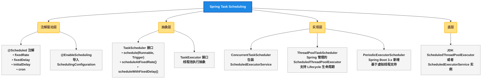
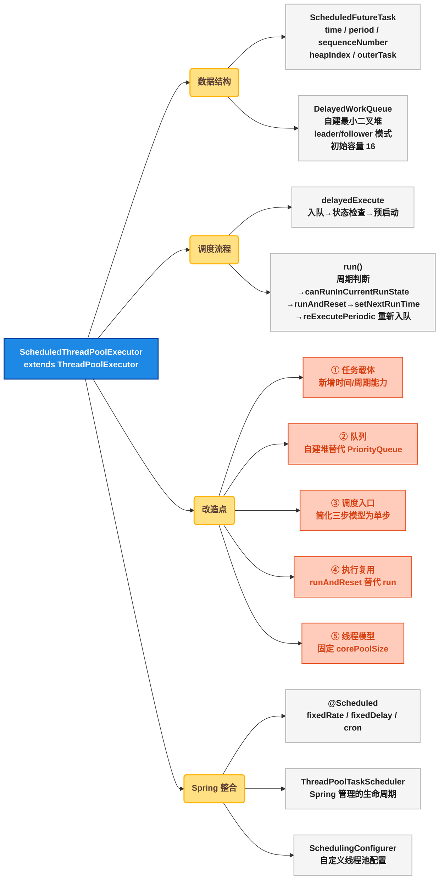

# ScheduledThreadPoolExecutor 定时调度增强：DelayedWorkQueue 二叉堆延时队列与 Spring 体系实战

## 🚀 从一个具体问题开始

一个电商系统需要定时取消超时未支付的订单。最初用 `Timer` 实现：

```java
Timer timer = new Timer();
timer.schedule(new TimerTask() {
    @Override
    public void run() {
        cancelUnpaidOrders();
    }
}, 30_000);  // 30 秒后执行
```

当业务增长到每天百万级订单，`Timer` 暴露出三个致命问题：

1. **单线程执行** ：一个 TimerTask 阻塞会导致所有后续任务延迟
2. **异常吞没** ：任务抛异常后 Timer 线程直接终止，剩余任务永远不会执行
3. **无返回结果** ：无法获取任务执行结果或异常信息

第二个问题是 **绝对最严重** 的——线上某次因为 `cancelUnpaidOrders()` 中偶发 `NullPointerException`，整个 Timer 线程静默终止，超时订单再也没被取消，导致库存被无效锁定。

用 `ScheduledThreadPoolExecutor` 重写：

```java
ScheduledExecutorService scheduler = Executors.newScheduledThreadPool(4);

scheduler.scheduleAtFixedRate(
    () -> cancelUnpaidOrders(),  // 定时任务
    30, 60, TimeUnit.SECONDS      // 首次延迟 30s，之后每 60s 执行一次
);
```

效果：线程池中 4 个线程共同消费任务，一个任务异常不影响其他任务，每个任务返回 `ScheduledFuture` 可追踪状态。

`ScheduledThreadPoolExecutor`（定时线程池执行器，在 ThreadPoolExecutor 基础上增加定时/周期调度能力）直接继承 `ThreadPoolExecutor`，复用了线程池的核心管理能力，同时自建了一套定时调度基础设施。接下来逐层拆解它做了什么改进、怎么做的、以及如何在 Spring 体系中落地。

## 🏊 ScheduledThreadPoolExecutor 的整体架构

### 🔗 继承关系与组件概览

`ScheduledThreadPoolExecutor` 直接继承 `ThreadPoolExecutor`，在父类基础上替换了三个关键组件：



**五个改进点一句话总结** ：

| 改进维度 | ThreadPoolExecutor | ScheduledThreadPoolExecutor |
|---------|-------------------|---------------------------|
| 任务类型 | 普通 `Runnable` / `FutureTask` | `ScheduledFutureTask`，携带时间戳与周期信息 |
| 存储队列 | 任意 `BlockingQueue`（由用户传入） | 固定为 `DelayedWorkQueue`（自建二叉堆） |
| 调度入口 | `execute()` 三步决策模型 | `schedule()` / `scheduleAtFixedRate()` / `scheduleWithFixedDelay()` |
| 线程数模型 | corePoolSize + maximumPoolSize 灵活伸缩 | fixed corePoolSize，maximumPoolSize 恒为 `Integer.MAX_VALUE` |
| 关闭行为 | `shutdown()` 后队列不再接受任务 | 通过两个布尔参数控制是否继续执行已有延迟/周期任务 |

### 📋 构造函数：队列和线程数被锁定

```java
public ScheduledThreadPoolExecutor(int corePoolSize,
                                   ThreadFactory threadFactory,
                                   RejectedExecutionHandler handler) {
    super(corePoolSize, Integer.MAX_VALUE, 0, NANOSECONDS,
          new DelayedWorkQueue(), threadFactory, handler);
}
```

**逐行解读** ：

- `corePoolSize`：由用户指定，决定了并发调度线程数
- `Integer.MAX_VALUE`：maximumPoolSize 硬编码为最大值，因为队列是无界的，永远走不到"队列满→创建额外线程"的分支。**这不是设计漏洞，而是有意为之**：`DelayedWorkQueue` 无界，队列永远不会满，maximumPoolSize 参数实际上失效，直接设为最大值避免误解
- `0, NANOSECONDS`：keepAliveTime 设为 0，配合 `NANOSECONDS` 时间单位，因为不存在需要回收的超额线程
- `new DelayedWorkQueue()`：队列固定为用户不可替换的 `DelayedWorkQueue`

特别注意：**用户不能传入自定义队列**。ScheduledThreadPoolExecutor 只有一个公开构造函数，队列被固定为 `DelayedWorkQueue()` 的匿名实例。这意味着所有定时调度能力都建立在这个自建二叉堆之上。

## 🔮 核心数据结构：ScheduledFutureTask

`ScheduledFutureTask` 是定时任务的载体。它同时扮演三个角色：



五个核心字段：

| 字段 | 类型 | 含义 |
|------|------|------|
| `sequenceNumber` | `long` | 全局递增序列号，用于相同延迟时间的任务之间的 FIFO 排序 |
| `time` | `long` | 任务下次可执行的纳秒级时间戳（`System.nanoTime() + delay`） |
| `period` | `long` | 正值=固定速率、负值=固定延迟、0=一次性任务 |
| `outerTask` | `RunnableScheduledFuture` | 指向自身，用于 `reExecutePeriodic` 重新入队 |
| `heapIndex` | `int` | 在 DelayedWorkQueue 二叉堆中的位置，加速取消操作 |

### 🔢 period 的三态模型

`period` 是 `ScheduledFutureTask` 最重要的字段，它的三种取值决定了任务的重复策略：



**源码验证**：

```java
// ScheduledFutureTask.java — 计算下次执行时间
private void setNextRunTime() {
    long p = period;
    if (p > 0) // 固定速率：在当前 time 上累加，不依赖系统时间
        time += p;
    else        // 固定延迟（p < 0）：基于当前时间重新计算
        time = triggerTime(-p);
}

// 判断是否是周期任务
public boolean isPeriodic() {
    return period != 0;
}
```

`triggerTime` 将延迟值转为纳秒时间戳：

```java
private long triggerTime(long delay, TimeUnit unit) {
    return triggerTime(unit.toNanos((delay < 0) ? 0 : delay));
}

long triggerTime(long delay) {
    // nanoTime() 可能溢出，用 long 的模运算特性自动处理
    return System.nanoTime() +
        ((delay < (Long.MAX_VALUE >> 1)) ? delay : overflowFree(delay));
}
```

`overflowFree` 处理纳秒时间戳的数值溢出问题——`System.nanoTime()` 可以正可以负，当它接近 `Long.MAX_VALUE` 时，直接加一个大的 `delay` 会导致溢出。`overflowFree` 通过比较队列头部的时间戳来修正。

### 比较规则：延迟时间优先，序列号保 FIFO

二叉堆中的排序规则由 `compareTo` 决定：

```java
public int compareTo(Delayed other) {
    if (other == this)
        return 0;
    if (other instanceof ScheduledFutureTask) {
        ScheduledFutureTask<?> x = (ScheduledFutureTask<?>)other;
        long diff = time - x.time;
        if (diff < 0) return -1;
        else if (diff > 0) return 1;
        // 相同延迟时间时，用 sequenceNumber 保证 FIFO
        else if (sequenceNumber < x.sequenceNumber) return -1;
        else return 1;
    }
    long diff = getDelay(NANOSECONDS) - other.getDelay(NANOSECONDS);
    return (diff < 0) ? -1 : (diff > 0) ? 1 : 0;
}
```

**关键点**：当两个任务的 `time` 相同时，`sequenceNumber` 较小的任务排在前面。这保证了即使 1000 个任务设了相同的延迟时间，它们也会按提交顺序 FIFO 执行，而不是随机顺序。

## 🏗️ 核心数据结构：DelayedWorkQueue

`DelayedWorkQueue` 是 `ScheduledThreadPoolExecutor` 的发动机。JDK 标准库中已经有一个 `DelayQueue`（内部复用 `PriorityQueue` 的二叉堆），但 `ScheduledThreadPoolExecutor` 选择自建了一个二叉堆。

### 为什么不直接用 DelayQueue？

| 对比维度 | DelayQueue | DelayedWorkQueue |
|---------|-----------|-----------------|
| 堆实现 | 委托 `PriorityQueue` 的二叉堆 | 自建二叉堆（数组实现） |
| 取消效率 | O(n) 线性查找 | O(log n) 堆化，配合 `heapIndex` 字段快速定位 |
| 元素类型 | 泛型 `E extends Delayed` | 硬编码 `RunnableScheduledFuture`，避免了类型擦除带来的额外操作 |
| leader/follower | 无 | 有，减少不必要的唤醒 |
| 内存分配 | PriorityQueue 初始容量 11 | 初始容量 16 |

**根本原因** ：`DelayQueue` 的 `remove()` 取消任务需要 O(n) 线性扫描。对于高频定时场景（如每秒千级任务提交和取消），线性扫描是不可接受的。`ScheduledFutureTask` 持有 `heapIndex` 字段记录在堆中的位置，删除时直接定位后在局部堆化，降到了 O(log n)。

### 🏗️ 二叉堆结构



**核心字段** （来自源码）：

```java
static class DelayedWorkQueue extends AbstractQueue<Runnable>
    implements BlockingQueue<Runnable> {

    private static final int INITIAL_CAPACITY = 16;
    private RunnableScheduledFuture<?>[] queue =
        new RunnableScheduledFuture<?>[INITIAL_CAPACITY];
    private final ReentrantLock lock = new ReentrantLock();
    private int size;
    private Thread leader;
    private final Condition available = lock.newCondition();
}
```

**逐字段解释** ：

- `queue`：底层数组，二叉堆的物理存储。索引 0 是堆顶（最小 time 的任务）
- `lock`：所有入队/出队操作的互斥锁，保证堆结构的线程安全
- `leader`：leader-follower 模式中的 leader 线程，用于减少不必要的线程唤醒
- `available`：条件变量，线程在此等待任务到期

### 📐 leader/follower 模式

当多个线程来取任务但堆顶任务尚未到达执行时间时，标准做法是让所有线程各自 `await(timeout)` 然后醒来抢任务。这样会引发"惊群效应"（多个线程同时被唤醒，但只有一个能拿到任务，其他线程白白唤醒又等待）。

`DelayedWorkQueue` 用 leader/follower 模式解决：



**源码验证**：

```java
public RunnableScheduledFuture<?> take() throws InterruptedException {
    lock.lockInterruptibly();
    try {
        for (;;) {
            RunnableScheduledFuture<?> first = queue[0];
            if (first == null) {
                available.await();        // 队列空，无限等待
            } else {
                long delay = first.getDelay(NANOSECONDS);
                if (delay <= 0)
                    return finishPoll(first);  // 已到期，取出并重新堆化
                first = null;
                if (leader != null)
                    available.await();    // 有其他线程在等，无限睡眠（follower）
                else {
                    Thread thisThread = Thread.currentThread();
                    leader = thisThread;
                    try {
                        available.awaitNanos(delay);  // leader 限时等待
                    } finally {
                        if (leader == thisThread)
                            leader = null;
                    }
                }
            }
        }
    } finally {
        if (leader == null && queue[0] != null)
            available.signal();   // 没有 leader 但堆非空，唤醒一个 follower
        lock.unlock();
    }
}
```

**关键点**：

- `leader` 线程使用 `awaitNanos(delay)` 精确等待到任务到期时间
- `follower` 线程使用 `await()` 无限期等待，不消耗 CPU
- leader 取走任务后释放锁之前调用 `signal()` 唤醒一个 follower，被唤醒的 follower 成为新 leader
- 这就避免了"两个线程同时等待同一任务"的情况，**一次只有一个线程计时等待**

## 📋 任务提交与调度流程

### 📋 三个调度方法的底层统一入口

```java
// 一次性延迟任务
public ScheduledFuture<?> schedule(Runnable command, long delay, TimeUnit unit) {
    if (command == null || unit == null)
        throw new NullPointerException();
    RunnableScheduledFuture<?> t = decorateTask(command,
        new ScheduledFutureTask<Void>(command, null, triggerTime(delay, unit)));
    delayedExecute(t);
    return t;
}

// 固定速率任务
public ScheduledFuture<?> scheduleAtFixedRate(Runnable command,
        long initialDelay, long period, TimeUnit unit) {
    if (command == null || unit == null)
        throw new NullPointerException();
    if (period <= 0)
        throw new IllegalArgumentException();
    ScheduledFutureTask<Void> sft =
        new ScheduledFutureTask<Void>(command, null,
            triggerTime(initialDelay, unit), unit.toNanos(period));
    RunnableScheduledFuture<Void> t = decorateTask(command, sft);
    sft.outerTask = t;  // 指向自己，用于 reExecutePeriodic 重新入队
    delayedExecute(t);
    return t;
}

// 固定延迟任务
public ScheduledFuture<?> scheduleWithFixedDelay(Runnable command,
        long initialDelay, long delay, TimeUnit unit) {
    if (command == null || unit == null)
        throw new NullPointerException();
    if (delay <= 0)
        throw new IllegalArgumentException();
    ScheduledFutureTask<Void> sft =
        new ScheduledFutureTask<Void>(command, null,
            triggerTime(initialDelay, unit), unit.toNanos(-delay));  // 传入负值
    RunnableScheduledFuture<Void> t = decorateTask(command, sft);
    sft.outerTask = t;
    delayedExecute(t);
    return t;
}
```

三个方法的结构完全一致：① 计算触发时间 → ② 构造 `ScheduledFutureTask` → ③ 调用 `decorateTask`（扩展点，默认直接返回）→ ④ `delayedExecute(t)`。

**唯一区别在于 `period`** ：
- `schedule`：period = 0
- `scheduleAtFixedRate`：period = unit.toNanos(period)（正值）
- `scheduleWithFixedDelay`：period = unit.toNanos(-delay)（负值）

### ▶️ delayedExecute：调度入口

```java
private void delayedExecute(RunnableScheduledFuture<?> task) {
    if (isShutdown())
        reject(task);                          // 池已关，拒绝
    else {
        super.getQueue().add(task);            // 入队到 DelayedWorkQueue
        if (isShutdown() &&
            !canRunInCurrentRunState(task.isPeriodic()) &&
            remove(task))                     // 二次检查：池关闭且不允许执行，移除
            task.cancel(false);
        else
            ensurePrestart();                  // 确保至少有一个工作线程
    }
}
```

**相比 ThreadPoolExecutor 的 `execute()`，`delayedExecute` 更简单**：

| 对比维度 | ThreadPoolExecutor.execute() | ScheduledThreadPoolExecutor.delayedExecute() |
|---------|---------------------------|-------------------------------------------|
| 判断核心线程数 | 是，小于 corePoolSize 则 addWorker | 否，统一先入队 |
| 判断队列满 | 是，满则创建非核心线程或拒绝 | 否，队列无界永不満 |
| 判断最大线程数 | 是 | 否，maximumPoolSize=Integer.MAX_VALUE |
| 兜底检查 | 队列满且线程达到上限 → 拒绝 | 入队后二次检查池关闭状态 |

**为什么 Scheduled 版本不需要三步决策模型？** 因为 `DelayedWorkQueue` 是无界队列，任务一定可以入队；maximumPoolSize 无实际限制。唯一需要判断的是池关闭状态，放在 `delayedExecute` 和 `reExecutePeriodic` 两处处理即可。

整个调度流程用一张时序图总结：



### 📊 scheduleAtFixedRate vs scheduleWithFixedDelay 对比

这两个方法的区别是高频面试题，本质差异在于**"间隔"的计时起点不同**：



**选择策略**：

- 需要按固定频率采集数据（如每秒统计一次 QPS，不管统计过程耗时多少），用 `scheduleAtFixedRate`
- 需要任务之间保持固定间隔（如上一次数据库写入完成后等 5 秒再写下一次），用 `scheduleWithFixedDelay`

## 📋 任务执行：run() 与周期重入

ScheduledFutureTask 重写了 `FutureTask.run()`，这是整个周期调度最核心的改造：

```java
public void run() {
    boolean periodic = isPeriodic();                       // step1: 判断周期
    if (!canRunInCurrentRunState(periodic))                // step2: 池状态检查
        cancel(false);
    else if (!periodic)
        super.run();                                       // step3: 一次性任务，走父类
    else if (super.runAndReset()) {                        // step4: 周期任务
        setNextRunTime();                                  // step5: 计算下次执行时间
        reExecutePeriodic(outerTask);                      // step6: 重新入队
    }
}
```

**逐步骤解析**：

1. `isPeriodic()`：`return period != 0`，非零即周期任务
2. `canRunInCurrentRunState(periodic)`：检查当前池状态是否允许执行。RUNNING 状态一律放行；SHUTDOWN 状态只放行同时满足 run-after-shutdown 策略的任务；STOP/TIDYING/TERMINATED 一律拒绝
3. 一次性任务走 `FutureTask.run()`，执行后 FutureTask 的 state 转为 COMPLETING → NORMAL，任务结束
4. 周期任务走 `runAndReset()`，执行 `callable.call()` 后不设置返回值状态，而是重置状态为 NEW，这样同一个 FutureTask 对象可以反复执行
5. `setNextRunTime()`：根据 period 正/负决定累加还是重新计算
6. `reExecutePeriodic(outerTask)`：将自身重新放入队列，等待下一次调度

### 📊 runAndReset 与 run 的区别

这是 `FutureTask` 的两个方法：

```java
// run() — 执行后设结果，任务终结
public void run() {
    // ... CAS 设置 runner, 执行 callable.call(), 设置 outcome
    set(result);  // state 变为 COMPLETING → NORMAL
}

// runAndReset() — 执行后重置状态，任务可复用
protected boolean runAndReset() {
    // ... CAS 设置 runner, 执行 callable.call()
    // 不调用 set()
    // state 保持 NEW，下一次调用仍然可以执行
}
```

周期任务必须是可复用的——同一个 `ScheduledFutureTask` 对象要被执行几百次、几千次。`runAndReset` 正是为此设计的。

### 📊 reExecutePeriodic 与 delayedExecute 的区别

```java
void reExecutePeriodic(RunnableScheduledFuture<?> task) {
    if (canRunInCurrentRunState(true)) {    // 池状态允许
        super.getQueue().add(task);          // 重新入队
        if (!canRunInCurrentRunState(true) && remove(task))
            task.cancel(false);             // 入队后二次检查
        else
            ensurePrestart();               // 确保有线程
    }
}
```

与 `delayedExecute` 的区别：

| 对比维度 | delayedExecute | reExecutePeriodic |
|---------|---------------|-------------------|
| 调用时机 | 用户首次提交任务 | 周期任务执行完后 |
| 池关闭处理 | 走 `reject(task)` 拒绝策略 | 静默丢弃，不触发拒绝 |
| 二次检查关键词 | `isShutdown()` | `canRunInCurrentRunState(true)` |

**为什么 `reExecutePeriodic` 不触发拒绝策略？** 因为拒绝策略（如 AbortPolicy 抛异常）发生在一个 Worker 线程的内部执行循环中。如果这里抛出异常，会绕过 `afterExecute`，甚至可能终止 Worker 线程。静默丢弃是更安全的选择。

## 从 ThreadPoolExecutor 视角看全部改进

在了解各组件细节后，把这五个改进放在一起做一个全景对比：



五处源码级改造汇总：

| 序号 | 改造点 | ThreadPoolExecutor 原实现 | ScheduledThreadPoolExecutor 改造 | 源码位置 |
|:---:|-------|------------------------|-------------------------------|---------|
| ① | 任务载体 | `Runnable` / `FutureTask` | `ScheduledFutureTask`，增加 time / period / sequenceNumber / heapIndex | `ScheduledThreadPoolExecutor.ScheduledFutureTask` |
| ② | 任务队列 | 用户可替换的任意 `BlockingQueue` | 硬编码 `DelayedWorkQueue`，自建二叉堆 + leader/follower | `ScheduledThreadPoolExecutor.DelayedWorkQueue` |
| ③ | 任务提交 | `execute(Runnable)` 三步决策 | `delayedExecute(RunnableScheduledFuture)` 入队 + 预启动 | `ScheduledThreadPoolExecutor.delayedExecute()` |
| ④ | 任务执行 | `FutureTask.run()` 执行后设结果 | `runAndReset()` 执行后重置状态，周期任务可复用 | `ScheduledFutureTask.run()` |
| ⑤ | 线程数模型 | corePoolSize/maxPoolSize 两级伸缩 | maxPoolSize=Integer.MAX_VALUE，仅 corePoolSize 决定并发度 | `ScheduledThreadPoolExecutor` 构造函数 |

## 🛠️ 日常开发中的常用方法

### 📊 API 速查表

| 方法 | 签名 | 用途 | 频率 |
|------|------|------|:---:|
| `schedule` | `schedule(Runnable/Callable, delay, unit)` | 延迟执行一次性任务 | 高 |
| `scheduleAtFixedRate` | `scheduleAtFixedRate(Runnable, initialDelay, period, unit)` | 固定速率周期执行 | 高 |
| `scheduleWithFixedDelay` | `scheduleWithFixedDelay(Runnable, initialDelay, delay, unit)` | 固定延迟周期执行 | 高 |
| `setRemoveOnCancelPolicy` | `setRemoveOnCancelPolicy(boolean)` | 取消任务时是否立即从队列移除 | 中 |
| `setContinueExistingPeriodicTasksAfterShutdown` | `setContinueExistingPeriodicTasksAfterShutdown(boolean)` | shutdown 后是否继续周期任务 | 中 |
| `setExecuteExistingDelayedTasksAfterShutdown` | `setExecuteExistingDelayedTasksAfterShutdown(boolean)` | shutdown 后是否执行延迟任务 | 中 |
| `getQueue` | `getQueue()` | 获取 DelayedWorkQueue（谨慎操作） | 低 |
| `setCorePoolSize` | `setCorePoolSize(int)` | 动态调整核心线程数 | 中 |
| `shutdown` / `shutdownNow` | (继承) | 关闭线程池 | 高 |
| `awaitTermination` | `awaitTermination(timeout, unit)` | 等待线程池终止 | 中 |

### 🌐 典型使用场景

**场景 1：定时统计 QPS**

```java
ScheduledExecutorService scheduler = Executors.newScheduledThreadPool(2);

// 每秒打印一次 QPS
scheduler.scheduleAtFixedRate(() -> {
    long qps = counter.getAndSet(0);
    log.info("Current QPS: {}", qps);
}, 1, 1, TimeUnit.SECONDS);
```

**场景 2：异步任务超时取消**

```java
ScheduledExecutorService timeoutScheduler = Executors.newScheduledThreadPool(4);

<T> CompletableFuture<T> withTimeout(Callable<T> task, long timeout, TimeUnit unit) {
    CompletableFuture<T> future = CompletableFuture.supplyAsync(() -> {
        try { return task.call(); }
        catch (Exception e) { throw new RuntimeException(e); }
    });

    ScheduledFuture<?> timeoutTask = timeoutScheduler.schedule(() -> {
        future.completeExceptionally(new TimeoutException("任务超时"));
    }, timeout, unit);

    future.whenComplete((r, e) -> timeoutTask.cancel(false));
    return future;
}
```

**场景 3：批量处理任务时控制间隔**

```java
ScheduledExecutorService scheduler = Executors.newSingleThreadScheduledExecutor();

// 每批处理 100 条，批次之间间隔 5 秒，避免数据库压力
scheduler.scheduleWithFixedDelay(() -> {
    List<Order> batch = orderDao.fetchPendingOrders(100);
    batch.forEach(this::processOrder);
}, 0, 5, TimeUnit.SECONDS);
```

### 📊 Executors 工厂方法对比

| 工厂方法 | 线程数特性 | corePoolSize 可调 |
|---------|----------|:---:|
| `newScheduledThreadPool(n)` | 核心线程数 n，可随时通过 `setCorePoolSize` 调整 | 是 |
| `newSingleThreadScheduledExecutor()` | 固定单线程，不可扩展 | 否（重写 `setCorePoolSize` 为 no-op） |

两者的不等价关系——`newScheduledThreadPool(1)` 与 `newSingleThreadScheduledExecutor()` 在功能上类似但前者可扩容而后者不行。如果未来可能增加并发度，优先用前者。

## 🏗️ Spring 体系中的定时调度

Spring 提供了更高层的定时任务抽象（`@Scheduled`、`TaskScheduler`），它们底层都依赖 `ScheduledThreadPoolExecutor` 或 `ScheduledExecutorService`。

### 🏗️ Spring 定时调度层次结构



### 使用 @Scheduled 注解

```java
@Configuration
@EnableScheduling
public class SchedulingConfig {

    @Scheduled(fixedRate = 10_000)  // 每 10s 执行一次，固定速率
    public void refreshCache() {
        // 刷新缓存
    }

    @Scheduled(fixedDelay = 5_000, initialDelay = 30_000)  // 启动 30s 后首次执行，之后每次结束间隔 5s
    public void syncToDatabase() {
        // 同步到数据库
    }

    @Scheduled(cron = "0 0 2 * * ?")  // 每天凌晨 2 点
    public void dailyReport() {
        // 生成日报
    }
}
```

`@Scheduled` 的四个参数对应底层 `ScheduledThreadPoolExecutor` 的哪个方法：

| @Scheduled 参数 | 底层对应 | period 值 |
|----------------|---------|:---:|
| `fixedRate` | `scheduleAtFixedRate()` | > 0 |
| `fixedDelay` | `scheduleWithFixedDelay()` | < 0 |
| `initialDelay` | 构造函数中的初始延迟 | — |
| `cron` | 通过 `CronTrigger` 转换为 nextExecutionTime 后驱动 | — |

### 自定义线程池的 Scheduled 任务

默认情况下 `@Scheduled` 使用单线程执行所有定时任务。生产环境必须自定义线程池：

```java
@Configuration
@EnableScheduling
public class SchedulingConfig implements SchedulingConfigurer {

    @Override
    public void configureTasks(ScheduledTaskRegistrar taskRegistrar) {
        // 设置核心线程数为 8 的 ScheduledThreadPoolExecutor
        taskRegistrar.setScheduler(
            new ScheduledThreadPoolExecutor(8, r -> {
                Thread t = new Thread(r, "scheduled-worker");
                t.setUncaughtExceptionHandler((thread, ex) ->
                    log.error("定时任务异常: {}", ex.getMessage(), ex));
                return t;
            })
        );
    }
}
```

**关键实践**：必须设置 `UncaughtExceptionHandler`。定时任务中的异常如果不被捕获，会导致后续调度静默终止——这和文章开头 `Timer` 的问题是同一种风险。

### ⏰ Spring Boot 中的 ThreadPoolTaskScheduler

```java
@Bean
public ThreadPoolTaskScheduler taskScheduler() {
    ThreadPoolTaskScheduler scheduler = new ThreadPoolTaskScheduler();
    scheduler.setPoolSize(8);                        // 核心线程数
    scheduler.setThreadNamePrefix("scheduled-");
    scheduler.setAwaitTerminationSeconds(60);         // shutdown 时等待任务完成
    scheduler.setWaitForTasksToCompleteOnShutdown(true);
    scheduler.setErrorHandler(t ->                   // 异常处理器
        log.error("Scheduled task error", t));
    return scheduler;
}
```

`ThreadPoolTaskScheduler` 的优势：
1. 实现 `DisposableBean`，Spring 容器关闭时自动执行 `shutdown()`
2. 通过 `setWaitForTasksToCompleteOnShutdown(true)` 确保关闭前执行完队列中的任务
3. 内置 `ErrorHandler` 而非 `UncaughtExceptionHandler`，异常处理更直观

### ⚠️ scheduleAtFixedRate 在 Spring 中的陷阱

一个常见线上故障：`@Scheduled(fixedRate = 1000)` 标注的任务中调用了第三方超时接口（耗时 > 1s），后续调用被无限积压。

**根因**：单线程池 + fixedRate 不等待上次完成就触发下一次，导致任务在调用方排队。执行时间线如下：

```
时间:  0s    1s    2s    3s    4s
调度:  T1开始 T2触发 T3触发 T4触发 ...
实际:  T1---(耗时3s)---T2---(耗时3s)---T3...
```

第 2 次调用延迟到第 3s 才开始，但调度依然按 1s 间隔触发新任务。如果线程池只有 1 个线程，所有触发的新任务都堆积在队列中。

**解决方案**：

```java
// 方案 1：用 fixedDelay 替代 fixedRate
@Scheduled(fixedDelay = 1_000)

// 方案 2：增加线程数
@Bean
public ThreadPoolTaskScheduler taskScheduler() {
    ThreadPoolTaskScheduler scheduler = new ThreadPoolTaskScheduler();
    scheduler.setPoolSize(4);  // 4 个线程并发
    return scheduler;
}

// 方案 3：任务内部加超时保护
@Scheduled(fixedRate = 1_000)
public void task() {
    future.get(800, TimeUnit.MILLISECONDS);  // 超时
}
```

## 完整总结

### ⚙️ 核心知识点全景图



### 📊 对比总结表

| 维度 | ThreadPoolExecutor | ScheduledThreadPoolExecutor | 改造动机 |
|------|-------------------|---------------------------|---------|
| 任务类型 | 无时间感知的 `Runnable` | 带时间戳+周期信息的 `ScheduledFutureTask` | 需要知道"何时执行"、"是否重复" |
| 队列 | 通用 `BlockingQueue`，用户可替换 | 硬编码 `DelayedWorkQueue` 二叉堆 | 需要按到期时间排序，支持 O(log n) 删除 |
| 提交模型 | `execute()` 三步决策（核心→队列→最大） | `delayedExecute()` 入队+预启动 | 无界队列 + 无限 maxPoolSize，无需三步 |
| 线程伸缩 | core → queue → max 三级 | corePoolSize 单级 | 队列永不満，无需额外线程 |
| 任务复用 | 一次执行，FutureTask state 终结 | `runAndReset` 重置 state，周期复用 | 周期任务需要同一个 FutureTask 对象反复执行 |
| 关闭语义 | `shutdown()` 后队列任务继续执行 | 两个布尔开关控制是否继续周期/延迟任务 | 关闭后可能仍需消耗已入队的周期任务 |
| maximumPoolSize | 用户指定，影响线程池伸缩 | `Integer.MAX_VALUE`，硬编码 | 避免用户误解为有效参数 |

### 三条实践准则

1. **固定速率用 `scheduleAtFixedRate`**：适合"按固定频率做某事"（日志采样、指标上报），多次调度的起点对齐。**但如果任务执行耗时超过间隔时间，下一次调度会立即执行**（不会积压），实际上变成连续执行。

2. **固定延迟用 `scheduleWithFixedDelay`**：适合"做完一件事后等一段时间再做"（批量处理、降级重试），保证任务之间有充足的休息时间，不受单次执行耗时影响。

3. **生产环境必须自定义线程池**：`@Scheduled` 默认单线程，一个任务阻塞会影响所有定时任务。用 `ThreadPoolTaskScheduler` 或直接构造 `ScheduledThreadPoolExecutor`，设置线程数 ≥ 2，并注册 `ErrorHandler` 防止静默失败。
