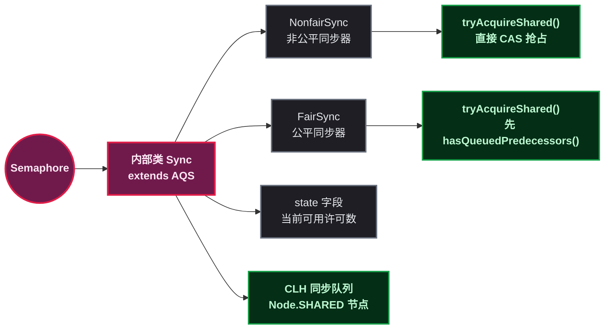
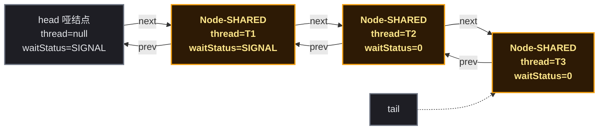
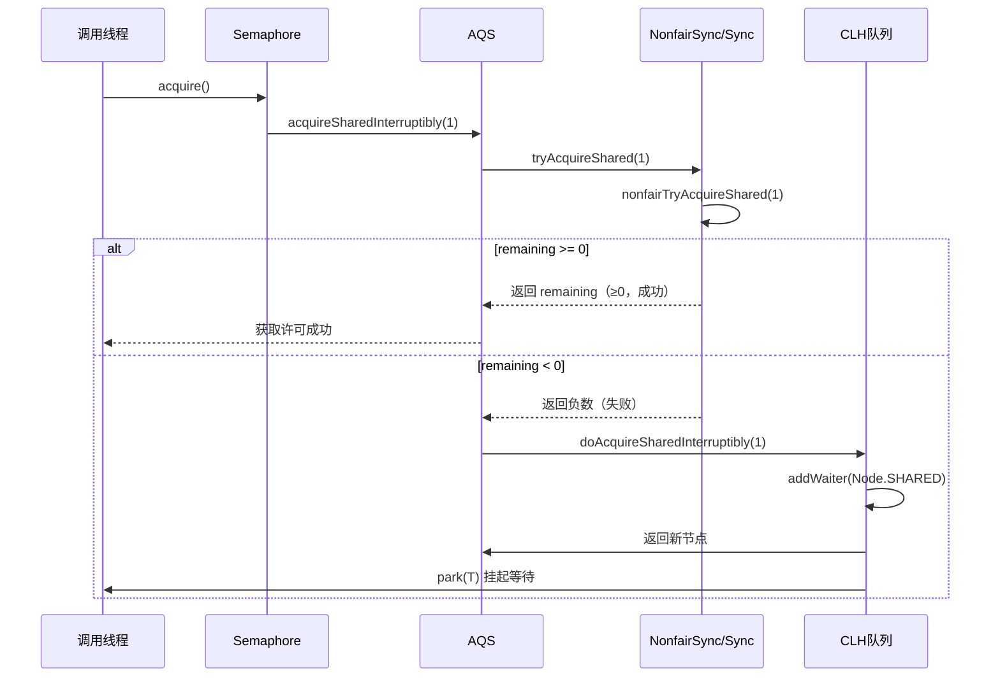
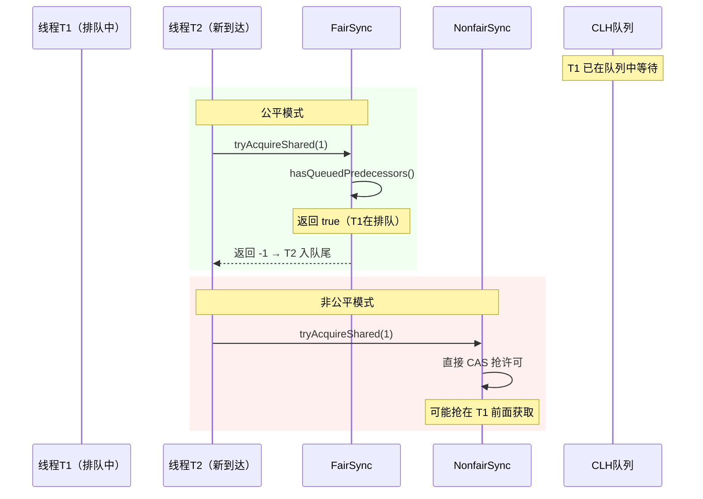
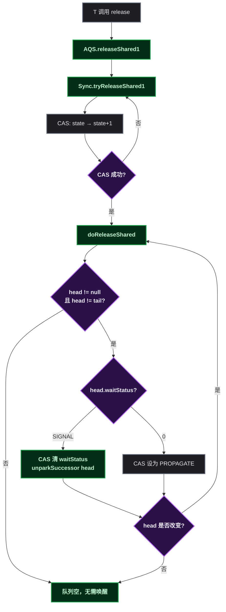
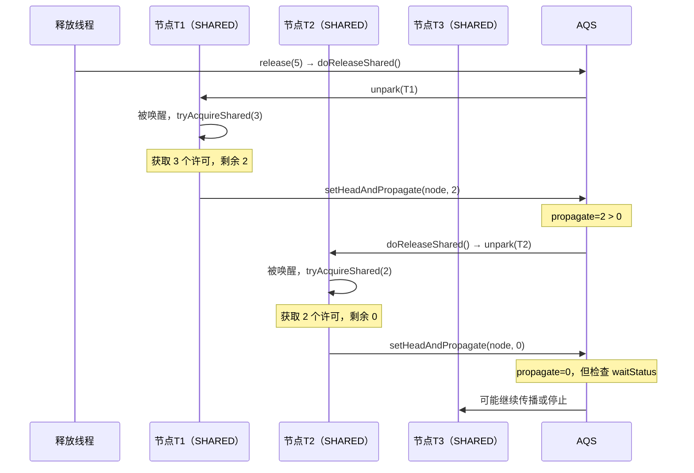
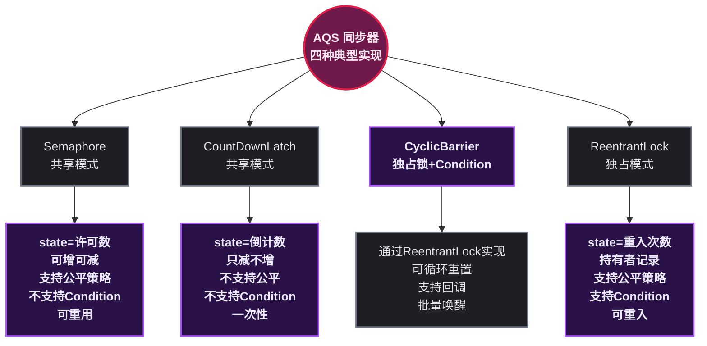
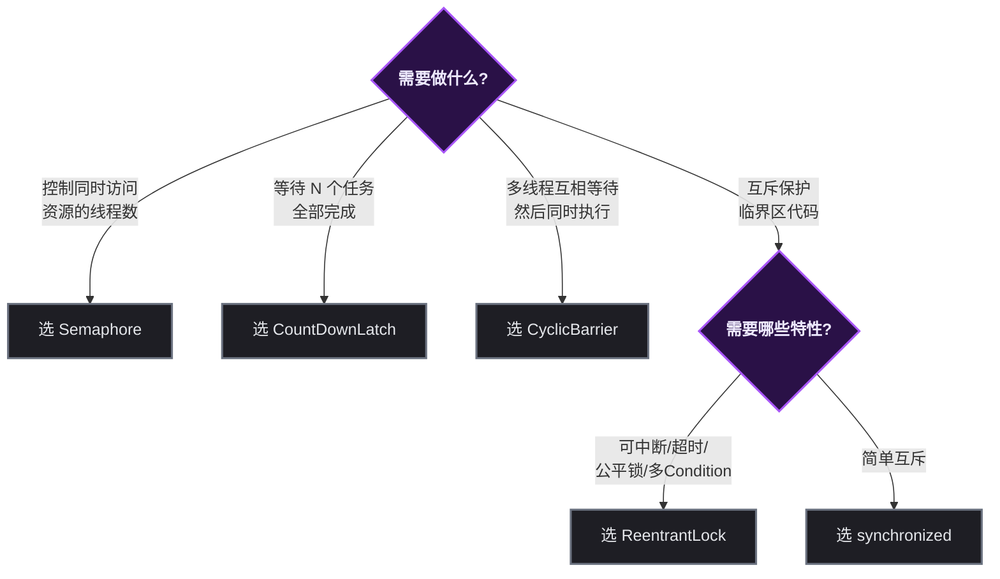
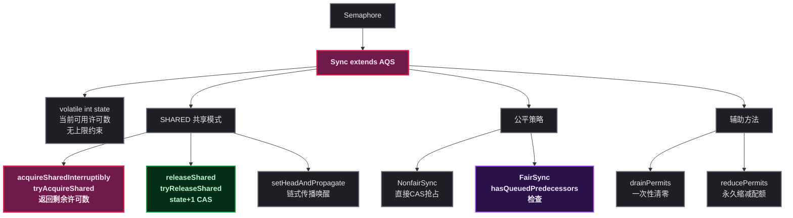

# Semaphore 源码解析：AQS 共享模式、许可传播机制与公平策略实现

## 🚀 道格·李为什么需要一个信号量

信号量（Semaphore）是操作系统教科书里最古老的并发原语之一，由 Edsger Dijkstra 在 1960 年代提出。但在 Java 1.0 ~ 1.4 时代，JDK 里并没有信号量——开发者只能用 `synchronized` 加一个计数器模拟，代码又长又容易出错。

道格·李在设计 JSR 166 时，需要将信号量引入 Java，原因很简单：<strong>`synchronized` 是互斥的（同一时刻只能一个线程进入），而很多并发控制场景需要的是"限制并发数量"而不是"限制到只有 1 个"</strong>。比如数据库连接池最多 10 个并发连接、文件读取最多 3 个线程同时打开、API 限流每秒 100 个请求——这些场景用 `synchronized` 无法表达。

`Semaphore` 的思路是<strong>许可计数</strong>：构造时定义 N 个"许可证"，线程调用 `acquire()` 拿走一个许可（不够就阻塞），用完调用 `release()` 归还。许可与线程没有绑定关系——线程 A 获取的许可可以由线程 B 释放。这个设计很关键：它让 Semaphore 不仅可以用作"限流器"，还可以用作"对象池管理器"或"同步器"。

在 AQS 框架中，`Semaphore` 使用的是<strong>共享模式</strong>（Shared Mode）——多个线程可以同时获取许可，不像 `ReentrantLock` 的独占模式那样一次只唤醒一个线程。

## 🏗️ 核心数据结构

### 🏗️ 整体类层次结构

`Semaphore` 和 `ReentrantLock` 的内部结构高度相似——都是通过内部类 `Sync` 间接继承 AQS，并通过两个子类实现公平/非公平策略。但有一个关键区别：`Semaphore` 使用的是 AQS 的 **共享模式**（Shared Mode），而非独占模式。



```java
// JDK 源码：Semaphore 的核心结构
public class Semaphore implements java.io.Serializable {
    private final Sync sync;  // 唯一的实例字段

    // 默认构造器：非公平策略
    public Semaphore(int permits) {
        sync = new NonfairSync(permits);
    }

    // 指定公平策略
    public Semaphore(int permits, boolean fair) {
        sync = fair ? new FairSync(permits) : new NonfairSync(permits);
    }

    // 所有公开方法都委托给 sync
    public void acquire() throws InterruptedException {
        sync.acquireSharedInterruptibly(1);  // ★ 共享模式入口
    }
    public void release() {
        sync.releaseShared(1);               // ★ 共享模式释放
    }
    // ... 其他方法同理
}
```

这里的关键差异：`acquireSharedInterruptibly(1)` 而非 `acquire(1)`——前者是 AQS 共享模式的入口方法，后者是独占模式的入口。

### 📋 state 字段：许可证计数器的唯一载体

AQS 的 `volatile int state` 字段在 `Semaphore` 中被赋予的语义是 **当前可用许可数**。与 `ReentrantLock` 不同，`state` 不表达"重入次数"和"持有者是谁"，只表达数量。

| state 值 | 含义 | 触发条件 |
|:--------:|------|---------|
| `0` | 无可用许可，后续 acquire 将阻塞 | 所有许可被取走 |
| `N（N > 0）` | 当前有 N 个可用许可 | 初始值 / 部分许可被归还 |
| `N（N > 初始化 permits）` | 可用许可超过了初始值 | 调用 `release()` 次数超过 `acquire()` 次数 |

关键设计：**`release()` 没有上限检查**。如果初始化为 3 个许可，但调用了 5 次 `release()`，state 会变成 8——可用许可可以动态增加，不受初始化值的约束。

### 📐 AQS 共享模式与 CLH 队列

当 `state` 不足时，线程被包装为 **`Node.SHARED`** 节点（区别于 `ReentrantLock` 的 `Node.EXCLUSIVE`），插入 AQS 的 CLH 队列中：



队列结构与 `ReentrantLock` 相同（双向链表），但节点模式为 `SHARED`。这个区别影响唤醒行为：共享模式下，一个节点被唤醒并成功获取许可后，会继续唤醒它的后继节点（传播机制），形成链式唤醒。

```java
// JDK 源码：Node 中的模式常量
static final class Node {
    static final Node SHARED = new Node();    // 共享模式标记
    static final Node EXCLUSIVE = null;       // 独占模式标记
    // ...
}
```

`Semaphore` 的 `addWaiter()` 传入 `Node.SHARED`，而 `ReentrantLock` 传入 `Node.EXCLUSIVE`。

### 📊 Semaphore vs ReentrantLock 在 AQS 层面的对比

| 维度 | Semaphore | ReentrantLock |
|------|-----------|---------------|
| AQS 模式 | 共享模式（Shared） | 独占模式（Exclusive） |
| state 语义 | 可用许可数量，可任意增减 | 0=空闲，N=重入次数 |
| 入口方法 | `acquireSharedInterruptibly(1)` | `acquire(1)` |
| 释放方法 | `releaseShared(1)` | `release(1)` |
| 子类重写 | `tryAcquireShared()` / `tryReleaseShared()` | `tryAcquire()` / `tryRelease()` |
| 节点类型 | `Node.SHARED` | `Node.EXCLUSIVE` |
| 唤醒机制 | `setHeadAndPropagate`（传播唤醒） | `setHead`（只唤醒一个） |
| 许可持有者 | 无持有者概念 | `exclusiveOwnerThread` 记录持有者 |
| Condition | 不支持 | 支持 `newCondition()` |

## 🔄 许可获取流程详解

### 📋 入口方法：acquire() 的完整调用链



### ⚖️ 非公平获取：nonfairTryAcquireShared

```java
// JDK 源码：Sync.nonfairTryAcquireShared()
final int nonfairTryAcquireShared(int acquires) {
    for (;;) {
        int available = getState();
        int remaining = available - acquires;
        if (remaining < 0 ||                          // 许可不足，返回负数
            compareAndSetState(available, remaining)) // CAS 扣减成功
            return remaining;
    }
}
```

这段代码只有两行逻辑，但有三层含义：

1. **`remaining < 0`**：当前许可不足以满足本次请求，直接返回负数，通知 AQS 走排队挂起流程
2. **`compareAndSetState(available, remaining)`**：CAS 尝试将 state 从 `available` 改为 `remaining`。成功则返回剩余许可数（≥0）；失败则说明被其他线程并发修改，继续自旋
3. **`for (;;)` 自旋**：CAS 失败（并发竞争）时重新读取 state 重试，直到成功或许可不足

### 非公平锁的 tryAcquireShared

```java
// JDK 源码：NonfairSync.tryAcquireShared()
protected int tryAcquireShared(int acquires) {
    return nonfairTryAcquireShared(acquires);  // 直接 CAS 抢，不检查队列
}
```

非公平模式下，不管 CLH 队列中是否有等待线程，新来的线程直接 CAS 抢占许可。这可能导致某些排队线程长时间拿不到许可。

### 公平锁的 tryAcquireShared

```java
// JDK 源码：FairSync.tryAcquireShared()
protected int tryAcquireShared(int acquires) {
    for (;;) {
        if (hasQueuedPredecessors())          // ★ 先看有没有人在排队
            return -1;                        // 有人排队则放弃本次竞争，去排队
        int available = getState();
        int remaining = available - acquires;
        if (remaining < 0 ||
            compareAndSetState(available, remaining))
            return remaining;
    }
}
```

与 `ReentrantLock.FairSync` 相同的逻辑：`hasQueuedPredecessors()` 检查 CLH 队列头部是否有比自己等待更久的线程，如果有则返回 -1，自己进队尾排队。

公平与非公平获取的对比时序：



### 🔄 doAcquireSharedInterruptibly：入队后的自旋与挂起

当 `tryAcquireShared` 返回负数后，AQS 调用 `doAcquireSharedInterruptibly`：

```java
// JDK 源码：AQS.doAcquireSharedInterruptibly()（精简）
private void doAcquireSharedInterruptibly(int arg)
    throws InterruptedException {
    final Node node = addWaiter(Node.SHARED);         // ① 创建 SHARED 节点入队尾
    try {
        for (;;) {
            final Node p = node.predecessor();
            if (p == head) {
                int r = tryAcquireShared(arg);        // ② 前驱是 head 时再试一次
                if (r >= 0) {
                    setHeadAndPropagate(node, r);     // ③ 成功：设头节点 + 传播唤醒
                    p.next = null;
                    return;
                }
            }
            if (shouldParkAfterFailedAcquire(p, node) && // ④ 前驱设为 SIGNAL
                parkAndCheckInterrupt())                 // ⑤ park 挂起
                throw new InterruptedException();
        }
    } catch (Throwable t) {
        cancelAcquire(node);
        throw t;
    }
}
```

与 `ReentrantLock` 的 `acquireQueued` 结构相似，但有一个关键区别：**步骤 ③** 调用的是 `setHeadAndPropagate` 而非 `setHead`。这是共享模式的核心——获取成功后不仅要设置头节点，还要检查剩余许可数，如果还有余量则继续唤醒后继节点。

## ⚙️ 许可释放与传播唤醒机制

### 📤 tryReleaseShared：归还许可

```java
// JDK 源码：Sync.tryReleaseShared()
protected final boolean tryReleaseShared(int releases) {
    for (;;) {
        int current = getState();
        int next = current + releases;                 // state + releases
        if (next < current) // 整数溢出检测
            throw new Error("Maximum permit count exceeded");
        if (compareAndSetState(current, next))         // CAS 更新
            return true;
    }
}
```

三个关键细节：

1. **无上限检查**：不对比初始化的 `permits` 值。state 为 3 时调 `release(5)` 会把 state 变成 8。这是设计决策——信号量允许动态增加许可
2. **无持有者校验**：不检查调用者是否"持有"许可。任何线程都可以调用 `release()`，这与 `ReentrantLock` 的 `unlock()` 必须由持有者调用形成鲜明对比
3. **溢出检测**：`next < current` 用于检测整数溢出，确保 state 不会超过 `Integer.MAX_VALUE`

### 📢 releaseShared → doReleaseShared：传播唤醒

```java
// JDK 源码：AQS.releaseShared()
public final boolean releaseShared(int arg) {
    if (tryReleaseShared(arg)) {          // 归还许可成功
        doReleaseShared();                // 唤醒头节点的后继
        return true;
    }
    return false;
}
```

`doReleaseShared()` 的核心逻辑：

```java
// JDK 源码：AQS.doReleaseShared()（精简）
private void doReleaseShared() {
    for (;;) {
        Node h = head;
        if (h != null && h != tail) {
            int ws = h.waitStatus;
            if (ws == Node.SIGNAL) {
                if (!h.compareAndSetWaitStatus(Node.SIGNAL, 0))
                    continue;                          // CAS 失败则重试
                unparkSuccessor(h);                    // unpark 后继节点线程
            }
            else if (ws == 0 &&
                     !h.compareAndSetWaitStatus(0, Node.PROPAGATE))
                continue;
        }
        if (h == head)                                 // head 未改变则退出
            break;
    }
}
```

释放流程图：



### 📐 setHeadAndPropagate：共享模式的传播唤醒链

这是 Semaphore 区别于 ReentrantLock 最核心的方法：

```java
// JDK 源码：AQS.setHeadAndPropagate()（精简）
private void setHeadAndPropagate(Node node, int propagate) {
    Node h = head;
    setHead(node);                                     // ① 设当前节点为新 head
    if (propagate > 0 ||                               // ② 还有剩余许可
        h == null || h.waitStatus < 0 ||
        (h = head) == null || h.waitStatus < 0) {
        Node s = node.next;
        if (s == null || s.isShared())                 // ③ 后继是 SHARED 节点
            doReleaseShared();                         // ④ 继续唤醒后继
    }
}
```

传播机制的工作流程：



传播的关键条件 `propagate > 0`：当获取成功后还有剩余许可（propagate 是 `tryAcquireShared` 的返回值，即剩余许可数），说明后续节点可能也能获取到许可，于是继续唤醒。如果许可刚好用完（propagate = 0），则停止传播。

> 注：即使 propagate = 0，JDK 也会通过 `h.waitStatus < 0` 的检查来应对并发场景下可能遗漏的唤醒——这是 JDK 6 中修复的一个并发 bug（`PROPAGATE` 状态的引入即与此相关）。

## 🛠️ 辅助方法：drainPermits 与 reducePermits

### 🧹 drainPermits：一次性取走全部许可

```java
// JDK 源码：Sync.drainPermits()
final int drainPermits() {
    for (;;) {
        int current = getState();
        if (current == 0 || compareAndSetState(current, 0))
            return current;          // 返回清零前的许可数
    }
}
```

典型用途：管理员操作——当需要暂停所有外部请求以便执行维护时，调用 `drainPermits()` 一次性清空所有许可，让后续请求全部排队。返回值为清空前剩余的许可数。

### 📉 reducePermits：缩减许可总数

```java
// JDK 源码：Sync.reducePermits()
final void reducePermits(int reductions) {
    for (;;) {
        int current = getState();
        int next = current - reductions;
        if (next > current)          // 下溢检测
            throw new Error("Permit count underflow");
        if (compareAndSetState(current, next))
            return;
    }
}
```

这个方法在 `Semaphore` 中是 `protected` 的，仅子类可以调用。用途：当底层资源数量因为外部原因减少了（如连接池中的某台数据库宕机），可以通过此方法缩减许可配额。注意它只减不增。

### 🌐 三者的使用场景区分

| 方法 | 阻塞? | 对 state 的影响 | 典型场景 |
|------|:---:|------|---------|
| `acquire(n)` | 是（不足时阻塞） | 减 n | 正常获取资源 |
| `drainPermits()` | 否（立即返回） | 清零 | 紧急暂停所有访问 |
| `reducePermits(n)` | 否（立即返回） | 减 n | 永久缩减资源配额 |

## 🛠️ 日常开发中的常用方法

### 高频 API 速查

| 方法 | 签名 | 用途 | 频率 |
|------|------|------|:---:|
| `acquire()` | `void acquire()` | 获取 1 个许可，阻塞，响应中断 | 高 |
| `release()` | `void release()` | 归还 1 个许可 | 高 |
| `tryAcquire()` | `boolean tryAcquire()` | 非阻塞尝试，立即返回 | 中 |
| `tryAcquire(timeout)` | `boolean tryAcquire(long, TimeUnit)` | 带超时的尝试获取 | 中 |
| `acquire(n)` | `void acquire(int)` | 批量获取 n 个许可 | 中 |
| `release(n)` | `void release(int)` | 批量归还 n 个许可 | 中 |
| `availablePermits()` | `int availablePermits()` | 查询当前可用许可数 | 低 |
| `drainPermits()` | `int drainPermits()` | 一次性取走全部许可 | 低 |
| `getQueueLength()` | `int getQueueLength()` | 查询等待队列长度 | 低 |
| `isFair()` | `boolean isFair()` | 查询是否为公平模式 | 低 |

### 🛠️ 典型用法示例

**1. acquire() / release() —— 基本并发控制**

```java
Semaphore semaphore = new Semaphore(5);  // 最多 5 并发
semaphore.acquire();
try {
    // 访问受限资源
} finally {
    semaphore.release();
}
```

**2. tryAcquire() —— 非阻塞尝试，拿不到许可就直接返回**

```java
Semaphore semaphore = new Semaphore(3);
if (semaphore.tryAcquire()) {
    try {
        // 获取到许可，执行操作
    } finally {
        semaphore.release();
    }
} else {
    // 没拿到许可，执行降级逻辑（如返回缓存数据）
    return fallbackResult;
}
```

**3. tryAcquire(timeout) —— 等一段时间的限流**

```java
Semaphore semaphore = new Semaphore(10);
if (semaphore.tryAcquire(500, TimeUnit.MILLISECONDS)) {
    try {
        // 500ms 内拿到许可
    } finally {
        semaphore.release();
    }
} else {
    // 超时，触发熔断或限流告警
    throw new ServiceUnavailableException("系统繁忙，请稍后重试");
}
```

**4. acquire(n) / release(n) —— 批量获取与归还**

```java
Semaphore semaphore = new Semaphore(10);
// 一次需要 3 个许可（例如需要同时占用 3 个数据库连接）
semaphore.acquire(3);
try {
    // 原子操作：三个资源同时被占用
} finally {
    semaphore.release(3);
}
```

批量获取的关键特性是 **原子性**：`acquire(3)` 要么一次性获取 3 个许可，要么一个都不获取（阻塞等待）。不会出现"拿到 2 个，差 1 个就阻塞"的半成功状态。

**5. drainPermits() —— 紧急暂停所有访问**

```java
Semaphore semaphore = new Semaphore(20);
// 管理员操作：提前耗尽所有许可
int drained = semaphore.drainPermits();
System.out.println("已清空 " + drained + " 个许可，后续请求将全部排队");
// 执行维护操作...
// 维护完成后恢复
semaphore.release(drained);
```

**6. 实现简易连接池**

```java
class SimpleConnectionPool {
    private final Semaphore semaphore;
    private final List<Connection> pool;

    public SimpleConnectionPool(int size) {
        semaphore = new Semaphore(size);
        pool = new ArrayList<>();
        for (int i = 0; i < size; i++) pool.add(createConnection());
    }

    public Connection borrow() throws InterruptedException {
        semaphore.acquire();
        synchronized (pool) { return pool.remove(0); }
    }

    public void release(Connection conn) {
        synchronized (pool) { pool.add(conn); }
        semaphore.release();
    }
}
```

### 🌐 典型应用场景速查

| 场景 | Semaphore 配置 | 说明 |
|------|---------------|------|
| 数据库连接池 | `new Semaphore(20)` | 限制最多 20 个并发连接 |
| API 限流 | `new Semaphore(100)` | 同一时刻最多 100 个请求进入 |
| 文件读写并发控制 | `new Semaphore(5)` | 同时最多 5 个线程操作文件 |
| 互斥锁 | `new Semaphore(1)` | 等价于非重入版互斥锁 |
| 多资源批量操作 | `acquire(3)` 一次占 3 个 | 确保原子性多资源占用 |

## 🚦 Semaphore vs 同类并发工具的对比



| 维度 | Semaphore | CountDownLatch | CyclicBarrier | ReentrantLock |
|------|-----------|----------------|---------------|---------------|
| AQS 模式 | 共享（`acquireShared`） | 共享（`acquireShared`） | 通过内部的 `ReentrantLock` 间接使用 | 独占（`acquire`） |
| state 语义 | 可用许可数，双向 | 倒计数，单向递减 | 内部 `count` 字段倒计数 | 0=空闲，N=重入次数 |
| 可重用 | 是（许可归还即可） | 否（一次性，到 0 无法重置） | 是（循环，到达 0 后自动重置） | 是 |
| 公平策略 | 支持（FairSync/NonfairSync） | 不支持 | 不支持（内部 ReentrantLock 使用非公平） | 支持 |
| 持有者校验 | 无（任意线程可 release） | 无 | 无 | 有（必须持有者 unlock） |
| Condition 支持 | 不支持 | 不支持 | 支持（内部 await/signal） | 支持 |
| 核心场景 | 控制并发数量 | 等待一批任务全部完成 | 多线程互相等待到齐 | 互斥 + 条件同步 |
| 典型配置 | `new Semaphore(10)` | `new CountDownLatch(10)` | `new CyclicBarrier(10)` | `new ReentrantLock()` |

### 🎯 选型决策树



## 🎯 总结

### 🔭 知识全景图



### 📋 核心概念速查

| 概念 | 一句话解释 | 关键源码位置 |
|------|-----------|-------------|
| 共享模式 | 多个线程可同时获取资源，通过 state 计数控制 | `AQS.acquireSharedInterruptibly()` |
| state=许可数 | AQS state 被复用为"当前可用许可证数量" | `Sync(int permits) { setState(permits); }` |
| nonfairTryAcquireShared | CAS 自旋扣减 state，不足则返回负数 | `Sync.nonfairTryAcquireShared()` |
| 公平检查 | `hasQueuedPredecessors()` 保证 FIFO 顺序 | `FairSync.tryAcquireShared()` |
| 传播唤醒 | 共享节点获取成功后继续唤醒后继共享节点 | `AQS.setHeadAndPropagate()` |
| 无持有者 | 任意线程可 release，无 exclusiveOwnerThread | `Sync.tryReleaseShared()` |
| 无上限 release | release 不对比初始值，state 可超过 permits | `tryReleaseShared` 中只有溢出检查 |
| drainPermits | CAS 将 state 清零，返回清零前的值 | `Sync.drainPermits()` |

### 一条完整的调用链（非公平模式 acquire + release）

```
线程A acquire()
  → Semaphore.acquire()
    → Sync.acquireSharedInterruptibly(1)
      → NonfairSync.tryAcquireShared(1)
        → nonfairTryAcquireShared(1)
          → state=3, remaining=2≥0, CAS(3→2) 成功 → 返回 2
      → 返回值≥0，acquire 成功

线程B acquire() （state=2，还需 3 个许可）
  → nonfairTryAcquireShared(3)
    → state=2, remaining=-1<0 → 返回 -1
  → doAcquireSharedInterruptibly(3)
    → addWaiter(Node.SHARED) → 入 CLH 队尾
    → 前驱是 head，再次 tryAcquireShared → 仍失败
    → shouldParkAfterFailedAcquire → 前驱 waitStatus 设为 SIGNAL
    → parkAndCheckInterrupt → park(B)

线程A release(3)
  → Semaphore.release(3)
    → Sync.releaseShared(3)
      → tryReleaseShared(3) → state 2→5, CAS 成功 → true
      → doReleaseShared()
        → head.waitStatus==SIGNAL → CAS 清为 0 → unparkSuccessor → unpark(B)

线程B 被唤醒
  → 在 doAcquireSharedInterruptibly 循环中继续
    → 前驱是 head → tryAcquireShared(3)
      → state=5, remaining=2≥0, CAS(5→2) 成功 → 返回 2
    → setHeadAndPropagate(node, 2)  // propagate=2>0
      → setHead(B)
      → 后继是 SHARED 节点 → doReleaseShared() → 继续传播唤醒
```

以上就是 `Semaphore` 从使用到源码的完整分析。与 `ReentrantLock` 的独占模式不同，`Semaphore` 的核心设计思想在于 **"共享模式 + 许可计数 + 传播唤醒"**——state 记录剩余资源数量，共享节点通过 `tryAcquireShared` 竞争资源，获取成功后通过 `setHeadAndPropagate` 链式唤醒后续节点，在许可充足时实现批量放行的高效调度。
