# synchronized 锁升级机制：从对象头到重量级锁的完整路径

## 🔒 一、HotSpot 团队为什么要设计锁升级机制

在 JDK 1.0 时代，`synchronized` 直接对应操作系统的 Mutex（互斥量）。每次加锁都要陷入内核态，哪怕只有一条线程在访问、根本不存在竞争。这就像你住的小区只有一个停车位，每次出门都要跑去物业办公室办手续——哪怕车位从来没人跟你抢。

2004 年，随着 JDK 5 和 JSR 133 的发布，Java 并发性能成了焦点。道格·李的 JUC 提供了 `ReentrantLock`、`Semaphore` 等无锁/CAS 工具，它们的性能远超 `synchronized`。一时间，社区舆论变成了"别用 `synchronized`，它是重量级锁、太慢"。

**但 `synchronized` 有一个 JUC 工具永远比不了的优势：它是语言内置的——不需要显式 `lock()` / `unlock()`，不用怕忘了释放锁导致死锁。** 如果因为性能差就被开发者抛弃，将是 Java 语言的重大损失。

HotSpot JVM 团队（主要贡献者包括 David Dice 等人）在 JDK 6 中给出了答案：**锁升级（Lock Escalation）机制**。核心思路是——根据"大多数锁没有竞争"这个经验事实，让 `synchronized` 从最轻的模式开始：

- **偏向锁**（Biased Locking）：只有一条线程用这个锁时，Mark Word 里记个线程 ID 就行，不需要 CAS，几乎零开销。
- **轻量级锁**（Lightweight Locking）：两个线程交替使用（无实际竞争）时，在栈上分配 Lock Record，用 CAS 交换 Mark Word。
- **重量级锁**（Heavyweight Locking）：真有竞争时，才膨胀为 OS Mutex，线程阻塞等待。

这个设计让 `synchronized` 在大多数实际场景中的性能追平甚至超过了 `ReentrantLock`。锁升级的判断依据只有 Mark Word 中的 3 个比特位。

## 📦 2️⃣ 二、对象头（Object Header）：JVM 如何表示"锁"

### 📦 2.1 堆中对象的内存布局

Java 对象在堆中的内存布局分为四个区域。理解这个布局是理解锁升级的前提：

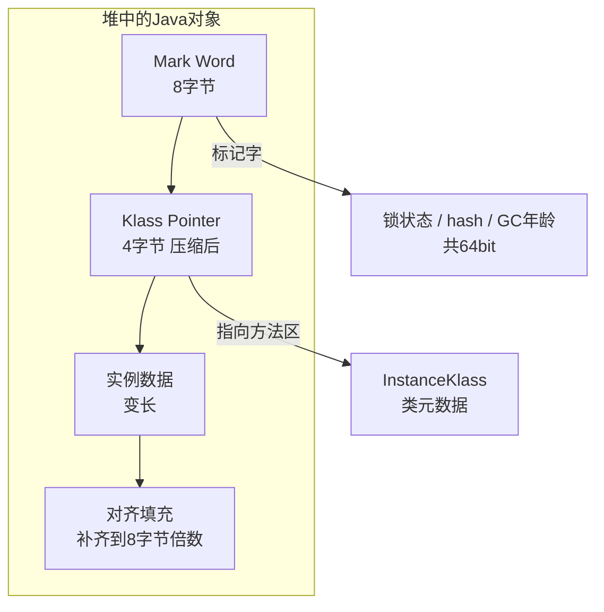

| 区域                    |               大小（64位JVM，开启压缩）               | 说明                                                            |
| ----------------------- | :---------------------------------------------------: | --------------------------------------------------------------- |
| **Mark Word**     |                    8 字节（64 位）                    | 存储锁状态、hash、GC 年龄。不同锁状态下同一块内存复用为不同结构 |
| **Klass Pointer** | 4 字节（默认开启压缩指针 `-XX:+UseCompressedOops`） | 指向方法区中该对象所属的类元数据（InstanceKlass）               |
| **实例数据**      |                         变长                         | 对象中声明的实例字段（包括从父类继承的）                        |
| **对齐填充**      |                        补齐用                        | HotSpot 要求对象起始地址是 8 字节的整数倍，不足则填充           |

### 🔢 2.2 Mark Word 的五种状态

Mark Word 的 64 位中，最后 3 位是 **biased_lock** （1 位）+ **lock** （2 位）。JVM 通过读取这 3 位判断对象处于哪种锁状态。状态不同，前面 61 位的含义也完全不同：

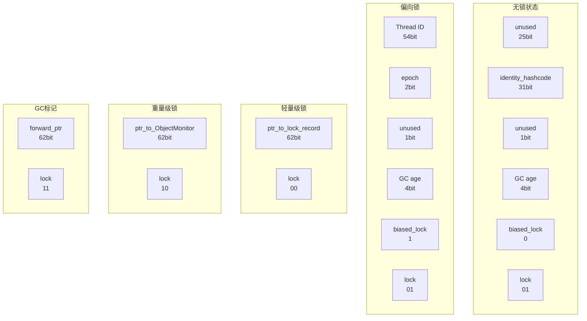

将这五种状态汇总为一张判断表。JVM 在进入 synchronized 块时，读取的就是这最后 3 位：

| biased_lock（第 3 位） | lock（低 2 位） | 3 位整体值 | 锁状态   | Mark Word 中存储的内容                       |
| :--------------------: | :-------------: | :--------: | -------- | -------------------------------------------- |
|           0           |       01       |  `001`  | 无锁     | 31 位 identity hashcode + 4 位 GC 年龄       |
|           1           |       01       |  `101`  | 偏向锁   | 54 位偏向线程 ID + 2 位 epoch + 4 位 GC 年龄 |
|           —           |       00       |  `×00`  | 轻量级锁 | 62 位指向栈中 Lock Record 的指针             |
|           —           |       10       |  `×10`  | 重量级锁 | 62 位指向 ObjectMonitor 的指针               |
|           —           |       11       |  `×11`  | GC 标记  | 62 位转发指针（forwarding pointer）          |

其中 `—` 表示在轻量级锁、重量级锁和 GC 标记状态下，biased_lock 位被指针复用，没有独立含义。

HotSpot 中这段逻辑定义在 `markOop.hpp` 中：

```cpp
// hotspot/src/share/vm/oops/markOop.hpp（关键枚举值）
enum {
    locked_value             = 0,    // 00 → 轻量级锁
    unlocked_value           = 1,    // 01 → 无锁
    monitor_value            = 2,    // 10 → 重量级锁
    marked_value             = 3,    // 11 → GC 标记
    biased_lock_pattern      = 5     // 101（二进制）→ 偏向锁
};

// JVM 判断锁状态的核心逻辑
bool is_biased()  const { return mask_bits(value, biased_lock_mask_in_place); }
bool is_neutral() const { return mask_bits(value, biased_lock_mask_in_place | lock_mask_in_place) == unlocked_value; }
```

JVM 在每次进入 synchronized 块时，只需要用 `mark_word & 0b111` 取出低 3 位，然后走对应的分支。这个判断只需要一条位与指令，非常快。

### 📌 2.3 用 JOL 观察 Mark Word

JOL（Java Object Layout）是 OpenJDK 提供的工具，可以直接打印对象的内存布局。下面用 JOL 观察一把锁从无到有过程中 Mark Word 的变化：

```java
// 依赖: org.openjdk.jol:jol-core:0.16
import org.openjdk.jol.info.ClassLayout;

public class MarkWordViewer {
    public static void main(String[] args) {
        Object lock = new Object();

        // 打印无锁状态的对象头
        System.out.println("=== 无锁状态 ===");
        System.out.println(ClassLayout.parseInstance(lock).toPrintable());

        synchronized (lock) {
            // 打印加锁后的对象头
            System.out.println("=== 加锁后（当前线程持有锁） ===");
            System.out.println(ClassLayout.parseInstance(lock).toPrintable());
        }

        // 打印解锁后的对象头
        System.out.println("=== 解锁后 ===");
        System.out.println(ClassLayout.parseInstance(lock).toPrintable());
    }
}
```

输出分析（64 位 JVM）：

```
=== 无锁状态 ===
OFFSET  SIZE   TYPE DESCRIPTION            VALUE
     0     4        (object header)        01 00 00 00
     4     4        (object header)        00 00 00 00
     8     4        (object header)        00 10 00 00   ← Klass Pointer
    12     4        (object alignment gap)

=== 加锁后（当前线程持有锁） ===
OFFSET  SIZE   TYPE DESCRIPTION            VALUE
     0     4        (object header)        98 f3 1a 03   ← Mark Word 变了！
     4     4        (object header)        00 00 00 00
     8     4        (object header)        00 10 00 00
    12     4        (object alignment gap)
```

无锁时 Mark Word 的 8 个字节是 `00 00 00 00 00 00 00 01`（小端序），末尾的 `01` 即 `lock=01, biased_lock=0`，无锁状态。

加锁后 Mark Word 变了一个地址值（如 `03 1a f3 98`），这是因为 JVM 把 Mark Word 改成了指向栈中 Lock Record 的指针——`lock=00`，轻量级锁。

## ⬆️ 三、锁升级的总体路径

在展开每一级锁之前，先建立全局视角。synchronized 的锁升级是一个 **只升不降** 的单向过程：

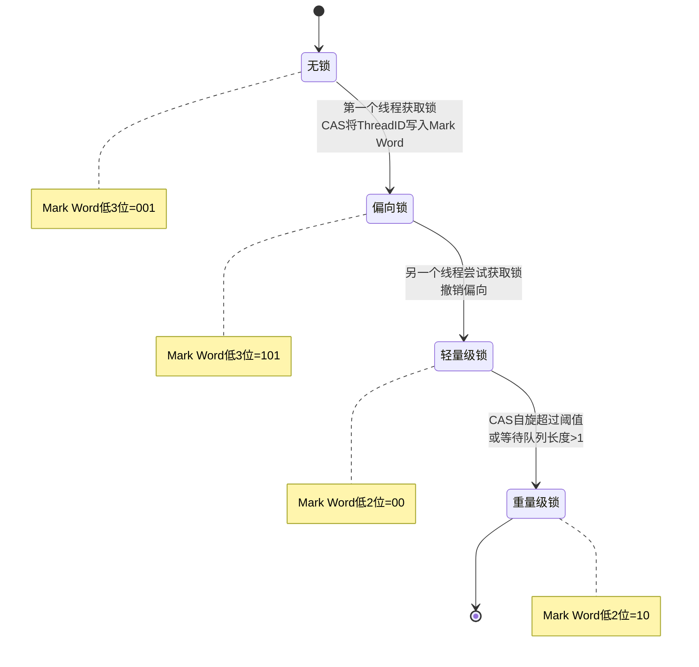

为什么只升不降？因为降锁需要判断"是否所有线程都已经离开同步块"——这个判断本身需要全局同步，成本比直接升为重量级锁更高。HotSpot 的选择是："宁可留在高级别，也不为降级付出额外的判断成本"。唯一的例外是偏向锁的批量撤销（后面详述）。

四级锁的核心区别：

| 维度               | 偏向锁                               | 轻量级锁                                | 重量级锁                                            |
| ------------------ | ------------------------------------ | --------------------------------------- | --------------------------------------------------- |
| **存储位置** | Mark Word 存线程 ID                  | Mark Word 存指向栈中 Lock Record 的指针 | Mark Word 存指向 Native 内存中 ObjectMonitor 的指针 |
| **加锁操作** | 比较线程 ID（无 CAS）                | CAS 设置 Mark Word                      | CAS 设置 ObjectMonitor._owner，失败则 OS Mutex 挂起 |
| **解锁操作** | 无操作（退出同步块时不改 Mark Word） | CAS 恢复 Mark Word                      | 设置 _owner=null，唤醒 EntryList 队头线程           |
| **竞争处理** | 撤销并升级                           | 自旋重试 CAS → 膨胀                    | OS Mutex 管理等待队列                               |
| **适用场景** | 同一线程反复进入                     | 两个线程交替执行                        | 多个线程同时争抢                                    |

接下来逐级展开每一把锁的内部机制。

## 4️⃣ 四、偏向锁（Biased Locking）

### ❓ 4.1 解决的问题

很多类（如 `StringBuffer`、`Vector`）的设计中，同步方法被频繁调用，但大多数情况下只有 **同一个线程** 在调用。在没有偏向锁时，即使没有第二个线程，每次进入 synchronized 块也要执行一次 CAS 操作（至少几十个 CPU 周期）。

偏向锁的核心思路：`<span style="color:red">`如果一把锁从始至终只被一个线程获取，就不需要每次加锁都执行 CAS——在 Mark Word 中记下这个线程的 ID，以后这个线程再来的时候，只看一眼 Mark Word 就够了。

### 🔒 4.2 加锁过程（逐步拆解）

**线程 T1 第一次获取偏向锁** ：

```
步骤1：检查 Mark Word 低3位
       mark & 0b111
       ├── == 001（无锁，未偏向） → 可以偏向
       │   继续步骤2
       └── == 101（已偏向）
           比较 Mark Word 中的ThreadID
           ├── ThreadID == T1 → 直接进入（无 CAS！一步完成）
           └── ThreadID != T1 → 撤销偏向（见4.4节）

步骤2：CAS 写入偏向信息
       构造新的Mark Word:
       [ThreadID(T1) | epoch | unused | age | biased_lock=1 | lock=01]
       CAS(&obj.mark_word, old_value, new_value)
       ├── 成功 → 偏向到T1，进入同步块
       └── 失败 → 有其他线程同时CAS，升级为轻量级锁
```

关键点：`<span style="color:red">`偏向锁的第一次获取需要 CAS，但之后同一个线程再次获取时不需要任何原子操作——只需要一次普通的 64 位读取和比较。

**为什么退出同步块时不释放偏向锁** ？这是偏向锁和另外两级锁的本质区别：偏向锁的持有者退出同步块时， **不修改 Mark Word** 。Mark Word 仍然保留着偏向线程的 ID。只有当另一个线程尝试获取这把锁时，才触发撤销。

```java
// 偏向锁"不释放"的演示
Object lock = new Object();

// T1: 第一次synchronized → CAS写入偏向T1
synchronized (lock) { /* ... */ }
// T1退出同步块，但Mark Word仍然是偏向T1！

// T1: 第二次synchronized → 直接比较ThreadID，无需CAS
synchronized (lock) { /* ... */ }
// 仍然是偏向T1，锁根本没动过
```

### 🎯 ↩️ 4.3 偏向锁撤销（Revocation）

撤销发生在 **VM 安全点（Safepoint）** 。在安全点，所有 Java 线程被暂停，JVM 可以安全地检查任意线程的栈帧。

撤销的完整流程：

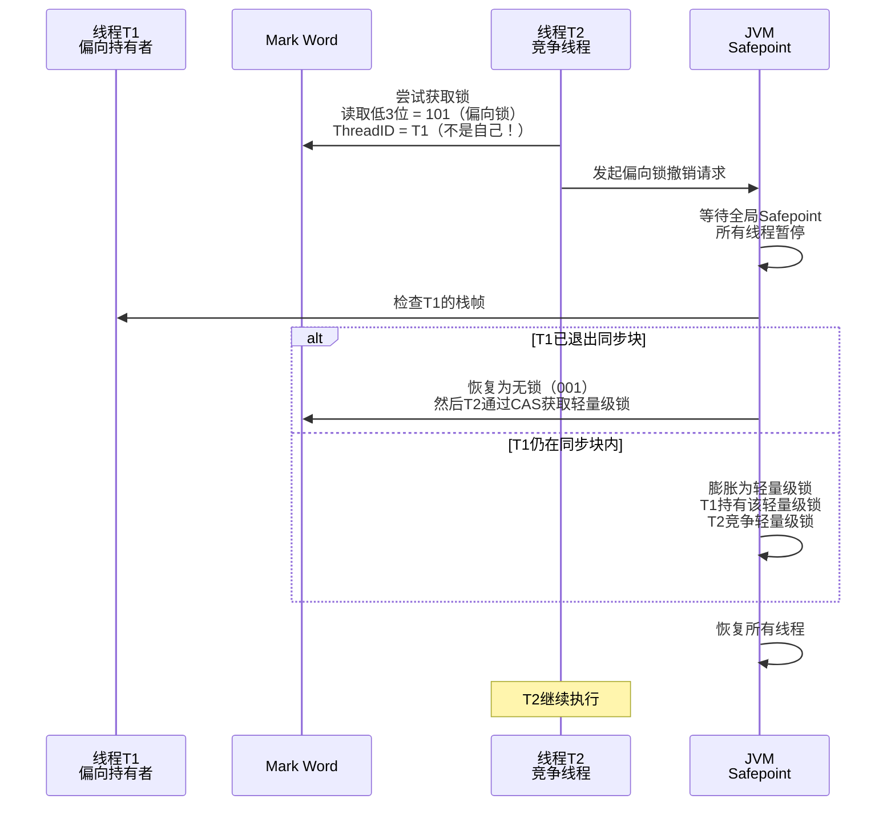

撤销的代价很高——Safepoint 意味着所有线程暂停。这就是为什么在激烈竞争场景下偏向锁会拖累性能：每次撤销都要等全局暂停。

### ↩️ 4.4 批量重偏向与批量撤销

如果一个类的对象频繁发生偏向锁撤销（撤销次数达到阈值），JVM 会认为偏向策略对这类对象失效。HotSpot 采取两步策略：

| 阶段                 | 触发条件                                                                                                      | JVM 行为                                                                                                                                                                              |
| -------------------- | ------------------------------------------------------------------------------------------------------------- | ------------------------------------------------------------------------------------------------------------------------------------------------------------------------------------- |
| **批量重偏向** | 某个类的偏向锁撤销次数在 20 秒内达到**20 次** （`-XX:BiasedLockingBulkRebiasThreshold=20`）           | JVM 认为这些对象只是偏向了错误的线程（不是偏向策略本身有问题）。将该类所有对象的 epoch 值 + 1。epoch 值变了之后，旧的偏向线程 ID 失效，对象可以被重新偏向到新线程，但不需要走撤销流程 |
| **批量撤销**   | 批量重偏向后，撤销次数继续增加，总撤销次数达到**40 次** （`-XX:BiasedLockingBulkRevokeThreshold=40`） | JVM 认为这个类**根本不适合** 偏向锁。将该类的所有对象标记为"不可偏向"，此后新对象在创建时就以无锁状态初始化（biased_lock=0），不再尝试偏向                                      |

epoch 的作用：epoch 是一个 2 位的版本号，存储在类的元数据中，也复制到每个对象的 Mark Word 中。当 JVM 批量重偏向时，增加类级别的 epoch，但旧对象 Mark Word 中的 epoch 是旧的——下次线程访问这些旧对象时，发现 epoch 不匹配，就会 CAS 写入新线程 ID（这不算撤销，只是一次 CAS）。

注意：JDK 15 起偏向锁默认禁用（`-XX:+UseBiasedLocking` 默认 false），JDK 18 中 `UseBiasedLocking` 被标记为废弃（deprecated）。原因是现代应用大多使用线程池，线程竞争频繁，偏向锁的撤销成本超过了它的收益。

### 🧪 4.5 偏向锁的 JOL 验证

```java
// JVM参数: -XX:+UseBiasedLocking -XX:BiasedLockingStartupDelay=0
// BiasedLockingStartupDelay=0 禁用偏向锁的4秒启动延迟
public class BiasedLockDemo {
    public static void main(String[] args) throws Exception {
        Object lock = new Object();

        System.out.println("=== 刚创建（可偏向，但还未偏向） ===");
        System.out.println(ClassLayout.parseInstance(lock).toPrintable());

        synchronized (lock) {
            System.out.println("=== 第一次加锁（偏向到main线程） ===");
            System.out.println(ClassLayout.parseInstance(lock).toPrintable());
        }

        System.out.println("=== 解锁后（仍偏向main线程） ===");
        System.out.println(ClassLayout.parseInstance(lock).toPrintable());

        // 另一个线程竞争 → 触发撤销
        new Thread(() -> {
            synchronized (lock) {
                System.out.println("=== T2加锁（撤销后升级为轻量级锁） ===");
                System.out.println(ClassLayout.parseInstance(lock).toPrintable());
            }
        }).start();
        Thread.sleep(1000);
    }
}
```

**输出解读** ：

- 刚创建时：`01 00 00 00 00 00 00 00` → 低 3 位 `001`，无锁但 **可偏向** （biased_lock=0 只是因为还没偏过）
- 第一次加锁：`01 00 00 00 00 20 d0 1f` → 这 8 字节的高位包含了线程 ID，低 3 位 `101` = 已偏向
- 解锁后：Mark Word 不变！仍然是偏向 main 线程的
- T2 竞争后：Mark Word 变了一个 62 位指针，低 2 位 `00` = 轻量级锁

## 5️⃣ 五、轻量级锁（Lightweight Lock）

### 🏗️ 5.1 数据结构：Lock Record

轻量级锁的核心数据结构是 **Lock Record** （BasicLock），分配在 **线程的栈帧** 中。每个进入 synchronized 块的线程，在自己的栈上分配一个 Lock Record。

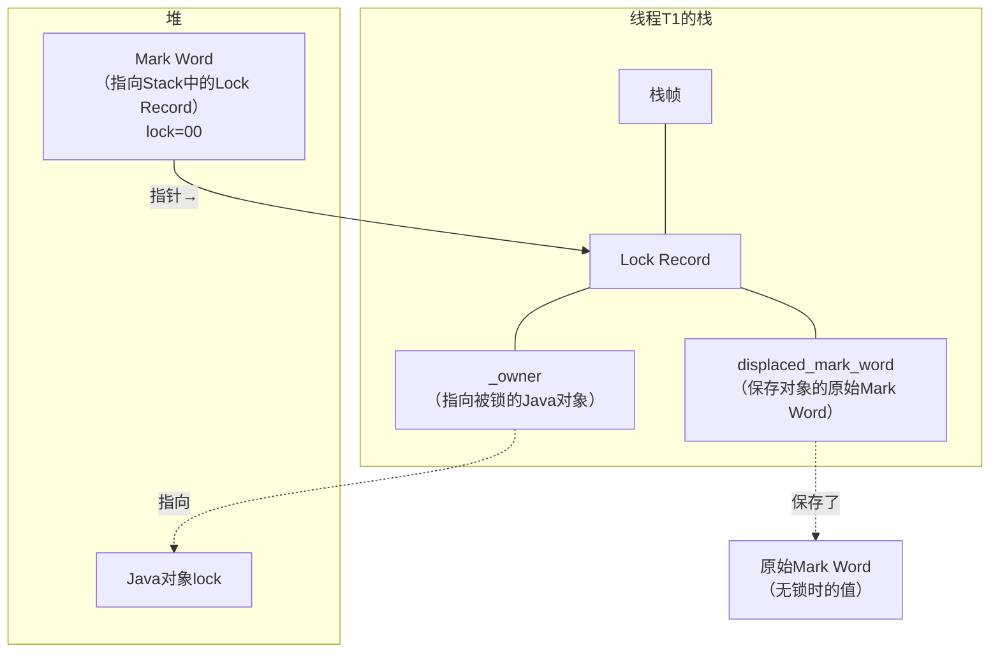

HotSpot 中 Lock Record 的定义（`basicLock.hpp`）：

```cpp
class BasicLock {
    volatile markOop _displaced_header;  // 保存对象原始的 Mark Word
    // BasicObjectLock 中包含一个 _lock（BasicLock）和一个 _obj（指向被锁对象的指针）
};

class BasicObjectLock {
    BasicLock _lock;
    oop       _obj;    // 指向被 synchronized 锁住的那个 Java 对象
};
```

Lock Record 的两个核心字段：

- `_displaced_header`：保存锁对象 **原来的** Mark Word。解锁时需要把它恢复回去
- `_obj`（在 BasicObjectLock 中）：指向被锁的 Java 对象，用于关联栈上的锁记录和堆中的对象

### 🔒 5.2 加锁过程（逐行拆解）

轻量级锁的加锁，本质是一次 CAS 操作：`<span style="color:red">`尝试把锁对象的 Mark Word 从"无锁值"替换为"指向当前线程 Lock Record 的指针"。

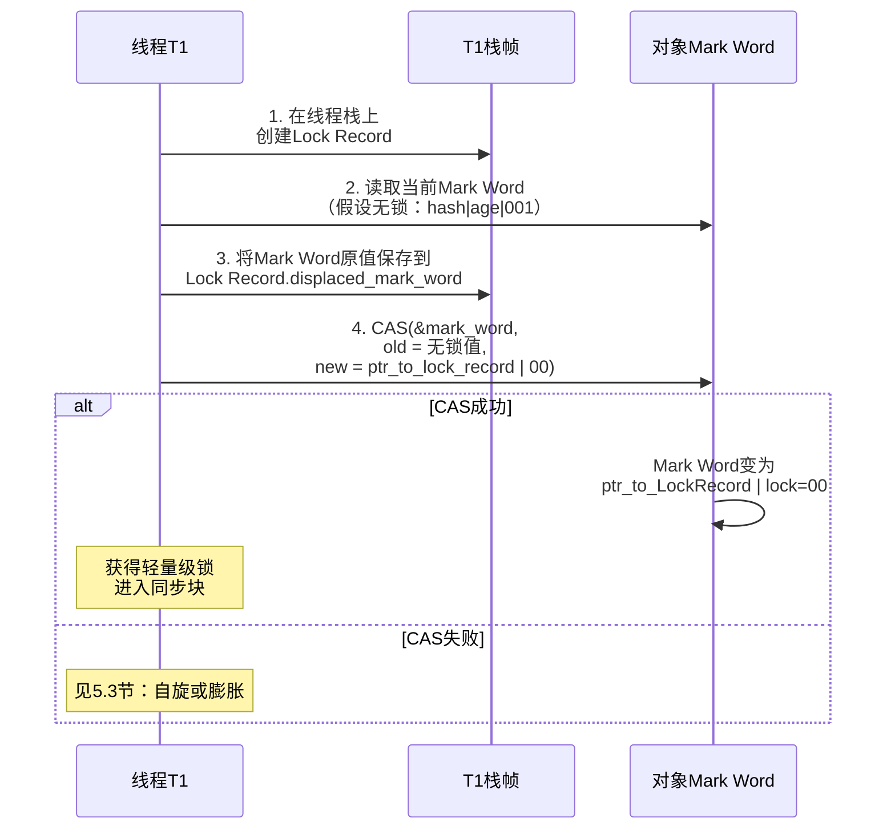

对应的 HotSpot 汇编入口是 `InterpreterRuntime::monitorenter`（解释执行）或 C2 编译器内联生成的锁代码。核心逻辑在 `synchronizer.cpp` 的 `ObjectSynchronizer::fast_enter()` 中。

用伪代码表达加锁逻辑：

```java
// 轻量级锁加锁（概念层面，非 HotSpot 逐行实现）
void lightweightLock(Object obj) {
    // 步骤1：在当前线程栈帧中分配 Lock Record
    BasicLock lockRecord = new BasicLock();

    // 步骤2-3：复制原始 Mark Word 到 Lock Record
    markWord currentMark = obj.readMarkWord();
    lockRecord.setDisplacedHeader(currentMark);

    // 步骤4：CAS——将 obj.markWord 替换为指向 lockRecord 的指针
    markWord newMark = encodePtr(lockRecord) | 0b00;  // 低2位=00(轻量级锁)
    if (CAS(&obj.markWord, currentMark, newMark)) {
        // CAS 成功 → 获得了轻量级锁
        return;
    }

    // CAS 失败 → 需要判断是否是自己已经持有了（锁重入）
    if (isLockRecordOfCurrentThread(obj.markWord)) {
        // 锁重入：再创建一个 Lock Record，displaced_header = null
        lockRecord.setDisplacedHeader(null);
        return;
    }

    // 其他线程持有 → 膨胀为重量级锁
    inflateToHeavyweight(obj);
}
```

### 📈 5.3 CAS 失败之后：自旋与膨胀

如果 CAS 失败，线程不会立即挂起。原因：`<span style="color:red">`另一个线程可能只是短暂持有轻量级锁（比如只执行了几条指令就退出同步块），如果当前线程立即阻塞，用户态到内核态的切换开销远超等待那几条指令的时间。

因此，CAS 失败后，线程进入 **自适应自旋（Adaptive Spinning）** ：

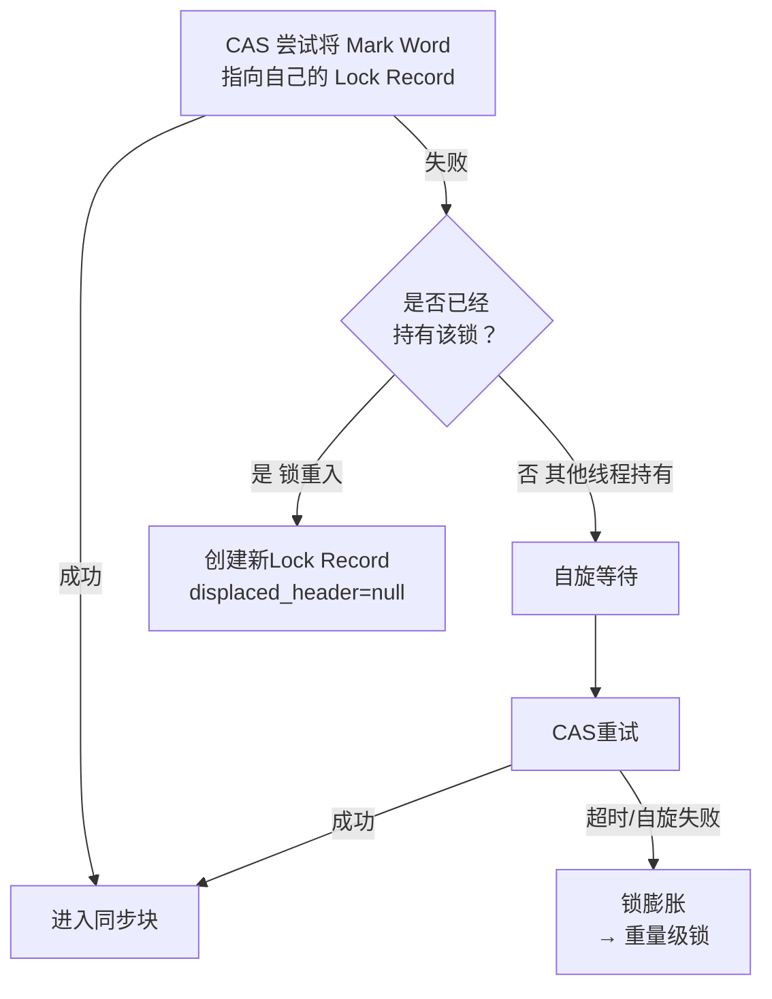

**自适应自旋的决策逻辑** ：

| 这次自旋的决策依据                 | 说明                                                                                                         |
| ---------------------------------- | ------------------------------------------------------------------------------------------------------------ |
| **同一把锁的上一次自旋结果** | 上次自旋成功了 → 这次多自旋一会（JVM 推测这次也能等到）；上次自旋失败了 → 这次少自旋，甚至直接膨胀         |
| **持有锁的线程是否在运行**   | 持有锁的线程正在 CPU 上运行 → 大概率很快释放，值得自旋；持有锁的线程被阻塞/挂起 → 不可能马上释放，直接膨胀 |

### 🔓 5.4 解锁过程

轻量级锁的解锁也是通过 CAS：

1. 从当前线程的 Lock Record 中取出 `displaced_mark_word`（之前保存的原始 Mark Word）
2. 通过 CAS 将锁对象的 Mark Word 恢复为 `displaced_mark_word`
3. 如果 CAS 成功：解锁完成
4. 如果 CAS 失败：说明锁已经膨胀为重量级锁（其他线程把 Mark Word 改成了指向 ObjectMonitor 的指针），走重量级锁的释放路径（`ObjectSynchronizer::slow_exit`）

```java
// 轻量级锁解锁（概念层面）
void lightweightUnlock(Object obj) {
    BasicLock lockRecord = currentThread().popLockRecord();

    if (lockRecord.getDisplacedHeader() == null) {
        // 这是重入的 Lock Record，直接弹出即可
        return;
    }

    // CAS 恢复原始 Mark Word
    if (CAS(&obj.markWord,
            encodePtr(lockRecord) | 0b00,      // 期望值：仍指向这个LockRecord
            lockRecord.getDisplacedHeader())) { // 新值：恢复为无锁状态
        // CAS 成功
        return;
    }

    // CAS 失败 → 已膨胀 → 走重量级锁释放
    heavyweightUnlock(obj);
}
```

### 🧪 5.5 轻量级锁的 JOL 验证

轻量级锁最难验证，因为它需要"两个线程交替执行"的精确时机。下面用 CountDownLatch 精确控制：

```java
public class LightweightLockDemo {
    public static void main(String[] args) throws Exception {
        Object lock = new Object();
        CountDownLatch t1Acquired = new CountDownLatch(1);
        CountDownLatch t1Wait = new CountDownLatch(1);

        // T1: 先拿锁，等T2来竞争
        Thread t1 = new Thread(() -> {
            synchronized (lock) {
                t1Acquired.countDown(); // 通知T2可以来了
                try { t1Wait.await(); } catch (Exception e) {}
                // T1不立即退出，让T2自旋等待
            }
        });

        // T2: 竞争同一把锁
        Thread t2 = new Thread(() -> {
            try { t1Acquired.await(); } catch (Exception e) {}
            // T1还持有锁，T2 CAS会失败 → 自旋
            synchronized (lock) {
                System.out.println("=== T2获得锁后（此时是轻量级锁） ===");
                System.out.println(ClassLayout.parseInstance(lock).toPrintable());
                // Mark Word低2位=00 → 轻量级锁确认
            }
        });

        t1.start();
        t2.start();
        t1.await(); // 等T1退出
        t2.join();
    }
}
```

输出：Mark Word 低 2 位为 `00`，确认为轻量级锁。

## 6️⃣ 六、重量级锁（Heavyweight Lock）

### 📌 6.1 什么时候升级到重量级锁

以下任意条件满足时，轻量级锁膨胀为重量级锁：

| 触发条件                        | 说明                                                                               |
| ------------------------------- | ---------------------------------------------------------------------------------- |
| **自旋超时**              | 线程自旋等待轻量级锁期间，CAS 重试达到阈值仍然失败，不再继续自旋                   |
| **等待队列长度 ≥ 1**     | 当有第 2 个线程在等待同一把锁时（即总共 3 个线程争抢），JVM 判断竞争激烈，直接膨胀 |
| **线程调用了 `wait()`** | `wait()` 依赖 ObjectMonitor 的 WaitSet，必须使用重量级锁                         |
| **锁重入次数过多**        | 轻量级锁的重入通过栈上的 Lock Record 数量来体现，栈深度有上限                      |

### 🔍 6.2 ObjectMonitor 的内部结构

重量级锁的数据结构是 **ObjectMonitor** ，分配在 Native Memory（C++ 堆，不在 Java 堆中）。它不是 Java 对象，不受 GC 管理。

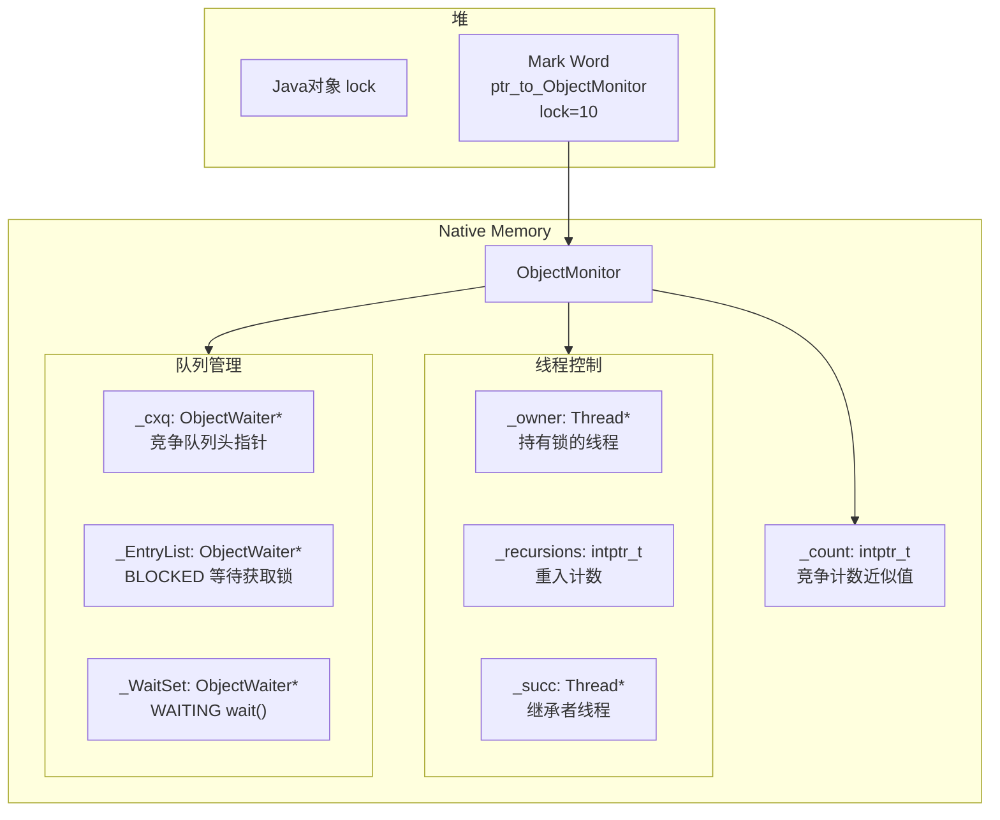

关键字段说明（HotSpot 源码 `objectMonitor.hpp`）：

| 字段            | 类型              | 说明                                                                              |
| --------------- | ----------------- | --------------------------------------------------------------------------------- |
| `_owner`      | `Thread*`       | 当前持有锁的线程指针。`null` 表示锁未被持有。这是重量级锁的"锁标记"             |
| `_recursions` | `intptr_t`      | 锁重入次数。同一个线程每进入一次 synchronized 块就 +1，退出时 -1。减到 0 时释放锁 |
| `_EntryList`  | `ObjectWaiter*` | 等待获取锁的线程链表。线程在这里处于**BLOCKED** 状态                        |
| `_WaitSet`    | `ObjectWaiter*` | 调用了 `wait()` 的线程链表。线程在这里处于 **WAITING** 状态               |
| `_cxq`        | `ObjectWaiter*` | 竞争队列。新到达的竞争线程先放入 `_cxq`，释放锁时再移到 `_EntryList`          |

`_cxq` 和 `_EntryList` 是两个队列。新的竞争线程先入 `_cxq`，锁释放时 `_cxq` 中的线程被转移到 `_EntryList`，然后从 `_EntryList` 头部取出一个线程唤醒。双队列的设计减少了锁释放时对 `_EntryList` 的并发操作——新竞争者只操作 `_cxq`，释放者操作 `_EntryList`。

### 📈 6.3 从膨胀到加锁的完整序列

锁膨胀（Inflation）和随后的加锁过程，画在一个时序图中：

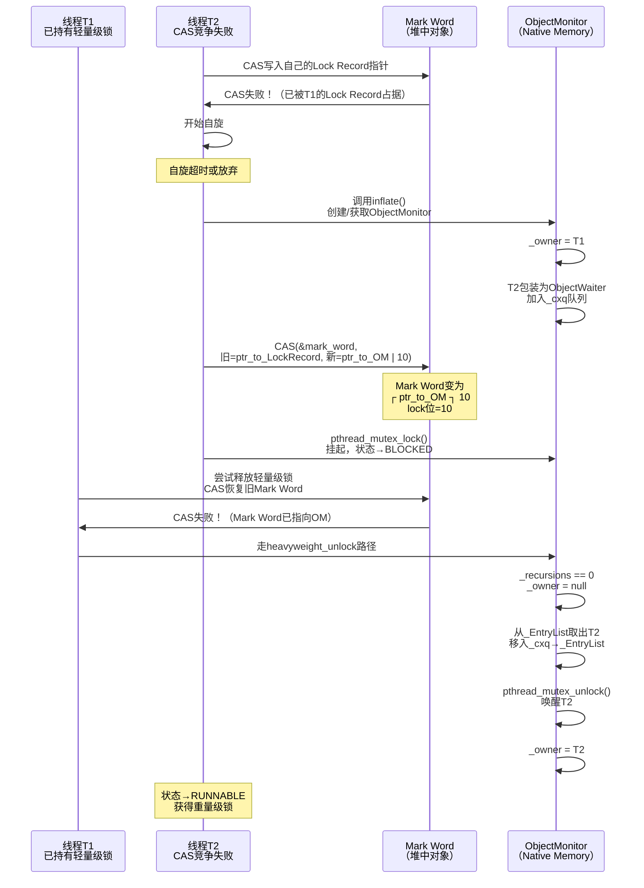

关键细节：`<span style="color:red">`膨胀过程中，T1 仍然持有锁（先通过轻量级锁，膨胀后 Mark Word 指向 OM，OM._owner = T1）。膨胀不影响 T1 的执行——T1 甚至不知道自己持有的锁已经被膨胀了。只有 T1 尝试退出同步块时，才会发现 CAS 恢复 Mark Word 失败，转而走重量级锁的退出路径。

### 🔍 6.4 wait / notify 与 ObjectMonitor 的协作

`wait()` 和 `notify()` 是重量级锁独有功能——它们直接操作 ObjectMonitor 的 `_WaitSet` 和 `_EntryList`：

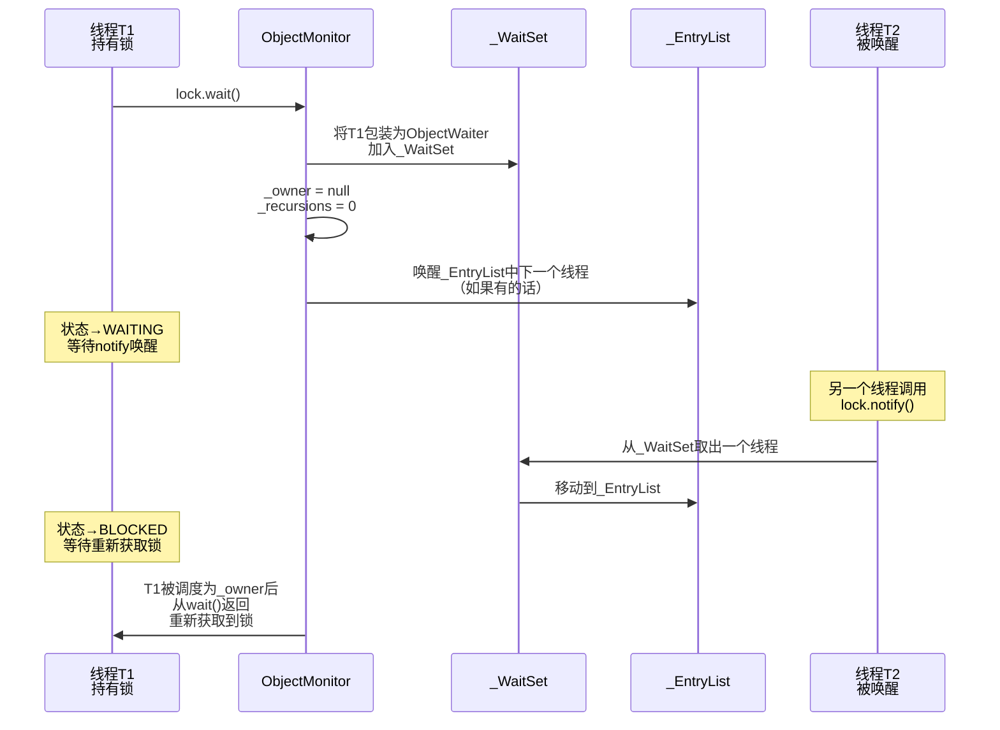

`wait()` 的三个关键步骤：

1. 当前线程 **必须持有锁** （`_owner == current_thread`），否则抛出 `IllegalMonitorStateException`
2. 线程被包装为 `ObjectWaiter` 放入 `_WaitSet`
3. 释放锁（`_owner = null`，唤醒 `_EntryList` 中的等待者），当前线程挂起

`notify()` 的关键步骤：

1. 当前线程 **必须持有锁** ，否则抛异常
2. 从 `_WaitSet` 中取出一个线程（通常是队头，不保证公平）
3. 将其从 `_WaitSet` 移到 `_EntryList`（状态从 WAITING 变为 BLOCKED）
4. **被通知的线程不会立即运行** ——它仍然需要等待操作系统将锁分配给它

这也是为什么 `wait()` 醒来后必须重新检查条件——从 `wait()` 返回到线程真正持有锁并继续执行之间，可能有其他线程已经改变了条件。

## 🔄 七、完整流程总结

### 📊 7.1 所有锁状态及其 Mark Word 结构的并列对比

将五种状态放在一张图中，可以清晰看到同一块 64 位内存在不同状态下的复用情况：

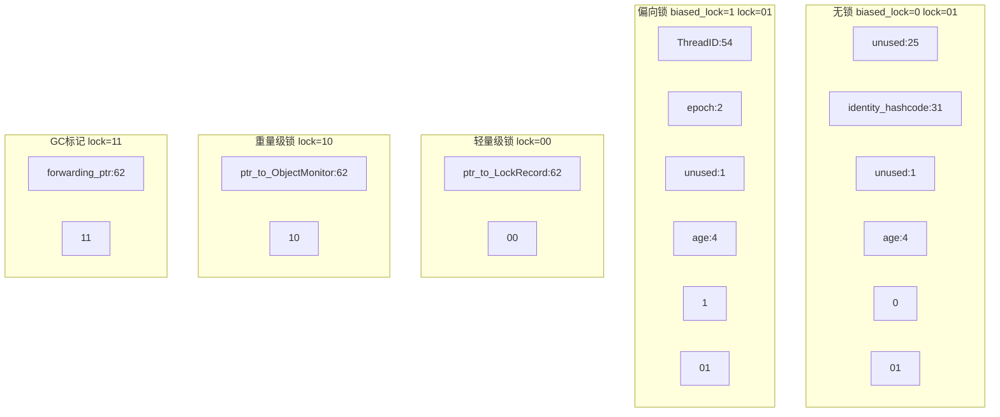

### ⚙️ 7.2 锁升级的判断逻辑（JVM 核心决策树）

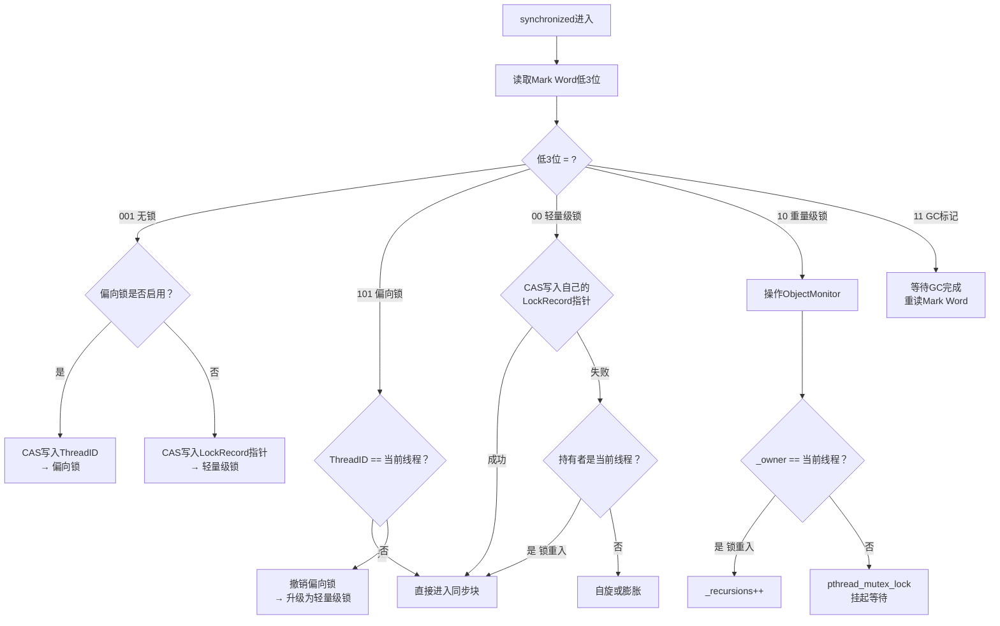

### 🔢 7.3 锁状态转换总表

| 当前状态 | Mark Word 低3位 | 触发事件                         | 下一状态         |          Mark Word 新值          |
| -------- | :-------------: | -------------------------------- | ---------------- | :------------------------------: |
| 无锁     |     `001`     | 第一个线程获取锁（偏向启用）     | 偏向锁           |        `101` + ThreadID        |
| 无锁     |     `001`     | 第一个线程获取锁（偏向禁用）     | 轻量级锁         |    `00` + ptr_to_LockRecord    |
| 偏向锁   |     `101`     | 同一线程再次进入                 | 偏向锁（不变）   |               不变               |
| 偏向锁   |     `101`     | 另一线程竞争 → 撤销             | 轻量级锁         |    `00` + ptr_to_LockRecord    |
| 轻量级锁 |     `00`     | CAS 成功（获得锁）               | 轻量级锁（不变） | 不变（已指向自己的 Lock Record） |
| 轻量级锁 |     `00`     | CAS 失败 + 自旋超时 / 竞争数 > 1 | 重量级锁         |  `10` + ptr_to_ObjectMonitor  |
| 轻量级锁 |     `00`     | `wait()` 被调用                | 重量级锁         |  `10` + ptr_to_ObjectMonitor  |
| 重量级锁 |     `10`     | —                               | 重量级锁（不变） |         不变（不会降级）         |

## 八、日常开发中的 synchronized 用法

### 🎯 8.1 三种形式与选型

| 形式                                  | 锁对象               | 适合场景                | 注意                                |
| ------------------------------------- | -------------------- | ----------------------- | ----------------------------------- |
| `synchronized void method()`        | `this`（当前实例） | 保护该实例的状态        | 子类与父类共享同一把 `this` 锁    |
| `static synchronized void method()` | `ClassName.class`  | 保护静态状态 / 全局资源 | 与实例方法的锁不同，互不影响        |
| `synchronized (lockObject) {}`      | 显式指定对象         | 精确控制锁粒度          | 推荐：专用 `private final` 锁对象 |

```java
public class SynchronizedUsage {
    private int instanceVar = 0;
    private static int staticVar = 0;
    // 专用锁对象，不暴露给外部
    private final Object lock = new Object();

    // 实例方法——锁this
    public synchronized void incrementInstance() {
        instanceVar++;
    }

    // 静态方法——锁SynchronizedUsage.class
    public static synchronized void incrementStatic() {
        staticVar++;
    }

    // 代码块——锁指定对象，粒度更细
    public void incrementWithBlock() {
        // ... 非同步代码（可以并发执行）
        synchronized (lock) {
            instanceVar++;
        }
        // ... 非同步代码
    }
}
```

`<span style="color:red">`优先使用同步代码块而非同步方法：同步代码块可以控制锁的粒度——只锁住需要保护的代码，让不需要同步的逻辑并发执行。同步方法把整个方法体都锁住，粒度太粗。

### 🛠️ 8.2 wait / notify 的规范用法

| 方法                  | 用途                             | 调用前提              | 后果                             |
| --------------------- | -------------------------------- | --------------------- | -------------------------------- |
| `obj.wait()`        | 释放锁，等待通知                 | 必须持有 `obj` 的锁 | 线程进入 WAITING，释放锁         |
| `obj.wait(long ms)` | 带超时的等待                     | 同上                  | 超时后自动唤醒，重新竞争锁       |
| `obj.notify()`      | 随机唤醒 `_WaitSet` 中一个线程 | 必须持有 `obj` 的锁 | 被唤醒线程从 WAITING→BLOCKED    |
| `obj.notifyAll()`   | 唤醒 `_WaitSet` 中所有线程     | 同上                  | 所有等待线程进入 BLOCKED，竞争锁 |

```java
// 生产者-消费者：规范的 wait/notify 用法
class BoundedBuffer<T> {
    private final T[] buffer;
    private int count = 0;
    private int putIndex = 0;
    private int takeIndex = 0;

    public BoundedBuffer(int capacity) {
        buffer = (T[]) new Object[capacity];
    }

    public synchronized void put(T item) throws InterruptedException {
        while (count == buffer.length) {   // 必须用while，不能用if！
            wait();                         // 等待非满
        }
        buffer[putIndex] = item;
        putIndex = (putIndex + 1) % buffer.length;
        count++;
        notifyAll();                        // 通知等待的消费者
    }

    public synchronized T take() throws InterruptedException {
        while (count == 0) {               // 必须用while，不能用if！
            wait();                         // 等待非空
        }
        T item = buffer[takeIndex];
        buffer[takeIndex] = null;
        takeIndex = (takeIndex + 1) % buffer.length;
        count--;
        notifyAll();                        // 通知等待的生产者
        return item;
    }
}
```

`<span style="color:red">`核心规则：`wait()` 必须在 `while` 循环中调用，禁止用 `if`。两个原因：

1. **虚假唤醒（Spurious Wakeup）** ：操作系统可能在没有线程调用 `notify()` 的情况下唤醒等待线程。这是 POSIX 规范允许的行为，JVM 不能禁止。
2. **条件被抢先修改** ：从线程被 notify 唤醒到它真正拿到锁并继续执行之间，可能有另一个线程抢先拿到锁并修改了条件。用 `while` 重新检查条件可以防御这种情况。

错误写法：

```java
// 错误——线程被虚假唤醒后就继续执行
if (count == buffer.length) {
    wait();
}
```

### ❌ 8.3 常见错误与排查

| 错误场景                            | 症状                             | 根因                                  | 修正                                             |
| ----------------------------------- | -------------------------------- | ------------------------------------- | ------------------------------------------------ |
| 锁对象被重新赋值                    | 同步失效，多线程同时进入临界区   | `lock = new Object()` 改变了锁引用  | 锁对象声明为 `final`                           |
| 锁 String 常量                      | 全局死锁或性能崩溃               | String 常量池导致不同模块共享同一把锁 | 使用 `new Object()`                            |
| `wait()` 不在 synchronized 内     | `IllegalMonitorStateException` | `wait()` 要求持有锁                 | 把 `wait()` 放在 `synchronized(obj)` 块内    |
| `notifyAll()` 误写为 `notify()` | 某些线程永不唤醒                 | `notify()` 只唤醒一个，其他线程饿死 | 不确定唤醒哪个线程时用 `notifyAll()`           |
| 同步方法嵌套                        | 死锁                             | 锁顺序不一致                          | 统一锁获取顺序，或用 `ReentrantLock.tryLock()` |
| 锁对象不 `final`                  | 不同线程锁住不同对象             | `lock = newXxx()` 后引用变了        | `private final Object lock = new Object()`     |

### 🎯 8.4 synchronized vs ReentrantLock 的选型

| 维度           |           synchronized           |                 ReentrantLock                 |
| -------------- | :-------------------------------: | :-------------------------------------------: |
| 释放方式       |  自动（退出同步块/JVM 异常处理）  |       必须手动 `finally { unlock() }`       |
| 公平锁         |         不支持（非公平）         |       支持 `new ReentrantLock(true)`       |
| 可中断获取     |              不支持              |            `lockInterruptibly()`            |
| 尝试获取       |              不支持              |    `tryLock()` / `tryLock(time, unit)`    |
| 多条件变量     |  不支持（一个对象一个等待队列）  | 支持 `newCondition()`，一个锁多个 Condition |
| 性能（JDK 6+） | 锁升级后与 ReentrantLock 基本持平 |                     持平                     |
| 适用场景       |  默认选择——代码简洁、自动释放  |   需要公平锁 / 可中断 / 尝试获取 / 多条件时   |

选型建议：`<span style="color:red">`默认用 synchronized，只有在需要 `tryLock`、`lockInterruptibly`、公平锁或多条件变量时才用 ReentrantLock。

## 🎯 九、总结

synchronized 的锁升级机制是 JDK 6 对 Java 并发性能最重要的优化之一。它的核心逻辑只有三个判断：

1. **读 Mark Word 的低 3 位** ——一条位与指令确定当前锁状态
2. **根据锁状态走对应分支** ——偏向锁比较 ThreadID（无 CAS）、轻量级锁 CAS 写 LockRecord 指针、重量级锁操作 ObjectMonitor
3. **竞争发生时升级** ——偏向→撤销→轻量级锁→自旋→膨胀→重量级锁

每一级锁的选择都对应一个硬件开销的权衡：

| 锁       |          硬件开销          | 设计权衡                                                     |
| -------- | :-------------------------: | ------------------------------------------------------------ |
| 偏向锁   |        一次比较指令        | 用 Mark Word 的空间（54 位存 ThreadID）换取免 CAS 的快速加锁 |
| 轻量级锁 | CAS + 栈空间（Lock Record） | 用栈空间 + 自旋 CPU 时间换取免 OS 互斥锁                     |
| 重量级锁 |    OS Mutex + 上下文切换    | 用线程阻塞换取 CPU 不被自旋空转浪费                          |

Mark Word 中那 3 个比特位是这一切的开关——JVM 通过读取它们，在几纳秒内决定走哪条路径。理解了 Mark Word 的状态转换，就理解了 synchronized 的全部机制。
