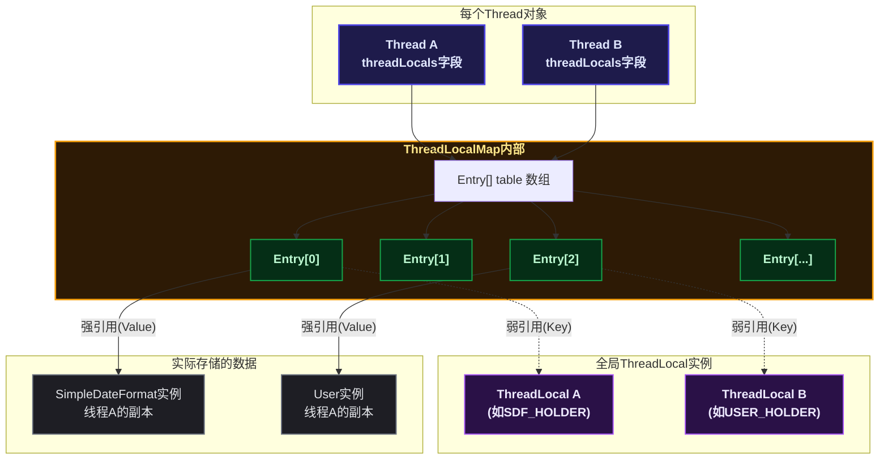
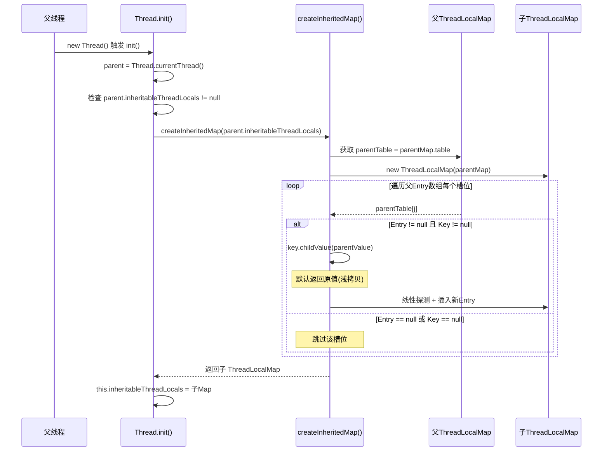
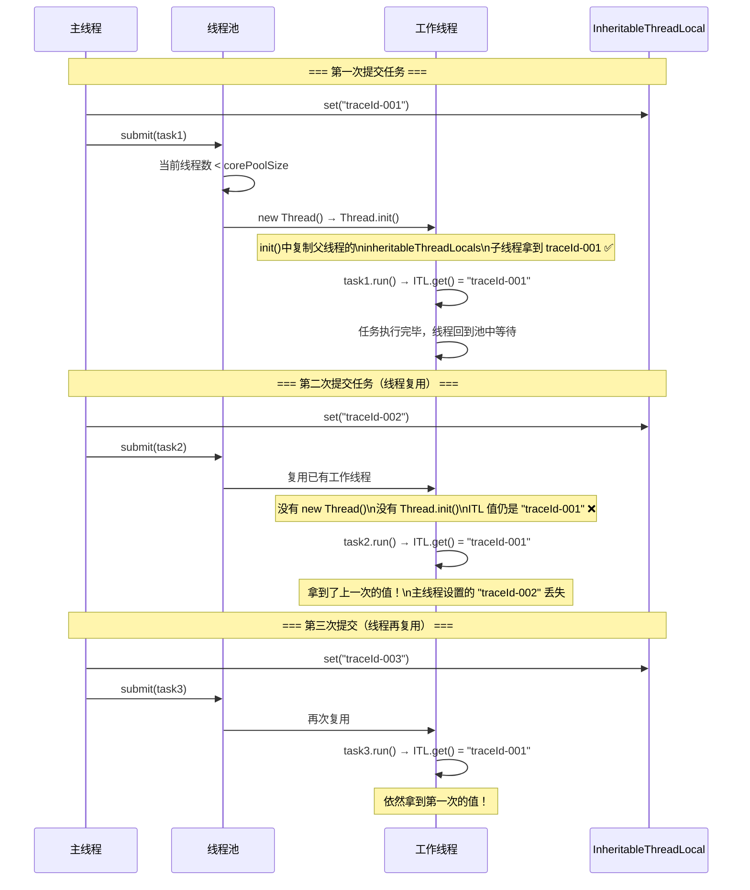
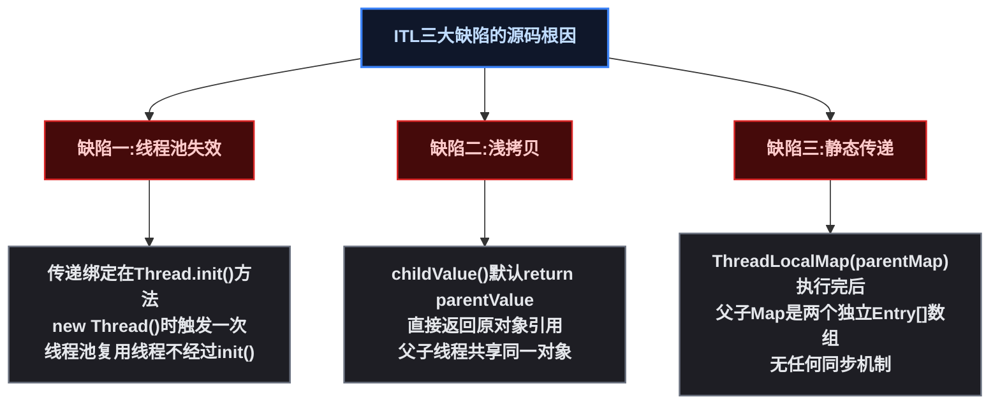
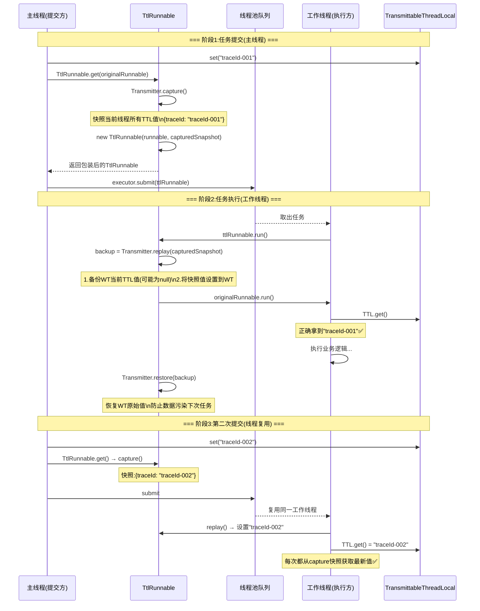
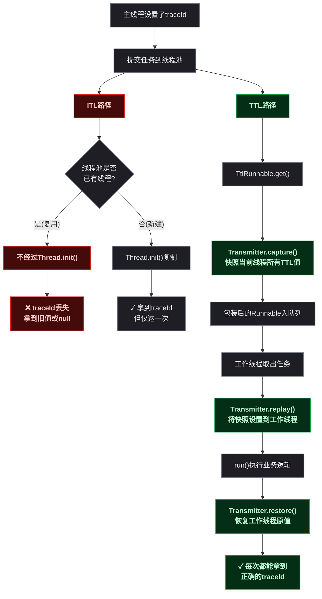
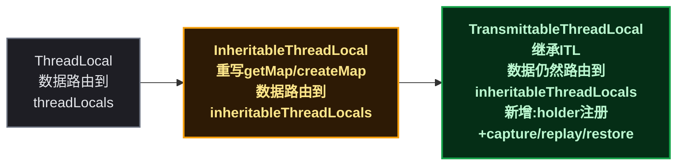
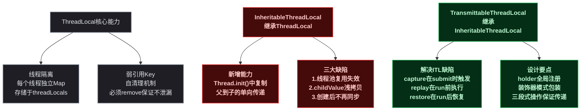

# ThreadLocal 线程池上下文传递：从 InheritableThreadLocal 缺陷到 TransmittableThreadLocal 全解析

## 🤔 一、JDK 设计者为什么要给每个线程配一个"私房钱罐"

多线程编程中有一个经典矛盾：线程之间要共享一部分数据来协作，又要有各自私有的数据来隔离。共享数据靠锁来保护，私有数据呢？如果每建一个新线程都要手动传参数、写包装类，代码很快就变成意大利面条。

JDK 1.2 的设计者（Josh Bloch 等人）给出的方案是 `ThreadLocal`——每个线程维护一个私有的 `ThreadLocalMap`，key 是 ThreadLocal 实例，value 是你想隔离的数据。同一个 `ThreadLocal` 对象在不同线程中的值互不干扰。这个设计让"线程级上下文"（traceId、事务、用户 Session）变得自然：只要在主线程 `set` 一下，当前线程的任何方法都能 `get` 到，不需要在方法签名里一路传参。

**但 JDK 设计者很快发现一个新问题**：`ThreadLocal` 在线程间是完全隔离的——如果父线程 `set` 了值，新建子线程时，子线程拿不到。这就是为什么后来又有了 `InheritableThreadLocal`：它在 `Thread` 构造函数中触发 `init()`，将父线程 `ThreadLocalMap` 中标记为可继承的条目浅拷贝到子线程。

**然而，ITL 的设计有一个致命缺陷**——它只在 `new Thread()` 时触发传递。线程池复用已有线程，不再走 `Thread` 构造函数，ITL 的传递逻辑完全不执行。第一次提交任务时碰巧用的是刚创建的新线程（触发了一次传递），第二次复用同一个线程时，父线程的新值就传不过来了。

这就是阿里开源的 `TransmittableThreadLocal` 要解决的问题。它的核心思路是：不再依赖线程创建时的一次性传递，而是在**每次提交任务时主动 `capture` 父线程的快照 → `replay` 到工作线程 → 任务完成后再 `restore` 还原**。

阅读本篇文章的收获：

- `InheritableThreadLocal` 是如何在 `Thread` 构造函数中实现传递的？源码在哪一行触发？
- 为什么它在线程池中会失效？根源在 JDK 源码的哪一行？
- `TransmittableThreadLocal` 又是如何在源码层面解决这些缺陷的？
- `capture()` / `replay()` / `restore()` 三个方法各自做了什么？

## 🧵 二、ThreadLocal 基础回顾：数据到底存在哪里

在深入 ITL 和 TTL 之前，先快速回顾 `ThreadLocal` 的核心数据结构。如果你已经熟悉这部分，可以直接跳到第三章。

### 📌 2.1 Thread → ThreadLocalMap → Entry 的三层架构

`ThreadLocal` 自己不存数据。数据存储在 `Thread` 对象的一个字段中：

```java
// Thread.java
ThreadLocal.ThreadLocalMap threadLocals = null;  // 每个线程有独立的一份
```

每个 Java 线程（`Thread` 对象）都持有一个 `threadLocals` 字段，类型是 `ThreadLocalMap`（ThreadLocal 的静态内部类）。它内部是一个 `Entry[]` 数组，不是 `HashMap`。



| 层级 | 谁持有 | 角色 | 关键点 |
|------|--------|------|--------|
| **Thread** | JVM | 数据宿主 | 每个线程对象有一个 `threadLocals` 字段 |
| **ThreadLocalMap** | Thread 对象 | 存储容器 | 内部是一个 `Entry[]` 数组，使用线性探测解决哈希冲突，不是链地址法 |
| **Entry** | ThreadLocalMap | 键值对 | 继承 `WeakReference<ThreadLocal<?>>`，Key 是弱引用，Value 是强引用 |
| **ThreadLocal** | 全局（通常 static） | 操作句柄 | 本身不存数据，只提供 `get()`/`set()`/`remove()` 入口 |

核心结论：<span style="color:red">ThreadLocal 只是一个"操作句柄"</span>。`get()` 第一步调用 `Thread.currentThread()` 定位当前线程，再用自己作为 Key 去该线程的 Map 中查找数据。这就是为什么同一个 `ThreadLocal` 实例在不同线程中返回不同值。

### 📐 2.2 Entry 的弱引用设计

```java
// ThreadLocal.ThreadLocalMap.Entry
static class Entry extends WeakReference<ThreadLocal<?>> {
    Object value;  // 强引用持有

    Entry(ThreadLocal<?> k, Object v) {
        super(k);   // Key 通过 WeakReference 间接持有 → 弱引用
        value = v;  // Value 直接赋值 → 强引用
    }
}
```

Key 是弱引用的原因：如果 Key 是强引用，即使业务代码中 `threadLocalInstance = null`，由于 `Thread → ThreadLocalMap → Entry → Key` 这条强引用链存在，ThreadLocal 实例永远不会被 GC。线程池场景下线程长期存活，会造成持续的内存泄漏。

### ⚙️ 2.3 内存泄漏机制与自清理

<span style="color:red">Value 只有强引用</span>：`Thread → ThreadLocalMap → Entry → value → 业务数据` 这条链全是强引用。即使 Key 被 GC 变成 null，Value 仍然可达，不会被回收。

ThreadLocalMap 有两种自清理机制：

| 清理方式 | 触发时机 | 扫描范围 | 策略 |
|---------|---------|---------|------|
| **expungeStaleEntry（探测式清理）** | `get()`/`set()` 遍历时遇到 `key == null` 的槽位 | 从过期位置向后连续扫描直到遇到 `null` 槽 | 清理过期 Entry 的 value，并将后续有效 Entry 重新哈希 |
| **cleanSomeSlots（启发式清理）** | `set()` 完成后 | 对数级扫描 `log2(n)` 次 | 不扫全表，随机抽查，发现过期则退回深度清理 |

但这些自清理机制 **不可靠** ——它们只在 `get()`/`set()` 操作附带触发。如果线程池中的线程最后一次 `get()`/`set()` 之后不再操作该 ThreadLocal，过期 Entry 永远不会被清理。唯一的保障是 `try-finally` 中显式调用 `remove()`。

## 🧵 三、InheritableThreadLocal 源码深度解析

### 🏗️ 3.1 数据结构：Thread 中的第二个 Map

`Thread` 对象中除了 `threadLocals`，还有另一个字段：

```java
// Thread.java
ThreadLocal.ThreadLocalMap threadLocals = null;          // 普通 ThreadLocal 使用
ThreadLocal.ThreadLocalMap inheritableThreadLocals = null; // InheritableThreadLocal 使用
```

<span style="color:red">`inheritableThreadLocals` 和 `threadLocals` 是两个完全独立的 Map</span>，存储在不同的字段中，互不干扰。`InheritableThreadLocal` 重写了 `ThreadLocal` 的三个关键方法，将自己的数据路由到 `inheritableThreadLocals` 而非 `threadLocals`：

```java
// InheritableThreadLocal.java
public class InheritableThreadLocal<T> extends ThreadLocal<T> {

    // 重写：从 inheritableThreadLocals 取值，而非 threadLocals
    @Override
    ThreadLocalMap getMap(Thread t) {
        return t.inheritableThreadLocals;  // 关键：路由到 inheritableThreadLocals
    }

    // 重写：创建 Map 时赋值给 inheritableThreadLocals，而非 threadLocals
    @Override
    void createMap(Thread t, T firstValue) {
        t.inheritableThreadLocals = new ThreadLocalMap(this, firstValue);
    }

    // 子线程复制时的回调，默认返回原值（浅拷贝）
    protected T childValue(T parentValue) {
        return parentValue;
    }
}
```

核心区别一览：

| 对比维度 | ThreadLocal | InheritableThreadLocal |
|---------|-------------|----------------------|
| 数据存储在 | `Thread.threadLocals` | `Thread.inheritableThreadLocals` |
| `getMap()` 返回 | `t.threadLocals` | `t.inheritableThreadLocals` |
| 是否支持父子传递 | 否 | 是（通过 `Thread.init()` 复制） |
| 子线程修改对父线程可见 | N/A | childValue 默认浅拷贝，修改可能影响父线程 |

### ⚙️ 3.2 传递机制：Thread.init() 中的复制逻辑

ITL 的父子传递发生在 **子线程创建时**，具体位置是 `Thread.init()` 方法。当父线程执行 `new Thread()` 时，JVM 会调用 `Thread.init()`，其中有一段关键逻辑：

```java
// Thread.init() —— 简化后展示核心逻辑
private void init(ThreadGroup g, Runnable target, String name,
                  long stackSize, AccessControlContext acc,
                  boolean inheritThreadLocals) {    // 参数控制是否继承

    Thread parent = currentThread();                // 1. 拿到父线程（即调用 new Thread() 的线程）

    // ... 其他初始化逻辑 ...

    if (inheritThreadLocals && parent.inheritableThreadLocals != null) {
        // 2. 关键！将父线程的 inheritableThreadLocals 复制给子线程
        this.inheritableThreadLocals =
            ThreadLocal.createInheritedMap(parent.inheritableThreadLocals);
    }

    // ... 其他初始化逻辑 ...
}
```

这里的调用链是：`new Thread()` → `Thread.init()` → `ThreadLocal.createInheritedMap()` → `new ThreadLocalMap(parentMap)`。

<span style="color:red">复制的触发时机是 `new Thread()` 那一刻</span>——不是 `thread.start()` 时，也不是线程运行时。一旦子线程对象创建完成，复制就结束了，之后父线程对 ITL 的任何修改都不会同步到子线程。

下面是 `createInheritedMap()` 和私有的 `ThreadLocalMap` 构造器的源码：

```java
// ThreadLocal.java
static ThreadLocalMap createInheritedMap(ThreadLocalMap parentMap) {
    return new ThreadLocalMap(parentMap);  // 委托给私有构造器
}

// ThreadLocalMap 私有构造器——执行实际的复制
private ThreadLocalMap(ThreadLocalMap parentMap) {
    Entry[] parentTable = parentMap.table;
    int len = parentTable.length;
    setThreshold(len);         // 设置扩容阈值
    table = new Entry[len];    // 创建新的 Entry 数组

    for (int j = 0; j < len; j++) {
        Entry e = parentTable[j];
        if (e != null) {
            @SuppressWarnings("unchecked")
            ThreadLocal<Object> key = (ThreadLocal<Object>) e.get();
            if (key != null) {
                // 关键！调用 childValue() 对值进行"转换"
                Object value = key.childValue(e.value);
                Entry c = new Entry(key, value);
                int h = key.threadLocalHashCode & (len - 1);
                while (table[h] != null)          // 线性探测找空位
                    h = nextIndex(h, len);
                table[h] = c;
                size++;
            }
        }
    }
}
```

逐行解释这个构造器的行为：

1. **获取父 Map 的 Entry 数组**：`parentTable = parentMap.table`
2. **创建等长的子 Map 数组**：`table = new Entry[len]`
3. **遍历父数组的每个槽位**：对于每个非 null 的 Entry
4. **取出 Key（ThreadLocal 实例）**：通过 `e.get()` 从弱引用中获取
5. **调用 `childValue()` 转换值**：默认返回原值（浅拷贝），子类可重写
6. **线性探测放入子 Map**：计算哈希位置，冲突则向后查找空槽

整个过程用一张时序图来展示：



### ⚙️ 3.3 缺陷一：线程池复用导致传递失效（核心缺陷）

这是 ITL 最致命的缺陷，也是 TTL 被设计出来的直接原因。

**缺陷的根源**：ITL 的复制发生在 `Thread.init()` 中，而 `Thread.init()` 只在 `new Thread()` 时执行一次。线程池的核心机制是 **复用已有线程**——线程对象只创建一次（通过 `ThreadFactory.newThread()`），之后该线程反复从任务队列中取任务执行。



图中暴露了 ITL 在线程池场景下的两个问题：

**问题一：新值传不进去**。第二次、第三次提交任务时，主线程分别设置了 `traceId-002` 和 `traceId-003`，但工作线程拿到的仍然是第一次线程创建时复制的 `traceId-001`。因为 `Thread.init()` 没有再次执行。

**问题二：旧值残留造成数据污染**。工作线程中残留着第一次任务的 `traceId-001`，如果某个任务没有主动 `set()` 就调用 `get()`，会拿到一个完全错误的过期数据。这比返回 `null` 更危险——`null` 至少会触发 NPE 让你发现问题，<span style="color:red">错误的数据则会让业务逻辑静默出错</span>。

从源码层面看，缺陷的根因只有一句话：<span style="color:red">ITL 的传递机制绑定在 `Thread.init()` 上，而线程池绕过 `Thread.init()` 直接复用线程</span>。

### 📌 3.4 缺陷二：childValue 默认浅拷贝

回顾 `ThreadLocalMap` 私有构造器中的这段代码：

```java
// ThreadLocalMap(ThreadLocalMap parentMap) 中的关键行
Object value = key.childValue(e.value);
```

`childValue()` 的默认实现是：

```java
// InheritableThreadLocal.java
protected T childValue(T parentValue) {
    return parentValue;  // 直接返回原引用——浅拷贝
}
```

这意味着，如果 ITL 中存储的是一个 **可变对象**（如 `List`、`Map`、普通的 POJO），父子线程共享同一个对象引用。子线程对该对象的任何修改，都会直接反映到父线程的视角中：

```java
InheritableThreadLocal<List<String>> itl = new InheritableThreadLocal<>();
List<String> list = new ArrayList<>();
list.add("parent-data");
itl.set(list);

new Thread(() -> {
    List<String> childList = itl.get();   // 拿到的是同一个 list 对象
    childList.add("child-data");          // 子线程修改
    System.out.println(itl.get());        // [parent-data, child-data]
}).start();

Thread.sleep(100);
System.out.println(itl.get());            // [parent-data, child-data] ← 父线程也被修改了！
```

<span style="color:red">`childValue()` 默认浅拷贝，导致父子线程共享同一个可变对象，子线程的修改会"反向污染"父线程</span>。虽然可以通过重写 `childValue()` 做深拷贝来解决，但需要为每个 ITL 变量单独实现，且对复杂对象深拷贝成本高。

### 📌 3.5 缺陷三：静态传递——创建后不再同步

ITL 的传递是 **一次性的、静态的**。子线程创建之后，父线程对 ITL 的任何更新都不会同步到已存在的子线程：

```java
InheritableThreadLocal<String> itl = new InheritableThreadLocal<>();
itl.set("value-1");

Thread child = new Thread(() -> {
    System.out.println(itl.get());  // "value-1" ✓
    try { Thread.sleep(2000); } catch (InterruptedException e) {}
    System.out.println(itl.get());  // 仍然 "value-1" ✗——父线程改成 "value-2" 了但子线程不知道
});
child.start();

Thread.sleep(100);
itl.set("value-2");                  // 父线程修改值
System.out.println(itl.get());      // "value-2" —— 但子线程看不到这个变化
```

从源码角度理解这个缺陷就非常直观了：`ThreadLocalMap(parentMap)` 构造器在 `Thread.init()` 中执行完毕后，父 Map 和子 Map 就是 **两个完全独立的 `Entry[]` 数组**——之后父线程 `set()` 只修改父 Map 的 Entry，子线程 `set()` 只修改子 Map 的 Entry，没有任何同步机制连接二者。

### 🎯 3.6 三个缺陷的根因总结



## 🧵 四、TransmittableThreadLocal 源码深度解析

TTL（TransmittableThreadLocal）是阿里巴巴开源的 Java 库（Maven 坐标 `com.alibaba:transmittable-thread-local`），专门解决 ITL 在线程池场景下的传递问题。

### 📐 4.1 核心设计思想：三段式操作

TTL 的核心设计可以归纳为三个操作，每个操作在不同的时间点在 **不同的线程** 中执行：

| 操作 | 执行线程 | 执行时机 | 作用 |
|------|---------|---------|------|
| **capture（捕获）** | 主线程（提交任务方） | 任务提交到线程池之前 | 从当前线程快照所有 TTL 值 |
| **replay（回放）** | 工作线程（执行任务方） | 任务 `run()` 执行之前 | 将捕获的快照值设置到工作线程，同时备份工作线程的旧值 |
| **restore（恢复）** | 工作线程（执行任务方） | 任务 `run()` 执行之后 | 用备份恢复工作线程的旧值（或清空），防止线程间数据污染 |

这三个操作由 `TtlRunnable`（装饰器）串联起来。用一张时序图来展示完整流程：



关键点：<span style="color:red">`capture()` 在**每次**任务提交时执行，`replay()` 在**每次**任务执行前执行</span>。这从根本上解决了 ITL "只在 `Thread.init()` 中传递一次" 的问题——TTL 的传递不是绑定在线程创建上，而是绑定在 **任务提交/执行** 这个粒度上。

### 📌 4.2 全局 Holder：追踪所有 TTL 实例

TTL 需要知道"当前 JVM 中有哪些 TTL 实例"才能做 capture（快照所有 TTL 的值）。它通过一个全局的 `holder` 来注册所有 TTL 实例：

```java
// TransmittableThreadLocal.java —— 核心字段
public class TransmittableThreadLocal<T> extends InheritableThreadLocal<T> {

    // 全局 holder：一个特殊的 InheritableThreadLocal
    // 其 Value 是一个 WeakHashMap，Key 为所有存活的 TTL 实例
    // 使用 WeakHashMap 确保 TTL 实例可以被 GC
    private static final InheritableThreadLocal<WeakHashMap<TransmittableThreadLocal<Object>, ?>> holder =
        new InheritableThreadLocal<WeakHashMap<TransmittableThreadLocal<Object>, ?>>() {
            @Override
            protected WeakHashMap<TransmittableThreadLocal<Object>, ?> initialValue() {
                return new WeakHashMap<>();
            }

            @Override
            protected WeakHashMap<TransmittableThreadLocal<Object>, ?> childValue(
                    WeakHashMap<TransmittableThreadLocal<Object>, ?> parentValue) {
                return new WeakHashMap<>(parentValue);  // 子线程继承 holder 的注册信息
            }
        };

    // 将当前 TTL 实例注册到 holder 中
    private final void addThisToHolder() {
        WeakHashMap<TransmittableThreadLocal<Object>, ?> map = holder.get();
        if (!map.containsKey(this)) {
            map.put((TransmittableThreadLocal<Object>) this, null);  // null: 用 Key 做集合
        }
    }

    // 每次 set() 时自动注册
    @Override
    public final void set(T value) {
        super.set(value);       // 调用 InheritableThreadLocal.set() → 存入 inheritableThreadLocals
        addThisToHolder();      // 确保当前 TTL 实例被 holder 追踪
    }
}
```

逐字段解释这个设计：

1. **`holder` 类型是 `InheritableThreadLocal<WeakHashMap<...>>`**——这很巧妙。holder 本身是一个 ITL，这意味着子线程创建时（`new Thread()`）会通过 ITL 的传递机制自动继承父线程的 holder 内容，子线程因此也知道哪些 TTL 实例是"活跃的"。

2. **`WeakHashMap` 的 Key 是所有 TTL 实例**——当某个 TTL 实例不再被业务代码引用时，GC 会自动把它从 holder 中清除。Value 是 `null`，说明这里只把 `WeakHashMap` 当作 `WeakHashSet` 使用。

3. **`addThisToHolder()` 在 `set()` 时自动调用**——只要业务代码在某处调用了 `ttl.set(value)`，这个 TTL 实例就被注册到全局 holder 中，后续的 `capture()` 就能发现它。

### 🔍 4.3 Transmitter 内部类：capture / replay / restore 源码逐行分析

`Transmitter` 是 TTL 的核心引擎，是一个静态内部类。它的三个静态方法对应了 4.1 节中的三段式操作。

#### 📸 4.3.1 capture()——在主线程中快照所有 TTL 值

```java
// TransmittableThreadLocal.Transmitter
public static class Transmitter {

    // capture(): 在提交任务的主线程中调用
    // 返回一个快照 Map，包含当前线程中所有已注册 TTL 的值
    public static Object capture() {
        // 1. 获取 holder 中的 WeakHashMap → 拿到所有注册的 TTL 实例
        WeakHashMap<TransmittableThreadLocal<Object>, ?> holderMap = holder.get();

        // 2. 创建快照 Map
        Map<TransmittableThreadLocal<Object>, Object> captured =
            new HashMap<TransmittableThreadLocal<Object>, Object>();

        // 3. 遍历所有已注册的 TTL 实例
        for (TransmittableThreadLocal<Object> ttl : holderMap.keySet()) {
            // 取出当前线程中该 TTL 的值，放入快照
            captured.put(ttl, ttl.get());
        }
        return captured;  // 返回快照 Map
    }
}
```

三步逻辑非常直接：
1. 从 `holder` 获取所有已注册的 TTL 实例（通过 `WeakHashMap.keySet()`）
2. 遍历每个 TTL 实例，调用 `ttl.get()` 获取当前线程中的值
3. 将 `(TTL实例 → 值)` 的映射存入一个 `HashMap`，作为快照返回

<span style="color:red">capture 捕获的是"提交任务这一刻"主线程中的 TTL 值</span>。无论工作线程什么时候执行、执行多少次，用的都是这个快照。

#### ▶️ 4.3.2 replay()——在工作线程中回放快照值

```java
// TransmittableThreadLocal.Transmitter
@SuppressWarnings("unchecked")
public static Object replay(Object captured) {
    // 1. 将快照还原为 Map
    Map<TransmittableThreadLocal<Object>, Object> capturedMap =
        (Map<TransmittableThreadLocal<Object>, Object>) captured;

    // 2. 创建备份 Map——保存工作线程当前的 TTL 值
    Map<TransmittableThreadLocal<Object>, Object> backup =
        new HashMap<TransmittableThreadLocal<Object>, Object>();

    // 3. 遍历快照中的每个 TTL
    for (Map.Entry<TransmittableThreadLocal<Object>, Object> entry : capturedMap.entrySet()) {
        TransmittableThreadLocal<Object> ttl = entry.getKey();

        // 3a. 备份工作线程当前值（可能为 null）
        backup.put(ttl, ttl.get());

        // 3b. 将快照值设置到工作线程
        Object capturedValue = entry.getValue();
        if (capturedValue == null) {
            ttl.remove();          // 快照值为 null → 清理该 TTL 在工作线程中的旧值
        } else {
            ttl.set(capturedValue);// 快照值非 null → 设置到工作线程
        }
    }
    return backup;  // 返回备份，供后续 restore() 使用
}
```

`replay()` 做了两件关键的事：

1. **备份（backup）**：在覆盖工作线程的 TTL 值之前，先把工作线程当前的值保存下来。这些值可能是上一次任务执行后残留的，如果不备份，restore 时就无法恢复。
2. **回放（replay）**：将主线程捕获的快照值逐个设置到工作线程。如果快照值为 `null`，则调用 `remove()` 清除工作线程中该 TTL 的旧值，防止残留。

#### ♻️ 4.3.3 restore()——任务执行后恢复工作线程原值

```java
// TransmittableThreadLocal.Transmitter
@SuppressWarnings("unchecked")
public static void restore(Object backup) {
    // 1. 将备份还原为 Map
    Map<TransmittableThreadLocal<Object>, Object> backupMap =
        (Map<TransmittableThreadLocal<Object>, Object>) backup;

    // 2. 遍历备份 Map，恢复工作线程的原始值
    for (Map.Entry<TransmittableThreadLocal<Object>, Object> entry : backupMap.entrySet()) {
        TransmittableThreadLocal<Object> ttl = entry.getKey();
        Object backupValue = entry.getValue();

        if (backupValue == null) {
            ttl.remove();           // 备份值为 null → 工作线程原来没有该 TTL → 清除
        } else {
            ttl.set(backupValue);   // 备份值非 null → 恢复到工作线程原来的值
        }
    }
}
```

<span style="color:red">`restore()` 是防止线程间数据污染的关键</span>。假设工作线程在处理任务 A 之前，自己的 TTL 中存储了 `traceId = "worker-native"`。replay 阶段会将工作线程的 `traceId` 改成主线程的快照值（如 `"traceId-001"`），同时将 `"worker-native"` 备份起来。任务 A 执行完毕后，restore 将 `traceId` 恢复回 `"worker-native"`——这样工作线程处理下一个任务 B 时，不会被 A 的残留数据污染。

### 📐 4.4 TtlRunnable：装饰器模式的串联

`TtlRunnable` 实现了 `Runnable` 接口，是经典的装饰器模式——它包装原始 `Runnable`，在 `run()` 方法的前后插入 `replay()` 和 `restore()`：

```java
// TtlRunnable.java
public class TtlRunnable implements Runnable {
    private final Runnable runnable;              // 原始任务
    private final Object captured;                // 提交时捕获的快照

    private TtlRunnable(Runnable runnable, Object captured) {
        this.runnable = runnable;
        this.captured = captured;
    }

    // 静态工厂方法：在主线程中调用
    public static TtlRunnable get(Runnable runnable) {
        // 如果已经是 TtlRunnable，直接返回（避免重复包装）
        if (runnable instanceof TtlRunnable) {
            return (TtlRunnable) runnable;
        }
        // 关键：在主线程中执行 capture()！
        Object captured = Transmitter.capture();
        return new TtlRunnable(runnable, captured);
    }

    // run()：在工作线程中执行
    @Override
    public void run() {
        // 1. 回放主线程的快照到工作线程，同时备份工作线程的旧值
        Object backup = Transmitter.replay(captured);
        try {
            // 2. 执行原始任务——此时任务可以正常获取 TTL 值
            runnable.run();
        } finally {
            // 3. 恢复工作线程的原始 TTL 值（防止残留污染）
            Transmitter.restore(backup);
        }
    }
}
```

整个流程的调用链非常清晰：

```
主线程（提交方）:
  TtlRunnable.get(runnable)
    → Transmitter.capture()
    → new TtlRunnable(runnable, capturedSnapshot)

工作线程（执行方）:
  ttlRunnable.run()
    → backup = Transmitter.replay(capturedSnapshot)
    → runnable.run()          // 用户业务代码 → TTL.get() 拿到主线程的值
    → Transmitter.restore(backup)
```

### 📌 4.5 为什么 TTL 可以在线程池中正常工作

将 ITL 和 TTL 的传递时机做一张对比表：

| 对比维度 | InheritableThreadLocal | TransmittableThreadLocal |
|---------|----------------------|------------------------|
| **传递触发点** | `Thread.init()`——线程对象创建时 | `TtlRunnable.get()` —— 任务提交时 + `replay()`——任务执行时 |
| **传递频率** | 一次（线程创建时） | 每次任务提交/执行都传递 |
| **线程池复用场景** | 失效——复用线程不经过 `init()` | 正常——每次 `submit` 都经过 `TtlRunnable.get()` |
| **传递方向** | 父线程 → 子线程（单向，不可逆） | 主线程 → 工作线程（双向恢复，不污染） |
| **数据副本** | `createInheritedMap()` 复制整个 Map | `capture()` 只快照已注册 TTL 的值 |
| **线程间隔离** | 子线程修改 `childValue` 浅拷贝的对象会影响父线程 | `restore()` 恢复原值，完全隔离 |

<span style="color:red">TTL 能在线程池中工作的根本原因：它将传递时机从"线程创建"（`Thread.init()`）转移到了"任务提交"（`TtlRunnable.get()`）和"任务执行"（`replay()`）这两个时刻</span>。线程池复用线程不经过 `Thread.init()`，但每次提交任务一定会经过 `TtlRunnable.get()`——TTL 将这个必然经过的路径作为 `capture()` 的触发点。

用一张流程图来对比 ITL 和 TTL 在线程池场景下的路径差异：



### 📐 4.6 TTL 的设计代价

一套完整的设计必然有它的代价，TTL 也不例外：

**（1）性能开销**。每次提交任务都需要执行 `capture()`——遍历 holder 中的所有 TTL 实例并调用 `get()`。每次任务执行前需要 `replay()` —— 两次遍历（备份 + 设置），执行后需要 `restore()`——一次遍历。TTL 实例越多，开销越大。

**（2）不保证实时性**。`capture()` 在任务提交时执行，如果任务提交后、实际执行前主线程修改了 TTL 值，工作线程拿到的仍然是提交时的快照值。这不是 bug，但需要开发者知晓。

**（3）需要显式包装**。必须用 `TtlRunnable.get()` 或 `TtlCallable.get()` 包装任务。如果忘记包装，TTL 退化为普通的 ITL，传递失效。

## 📖 五、源码级对比总结

### 🔗 5.1 继承关系与数据路由



TTL 继承自 ITL，ITL 继承自 ThreadLocal。三者共用同一套 `ThreadLocalMap` 和 `Entry` 数据结构。区别在于：

| 类 | 数据存储字段 | 父子传递 | 线程池传递 | 线程间隔离恢复 |
|----|:---:|:---:|:---:|:---:|
| **ThreadLocal** | `threadLocals` | 不支持 | 不支持 | N/A |
| **InheritableThreadLocal** | `inheritableThreadLocals` | 支持（通过 `Thread.init()`） | 不支持（只在新线程创建时传递一次） | 不支持（子线程修改影响父线程视角） |
| **TransmittableThreadLocal** | `inheritableThreadLocals` | 支持（继承 ITL 能力） | 支持（通过 capture/replay/restore） | 支持（restore 恢复原值） |

### ⚙️ 5.2 核心机制源码对比

| 源码机制 | InheritableThreadLocal | TransmittableThreadLocal |
|---------|----------------------|------------------------|
| **传递触发方法** | `Thread.init()` → `createInheritedMap()` → `new ThreadLocalMap(parentMap)` | `TtlRunnable.get()` → `Transmitter.capture()` + `run()` → `Transmitter.replay()` |
| **值复制方式** | `ThreadLocalMap` 私有构造器遍历父数组，逐 Entry 调用 `childValue()` 后放入子数组 | `capture()` 遍历 holder 中已注册 TTL，`get()` 快照值放入 HashMap；`replay()` 遍历快照 Map，`set()` 到工作线程 |
| **是否备份旧值** | 否——子线程是全新线程，`inheritableThreadLocals` 初始为 null | 是——`replay()` 先 `backup.put(ttl, ttl.get())` 备份工作线程原值 |
| **是否恢复旧值** | 否——不需要 | 是——`restore()` 遍历备份 Map，恢复工作线程原值 |
| **传递粒度** | 线程粒度（线程创建时一次性） | 任务粒度（每次 submit 一次） |

## 六、日常开发中的 TTL 用法

### ⚙️ 6.1 核心 API

| 方法 | 用途 | 频率 |
|------|------|:---:|
| `new TransmittableThreadLocal<>()` | 创建 TTL 实例 | 低（通常作为 static final） |
| `TransmittableThreadLocal.withInitial(Supplier)` | 创建带初始值的 TTL | 中 |
| `ttl.get()` | 获取当前线程的值 | 高 |
| `ttl.set(T value)` | 设置当前线程的值 | 高 |
| `ttl.remove()` | 清除当前线程的值 | 高 |
| `TtlRunnable.get(Runnable)` | 包装 Runnable，使其支持 TTL 传递 | 高 |
| `TtlCallable.get(Callable)` | 包装 Callable，使其支持 TTL 传递 | 中 |
| `TtlExecutors.getTtlExecutor(Executor)` | 包装线程池，自动对提交的任务做 TTL 包装 | 高 |
| `TtlExecutors.getTtlScheduledExecutor(ScheduledExecutorService)` | 包装定时任务线程池 | 中 |

### 🛠️ 6.2 标准用法示例

```java
// 1. 声明 TTL 变量
public class TraceContext {
    private static final TransmittableThreadLocal<String> TRACE_ID =
        TransmittableThreadLocal.withInitial(() -> "unknown");

    public static void set(String traceId) { TRACE_ID.set(traceId); }
    public static String get() { return TRACE_ID.get(); }
    public static void clear() { TRACE_ID.remove(); }
}

// 2. 使用 TtlExecutors 包装线程池（推荐——一劳永逸）
ExecutorService pool = TtlExecutors.getTtlExecutor(Executors.newFixedThreadPool(10));

// 3. 业务代码——和普通 ThreadLocal 用法完全一致
public void handleRequest(Request req) {
    try {
        TraceContext.set(req.getTraceId());
        // 线程池提交——自动传递 traceId
        pool.submit(() -> {
            String id = TraceContext.get();   // 正确拿到 traceId
            doAsyncWork(id);
        });
    } finally {
        TraceContext.clear();                // 主线程清理
    }
}

// 4. 如果不方便包装线程池，可以手动用 TtlRunnable 包装每次提交
executor.submit(TtlRunnable.get(() -> {
    String id = TraceContext.get();          // 同样能正确拿到
    doAsyncWork(id);
}));
```

### 📌 6.3 使用注意事项

| 注意事项 | 说明 |
|---------|------|
| **主线程也需要 `remove()`** | TTL 继承自 ITL，数据存在 `inheritableThreadLocals` 中，主线程忘记 `remove()` 同样会造成内存泄漏 |
| **`TtlExecutors` 优于手动 `TtlRunnable.get()`** | `TtlExecutors` 包装线程池后自动对所有 `submit`/`execute` 做 TTL 包装，不会遗漏 |
| **`TtlRunnable.get()` 做了幂等处理** | 如果传入的已经是 `TtlRunnable`，不再重复包装，避免 capture 多次 |
| **注意 capture 的时间点** | `capture()` 在 `TtlRunnable.get()` 调用时执行，不是任务实际执行时。主线程在提交后修改 TTL，工作线程拿到的仍是提交时的快照 |
| **异步嵌套时注意** | 如果工作线程中又提交了新的异步任务，新任务会 capture 工作线程当前（已被 replay 覆盖后）的 TTL 值，形成传递链 |
| **不要跨线程修改可变对象** | 和 ITL 一样，如果 TTL 中存储的是可变对象且多个线程同时修改，需要自行保证线程安全 |

### 📌 6.4 在主流框架中的集成

TTL 提供了"Java Agent"模式，通过 `-javaagent:transmittable-thread-local.jar` 在 JVM 启动时植入，**自动**对 `ExecutorService`、`ForkJoinPool`、`CompletableFuture` 等做 TTL 包装。这样业务代码中不需要任何 `TtlRunnable.get()` 调用，完全无侵入。这对于无法修改源码或依赖大量第三方库的项目尤为有用。

## 🎯 七、总结

ThreadLocal 体系的三层架构各有分工：



| 维度 | 结论 |
|------|------|
| **ThreadLocal 的设计本质** | 操作句柄 + 线程独立 Map。ThreadLocal 不存数据，数据在 Thread 对象中 |
| **InheritableThreadLocal 的原理** | 重写 `getMap()`/`createMap()` 将数据路由到 `inheritableThreadLocals`，利用 `Thread.init()` 在子线程创建时复制父线程的 Map |
| **ITL 线程池失效的根因** | 传递绑定在 `Thread.init()` 上，线程池复用线程不经过 `init()`，详见 3.3 节 |
| **ITL 浅拷贝的根因** | `childValue()` 默认 `return parentValue`，父子线程共享同一个可变对象引用，详见 3.4 节 |
| **TTL 的解决思路** | 将传递时机从"线程创建"转移到"任务提交/执行"。`capture()` 在提交时快照，`replay()` 在执行前回放，`restore()` 在执行后恢复 |
| **TTL 能在线程池工作的原因** | 线程池每次 `submit` 必然经过 `TtlRunnable.get()` → `capture()`，每次 `run` 必然经过 `replay()`。传递不再依赖 `Thread.init()`，详见 4.5 节 |
| **TTL 的代价** | `capture`/`replay`/`restore` 每次任务都有遍历开销；不保证提交后、执行前的主线程修改的实时性；需要显式包装（或用 Java Agent） |
| **选择建议** | 不需要跨线程传递 → `ThreadLocal`；需要父子线程传递但不涉及线程池 → `InheritableThreadLocal` + 重写 `childValue` 做深拷贝；涉及线程池 → `TransmittableThreadLocal` + `TtlExecutors` |
