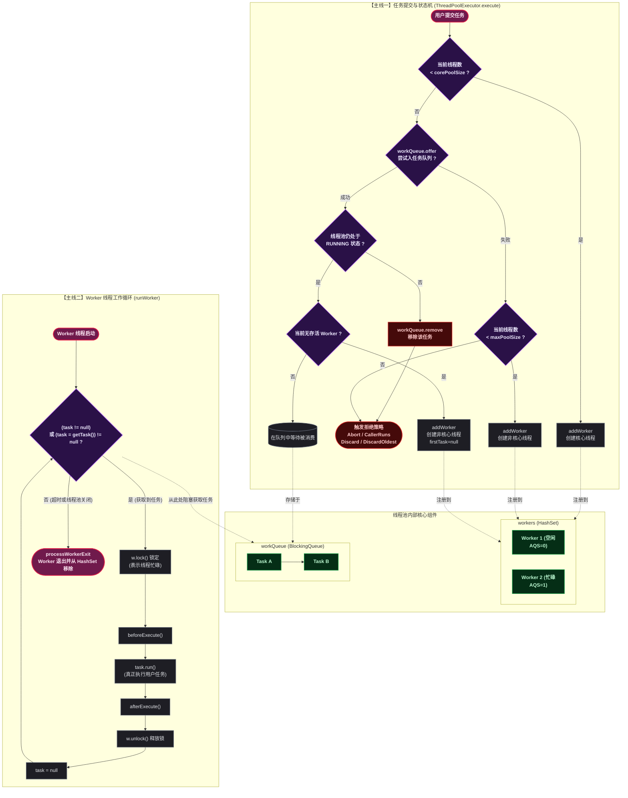
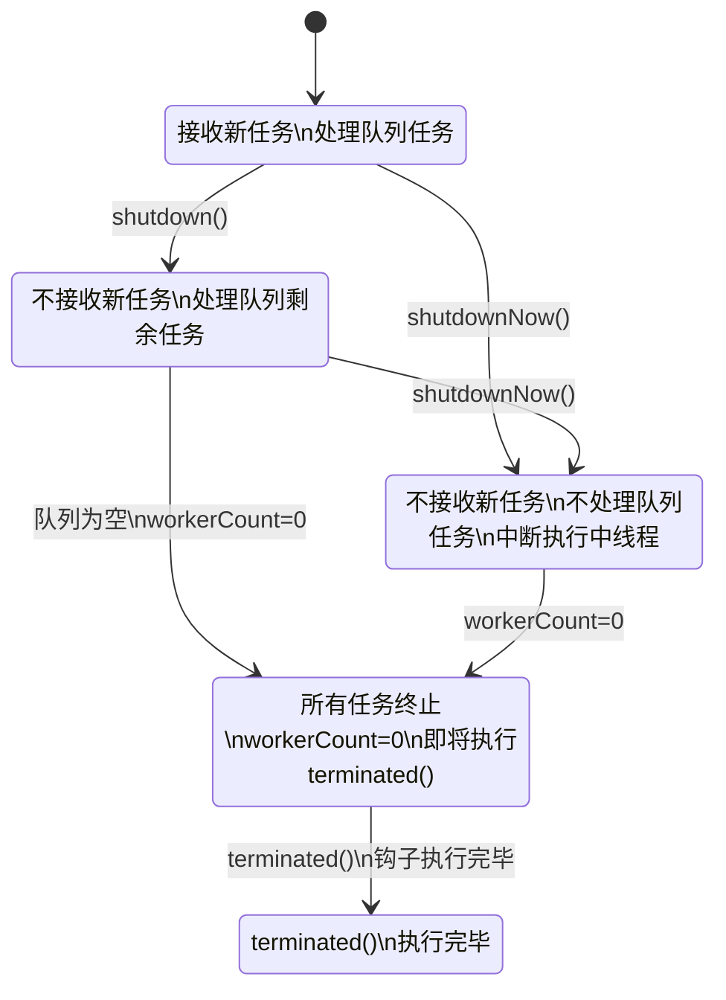
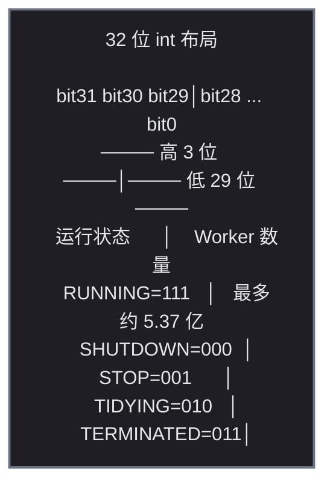
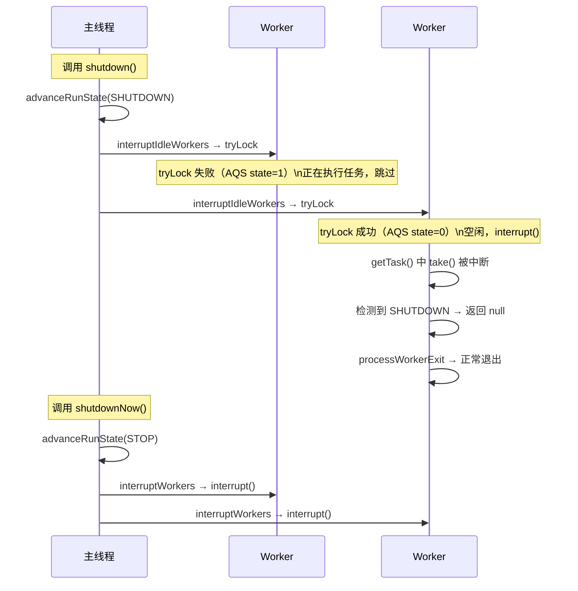
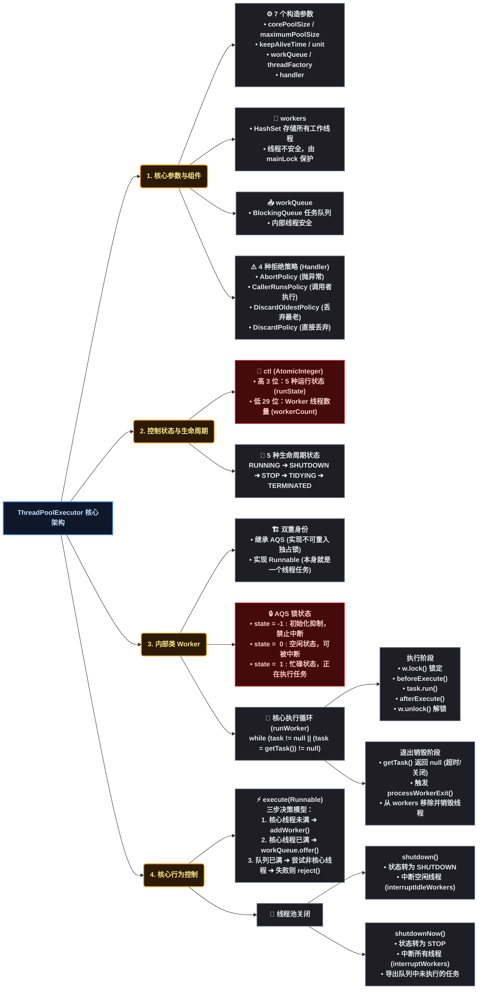

# ThreadPoolExecutor 源码解析：Worker 机制、生命周期、拒绝策略与动态线程池实践

## 🚀 道格·李为什么需要一个线程池

Java 1.0 就支持多线程，但管理线程生命周期这件事一直缺少标准方案。开发者每次需要异步执行时，要么 `new Thread().start()`，要么自己维护一个线程管理队列——前者浪费资源，后者极易出错。

一个线程的创建和销毁是有成本的。JVM 要为每个线程分配栈内存（默认约 1MB），操作系统要为每个线程维护内核线程表项和调度上下文。当并发请求量上来后，频繁创建/销毁线程会导致：

1. <strong>内存压力</strong>——大量线程的栈内存吃掉堆外空间
2. <strong>CPU 浪费在上下文切换</strong>——线程数远超 CPU 核心数时，CPU 的时间片都消耗在"换人"而不是"干活"上
3. <strong>线程数不可控</strong>——请求峰值时线程数无上限增长，最终 OOM 或系统不可用

道格·李在设计 JSR 166 时面对的核心问题是：<strong>如何让开发者既能享受多线程的并发收益，又不用直接管理线程的创建和销毁？</strong> 答案是把线程抽象为一种可复用的资源——线程池。

线程池的本质是一个"线程 + 任务队列"的组合：<strong>核心线程常驻</strong>，任务多时创建临时线程分担，任务少时回收空闲线程，任务太多时由拒绝策略兜底。从设计上看，`ThreadPoolExecutor` 把线程的创建策略（core/max）、存活策略（keepAliveTime）、排队策略（workQueue）和过载策略（rejectedExecutionHandler）全部暴露为可配置参数——这正是道格·李的设计风格：<strong>不替开发者做决定，而是把决策权交给调用方</strong>。

## 📐 七大核心参数

`ThreadPoolExecutor` 最完整的构造器接受 7 个参数：

```java
public ThreadPoolExecutor(int corePoolSize,
                          int maximumPoolSize,
                          long keepAliveTime,
                          TimeUnit unit,
                          BlockingQueue<Runnable> workQueue,
                          ThreadFactory threadFactory,
                          RejectedExecutionHandler handler)
```

### ⚙️ 1. corePoolSize — 核心线程数

线程池中始终存活的线程数量（除非 `allowCoreThreadTimeOut` 设为 true）。即使这些线程当前空闲，也不会被回收。

关键行为：当提交任务时，**即使有空闲的核心线程，只要当前线程数少于 `corePoolSize`，线程池也会继续创建新的线程**——先凑够核心线程数量，再谈复用。这种"先扩容再复用"是出于设计上的简单性：判断是否达到核心线程数的开销远小于判断是否有空闲线程且空闲线程是否可用。

### 📐 2. maximumPoolSize — 最大线程数

线程池允许创建的最大线程数。只有当工作队列已满且当前线程数不足 `maximumPoolSize` 时，才会创建超出核心线程数的额外线程。

关键约束：**如果使用无界队列（如 `LinkedBlockingQueue` 不指定容量），这个参数实际上失效**——因为队列永远不会满，永远走不到"创建额外线程"这一步。线程数最多只会达到 `corePoolSize`。

### 💤 ⏰ 3. keepAliveTime + unit — 空闲存活时间

当线程数超过 `corePoolSize` 时，多余的空闲线程在经过 `keepAliveTime` 后会被回收终止。如果调用了 `allowCoreThreadTimeOut(true)`，核心线程也会被超时回收。

### 📋 4. workQueue — 工作队列（阻塞队列）

存放等待执行的任务。JDK 提供四种常用实现：

| 队列类型 | 底层结构 | 有界/无界 | 关键行为 | 适用场景 |
|---------|---------|:---:|---------|---------|
| `ArrayBlockingQueue` | 数组 | 有界，必须指定容量 | FIFO，单锁 | 需严格限制排队长度的场景 |
| `LinkedBlockingQueue` | 链表 | 可指定容量，默认 `Integer.MAX_VALUE` | FIFO，双锁（putLock/takeLock） | 高吞吐，需注意默认无界 |
| `SynchronousQueue` | 无内部存储 | 容量为 0 | 提交必须等待一个 take 操作，无锁 | 任务需被立即消费的场景，配合大 maxPool 使用 |
| `PriorityBlockingQueue` | 数组实现的堆 | 无界 | 按 `Comparable` 或 `Comparator` 排序 | 任务有优先级差异的场景 |

### 🏭 5. threadFactory — 线程工厂

创建新线程的工厂。默认使用 `Executors.defaultThreadFactory()`，创建的线程属于同一个 `ThreadGroup`，命名格式为 `pool-N-thread-M`，优先级为 `NORM_PRIORITY`，非守护线程。

自定义工厂可以做：设置有意义的前缀名、设为守护线程、设置 `UncaughtExceptionHandler`。

### 📐 6. handler — 拒绝策略（RejectedExecutionHandler）

当工作队列已满且当前线程数达到 `maximumPoolSize` 时，新提交的任务会被拒绝。JDK 提供四种内置策略（后文有完整源码分析，此处先概览）：

| 策略 | 行为 | 一句话 |
|------|------|--------|
| `AbortPolicy` | 抛出 `RejectedExecutionException` | 默认策略，让调用方感知 |
| `CallerRunsPolicy` | 由提交任务的线程直接执行任务 | 变相降低提交速率 |
| `DiscardOldestPolicy` | 丢弃队列头部（最旧）任务，重新 submit | 偏向处理最新任务 |
| `DiscardPolicy` | 静默丢弃，不抛异常 | 允许丢失非关键任务 |

## 📋 核心字段一览

在深入 Worker 和流程之前，先认清 `ThreadPoolExecutor` 本身持有的关键字段：

```java
// JDK 源码：ThreadPoolExecutor 核心字段
public class ThreadPoolExecutor extends AbstractExecutorService {

    // ① ctl：高 3 位 = 运行状态，低 29 位 = Worker 数量
    private final AtomicInteger ctl = new AtomicInteger(ctlOf(RUNNING, 0));

    // ② 线程池参数（构造时设定，不可修改）
    private final BlockingQueue<Runnable> workQueue;       // 工作队列
    private final ReentrantLock mainLock = new ReentrantLock(); // 全局锁，保护 workers 集合
    private final HashSet<Worker> workers = new HashSet<>();   // 存放所有存活 Worker
    private final Condition termination = mainLock.newCondition(); // 等待终止的条件变量
    private int largestPoolSize;       // 历史最大同时线程数（监控用）
    private long completedTaskCount;   // 已完成任务总数（所有 Worker 的 completedTasks 之和）
    private volatile ThreadFactory threadFactory;          // 线程工厂（volatile，可替换）
    private volatile RejectedExecutionHandler handler;     // 拒绝策略（volatile，可替换）
    private volatile long keepAliveTime;                   // 空闲存活时间（volatile，可动态修改）
    private volatile boolean allowCoreThreadTimeOut;       // 是否允许核心线程超时
    private volatile int corePoolSize;                     // 核心线程数（volatile，可动态修改）
    private volatile int maximumPoolSize;                  // 最大线程数（volatile，可动态修改）

    // ③ 默认拒绝策略
    private static final RejectedExecutionHandler defaultHandler = new AbortPolicy();
}
```

字段分类理解：

| 类别 | 字段 | 可变性 | 保护机制 |
|------|------|:---:|------|
| 状态+计数 | `ctl` | 每次 CAS 原子更新 | `AtomicInteger` + CAS |
| Worker 集合 | `workers`，`largestPoolSize`，`completedTaskCount` | 持 `mainLock` 后修改 | `ReentrantLock mainLock` |
| 可动态调参 | `corePoolSize`，`maximumPoolSize`，`keepAliveTime`，`threadFactory`，`handler`，`allowCoreThreadTimeOut` | volatile 直接写 | `volatile` 保证可见性 |
| 不可变 | `workQueue` | final | 构造时一次性设定 |

`mainLock` 的作用仅限保护 `workers` 集合的 `add`/`remove` 操作以及 `largestPoolSize`/`completedTaskCount` 的更新。任务提交和执行完全不经过 `mainLock`——**锁粒度极小**。

## 🔍 Worker 内部类详解

`Worker` 是 `ThreadPoolExecutor` 最核心的内部类，它同时扮演三个角色：**任务执行者**（实现 `Runnable`）、**锁**（继承 `AQS`）、**线程容器**（持有 `Thread`）。

### 📝 完整类定义

```java
// JDK 源码：ThreadPoolExecutor.Worker 内部类（完整注释版）
private final class Worker
        extends AbstractQueuedSynchronizer   // ① 继承 AQS，充当不可重入的互斥锁
        implements Runnable {               // ② 实现 Runnable，是线程的执行入口

    private static final long serialVersionUID = 6138294804551838833L;

    final Thread thread;                    // ③ 执行任务的线程（通过线程工厂创建）
    Runnable firstTask;                     // ④ 创建 Worker 时的首个任务（可为 null）
    volatile long completedTasks;           // ⑤ 该 Worker 已完成的任务计数

    // 构造器
    Worker(Runnable firstTask) {
        setState(-1);                       // ⑥ 抑制中断：构造期间 state=-1，lock 失败
        this.firstTask = firstTask;
        this.thread = getThreadFactory().newThread(this);  // ⑦ 将自身作为 Runnable 创建线程
    }

    // Runnable 入口：委托给外部 runWorker()
    public void run() {
        runWorker(this);                    // ⑧ 线程启动后，进入 runWorker 执行循环
    }

    // ---- AQS 锁方法 ----
    protected boolean isHeldExclusively() { return getState() != 0; } // ⑨ state≠0 表示已锁定

    protected boolean tryAcquire(int unused) {                         // ⑩ CAS 抢锁
        if (compareAndSetState(0, 1)) {
            setExclusiveOwnerThread(Thread.currentThread());
            return true;
        }
        return false;
    }

    protected boolean tryRelease(int unused) {                         // ⑪ 释放锁
        setExclusiveOwnerThread(null);
        setState(0);
        return true;
    }

    public void lock()        { acquire(1); }      // ⑫ 阻塞获取锁
    public boolean tryLock()  { return tryAcquire(1); } // ⑬ 非阻塞尝试获取
    public void unlock()      { release(1); }      // ⑭ 释放锁
    public boolean isLocked() { return isHeldExclusively(); } // ⑮ 是否已锁定
}
```

### 🤔 为什么 Worker 继承 AQS 而不是用 ReentrantLock？

设计理由有两点：

**1. 不可重入**。`ReentrantLock` 允许同一个线程重复获取锁，但 Worker 的场景恰恰相反——同一个线程（Worker 自身）在执行任务期间已经 `lock()`，此时如果再尝试 `tryLock()` 永远返回 false。这正是 `shutdown()` 所需要的语义：**能 `tryLock` 成功就说明 Worker 空闲（没有在执行任务），可以安全中断**。如果用 `ReentrantLock`，持有锁的线程自己再 `tryLock` 会成功，导致无法区分空闲和忙碌。

**2. 更轻量**。AQS 本身不依赖任何重量级对象，避免了 `ReentrantLock` 内部维护的额外字段。

### 📐 setState(-1) 的设计意图

构造器中 `setState(-1)` 将 AQS 的 state 设为 -1。在 `tryAcquire` 中，CAS 从 0 到 1 才能成功。state=-1 意味着 **任何线程** 都无法通过 `tryAcquire`/`lock` 获取这把锁：

```java
// 在 runWorker() 最开头：
w.unlock();  // 将 state 从 -1 改为 0，允许中断
```

直到 `runWorker()` 显式调用 `w.unlock()`（`tryRelease` 将 state 设回 0），Worker 才变得"可锁定"和"可被中断"。这保证了在 Worker 线程启动到进入 `runWorker` 之间的这段时间内，`shutdown()` 不会错误地中断一个尚未就绪的 Worker。

### 🔢 Worker 的状态含义

| AQS state 值 | Worker 状态 | 含义 |
|:---:|:---:|------|
| `-1` | 初始化中 | 构造器中设置，线程尚未启动，屏蔽中断 |
| `0` | 空闲 | `runWorker` 中 `unlock()` 后，等待从 `getTask()` 获取新任务 |
| `1` | 忙碌 | `runWorker` 中 `lock()` 后，正在执行 `task.run()` |

## 🏊 线程池工作原理全景图

在深入源码之前，先建立整体认知。这张图涵盖了 **workers**（`HashSet<Worker>`）、**workQueue**（阻塞队列）、**Worker** 内部类 三大核心组件，以及任务从提交到执行的完整路径：



三大容器的角色定位：

| 容器 | 类型 | 线程安全机制 | 作用 |
|------|------|------------|------|
| `workers` | `HashSet<Worker>` | 全局 `mainLock`（`ReentrantLock`）保护 add/remove | 存放所有存活 Worker，用于 `shutdown` 时遍历中断 |
| `workQueue` | `BlockingQueue<Runnable>` | 队列自身保证（CAS 或 Lock） | 缓冲等待执行的任务，生产者（execute）-消费者（getTask）的核心桥梁 |
| `Worker` 自身 | AQS + `Runnable` | `state` 字段（CAS）标记空闲/忙碌 | 封装线程 + 任务，`tryLock` 判断 Worker 是否可安全中断 |

## 🔢 生命周期状态机

线程池内部通过 `ctl` 字段的高 3 位表示 5 种运行状态：



五种状态对应的 `ctl` 值：

| 状态 | 高 3 位值 | 十进制（ctl 高 3 位部分） | 触发方法 | 接收新任务 | 处理队列任务 |
|------|:---:|:---:|---------|:---:|:---:|
| `RUNNING` | 111 | 负数 | 初始状态 | 是 | 是 |
| `SHUTDOWN` | 000 | 0 | `shutdown()` | 否 | 是 |
| `STOP` | 001 | 2^29 | `shutdownNow()` | 否 | 否 |
| `TIDYING` | 010 | 2^30 | 自动过渡 | 否 | 否 |
| `TERMINATED` | 011 | 3×2^29 | 自动过渡 | 否 | 否 |

关键设计：`RUNNING` 用负值编码，其余用非负值。所以状态判断可以直接比较数值大小：`if (state >= SHUTDOWN)` 等价于"线程池已经进入关闭流程"，这种简洁的数值比较在 `execute`、`addWorker`、`getTask` 中大量使用。

## 📋 ctl 字段：一个 AtomicInteger 存储两维信息

```java
// JDK 源码：ctl 位运算设计
private final AtomicInteger ctl = new AtomicInteger(ctlOf(RUNNING, 0));
private static final int COUNT_BITS = Integer.SIZE - 3;       // 29
private static final int CAPACITY   = (1 << COUNT_BITS) - 1;  // 2^29 - 1 ≈ 5.37 亿

// 五个状态常量的二进制布局（高 3 位不同值，低 29 位全 0）
private static final int RUNNING    = -1 << COUNT_BITS;  // 111 000...000
private static final int SHUTDOWN   =  0 << COUNT_BITS;  // 000 000...000
private static final int STOP       =  1 << COUNT_BITS;  // 001 000...000
private static final int TIDYING    =  2 << COUNT_BITS;  // 010 000...000
private static final int TERMINATED =  3 << COUNT_BITS;  // 011 000...000

// 三个位运算工具方法
private static int runStateOf(int c)     { return c & ~CAPACITY; }  // 取高 3 位（状态）
private static int workerCountOf(int c)  { return c & CAPACITY;  }  // 取低 29 位（Worker 数）
private static int ctlOf(int rs, int wc) { return rs | wc;       }  // 合并（状态 | Worker 数）
```

图解一个 int 的 32 位布局：



设计要点：

1. **一个字段存两维信息**：避免状态和计数的竞争问题——如果分开存储，可能出现"状态已 SHUTDOWN 但 Worker 计数尚未更新"的中间状态
2. **RUNNING 用 `-1 << 29`**：高 3 位为 111，整体为负值。SHUTDOWN 为 0。所以 `state >= SHUTDOWN` 只用一条比较指令就能判断"是否正在关闭"
3. **Worker 数量上限**：`2^29 - 1` 约 5.37 亿，远超实际场景，因此溢出的场景可以忽略

## 📖 核心源码调用链

### 📤 execute()：任务提交入口

```java
// JDK 源码：ThreadPoolExecutor.execute()
public void execute(Runnable command) {
    if (command == null) throw new NullPointerException();
    int c = ctl.get();

    // 第1步：当前线程数 < corePoolSize → 直接创建核心线程
    if (workerCountOf(c) < corePoolSize) {
        if (addWorker(command, true))                       // true = 核心线程模式
            return;
        c = ctl.get();                                     // 失败则重读 ctl
    }

    // 第2步：线程池 RUNNING → 尝试入队
    if (isRunning(c) && workQueue.offer(command)) {
        int recheck = ctl.get();
        if (!isRunning(recheck) && remove(command))       // double check①：状态变了?
            reject(command);
        else if (workerCountOf(recheck) == 0)              // double check②：线程都死了?
            addWorker(null, false);                        // 补充一个线程
    }

    // 第3步：队列满 → 尝试创建非核心线程 → 失败则拒绝
    else if (!addWorker(command, false))                   // false = 非核心线程模式
        reject(command);
}
```

三步决策逻辑表：

| 步骤 | 条件 | 动作 | 失败后的 fallback |
|:---:|------|------|------|
| 1 | `workerCount < corePoolSize` | `addWorker(command, true)` 直接执行 | 进入步骤 2 |
| 2 | 线程池 RUNNING 且队列未满 | `workQueue.offer(command)` 入队 | 进入步骤 3 |
| 3 | 队列已满 | `addWorker(command, false)` 创建临时线程 | `reject(command)` 触发拒绝策略 |

**Double Check 的两种场景**：

- **场景 ①**（状态变更）：任务入队后，线程池被 `shutdown()`——此时任务仍在队列中但不会再被执行。通过 `remove(command)` 从队列移除，然后 `reject` 拒绝
- **场景 ②**（全员死亡）：任务入队后，所有 Worker 都因异常而退出（`workerCount == 0`）——此时任务在队列中但没有线程去取。通过 `addWorker(null, false)` 补充一个线程去消费队列

### 👷 addWorker()：创建 Worker 并启动线程

```java
// JDK 源码：addWorker()
private boolean addWorker(Runnable firstTask, boolean core) {
    retry:
    for (int c = ctl.get();;) {
        // ① 状态合法性检查
        if (runStateAtLeast(c, SHUTDOWN)
            && (runStateAtLeast(c, STOP)     // STOP 及以上 → 决不允许
                || firstTask != null          // SHUTDOWN + 带任务 → 不允许
                || workQueue.isEmpty()))      // SHUTDOWN + 队列空 → 没必要
            return false;

        for (;;) {
            // ② 容量检查：core=true 则上限为核心线程数，否则为最大线程数
            if (workerCountOf(c) >= ((core ? corePoolSize : maximumPoolSize)
                                      & CAPACITY))
                return false;
            if (compareAndIncrementWorkerCount(c))    // CAS 将 Worker 计数 +1
                break retry;                         // 成功，跳出双层循环
            c = ctl.get();
            if (runStateAtLeast(c, SHUTDOWN))         // 状态变了，回外层重新检查
                continue retry;
        }
    }

    // ③ 创建 Worker
    boolean workerStarted = false;
    boolean workerAdded = false;
    Worker w = null;
    try {
        w = new Worker(firstTask);                   // 内部：setState(-1) + 创建线程
        final Thread t = w.thread;
        if (t != null) {
            final ReentrantLock mainLock = this.mainLock;
            mainLock.lock();                          // ④ 持 mainLock 操作 workers
            try {
                int c = ctl.get();
                if (isRunning(c) ||                   // RUNNING 状态
                    (runStateLessThan(c, STOP) && firstTask == null)) { // SHUTDOWN + 无任务
                    if (t.isAlive())                  // 新线程不应已存活
                        throw new IllegalThreadStateException();
                    workers.add(w);                   // ⑤ 加入 HashSet
                    int s = workers.size();
                    if (s > largestPoolSize)
                        largestPoolSize = s;          // ⑥ 更新历史最大线程数
                    workerAdded = true;
                }
            } finally {
                mainLock.unlock();
            }
            if (workerAdded) {
                t.start();                             // ⑦ 启动线程 → Worker.run() → runWorker()
                workerStarted = true;
            }
        }
    } finally {
        if (!workerStarted)
            addWorkerFailed(w);                       // ⑧ 回滚清理
    }
    return workerStarted;
}
```

逐段讲解：

**① 状态检查**：三种情况不允许创建 Worker：线程池已 STOP（必须全停）、线程池 SHUTDOWN 但带了 firstTask（关闭后不接新任务）、线程池 SHUTDOWN 且队列已空（无任务需要执行）。

**② CAS 自旋**：先 CAS 给 Worker 计数 +1，争抢到名额后才进入 ③ 创建线程。如果状态变了回外层重新做状态检查。

**③ ~ ⑥ 持锁加入 workers**：线程创建成功后，必须持有 `mainLock` 才能操作 `workers` 集合。期间再次检查状态以防止并发关闭。**从 CAS 计数到加入 workers 之间有一个微妙的窗口**：线程已经"被计数"但尚未加入 workers。如果这一瞬间 `shutdownNow()` 遍历 workers，它看不到这个新 Worker——这就是为什么 `shutdownNow()` 最后会调用 `tryTerminate()`，而 `tryTerminate` 会检查 `workerCount` 是否为 0。

**⑦ 启动线程**：`t.start()` → JVM 调用 `Worker.run()` → `runWorker(this)`。Worker 线程正式开始执行循环。

**⑧ addWorkerFailed 回滚**：如果线程因 OOM 等原因创建失败，需要从 `workers` 中移除（如果已加入）、递减 Worker 计数、调用 `tryTerminate()`：

```java
// JDK 源码：addWorkerFailed()
private void addWorkerFailed(Worker w) {
    final ReentrantLock mainLock = this.mainLock;
    mainLock.lock();
    try {
        if (w != null)
            workers.remove(w);                // 从 workers 中移除
        decrementWorkerCount();               // Worker 计数 -1
        tryTerminate();                       // 尝试进入 TERMINATED
    } finally {
        mainLock.unlock();
    }
}
```

### ▶️ runWorker()：任务执行循环

```java
// JDK 源码：runWorker()
final void runWorker(Worker w) {
    Thread wt = Thread.currentThread();
    Runnable task = w.firstTask;
    w.firstTask = null;                        // ① firstTask 已取出，置 null
    w.unlock();                                // ② state 从 -1 改到 0，允许中断

    boolean completedAbruptly = true;          // ③ 是否异常退出（默认 true）
    try {
        while (task != null || (task = getTask()) != null) {  // ④ 循环获取任务
            w.lock();                          // ⑤ 加锁，标记 Worker 忙碌

            // ⑥ 响应中断检查
            if ((runStateAtLeast(ctl.get(), STOP) ||            // 线程池已 STOP
                 (Thread.interrupted() && runStateAtLeast(ctl.get(), STOP)))
                && !wt.isInterrupted())
                wt.interrupt();

            try {
                beforeExecute(wt, task);       // ⑦ 钩子：执行前（子类可覆盖）
                task.run();                    // ⑧ 执行用户任务
                afterExecute(task, null);      // ⑨ 钩子：执行后
            } catch (Throwable ex) {
                afterExecute(task, ex);        // ⑩ 钩子：异常时
                throw ex;
            } finally {
                task = null;
                w.completedTasks++;            // ⑪ 该 Worker 完成计数 +1
                w.unlock();                    // ⑫ 解锁，标记 Worker 空闲
            }
        }
        completedAbruptly = false;             // ⑬ 正常退出循环
    } finally {
        processWorkerExit(w, completedAbruptly);  // ⑭ Worker 退出处理
    }
}
```

关键设计点：

**② `w.unlock()` 解除抑制**：构造器中 `setState(-1)` 让 Worker 不可锁定，`unlock()`（调用 `tryRelease`）将 state 从 -1 设为 0。此后 `shutdown()` 的 `interruptIdleWorkers()` 才能通过 `tryLock` 拿到空闲 Worker 的锁，进而中断它。

**⑤ ~ ⑫ 锁保护执行区间**：从 `lock()` 到 `unlock()` 之间，Worker 的 AQS state=1。这意味着：
- `shutdown()` 调用 `tryLock()` 时会失败 → 不会中断这个 Worker → 正在执行的任务不受干扰
- `isLocked()` 返回 true → 监控可以区分哪些线程在忙碌

**⑥ 中断传播**：如果线程池已 STOP，确保当前线程的中断状态被设置，这样那些检查 `Thread.interrupted()` 的用户任务可以及时感知到关闭信号。

**⑬ `completedAbruptly`**：`true` 表示循环因异常退出（`task.run()` 抛异常），`false` 表示因 `getTask()` 返回 null 而正常退出。这个标记在 `processWorkerExit` 中决定是否需要补充新线程。

### ♻️ getTask()：从队列取任务 + 线程回收

```java
// JDK 源码：getTask()
private Runnable getTask() {
    boolean timedOut = false;                    // 标记上一次 poll 是否超时
    for (;;) {
        int c = ctl.get();

        // ① 是否应该让 Worker 退出
        if (runStateAtLeast(c, SHUTDOWN)
            && (runStateAtLeast(c, STOP) || workQueue.isEmpty())) {
            decrementWorkerCount();
            return null;                         // 返回 null → runWorker 退出循环
        }

        int wc = workerCountOf(c);
        // ② 是否需要超时取任务
        boolean timed = allowCoreThreadTimeOut || wc > corePoolSize;

        // ③ 是否满足退出条件
        if ((wc > maximumPoolSize || (timed && timedOut))
            && (wc > 1 || workQueue.isEmpty())) {
            if (compareAndDecrementWorkerCount(c))
                return null;
            continue;                            // CAS 失败则重试
        }

        try {
            // ④ 从队列取任务
            Runnable r = timed ?
                workQueue.poll(keepAliveTime, TimeUnit.NANOSECONDS) :  // 超时版
                workQueue.take();                                       // 阻塞版
            if (r != null)
                return r;
            timedOut = true;                     // poll 超时，标记
        } catch (InterruptedException retry) {
            timedOut = false;                    // 被中断≠超时，重置标记
        }
    }
}
```

线程回收场景完整分析：

| 线程身份 | `timed` | 取任务 API | 队列为空时 | 超时后 |
|---------|:---:|---------|---------|---------|
| 核心线程（默认） | `false` | `take()` | 无限阻塞，线程一直存活 | 不适用（永不超时） |
| 非核心线程 | `true`（`wc > corePoolSize`） | `poll(keepAliveTime)` | 等待 `keepAliveTime` | 返回 null → `getTask` 返回 null → Worker 退出 |
| 核心线程（`allowCoreThreadTimeOut=true`） | `true` | `poll(keepAliveTime)` | 等待 `keepAliveTime` | 同上，核心线程也会被回收 |

③ 中的退出条件拆解：
- `wc > maximumPoolSize`：`setMaximumPoolSize()` 被动态调小后，多余的 Worker 在下一次 `getTask` 循环中退出
- `timed && timedOut`：开启了超时 + 上一次 poll 确实超时了 → 可退出
- `wc > 1 || workQueue.isEmpty()`：至少留 1 个线程处理队列中可能残留的任务

### 👷 processWorkerExit()：Worker 退出后的善后工作

```java
// JDK 源码：processWorkerExit()
private void processWorkerExit(Worker w, boolean completedAbruptly) {
    // ① 如果是异常退出，Worker 计数需要手动递减（正常退出已在 getTask 中递减）
    if (completedAbruptly)
        decrementWorkerCount();

    final ReentrantLock mainLock = this.mainLock;
    mainLock.lock();
    try {
        completedTaskCount += w.completedTasks;  // ② 累加已完成任务数
        workers.remove(w);                       // ③ 从 workers 移除
    } finally {
        mainLock.unlock();
    }

    tryTerminate();                              // ④ 尝试进入 TERMINATED

    int c = ctl.get();
    if (runStateLessThan(c, STOP)) {             // ⑤ 线程池未 STOP → 可能需要补充线程
        if (!completedAbruptly) {                // 正常退出
            // allowCoreThreadTimeOut 或 workerCount > corePoolSize → min=0 (不强制补充)
            // 否则 min = corePoolSize (保证至少保留核心线程)
            int min = allowCoreThreadTimeOut ? 0 : corePoolSize;
            if (min == 0 && !workQueue.isEmpty())
                min = 1;                         // 队列有任务则至少保留 1 个
            if (workerCountOf(c) >= min)
                return;                          // 足够，不补充
        }
        addWorker(null, false);                  // ⑥ 补充一个 Worker
    }
}
```

关键逻辑：

- **异常退出**（`completedAbruptly=true`）：Worker 因任务抛异常而退出，需要 `addWorker(null, false)` 补充一个新线程，防止线程池的线程悄悄减少
- **正常退出**：检查当前 Worker 数是否低于最低要求。如果低于，同样补充线程
- `tryTerminate()`：每次 Worker 退出后都尝试进入 TERMINATED 状态——如果线程池正在关闭，这是驱动状态推进的关键调用

### 🔄 tryTerminate()：推动关闭流程

```java
// JDK 源码：tryTerminate()
final void tryTerminate() {
    for (;;) {
        int c = ctl.get();
        // ① 不满足终止条件：还在 RUNNING / 已 TIDYING 以上 / SHUTDOWN 但队列不空
        if (isRunning(c) ||
            runStateAtLeast(c, TIDYING) ||
            (runStateLessThan(c, STOP) && !workQueue.isEmpty()))
            return;

        // ② workerCount 不为 0 → 中断一个空闲 Worker 使其去传播关闭逻辑
        if (workerCountOf(c) != 0) {
            interruptIdleWorkers(ONLY_ONE);       // 只中断一个
            return;
        }

        // ③ workerCount == 0 → 状态推进到 TIDYING，再推进到 TERMINATED
        final ReentrantLock mainLock = this.mainLock;
        mainLock.lock();
        try {
            if (ctl.compareAndSet(c, ctlOf(TIDYING, 0))) {  // CAS: 状态→TIDYING
                try {
                    terminated();                 // ④ 钩子方法（子类覆盖）
                } finally {
                    ctl.set(ctlOf(TERMINATED, 0)); // ⑤ 最终状态→TERMINATED
                    termination.signalAll();       // ⑥ 唤醒所有 awaitTermination 的线程
                }
                return;
            }
        } finally {
            mainLock.unlock();
        }
    }
}
```

推进链：`RUNNING → SHUTDOWN/STOP → (workerCount=0) → TIDYING → TERMINATED`

`tryTerminate()` 在多个位置被调用：`addWorkerFailed()`、`processWorkerExit()`、`shutdown()`、`shutdownNow()`。每次 Worker 数量变化或状态变更时都会尝试推动终止。

### 👷 shutdown() 与 shutdownNow() + interruptIdleWorkers

```java
// JDK 源码：shutdown() — 平缓关闭
public void shutdown() {
    final ReentrantLock mainLock = this.mainLock;
    mainLock.lock();
    try {
        checkShutdownAccess();               // 安全管理器检查
        advanceRunState(SHUTDOWN);           // ① CAS 推进状态 → SHUTDOWN
        interruptIdleWorkers();              // ② 只中断空闲 Worker
        onShutdown();                        // ③ 钩子（ScheduledThreadPoolExecutor 用）
    } finally { mainLock.unlock(); }
    tryTerminate();                          // ④ 尝试进入 TERMINATED
}

// JDK 源码：shutdownNow() — 立即关闭
public List<Runnable> shutdownNow() {
    List<Runnable> tasks;
    final ReentrantLock mainLock = this.mainLock;
    mainLock.lock();
    try {
        checkShutdownAccess();
        advanceRunState(STOP);               // ① CAS 推进状态 → STOP
        interruptWorkers();                  // ② 中断所有 Worker（不管是否忙碌）
        tasks = drainQueue();                // ③ 清空队列，返回未执行的任务
    } finally { mainLock.unlock(); }
    tryTerminate();
    return tasks;
}
```

两个中断方法的区别是核心：

```java
// interruptIdleWorkers()：只中断空闲 Worker
private void interruptIdleWorkers(boolean onlyOne) {
    final ReentrantLock mainLock = this.mainLock;
    mainLock.lock();
    try {
        for (Worker w : workers) {
            Thread t = w.thread;
            if (!t.isInterrupted() && w.tryLock()) {  // ★ tryLock 成功 = Worker 空闲
                try {
                    t.interrupt();
                } catch (SecurityException ignore) {
                } finally {
                    w.unlock();
                }
            }
            if (onlyOne) break;
        }
    } finally { mainLock.unlock(); }
}

// interruptWorkers()：中断所有 Worker
private void interruptWorkers() {
    for (Worker w : workers)
        w.interruptIfStarted();              // 中断已启动的线程（不管 AQS 状态）
}
```

`interruptIdleWorkers` 的巧妙之处：通过 `w.tryLock()` 判断 Worker 是否空闲——能获取锁说明 Worker 不在 `runWorker` 的 `lock()`/`unlock()` 区间内，即正在 `getTask()` 的 `take()/poll()` 中阻塞等待。此时中断它，线程会从 `take()/poll()` 中抛出 `InterruptedException`，`getTask` 捕获后继续循环，在步骤 ① 的状态检查中发现 SHUTDOWN，返回 null，Worker 退出。



### 🔥 prestartCoreThread / prestartAllCoreThreads：预热

```java
// 启动一个核心线程（即使没有任务）
public boolean prestartCoreThread() {
    return workerCountOf(ctl.get()) < corePoolSize
           && addWorker(null, true);         // firstTask=null，线程从 getTask 取任务
}

// 启动所有核心线程
public int prestartAllCoreThreads() {
    int n = 0;
    while (addWorker(null, true))
        ++n;
    return n;                                // 返回实际启动的线程数
}
```

用途：在流量到达之前先创建好核心线程，避免前几波请求的延迟被线程创建拖慢。典型的预热模式。

### 🔧 submit() 的内部实现：FutureTask 包装

```java
// AbstractExecutorService.submit()
public <T> Future<T> submit(Callable<T> task) {
    if (task == null) throw new NullPointerException();
    RunnableFuture<T> ftask = newTaskFor(task);      // ① 包装为 FutureTask
    execute(ftask);                                   // ② 走正常的 execute 流程
    return ftask;                                     // ③ 返回 Future 供调用者等待
}

protected <T> RunnableFuture<T> newTaskFor(Callable<T> callable) {
    return new FutureTask<T>(callable);
}
```

`FutureTask` 内部维护一个 `state` 状态机：`NEW → COMPLETING → NORMAL/EXCEPTIONAL/CANCELLED/INTERRUPTED`。`run()` 方法调用 `callable.call()`，成功则 `set(result)` 唤醒 `get()` 中等待的线程，异常则 `setException(ex)`。这是 `submit` 能返回 `Future` 的原因——任务的执行结果被 `FutureTask` 内部捕获。

## 📖 四种拒绝策略源码逐行解析

JDK 提供了四种内置 `RejectedExecutionHandler`，全部定义在 `ThreadPoolExecutor` 内部：

### 📐 1. AbortPolicy（默认策略）

```java
// JDK 源码：AbortPolicy
public static class AbortPolicy implements RejectedExecutionHandler {
    public AbortPolicy() { }
    public void rejectedExecution(Runnable r, ThreadPoolExecutor e) {
        throw new RejectedExecutionException("Task " + r.toString()
            + " rejected from " + e.toString());     // 直接抛异常
    }
}
```

行为：直接抛出 `RejectedExecutionException`（运行时异常），调用者如果不 catch 则向上传播。

适用场景：希望感知每次拒绝事件的场景。结合监控告警可以在抛异常时触发报警。缺点是如果不加 try-catch，会导致提交任务的线程（如 Tomcat 的工作线程）直接异常退出。

### 🔄 2. CallerRunsPolicy

```java
// JDK 源码：CallerRunsPolicy
public static class CallerRunsPolicy implements RejectedExecutionHandler {
    public CallerRunsPolicy() { }
    public void rejectedExecution(Runnable r, ThreadPoolExecutor e) {
        if (!e.isShutdown()) {
            r.run();                                 // 由调用者线程直接执行
        }
    }
}
```

行为：不让线程池执行，而是由提交任务的线程（调用者）直接同步执行 `r.run()`。

特殊效果——**天然限流**：因为调用者线程在执行任务期间无法继续提交新任务，相当于变相降低了任务提交速率，给线程池喘息时间。适合需要"背压"（back pressure，通过让生产者减速来匹配消费者速率）的场景。

代价：调用者线程被占用，如果调用者是 Tomcat 工作线程，意味着该 HTTP 请求的响应时间会变长（包括了任务执行的时间）。

### 🗑️ 3. DiscardOldestPolicy

```java
// JDK 源码：DiscardOldestPolicy
public static class DiscardOldestPolicy implements RejectedExecutionHandler {
    public DiscardOldestPolicy() { }
    public void rejectedExecution(Runnable r, ThreadPoolExecutor e) {
        if (!e.isShutdown()) {
            e.getQueue().poll();                     // 丢弃队列头部（最旧）任务
            e.execute(r);                            // 重新提交当前任务
        }
    }
}
```

行为：从队列头部丢弃一个等待最久的任务，然后重新 `execute(r)` 尝试提交当前任务（通常会成功入队）。

注意：重新 `execute(r)` 可能再次触发拒绝——如果此时恰好有另一个线程同时提交，队列又满了。但 `execute` 本身没有递归保护，理论上在当前实现下不会导致无限循环（因为每次 `execute` 前都丢弃了一个任务）。

### 🗑️ 4. DiscardPolicy

```java
// JDK 源码：DiscardPolicy
public static class DiscardPolicy implements RejectedExecutionHandler {
    public DiscardPolicy() { }
    public void rejectedExecution(Runnable r, ThreadPoolExecutor e) {
        // 什么也不做
    }
}
```

行为：静默丢弃。不抛异常，不执行任务，不记录日志。

适用场景：允许丢失的非关键任务（如非核心监控数据上报、日志采集等）。注意：使用此策略时应确保任务丢失不影响业务正确性。

### 📊 四种策略对比总结

| 维度 | AbortPolicy | CallerRunsPolicy | DiscardOldestPolicy | DiscardPolicy |
|------|------------|-----------------|---------------------|---------------|
| 是否抛异常 | 是 | 否 | 否 | 否 |
| 被拒任务是否被执行 | 否 | 是（调用者执行） | 可能（重新提交后） | 否 |
| 队列中任务是否丢失 | 否 | 否 | 是（丢弃最旧的） | 否 |
| 调用者线程阻塞 | 否 | 是（执行任务期间） | 否 | 否 |
| 适用场景 | 必须感知拒绝 | 需要限流削峰 | 偏向最新任务 | 允许丢失非关键任务 |
| 风险 | 异常未处理导致线程退出 | 响应时间不可控 | 旧任务可能永不执行 | 任务静默丢失难以发现 |

## 🛠️ 日常开发中的常用方法与 API

### 高频 API 速查

| 方法 | 签名 | 用途 | 频率 |
|------|------|------|:---:|
| `execute(Runnable)` | `void execute(Runnable)` | 提交无返回值任务 | 高 |
| `submit(Callable)` | `<T> Future<T> submit(Callable<T>)` | 提交有返回值任务 | 高 |
| `shutdown()` | `void shutdown()` | 平缓关闭 | 中 |
| `shutdownNow()` | `List<Runnable> shutdownNow()` | 立即关闭 | 中 |
| `awaitTermination(timeout, unit)` | `boolean awaitTermination(long, TimeUnit)` | 等待终止 | 中 |
| `setCorePoolSize(int)` | `void setCorePoolSize(int)` | 动态调核心线程数 | 中 |
| `setMaximumPoolSize(int)` | `void setMaximumPoolSize(int)` | 动态调最大线程数 | 中 |
| `prestartAllCoreThreads()` | `int prestartAllCoreThreads()` | 预热所有核心线程 | 低 |
| `getActiveCount()` | `int getActiveCount()` | 查询活跃线程数（近似） | 低 |
| `getQueue().size()` | `int getQueue().size()` | 查询队列长度 | 低 |
| `getCompletedTaskCount()` | `long getCompletedTaskCount()` | 查询已完成任务数 | 低 |
| `getLargestPoolSize()` | `int getLargestPoolSize()` | 查询历史峰值线程数 | 低 |
| `allowCoreThreadTimeOut(boolean)` | `void allowCoreThreadTimeOut(boolean)` | 允许核心线程超时回收 | 低 |

### 🛠️ 典型用法示例

**1. execute() 提交无返回值任务**

```java
ThreadPoolExecutor executor = new ThreadPoolExecutor(
    5, 20, 60L, TimeUnit.SECONDS,
    new ArrayBlockingQueue<>(100));

executor.execute(() -> doSomething());

// 关闭
executor.shutdown();
executor.awaitTermination(60, TimeUnit.SECONDS);
```

**2. submit() 获取返回值**

```java
Future<String> future = executor.submit(() -> computeResult());
String result = future.get(5, TimeUnit.SECONDS);  // 带超时等待
```

**3. ShutdownHook 优雅关闭**

```java
Runtime.getRuntime().addShutdownHook(new Thread(() -> {
    executor.shutdown();
    try {
        if (!executor.awaitTermination(30, TimeUnit.SECONDS)) {
            executor.shutdownNow();              // 超时强制关闭
            executor.awaitTermination(10, TimeUnit.SECONDS);
        }
    } catch (InterruptedException e) {
        executor.shutdownNow();
        Thread.currentThread().interrupt();
    }
}));
```

**4. CountDownLatch 等待批量任务**

```java
CountDownLatch latch = new CountDownLatch(100);
for (int i = 0; i < 100; i++) {
    executor.execute(() -> {
        try { process(); }
        finally { latch.countDown(); }
    });
}
latch.await(30, TimeUnit.SECONDS);
```

**5. Spring 线程池配置**

```java
@Bean("orderExecutor")
public ThreadPoolTaskExecutor orderExecutor() {
    ThreadPoolTaskExecutor executor = new ThreadPoolTaskExecutor();
    executor.setCorePoolSize(10);
    executor.setMaxPoolSize(50);
    executor.setQueueCapacity(200);
    executor.setKeepAliveSeconds(60);
    executor.setThreadNamePrefix("order-");
    executor.setRejectedExecutionHandler(
        new ThreadPoolExecutor.CallerRunsPolicy());
    executor.setWaitForTasksToCompleteOnShutdown(true);
    executor.setAwaitTerminationSeconds(60);
    executor.initialize();
    return executor;
}
```

**6. 自定义拒绝策略 + 监控告警**

```java
RejectedExecutionHandler handler = (r, executor) -> {
    log.error("任务被拒绝! active={}, poolSize={}, queueSize={}, completedTasks={}",
        executor.getActiveCount(), executor.getPoolSize(),
        executor.getQueue().size(), executor.getCompletedTaskCount());
    // 可选降级：持久化到数据库、发 MQ 重试
    saveToDeadLetterQueue(r);
};

ThreadPoolExecutor executor = new ThreadPoolExecutor(
    10, 50, 60L, TimeUnit.SECONDS,
    new ArrayBlockingQueue<>(200),
    new ThreadFactoryBuilder().setNameFormat("biz-%d").build(),
    handler);
```

## 🏊 阿里巴巴开发规范中的线程池建议

阿里巴巴《Java 开发手册》中关于线程池的核心规范：

### 📌 1. 【强制】禁止使用 Executors 创建线程池

必须通过 `ThreadPoolExecutor` 构造器直接创建。`Executors` 三个工厂方法的隐患：

| 工厂方法 | 具体缺陷 | 后果 |
|---------|---------|------|
| `newFixedThreadPool(n)` / `newSingleThreadExecutor()` | `LinkedBlockingQueue(Integer.MAX_VALUE)` 无界队列 | 队列无限堆积 → OOM |
| `newCachedThreadPool()` | `maximumPoolSize = Integer.MAX_VALUE`，`SynchronousQueue` | 线程无限创建 → OOM |
| `newScheduledThreadPool(n)` | `maximumPoolSize = Integer.MAX_VALUE`，`DelayedWorkQueue` 无界 | 同上 |

### 📌 2. 【推荐】线程池命名必须有意义

默认 `pool-N-thread-M` 无法快速定位问题。应自定义 ThreadFactory：

```java
ThreadFactory factory = new ThreadFactoryBuilder()
    .setNameFormat("order-processor-%d")
    .build();
```

### 📌 3. 【推荐】使用有界队列

无界队列导致 `maximumPoolSize` 和拒绝策略形同虚设。**队列长度应根据压测数据设定**。

### 📝 4. 【推荐】自定义拒绝策略

`AbortPolicy` 只是抛异常。生产环境需要记录拒绝时的线程池状态（用于复盘），并根据业务需求设计降级手段（持久化 + 重试、MQ 转储、告警通知等）。

## 🏊 动态线程池框架推荐

JDK 原生 `ThreadPoolExecutor` 的缺陷：只有 `corePoolSize` 和 `maximumPoolSize` 可以运行时修改，队列容量和拒绝策略不可变更。此外，缺乏统一的监控和告警能力。

主流动态线程池框架对比：

| 特性 | [Dynamic TP](https://dynamictp.cn) | [Hippo4J](https://hippo4j.cn) |
|------|------|------|
| 动态调参 | 支持，接入配置中心（Nacos/Apollo/ZK/Etcd） | 支持，自有配置中心 + Web 控制台 |
| 监控指标 | 线程池负载、队列容量、拒绝次数、任务耗时 | 同上 + 历史趋势图 |
| 告警 | 支持，可配置阈值（队列容量%、拒绝次数等） | 支持，多种告警通道（钉钉/飞书/企微/邮件） |
| 三方中间件线程池管理 | 支持（Dubbo、RocketMQ、Hystrix、Tomcat 等） | 支持 |
| 接入方式 | Spring Boot Starter 轻量接入 | Spring Boot Starter + 独立 Server |
| 运维界面 | 依赖配置中心 | 自带 Web Dashboard |

核心原理相同：通过反射或包装替换线程池内部组件（调 `setCorePoolSize`/`setMaximumPoolSize`，或替换 `workQueue`），并监听配置中心变更，自动刷新线程池参数。

```java
// 以 Dynamic TP 为例的简化示意
@Component
public class DtpMonitor {
    @Resource
    private ThreadPoolExecutor executor;

    @EventListener
    public void onConfigChange(ConfigChangeEvent event) {
        if (event.getKey().equals("threadpool.order")) {
            ThreadPoolConfig config = event.getNewValue();
            executor.setCorePoolSize(config.getCorePoolSize());
            executor.setMaximumPoolSize(config.getMaxPoolSize());
            executor.setKeepAliveTime(config.getKeepAlive(), TimeUnit.SECONDS);
        }
    }
}
```

> **注意**：队列容量的动态变更在原生 `ThreadPoolExecutor` 中不支持——因为 `workQueue` 是 `final` 的。动态线程池框架通常通过包装一层自定义队列或直接替换 `workQueue` 字段来解决。

## 📐 为什么参数几乎无法一次性配好

即使深刻理解了每个参数，实际项目中一次性配置正确几乎不可能。原因有五个层面：

### 📌 1. 流量是动态变化的


固定参数无法同时适配峰值和低谷。峰值时不够导致积压和拒绝，低谷时线程闲置浪费资源。

### ▶️ 2. 单次任务执行时间不恒定

同一个任务因缓存命中/未命中、下游服务状态、数据库负载等因素，执行时间可能从 2ms 波动到 2000ms。线程需求与平均执行时间成反比——任务变慢时，需要更多线程才能维持相同吞吐。

### 📌 3. 参数之间的耦合效应

四个参数组成一个整体，任意一个改动都会影响其他参数的实际效果：

| 参数组合 | 行为特征 |
|---------|---------|
| 大队列 + 小 maxPool | 线程稳定但延迟高，队列几乎不会被"跳过" |
| 小队列 + 大 maxPool | 弹性好但线程创建/销毁频繁，上下文切换多 |
| 大 corePool + 无界队列 | 线程固定、队列可能无限膨胀 → OOM 风险 |
| SynchronousQueue + 大 maxPool | 零排队延迟，但线程数随请求量剧烈波动 |

### 📌 4. 系统资源非线程池独占

JVM GC、数据库连接池、RPC 线程池、操作系统缓存等与线程池共享 CPU 和内存。线程池参数需要考虑整体资源约束——而这些约束随部署环境（物理机/容器/Pod）不同而不同。

### 📐 5. 实践策略

| 策略 | 做法 |
|------|------|
| **先基线** | CPU 密集型 `Ncpu + 1`，IO 密集型 `Ncpu * 2`（仅为起点） |
| **再压测** | 预发环境用生产级流量压测，记录各个 QPS 下的 ActiveCount、QueueSize、RejectedCount |
| **持续监控** | 生产环境持续收集 `ActiveCount`、`QueueSize`、`RejectedCount`、`TaskExecutionTime` |
| **动态调参** | 接入 Dynamic TP 或 Hippo4J，可视化观测 + 一键调参 |
| **分业务隔离** | 核心业务与非核心业务用独立线程池，避免相互影响 |

核心结论：**线程池参数没有"正确值"，只有"合适的区间"**。通过监控反馈 + 动态调参，逐步逼近当前负载下的最优配置。

## 🎯 总结

### 🔭 知识全景图



### 📋 核心概念速查表

| 概念 | 一句话解释 | 关键源码 |
|------|-----------|---------|
| ctl 位运算 | 一个 `AtomicInteger` 的高 3 位存状态 + 低 29 位存 Worker 数 | `runStateOf` / `workerCountOf` / `ctlOf` |
| Worker 三合一 | 继承 AQS（不可重入锁）+ 实现 Runnable（执行入口）+ 持有 Thread（线程引用） | `Worker` 内部类 |
| setState(-1) | 构造时抑制中断，`runWorker` 开头 `unlock` 解除 | `Worker(Runnable)` / `runWorker()` |
| tryLock 判断空闲 | 能拿到 AQS 锁 = Worker 不在执行任务 = 可以安全中断 | `interruptIdleWorkers()` |
| execute 三步 | 先直接创建核心线程 → 再入队 + double check → 队列满则创建临时线程或拒绝 | `execute(Runnable)` |
| addWorker 双层循环 | 外层检查状态，内层 CAS 抢 Worker 名额 | `addWorker(Runnable, boolean)` |
| getTask 双模式 | `allowCoreThreadTimeOut \|\| wc > corePoolSize` → `poll(超时)`，否则 `take(阻塞)` | `getTask()` |
| processWorkerExit | Worker 退出后累加完成计数、从 workers 移除、必要时补充线程 | `processWorkerExit(Worker, boolean)` |
| tryTerminate | 每次 Worker 变化后检查是否应该推进到 TIDYING→TERMINATED | `tryTerminate()` |
| interruptIdleWorkers | shutdown 时只中断 tryLock 成功的空闲 Worker | `interruptIdleWorkers()` |
| interruptWorkers | shutdownNow 时中断所有 Worker，不管是否忙碌 | `interruptWorkers()` |
| double check | 入队后重新验证线程池状态，防止状态变更导致任务永久挂起 | `execute()` 中入队后的 `recheck` |
| 拒绝策略 | 队列满 + 线程满时触发，4 种内置 + 可自定义 | `RejectedExecutionHandler` |
| AbortPolicy | 默认策略，抛 `RejectedExecutionException` | `AbortPolicy.rejectedExecution()` |
| CallerRunsPolicy | 调用者线程执行任务，天然限流 | `CallerRunsPolicy.rejectedExecution()` |

### ▶️ 完整任务执行链路

```
executor.execute(() -> doWork());

    ↓
execute(runnable)
    ↓ 步骤1: workerCount=3 < corePoolSize=5 → addWorker(command, true)
    ↓
addWorker:
    ① 状态检查（RUNNING?）→ 通过
    ② CAS 自旋: Worker 计数 3→4
    ③ new Worker(command):
        ├─ setState(-1)                     // 抑制中断
        ├─ this.firstTask = command
        └─ this.thread = factory.newThread(this)  // 将 Worker 自身作为 Runnable
    ④ 持 mainLock → workers.add(w) → 更新 largestPoolSize
    ⑤ t.start() → JVM 调用 Worker.run() → runWorker(this)
    ↓
runWorker(Worker w):
    ├─ w.firstTask = null                   // 取出 firstTask
    ├─ w.unlock()                            // state -1→0，允许中断
    └─ while (task != null || (task = getTask()) != null):
         ├─ w.lock()                         // state 0→1（忙碌）
         ├─ beforeExecute()                  // 钩子
         ├─ task.run()                       // ← 业务代码执行！
         ├─ afterExecute()                   // 钩子
         ├─ w.completedTasks++
         └─ w.unlock()                       // state 1→0（空闲）

    当 getTask() 返回 null（超时 或 线程池关闭）：
    ↓
processWorkerExit(w, completedAbruptly):
    ├─ completedTaskCount += w.completedTasks
    ├─ workers.remove(w)
    ├─ tryTerminate()                       // 尝试推进到 TERMINATED
    └─ 如果需要 → addWorker(null, false)     // 补充新线程
```

以上就是 `ThreadPoolExecutor` 从参数到源码、从原理到实践的完整分析。核心设计思想总结为四条：

1. **"一个 int 做两件事"**：`ctl` 的位运算使状态与计数原子安全地在同一字段中变更
2. **"Worker 身兼三职"**：AQS 实现不可重入的互斥锁（轻量 + 空闲判断）+ Runnable 实现执行入口 + Thread 持有者
3. **"锁粒度缩到最小"**：`mainLock` 只保护 `workers` 集合的增删，任务提交和执行完全在锁外进行
4. **"getTask 的双模式 + processWorkerExit 的自动补充"**：`poll` 超时实现惰性回收，`take` 阻塞保持核心线程存活，异常退出自动补人——形成一个自愈的线程生命周期管理闭环
