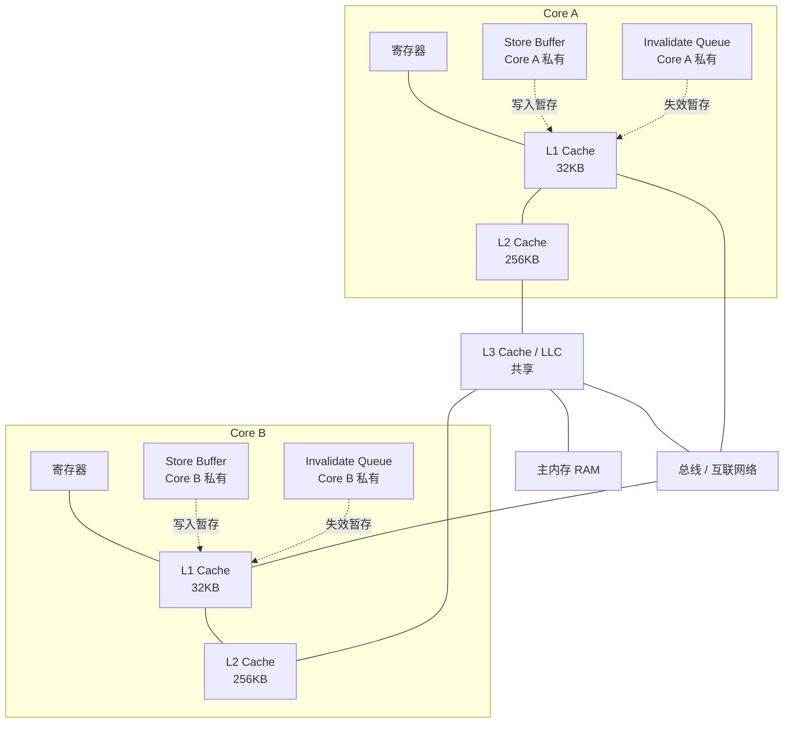
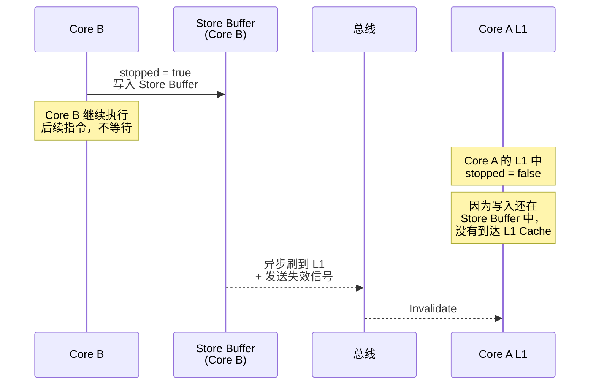
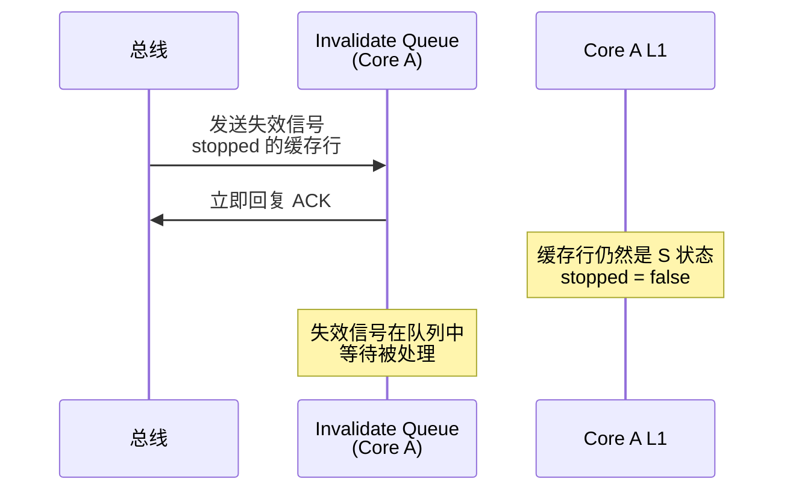
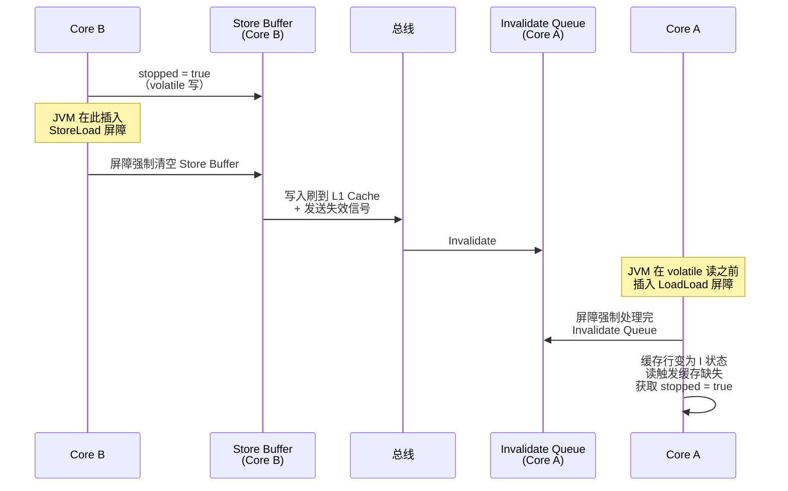
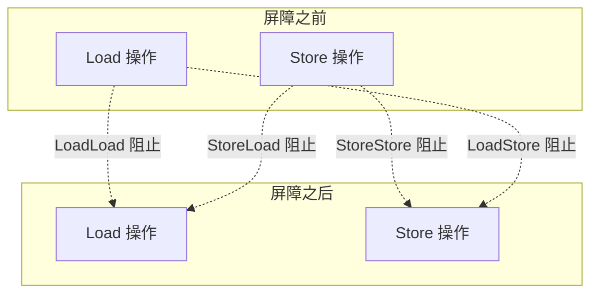
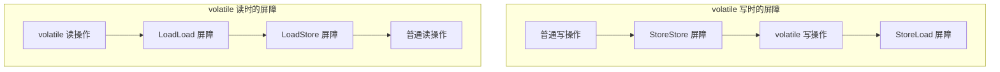
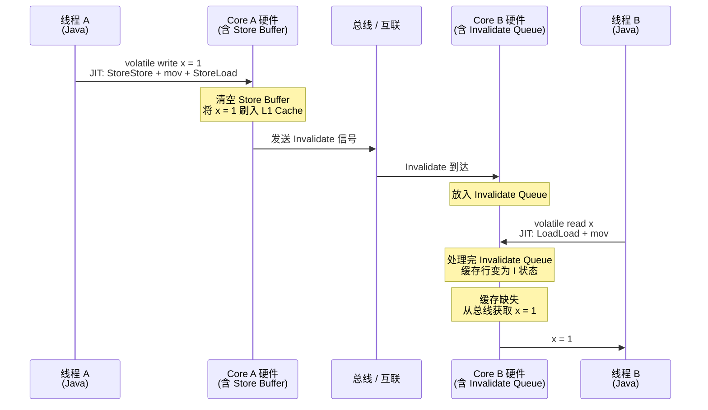

# volatile 如何填补 MESI 的缺口？

## 🤔 一、JSR 133 专家组为什么需要重新定义 volatile

在 JDK 1.4 及以前，Java 的 `volatile` 语义是模糊的。规范只说"对 volatile 变量的读写会直接在主内存进行"，但什么叫"直接在主内存"、写入后多久另一个线程能看到、volatile 变量之间的指令能不能重排——这些问题都没有答案。不同 JVM 实现的行为不一致：有的插了内存屏障，有的什么都没做。

这直接导致了著名的**双重检查锁定（DCL）单例在 Java 中不可靠**的问题——即使 `instance` 声明为 `volatile`，在早期的 JMM 下仍然可能读到未初始化完成的对象。这个问题在当时被广泛讨论，甚至让不少开发者对 Java 并发编程失去了信心。

2004 年，JSR 133 专家组（道格·李是核心成员）重新定义了 volatile 的语义。新的 volatile 不再是一个模糊的"直接读写主内存"，而是精确指定了四种内存屏障（LoadLoad、StoreStore、LoadStore、StoreLoad）在 volatile 读写前后的插入位置。

这个重新定义的本质是：**用软件契约填补硬件盲区**。Store Buffer 延迟写可见性 → volatile 写之后插 StoreLoad 屏障强制刷新。Invalidate Queue 延迟失效 → volatile 读之后插 LoadLoad 屏障强制缓存失效。指令重排序可能把 volatile 写后的普通写提到前面 → volatile 写之前插 StoreStore 屏障禁止。

volatile 不是用来做"原子操作"的（那是 CAS 的活），它的唯一职责是：保证一个线程对 volatile 变量的写入，对后续读取该 volatile 变量的其他线程**立即可见**。这就是 JSR 133 专家组对它的最终定义。

## 🔍 二、根因：Store Buffer 与 Invalidate Queue

### 🏗️ 2.1 完整的多核 CPU 缓存结构

现代多核 CPU 的每个核心都有自己的 L1 Cache 和 L2 Cache。MESI 协议保证各个 L1 Cache 之间通过总线（互联网络）交换数据，维护缓存行状态的一致性。

但 CPU 设计者为了性能，在 MESI 协议之外增加了两个私有缓冲区—— **Store Buffer** 📦 和 **Invalidate Queue** 📥 。这两个缓冲区就是 volatile 要解决的核心问题。

下面是包含这两个缓冲区的完整多核 CPU 缓存结构图：



图中实线部分是 MESI 协议管理的范围——L1/L2/L3 Cache 之间通过总线交换数据和失效消息。虚线部分 Store Buffer 和 Invalidate Queue 是 MESI 协议 **管不到** 的区域，它们属于每个核心私有的硬件结构。

### ⚙️ 2.2 Store Buffer：为什么写操作不能立即被其他核心看到

**Store Buffer 是什么** ：每个核心在写入数据时，不会直接把新值写入 L1 Cache（并触发 MESI 的失效广播），而是先把写入请求放入 Store Buffer，然后继续执行后续指令。Store Buffer 中的写入会在合适的时机由 CPU 异步刷入 L1 Cache。

为什么要这样设计？两个原因：

| 原因 | 说明 |
|------|------|
| **避免写阻塞** | 如果要写入的缓存行处于 S（Shared）状态，必须先向总线发送 BusRdX（获取独占权），等待总线仲裁，直到其他核心都确认失效后才能写入。这个过程可能需要几十到上百个 CPU 周期。CPU 不能在总线上等待——它把写入放入 Store Buffer，让核心继续执行后面的指令。 |
| **Store-Load 转发** | 同一个核心如果先写后读同一个地址，可以直接从 Store Buffer 读取最新值，不需要等待写入刷到 L1 Cache。这种设计让单核内的指令流水线保持高效。 |

**Store Buffer 产生的副作用** ：写操作的可见性延迟。

回到开头的例子。线程 B 执行 `stopped = true` 时，CPU 的处理过程如下：



关键点：<span style="color:red">在 Store Buffer 中的写入对其他核心不可见</span>。线程 B 的 `stopped = true` 停留在 Store Buffer 中时，线程 A 在自己的 L1 Cache 中读到的 `stopped` 仍然是 `false`。

### 📥 2.3 Invalidate Queue：为什么失效消息不能立即生效

**Invalidate Queue 是什么** ：当一个核心收到来自总线的失效消息（Invalidation）时，它不一定会立即处理——也就是不一定会立刻把对应缓存行的状态改为 I。相反，核心可能只是把它放入 Invalidate Queue，然后马上回复 ACK，让发送失效消息的核心能继续往下走。

为什么要这样设计？同样是为了性能：

| 原因 | 说明 |
|------|------|
| **避免处理阻塞** | 处理失效消息需要查找对应的缓存行、修改状态位。如果核心正在使用该缓存行中的数据，处理失效消息就要等待当前操作完成。把失效消息暂存到队列中，可以立即回复 ACK，不阻塞发送方。 |
| **批量处理** | 多个失效消息可以在流水线空闲或缓冲区满时批量处理，提升吞吐量。 |

**Invalidate Queue 产生的副作用** ：失效延迟。

线程 B 的写入最终刷到 L1 Cache，通过总线向线程 A 的 L1 Cache 发送了失效信号。但线程 A 可能把失效信号暂时放在 Invalidate Queue 中，没有立即处理——也就是说，线程 A 的 L1 Cache 中的 `stopped` 缓存行仍然处于 S 状态（数据仍然是 `false`）。线程 A 继续读取这个缓存行，读到的是旧值。



### 🔄 2.4 两个队列叠加：Store-Load 重排序

把 Store Buffer 和 Invalidate Queue 放在一起看，它们的叠加效果就是 **Store-Load 重排序** ：

```
线程 B 的视角（按代码顺序）：
  stopped = true;      // Store —— 进入 Store Buffer
  int r = data;        // Load —— 从 L1 Cache 读（可能与 Store 在不同地址）

CPU 实际执行顺序可能变为：
  int r = data;        // Load 先执行（直接从缓存读，立即可得）
  stopped = true;      // Store 还在 Store Buffer 中等待
```

从线程 A 的视角看，线程 B 的 Load 好像跑到了 Store 前面——这就是"重排序"一词的来历。它不是一个 bug，而是 Store Buffer 设计带来的必然结果。

Store-Load 重排序的后果是，在线程 A 看来，线程 B 的写操作可能出现在读操作之后，导致线程 A 观察到不一致的状态（例如：`stopped` 已经是 `true`，但 `data` 还是旧值 `0`）。

## ⚡ 三、volatile 的解决方案

### 📝 3.1 volatile 在 JMM 中的语义

JMM 对 `volatile` 变量定义了以下语义：

| 语义 | 说明 |
|------|------|
| **可见性** | 对一个 volatile 变量的写，总是 **happens-before** 后续对这个 volatile 变量的读。volatile 写之前的所有操作，对 volatile 读之后的所有操作可见。 |
| **禁止重排序** | volatile 写与之前的读写不能重排；volatile 读与之后的读写不能重排；volatile 写不能与之后的 volatile 读重排。 |

volatile 不保证原子性——`volatile int i; i++` 仍然不是线程安全的，因为 `i++` 包含"读-改-写"三个步骤。

### ❓ 3.2 volatile 如何解决 Store Buffer 的问题

volatile 在 JVM 层面通过 **内存屏障** 🚧 解决 Store Buffer 和 Invalidate Queue 的问题。volatile 写会被 JIT 编译器插入屏障指令，volatile 读也会被插入屏障指令。

回到开头的例子，将 `stopped` 用 volatile 修饰后：

```java
volatile boolean stopped = false;

// 线程 B
stopped = true;  // volatile 写

// 线程 A
while (!stopped) {  // volatile 读
    doWork();
}
```

volatile 写之前，JVM 插入 **StoreStore 屏障** ；volatile 写之后，JVM 插入 **StoreLoad 屏障** 。volatile 读之后，JVM 插入 **LoadLoad 屏障** 和 **LoadStore 屏障** 。

关键效果： **StoreLoad 屏障强制清空 Store Buffer** ，将写入刷到 L1 Cache，同时触发 MESI 失效广播； **LoadLoad 屏障强制处理完 Invalidate Queue** ，确保后续 Load 使用的是最新数据。



## 🚧 四、内存屏障详解

内存屏障（Memory Barrier / Memory Fence）是 volatile 语义在硬件层面的执行者。它不是 JMM 发明的概念——它是 CPU 指令集提供的真实指令。JMM 通过 happens-before 规则规定了屏障必须插入的位置，JIT 编译器根据目标平台的 CPU 架构选择合适的屏障指令。

### 📌 4.1 四种内存屏障

内存屏障按照它们阻止的重排序类型，分为四种：

| 屏障类型 | 阻止的重排序 | 含义 |
|:---------|:-----------|------|
| **LoadLoad** | Load1; LoadLoad; Load2 | 确保 Load1 的读取在 Load2 之前完成。Load1 先读到数据，Load2 才能开始读。 |
| **StoreStore** | Store1; StoreStore; Store2 | 确保 Store1 的写入对其他核心可见之后，才执行 Store2 的写入。Store1 先刷到缓存，Store2 才能写入。 |
| **LoadStore** | Load1; LoadStore; Store2 | 确保 Load1 的读取在 Store2 写入之前完成。Load1 先取到数据，Store2 才能写入缓存。 |
| **StoreLoad** | Store1; StoreLoad; Load2 | 确保 Store1 的写入对所有核心可见之后，才执行 Load2。Store1 必须先清空 Store Buffer 刷到缓存，Load2 才能开始读。 **这是最重的屏障，几乎所有 CPU 都需要显式插入。** |

四种屏障的阻止范围可以直观表示：



### 📊 4.2 x86 与 ARM 的屏障差异——为什么 volatile 不"免费"

不同 CPU 架构对重排序的容忍度不同，决定了 JIT 需要插入的屏障种类也不同：

| 重排序类型 | x86（TSO 模型） | ARM（弱内存模型） |
|-----------|:---:|:---:|
| Load-Load 重排序 | 不允许（无需屏障） | 允许（需要 LoadLoad 屏障，如 `dmb ld`） |
| Store-Store 重排序 | 不允许（无需屏障） | 允许（需要 StoreStore 屏障，如 `dmb st`） |
| Load-Store 重排序 | 不允许（无需屏障） | 允许（需要 LoadStore 屏障，如 `dmb`） |
| Store-Load 重排序 | 允许（需要 StoreLoad 屏障） | 允许（需要 StoreLoad 屏障，如 `dmb`） |
| **volatile 写需要插入** | StoreLoad 屏障（`lock` 前缀或 `mfence`） | StoreStore + StoreLoad 屏障（`dmb st` + `dmb`） |
| **volatile 读需要插入** | 无需屏障（x86 天然保证 Load 不重排） | LoadLoad + LoadStore 屏障（`dmb ld` + `dmb`） |

x86 平台的 TSO（Total Store Order）模型是比较严格的内存模型，只允许 Store-Load 重排序。因此 x86 上 volatile 写的开销相对较低——只需要一个 `lock` 前缀或 `mfence` 指令。而 volatile 读几乎零开销（x86 读取自带顺序保证）。

ARM 平台的弱内存模型允许所有四种重排序，因此 volatile 的读写都需要插入多条屏障指令，开销更大。

**volatile 写在不同平台的典型指令序列** ：

| 平台 | volatile 写指令序列 | 说明 |
|------|-------------------|------|
| x86 | `mov [addr], reg` + `lock addl $0, (%rsp)` 或 `mfence` | `lock` 前缀清空 Store Buffer；`mfence` 等效 |
| ARM | `str reg, [addr]` + `dmb st` + `dmb ish` | `dmb st`（StoreStore 屏障）+ `dmb ish`（StoreLoad 屏障） |

### 📐 4.3 volatile 读写的屏障插入策略

JMM 对 volatile 读写的完整屏障插入规则如下：

**volatile 写** ：

```
// 普通写
StoreStore 屏障
// volatile 写
StoreLoad 屏障
```

**volatile 读** ：

```
// volatile 读
LoadLoad 屏障
LoadStore 屏障
// 普通读
```

其中 **StoreLoad 屏障是最重的屏障**  ——它同时做了两件事：清空 Store Buffer（让之前的写入对其他核心可见），以及确保之后的 Load 不会被重排到它前面（从硬件角度就是确保 Invalidata Queue 已被处理）。



### 📊 4.4 StoreLoad 屏障的成本对比

| 屏障类型 | 硬件操作 | 大约 CPU 周期（x86） | 说明 |
|:---------|---------|:------------------:|------|
| LoadLoad | 无操作（x86 天然保证） | 0 | x86 加载顺序自动保证 |
| StoreStore | 无操作（x86 天然保证） | 0 | x86 存储顺序自动保证 |
| LoadStore | 无操作（x86 天然保证） | 0 | x86 自动保证 Load 在 Store 前完成 |
| StoreLoad | `mfence` 或 `lock add` | 几十到上百 | 必须清空 Store Buffer 并等待 Invalidata Queue 处理完成 |

StoreLoad 屏障是唯一在所有平台都需要付出的开销，因为 Store Buffer 是所有现代处理器都有的设计。

## ⚡ 五、volatile 的完整工作流

### ⏱️ 5.1 时序图：从 volatile 写到 volatile 读

下面是一个完整的 volatile 写-读过程，展示从 Java 代码到硬件操作的每一步：



### 🚗 5.2 volatile 对普通变量的"搭车"效果

volatile 的一个关键特性是：volatile 写不仅刷新自己，还会 **连带刷新** 该线程的 Store Buffer 中所有更早的普通写入。这是因为 StoreLoad 屏障清空的是整个 Store Buffer。

```java
int data = 0;              // 普通变量
volatile boolean ready = false;

// 线程 A: 写入
data = 42;                 // (1) 普通写——进入 Store Buffer
ready = true;              // (2) volatile 写——StoreLoad 屏障清空 Store Buffer
                           //     → (1) 和 (2) 都被刷到 L1 Cache

// 线程 B: 读取
if (ready) {               // (3) volatile 读——LoadLoad 屏障处理 Invalidate Queue
    int r = data;          // (4) 读到 42——因为 (1) 在 (2) 之前，
                           //     (2) 的 volatile 写触发了 Store Buffer 清空，
                           //     (1) 也一起被刷到了缓存
}
```

这是 happens-before 传递性的实际体现：(1) hb (2) hb (3) hb (4)，所以 (1) hb (4)，`data = 42` 对线程 B 可见。

## 🌐 六、实际开发中的应用场景

### 🔢 6.1 状态标志位

这是 volatile 最经典的用途。一个线程更新标志，另一个线程持续检查该标志：

```java
class TaskRunner implements Runnable {
    private volatile boolean stopped = false;

    @Override
    public void run() {
        while (!stopped) {     // volatile 读——每次从主内存重新读取
            doWork();
        }
    }

    public void stop() {
        stopped = true;         // volatile 写——立即刷到主内存
    }
}
```

不需要 `synchronized`，因为没有复合操作（只有一个写入点，而且不需要"读-改-写"）。volatile 在这里恰好匹配了"单写多读"的场景。

### 🔍 6.2 双重检查锁定（Double-Checked Locking）

双重检查锁定（DCL）是单例模式的一种高效实现，也是 volatile 最著名（也最容易写错）的应用场景：

```java
class Singleton {
    private static volatile Singleton instance;  // 必须是 volatile

    public static Singleton getInstance() {
        if (instance == null) {                  // 第一次检查（无锁）
            synchronized (Singleton.class) {
                if (instance == null) {          // 第二次检查（加锁）
                    instance = new Singleton();  // 实际创建
                }
            }
        }
        return instance;
    }
}
```

**为什么 `instance` 必须是 volatile** ：`instance = new Singleton()` 这行代码实际上分为三步：

```
1. 分配内存空间
2. 调用构造函数初始化对象
3. 将引用（内存地址）赋值给 instance
```

在没有 volatile 的情况下，CPU 可能将步骤 2 和步骤 3 重排序（StoreStore 重排序在 ARM 等弱内存模型上允许），导致步骤 3 先于步骤 2 执行。此时另一个线程在第一次 `if (instance == null)` 检查时发现 `instance` 不为 null，于是直接返回了一个尚未初始化完成的对象。

volatile 禁止了这种重排序——volatile 写插入的 StoreStore 屏障确保步骤 2 一定在步骤 3 之前完成。

### 🌐 6.3 成本敏感场景下的可见性保障

在读多写少的场景下，volatile 比 `synchronized` 有显著的性能优势：

| 维度 | volatile | synchronized |
|------|----------|-------------|
| 读开销 | 极低（x86 上几乎零开销） | 有锁竞争开销 |
| 写开销 | 中等（需要清空 Store Buffer） | 有锁竞争开销 |
| 原子性保证 | 无 | 有 |
| 适用场景 | 一写多读 | 多写 / 复合操作 |

一个典型的实际场景：配置热更新。配置项由一个管理线程写入，多个工作线程读取：

```java
class DynamicConfig {
    private volatile int maxConnections = 100;
    private volatile long timeoutMs = 5000;
    private volatile String remoteAddr = "http://default";

    // 管理线程调用——更新配置
    void updateConfig(int maxConn, long timeout, String addr) {
        this.maxConnections = maxConn;  // volatile 写
        this.timeoutMs = timeout;       // volatile 写
        this.remoteAddr = addr;         // volatile 写——每个独立可见
    }

    // 工作线程调用——读取配置（无锁）
    int getMaxConnections() { return maxConnections; }
    long getTimeoutMs() { return timeoutMs; }
    String getRemoteAddr() { return remoteAddr; }
}
```

注意：如果更新配置需要保证多个 volatile 变量的 **整体一致性** （例如 `maxConnections` 更新和 `timeoutMs` 更新必须同时被其他线程看到），volatile 就不够用了——此时需要 `synchronized` 或 `AtomicReference` 包裹一个不可变对象。

### 🌐 6.4 不适合 volatile 的场景

| 场景 | 为什么 volatile 不够 | 应该用什么 |
|------|---------------------|-----------|
| 复合操作（`i++`、`if-then-write`） | volatile 不保证原子性，`i++` 三步中有可能被其他线程交错执行 | `synchronized` / `AtomicInteger` / `LongAdder` |
| 多写者场景 | 多个线程同时 volatile 写，最后一次写入覆盖之前的值，但无法保证操作的原子顺序 | `ReentrantLock` / `synchronized` |
| 需要保证多个变量的一致性 | 多个 volatile 变量各自独立可见，无法绑在一起原子地更新 | `synchronized` / `AtomicReference` |

## 🎯 七、总结

volatile 的核心机制是 **内存屏障** 🚧 ，它填补了 MESI 协议的两个性能缺口：

1. **Store Buffer 导致的写入延迟** ：volatile 写插入 StoreLoad 屏障，强制清空 Store Buffer，将写入立即刷到 L1 Cache 并触发 MESI 失效广播。

2. **Invalidate Queue 导致的失效延迟** ：volatile 读插入 LoadLoad 屏障，强制处理完 Invalidate Queue，确保后续 Load 拿到的是最新数据（若缓存行已被失效，则触发缓存缺失从总线获取）。

volatile 是 JMM 中最轻量的跨线程可见性机制——它只保证可见性和禁止重排序，不保证原子性。在"一写多读"的场景（状态标志、配置热更新、DCL 单例）下，它用最低的开销实现了跨线程数据一致性。

下一步：如果 volatile 不保证原子性，那么 Java 用什么来保证原子性？答案是 `synchronized` 和 CAS——下一篇将深入剖析 `synchronized` 的锁升级机制（偏向锁→轻量级锁→重量级锁）以及它的内存屏障策略。
