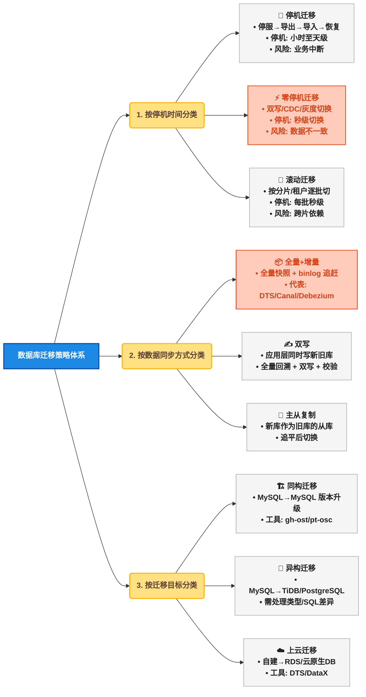
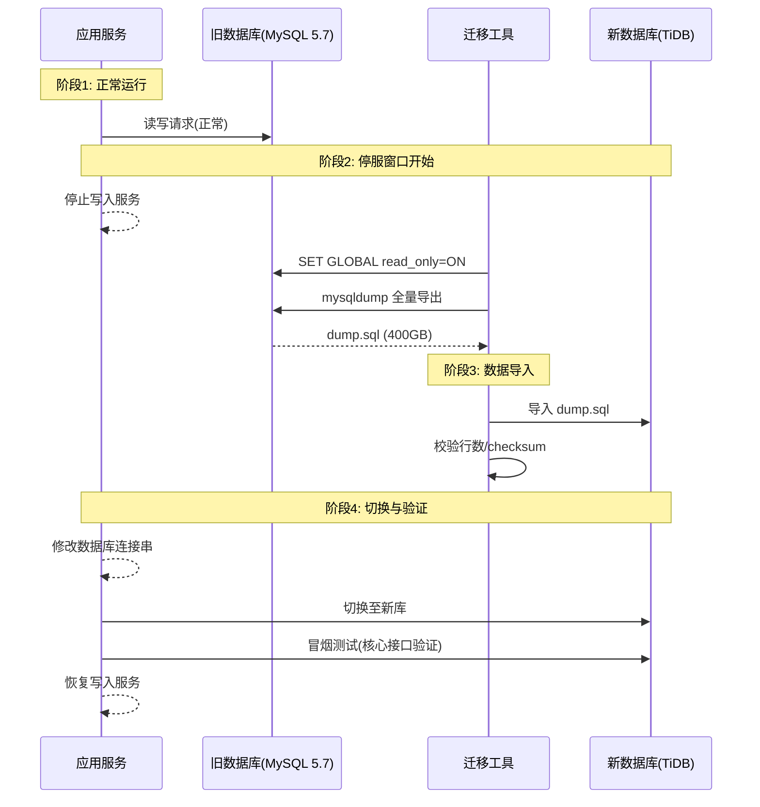
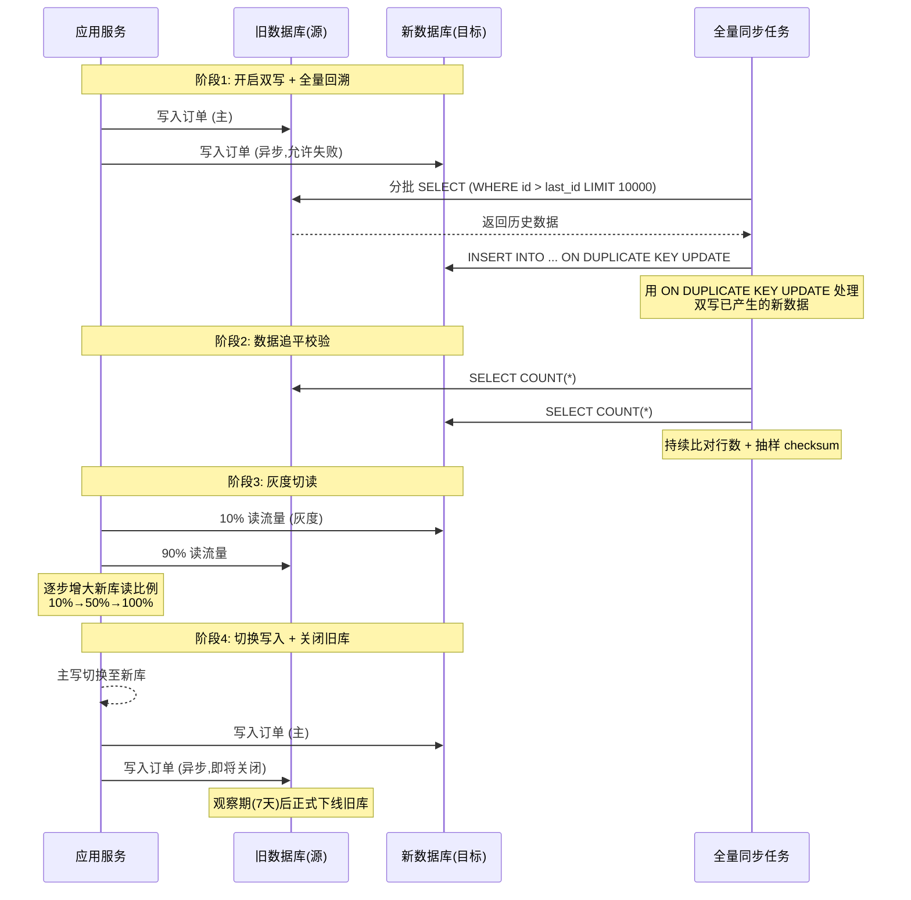
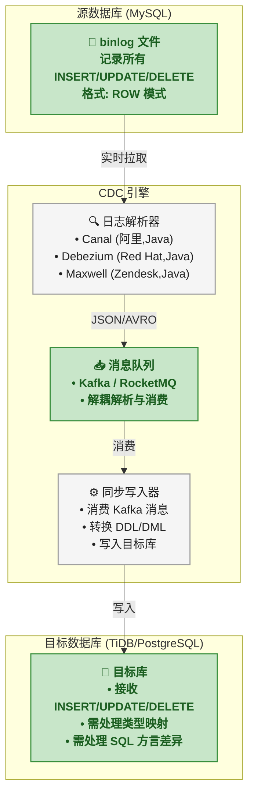
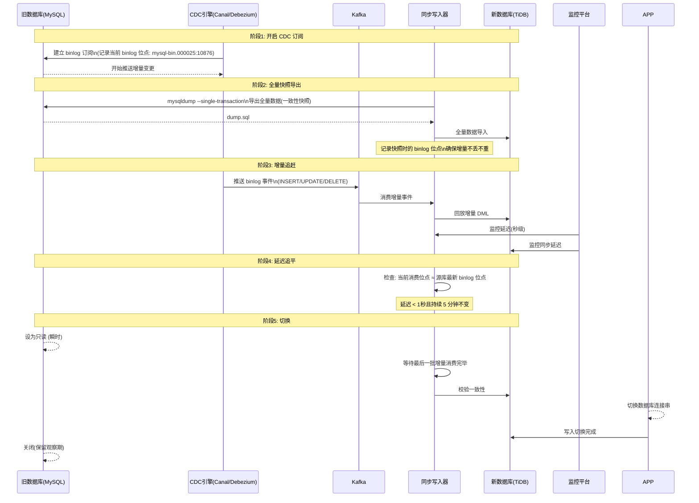
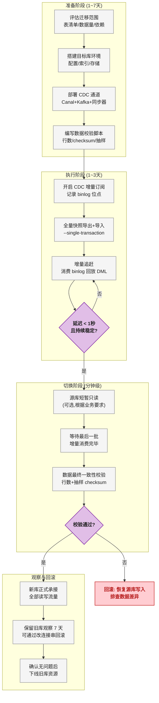
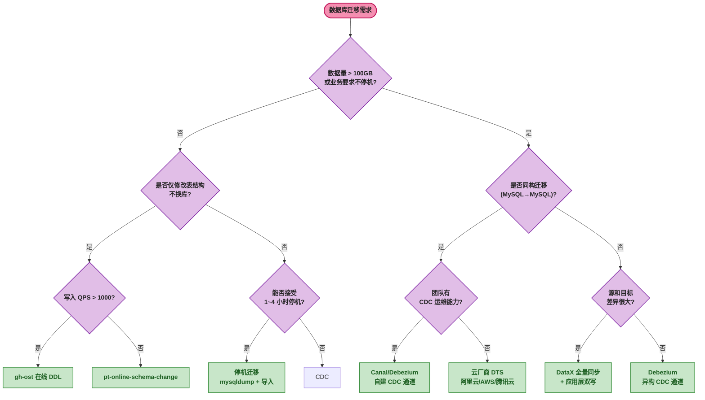
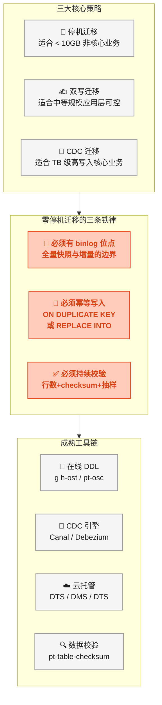

# 🗄️ 数据库迁移实战：不停机迁移方案、数据一致性保障与工具选型全解析

## 从一个凌晨 3 点的故障说起

某电商平台的订单表  `orders`  有 2.3 亿行数据，运行在 MySQL 5.7 上，单表体积接近 400GB。团队计划将这张表迁移到 TiDB 分布式数据库，以应对即将到来的双十一流量峰值。

DBA 团队的迁移方案是：

1. 凌晨 2 点，停止所有写入服务
2. 用  `mysqldump`  导出全量数据（耗时 1 小时 20 分钟）
3. 将 dump 文件导入 TiDB（耗时 3 小时）
4. 凌晨 6 点 20 分，恢复写入服务

结果：凌晨 4 点 30 分，dump 文件导入到一半时报错——导出文件中有 3 行数据包含 MySQL 5.7 特有的  `utf8mb4_general_ci`  排序规则下的隐藏字符，TiDB 解析失败。此时 MySQL 5.7 已被设置为只读，TiDB 导入中断， **整个订单系统处于不可用状态** 。

最终临时回滚 MySQL 只读限制，恢复业务。迁移失败，双十一扩容计划延期。

这次故障暴露了数据库迁移中的核心难题：<span style="color:red">如何在保证数据一致性的前提下，尽可能缩短甚至消除停机时间，并且始终保留可靠的回滚路径。</span>

## 数据库迁移策略总览

数据库迁移不是单一操作，而是一整套工程方法论。先通过思维导图建立全局认知：



三类策略并非互斥——零停机迁移通常是"双写 + 全量快照 + 增量追赶 + 灰度切换"的组合。

## 停机迁移：最原始但最安全

停机迁移（Downtime Migration）是所有复杂方案的基础,也是理解迁移本质的起点。



### 💰 停机迁移的代价量化

| 数据量 | 导出耗时 | 导入耗时 | 总停机 | 可接受场景 |
|:---:|:---:|:---:|:---:|------|
| < 1GB | < 1 分钟 | < 1 分钟 | < 5 分钟 | 内部管理系统、开发环境 |
| 1 ~ 10GB | 2 ~ 10 分钟 | 5 ~ 20 分钟 | 10 ~ 30 分钟 | 非核心业务、可发布公告的维护窗口 |
| 10 ~ 100GB | 10 ~ 60 分钟 | 20 分钟 ~ 3 小时 | 1 ~ 4 小时 | 需与业务方协商维护窗口 |
| > 100GB | 1 ~ 4 小时 | 3 ~ 12 小时 | 4 ~ 16 小时 | <span style="color:red">停机迁移不可行，必须零停机方案</span> |

### ⚠️ 停机迁移的核心风险

迁移期间的新增数据是停机迁移的致命问题。停服窗口内用户产生的业务数据（如下单、支付）要么丢失，要么需要事后补录。补录过程往往比迁移本身更复杂——需要通过日志恢复、手动录入或临时队列重放，出错率远高于正常业务流程。

## 双写迁移：应用层同步

双写（Dual Write）是零停机迁移中最常用的模式，核心思路是： **应用层同时向新旧两个数据库写入，全量数据通过定时任务逐步回溯，待数据追平后切换读流量，最后摘除旧库。**



### ✏️ 双写的关键设计点

**（1）双写时序问题**

双写最大的陷阱是写入顺序。如果先写新库再写旧库，新库写入成功而旧库失败时，数据不一致的方向难以处理。推荐策略：

| 写入顺序 | 失败处理 | 优劣 |
|------|------|------|
| <span style="color:red">先旧后新</span>（推荐） | 旧库失败→直接报错，不写新库；旧库成功、新库失败→记录补偿队列 | 旧库始终是真实数据源，任何时刻终止双写都不会丢数据 |
| 先新后旧 | 新库失败→不写旧库；新库成功、旧库失败→需要反向补偿 | 切换后新库是主库，但迁移期间旧库可能缺数据 |

**（2）全量回溯的并发控制**

```sql
-- 使用游标分批读取，避免长事务锁表
SELECT * FROM orders
WHERE id > @last_id AND created_at < '2024-12-01 00:00:00'
ORDER BY id ASC
LIMIT 10000;

-- 写入新库时使用幂等语义
INSERT INTO orders_new (...) VALUES (...)
ON DUPLICATE KEY UPDATE
    amount = VALUES(amount),
    status = VALUES(status),
    updated_at = VALUES(updated_at);
```

全量回溯必须使用  `WHERE id > @last_id`  游标分页而非  `LIMIT offset, size` ，因为 offset 分页在扫描大表时性能呈线性衰减——offset 1000 万时需要扫描并丢弃前 1000 万行。

**（3）数据校验**

双写期间必须持续校验数据一致性。校验维度包括：

| 校验维度 | 方法 | 频率 |
|------|------|------|
| 行数对账 | `SELECT COUNT(*)`  两边比对 | 每 10 分钟 |
| 抽样校验 | 随机抽取 1000 行，逐字段比对 MD5 | 每 30 分钟 |
| 全量校验 | `pt-table-checksum`  或自研 CRC32 比对 | 每日凌晨 |
| 实时校验 | 读取 binlog，对比新旧库写入结果 | 持续 |

## CDC 增量同步：基于日志的零侵入迁移

CDC（Change Data Capture，变更数据捕获）通过解析数据库的二进制日志（binlog/WAL），将增量变更实时同步到目标库，是零停机迁移的核心基础设施。

### 🔄 CDC 工作原理



### 🚀 完整 CDC 迁移流程



### 🛠️ CDC 工具的 binlog 位点管理

CDC 迁移的核心难点之一是位点管理——必须精确记录全量快照对应的 binlog 位点，确保增量数据既不丢失也不重复。具体做法是：

1. 开启  `--single-transaction`  导出全量快照时，同时执行  `SHOW MASTER STATUS`  记录位点
2. CDC 引擎从该位点开始消费 binlog
3. 全量导入完成后，CDC 产生的增量事件包含了快照之后的所有变更
4. 目标库使用幂等写入（ `REPLACE INTO`  或  `ON DUPLICATE KEY UPDATE` ），即便部分事件与全量有重叠也不会导致数据错误

```sql
-- 全量导出前记录位点（在同一事务中）
START TRANSACTION WITH CONSISTENT SNAPSHOT;
SHOW MASTER STATUS;
-- 输出: mysql-bin.000025 | 10876 | orders_db
-- 然后执行全量 SELECT 导出...
COMMIT;
```

## 零停机迁移的完整工程方案

将前几节的技术组合成一个完整的、经过生产验证的零停机迁移方案。

### 🏗️ 整体架构



### ⏱️ 各阶段耗时与风险

| 阶段 | 典型耗时 | 是否影响业务 | 主要风险 |
|------|:---:|:---:|------|
| 准备阶段 | 1 ~ 7 天 | 否 | 目标库规格选错、索引遗漏 |
| 全量快照 | 1 ~ 12 小时 | 否（ `--single-transaction`  不加锁） | 源库磁盘 I/O 压力 |
| 增量追赶 | 1 ~ 24 小时 | 否 | binlog 积压、消费延迟 |
| 数据校验 | 30 分钟 ~ 2 小时 | 否 | 校验脚本 bug 导致误报 |
| 切换瞬间 | **< 30 秒** | <span style="color:red">是（只读 30 秒或秒级闪断）</span> | 连接池切换、DNS 缓存、数据不完整 |
| 观察期 | 3 ~ 7 天 | 否 | 性能退化、隐藏的数据不一致 |

## 迁移中的数据一致性保障

数据一致性是迁移成败的最终判定标准。常用校验方法如下：

### ⚖️ 校验方法对比

| 校验方法 | 原理 | 对源库影响 | 准确度 | 适用数据量 |
|------|------|:---:|:---:|:---:|
| 行数对账 | `SELECT COUNT(*)`  比对 | 大表全表扫描，影响大 | 低（行数相同不代表数据相同） | < 100 万行 |
| `CHECKSUM TABLE` | MySQL 内置的 CRC32 校验 | 全表扫描 | 中（不同数据可能碰撞） | < 1000 万行 |
| `pt-table-checksum` | 分块 CRC32 比对，结果写入校验表 | 低（分块执行，每次只锁少量行） | 高 | 任意 |
| 自研抽样 MD5 | `SELECT MD5(GROUP_CONCAT(COLUMNS)) FROM (SELECT * LIMIT 1000 OFFSET N)` | 极低 | 中（采样误差） | 任意 |
| 全量逐行比对 | 两边按主键排序后逐行对比 | 极高 | 100% | < 100 万行 |

### 🔍 pt-table-checksum 核心原理

Percona Toolkit 中的  `pt-table-checksum`  是业界最成熟的数据校验工具。它的核心思路是：

1. 将大表按主键分成多个 chunk（每个 chunk 默认 1000 行）
2. 对每个 chunk 计算 CRC32 checksum
3. 将源库的 checksum 结果通过  `REPLACE INTO`  写入目标库的  `percona.checksums`  表
4. 在目标库上执行同样的 checksum 计算，比对结果

这种"分块 + 写入校验表"的设计确保了校验过程中不会长时间锁表，对线上业务影响极小。

```sql
-- pt-table-checksum 在校验表中写入的结果结构
-- 源库执行后，percona.checksums 表中会写入:
-- db | tbl | chunk | chunk_time | chunk_index | lower_boundary | upper_boundary | this_crc | this_cnt | master_crc | master_cnt
-- 其中 this_crc/master_crc 分别代表从库和主库的 CRC 值
-- 通过比对 this_crc != master_crc 发现不一致的 chunk
```

## 在线 DDL 变更：gh-ost 与 pt-online-schema-change

数据库迁移不限于跨实例迁移。同一实例内的表结构变更（如加字段、改索引、改字符集）同样需要零停机。MySQL 原生的  `ALTER TABLE`  会锁表，无法在生产环境直接使用。

### 🏗️ 两种工具的架构对比


### ⚖️ gh-ost 与 pt-osc 的多维对比

| 对比维度 | gh-ost (GitHub) | pt-online-schema-change (Percona) |
|------|------|------|
| 增量同步方式 | 解析 binlog（异步，不影响源库） | 触发器（同步，额外写入开销） |
| 对源库影响 | 低（仅全量读取） | 中（触发器增加写入延迟 5% ~ 15%） |
| 暂停/恢复 | 支持随时暂停、断点续传 | 不支持暂停 |
| 外键支持 | 不支持（需要先删除外键） | 部分支持 |
| 触发器中风险 | 无触发器 | 触发器与业务触发器冲突 |
| 切换方式 | 原子 RENAME（或手动） | 原子 RENAME |
| 流量控制 | 内置 throttling | 需手动配置  `--max-load` |
| 适用场景 | 高并发写入的核心业务表 | 一般业务表（写入量不大） |

**推荐决策** ：如果表的写入 QPS 超过 1000，优先选择 gh-ost，因为触发器带来的额外写入开销在高并发场景下可能引发源库性能问题。

## 云厂商 DTS：托管迁移服务

对于不想自建 CDC 管道的团队，云厂商的 DTS（Data Transmission Service，数据传输服务）是成熟的选择。以下是主流云厂商 DTS 能力对比：

| 能力 | 阿里云 DTS | AWS DMS | 腾讯云 DTS | Google Cloud DMS |
|------|------|------|------|------|
| 同构迁移（MySQL→MySQL） | 支持 | 支持 | 支持 | 支持 |
| 异构迁移（MySQL→PG） | 支持 | 支持 | 支持 | 支持 |
| 全量+增量 | 支持 | 支持 | 支持 | 支持 |
| 双向同步 | 支持 | 不支持 | 支持 | 不支持 |
| 数据校验 | 内置（行数+全量） | 内置（CDC 校验） | 内置 | 待发布 |
| 断点续传 | 支持 | 支持 | 支持 | 支持 |
| 过滤/转换 | 支持（SQL 表达式） | 支持（Mapping Rule） | 支持 | 支持（Column Mapping） |
| 价格模型 | 按链路规格+时长 | 按实例+传输量 | 按链路+时长 | 按传输量 |

### ⚠️ 云 DTS 的局限

1. **黑盒问题** ：DTS 内部实现不透明，遇到同步延迟或丢数据时，排查手段有限
2. **DDL 同步受限** ：大多数 DTS 不支持 DDL 自动同步（如  `ALTER TABLE` ），需要手动在目标库执行
3. **SQL 兼容性** ：异构迁移时，源库特有的 SQL 语法（如 MySQL 的  `ON DUPLICATE KEY UPDATE` ）可能无法同步
4. **成本** ：大规模迁移（TB 级）的 DTS 费用可能达到数千到数万元

## 迁移中的常见陷阱与应对

### 🕳️ 陷阱一：全量快照期间的写入丢失

**问题** ：使用  `mysqldump`  不加  `--single-transaction`  或未使用  `--master-data`  记录位点。

**应对** ：

```bash
#  正确的全量导出命令
mysqldump \
  --single-transaction \          # InnoDB 一致性快照，不加锁
  --master-data=2 \               # 记录 binlog 位点(注释形式)
  --quick \                       # 逐行读取而非全量缓存
  --routines \                    # 包含存储过程和函数
  --triggers \                    # 包含触发器
  --databases orders_db \
  > /backup/dump.sql
```

**关键参数解释** ：
- `--master-data=2` ：在 dump 文件中以注释形式写入  `CHANGE MASTER TO MASTER_LOG_FILE='...', MASTER_LOG_POS=...` ，CDC 引擎启动时从该位点消费
- `--single-transaction` ：开启一个 REPEATABLE READ 事务，确保全量数据是基于同一快照，且不阻塞写入
- `--quick` ：不将结果集缓存到内存，直接逐行输出，避免 OOM

### 🕳️ 陷阱二：自增 ID 冲突

**问题** ：目标库新建后自增 ID 从 1 开始，与源库导入的历史数据 ID 可能冲突。更严重的是，双写期间旧库和新库各自独立生成自增 ID，可能产生相同的 ID 值。

**应对** ：双写开始前，将目标库的自增起始值跳过大段偏移量：

```sql
-- 在目标库上预留 ID 空间，避免与源库未来分配冲突
ALTER TABLE orders AUTO_INCREMENT = 500000000;
-- 比源库当前最大 id (假设 3.2 亿) 大得多
```

### 🕳️ 陷阱三：字符集与排序规则差异

**问题** ：MySQL 5.7 默认  `utf8mb4_general_ci` ，MySQL 8.0 默认  `utf8mb4_0900_ai_ci`——排序权重表不同，导致  `ORDER BY`  结果不一致、唯一索引冲突判断不同。

**应对** ：迁移前在目标库显式指定与源库完全一致的排序规则：

```sql
-- 检查源库的字符集和排序规则
SHOW CREATE TABLE orders;

-- 在目标库上创建时显式指定
CREATE TABLE orders (
    ...
) ENGINE=InnoDB DEFAULT CHARSET=utf8mb4 COLLATE=utf8mb4_general_ci;
```

### 🕳️ 陷阱四：大事务导致的同步延迟

**问题** ：源库上执行了一个更新 1000 万行的大事务（如批量更新订单状态），CDC 引擎消费这个 binlog 事件时需要回放同样规模的操作，导致同步延迟急剧增加。

**应对** ：
1. 迁移期间冻结大事务操作（DBA 协作）
2. CDC 消费端开启并行回放（按表/按主键 hash 分区并行写入）
3. 监控延迟告警阈值设为 5 秒，超过则暂停迁移

## 成熟产品与工具速查

| 工具 | 用途 | 开发方 | 开源/商业 | 核心能力 |
|------|------|------|:---:|------|
| [gh-ost](https://github.com/github/gh-ost) | MySQL 在线 DDL | GitHub | 开源 | 无触发器改表、可暂停、流量控制 |
| [pt-online-schema-change](https://www.percona.com/doc/percona-toolkit/) | MySQL 在线 DDL | Percona | 开源 | 触发器方式改表、功能全面 |
| [Canal](https://github.com/alibaba/canal) | MySQL binlog 解析 | 阿里巴巴 | 开源 | 伪装成 MySQL 从库，解析 binlog |
| [Debezium](https://debezium.io/) | 多源 CDC | Red Hat | 开源 | 支持 MySQL/PG/MongoDB/Oracle，输出 Kafka |
| [Maxwell](https://maxwells-daemon.io/) | MySQL binlog→JSON | Zendesk | 开源 | 轻量 binlog 解析输出 JSON |
| [DataX](https://github.com/alibaba/DataX) | 异构数据源同步 | 阿里巴巴 | 开源 | 支持 20+ 数据源，全量同步 |
| [阿里云 DTS](https://www.aliyun.com/product/dts) | 云托管迁移 | 阿里云 | 商业 | 全量+增量、双向同步、数据校验 |
| [AWS DMS](https://aws.amazon.com/dms/) | 云托管迁移 | AWS | 商业 | 支持异构迁移、CDC、持续同步 |
| [pt-table-checksum](https://www.percona.com/doc/percona-toolkit/) | 数据一致性校验 | Percona | 开源 | 分块 CRC 校验，对业务影响极低 |

## 迁移方案决策树

根据具体的迁移场景选择合适策略：



## 🎯 总结



### 📌 核心要点速查

| 要点 | 一句话总结 |
|------|------|
| 迁移的本质 | 是在"停机时间"、"数据一致性"、"实施复杂度"三者之间的权衡 |
| 零停机的关键 | 全量快照 + 增量追赶（CDC/双写）+ 数据校验 + 原子切换 |
| CDC vs 双写 | CDC 零侵入但需运维基础设施；双写侵入应用但实现简单 |
| 数据校验 | 迁移必须持续校验，不能只靠行数对账——`pt-table-checksum`  是标准方案 |
| 在线 DDL | gh-ost（binlog 方式，高性能表）> pt-osc（触发器方式，一般表） |
| 灰度切换 | 先切读、后切写；10%→50%→100% 逐步放大；保留旧库观察 7 天 |
| 回滚原则 | 任何步骤之前必须有可立即执行的回滚方案——"先想怎么回去，再想怎么过去" |
| 云厂商 DTS | 适合不想自建 CDC 的团队，但有黑盒问题——遇到故障排查困难 |
